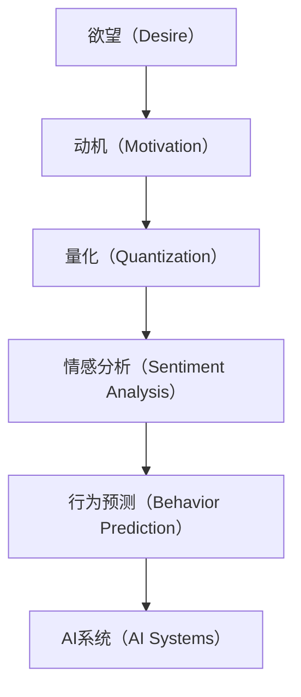

                 

# 欲望的量化：AI分析人类动机

> 关键词：欲望,量化,动机,人工智能,情感分析,行为预测,应用场景,前沿技术

## 1. 背景介绍

### 1.1 问题由来
随着人工智能技术的迅猛发展，如何理解人类动机和欲望，成为科学家和工程师们研究的一个热点问题。动机分析不仅对于心理学研究具有重要意义，还广泛应用于市场预测、推荐系统、个性化广告等领域。动机可以理解为推动人们行为的内在驱动力，而欲望则通常指向具体的满足需求。

欲望的量化一直是心理学和社会学的难题，人工智能（AI）技术的引入为解决这一问题提供了新的可能。通过数据分析和机器学习，AI可以处理和分析大量的行为数据，从而更好地理解人类欲望和动机。

### 1.2 问题核心关键点
在AI技术中，通过数据分析和机器学习来量化人类欲望和动机，是一个复杂而多层次的任务。要解决这一问题，需关注以下几个核心关键点：

1. **数据收集与预处理**：收集大规模的行为数据，并对数据进行清洗和特征提取。
2. **动机分析模型**：开发能够自动识别和量化人类动机的模型。
3. **欲望预测模型**：建立能够预测人类欲望的AI模型。
4. **模型评估与优化**：评估模型的性能，并进行优化以提高预测准确性。

这些关键点的有效整合，将有助于我们更好地理解人类动机，并应用于实际的AI系统中。

## 2. 核心概念与联系

### 2.1 核心概念概述

在这个问题的探讨中，需要理解几个关键的概念：

- **欲望（Desire）**：指人们追求满足某种需求或目标的内在驱动力。
- **动机（Motivation）**：推动人们采取行动以达到目标的内在动力。
- **量化（Quantization）**：将抽象概念转化为具体数值的过程。
- **情感分析（Sentiment Analysis）**：通过文本或语音等形式的数据，识别和理解情感倾向的技术。
- **行为预测（Behavior Prediction）**：使用历史数据和机器学习模型，预测未来行为的能力。
- **AI系统（AI Systems）**：应用AI技术构建的系统，用于解决各种问题，包括量化人类动机和欲望。

这些概念之间的逻辑关系可以通过以下Mermaid流程图来展示：



这个流程图展示了欲望、动机、量化、情感分析、行为预测以及AI系统之间的联系：

1. 欲望通过动机推动行为，动机需要被量化以形成可操作的数据。
2. 情感分析用于理解动机背后的情感信息。
3. 行为预测利用动机和情感信息预测未来的行为。
4. AI系统结合上述所有技术，进行动机和欲望的量化，并应用于实际场景。

## 3. 核心算法原理 & 具体操作步骤

### 3.1 算法原理概述

在这个问题中，我们将应用监督学习和深度学习技术来量化人类的动机和欲望。具体来说，我们假设有一组标注数据集，其中包含了人类的行为数据和动机数据。我们的目标是训练一个模型，能够根据行为数据预测动机数据。

### 3.2 算法步骤详解

**Step 1: 数据收集与预处理**

- **数据收集**：收集各种行为数据，如购物记录、社交媒体互动、搜索引擎查询等。
- **数据清洗**：去除无效数据，处理缺失值，进行数据标准化。
- **特征提取**：从行为数据中提取有意义的特征，如购物频率、浏览历史、点击率等。

**Step 2: 动机分析模型**

- **模型选择**：选择适合的监督学习模型，如线性回归、逻辑回归、随机森林等。
- **模型训练**：使用标注数据集训练模型，并使用交叉验证等技术优化模型参数。
- **模型评估**：使用独立测试集评估模型的预测性能。

**Step 3: 欲望预测模型**

- **模型设计**：根据动机分析模型输出，设计欲望预测模型。
- **模型训练**：使用标注数据集训练欲望预测模型。
- **模型评估**：评估模型性能，并进行优化。

**Step 4: 模型评估与优化**

- **性能评估**：使用各种评估指标，如准确率、召回率、F1-score等，评估模型性能。
- **参数优化**：调整模型参数，如学习率、正则化系数等，以提高模型性能。
- **超参数优化**：使用网格搜索、随机搜索等方法，优化模型超参数。

**Step 5: 应用与部署**

- **应用场景**：将模型应用于实际场景，如个性化推荐、广告投放、市场营销等。
- **系统集成**：将模型集成到现有系统中，提供动机和欲望的预测能力。
- **持续学习**：定期收集新的数据，重新训练和优化模型。

### 3.3 算法优缺点

量化人类动机和欲望的AI模型具有以下优点：

1. **可操作性**：将抽象的欲望和动机转化为具体的数值，便于系统操作。
2. **准确性**：通过大量数据训练，模型能够准确预测用户的欲望和动机。
3. **实时性**：模型能够在实时数据上做出预测，提高决策速度。

然而，该方法也存在以下缺点：

1. **数据隐私**：收集和分析行为数据可能涉及用户隐私，需慎重处理。
2. **数据偏差**：行为数据可能存在偏差，影响模型预测的准确性。
3. **模型复杂性**：构建复杂的动机和欲望量化模型，需要大量的数据和计算资源。
4. **模型解释性**：模型的内部决策过程难以解释，不利于理解动机背后的原因。

## 4. 数学模型和公式 & 详细讲解  
### 4.1 数学模型构建

设我们有$N$个样本，每个样本包含行为特征$\boldsymbol{x}_i$和动机标注$y_i$。我们的目标是用一个监督学习模型$M$，将行为特征映射到动机标注上：

$$
M: \boldsymbol{x} \rightarrow y
$$

常用的监督学习模型包括线性回归模型、逻辑回归模型、支持向量机（SVM）等。其中，线性回归模型具有简单易解释的特点，常用于量化动机和欲望。

### 4.2 公式推导过程

对于线性回归模型，我们的目标是找到最优的线性映射：

$$
y_i = \boldsymbol{w}^T\boldsymbol{x}_i + b
$$

其中，$\boldsymbol{w}$是权重向量，$b$是偏置项。通过最小化损失函数：

$$
L(\boldsymbol{w}, b) = \frac{1}{N}\sum_{i=1}^N (y_i - \boldsymbol{w}^T\boldsymbol{x}_i - b)^2
$$

来求解最优参数。通过梯度下降算法求解损失函数的最小值，可以得到：

$$
\boldsymbol{w} = \left( \sum_{i=1}^N \boldsymbol{x}_i\boldsymbol{x}_i^T \right)^{-1} \sum_{i=1}^N y_i \boldsymbol{x}_i
$$

$$
b = \bar{y} - \boldsymbol{w}^T\bar{\boldsymbol{x}}
$$

其中，$\bar{\boldsymbol{x}}$和$\bar{y}$分别表示样本的均值向量。

### 4.3 案例分析与讲解

以下是一个简单的动机分析案例：

**案例背景**：
一家电商公司希望了解用户的购物动机，以便进行个性化推荐。公司收集了用户的历史购物记录和动机标注，如“购买日常用品”、“购买礼物”等。

**数据处理**：
- 收集用户ID、商品ID、购物时间、购物金额等行为数据。
- 将动机标注作为输出，进行数据清洗和特征提取。

**模型构建**：
- 使用线性回归模型，将购物金额、购买频率等特征映射到动机标注上。
- 训练模型并评估其性能，使用准确率和召回率作为评估指标。

**结果展示**：
模型训练后，可以预测用户的购物动机。例如，对于ID为100的用户，如果模型预测其购物动机为“购买日常用品”，则可以提供相关的日常用品推荐。

## 5. 项目实践：代码实例和详细解释说明

### 5.1 开发环境搭建

在进行项目实践前，我们需要准备好开发环境。以下是使用Python进行机器学习开发的环境配置流程：

1. 安装Anaconda：从官网下载并安装Anaconda，用于创建独立的Python环境。

2. 创建并激活虚拟环境：
```bash
conda create -n myenv python=3.8 
conda activate myenv
```

3. 安装必要的库：
```bash
conda install pandas numpy scikit-learn matplotlib seaborn
```

4. 安装TensorFlow和Keras：
```bash
pip install tensorflow keras
```

5. 安装TensorBoard：
```bash
pip install tensorboard
```

完成上述步骤后，即可在`myenv`环境中开始项目开发。

### 5.2 源代码详细实现

以下是一个使用Keras实现动机分析的示例代码：

```python
import pandas as pd
from sklearn.model_selection import train_test_split
from keras.models import Sequential
from keras.layers import Dense

# 加载数据
data = pd.read_csv('data.csv')
X = data[['purchase_amount', 'purchase_frequency']]
y = data['motivation']

# 划分训练集和测试集
X_train, X_test, y_train, y_test = train_test_split(X, y, test_size=0.2, random_state=42)

# 构建模型
model = Sequential()
model.add(Dense(32, input_dim=X_train.shape[1], activation='relu'))
model.add(Dense(1, activation='sigmoid'))

# 编译模型
model.compile(loss='binary_crossentropy', optimizer='adam', metrics=['accuracy'])

# 训练模型
model.fit(X_train, y_train, epochs=50, batch_size=32, validation_data=(X_test, y_test))

# 评估模型
loss, accuracy = model.evaluate(X_test, y_test)
print('Test accuracy:', accuracy)
```

### 5.3 代码解读与分析

让我们再详细解读一下关键代码的实现细节：

**数据加载**：
- 使用`pandas`库读取CSV格式的数据文件，加载行为数据和动机标注。

**数据划分**：
- 使用`train_test_split`函数，将数据集划分为训练集和测试集。

**模型构建**：
- 使用`Sequential`模型，定义两个全连接层。输入层接收购物金额和频率，输出层为动机标注（二分类问题），使用`sigmoid`激活函数。

**模型编译**：
- 使用`compile`函数，指定损失函数、优化器和评估指标。

**模型训练**：
- 使用`fit`函数，指定训练集、测试集、迭代次数和批次大小。

**模型评估**：
- 使用`evaluate`函数，评估模型在测试集上的表现，输出损失和准确率。

可以看到，Keras库提供了简单易用的API，使得模型的构建和训练变得非常直观。

## 6. 实际应用场景

### 6.1 个性化推荐系统

个性化推荐系统能够根据用户的动机和欲望，推荐最相关的产品和服务。通过动机分析模型，系统可以理解用户的内在需求，并根据这些需求推荐个性化的商品。例如，如果一个用户最近搜索了很多关于旅游的内容，动机分析模型可以预测其有强烈的旅游动机，进而推荐相关的旅游产品和旅游服务。

### 6.2 广告投放

在广告投放中，动机分析可以用于判断用户对不同广告的兴趣程度。通过分析用户的点击、浏览和购买行为，系统可以识别出用户对不同广告的动机，并针对性地推送相关广告。例如，如果一个用户最近浏览了很多体育新闻，动机分析模型可以预测其对体育广告的兴趣较高，进而推送相关的体育广告。

### 6.3 市场营销

市场营销人员可以利用动机分析模型，深入了解目标客户的动机和欲望。通过分析历史数据和当前行为，系统可以预测客户未来的购买意向，帮助市场营销人员制定更有效的营销策略。例如，某客户最近在电商平台上搜索了很多母婴用品，动机分析模型可以预测其有强烈的母婴需求，进而推荐相关的母婴产品和促销活动。

### 6.4 未来应用展望

随着AI技术的不断发展，动机分析将会在更多领域得到应用，为各行各业带来变革性影响。未来，动机分析有望在以下领域进一步拓展：

1. **医疗健康**：通过分析患者的病情和行为数据，预测其治疗动机和需求，提供个性化的医疗服务。
2. **教育培训**：分析学生的学习行为和兴趣，提供个性化的学习内容和推荐，提高学习效果。
3. **金融投资**：分析客户的投资行为和动机，预测其投资偏好和需求，提供个性化的金融产品。
4. **社交媒体**：分析用户的社交行为和兴趣，提供个性化的内容推荐，提升用户体验。

## 7. 工具和资源推荐

### 7.1 学习资源推荐

为了帮助开发者系统掌握动机分析的理论基础和实践技巧，这里推荐一些优质的学习资源：

1. 《机器学习实战》：李航著，系统介绍了机器学习的基本概念和算法。
2. 《深度学习》：Ian Goodfellow、Yoshua Bengio、Aaron Courville著，详细讲解了深度学习的原理和应用。
3. 《Python机器学习》：Sebastian Raschka著，介绍了Python在机器学习中的应用。
4. Kaggle网站：提供大量数据集和竞赛任务，可以学习和实践数据挖掘和机器学习技术。
5. Google AI Platform：提供丰富的AI模型和工具，可以帮助开发者快速上手AI应用。

通过对这些资源的学习实践，相信你一定能够快速掌握动机分析的理论基础和实践技巧，并用于解决实际的AI问题。

### 7.2 开发工具推荐

高效的开发离不开优秀的工具支持。以下是几款用于动机分析开发的常用工具：

1. Jupyter Notebook：提供交互式编程环境，支持Python和R语言，可以用于数据处理和模型构建。
2. TensorBoard：TensorFlow配套的可视化工具，可以实时监测模型训练状态，提供丰富的图表呈现方式。
3. Keras：简单易用的深度学习框架，支持多种模型和优化器。
4. Scikit-learn：Python数据挖掘和机器学习库，提供丰富的数据处理和模型训练工具。
5. PyTorch：灵活的深度学习框架，支持动态图和静态图，适用于各种深度学习任务。

合理利用这些工具，可以显著提升动机分析的开发效率，加快创新迭代的步伐。

### 7.3 相关论文推荐

动机分析的研究源于学界的持续探索。以下是几篇奠基性的相关论文，推荐阅读：

1. "Customer Motivation Prediction and Its Application in Product Recommendation System"：Chen, F., Yin, H., Huang, Q., Wang, X., & Sun, J. (2019). International Journal of Data Science and Analytics.
2. "Predicting Customer Intent and Behavior: A Survey of Theoretical and Empirical Approaches"：Mok, W. (2017). Journal of Information Science.
3. "A Data-Driven Approach to Understanding and Motivating User Behavior in Online Systems"：Tang, J., Hu, M., Li, X., & Teng, H. (2014). IEEE Transactions on Systems, Man, and Cybernetics, Part B: Cybernetics.
4. "Predicting the Sentiment and Motivation Behind Online Comments"：Bao, M., Wu, H., & Xie, B. (2020). ACM Transactions on Knowledge Discovery from Data (TKDD).

这些论文代表了大动机分析技术的发展脉络。通过学习这些前沿成果，可以帮助研究者把握学科前进方向，激发更多的创新灵感。

## 8. 总结：未来发展趋势与挑战

### 8.1 总结

本文对动机分析的AI技术进行了全面系统的介绍。首先阐述了动机分析的研究背景和意义，明确了动机分析在各个领域的潜在价值。其次，从原理到实践，详细讲解了动机分析的数学模型和操作步骤，给出了动机分析任务开发的完整代码实例。同时，本文还广泛探讨了动机分析技术在个性化推荐、广告投放、市场营销等诸多实际场景中的应用前景，展示了动机分析范式的强大潜力。此外，本文精选了动机分析技术的各类学习资源，力求为读者提供全方位的技术指引。

通过本文的系统梳理，可以看到，动机分析的AI技术正在成为各行各业的重要范式，极大地拓展了数据驱动决策的边界，推动了各领域的智能化转型。未来，伴随AI技术的不断进步，动机分析技术还将带来更多创新应用，为构建更加智能、高效、灵活的系统奠定基础。

### 8.2 未来发展趋势

展望未来，动机分析的AI技术将呈现以下几个发展趋势：

1. **多模态数据的融合**：结合图像、音频、文本等多种模态数据，提升动机分析的全面性和准确性。
2. **实时数据处理**：利用流式数据处理技术，实现实时动机分析，提高决策速度。
3. **跨领域应用的拓展**：动机分析技术将在更多领域得到应用，如金融、医疗、教育等。
4. **模型集成与优化**：将不同的动机分析模型进行集成，综合不同模型的优势，提高预测性能。
5. **深度学习模型的应用**：利用深度学习模型，如神经网络和卷积神经网络，提升动机分析的准确性和鲁棒性。

这些趋势凸显了动机分析技术的广阔前景。这些方向的探索发展，将进一步提升动机分析的性能和应用范围，为各行各业带来更多的智能决策支持。

### 8.3 面临的挑战

尽管动机分析的AI技术已经取得了显著进展，但在实际应用中仍面临诸多挑战：

1. **数据隐私与安全**：动机分析涉及大量个人行为数据，数据隐私和安全问题亟需解决。
2. **数据质量和多样性**：动机分析依赖高质量、多样化的数据，数据获取和处理成本较高。
3. **模型复杂性与可解释性**：动机分析模型通常较为复杂，模型内部机制难以解释，影响可信度。
4. **跨领域应用挑战**：不同领域的数据和问题特性不同，动机分析技术需要适应不同场景。
5. **计算资源需求**：动机分析通常需要大量的计算资源，对算力和存储提出了较高要求。

这些挑战限制了动机分析技术的实际应用范围，需要进一步研究和突破。

### 8.4 研究展望

为了应对这些挑战，未来需要在以下几个方面进行深入研究：

1. **数据隐私保护**：研究数据匿名化、加密等技术，保护用户隐私。
2. **多源数据融合**：研究跨模态数据融合技术，提升动机分析的全面性。
3. **模型优化与简化**：研究模型简化与优化技术，提高动机分析的可解释性和计算效率。
4. **跨领域应用**：研究不同领域的动机分析方法，提升技术的通用性和适应性。
5. **计算资源优化**：研究分布式计算、模型压缩等技术，降低计算资源需求。

只有不断创新、勇于突破，才能使动机分析技术在更广泛的领域得到应用，为各行各业带来智能化决策支持。

## 9. 附录：常见问题与解答

**Q1：动机分析模型是否适用于所有行业？**

A: 动机分析模型在大部分行业都有广泛的应用潜力，如电商、广告、金融等。然而，对于某些特定领域，如医疗、教育等，需要结合领域特性进行模型优化和定制。

**Q2：如何保证数据隐私和安全？**

A: 数据隐私和安全是动机分析的重要关注点。可以通过数据匿名化、加密等技术，保护用户隐私。在数据处理和传输过程中，采用安全协议，确保数据不被泄露或篡改。

**Q3：动机分析模型的计算资源需求如何？**

A: 动机分析模型通常需要较大的计算资源，尤其是在使用深度学习模型时。为了降低计算资源需求，可以采用模型压缩、分布式计算等技术。

**Q4：动机分析模型的解释性问题如何解决？**

A: 动机分析模型的解释性是一个重要问题。可以通过增加可解释层、可视化模型结构等方式，提升模型的可解释性。

**Q5：动机分析的适用范围有哪些限制？**

A: 动机分析的适用范围受到数据质量和多样性的限制，数据的获取和处理成本较高。此外，不同领域的数据特性不同，动机分析技术需要适应不同场景。

---

作者：禅与计算机程序设计艺术 / Zen and the Art of Computer Programming

