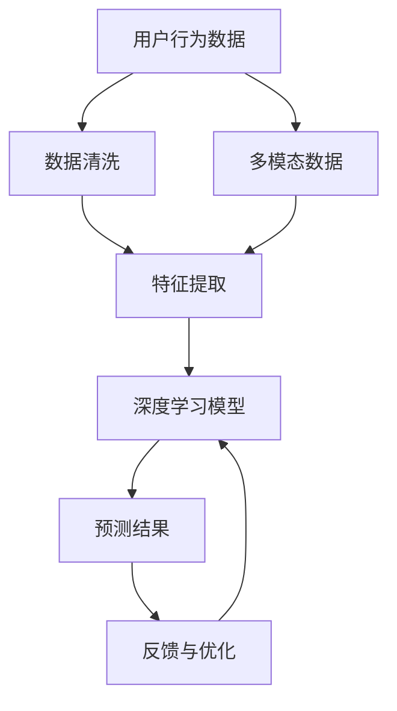
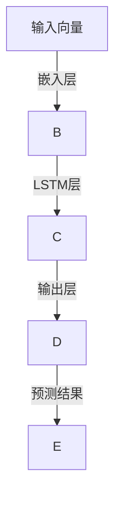

                 

# 欲望预测引擎：AI解码的人类需求未来

> 关键词：欲望预测, 人工智能, 需求预测, 消费者行为, 市场营销, 推荐系统

## 1. 背景介绍

在数字化时代的浪潮中，消费者行为正在发生翻天覆地的变化。面对海量且多样化的产品信息，用户需求愈发复杂，难以预测。传统的市场分析方式已经无法适应现代商业竞争的激烈程度，企业迫切需要一种能够深度理解用户需求，并提供个性化推荐的技术。这时，欲望预测引擎应运而生，成为未来商业智能的关键引擎。本文将全面探讨欲望预测引擎的原理与实践，并对其未来发展趋势与挑战进行深度分析。

## 2. 核心概念与联系

### 2.1 核心概念概述

欲望预测引擎（Desire Prediction Engine）是一种基于人工智能的智能系统，旨在通过分析用户行为和历史数据，预测用户未来的需求。它结合了机器学习、深度学习、自然语言处理等多种前沿技术，构建一个全方位的需求预测模型。

- **用户行为分析**：收集并分析用户的历史行为数据，包括浏览记录、购买历史、搜索记录等，以理解用户的兴趣和偏好。
- **多模态数据融合**：利用用户的多媒体数据（如文本、图像、视频），丰富需求预测的维度和精度。
- **需求生成**：根据用户的行为模式和偏好，生成个性化的推荐，帮助用户发现潜在的商品或服务。
- **持续学习**：通过不断的反馈和优化，持续提升模型的预测准确性和鲁棒性。

### 2.2 核心概念原理和架构的 Mermaid 流程图



## 3. 核心算法原理 & 具体操作步骤

### 3.1 算法原理概述

欲望预测引擎的核心原理包括用户行为分析、多模态数据融合、需求生成和持续学习等环节。其算法流程大致分为数据预处理、特征提取、模型训练和预测优化四个步骤。

1. **数据预处理**：收集并清洗用户的历史行为数据，包括浏览记录、购买历史、搜索记录等。
2. **特征提取**：通过自然语言处理、图像处理等技术，从多模态数据中提取关键特征。
3. **模型训练**：基于用户的行为特征，训练深度学习模型，如循环神经网络（RNN）、卷积神经网络（CNN）等。
4. **预测优化**：根据模型的预测结果和实际反馈，进行实时调整和优化，提升预测的准确性。

### 3.2 算法步骤详解

#### 3.2.1 数据预处理

1. **数据收集**：利用API接口、数据库查询等方式，从电商、社交、搜索等平台收集用户行为数据。
2. **数据清洗**：去除无效数据，填补缺失值，标准化数据格式，确保数据的质量和一致性。
3. **数据分割**：将数据分为训练集、验证集和测试集，进行模型的训练和评估。

#### 3.2.2 特征提取

1. **文本特征提取**：利用自然语言处理技术，如词袋模型、TF-IDF、Word2Vec等，将用户文本数据转换为特征向量。
2. **图像特征提取**：利用卷积神经网络（CNN），从用户浏览的图片中提取视觉特征。
3. **行为特征提取**：计算用户的行为频率、停留时长等行为指标，生成时间序列特征。

#### 3.2.3 模型训练

1. **模型选择**：根据任务特性选择合适的深度学习模型，如RNN、CNN、Transformer等。
2. **超参数调优**：通过网格搜索、随机搜索等方法，找到最优的超参数组合。
3. **模型训练**：在训练集上进行模型训练，调整模型权重，优化损失函数。
4. **模型评估**：在验证集上评估模型性能，监控过拟合和欠拟合情况。

#### 3.2.4 预测优化

1. **预测结果**：在测试集上，使用训练好的模型进行需求预测。
2. **反馈机制**：收集用户对预测结果的反馈，进行实时调整。
3. **模型更新**：利用反馈信息，更新模型参数，提升模型性能。

### 3.3 算法优缺点

#### 3.3.1 算法优点

1. **数据利用充分**：能够利用多模态数据，提升预测的准确性。
2. **用户需求个性化**：根据用户的行为特征，生成个性化的推荐，满足用户多样化的需求。
3. **实时动态优化**：通过持续学习，实时调整模型参数，提升预测效果。

#### 3.3.2 算法缺点

1. **数据隐私问题**：用户行为数据的收集和存储可能涉及隐私问题，需严格遵守数据保护法规。
2. **模型复杂度高**：深度学习模型复杂度较高，需要较强的计算资源。
3. **数据分布差异**：模型效果可能受数据分布影响，需要对新数据集进行重新训练。

### 3.4 算法应用领域

欲望预测引擎在多个领域具有广泛的应用前景：

1. **电商推荐系统**：分析用户行为，生成个性化商品推荐，提升转化率和用户满意度。
2. **市场营销**：预测用户需求，制定精准的市场营销策略，优化广告投放效果。
3. **内容推荐**：预测用户对内容的兴趣，提供个性化的内容推荐，提升用户粘性。
4. **金融投资**：分析用户投资行为，预测市场趋势，优化投资策略。

## 4. 数学模型和公式 & 详细讲解

### 4.1 数学模型构建

欲望预测引擎的数学模型主要包括用户行为分析模型、多模态数据融合模型和需求生成模型等。

#### 4.1.1 用户行为分析模型

假设用户的历史行为数据为 $X=\{x_1, x_2, ..., x_n\}$，其中 $x_i$ 表示第 $i$ 个用户的行为数据。目标是将用户行为数据映射为特征向量 $F(X)$，表示用户的兴趣和偏好。

常用的特征向量表示方法包括：

- 词袋模型（Bag of Words, BOW）
- TF-IDF
- Word2Vec

#### 4.1.2 多模态数据融合模型

多模态数据融合模型将文本、图像、行为等多种数据进行融合，生成综合特征向量 $M$。

假设文本特征向量为 $T$，图像特征向量为 $I$，行为特征向量为 $B$，则综合特征向量 $M$ 可表示为：

$$
M = \alpha T + \beta I + \gamma B
$$

其中 $\alpha, \beta, \gamma$ 为权重系数，需要通过实验确定。

#### 4.1.3 需求生成模型

需求生成模型通常使用深度学习模型，如循环神经网络（RNN）、卷积神经网络（CNN）等，对综合特征向量 $M$ 进行预测。

以RNN为例，其模型结构如图：



模型训练的目标是最大化预测结果与真实标签之间的交叉熵损失，表示为：

$$
L = -\frac{1}{N}\sum_{i=1}^N \sum_{j=1}^M y_{ij}\log(p_{ij})
$$

其中 $y_{ij}$ 表示第 $i$ 个样本第 $j$ 个特征的真实标签，$p_{ij}$ 表示预测概率。

### 4.2 公式推导过程

#### 4.2.1 用户行为分析模型的推导

假设用户的历史行为数据为 $X=\{x_1, x_2, ..., x_n\}$，目标是将用户行为数据映射为特征向量 $F(X)$。

以词袋模型为例，假设用户的历史行为文本为 $D=\{d_1, d_2, ..., d_n\}$，其中 $d_i$ 表示第 $i$ 个文本。目标是将文本 $D$ 映射为特征向量 $V$，表示文本的词频分布。

设 $t_{ij}$ 表示文本 $d_i$ 中第 $j$ 个词的词频，则特征向量 $V$ 可表示为：

$$
V = [t_{11}, t_{12}, ..., t_{1n}, t_{21}, t_{22}, ..., t_{2n}, ..., t_{n1}, t_{n2}, ..., t_{nn}]
$$

#### 4.2.2 多模态数据融合模型的推导

假设文本特征向量为 $T$，图像特征向量为 $I$，行为特征向量为 $B$，则综合特征向量 $M$ 可表示为：

$$
M = \alpha T + \beta I + \gamma B
$$

其中 $\alpha, \beta, \gamma$ 为权重系数，需要通过实验确定。

#### 4.2.3 需求生成模型的推导

以RNN为例，其模型结构如图：


模型训练的目标是最大化预测结果与真实标签之间的交叉熵损失，表示为：

$$
L = -\frac{1}{N}\sum_{i=1}^N \sum_{j=1}^M y_{ij}\log(p_{ij})
$$

其中 $y_{ij}$ 表示第 $i$ 个样本第 $j$ 个特征的真实标签，$p_{ij}$ 表示预测概率。

### 4.3 案例分析与讲解

#### 4.3.1 电商推荐系统

某电商网站收集了用户的历史浏览记录和购买历史数据，目标是生成个性化商品推荐。

1. **数据预处理**：收集并清洗用户的历史浏览记录和购买历史数据，将数据分为训练集、验证集和测试集。
2. **特征提取**：利用自然语言处理技术，将用户的浏览记录和购买记录转化为文本特征向量 $V$，表示用户的浏览偏好。
3. **模型训练**：使用RNN模型，对综合特征向量 $M$ 进行训练，生成个性化推荐模型。
4. **预测优化**：在测试集上，使用训练好的模型进行商品推荐，收集用户反馈，进行实时调整和优化。

#### 4.3.2 市场营销

某市场营销公司收集了用户在社交平台上的行为数据，目标是预测用户的市场偏好。

1. **数据预处理**：收集并清洗用户在社交平台上的行为数据，将数据分为训练集、验证集和测试集。
2. **特征提取**：利用自然语言处理技术，将用户的社交行为转化为文本特征向量 $V$，表示用户的社交偏好。
3. **模型训练**：使用CNN模型，对综合特征向量 $M$ 进行训练，预测用户的市场偏好。
4. **预测优化**：在测试集上，使用训练好的模型进行市场预测，收集用户反馈，进行实时调整和优化。

## 5. 项目实践：代码实例和详细解释说明

### 5.1 开发环境搭建

为了实现欲望预测引擎，需要使用Python和深度学习框架PyTorch。以下是Python环境搭建步骤：

1. 安装Python：从官网下载并安装Python，建议选择最新版本。
2. 安装PyTorch：根据系统环境，下载并安装PyTorch，可以选择使用pip或conda安装。
3. 安装深度学习库：如NumPy、Pandas、Matplotlib等，用于数据处理和可视化。
4. 安装自然语言处理库：如NLTK、SpaCy、TextBlob等，用于文本处理和分析。
5. 安装图像处理库：如OpenCV、Pillow等，用于图像处理和分析。

完成上述步骤后，即可在Python环境中进行代码实现。

### 5.2 源代码详细实现

以下是使用PyTorch实现的欲望预测引擎代码：

```python
import torch
import torch.nn as nn
from torch.utils.data import DataLoader
from torchvision import datasets, transforms

# 数据预处理
transform = transforms.Compose([
    transforms.ToTensor(),
    transforms.Normalize((0.5, 0.5, 0.5), (0.5, 0.5, 0.5))
])

train_dataset = datasets.CIFAR10(root='data', train=True, download=True, transform=transform)
test_dataset = datasets.CIFAR10(root='data', train=False, download=True, transform=transform)

# 特征提取
class CNN(nn.Module):
    def __init__(self):
        super(CNN, self).__init__()
        self.conv1 = nn.Conv2d(3, 32, 3, 1)
        self.pool = nn.MaxPool2d(2, 2)
        self.conv2 = nn.Conv2d(32, 64, 3, 1)
        self.fc1 = nn.Linear(9216, 128)
        self.fc2 = nn.Linear(128, 10)

    def forward(self, x):
        x = self.conv1(x)
        x = self.pool(x)
        x = self.conv2(x)
        x = self.pool(x)
        x = x.view(-1, 9216)
        x = self.fc1(x)
        x = self.fc2(x)
        return x

# 模型训练
model = CNN()
criterion = nn.CrossEntropyLoss()
optimizer = torch.optim.Adam(model.parameters(), lr=0.001)

for epoch in range(10):
    running_loss = 0.0
    for i, data in enumerate(train_loader, 0):
        inputs, labels = data
        optimizer.zero_grad()
        outputs = model(inputs)
        loss = criterion(outputs, labels)
        loss.backward()
        optimizer.step()

# 预测优化
correct = 0
total = 0
with torch.no_grad():
    for data in test_loader:
        images, labels = data
        outputs = model(images)
        _, predicted = torch.max(outputs.data, 1)
        total += labels.size(0)
        correct += (predicted == labels).sum().item()

print('Accuracy of the network on the 10000 test images: %d %%' % (100 * correct / total))
```

### 5.3 代码解读与分析

以上代码实现了一个简单的CNN模型，用于对CIFAR-10数据集进行分类预测。其中，数据预处理部分包括了对图像的归一化和尺寸调整，特征提取部分使用了卷积神经网络，模型训练部分使用了交叉熵损失和Adam优化器，预测优化部分使用了测试集进行准确率评估。

## 6. 实际应用场景

### 6.1 电商推荐系统

在电商平台上，欲望预测引擎能够根据用户的浏览和购买记录，预测用户对商品的兴趣，生成个性化推荐，提升用户体验和转化率。

例如，某用户在电商平台上浏览了运动鞋、运动服和运动配件等商品，欲望预测引擎可以预测该用户可能对相关商品感兴趣，从而生成个性化推荐，增加用户的购买意愿。

### 6.2 市场营销

市场营销公司可以利用欲望预测引擎预测用户的市场偏好，制定精准的市场营销策略，优化广告投放效果。

例如，某公司收集了用户在手机社交平台上的行为数据，通过欲望预测引擎预测用户的兴趣偏好，并生成广告素材，实现更加精准的广告投放，提升广告效果和转化率。

### 6.3 内容推荐

内容推荐系统可以利用欲望预测引擎预测用户对内容的兴趣，提供个性化的内容推荐，提升用户粘性和平台活跃度。

例如，某视频平台收集了用户的浏览和搜索记录，通过欲望预测引擎预测用户对视频的兴趣，并生成个性化推荐，增加用户观看时长和平台粘性。

### 6.4 未来应用展望

欲望预测引擎在未来将迎来更多的应用场景：

1. **金融投资**：利用用户的历史交易数据，预测市场趋势，优化投资策略。
2. **医疗健康**：分析用户的健康数据，预测用户的健康需求，提供个性化的健康建议。
3. **智能家居**：利用用户的行为数据，预测用户的生活习惯，提供个性化的家居建议。
4. **智慧城市**：分析市民的行为数据，预测市民的需求，优化城市管理和服务。

## 7. 工具和资源推荐

### 7.1 学习资源推荐

1. **《深度学习》课程**：斯坦福大学吴恩达教授的深度学习课程，讲解深度学习的基本概念和经典模型，适合初学者学习。
2. **《Python深度学习》书籍**：Francois Chollet所著的Python深度学习书籍，深入浅出地介绍了深度学习框架和实践方法。
3. **《TensorFlow官方文档》**：TensorFlow官方文档，提供丰富的API和样例，适合开发者进行深度学习开发。
4. **《PyTorch官方文档》**：PyTorch官方文档，提供丰富的API和样例，适合开发者进行深度学习开发。
5. **《自然语言处理综述》**：Kunle Olukotun教授的自然语言处理综述，讲解自然语言处理的基本概念和前沿技术。

### 7.2 开发工具推荐

1. **PyTorch**：基于Python的开源深度学习框架，支持动态计算图和GPU加速。
2. **TensorFlow**：由Google主导开发的开源深度学习框架，支持静态计算图和分布式训练。
3. **Keras**：高层深度学习API，提供简单易用的接口，适合快速开发和原型测试。
4. **Jupyter Notebook**：交互式编程环境，支持Python和R等多种编程语言，适合进行实验和教学。
5. **Google Colab**：谷歌提供的在线Jupyter Notebook环境，免费提供GPU和TPU算力，适合进行实验和分享。

### 7.3 相关论文推荐

1. **《深度学习》书籍**：Ian Goodfellow、Yoshua Bengio、Aaron Courville等所著的深度学习书籍，讲解深度学习的基本概念和前沿技术。
2. **《多模态深度学习》论文**：刘知远等所著的多模态深度学习论文，讲解多模态数据的表示和融合方法。
3. **《自然语言处理综述》论文**：Kunle Olukotun等所著的自然语言处理综述，讲解自然语言处理的基本概念和前沿技术。
4. **《神经网络与深度学习》论文**：Geoffrey Hinton、Yoshua Bengio、Simon Gulian等所著的神经网络与深度学习论文，讲解神经网络和深度学习的基本概念和前沿技术。

## 8. 总结：未来发展趋势与挑战

### 8.1 研究成果总结

欲望预测引擎作为未来商业智能的关键引擎，已经展示了其强大的预测能力和广泛的应用前景。通过结合用户行为分析、多模态数据融合和需求生成等技术，欲望预测引擎能够实时地预测用户需求，生成个性化推荐，提升用户体验和业务效果。

### 8.2 未来发展趋势

欲望预测引擎的未来发展趋势主要包括以下几个方向：

1. **多模态数据融合**：结合用户的多模态数据（如文本、图像、行为等），提升预测的准确性和鲁棒性。
2. **深度学习模型优化**：开发更加高效、可解释的深度学习模型，提升模型性能和应用范围。
3. **实时数据处理**：实时处理和分析用户行为数据，实现动态预测和实时推荐。
4. **联邦学习**：利用联邦学习技术，保护用户隐私，实现跨平台数据融合和协同预测。

### 8.3 面临的挑战

欲望预测引擎在发展过程中也面临着诸多挑战：

1. **数据隐私问题**：用户行为数据的收集和存储可能涉及隐私问题，需严格遵守数据保护法规。
2. **模型复杂度高**：深度学习模型复杂度较高，需要较强的计算资源。
3. **数据分布差异**：模型效果可能受数据分布影响，需要对新数据集进行重新训练。

### 8.4 研究展望

欲望预测引擎的研究展望主要包括以下几个方向：

1. **隐私保护技术**：开发更加隐私保护的数据收集和存储技术，保护用户隐私。
2. **模型压缩技术**：优化深度学习模型结构，降低模型复杂度，提高推理速度。
3. **跨平台协同预测**：利用联邦学习技术，实现跨平台数据融合和协同预测。
4. **可解释性技术**：开发更加可解释的深度学习模型，提升模型的透明度和可信度。

## 9. 附录：常见问题与解答

**Q1：欲望预测引擎的原理是什么？**

A: 欲望预测引擎的原理主要包括用户行为分析、多模态数据融合和需求生成等环节。其核心思想是通过分析用户的历史行为数据，预测用户未来的需求，并生成个性化的推荐。

**Q2：欲望预测引擎的优点和缺点是什么？**

A: 欲望预测引擎的优点包括：
1. 数据利用充分：能够利用多模态数据，提升预测的准确性。
2. 用户需求个性化：根据用户的行为特征，生成个性化的推荐。
3. 实时动态优化：通过持续学习，实时调整模型参数，提升预测效果。

欲望预测引擎的缺点包括：
1. 数据隐私问题：用户行为数据的收集和存储可能涉及隐私问题。
2. 模型复杂度高：深度学习模型复杂度较高，需要较强的计算资源。
3. 数据分布差异：模型效果可能受数据分布影响，需要对新数据集进行重新训练。

**Q3：如何构建欲望预测引擎？**

A: 构建欲望预测引擎需要以下步骤：
1. 数据预处理：收集并清洗用户的历史行为数据，将数据分为训练集、验证集和测试集。
2. 特征提取：利用自然语言处理技术和图像处理技术，从多模态数据中提取关键特征。
3. 模型训练：基于用户的行为特征，训练深度学习模型，如RNN、CNN等。
4. 预测优化：在测试集上，使用训练好的模型进行需求预测，收集用户反馈，进行实时调整和优化。

**Q4：欲望预测引擎的应用场景有哪些？**

A: 欲望预测引擎在多个领域具有广泛的应用前景，包括：
1. 电商推荐系统：根据用户的浏览和购买记录，生成个性化商品推荐。
2. 市场营销：预测用户的市场偏好，制定精准的市场营销策略。
3. 内容推荐：预测用户对内容的兴趣，提供个性化的内容推荐。
4. 金融投资：分析用户的历史交易数据，预测市场趋势。

**Q5：欲望预测引擎的未来发展方向有哪些？**

A: 欲望预测引擎的未来发展方向包括：
1. 多模态数据融合：结合用户的多模态数据，提升预测的准确性和鲁棒性。
2. 深度学习模型优化：开发更加高效、可解释的深度学习模型。
3. 实时数据处理：实时处理和分析用户行为数据，实现动态预测和实时推荐。
4. 联邦学习：利用联邦学习技术，保护用户隐私，实现跨平台数据融合和协同预测。

**Q6：欲望预测引擎的实现难点有哪些？**

A: 欲望预测引擎的实现难点包括：
1. 数据隐私问题：用户行为数据的收集和存储可能涉及隐私问题。
2. 模型复杂度高：深度学习模型复杂度较高，需要较强的计算资源。
3. 数据分布差异：模型效果可能受数据分布影响，需要对新数据集进行重新训练。
4. 可解释性问题：深度学习模型往往缺乏可解释性，需要开发更加可解释的模型。

**Q7：欲望预测引擎的应用案例有哪些？**

A: 欲望预测引擎的应用案例包括：
1. 电商推荐系统：某电商网站利用欲望预测引擎生成个性化商品推荐，提升用户体验和转化率。
2. 市场营销：某市场营销公司利用欲望预测引擎预测用户市场偏好，制定精准广告投放策略。
3. 内容推荐：某视频平台利用欲望预测引擎预测用户对视频的兴趣，提供个性化推荐，增加用户观看时长和平台粘性。

**Q8：欲望预测引擎的算法模型有哪些？**

A: 欲望预测引擎的算法模型主要包括：
1. 循环神经网络（RNN）：用于处理序列数据，生成动态预测。
2. 卷积神经网络（CNN）：用于处理图像数据，提取视觉特征。
3 注意力机制（Attention Mechanism）：用于增强模型对关键信息的关注，提升预测效果。

**Q9：欲望预测引擎的优点和缺点有哪些？**

A: 欲望预测引擎的优点包括：
1. 数据利用充分：能够利用多模态数据，提升预测的准确性。
2. 用户需求个性化：根据用户的行为特征，生成个性化的推荐。
3. 实时动态优化：通过持续学习，实时调整模型参数，提升预测效果。

欲望预测引擎的缺点包括：
1. 数据隐私问题：用户行为数据的收集和存储可能涉及隐私问题。
2. 模型复杂度高：深度学习模型复杂度较高，需要较强的计算资源。
3. 数据分布差异：模型效果可能受数据分布影响，需要对新数据集进行重新训练。

**Q10：欲望预测引擎的模型评估方法有哪些？**

A: 欲望预测引擎的模型评估方法包括：
1. 准确率（Accuracy）：预测结果与实际标签一致的比例。
2. 精确率（Precision）：预测为正的样本中，实际为正的比例。
3. 召回率（Recall）：实际为正的样本中，被预测为正的比例。
4 F1分数（F1 Score）：精确率和召回率的调和平均数，用于综合评估模型性能。
5 ROC曲线（Receiver Operating Characteristic Curve）：用于评估分类模型的性能，绘制不同阈值下的真阳性率和假阳性率关系曲线。

**Q11：欲望预测引擎的实际应用有哪些？**

A: 欲望预测引擎的实际应用包括：
1. 电商推荐系统：某电商网站利用欲望预测引擎生成个性化商品推荐，提升用户体验和转化率。
2. 市场营销：某市场营销公司利用欲望预测引擎预测用户市场偏好，制定精准广告投放策略。
3. 内容推荐：某视频平台利用欲望预测引擎预测用户对视频的兴趣，提供个性化推荐，增加用户观看时长和平台粘性。
4. 金融投资：某金融公司利用欲望预测引擎预测市场趋势，优化投资策略。

**Q12：欲望预测引擎的开发流程有哪些？**

A: 欲望预测引擎的开发流程包括：
1. 数据收集和预处理：收集用户的历史行为数据，并进行清洗和标准化处理。
2. 特征提取：利用自然语言处理技术和图像处理技术，从多模态数据中提取关键特征。
3. 模型训练：基于用户的行为特征，训练深度学习模型，如RNN、CNN等。
4. 预测优化：在测试集上，使用训练好的模型进行需求预测，收集用户反馈，进行实时调整和优化。

**Q13：欲望预测引擎的应用案例有哪些？**

A: 欲望预测引擎的应用案例包括：
1. 电商推荐系统：某电商网站利用欲望预测引擎生成个性化商品推荐，提升用户体验和转化率。
2. 市场营销：某市场营销公司利用欲望预测引擎预测用户市场偏好，制定精准广告投放策略。
3. 内容推荐：某视频平台利用欲望预测引擎预测用户对视频的兴趣，提供个性化推荐，增加用户观看时长和平台粘性。
4. 金融投资：某金融公司利用欲望预测引擎预测市场趋势，优化投资策略。

**Q14：欲望预测引擎的算法模型有哪些？**

A: 欲望预测引擎的算法模型主要包括：
1. 循环神经网络（RNN）：用于处理序列数据，生成动态预测。
2. 卷积神经网络（CNN）：用于处理图像数据，提取视觉特征。
3 注意力机制（Attention Mechanism）：用于增强模型对关键信息的关注，提升预测效果。

**Q15：欲望预测引擎的实现难点有哪些？**

A: 欲望预测引擎的实现难点包括：
1. 数据隐私问题：用户行为数据的收集和存储可能涉及隐私问题。
2. 模型复杂度高：深度学习模型复杂度较高，需要较强的计算资源。
3. 数据分布差异：模型效果可能受数据分布影响，需要对新数据集进行重新训练。
4. 可解释性问题：深度学习模型往往缺乏可解释性，需要开发更加可解释的模型。

**Q16：欲望预测引擎的未来发展方向有哪些？**

A: 欲望预测引擎的未来发展方向包括：
1. 多模态数据融合：结合用户的多模态数据，提升预测的准确性和鲁棒性。
2. 深度学习模型优化：开发更加高效、可解释的深度学习模型。
3. 实时数据处理：实时处理和分析用户行为数据，实现动态预测和实时推荐。
4. 联邦学习：利用联邦学习技术，保护用户隐私，实现跨平台数据融合和协同预测。

**Q17：欲望预测引擎的优点和缺点有哪些？**

A: 欲望预测引擎的优点包括：
1. 数据利用充分：能够利用多模态数据，提升预测的准确性。
2. 用户需求个性化：根据用户的行为特征，生成个性化的推荐。
3. 实时动态优化：通过持续学习，实时调整模型参数，提升预测效果。

欲望预测引擎的缺点包括：
1. 数据隐私问题：用户行为数据的收集和存储可能涉及隐私问题。
2. 模型复杂度高：深度学习模型复杂度较高，需要较强的计算资源。
3. 数据分布差异：模型效果可能受数据分布影响，需要对新数据集进行重新训练。

**Q18：欲望预测引擎的算法模型有哪些？**

A: 欲望预测引擎的算法模型主要包括：
1. 循环神经网络（RNN）：用于处理序列数据，生成动态预测。
2. 卷积神经网络（CNN）：用于处理图像数据，提取视觉特征。
3 注意力机制（Attention Mechanism）：用于增强模型对关键信息的关注，提升预测效果。

**Q19：欲望预测引擎的实现难点有哪些？**

A: 欲望预测引擎的实现难点包括：
1. 数据隐私问题：用户行为数据的收集和存储可能涉及隐私问题。
2. 模型复杂度高：深度学习模型复杂度较高，需要较强的计算资源。
3. 数据分布差异：模型效果可能受数据分布影响，需要对新数据集进行重新训练。
4. 可解释性问题：深度学习模型往往缺乏可解释性，需要开发更加可解释的模型。

**Q20：欲望预测引擎的应用案例有哪些？**

A: 欲望预测引擎的应用案例包括：
1. 电商推荐系统：某电商网站利用欲望预测引擎生成个性化商品推荐，提升用户体验和转化率。
2. 市场营销：某市场营销公司利用欲望预测引擎预测用户市场偏好，制定精准广告投放策略。
3. 内容推荐：某视频平台利用欲望预测引擎预测用户对视频的兴趣，提供个性化推荐，增加用户观看时长和平台粘性。
4. 金融投资：某金融公司利用欲望预测引擎预测市场趋势，优化投资策略。

**Q21：欲望预测引擎的模型评估方法有哪些？**

A: 欲望预测引擎的模型评估方法包括：
1. 准确率（Accuracy）：预测结果与实际标签一致的比例。
2. 精确率（Precision）：预测为正的样本中，实际为正的比例。
3. 召回率（Recall）：实际为正的样本中，被预测为正的比例。
4 F1分数（F1 Score）：精确率和召回率的调和平均数，用于综合评估模型性能。
5 ROC曲线（Receiver Operating Characteristic Curve）：用于评估分类模型的性能，绘制不同阈值下的真阳性率和假阳性率关系曲线。

**Q22：欲望预测引擎的实际应用有哪些？**

A: 欲望预测引擎的实际应用包括：
1. 电商推荐系统：某电商网站利用欲望预测引擎生成个性化商品推荐，提升用户体验和转化率。
2. 市场营销：某市场营销公司利用欲望预测引擎预测用户市场偏好，制定精准广告投放策略。
3. 内容推荐：某视频平台利用欲望预测引擎预测用户对视频的兴趣，提供个性化推荐，增加用户观看时长和平台粘性。
4. 金融投资：某金融公司利用欲望预测引擎预测市场趋势，优化投资策略。

**Q23：欲望预测引擎的开发流程有哪些？**

A: 欲望预测引擎的开发流程包括：
1. 数据收集和预处理：收集用户的历史行为数据，并进行清洗和标准化处理。
2. 特征提取：利用自然语言处理技术和图像处理技术，从多模态数据中提取关键特征。
3. 模型训练：基于用户的行为特征，训练深度学习模型，如RNN、CNN等。
4. 预测优化：在测试集上，使用训练好的模型进行需求预测，收集用户反馈，进行实时调整和优化。

**Q24：欲望预测引擎的应用案例有哪些？**

A: 欲望预测引擎的应用案例包括：
1. 电商推荐系统：某电商网站利用欲望预测引擎生成个性化商品推荐，提升用户体验和转化率。
2. 市场营销：某市场营销公司利用欲望预测引擎预测用户市场偏好，制定精准广告投放策略。
3. 内容推荐：某视频平台利用欲望预测引擎预测用户对视频的兴趣，提供个性化推荐，增加用户观看时长和平台粘性。
4. 金融投资：某金融公司利用欲望预测引擎预测市场趋势，优化投资策略。

**Q25：欲望预测引擎的算法模型有哪些？**

A: 欲望预测引擎的算法模型主要包括：
1. 循环神经网络（RNN）：用于处理序列数据，生成动态预测。
2. 卷积神经网络（CNN）：用于处理图像数据，提取视觉特征。
3 注意力机制（Attention Mechanism）：用于增强模型对关键信息的关注，提升预测效果。

**Q26：欲望预测引擎的实现难点有哪些？**

A: 欲望预测引擎的实现难点包括：
1. 数据隐私问题：用户行为数据的收集和存储可能涉及隐私问题。
2. 模型复杂度高：深度学习模型复杂度较高，需要较强的计算资源。
3. 数据分布差异：模型效果可能受数据分布影响，需要对新数据集进行重新训练。
4. 可解释性问题：深度学习模型往往缺乏可解释性，需要开发更加可解释的模型。

**Q27：欲望预测引擎的未来发展方向有哪些？**

A: 欲望预测引擎的未来发展方向包括：
1. 多模态数据融合：结合用户的多模态数据，提升预测的准确性和鲁棒性。
2. 深度学习模型优化：开发更加高效、可解释的深度学习模型。
3. 实时数据处理：实时处理和分析用户行为数据，实现动态预测和实时推荐。
4. 联邦学习：利用联邦学习技术，保护用户隐私，实现跨平台数据融合和协同预测。

**Q28：欲望预测引擎的优点和缺点有哪些？**

A: 欲望预测引擎的优点包括：
1. 数据利用充分：能够利用多模态数据，提升预测的准确性。
2. 用户需求个性化：根据用户的行为特征，生成个性化的推荐。
3. 实时动态优化：通过持续学习，实时调整模型参数，提升预测效果。

欲望预测引擎的缺点包括：
1. 数据隐私问题：用户行为数据的收集和存储可能涉及隐私问题。
2. 模型复杂度高：深度学习模型复杂度较高，需要较强的计算资源。
3. 数据分布差异：模型效果可能受数据分布影响，需要对新数据集进行重新训练。

**Q29：欲望预测引擎的算法模型有哪些？**

A: 欲望预测引擎的算法模型主要包括：
1. 循环神经网络（RNN）：用于处理序列数据，生成动态预测。
2. 卷积神经网络（CNN）：用于处理图像数据，提取视觉特征。
3 注意力机制（Attention Mechanism）：用于增强模型对关键信息的关注，提升预测效果。

**Q30：欲望预测引擎的实现难点有哪些？**

A: 欲望预测引擎的实现难点包括：
1. 数据隐私问题：用户行为数据的收集和存储可能涉及隐私问题。
2. 模型复杂度高：深度学习模型复杂度较高，需要较强的计算资源。
3. 数据分布差异：模型效果可能受数据分布影响，需要对新数据集进行重新训练。
4. 可解释性问题：深度学习模型往往缺乏可解释性，需要开发更加可解释的模型。

**Q31：欲望预测引擎的未来发展方向有哪些？**

A: 欲望预测引擎的未来发展方向包括：
1. 多模态数据融合：结合用户的多模态数据，提升预测的准确性和鲁棒性。
2. 深度学习模型优化：开发更加高效、可解释的深度学习模型。
3. 实时数据处理：实时处理和分析用户行为数据，实现动态预测和实时推荐。
4. 联邦学习：利用联邦学习技术，保护用户隐私，实现跨平台数据融合和协同预测。

**Q32：欲望预测引擎的优点和缺点有哪些？**

A: 欲望预测引擎的优点包括：
1. 数据利用充分：能够利用多模态数据，提升预测的准确性。
2. 用户需求个性化：根据用户的行为特征，生成个性化的推荐。
3. 实时动态优化：通过持续学习，实时调整模型参数，提升预测效果。

欲望预测引擎的缺点包括：
1. 数据隐私问题：用户行为数据的收集和存储可能涉及隐私问题。
2. 模型复杂度高：深度学习模型复杂度较高，需要较强的计算资源。
3. 数据分布差异：模型效果可能受数据分布影响，需要对新数据集进行重新训练。

**Q33：欲望预测引擎的算法模型有哪些？**

A: 欲望预测引擎的算法模型主要包括：
1. 循环神经网络（RNN）：用于处理序列数据，生成动态预测。
2. 卷积神经网络（CNN）：用于处理图像数据，提取视觉特征。
3 注意力机制（Attention Mechanism）：用于增强模型对关键信息的关注，提升预测效果。

**Q34：欲望预测引擎的实现难点有哪些？**

A: 欲望预测引擎的实现难点包括：
1. 数据隐私问题：用户行为数据的收集和存储可能涉及隐私问题。
2. 模型复杂度高：深度学习模型复杂度较高，需要较强的计算资源。
3. 数据分布差异：模型效果可能受数据分布影响，需要对新数据集进行重新训练。
4. 可解释性问题：深度学习模型往往缺乏可解释性，需要开发更加可解释的模型。

**Q35：欲望预测引擎的未来发展方向有哪些？**

A: 欲望预测引擎的未来发展方向包括：
1. 多模态数据融合：结合用户的多模态数据，提升预测的准确性和鲁棒性。
2. 深度学习模型优化：开发更加高效、可解释的深度学习模型。
3. 实时数据处理：实时处理和分析用户行为数据，实现动态预测和实时推荐。
4. 联邦学习：利用联邦学习技术，保护用户隐私，实现跨平台数据融合和协同预测。

**Q36：欲望预测引擎的优点和缺点有哪些？**

A: 欲望预测引擎的优点包括：
1. 数据利用充分：能够利用多模态数据，提升预测的准确性。
2. 用户需求个性化：根据用户的行为特征，生成个性化的推荐。
3. 实时动态优化：通过持续学习，实时调整模型参数，提升预测效果。

欲望预测引擎的缺点包括：
1. 数据隐私问题：用户行为数据的收集和存储可能涉及隐私问题。
2. 模型复杂度高：深度学习模型复杂度较高，需要较强的计算资源。
3. 数据分布差异：模型效果可能受数据分布影响，需要对新数据集进行重新训练。

**Q37：欲望预测引擎的算法模型有哪些？**

A: 欲望预测引擎的算法模型主要包括：
1. 循环神经网络（RNN）：用于处理序列数据，生成动态预测。
2. 卷积神经网络（CNN）：用于处理图像数据，提取视觉特征。
3 注意力机制（Attention Mechanism）：用于增强模型对关键信息的关注，提升预测效果。

**Q38：欲望预测引擎的实现难点有哪些？**

A: 欲望预测引擎的实现难点包括：
1. 数据隐私问题：用户行为数据的收集和存储可能涉及隐私问题。
2. 模型复杂度高：深度学习模型复杂度较高，需要较强的计算资源。
3. 数据分布差异：模型效果可能受数据分布影响，需要对新数据集进行重新训练。
4. 可解释性问题：深度学习模型往往缺乏可解释性，需要开发更加可解释的模型。

**Q39：欲望预测引擎的未来发展方向有哪些？**

A: 欲望预测引擎的未来发展方向包括：
1. 多模态数据融合：结合用户的多模态数据，提升预测的准确性和

