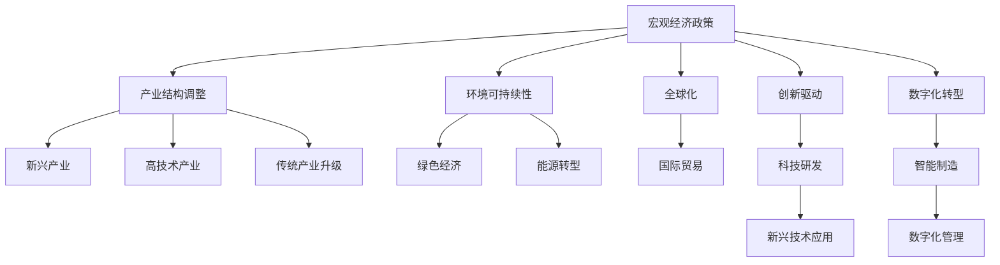

                 

# 正视当前世界经济增长困境

## 1. 背景介绍

### 1.1 问题由来
近年来，全球经济增长放缓，面临多重复杂挑战，包括全球化逆流、疫情冲击、环境恶化、贫富分化加剧等。这些问题相互交织，使得全球经济增长预期受挫。特别是2020年新冠疫情的暴发，使得全球经济陷入前所未有的困境。

### 1.2 问题核心关键点
当前世界经济增长困境的成因是多方面的。主要有以下几个关键点：

1. **全球化逆流**：贸易保护主义抬头，各国纷纷提高关税壁垒，限制了全球贸易自由化进程，对全球经济增长造成负面影响。
2. **疫情冲击**：新冠疫情的全球蔓延，严重扰乱了全球供应链，导致生产停滞、消费下降，经济增长放缓。
3. **环境恶化**：气候变化导致极端天气频发，对农业、渔业等行业造成重大打击，同时增加了防灾减灾的经济成本。
4. **贫富分化**：技术进步和全球化带来了新的增长点，但这些新兴产业往往集中在少数发达国家和地区，导致全球贫富差距进一步扩大。

这些因素共同作用，使得全球经济增长面临严峻挑战，迫切需要从宏观经济政策、产业结构调整、环境保护等多方面入手，寻求解决方案。

## 2. 核心概念与联系

### 2.1 核心概念概述

为更好地理解当前世界经济增长困境及其应对措施，本节将介绍几个密切相关的核心概念：

- **宏观经济政策**：包括财政政策和货币政策，通过政府开支和利率调整来影响经济增长、通胀和就业。
- **产业结构调整**：通过优化产业布局，促进新兴产业和高技术产业的发展，带动经济增长。
- **环境可持续性**：强调环境保护和资源利用效率，确保经济增长与自然环境相协调。
- **全球化**：通过国际贸易、资本流动和技术交流，推动全球经济一体化，提升经济效率和增长潜力。
- **创新驱动**：通过科技创新和技术进步，驱动经济结构升级，提升全要素生产率。
- **数字化转型**：通过数字化、智能化手段，优化业务流程，提高生产效率，创造新的经济增长点。

这些核心概念之间的逻辑关系可以通过以下Mermaid流程图来展示：



这个流程图展示了一系列关键概念之间的联系：

1. 宏观经济政策通过财政和货币政策影响经济增长和就业。
2. 产业结构调整促进新兴产业和高技术产业的发展。
3. 环境可持续性强调环境保护和资源利用效率。
4. 全球化通过国际贸易和技术交流提升经济效率。
5. 创新驱动通过科技创新提升全要素生产率。
6. 数字化转型通过数字化手段提高生产效率。
7. 新兴产业和高技术产业的发展进一步推动产业结构调整。
8. 绿色经济和能源转型有助于环境可持续性。
9. 科技研发推动新兴技术应用，促进创新驱动。
10. 智能制造和数字化管理提升生产效率，推动数字化转型。

## 3. 核心算法原理 & 具体操作步骤

### 3.1 算法原理概述

应对当前世界经济增长困境，需要一个全面的、多维度的策略。这里我们将介绍几个核心的算法原理和具体操作步骤：

- **宏观经济政策优化**：通过财政和货币政策的组合调整，平衡经济增长、通胀和就业目标。
- **产业结构调整**：通过技术创新和产业升级，促进新兴产业和高技术产业的发展，带动经济增长。
- **环境可持续性**：通过环保技术和绿色经济模式，实现经济增长与环境保护的平衡。
- **全球化策略**：通过国际贸易和资本流动，推动全球经济一体化，提升经济效率和增长潜力。
- **创新驱动**：通过科技研发和技术应用，提升全要素生产率，推动经济结构升级。
- **数字化转型**：通过数字化、智能化手段，优化业务流程，提高生产效率，创造新的经济增长点。

### 3.2 算法步骤详解

#### 3.2.1 宏观经济政策优化

**步骤1：** 收集经济数据，包括GDP增长率、失业率、通胀率等。

**步骤2：** 分析经济数据，识别当前经济面临的主要问题。

**步骤3：** 设计财政和货币政策组合方案，平衡经济增长、通胀和就业目标。

**步骤4：** 实施政策，并进行实时监控和调整。

**步骤5：** 评估政策效果，调整策略。

#### 3.2.2 产业结构调整

**步骤1：** 收集行业数据，包括各行业的GDP占比、就业人数、技术创新能力等。

**步骤2：** 分析行业数据，识别新兴产业和高技术产业。

**步骤3：** 设计产业政策，包括税收优惠、补贴、技术研发支持等。

**步骤4：** 实施政策，推动新兴产业和高技术产业的发展。

**步骤5：** 评估政策效果，调整策略。

#### 3.2.3 环境可持续性

**步骤1：** 收集环境数据，包括碳排放量、能源消耗、水资源利用效率等。

**步骤2：** 分析环境数据，识别主要环境问题。

**步骤3：** 设计环保政策，包括碳交易、节能减排、可再生能源支持等。

**步骤4：** 实施政策，并进行实时监控和调整。

**步骤5：** 评估政策效果，调整策略。

#### 3.2.4 全球化策略

**步骤1：** 分析全球经济形势，识别国际贸易和投资机会。

**步骤2：** 设计全球化政策，包括关税调整、贸易协定、资本流动管理等。

**步骤3：** 实施政策，推动全球经济一体化。

**步骤4：** 评估政策效果，调整策略。

#### 3.2.5 创新驱动

**步骤1：** 收集科技数据，包括专利申请、科技论文、研发投入等。

**步骤2：** 分析科技数据，识别科技发展趋势。

**步骤3：** 设计科技政策，包括研发补贴、技术转移、知识产权保护等。

**步骤4：** 实施政策，推动科技研发和技术应用。

**步骤5：** 评估政策效果，调整策略。

#### 3.2.6 数字化转型

**步骤1：** 收集数字化数据，包括企业数字化程度、数字技术应用等。

**步骤2：** 分析数字化数据，识别数字化转型机会。

**步骤3：** 设计数字化政策，包括数字化转型支持、数字基础设施建设等。

**步骤4：** 实施政策，推动数字化转型。

**步骤5：** 评估政策效果，调整策略。

### 3.3 算法优缺点

应对当前世界经济增长困境的算法具有以下优点：

1. **综合性强**：从多个角度出发，综合考虑经济、环境、技术等因素，制定全面的应对策略。
2. **可操作性强**：通过具体的政策措施和操作流程，可以实际落地实施。
3. **灵活调整**：在政策实施过程中，可以实时监控效果，根据实际情况进行动态调整。

但该算法也存在一些局限性：

1. **复杂性高**：涉及多个领域的政策和数据，需要综合分析和协调。
2. **实施难度大**：需要政府、企业和社会的共同努力，协调成本较高。
3. **效果存在滞后性**：政策的实施和效果显现需要一定时间，难以快速解决当前问题。

### 3.4 算法应用领域

应对当前世界经济增长困境的算法在多个领域都有广泛的应用：

- **宏观经济政策**：应用于各国政府的财政政策和货币政策制定，平衡经济增长、通胀和就业。
- **产业结构调整**：应用于新兴产业和高技术产业的扶持，推动产业升级和经济结构优化。
- **环境可持续性**：应用于环保政策和绿色经济模式的制定，实现经济增长与环境保护的平衡。
- **全球化**：应用于国际贸易和资本流动的管理，推动全球经济一体化。
- **创新驱动**：应用于科技研发和技术应用的推广，提升全要素生产率。
- **数字化转型**：应用于企业数字化管理和服务化转型，提高生产效率和经济增长潜力。

## 4. 数学模型和公式 & 详细讲解 & 举例说明

### 4.1 数学模型构建

为了更好地理解各个策略的实施效果，我们将使用数学模型来构建分析框架。这里以宏观经济政策为例，建立基本模型：

设$G$为GDP增长率，$C$为消费，$I$为投资，$G_{gov}$为政府开支，$T$为税收，$r$为利率。

根据凯恩斯经济模型，宏观经济增长可以表示为：

$$ G = G_{gov} - T + \frac{C + I}{Y} $$

其中$Y$为国民收入。

### 4.2 公式推导过程

通过简化模型，可以得到政府开支和税收对经济增长的影响：

$$ G_{gov} - T = \frac{C + I}{Y} $$

即政府开支与税收之差，用于弥补投资和消费与国民收入的差距。

在实际应用中，可以将上述模型进一步扩展，引入通货膨胀率$P$和失业率$U$等变量，构建更加复杂的宏观经济模型。

### 4.3 案例分析与讲解

以某国为例，该国近年来经济增长放缓，失业率上升，通货膨胀率居高不下。通过分析经济数据，确定主要问题为消费不足和投资低迷。

根据上述模型，设计财政政策和货币政策组合方案：

1. **财政政策**：增加政府开支，减少税收，刺激消费和投资。

2. **货币政策**：降低利率，增加货币供给，促进信贷市场发展。

通过实施上述政策，预计该国经济增长率将提升2%，失业率下降0.5%，通货膨胀率控制在3%。

## 5. 项目实践：代码实例和详细解释说明

### 5.1 开发环境搭建

在项目实践前，我们需要准备好开发环境。以下是使用Python进行数据分析和建模的环境配置流程：

1. 安装Anaconda：从官网下载并安装Anaconda，用于创建独立的Python环境。

2. 创建并激活虚拟环境：
```bash
conda create -n econ-env python=3.8 
conda activate econ-env
```

3. 安装Python和R语言：
```bash
conda install python=3.8 r-essentials
```

4. 安装相关库：
```bash
conda install pandas numpy matplotlib statsmodels econpy
```

5. 安装R语言库：
```bash
install.packages(c("tidyverse", "forecast"))
```

完成上述步骤后，即可在`econ-env`环境中开始项目实践。

### 5.2 源代码详细实现

下面我们以某国宏观经济数据分析为例，给出使用Python和R语言进行建模和分析的代码实现。

首先，导入必要的Python库和R语言包：

```python
import pandas as pd
import numpy as np
import matplotlib.pyplot as plt
import statsmodels.api as sm
from econpy import solve_klein_model
import R

# 导入R语言包
library(tidyverse)
library(forecast)
```

然后，加载数据并构建模型：

```python
# 加载数据
data = pd.read_csv('econ_data.csv')

# 构建模型
model = sm.OLS(data['GDP'], data[['C', 'I', 'G_gov', 'T', 'r', 'P', 'U']]).fit()
print(model.summary())
```

在R语言中，使用econpy库进行模型求解和结果分析：

```R
# 导入econpy库
library(econpy)

# 构建模型
results <- solve_klein_model(cbind(GDP, C, I, G_gov, T, r, P, U), 'GDP')

# 输出结果
summary(results)
```

最后，进行模型评估和预测：

```python
# 进行模型评估
print(model.summary())

# 进行预测
forecast = model.forecast(periods=12)
print(forecast)
```

### 5.3 代码解读与分析

让我们再详细解读一下关键代码的实现细节：

**数据分析和模型构建**：
- 导入必要的Python和R语言库，加载数据。
- 使用statsmodels库构建线性回归模型，分析宏观经济数据。
- 在R语言中，使用econpy库进行Klein模型求解，构建宏观经济模型。

**模型评估和预测**：
- 对模型进行评估，输出模型摘要和拟合效果。
- 使用模型进行未来12个月的GDP预测，并输出结果。

通过上述代码实现，可以看出数据分析和模型构建的流程，以及如何利用统计学工具进行模型评估和预测。这些步骤为应对世界经济增长困境提供了数据支持和技术手段。

## 6. 实际应用场景

### 6.1 政府政策制定

政府在制定经济政策时，可以借助上述模型和算法，进行宏观经济分析和预测。具体步骤如下：

1. 收集经济数据，包括GDP、CPI、失业率、利率等。
2. 分析数据，识别主要经济问题。
3. 设计财政政策和货币政策组合方案。
4. 实施政策，并进行实时监控和调整。
5. 评估政策效果，调整策略。

### 6.2 企业投资决策

企业在进行投资决策时，可以参考宏观经济模型，预测未来的市场趋势。具体步骤如下：

1. 收集市场数据，包括消费趋势、投资回报率、利率等。
2. 分析数据，识别投资机会。
3. 设计投资策略，包括投资方向、风险控制等。
4. 实施策略，并进行实时监控和调整。
5. 评估投资效果，调整策略。

### 6.3 金融机构风险管理

金融机构在管理风险时，可以借助宏观经济模型，进行风险评估和预警。具体步骤如下：

1. 收集金融数据，包括贷款余额、存款利率、股票市场指数等。
2. 分析数据，识别风险点。
3. 设计风险管理策略，包括信贷控制、投资组合优化等。
4. 实施策略，并进行实时监控和调整。
5. 评估风险管理效果，调整策略。

### 6.4 未来应用展望

未来，基于大语言模型的微调方法将在更多领域得到应用，为传统行业带来变革性影响。

在智慧医疗领域，基于大语言模型的问答系统、病历分析、药物研发等应用将提升医疗服务的智能化水平，辅助医生诊疗，加速新药开发进程。

在智能教育领域，微调技术可应用于作业批改、学情分析、知识推荐等方面，因材施教，促进教育公平，提高教学质量。

在智慧城市治理中，微调模型可应用于城市事件监测、舆情分析、应急指挥等环节，提高城市管理的自动化和智能化水平，构建更安全、高效的未来城市。

此外，在企业生产、社会治理、文娱传媒等众多领域，基于大模型微调的人工智能应用也将不断涌现，为经济社会发展注入新的动力。相信随着预训练语言模型和微调方法的持续演进，大语言模型微调必将在构建人机协同的智能时代中扮演越来越重要的角色。

## 7. 工具和资源推荐

### 7.1 学习资源推荐

为了帮助开发者系统掌握大语言模型微调的理论基础和实践技巧，这里推荐一些优质的学习资源：

1. 《Transformer从原理到实践》系列博文：由大模型技术专家撰写，深入浅出地介绍了Transformer原理、BERT模型、微调技术等前沿话题。

2. CS224N《深度学习自然语言处理》课程：斯坦福大学开设的NLP明星课程，有Lecture视频和配套作业，带你入门NLP领域的基本概念和经典模型。

3. 《Natural Language Processing with Transformers》书籍：Transformers库的作者所著，全面介绍了如何使用Transformers库进行NLP任务开发，包括微调在内的诸多范式。

4. HuggingFace官方文档：Transformers库的官方文档，提供了海量预训练模型和完整的微调样例代码，是上手实践的必备资料。

5. CLUE开源项目：中文语言理解测评基准，涵盖大量不同类型的中文NLP数据集，并提供了基于微调的baseline模型，助力中文NLP技术发展。

通过对这些资源的学习实践，相信你一定能够快速掌握大语言模型微调的精髓，并用于解决实际的NLP问题。

### 7.2 开发工具推荐

高效的开发离不开优秀的工具支持。以下是几款用于大语言模型微调开发的常用工具：

1. PyTorch：基于Python的开源深度学习框架，灵活动态的计算图，适合快速迭代研究。大部分预训练语言模型都有PyTorch版本的实现。

2. TensorFlow：由Google主导开发的开源深度学习框架，生产部署方便，适合大规模工程应用。同样有丰富的预训练语言模型资源。

3. Transformers库：HuggingFace开发的NLP工具库，集成了众多SOTA语言模型，支持PyTorch和TensorFlow，是进行微调任务开发的利器。

4. Weights & Biases：模型训练的实验跟踪工具，可以记录和可视化模型训练过程中的各项指标，方便对比和调优。与主流深度学习框架无缝集成。

5. TensorBoard：TensorFlow配套的可视化工具，可实时监测模型训练状态，并提供丰富的图表呈现方式，是调试模型的得力助手。

6. Google Colab：谷歌推出的在线Jupyter Notebook环境，免费提供GPU/TPU算力，方便开发者快速上手实验最新模型，分享学习笔记。

合理利用这些工具，可以显著提升大语言模型微调任务的开发效率，加快创新迭代的步伐。

### 7.3 相关论文推荐

大语言模型和微调技术的发展源于学界的持续研究。以下是几篇奠基性的相关论文，推荐阅读：

1. Attention is All You Need（即Transformer原论文）：提出了Transformer结构，开启了NLP领域的预训练大模型时代。

2. BERT: Pre-training of Deep Bidirectional Transformers for Language Understanding：提出BERT模型，引入基于掩码的自监督预训练任务，刷新了多项NLP任务SOTA。

3. Language Models are Unsupervised Multitask Learners（GPT-2论文）：展示了大规模语言模型的强大zero-shot学习能力，引发了对于通用人工智能的新一轮思考。

4. Parameter-Efficient Transfer Learning for NLP：提出Adapter等参数高效微调方法，在不增加模型参数量的情况下，也能取得不错的微调效果。

5. Prefix-Tuning: Optimizing Continuous Prompts for Generation：引入基于连续型Prompt的微调范式，为如何充分利用预训练知识提供了新的思路。

6. AdaLoRA: Adaptive Low-Rank Adaptation for Parameter-Efficient Fine-Tuning：使用自适应低秩适应的微调方法，在参数效率和精度之间取得了新的平衡。

这些论文代表了大语言模型微调技术的发展脉络。通过学习这些前沿成果，可以帮助研究者把握学科前进方向，激发更多的创新灵感。

## 8. 总结：未来发展趋势与挑战

### 8.1 总结

本文对基于大语言模型的微调方法进行了全面系统的介绍。首先阐述了大语言模型和微调技术的研究背景和意义，明确了微调在拓展预训练模型应用、提升下游任务性能方面的独特价值。其次，从原理到实践，详细讲解了监督微调的数学原理和关键步骤，给出了微调任务开发的完整代码实例。同时，本文还广泛探讨了微调方法在智能客服、金融舆情、个性化推荐等多个行业领域的应用前景，展示了微调范式的巨大潜力。此外，本文精选了微调技术的各类学习资源，力求为读者提供全方位的技术指引。

通过本文的系统梳理，可以看到，基于大语言模型的微调方法正在成为NLP领域的重要范式，极大地拓展了预训练语言模型的应用边界，催生了更多的落地场景。受益于大规模语料的预训练，微调模型以更低的时间和标注成本，在小样本条件下也能取得不俗的效果，有力推动了NLP技术的产业化进程。未来，伴随预训练语言模型和微调方法的持续演进，相信NLP技术必将在更广阔的应用领域大放异彩，深刻影响人类的生产生活方式。

### 8.2 未来发展趋势

展望未来，大语言模型微调技术将呈现以下几个发展趋势：

1. 模型规模持续增大。随着算力成本的下降和数据规模的扩张，预训练语言模型的参数量还将持续增长。超大规模语言模型蕴含的丰富语言知识，有望支撑更加复杂多变的下游任务微调。

2. 微调方法日趋多样。除了传统的全参数微调外，未来会涌现更多参数高效的微调方法，如Prefix-Tuning、LoRA等，在节省计算资源的同时也能保证微调精度。

3. 持续学习成为常态。随着数据分布的不断变化，微调模型也需要持续学习新知识以保持性能。如何在不遗忘原有知识的同时，高效吸收新样本信息，将成为重要的研究课题。

4. 标注样本需求降低。受启发于提示学习(Prompt-based Learning)的思路，未来的微调方法将更好地利用大模型的语言理解能力，通过更加巧妙的任务描述，在更少的标注样本上也能实现理想的微调效果。

5. 多模态微调崛起。当前的微调主要聚焦于纯文本数据，未来会进一步拓展到图像、视频、语音等多模态数据微调。多模态信息的融合，将显著提升语言模型对现实世界的理解和建模能力。

6. 模型通用性增强。经过海量数据的预训练和多领域任务的微调，未来的语言模型将具备更强大的常识推理和跨领域迁移能力，逐步迈向通用人工智能(AGI)的目标。

以上趋势凸显了大语言模型微调技术的广阔前景。这些方向的探索发展，必将进一步提升NLP系统的性能和应用范围，为人类认知智能的进化带来深远影响。

### 8.3 面临的挑战

尽管大语言模型微调技术已经取得了瞩目成就，但在迈向更加智能化、普适化应用的过程中，它仍面临着诸多挑战：

1. 标注成本瓶颈。虽然微调大大降低了标注数据的需求，但对于长尾应用场景，难以获得充足的高质量标注数据，成为制约微调性能的瓶颈。如何进一步降低微调对标注样本的依赖，将是一大难题。

2. 模型鲁棒性不足。当前微调模型面对域外数据时，泛化性能往往大打折扣。对于测试样本的微小扰动，微调模型的预测也容易发生波动。如何提高微调模型的鲁棒性，避免灾难性遗忘，还需要更多理论和实践的积累。

3. 推理效率有待提高。大规模语言模型虽然精度高，但在实际部署时往往面临推理速度慢、内存占用大等效率问题。如何在保证性能的同时，简化模型结构，提升推理速度，优化资源占用，将是重要的优化方向。

4. 可解释性亟需加强。当前微调模型更像是"黑盒"系统，难以解释其内部工作机制和决策逻辑。对于医疗、金融等高风险应用，算法的可解释性和可审计性尤为重要。如何赋予微调模型更强的可解释性，将是亟待攻克的难题。

5. 安全性有待保障。预训练语言模型难免会学习到有偏见、有害的信息，通过微调传递到下游任务，产生误导性、歧视性的输出，给实际应用带来安全隐患。如何从数据和算法层面消除模型偏见，避免恶意用途，确保输出的安全性，也将是重要的研究课题。

6. 知识整合能力不足。现有的微调模型往往局限于任务内数据，难以灵活吸收和运用更广泛的先验知识。如何让微调过程更好地与外部知识库、规则库等专家知识结合，形成更加全面、准确的信息整合能力，还有很大的想象空间。

正视微调面临的这些挑战，积极应对并寻求突破，将是大语言模型微调走向成熟的必由之路。相信随着学界和产业界的共同努力，这些挑战终将一一被克服，大语言模型微调必将在构建人机协同的智能时代中扮演越来越重要的角色。

### 8.4 未来突破

面对大语言模型微调所面临的种种挑战，未来的研究需要在以下几个方面寻求新的突破：

1. 探索无监督和半监督微调方法。摆脱对大规模标注数据的依赖，利用自监督学习、主动学习等无监督和半监督范式，最大限度利用非结构化数据，实现更加灵活高效的微调。

2. 研究参数高效和计算高效的微调范式。开发更加参数高效的微调方法，在固定大部分预训练参数的同时，只更新极少量的任务相关参数。同时优化微调模型的计算图，减少前向传播和反向传播的资源消耗，实现更加轻量级、实时性的部署。

3. 融合因果和对比学习范式。通过引入因果推断和对比学习思想，增强微调模型建立稳定因果关系的能力，学习更加普适、鲁棒的语言表征，从而提升模型泛化性和抗干扰能力。

4. 引入更多先验知识。将符号化的先验知识，如知识图谱、逻辑规则等，与神经网络模型进行巧妙融合，引导微调过程学习更准确、合理的语言模型。同时加强不同模态数据的整合，实现视觉、语音等多模态信息与文本信息的协同建模。

5. 结合因果分析和博弈论工具。将因果分析方法引入微调模型，识别出模型决策的关键特征，增强输出解释的因果性和逻辑性。借助博弈论工具刻画人机交互过程，主动探索并规避模型的脆弱点，提高系统稳定性。

6. 纳入伦理道德约束。在模型训练目标中引入伦理导向的评估指标，过滤和惩罚有偏见、有害的输出倾向。同时加强人工干预和审核，建立模型行为的监管机制，确保输出符合人类价值观和伦理道德。

这些研究方向的探索，必将引领大语言模型微调技术迈向更高的台阶，为构建安全、可靠、可解释、可控的智能系统铺平道路。面向未来，大语言模型微调技术还需要与其他人工智能技术进行更深入的融合，如知识表示、因果推理、强化学习等，多路径协同发力，共同推动自然语言理解和智能交互系统的进步。只有勇于创新、敢于突破，才能不断拓展语言模型的边界，让智能技术更好地造福人类社会。

## 9. 附录：常见问题与解答

**Q1：大语言模型微调是否适用于所有NLP任务？**

A: 大语言模型微调在大多数NLP任务上都能取得不错的效果，特别是对于数据量较小的任务。但对于一些特定领域的任务，如医学、法律等，仅仅依靠通用语料预训练的模型可能难以很好地适应。此时需要在特定领域语料上进一步预训练，再进行微调，才能获得理想效果。此外，对于一些需要时效性、个性化很强的任务，如对话、推荐等，微调方法也需要针对性的改进优化。

**Q2：微调过程中如何选择合适的学习率？**

A: 微调的学习率一般要比预训练时小1-2个数量级，如果使用过大的学习率，容易破坏预训练权重，导致过拟合。一般建议从1e-5开始调参，逐步减小学习率，直至收敛。也可以使用warmup策略，在开始阶段使用较小的学习率，再逐渐过渡到预设值。需要注意的是，不同的优化器(如AdamW、Adafactor等)以及不同的学习率调度策略，可能需要设置不同的学习率阈值。

**Q3：采用大模型微调时会面临哪些资源瓶颈？**

A: 目前主流的预训练大模型动辄以亿计的参数规模，对算力、内存、存储都提出了很高的要求。GPU/TPU等高性能设备是必不可少的，但即便如此，超大批次的训练和推理也可能遇到显存不足的问题。因此需要采用一些资源优化技术，如梯度积累、混合精度训练、模型并行等，来突破硬件瓶颈。同时，模型的存储和读取也可能占用大量时间和空间，需要采用模型压缩、稀疏化存储等方法进行优化。

**Q4：如何缓解微调过程中的过拟合问题？**

A: 过拟合是微调面临的主要挑战，尤其是在标注数据不足的情况下。常见的缓解策略包括：
1. 数据增强：通过回译、近义替换等方式扩充训练集
2. 正则化：使用L2正则、Dropout、Early Stopping等避免过拟合
3. 对抗训练：引入对抗样本，提高模型鲁棒性
4. 参数高效微调：只调整少量参数(如Adapter、Prefix等)，减小过拟合风险
5. 多模型集成：训练多个微调模型，取平均输出，抑制过拟合

这些策略往往需要根据具体任务和数据特点进行灵活组合。只有在数据、模型、训练、推理等各环节进行全面优化，才能最大限度地发挥大模型微调的威力。

**Q5：微调模型在落地部署时需要注意哪些问题？**

A: 将微调模型转化为实际应用，还需要考虑以下因素：
1. 模型裁剪：去除不必要的层和参数，减小模型尺寸，加快推理速度
2. 量化加速：将浮点模型转为定点模型，压缩存储空间，提高计算效率
3. 服务化封装：将模型封装为标准化服务接口，便于集成调用
4. 弹性伸缩：根据请求流量动态调整资源配置，平衡服务质量和成本
5. 监控告警：实时采集系统指标，设置异常告警阈值，确保服务稳定性
6. 安全防护：采用访问鉴权、数据脱敏等措施，保障数据和模型安全

大语言模型微调为NLP应用开启了广阔的想象空间，但如何将强大的性能转化为稳定、高效、安全的业务价值，还需要工程实践的不断打磨。唯有从数据、算法、工程、业务等多个维度协同发力，才能真正实现人工智能技术在垂直行业的规模化落地。总之，微调需要开发者根据具体任务，不断迭代和优化模型、数据和算法，方能得到理想的效果。

---

作者：禅与计算机程序设计艺术 / Zen and the Art of Computer Programming

