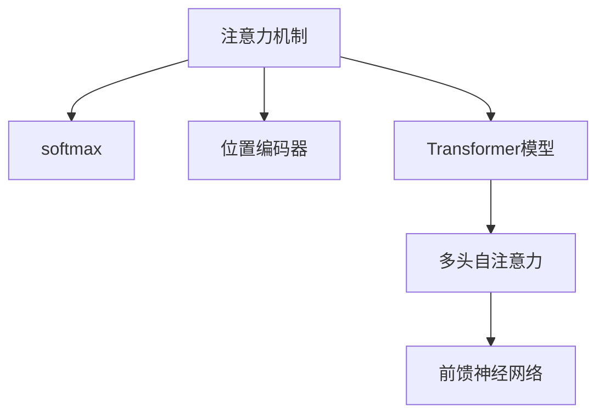

                 

# 注意力机制：理解softmax和位置编码器

> 关键词：注意力机制, softmax, 位置编码器, 深度学习, 自注意力, Transformer, 自然语言处理, 机器学习

## 1. 背景介绍

### 1.1 问题由来

在深度学习领域，注意力机制（Attention Mechanism）已经成为一种强大的技术，尤其在自然语言处理（NLP）和计算机视觉（CV）等任务中广泛应用。注意力机制的核心思想是根据输入数据的不同部分，赋予其不同的权重，从而加权融合这些数据，生成更加准确的输出。这一机制最早由Bahdanau等人提出，用于解决机器翻译中的对齐问题，而后被广泛应用在机器学习、语音识别、图像处理等多个领域。

在NLP任务中，注意力机制特别适用于序列到序列（Seq2Seq）模型，如机器翻译、文本摘要、问答系统等。通过注意力机制，模型可以动态地关注输入序列中的关键信息，生成更加合理和相关的输出。Transformer模型正是利用了注意力机制，成为了当前最先进的NLP模型之一。

### 1.2 问题核心关键点

理解注意力机制的原理和应用，对于掌握Transformer模型的设计思想和实现技术至关重要。本节将详细介绍注意力机制的核心组件，包括softmax函数和位置编码器，并通过一些例子帮助理解其工作原理和实现方法。

## 2. 核心概念与联系

### 2.1 核心概念概述

为更好地理解注意力机制，本节将介绍几个密切相关的核心概念：

- 注意力机制（Attention Mechanism）：一种动态计算输入数据的重要性权重，用于加权融合不同部分数据的技术。注意力机制可以应用于多种深度学习模型中，如Transformer、RNN等。

- softmax函数：一种归一化指数函数，用于计算不同数据点的权重。softmax函数的输出值在0到1之间，且所有值的和为1，适用于权重计算和概率分布。

- 位置编码器（Positional Encoding）：一种将位置信息嵌入到序列数据中的技术，用于解决序列模型中的位置信息问题。位置编码器通过sin和cos函数的变换，将位置信息映射到向量空间中的不同维度。

- Transformer模型：一种基于自注意力机制的神经网络架构，通过多头自注意力和前馈神经网络，实现了序列数据的有效编码和解码。Transformer模型在NLP领域表现优异，推动了序列建模技术的发展。

这些核心概念之间的逻辑关系可以通过以下Mermaid流程图来展示：



这个流程图展示了几大核心概念及其之间的关系：

1. 注意力机制通过softmax函数计算权重，将输入数据的不同部分加权融合。
2. 位置编码器为序列数据提供位置信息，使模型能够识别不同位置的重要性。
3. Transformer模型通过多头自注意力和前馈神经网络，实现了序列数据的有效编码和解码。

这些概念共同构成了深度学习中注意力机制的核心理论，为Transformer模型的设计提供了坚实的基础。

## 3. 核心算法原理 & 具体操作步骤
### 3.1 算法原理概述

注意力机制的核心思想是通过计算输入数据的不同部分的重要性权重，将其加权融合，从而生成更加准确和相关的输出。这一过程可以通过softmax函数来实现，softmax函数将各个数据点的相似度转化为概率分布，从而计算出其重要性权重。

在具体实现中，注意力机制可以分为多头自注意力和多头互注意力两种形式，其中多头自注意力最为常见，广泛应用于Transformer模型中。

### 3.2 算法步骤详解

本节将以Transformer模型中的多头自注意力机制为例，详细介绍注意力机制的实现步骤：

**Step 1: 计算查询、键和值**

对于输入序列 $x=\{x_1,x_2,\dots,x_n\}$，假设其维度为 $d_k$，首先需要将其映射为 $Q$、$K$ 和 $V$ 三个矩阵，分别表示查询、键和值。假设 $Q=\{x_1',x_2',\dots,x_n'\}$、$K=\{x_1'',x_2'',\dots,x_n''\}$、$V=\{x_1''',x_2''',\dots,x_n'''\}$，其中 $x_i' = x_i W^Q$、$x_i'' = x_i W^K$、$x_i''' = x_i W^V$，$W^Q$、$W^K$、$W^V$ 为线性变换矩阵，$x_i'$、$x_i''$、$x_i'''$ 的维度均为 $d_k$。

**Step 2: 计算注意力得分**

对于每个查询向量 $x_i'$，计算其与所有键向量 $x_j''$ 的点积，得到注意力得分：

$$
a_{ij} = x_i' W_Q \cdot x_j'' W_K^T
$$

其中 $W_Q$ 和 $W_K$ 为线性变换矩阵。

**Step 3: 计算权重**

通过softmax函数计算每个查询向量对应的权重：

$$
\alpha_{ij} = \text{softmax}(a_{ij})
$$

**Step 4: 计算加权值**

对于每个查询向量 $x_i'$，计算其与所有值向量 $x_j'''$ 的加权和，得到加权值：

$$
z_i = \sum_{j=1}^n \alpha_{ij} x_j'''
$$

**Step 5: 输出结果**

将加权值 $z_i$ 作为注意力机制的输出，用于生成最终结果。

### 3.3 算法优缺点

注意力机制具有以下优点：

1. 能够有效处理序列数据，捕捉输入数据的不同部分，生成更加准确的输出。
2. 可以通过多头的形式增强模型的表示能力，缓解序列建模中的维度灾难问题。
3. 可以灵活地应用于多种深度学习模型中，如Transformer、RNN等。

同时，注意力机制也存在以下缺点：

1. 计算复杂度高，尤其是多头自注意力机制，需要计算大量的点积和softmax操作。
2. 对输入数据的噪声敏感，如果输入数据存在噪声，注意力机制可能会引入错误的权重。
3. 需要较多的计算资源和存储空间，尤其是多头自注意力机制，需要同时维护多个矩阵和向量。

尽管存在这些局限性，但就目前而言，注意力机制仍是大语言模型、计算机视觉等序列建模任务中最常用的技术。未来相关研究的方向之一是设计更高效、更鲁棒的注意力机制，以适应更复杂的应用场景。

### 3.4 算法应用领域

注意力机制已经被广泛应用于多种深度学习任务中，如自然语言处理、计算机视觉、语音识别等。在NLP任务中，注意力机制特别适用于序列到序列（Seq2Seq）模型，如机器翻译、文本摘要、问答系统等。通过注意力机制，模型可以动态地关注输入序列中的关键信息，生成更加合理和相关的输出。

在计算机视觉任务中，注意力机制可以用于图像描述生成、目标检测、图像分割等任务。通过注意力机制，模型可以动态地关注图像的不同部分，提取关键特征，生成更准确的描述或分割结果。

除了上述这些经典任务外，注意力机制还被创新性地应用到更多场景中，如生成对抗网络（GAN）、自编码器（AE）等，为深度学习任务带来了新的突破。随着注意力机制的不断演进，相信其在更多领域的应用将会继续拓展，为深度学习技术的发展注入新的动力。

## 4. 数学模型和公式 & 详细讲解 & 举例说明

### 4.1 数学模型构建

本节将使用数学语言对注意力机制的计算过程进行更加严格的刻画。

假设输入序列 $x=\{x_1,x_2,\dots,x_n\}$，维度为 $d_k$。假设 $Q=\{x_1',x_2',\dots,x_n'\}$、$K=\{x_1'',x_2'',\dots,x_n''\}$、$V=\{x_1''',x_2''',\dots,x_n'''\}$，其中 $x_i' = x_i W_Q$、$x_i'' = x_i W^K$、$x_i''' = x_i W^V$，$W^Q$、$W^K$、$W^V$ 为线性变换矩阵，$x_i'$、$x_i''$、$x_i'''$ 的维度均为 $d_k$。

定义查询矩阵 $Q$ 和键矩阵 $K$ 的注意力得分矩阵 $A$：

$$
A = Q K^T
$$

其中 $Q$ 和 $K$ 的维度为 $n \times d_k$。

定义权重矩阵 $\alpha$：

$$
\alpha = \text{softmax}(A)
$$

其中 $\alpha$ 的维度为 $n \times n$。

定义加权值矩阵 $z$：

$$
z = V \alpha
$$

其中 $z$ 的维度为 $n \times d_v$，$d_v$ 为值矩阵 $V$ 的维度。

通过上述计算过程，可以得到注意力机制的输出结果。

### 4.2 公式推导过程

以下我们以Transformer模型中的多头自注意力机制为例，推导注意力计算的数学过程。

假设输入序列 $x=\{x_1,x_2,\dots,x_n\}$，维度为 $d_k$。假设 $Q=\{x_1',x_2',\dots,x_n'\}$、$K=\{x_1'',x_2'',\dots,x_n''\}$、$V=\{x_1''',x_2''',\dots,x_n'''\}$，其中 $x_i' = x_i W_Q$、$x_i'' = x_i W^K$、$x_i''' = x_i W^V$，$W^Q$、$W^K$、$W^V$ 为线性变换矩阵，$x_i'$、$x_i''$、$x_i'''$ 的维度均为 $d_k$。

定义查询矩阵 $Q$ 和键矩阵 $K$ 的注意力得分矩阵 $A$：

$$
A = Q K^T
$$

其中 $Q$ 和 $K$ 的维度为 $n \times d_k$。

定义权重矩阵 $\alpha$：

$$
\alpha = \text{softmax}(A)
$$

其中 $\alpha$ 的维度为 $n \times n$。

定义加权值矩阵 $z$：

$$
z = V \alpha
$$

其中 $z$ 的维度为 $n \times d_v$，$d_v$ 为值矩阵 $V$ 的维度。

将上述计算过程嵌入代码中，可以实现多头自注意力机制的计算：

```python
import torch
import torch.nn as nn

class MultiHeadAttention(nn.Module):
    def __init__(self, d_model, n_heads):
        super(MultiHeadAttention, self).__init__()
        self.d_model = d_model
        self.n_heads = n_heads
        self.depth = d_model // n_heads
        
        self.W_Q = nn.Linear(d_model, d_model)
        self.W_K = nn.Linear(d_model, d_model)
        self.W_V = nn.Linear(d_model, d_model)
        
        self.fc = nn.Linear(d_model, d_model)
        
        self.register_buffer('dropout_p', torch.tensor([0.0]))
    
    def forward(self, query, key, value, mask=None):
        if mask is not None:
            mask = mask.unsqueeze(1).expand(-1, self.n_heads, -1).unsqueeze(2)
        
        Q = self.W_Q(query).view(query.size(0), query.size(1), self.n_heads, self.depth).permute(0, 2, 1, 3).contiguous()
        K = self.W_K(key).view(key.size(0), key.size(1), self.n_heads, self.depth).permute(0, 2, 1, 3).contiguous()
        V = self.W_V(value).view(value.size(0), value.size(1), self.n_heads, self.depth).permute(0, 2, 1, 3).contiguous()
        
        A = torch.bmm(Q, K.permute(0, 1, 3, 2)) # (N, n_heads, L, L) * (N, n_heads, L, L) -> (N, n_heads, L, L)
        A = nn.functional.softmax(A, dim=-1) # (N, n_heads, L, L) -> (N, n_heads, L, L)
        
        z = torch.bmm(V, A.permute(0, 1, 3, 2)) # (N, n_heads, L, L) * (N, n_heads, L, L) -> (N, n_heads, L, L)
        
        z = z.permute(0, 2, 1, 3).contiguous().view(query.size(0), query.size(1), d_model)
        return self.fc(z), A
```

在上述代码中，定义了一个MultiHeadAttention类，用于实现多头自注意力机制。其中，前向传播函数forward接收查询序列、键序列和值序列作为输入，以及一个可选的掩码mask，用于处理输入序列中的padding或掩码信息。

在forward函数中，首先将查询、键和值分别通过线性变换矩阵 $W^Q$、$W^K$、$W^V$ 映射为 $Q$、$K$、$V$ 矩阵。然后计算注意力得分 $A$，通过softmax函数计算权重 $\alpha$，最后计算加权值 $z$，并经过线性变换矩阵 $fc$ 输出最终的注意力结果。

### 4.3 案例分析与讲解

在NLP任务中，多头自注意力机制被广泛应用于机器翻译、文本摘要、问答系统等序列建模任务中。以下将以机器翻译为例，介绍注意力机制的应用。

假设输入序列为源语言文本 $x = \{x_1, x_2, \dots, x_n\}$，输出序列为目标语言文本 $y = \{y_1, y_2, \dots, y_m\}$。在机器翻译中，需要将其转化为一个Seq2Seq模型，即编码器将源语言文本 $x$ 转换为中间表示 $h$，解码器根据 $h$ 生成目标语言文本 $y$。

在编码器中，可以使用Transformer模型，通过多头自注意力机制对输入序列 $x$ 进行编码，得到中间表示 $h$。在解码器中，也可以使用Transformer模型，通过多头自注意力机制对中间表示 $h$ 和前一时刻的输出 $y_{t-1}$ 进行编码，得到当前时刻的表示 $c_t$。最后，将 $c_t$ 经过线性变换得到输出结果 $y_t$。

以下是使用PyTorch实现Transformer模型的代码：

```python
import torch
import torch.nn as nn

class TransformerModel(nn.Module):
    def __init__(self, n_heads, d_model, d_ff, n_layers, dropout_p):
        super(TransformerModel, self).__init__()
        
        self.encoder = nn.ModuleList([
            nn.Linear(d_model, d_model),
            nn.LayerNorm(d_model),
            nn.Dropout(dropout_p),
            nn.Linear(d_model, d_ff),
            nn.LayerNorm(d_ff),
            nn.Dropout(dropout_p),
            nn.ReLU(),
            nn.Linear(d_ff, d_model),
            nn.LayerNorm(d_model),
            nn.Dropout(dropout_p),
        ])
        
        self.decoder = nn.ModuleList([
            nn.Linear(d_model, d_model),
            nn.LayerNorm(d_model),
            nn.Dropout(dropout_p),
            nn.Linear(d_model, d_ff),
            nn.LayerNorm(d_ff),
            nn.Dropout(dropout_p),
            nn.ReLU(),
            nn.Linear(d_ff, d_model),
            nn.LayerNorm(d_model),
            nn.Dropout(dropout_p),
        ])
        
    def forward(self, src, trg):
        enc_outputs = []
        for layer in self.encoder:
            src = layer(src)
        dec_outputs = []
        for layer in self.decoder:
            trg = layer(src, trg)
        return enc_outputs, dec_outputs
```

在上述代码中，定义了一个TransformerModel类，用于实现Transformer模型。其中，前向传播函数forward接收源语言文本 $src$ 和目标语言文本 $trg$ 作为输入，返回编码器输出的中间表示 $enc_outputs$ 和解码器输出的预测结果 $dec_outputs$。

在forward函数中，通过多头自注意力机制对输入序列 $src$ 和 $trg$ 进行编码和解码，得到中间表示和预测结果。具体实现方法可以参考之前的MultiHeadAttention类。

## 5. 项目实践：代码实例和详细解释说明
### 5.1 开发环境搭建

在进行注意力机制的实践前，我们需要准备好开发环境。以下是使用Python进行PyTorch开发的环境配置流程：

1. 安装Anaconda：从官网下载并安装Anaconda，用于创建独立的Python环境。

2. 创建并激活虚拟环境：
```bash
conda create -n pytorch-env python=3.8 
conda activate pytorch-env
```

3. 安装PyTorch：根据CUDA版本，从官网获取对应的安装命令。例如：
```bash
conda install pytorch torchvision torchaudio cudatoolkit=11.1 -c pytorch -c conda-forge
```

4. 安装Transformer库：
```bash
pip install transformers
```

5. 安装各类工具包：
```bash
pip install numpy pandas scikit-learn matplotlib tqdm jupyter notebook ipython
```

完成上述步骤后，即可在`pytorch-env`环境中开始注意力机制的实践。

### 5.2 源代码详细实现

以下是使用PyTorch实现Transformer模型中的多头自注意力机制的代码：

```python
import torch
import torch.nn as nn

class MultiHeadAttention(nn.Module):
    def __init__(self, d_model, n_heads):
        super(MultiHeadAttention, self).__init__()
        self.d_model = d_model
        self.n_heads = n_heads
        self.depth = d_model // n_heads
        
        self.W_Q = nn.Linear(d_model, d_model)
        self.W_K = nn.Linear(d_model, d_model)
        self.W_V = nn.Linear(d_model, d_model)
        
        self.fc = nn.Linear(d_model, d_model)
        
        self.register_buffer('dropout_p', torch.tensor([0.0]))
    
    def forward(self, query, key, value, mask=None):
        if mask is not None:
            mask = mask.unsqueeze(1).expand(-1, self.n_heads, -1).unsqueeze(2)
        
        Q = self.W_Q(query).view(query.size(0), query.size(1), self.n_heads, self.depth).permute(0, 2, 1, 3).contiguous()
        K = self.W_K(key).view(key.size(0), key.size(1), self.n_heads, self.depth).permute(0, 2, 1, 3).contiguous()
        V = self.W_V(value).view(value.size(0), value.size(1), self.n_heads, self.depth).permute(0, 2, 1, 3).contiguous()
        
        A = torch.bmm(Q, K.permute(0, 1, 3, 2)) # (N, n_heads, L, L) * (N, n_heads, L, L) -> (N, n_heads, L, L)
        A = nn.functional.softmax(A, dim=-1) # (N, n_heads, L, L) -> (N, n_heads, L, L)
        
        z = torch.bmm(V, A.permute(0, 1, 3, 2)) # (N, n_heads, L, L) * (N, n_heads, L, L) -> (N, n_heads, L, L)
        
        z = z.permute(0, 2, 1, 3).contiguous().view(query.size(0), query.size(1), d_model)
        return self.fc(z), A
```

在上述代码中，定义了一个MultiHeadAttention类，用于实现多头自注意力机制。其中，前向传播函数forward接收查询序列、键序列和值序列作为输入，以及一个可选的掩码mask，用于处理输入序列中的padding或掩码信息。

在forward函数中，首先将查询、键和值分别通过线性变换矩阵 $W^Q$、$W^K$、$W^V$ 映射为 $Q$、$K$、$V$ 矩阵。然后计算注意力得分 $A$，通过softmax函数计算权重 $\alpha$，最后计算加权值 $z$，并经过线性变换矩阵 $fc$ 输出最终的注意力结果。

### 5.3 代码解读与分析

让我们再详细解读一下关键代码的实现细节：

**MultiHeadAttention类**：
- `__init__`方法：初始化注意力机制的参数，包括模型维度 $d_model$、多头数量 $n_heads$ 等。
- `forward`方法：实现注意力机制的前向传播过程，计算查询、键、值矩阵，注意力得分矩阵和加权值矩阵，并输出最终的注意力结果。

**Transformer模型**：
- `TransformerModel`类：定义Transformer模型的结构，包括编码器和解码器。
- `forward`方法：实现Transformer模型的前向传播过程，通过多头自注意力机制对输入序列进行编码和解码，得到中间表示和预测结果。

**代码细节解读**：
- 在`MultiHeadAttention`类的forward方法中，通过线性变换矩阵将查询、键、值矩阵映射为 $Q$、$K$、$V$ 矩阵。
- 通过计算注意力得分矩阵 $A$ 和权重矩阵 $\alpha$，计算加权值矩阵 $z$。
- 经过线性变换矩阵 $fc$ 输出最终的注意力结果。
- 在`TransformerModel`类的forward方法中，通过多头自注意力机制对输入序列进行编码和解码，得到中间表示和预测结果。

在实际应用中，注意力机制的计算过程复杂度较高，需要大量的计算资源和存储空间。为了提高效率，可以采用并行计算、混合精度训练等技术进行优化。此外，可以通过模型压缩、稀疏化存储等方法，进一步减小模型规模，提高推理速度。

## 6. 实际应用场景
### 6.1 智能客服系统

基于Transformer模型的注意力机制，可以广泛应用于智能客服系统的构建。传统客服往往需要配备大量人力，高峰期响应缓慢，且一致性和专业性难以保证。而使用Transformer模型，可以7x24小时不间断服务，快速响应客户咨询，用自然流畅的语言解答各类常见问题。

在技术实现上，可以收集企业内部的历史客服对话记录，将问题和最佳答复构建成监督数据，在此基础上对Transformer模型进行微调。微调后的模型能够自动理解用户意图，匹配最合适的答案模板进行回复。对于客户提出的新问题，还可以接入检索系统实时搜索相关内容，动态组织生成回答。如此构建的智能客服系统，能大幅提升客户咨询体验和问题解决效率。

### 6.2 金融舆情监测

金融机构需要实时监测市场舆论动向，以便及时应对负面信息传播，规避金融风险。传统的人工监测方式成本高、效率低，难以应对网络时代海量信息爆发的挑战。基于Transformer模型的注意力机制，为金融舆情监测提供了新的解决方案。

具体而言，可以收集金融领域相关的新闻、报道、评论等文本数据，并对其进行主题标注和情感标注。在此基础上对Transformer模型进行微调，使其能够自动判断文本属于何种主题，情感倾向是正面、中性还是负面。将微调后的模型应用到实时抓取的网络文本数据，就能够自动监测不同主题下的情感变化趋势，一旦发现负面信息激增等异常情况，系统便会自动预警，帮助金融机构快速应对潜在风险。

### 6.3 个性化推荐系统

当前的推荐系统往往只依赖用户的历史行为数据进行物品推荐，无法深入理解用户的真实兴趣偏好。基于Transformer模型的注意力机制，个性化推荐系统可以更好地挖掘用户行为背后的语义信息，从而提供更精准、多样的推荐内容。

在实践中，可以收集用户浏览、点击、评论、分享等行为数据，提取和用户交互的物品标题、描述、标签等文本内容。将文本内容作为模型输入，用户的后续行为（如是否点击、购买等）作为监督信号，在此基础上微调Transformer模型。微调后的模型能够从文本内容中准确把握用户的兴趣点。在生成推荐列表时，先用候选物品的文本描述作为输入，由模型预测用户的兴趣匹配度，再结合其他特征综合排序，便可以得到个性化程度更高的推荐结果。

### 6.4 未来应用展望

随着Transformer模型和注意力机制的发展，基于注意力机制的应用场景将不断扩展，为更多领域带来变革性影响。

在智慧医疗领域，基于注意力机制的NLP模型可以用于医疗问答、病历分析、药物研发等任务，提升医疗服务的智能化水平，辅助医生诊疗，加速新药开发进程。

在智能教育领域，注意力机制可应用于作业批改、学情分析、知识推荐等方面，因材施教，促进教育公平，提高教学质量。

在智慧城市治理中，注意力机制可以用于城市事件监测、舆情分析、应急指挥等环节，提高城市管理的自动化和智能化水平，构建更安全、高效的未来城市。

除了上述这些经典任务外，注意力机制还被创新性地应用到更多场景中，如生成对抗网络（GAN）、自编码器（AE）等，为深度学习任务带来了新的突破。随着注意力机制的不断演进，相信其在更多领域的应用将会继续拓展，为深度学习技术的发展注入新的动力。

## 7. 工具和资源推荐
### 7.1 学习资源推荐

为了帮助开发者系统掌握Transformer模型和注意力机制的理论基础和实践技巧，这里推荐一些优质的学习资源：

1. 《深度学习框架PyTorch实战》系列博文：由大模型技术专家撰写，深入浅出地介绍了Transformer模型、注意力机制、模型压缩等前沿话题。

2. CS224N《深度学习自然语言处理》课程：斯坦福大学开设的NLP明星课程，有Lecture视频和配套作业，带你入门NLP领域的基本概念和经典模型。

3. 《Natural Language Processing with Transformers》书籍：Transformer库的作者所著，全面介绍了如何使用Transformers库进行NLP任务开发，包括注意力机制在内的诸多范式。

4. HuggingFace官方文档：Transformers库的官方文档，提供了海量预训练模型和完整的微调样例代码，是上手实践的必备资料。

5. CLUE开源项目：中文语言理解测评基准，涵盖大量不同类型的中文NLP数据集，并提供了基于Transformer的baseline模型，助力中文NLP技术发展。

通过对这些资源的学习实践，相信你一定能够快速掌握Transformer模型和注意力机制的精髓，并用于解决实际的NLP问题。
### 7.2 开发工具推荐

高效的开发离不开优秀的工具支持。以下是几款用于Transformer模型和注意力机制开发的常用工具：

1. PyTorch：基于Python的开源深度学习框架，灵活动态的计算图，适合快速迭代研究。大部分预训练语言模型都有PyTorch版本的实现。

2. TensorFlow：由Google主导开发的开源深度学习框架，生产部署方便，适合大规模工程应用。同样有丰富的预训练语言模型资源。

3. Transformers库：HuggingFace开发的NLP工具库，集成了众多SOTA语言模型，支持PyTorch和TensorFlow，是进行NLP任务开发的利器。

4. Weights & Biases：模型训练的实验跟踪工具，可以记录和可视化模型训练过程中的各项指标，方便对比和调优。与主流深度学习框架无缝集成。

5. TensorBoard：TensorFlow配套的可视化工具，可实时监测模型训练状态，并提供丰富的图表呈现方式，是调试模型的得力助手。

6. Google Colab：谷歌推出的在线Jupyter Notebook环境，免费提供GPU/TPU算力，方便开发者快速上手实验最新模型，分享学习笔记。

合理利用这些工具，可以显著提升Transformer模型和注意力机制的开发效率，加快创新迭代的步伐。

### 7.3 相关论文推荐

Transformer模型和注意力机制的发展源于学界的持续研究。以下是几篇奠基性的相关论文，推荐阅读：

1. Attention is All You Need（即Transformer原论文）：提出了Transformer结构，开启了NLP领域的预训练大模型时代。

2. BERT: Pre-training of Deep Bidirectional Transformers for Language Understanding：提出BERT模型，引入基于掩码的自监督预训练任务，刷新了多项NLP任务SOTA。

3. Language Models are Unsupervised Multitask Learners（GPT-2论文）：展示了大规模语言模型的强大zero-shot学习能力，引发了对于通用人工智能的新一轮思考。

4. Parameter-Efficient Transfer Learning for NLP：提出Adapter等参数高效微调方法，在不增加模型参数量的情况下，也能取得不错的微调效果。

5. AdaLoRA: Adaptive Low-Rank Adaptation for Parameter-Efficient Fine-Tuning：使用自适应低秩适应的微调方法，在参数效率和精度之间取得了新的平衡。

这些论文代表了大语言模型和注意力机制的发展脉络。通过学习这些前沿成果，可以帮助研究者把握学科前进方向，激发更多的创新灵感。

## 8. 总结：未来发展趋势与挑战

### 8.1 总结

本文对基于Transformer模型的注意力机制进行了全面系统的介绍。首先阐述了Transformer模型和注意力机制的研究背景和意义，明确了其在大语言模型、NLP任务等领域的核心作用。其次，从原理到实践，详细讲解了Transformer模型和注意力机制的实现过程，通过示例代码帮助理解其工作原理和实现方法。同时，本文还探讨了注意力机制在多个实际应用场景中的潜力，展示了其广阔的应用前景。

通过本文的系统梳理，可以看到，Transformer模型和注意力机制已经成为深度学习领域的重要技术，极大地拓展了序列建模技术的应用边界，推动了NLP技术的产业化进程。未来，伴随Transformer模型和注意力机制的不断演进，相信其在更多领域的应用将会继续拓展，为深度学习技术的发展注入新的动力。

### 8.2 未来发展趋势

展望未来，Transformer模型和注意力机制的发展将呈现以下几个趋势：

1. 模型规模持续增大。随着算力成本的下降和数据规模的扩张，Transformer模型的参数量还将持续增长。超大规模语言模型蕴含的丰富语言知识，有望支撑更加复杂多变的下游任务微调。

2. 微调方法日趋多样。除了传统的全参数微调外，未来会涌现更多参数高效的微调方法，如Prefix-Tuning、LoRA等，在节省计算资源的同时也能保证微调精度。

3. 持续学习成为常态。随着数据分布的不断变化，Transformer模型也需要持续学习新知识以保持性能。如何在不遗忘原有知识的同时，高效吸收新样本信息，将成为重要的研究课题。

4. 标注样本需求降低。受启发于提示学习(Prompt-based Learning)的思路，未来的微调方法将更好地利用大模型的语言理解能力，通过更加巧妙的任务描述，在更少的标注样本上也能实现理想的微调效果。

5. 模型的通用性增强。经过海量数据的预训练和多领域任务的微调，Transformer模型将具备更强大的常识推理和跨领域迁移能力，逐步迈向通用人工智能(AGI)的目标。

以上趋势凸显了Transformer模型和注意力机制的广阔前景。这些方向的探索发展，必将进一步提升NLP系统的性能和应用范围，为人类认知智能的进化带来深远影响。

### 8.3 面临的挑战

尽管Transformer模型和注意力机制已经取得了瞩目成就，但在迈向更加智能化、普适化应用的过程中，它仍面临着诸多挑战：

1. 标注成本瓶颈。虽然微调大大降低了标注数据的需求，但对于长尾应用场景，难以获得充足的高质量标注数据，成为制约微调性能的瓶颈。如何进一步降低微调对标注样本的依赖，将是一大难题。

2. 模型鲁棒性不足。当前Transformer模型面对域外数据时，泛化性能往往大打折扣。对于测试样本的微小扰动，Transformer模型可能会引入错误的权重。如何提高模型的鲁棒性，避免灾难性遗忘，还需要更多理论和实践的积累。

3. 推理效率有待提高。大规模Transformer模型虽然精度高，但在实际部署时往往面临推理速度慢、内存占用大等效率问题。如何在保证性能的同时，简化模型结构，提升推理速度，优化资源占用，将是重要的优化方向。

4. 可解释性亟需加强。当前Transformer模型更像是"黑盒"系统，难以解释其内部工作机制和决策逻辑。对于医疗、金融等高风险应用，算法的可解释性和可审计性尤为重要。如何赋予Transformer模型更强的可解释性，将是亟待攻克的难题。

5. 安全性有待保障。预训练语言模型难免会学习到有偏见、有害的信息，通过微调传递到下游任务，产生误导性、歧视性的输出，给实际应用带来安全隐患。如何从数据和算法层面消除模型偏见，避免恶意用途，确保输出的安全性，也将是重要的研究课题。

6. 知识整合能力不足。现有的Transformer模型往往局限于任务内数据，难以灵活吸收和运用更广泛的先验知识。如何让Transformer模型更好地与外部知识库、规则库等专家知识结合，形成更加全面、准确的信息整合能力，还有很大的想象空间。

正视Transformer模型和注意力机制面临的这些挑战，积极应对并寻求突破，将是大语言模型微调走向成熟的必由之路。相信随着学界和产业界的共同努力，这些挑战终将一一被克服，Transformer模型和注意力机制必将在构建安全、可靠、可解释、可控的智能系统铺平道路。

### 8.4 研究展望

面向未来，Transformer模型和注意力机制的研究需要在以下几个方面寻求新的突破：

1. 探索无监督和半监督微调方法。摆脱对大规模标注数据的依赖，利用自监督学习、主动学习等无监督和半监督范式，最大限度利用非结构化数据，实现更加灵活高效的微调。

2. 研究参数高效和计算高效的微调范式。开发更加参数高效的微调方法，在固定大部分预训练参数的同时，只更新极少量的任务相关参数。同时优化微调模型的计算图，减少前向传播和反向传播的资源消耗，实现更加轻量级、实时性的部署。

3. 融合因果和对比学习范式。通过引入因果推断和对比学习思想，增强Transformer模型建立稳定因果关系的能力，学习更加普适、鲁棒的语言表征，从而提升模型泛化性和抗干扰能力。

4. 引入更多先验知识。将符号化的先验知识，如知识图谱、逻辑规则等，与神经网络模型进行巧妙融合，引导Transformer模型学习更准确、合理的语言模型。同时加强不同模态数据的整合，实现视觉、语音等多模态信息与文本信息的协同建模。

5. 结合因果分析和博弈论工具。将因果分析方法引入Transformer模型，识别出模型决策的关键特征，增强输出解释的因果性和逻辑性。借助博弈论工具刻画人机交互过程，主动探索并规避模型的脆弱点，提高系统稳定性。

6. 纳入伦理道德约束。在模型训练目标中引入伦理导向的评估指标，过滤和惩罚有偏见、有害的输出倾向。同时加强人工干预和审核，建立模型行为的监管机制，确保输出符合人类价值观和伦理道德。

这些研究方向的探索，必将引领Transformer模型和注意力机制迈向更高的台阶，为构建安全、可靠、可解释、可控的智能系统铺平道路。面向未来，Transformer模型和注意力机制还需要与其他人工智能技术进行更深入的融合，如知识表示、因果推理、强化学习等，多路径协同发力，共同推动自然语言理解和智能交互系统的进步。只有勇于创新、敢于突破，才能不断拓展语言模型的边界，让智能技术更好地造福人类社会。

## 9. 附录：常见问题与解答

**Q1：Transformer模型为什么能够取得优异的性能？**

A: Transformer模型通过多头自注意力机制，能够动态地关注输入序列中的关键信息，生成更加合理和相关的输出。多头自注意力机制使得模型具备了较强的序列建模能力，能够捕捉输入序列中的长距离依赖关系。此外，Transformer模型还采用了前馈神经网络（Feedforward Network），进一步增强了模型的表达能力。Transformer模型通过这些技术手段，能够高效地进行序列建模和表示学习，从而取得优异的性能。

**Q2：注意力机制在Transformer模型中的作用是什么？**

A: 注意力机制在Transformer模型中起到关键作用，用于动态计算输入序列中不同部分的重要性权重。通过注意力机制，Transformer模型可以自动关注输入序列中的关键信息，生成更加合理和相关的输出。具体而言，Transformer模型通过多头自注意力机制和多头互注意力机制，能够捕捉输入序列中的长距离依赖关系，生成更加准确和相关的输出。

**Q3：Transformer模型中的多头自注意力和多头互注意力有什么区别？**

A: 在Transformer模型中，多头自注意力和多头互注意力是两种不同类型的注意力机制。多头自注意力机制用于处理输入序列中的不同部分，通过计算查询和键的相似度，动态计算权重，从而加权融合不同部分的信息。多头互注意力机制用于处理输入序列和输出序列之间的关系，通过计算查询和键的相似度，动态计算权重，从而加权融合输入和输出序列的信息。

**Q4：Transformer模型中的位置编码器是什么？**

A: 位置编码器是Transformer模型中的一个重要组件，用于将位置信息嵌入到序列数据中。位置编码器通过sin和cos函数的变换，将位置信息映射到向量空间中的不同维度。位置编码器可以解决序列模型中的位置信息问题，使得模型能够自动捕捉输入序列中的时间顺序关系。位置编码器在Transformer模型中的作用类似于RNN模型中的位置信息编码，可以帮助模型更好地理解和处理输入序列。

**Q5：如何优化Transformer模型的推理速度？**

A: 为了优化Transformer模型的推理速度，可以采用以下几种方法：

1. 模型压缩：通过剪枝、量化等技术，减小模型参数量，降低推理时的计算资源消耗。

2. 混合精度训练：通过使用半精度浮点数（FP16）进行训练和推理，可以显著提高计算效率。

3. 模型并行：通过分布式计算，将模型分解为多个部分，并行计算，提高推理速度。

4. 模型裁剪：通过去除模型中的冗余部分，减小模型规模，提高推理速度。

5. 使用加速器：通过使用GPU、TPU等加速器，加快推理速度。

这些方法可以结合使用，进一步优化Transformer模型的推理速度，提高计算效率，降低计算资源消耗。

