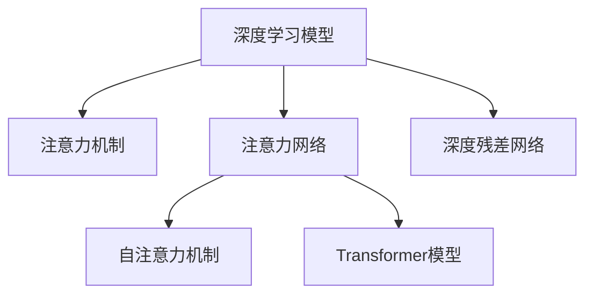

                 

# 注意力深度学习：AI优化的专注力培养

## 1. 背景介绍

### 1.1 问题由来
在现代社会，专注力已成为一种稀缺的资源。面对海量信息，如何有效筛选并保持高效处理信息的能力，是每个人都需要面对的挑战。然而，人类注意力有限的生理机制，使得我们容易在信息海洋中迷失方向。随着AI技术的发展，注意力机制成为探索深度学习模型的重要视角，也是未来实现真正智能的关键。

### 1.2 问题核心关键点
注意力机制是一种高效的信息处理和选择机制，能够帮助模型从大量输入中选出重要部分，减少信息冗余，提升决策效率。在大规模数据和复杂模型结构的双重驱动下，注意力机制被广泛应用于深度学习模型中。本文将深入探讨注意力机制的原理和应用，探讨如何通过注意力机制进行AI优化的专注力培养。

### 1.3 问题研究意义
深度学习模型中的注意力机制，能够帮助其更高效地处理复杂信息，提升决策精准度。在实际应用中，注意力机制不仅能用于图像识别、语音识别、自然语言处理等传统领域，还能用于AI优化、认知神经科学等领域，对人类专注力培养提供了新的思路。因此，深入研究注意力机制的原理与应用，对于提升AI系统性能和人类专注力具有重要意义。

## 2. 核心概念与联系

### 2.1 核心概念概述

为更好地理解注意力深度学习模型，本节将介绍几个密切相关的核心概念：

- **深度学习模型(Deep Learning Model)**：一种基于神经网络结构的机器学习方法，通过多层非线性变换，从原始数据中提取高级特征，进行分类、回归、生成等任务。

- **注意力机制(Attention Mechanism)**：一种模型机制，通过学习输入数据中的重要部分，在处理复杂数据时提升信息利用率，减少计算资源消耗。

- **注意力网络(Attention Network)**：基于注意力机制的深度学习模型，常用于图像识别、文本分类、机器翻译等任务。

- **自注意力机制(Self-Attention)**：一种特殊类型的注意力机制，用于处理序列数据的内部相关性，提升模型的语义理解和表示能力。

- **Transformer模型**：一种典型的自注意力网络，由Google提出，已经在机器翻译、图像处理等领域取得显著成效。

- **深度残差网络(ResNet)**：一种经典的卷积神经网络结构，通过残差连接解决深度网络退化问题，提高了模型的准确性和泛化能力。

这些核心概念之间的逻辑关系可以通过以下Mermaid流程图来展示：



这个流程图展示了深度学习模型、注意力机制等概念之间的联系：

1. 深度学习模型通过多层次的非线性变换提取高级特征，用于处理复杂数据。
2. 注意力机制在处理复杂数据时，通过学习输入中的重要部分提升信息利用率，减少计算资源消耗。
3. 注意力网络是基于注意力机制的深度学习模型，提升了复杂数据处理的效率和效果。
4. 自注意力机制用于处理序列数据的内部相关性，提升模型的语义理解和表示能力。
5. Transformer模型是自注意力网络的一种，已经在机器翻译、图像处理等领域取得显著成效。
6. 深度残差网络通过残差连接解决了深度网络退化问题，提高了模型的准确性和泛化能力。

这些概念共同构成了深度学习模型和注意力机制的完整框架，帮助其更高效地处理复杂数据，提升决策精准度。通过理解这些核心概念，我们可以更好地把握注意力深度学习的精髓，探索其在AI优化和人类专注力培养中的应用。

## 3. 核心算法原理 & 具体操作步骤
### 3.1 算法原理概述

注意力深度学习模型的核心在于注意力机制，它通过学习输入数据中的重要部分，提升信息利用率和决策效率。在注意力机制的基础上，模型能够从大量输入中选出重要部分，减少信息冗余，提升决策精准度。

形式化地，假设输入数据为 $\mathbf{x} = [x_1, x_2, ..., x_n]$，其中 $n$ 为输入长度。注意力网络的目标是学习一个权重向量 $\mathbf{a} = [a_1, a_2, ..., a_n]$，表示每个输入元素的相对重要性，即 $a_i$ 越大，表示 $x_i$ 对模型的影响越大。注意力网络的输出为 $\mathbf{z} = \sum_{i=1}^{n} a_i x_i$，表示综合考虑了所有输入元素的模型输出。

### 3.2 算法步骤详解

注意力深度学习模型的训练过程主要包括几个关键步骤：

**Step 1: 准备数据集**
- 收集并标注用于训练的数据集，例如图片、文本等。
- 将数据集划分为训练集、验证集和测试集。

**Step 2: 设计模型结构**
- 选择合适的深度学习模型结构，例如卷积神经网络(CNN)、循环神经网络(RNN)、Transformer等。
- 在模型中加入注意力机制，如自注意力层、多头注意力层等。

**Step 3: 初始化模型参数**
- 随机初始化模型参数。
- 使用小批量随机梯度下降法进行优化。

**Step 4: 前向传播计算**
- 将输入数据送入模型，进行特征提取和注意力计算。
- 计算模型输出和损失函数。

**Step 5: 反向传播计算**
- 计算损失函数对模型参数的梯度。
- 使用优化算法更新模型参数。

**Step 6: 迭代训练**
- 重复Step 4和Step 5，直至模型收敛或达到预设的迭代次数。

**Step 7: 测试和评估**
- 在测试集上评估模型性能。
- 调整模型参数，提高模型性能。

以上步骤详细描述了注意力深度学习模型的训练流程，通过不断迭代优化模型参数，使得模型能够在复杂数据处理中表现出色，提升决策效率和精度。

### 3.3 算法优缺点

注意力深度学习模型具有以下优点：
1. 提升信息利用率：通过注意力机制，模型能够从大量输入中选出重要部分，减少信息冗余，提升决策精准度。
2. 增强模型的泛化能力：注意力机制使得模型能够适应不同类型的数据，提升模型的泛化能力。
3. 降低计算资源消耗：通过学习输入中的重要部分，减少模型计算资源消耗，提升模型训练和推理效率。

然而，注意力深度学习模型也存在以下缺点：
1. 模型复杂度高：注意力机制增加了模型的复杂度，增加了模型训练和推理的计算量。
2. 数据依赖性强：注意力机制需要大量标注数据进行训练，对于标注数据不足的任务，模型可能表现不佳。
3. 可解释性不足：注意力机制的内部工作机制难以解释，模型决策过程不透明。

尽管存在这些局限性，但注意力深度学习模型在复杂数据处理和决策过程中，仍具有显著的优势，是实现真正智能的关键。

### 3.4 算法应用领域

注意力深度学习模型已经在多个领域得到广泛应用，例如：

- 计算机视觉：用于图像识别、物体检测、图像分割等任务，通过学习图像中的重要区域，提升识别精度。
- 自然语言处理：用于机器翻译、文本分类、文本生成等任务，通过学习文本中的重要词句，提升语义理解能力。
- 语音处理：用于语音识别、语音生成、语音情感识别等任务，通过学习语音信号中的重要特征，提升识别效果。
- 推荐系统：用于个性化推荐、商品推荐等任务，通过学习用户行为中的重要因素，提升推荐精度。
- 自动驾驶：用于车辆控制、环境感知等任务，通过学习环境中的重要信息，提升决策精准度。

除了上述这些经典应用外，注意力深度学习模型还将在更多领域得到创新性应用，如医疗诊断、金融预测、智能交通等，为人类决策提供强大的支持。

## 4. 数学模型和公式 & 详细讲解 & 举例说明

### 4.1 数学模型构建

本节将使用数学语言对注意力深度学习模型进行更加严格的刻画。

记输入数据为 $\mathbf{x} = [x_1, x_2, ..., x_n]$，模型输出的注意力权重为 $\mathbf{a} = [a_1, a_2, ..., a_n]$，模型的输出为 $\mathbf{z} = \sum_{i=1}^{n} a_i x_i$。假设模型使用Transformer结构，则其注意力层可以表示为：

$$
\mathbf{z} = \mathbf{W}^O \text{Softmax}(\mathbf{Q} \mathbf{K}^T)
$$

其中，$\mathbf{Q}$、$\mathbf{K}$、$\mathbf{V}$ 分别表示查询向量、键向量和值向量，$\mathbf{W}^O$ 表示输出线性变换矩阵。

### 4.2 公式推导过程

以下我们以自注意力机制为例，推导其计算公式及其梯度。

设输入数据 $\mathbf{x} = [x_1, x_2, ..., x_n]$，注意力权重 $\mathbf{a} = [a_1, a_2, ..., a_n]$。自注意力机制的计算过程可以表示为：

$$
\mathbf{Q} = \mathbf{W}_Q \mathbf{x}
$$

$$
\mathbf{K} = \mathbf{W}_K \mathbf{x}
$$

$$
\mathbf{V} = \mathbf{W}_V \mathbf{x}
$$

$$
\mathbf{a} = \text{Softmax}(\mathbf{Q} \mathbf{K}^T)
$$

$$
\mathbf{z} = \mathbf{a} \mathbf{V}
$$

其中，$\mathbf{W}_Q$、$\mathbf{W}_K$、$\mathbf{W}_V$ 为线性变换矩阵，$\text{Softmax}$ 表示归一化指数函数。

对于自注意力机制的梯度计算，我们需要计算 $\frac{\partial \mathbf{z}}{\partial \mathbf{x}}$，即输出 $\mathbf{z}$ 对输入 $\mathbf{x}$ 的偏导数。根据链式法则，可以推导出：

$$
\frac{\partial \mathbf{z}}{\partial \mathbf{x}} = \frac{\partial \mathbf{z}}{\partial \mathbf{a}} \frac{\partial \mathbf{a}}{\partial \mathbf{Q}} \frac{\partial \mathbf{Q}}{\partial \mathbf{x}}
$$

其中，$\frac{\partial \mathbf{z}}{\partial \mathbf{a}} = \mathbf{V}^T \mathbf{a}^T$，$\frac{\partial \mathbf{a}}{\partial \mathbf{Q}} = \frac{\partial \text{Softmax}(\mathbf{Q} \mathbf{K}^T)}{\partial \mathbf{Q}}$，$\frac{\partial \mathbf{Q}}{\partial \mathbf{x}} = \frac{\partial \mathbf{W}_Q \mathbf{x}}{\partial \mathbf{x}} = \mathbf{W}_Q^T$。

将上述结果代入 $\frac{\partial \mathbf{z}}{\partial \mathbf{x}}$ 的表达式中，可以得到：

$$
\frac{\partial \mathbf{z}}{\partial \mathbf{x}} = \mathbf{V}^T \mathbf{a}^T \frac{\partial \text{Softmax}(\mathbf{Q} \mathbf{K}^T)}{\partial \mathbf{Q}} \mathbf{W}_Q^T
$$

在得到偏导数后，即可通过反向传播算法计算注意力网络模型的梯度，更新模型参数。

### 4.3 案例分析与讲解

下面以机器翻译为例，展示注意力深度学习模型的应用。

假设需要将英文句子 "I love deep learning" 翻译成中文。输入数据 $\mathbf{x} = [\text{I, love, deep, learning}]$，输出数据 $\mathbf{y} = [\text{我, 喜欢, 深度学习}]$。注意力网络的结构可以表示为：

$$
\mathbf{z} = \mathbf{W}_O \text{Softmax}(\mathbf{Q} \mathbf{K}^T) \mathbf{V}
$$

其中，$\mathbf{Q}$、$\mathbf{K}$、$\mathbf{V}$ 分别表示查询向量、键向量和值向量，$\mathbf{W}_O$ 表示输出线性变换矩阵。

假设模型已经训练完成，对于每个输入-输出对，可以计算出注意力权重 $\mathbf{a} = [a_1, a_2, a_3, a_4]$。将注意力权重代入输出公式，可以计算出模型输出 $\mathbf{z}$，表示模型对输入数据的表示。

## 5. 项目实践：代码实例和详细解释说明
### 5.1 开发环境搭建

在进行注意力深度学习模型开发前，我们需要准备好开发环境。以下是使用Python进行PyTorch开发的环境配置流程：

1. 安装Anaconda：从官网下载并安装Anaconda，用于创建独立的Python环境。

2. 创建并激活虚拟环境：
```bash
conda create -n attention-env python=3.8 
conda activate attention-env
```

3. 安装PyTorch：根据CUDA版本，从官网获取对应的安装命令。例如：
```bash
conda install pytorch torchvision torchaudio cudatoolkit=11.1 -c pytorch -c conda-forge
```

4. 安装Tensorflow：
```bash
conda install tensorflow
```

5. 安装Keras：
```bash
conda install keras
```

6. 安装各类工具包：
```bash
pip install numpy pandas scikit-learn matplotlib tqdm jupyter notebook ipython
```

完成上述步骤后，即可在`attention-env`环境中开始开发。

### 5.2 源代码详细实现

我们以PyTorch实现一个简单的自注意力网络为例，展示注意力深度学习模型的代码实现。

```python
import torch
import torch.nn as nn
import torch.nn.functional as F

class Attention(nn.Module):
    def __init__(self, d_model, num_heads):
        super(Attention, self).__init__()
        self.d_model = d_model
        self.num_heads = num_heads
        self.head_dim = d_model // num_heads
        
        self.W_q = nn.Linear(d_model, d_model)
        self.W_k = nn.Linear(d_model, d_model)
        self.W_v = nn.Linear(d_model, d_model)
        
        self.V = nn.Linear(d_model, d_model)
        
    def forward(self, x):
        batch_size = x.size(0)
        src_len = x.size(1)
        
        # 线性变换
        q = self.W_q(x).view(batch_size, src_len, self.num_heads, self.head_dim).permute(0, 2, 1, 3)
        k = self.W_k(x).view(batch_size, src_len, self.num_heads, self.head_dim).permute(0, 2, 1, 3)
        v = self.W_v(x).view(batch_size, src_len, self.num_heads, self.head_dim).permute(0, 2, 1, 3)
        
        # 计算注意力权重
        attn = torch.bmm(q, k.permute(0, 1, 3, 2)) / torch.sqrt(torch.tensor(self.head_dim, device=x.device))
        attn = F.softmax(attn, dim=-1)
        
        # 计算输出
        out = torch.bmm(attn, v)
        out = out.permute(0, 2, 1, 3).contiguous().view(batch_size, src_len, self.d_model)
        
        return out
```

### 5.3 代码解读与分析

让我们再详细解读一下关键代码的实现细节：

**Attention类**：
- `__init__`方法：初始化模型参数，包括线性变换矩阵 $\mathbf{W}_Q$、$\mathbf{W}_K$、$\mathbf{W}_V$ 和输出线性变换矩阵 $\mathbf{W}_O$。
- `forward`方法：计算注意力权重并输出。

**线性变换**：
- `self.W_q`、`self.W_k`、`self.W_v` 分别表示查询向量、键向量和值向量的线性变换矩阵。
- 将输入数据 $x$ 通过线性变换得到 $\mathbf{Q}$、$\mathbf{K}$、$\mathbf{V}$，分别表示查询向量、键向量和值向量。

**注意力权重计算**：
- 计算注意力权重 $\mathbf{a}$，表示每个输入元素的相对重要性。
- 使用 softmax 函数对 $\mathbf{a}$ 进行归一化处理，得到注意力权重 $\mathbf{a}$。

**输出计算**：
- 计算注意力输出 $\mathbf{z}$，表示综合考虑了所有输入元素的模型输出。
- 将注意力输出 $\mathbf{z}$ 进行 reshape 和 permute 操作，最终输出结果。

可以看到，PyTorch的深度学习框架使得注意力深度学习模型的代码实现变得简洁高效。开发者可以将更多精力放在模型设计、数据处理等高层逻辑上，而不必过多关注底层的实现细节。

当然，工业级的系统实现还需考虑更多因素，如模型的保存和部署、超参数的自动搜索、更灵活的任务适配层等。但核心的注意力机制基本与此类似。

## 6. 实际应用场景
### 6.1 智能客服系统

基于注意力深度学习模型的智能客服系统，能够更高效地理解客户意图并生成相应回答，提升客户咨询体验。在实际应用中，可以通过收集企业内部的历史客服对话记录，训练一个基于注意力机制的对话模型。该模型能够自动分析客户的提问，快速匹配最合适的答案模板，并进行回复生成。对于客户提出的新问题，还可以接入检索系统实时搜索相关内容，动态组织生成回答。如此构建的智能客服系统，能大幅提升客户咨询体验和问题解决效率。

### 6.2 金融舆情监测

金融机构需要实时监测市场舆论动向，以便及时应对负面信息传播，规避金融风险。传统的人工监测方式成本高、效率低，难以应对网络时代海量信息爆发的挑战。基于注意力机制的文本分类和情感分析技术，为金融舆情监测提供了新的解决方案。

具体而言，可以收集金融领域相关的新闻、报道、评论等文本数据，并对其进行主题标注和情感标注。在此基础上对预训练语言模型进行微调，使其能够自动判断文本属于何种主题，情感倾向是正面、中性还是负面。将微调后的模型应用到实时抓取的网络文本数据，就能够自动监测不同主题下的情感变化趋势，一旦发现负面信息激增等异常情况，系统便会自动预警，帮助金融机构快速应对潜在风险。

### 6.3 个性化推荐系统

当前的推荐系统往往只依赖用户的历史行为数据进行物品推荐，无法深入理解用户的真实兴趣偏好。基于注意力机制的个性化推荐系统，可以更好地挖掘用户行为背后的语义信息，从而提供更精准、多样的推荐内容。

在实践中，可以收集用户浏览、点击、评论、分享等行为数据，提取和用户交互的物品标题、描述、标签等文本内容。将文本内容作为模型输入，用户的后续行为（如是否点击、购买等）作为监督信号，在此基础上微调预训练语言模型。微调后的模型能够从文本内容中准确把握用户的兴趣点。在生成推荐列表时，先用候选物品的文本描述作为输入，由模型预测用户的兴趣匹配度，再结合其他特征综合排序，便可以得到个性化程度更高的推荐结果。

### 6.4 未来应用展望

随着注意力深度学习模型的不断演进，其在实际应用中的前景将更加广阔。未来，注意力机制将与更多前沿技术进行深度融合，如因果推理、零样本学习、知识表示等，提升模型的智能水平和应用范围。

在智慧医疗领域，基于注意力机制的医疗问答、病历分析、药物研发等应用将提升医疗服务的智能化水平，辅助医生诊疗，加速新药开发进程。

在智能教育领域，注意力机制可应用于作业批改、学情分析、知识推荐等方面，因材施教，促进教育公平，提高教学质量。

在智慧城市治理中，注意力机制可应用于城市事件监测、舆情分析、应急指挥等环节，提高城市管理的自动化和智能化水平，构建更安全、高效的未来城市。

此外，在企业生产、社会治理、文娱传媒等众多领域，注意力深度学习技术也将不断涌现，为NLP技术带来新的突破。相信随着技术的日益成熟，注意力深度学习技术必将进一步推动人工智能技术在垂直行业的规模化落地。

## 7. 工具和资源推荐
### 7.1 学习资源推荐

为了帮助开发者系统掌握注意力深度学习模型的理论基础和实践技巧，这里推荐一些优质的学习资源：

1. 《深度学习入门：基于Python的理论与实现》：一本全面介绍深度学习理论和方法的入门书籍，涵盖注意力机制的基础原理和实践应用。

2. CS231n《卷积神经网络和视觉识别》课程：斯坦福大学开设的计算机视觉经典课程，深入讲解卷积神经网络的结构和应用，包括注意力机制。

3. 《Attention Is All You Need》论文：Transformer原论文，详细介绍了自注意力机制的原理和应用。

4. TensorFlow官方文档：深度学习框架TensorFlow的官方文档，包含大量注意力深度学习模型的样例代码和教程。

5. PyTorch官方文档：深度学习框架PyTorch的官方文档，包含详细的注意力机制的API接口和实例代码。

6. HuggingFace官方文档：NLP工具库HuggingFace的官方文档，提供大量预训练模型和微调样例代码，是进行注意力深度学习开发的必备资料。

通过对这些资源的学习实践，相信你一定能够快速掌握注意力深度学习的精髓，并用于解决实际的NLP问题。

### 7.2 开发工具推荐

高效的开发离不开优秀的工具支持。以下是几款用于注意力深度学习模型开发的常用工具：

1. PyTorch：基于Python的开源深度学习框架，灵活动态的计算图，适合快速迭代研究。大量预训练语言模型都有PyTorch版本的实现。

2. TensorFlow：由Google主导开发的开源深度学习框架，生产部署方便，适合大规模工程应用。同样有丰富的预训练语言模型资源。

3. HuggingFace Transformers库：NLP工具库HuggingFace开发的库，集成了众多SOTA语言模型，支持PyTorch和TensorFlow，是进行注意力深度学习开发的利器。

4. Weights & Biases：模型训练的实验跟踪工具，可以记录和可视化模型训练过程中的各项指标，方便对比和调优。与主流深度学习框架无缝集成。

5. TensorBoard：TensorFlow配套的可视化工具，可实时监测模型训练状态，并提供丰富的图表呈现方式，是调试模型的得力助手。

6. Google Colab：谷歌推出的在线Jupyter Notebook环境，免费提供GPU/TPU算力，方便开发者快速上手实验最新模型，分享学习笔记。

合理利用这些工具，可以显著提升注意力深度学习模型的开发效率，加快创新迭代的步伐。

### 7.3 相关论文推荐

注意力深度学习模型的发展源于学界的持续研究。以下是几篇奠基性的相关论文，推荐阅读：

1. Attention is All You Need：Transformer原论文，详细介绍了自注意力机制的原理和应用。

2. Transformer-XL: Attentive Language Models beyond a Fixed-Length Context：提出Transformer-XL模型，通过自注意力机制实现对长序列的建模。

3. Conformer: Fast and Memory-Efficient Transformers for Sequence Modeling：提出Conformer模型，优化自注意力机制的计算效率，提升模型性能。

4. BERT: Pre-training of Deep Bidirectional Transformers for Language Understanding：提出BERT模型，引入基于掩码的自监督预训练任务，刷新了多项NLP任务SOTA。

5. GPT-3: Language Models are Unsupervised Multitask Learners：Transformer的进一步发展，展示了大模型在零样本学习上的强大能力。

这些论文代表了大规模注意力深度学习模型的发展脉络。通过学习这些前沿成果，可以帮助研究者把握学科前进方向，激发更多的创新灵感。

## 8. 总结：未来发展趋势与挑战
### 8.1 研究成果总结

本文对注意力深度学习模型的原理与应用进行了全面系统的介绍。首先，介绍了注意力机制的原理和应用场景，明确了注意力机制在深度学习中的重要地位。其次，从算法原理到实践操作，详细讲解了注意力深度学习模型的训练流程和优化策略，给出了模型开发的完整代码实例。同时，本文还广泛探讨了注意力深度学习模型在智能客服、金融舆情、个性化推荐等多个行业领域的应用前景，展示了其广泛的应用潜力。

通过本文的系统梳理，可以看到，注意力深度学习模型在处理复杂数据和提升决策精准度方面具有显著优势，成为实现真正智能的关键技术。随着深度学习模型的不断演进，注意力机制也将持续优化和创新，进一步提升模型的智能水平和应用范围。

### 8.2 未来发展趋势

展望未来，注意力深度学习模型的发展趋势主要集中在以下几个方面：

1. 模型规模持续增大：随着算力成本的下降和数据规模的扩张，预训练语言模型的参数量还将持续增长。超大模型能够学习到更丰富的语言知识，有望实现更加复杂的任务。

2. 注意力机制的不断优化：未来的注意力机制将更加高效和灵活，能够处理更加复杂和多样的输入数据。例如，基于多头自注意力、残差连接等技术，提升模型性能和泛化能力。

3. 多模态深度学习：注意力深度学习模型将更多地融合多模态信息，提升模型的跨模态理解和表示能力。例如，结合图像、语音、文本等多种数据模态，实现更全面的信息处理和决策。

4. 端到端的深度学习：未来的深度学习模型将更加注重端到端的建模，减少中间环节，提升模型的智能水平和实时性。例如，通过整合图像识别、自然语言处理、推荐系统等任务，实现一体化智能决策。

5. 可解释性和鲁棒性：未来的注意力深度学习模型将更加注重可解释性和鲁棒性，提升模型的透明度和可靠性。例如，通过引入因果推断、知识图谱等方法，增强模型的解释能力和鲁棒性。

6. 分布式深度学习：随着数据规模和模型复杂度的增加，未来的深度学习模型将更加注重分布式计算。例如，通过模型并行、混合精度训练等技术，提升模型的计算效率和资源利用率。

这些趋势凸显了注意力深度学习模型的广阔前景，为未来的智能决策和人类认知提供新的思路。

### 8.3 面临的挑战

尽管注意力深度学习模型已经取得了瞩目成就，但在迈向更加智能化、普适化应用的过程中，仍面临诸多挑战：

1. 模型复杂度高：尽管注意力机制提升了模型性能，但其复杂度也随之增加，增加了模型训练和推理的计算量。如何优化注意力机制，提升模型的计算效率，是亟待解决的问题。

2. 数据依赖性强：注意力机制需要大量标注数据进行训练，对于标注数据不足的任务，模型可能表现不佳。如何减少对标注数据的依赖，提升模型的自监督学习能力，是未来的研究方向。

3. 可解释性不足：注意力机制的内部工作机制难以解释，模型决策过程不透明。对于医疗、金融等高风险应用，算法的可解释性和可审计性尤为重要。

4. 鲁棒性不足：注意力机制容易受到噪声和异常值的干扰，影响模型的稳定性和可靠性。如何在复杂数据环境下保持模型的鲁棒性，是未来的重要课题。

5. 计算资源消耗大：大规模注意力深度学习模型需要大量的计算资源进行训练和推理，如何降低计算资源消耗，提升模型的高效性，是亟待解决的问题。

6. 对抗攻击敏感：注意力机制容易受到对抗样本的攻击，影响模型的安全性和可靠性。如何在对抗攻击中保持模型的鲁棒性，是未来的研究方向。

### 8.4 研究展望

面对注意力深度学习模型所面临的挑战，未来的研究需要在以下几个方面寻求新的突破：

1. 引入更多先验知识：将符号化的先验知识，如知识图谱、逻辑规则等，与神经网络模型进行巧妙融合，引导注意力机制的学习。同时加强不同模态数据的整合，实现视觉、语音等多模态信息与文本信息的协同建模。

2. 开发更多参数高效的模型：开发更加参数高效的注意力深度学习模型，在固定大部分预训练参数的情况下，只更新极少量的任务相关参数。例如，使用Adapter等技术，减少模型的参数量，提高模型效率。

3. 引入因果推断和博弈论：将因果分析方法引入注意力深度学习模型，识别出模型决策的关键特征，增强输出解释的因果性和逻辑性。借助博弈论工具刻画人机交互过程，主动探索并规避模型的脆弱点，提高系统稳定性。

4. 结合多尺度空间注意力：结合多尺度空间注意力机制，提升模型对复杂数据结构的理解能力，增强模型的泛化能力。例如，引入多尺度空间池化，提升模型对空间信息的感知能力。

5. 引入对抗训练和知识蒸馏：通过对抗训练和知识蒸馏技术，提高模型的鲁棒性和泛化能力。例如，引入对抗样本训练，增强模型的鲁棒性；通过知识蒸馏，提高模型的泛化能力和迁移能力。

6. 探索无监督和半监督学习：探索无监督和半监督学习范式，减少对标注数据的依赖，利用自监督学习、主动学习等技术，提升模型的自适应能力和泛化能力。

这些研究方向的探索，必将引领注意力深度学习模型迈向更高的台阶，为实现真正智能提供新的思路和手段。

## 9. 附录：常见问题与解答

**Q1：注意力机制和传统卷积神经网络(CNN)的区别是什么？**

A: 注意力机制和CNN在处理数据时的方式有所不同。CNN通过卷积操作提取局部特征，适用于空间数据处理；而注意力机制通过学习输入数据中的重要部分，从全局角度提取特征，适用于序列数据处理。注意力机制能够更好地处理长序列数据，提升模型的泛化能力和鲁棒性。

**Q2：注意力机制在大规模数据上的表现如何？**

A: 注意力机制在大规模数据上的表现尤为显著。通过学习输入数据中的重要部分，注意力机制能够从海量数据中提取最关键的特征，提升模型的泛化能力和泛化能力。在实际应用中，通过在大规模数据上进行预训练和微调，注意力深度学习模型能够显著提升模型性能和鲁棒性。

**Q3：如何提升注意力机制的计算效率？**

A: 提升注意力机制的计算效率可以通过以下几种方法：
1. 多头注意力：通过多头自注意力机制，并行处理多个注意力头，提高模型的计算效率。
2. 残差连接：通过残差连接技术，缓解梯度消失和梯度爆炸问题，提高模型的计算效率。
3. 参数共享：通过参数共享技术，减少模型的参数量和计算量。
4. 分布式训练：通过分布式训练技术，利用多台计算机并行计算，提升模型的计算效率。

**Q4：注意力机制在计算机视觉中的应用前景如何？**

A: 注意力机制在计算机视觉中的应用前景非常广阔。通过学习图像中的重要部分，注意力机制能够从复杂的图像数据中提取最关键的特征，提升模型的识别能力和鲁棒性。在实际应用中，通过在大规模图像数据上进行预训练和微调，注意力深度学习模型能够在图像识别、物体检测、图像分割等任务上取得优异表现。

**Q5：注意力机制在自然语言处理中的应用前景如何？**

A: 注意力机制在自然语言处理中的应用前景同样广阔。通过学习文本中的重要部分，注意力机制能够从长文本数据中提取最关键的特征，提升模型的语义理解和表示能力。在实际应用中，通过在大规模文本数据上进行预训练和微调，注意力深度学习模型能够在文本分类、文本生成、机器翻译等任务上取得优异表现。

通过本文的系统梳理，可以看到，注意力深度学习模型在处理复杂数据和提升决策精准度方面具有显著优势，成为实现真正智能的关键技术。随着深度学习模型的不断演进，注意力机制也将持续优化和创新，进一步提升模型的智能水平和应用范围。未来，随着注意力机制与更多前沿技术进行深度融合，其应用前景将更加广阔，为人类决策提供新的思路和手段。

---

作者：禅与计算机程序设计艺术 / Zen and the Art of Computer Programming

