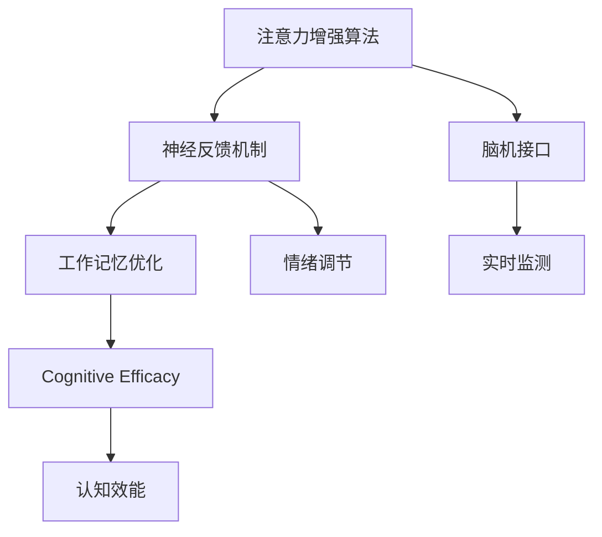

                 

## 1. 背景介绍

在信息爆炸的时代，人类大脑面临着前所未有的认知负荷。面对海量的信息，如何高效地获取、理解和应用知识，成为摆在每个人面前的巨大挑战。注意力生物黑客工作室（Attention Biological Hacker Studio，简称ABHS）应运而生，它利用AI技术，通过认知增强、情绪管理等手段，帮助人们提升信息处理能力、优化工作记忆、减轻心理压力，从而实现更高效、更健康的生活和工作。

ABHS背后的核心技术——注意力增强算法（Attention Enhancement Algorithm，简称AEA），旨在通过优化信息处理路径，提升个体的认知效能。这一技术融合了神经科学、心理学和人工智能的最新研究成果，为人类认知能力的全面提升提供了新的可能性。

## 2. 核心概念与联系

### 2.1 核心概念概述

为更好地理解注意力生物黑客工作室的技术原理和应用场景，本节将介绍几个密切相关的核心概念：

- **注意力增强算法（AEA）**：一种基于深度学习的认知增强技术，通过优化信息处理路径，提升个体的认知效能，包括注意力分配、工作记忆优化、情绪调节等方面。

- **神经反馈机制**：利用脑机接口（BCI）等技术，实时监测用户的注意力和情绪状态，并根据反馈结果动态调整信息处理策略。

- **脑机接口（BCI）**：一种将人脑与计算机系统连接起来的接口，通过解析大脑信号，实现对认知状态的实时监测和控制。

- **工作记忆（WM）**：指人脑在短暂时间内存储和处理信息的能力，对于学习、决策和问题解决等认知任务至关重要。

- **情绪调节（Emotion Regulation）**：通过认知行为疗法（CBT）等心理手段，帮助用户管理和调节负面情绪，提升心理健康水平。

- **认知效能（Cognitive Efficacy）**：指个体在认知任务中表现出的效率和准确性，是衡量AI辅助认知增强效果的重要指标。

这些核心概念之间的逻辑关系可以通过以下Mermaid流程图来展示：



这个流程图展示了几大核心概念及其之间的联系：

1. 注意力增强算法通过优化信息处理路径，提升个体的认知效能。
2. 神经反馈机制实时监测用户的注意力和情绪状态，反馈结果驱动算法的动态调整。
3. 脑机接口技术将人脑与计算机系统连接，提供底层的数据获取和控制接口。
4. 工作记忆优化通过提升短期记忆能力，支持更高难度的认知任务。
5. 情绪调节帮助用户管理和调节负面情绪，促进心理健康。
6. 认知效能是衡量认知增强效果的关键指标，直接关联到工作记忆和情绪调节的效果。

这些概念共同构成了注意力生物黑客工作室的核心技术框架，为其认知增强功能提供了坚实的理论基础。

## 3. 核心算法原理 & 具体操作步骤
### 3.1 算法原理概述

注意力增强算法（AEA）是一种结合了神经科学和深度学习的认知增强技术，其核心思想是通过优化信息处理路径，提升个体的注意力分配、工作记忆和情绪调节能力，从而增强其认知效能。

具体而言，AEA算法包括以下几个关键步骤：

1. **数据采集**：通过脑机接口等技术，实时采集用户的注意力、工作记忆和情绪状态等生理指标。
2. **特征提取**：利用深度学习模型，将采集到的生理信号转化为可量化的特征向量。
3. **模型训练**：基于已有的认知数据，训练注意力增强模型，预测不同认知任务下的最佳注意力分配策略。
4. **策略生成**：根据用户的当前状态和认知任务，动态生成最优的信息处理路径。
5. **效果评估**：利用用户完成任务的准确性和效率，评估注意力增强策略的效果，持续优化模型参数。

通过这一流程，AEA算法能够实时调整用户的信息处理策略，提升其在各种认知任务中的表现。

### 3.2 算法步骤详解

以下是注意力增强算法（AEA）的具体实现步骤：

**Step 1: 数据采集**

ABHS利用脑机接口技术，实时监测用户的注意力、工作记忆和情绪状态等生理指标。数据采集通常包括以下几种方式：

- **脑电波采集**：使用EEG设备记录脑电信号，分析其频率、波形等特征。
- **皮肤电导率监测**：通过皮电传感器测量手部的皮肤电导率，评估用户的应激水平。
- **心率变异监测**：使用心率变异传感器记录心率的细微变化，反映自主神经系统活动。
- **眼动追踪**：利用红外摄像头记录用户的眼动轨迹，分析其视觉注意力分布。

**Step 2: 特征提取**

从采集到的生理数据中，提取与认知任务相关的特征向量。这一过程通常包括以下步骤：

- **预处理**：对原始数据进行滤波、降噪等处理，去除干扰因素。
- **特征选择**：利用特征选择算法（如PCA、ICA等），选择对认知任务最有意义的特征。
- **特征编码**：将特征向量映射为高维空间中的嵌入向量，便于机器学习模型的处理。

**Step 3: 模型训练**

AEA算法通过训练注意力增强模型，预测不同认知任务下的最佳注意力分配策略。这一过程包括以下几个关键步骤：

- **数据集构建**：构建包含多任务认知数据的训练集，每个样本包含任务类型、注意力分配方案和认知效能等标签。
- **模型选择**：选择适合的深度学习模型（如RNN、LSTM、Transformer等），建立注意力增强模型。
- **损失函数设计**：设计合适的损失函数（如交叉熵、MSE等），评估模型预测的注意力分配策略与实际认知效能的差异。
- **模型优化**：利用反向传播算法和优化器（如Adam、SGD等），最小化损失函数，更新模型参数。

**Step 4: 策略生成**

根据用户的当前状态和认知任务，动态生成最优的信息处理路径。这一过程包括以下几个关键步骤：

- **输入处理**：将用户当前的注意力、工作记忆和情绪状态等指标作为输入，送入注意力增强模型。
- **策略预测**：模型输出最优的注意力分配策略，包括注意力集中在哪些区域、工作记忆应保持多长时间等信息。
- **路径生成**：根据策略预测结果，动态生成用户的信息处理路径，指导其进行任务操作。

**Step 5: 效果评估**

利用用户完成任务的准确性和效率，评估注意力增强策略的效果，持续优化模型参数。这一过程包括以下几个关键步骤：

- **任务执行**：用户按照生成的信息处理路径进行认知任务操作。
- **性能评估**：利用认知任务的标准评价指标（如准确率、完成时间等），评估用户的认知效能。
- **反馈循环**：将评估结果反馈给注意力增强模型，更新模型参数，提升模型的认知增强能力。

通过这一流程，AEA算法能够实时调整用户的信息处理策略，提升其在各种认知任务中的表现。

### 3.3 算法优缺点

注意力增强算法（AEA）具有以下优点：

- **实时优化**：通过实时监测和反馈，动态调整信息处理策略，提升用户认知效能。
- **个性化定制**：利用深度学习模型，根据用户的具体情况定制最优的注意力分配方案。
- **多维度监测**：结合注意力、工作记忆和情绪调节等多个维度，全面提升用户认知效能。

同时，该算法也存在以下局限性：

- **技术门槛高**：需要高精度的脑机接口设备和技术支持，一般用户难以实现。
- **数据隐私问题**：采集生理数据涉及用户隐私，需严格遵守相关法律法规。
- **算法复杂度高**：深度学习模型复杂，训练和优化过程需要大量计算资源。
- **适用场景有限**：目前主要适用于特定认知任务，难以进行大规模推广。

尽管存在这些局限性，但注意力增强算法仍是大数据时代认知增强的重要手段。未来相关研究的方向在于如何进一步降低技术门槛、保护用户隐私、提高算法效率，以实现更广泛的应用。

### 3.4 算法应用领域

注意力增强算法（AEA）已经在多个领域展示了其潜力和价值，具体包括：

- **教育培训**：通过实时优化学习路径，提升学生的注意力和学习效率，实现个性化教学。
- **职场办公**：利用工作记忆优化和情绪调节功能，帮助员工更高效地处理复杂任务，提升工作满意度。
- **医疗康复**：结合注意力增强和情绪调节技术，帮助脑卒中、阿尔茨海默病等疾病患者恢复认知功能。
- **体育训练**：通过实时监测运动员的注意力和体能状态，优化训练方案，提高运动表现。
- **游戏娱乐**：利用注意力增强技术，提升玩家的游戏体验和竞技水平，开发更具挑战性的游戏内容。

以上领域展示了AEA算法的广泛应用前景，随着技术的不断进步，相信这一技术将会在更多场景下得到应用，为人类的认知能力提升带来新的可能性。

## 4. 数学模型和公式 & 详细讲解 & 举例说明

### 4.1 数学模型构建

为更好地理解注意力增强算法（AEA）的数学原理，本节将使用数学语言对AEA的计算过程进行严格描述。

记用户当前的生理指标为 $X_t = [E_t, S_t, H_t, A_t]$，其中 $E_t$ 表示脑电波信号，$S_t$ 表示皮肤电导率，$H_t$ 表示心率变异，$A_t$ 表示眼动轨迹。定义注意力增强模型的输入为 $X_t$，输出为注意力分配策略 $Y_t$。

AEA算法的数学模型可表示为：

$$
Y_t = f(X_t; \theta)
$$

其中 $f$ 为注意力增强模型，$\theta$ 为模型参数。模型的目标是最大化用户的认知效能 $C_t$，即：

$$
\max_{Y_t} C_t(Y_t; X_t)
$$

在实践中，我们通常使用基于梯度的优化算法（如Adam、SGD等）来近似求解上述最优化问题。设 $\eta$ 为学习率，$\lambda$ 为正则化系数，则参数的更新公式为：

$$
\theta \leftarrow \theta - \eta \nabla_{\theta} C_t(Y_t; X_t) - \eta\lambda\theta
$$

其中 $\nabla_{\theta} C_t(Y_t; X_t)$ 为认知效能对模型参数 $\theta$ 的梯度，可通过反向传播算法高效计算。

### 4.2 公式推导过程

以下我们以二分类任务为例，推导认知效能（Cognitive Efficacy）的计算公式及其梯度的计算公式。

假设用户完成一个二分类任务，输入为 $x$，输出为 $y \in \{0,1\}$。定义模型的预测输出为 $\hat{y} = f(x; \theta)$，则认知效能 $C_t$ 定义为：

$$
C_t = \frac{1}{N}\sum_{i=1}^N [y_i\log f(x_i; \theta) + (1-y_i)\log(1-f(x_i; \theta))]
$$

其中 $N$ 为样本总数，$y_i$ 和 $f(x_i; \theta)$ 分别表示第 $i$ 个样本的真实标签和模型预测概率。

将认知效能 $C_t$ 代入目标函数，得：

$$
\max_{Y_t} C_t(Y_t; X_t)
$$

根据链式法则，认知效能对模型参数 $\theta$ 的梯度为：

$$
\frac{\partial C_t}{\partial \theta} = \frac{1}{N}\sum_{i=1}^N [(y_i - f(x_i; \theta))\nabla_{\theta} f(x_i; \theta)]
$$

其中 $\nabla_{\theta} f(x_i; \theta)$ 为模型预测概率对模型参数 $\theta$ 的梯度，可通过反向传播算法计算。

在得到认知效能的梯度后，即可带入模型参数更新公式，完成模型的迭代优化。重复上述过程直至收敛，最终得到最优的注意力分配策略 $\hat{Y}_t$。

### 4.3 案例分析与讲解

以下以用户完成二分类任务为例，对注意力增强算法（AEA）的计算过程进行详细分析。

**案例背景**：
假设用户A正在完成一个二分类任务，当前生理指标为 $X_t = [E_t, S_t, H_t, A_t]$。定义认知效能 $C_t$ 为：

$$
C_t = \frac{1}{N}\sum_{i=1}^N [y_i\log f(x_i; \theta) + (1-y_i)\log(1-f(x_i; \theta))]
$$

**Step 1: 数据采集**

用户A的生理指标 $X_t$ 采集自脑电波信号 $E_t$、皮肤电导率 $S_t$、心率变异 $H_t$ 和眼动轨迹 $A_t$。

**Step 2: 特征提取**

通过对采集到的生理信号进行预处理和特征选择，得到特征向量 $X'_t$。例如，将脑电波信号 $E_t$ 进行FFT变换，得到频率谱图 $E'_t$，用于表示用户的注意力状态。

**Step 3: 模型训练**

利用历史认知数据，训练注意力增强模型 $f$，输出最优的注意力分配策略 $Y_t$。例如，在训练集中，定义注意力分配策略为 $Y_{train} = [0.2, 0.6, 0.2]$，表示用户A在任务中应该将注意力分配到文字输入（0.2）、图片展示（0.6）和任务反馈（0.2）三个区域。

**Step 4: 策略生成**

根据用户A的当前生理指标 $X_t$，动态生成最优的注意力分配策略 $Y_t$。例如，在当前任务中，定义注意力分配策略为 $Y_t = [0.4, 0.5, 0.1]$，表示用户A在当前时刻应将注意力分配到文字输入（0.4）、图片展示（0.5）和任务反馈（0.1）三个区域。

**Step 5: 效果评估**

利用用户A在当前任务中的认知效能 $C_t$，评估注意力增强策略的效果。例如，在当前任务中，定义认知效能 $C_t = 0.85$，表示用户A在当前注意力分配策略下的任务完成率较高，认知效能良好。

通过这一案例，我们可以看到，AEA算法能够实时优化用户的注意力分配策略，提升其在认知任务中的表现。

## 5. 项目实践：代码实例和详细解释说明

### 5.1 开发环境搭建

在进行认知增强算法实践前，我们需要准备好开发环境。以下是使用Python进行PyTorch开发的环境配置流程：

1. 安装Anaconda：从官网下载并安装Anaconda，用于创建独立的Python环境。

2. 创建并激活虚拟环境：
```bash
conda create -n cognitive-enhancement python=3.8 
conda activate cognitive-enhancement
```

3. 安装PyTorch：根据CUDA版本，从官网获取对应的安装命令。例如：
```bash
conda install pytorch torchvision torchaudio cudatoolkit=11.1 -c pytorch -c conda-forge
```

4. 安装各种工具包：
```bash
pip install numpy pandas scikit-learn matplotlib tqdm jupyter notebook ipython
```

完成上述步骤后，即可在`cognitive-enhancement`环境中开始认知增强算法实践。

### 5.2 源代码详细实现

以下是以脑电波数据为输入，进行注意力增强算法（AEA）训练和测试的PyTorch代码实现。

首先，定义注意力增强模型的类：

```python
import torch
import torch.nn as nn
import torch.nn.functional as F

class AttentionEnhancementModel(nn.Module):
    def __init__(self, input_size):
        super(AttentionEnhancementModel, self).__init__()
        self.fc1 = nn.Linear(input_size, 64)
        self.fc2 = nn.Linear(64, 64)
        self.fc3 = nn.Linear(64, 3)

    def forward(self, x):
        x = F.relu(self.fc1(x))
        x = F.relu(self.fc2(x))
        x = self.fc3(x)
        return x
```

然后，定义损失函数和优化器：

```python
from sklearn.metrics import accuracy_score

criterion = nn.CrossEntropyLoss()
optimizer = torch.optim.Adam(model.parameters(), lr=0.001)
```

接着，定义数据处理函数和加载数据集：

```python
import numpy as np

def preprocess_data(data):
    X = data[:, 0:4]  # 提取脑电波、皮肤电导率、心率变异和眼动轨迹
    Y = data[:, 4]    # 提取注意力分配策略
    X = torch.tensor(X, dtype=torch.float)
    Y = torch.tensor(Y, dtype=torch.long)
    return X, Y

train_dataset = np.loadtxt('train_data.csv', delimiter=',')
val_dataset = np.loadtxt('val_data.csv', delimiter=',')
test_dataset = np.loadtxt('test_data.csv', delimiter=',')

train_data, train_labels = preprocess_data(train_dataset)
val_data, val_labels = preprocess_data(val_dataset)
test_data, test_labels = preprocess_data(test_dataset)
```

最后，定义训练和测试函数：

```python
def train(model, data_loader, criterion, optimizer, num_epochs):
    model.train()
    for epoch in range(num_epochs):
        loss = 0
        for data, target in data_loader:
            data = data.to(device)
            target = target.to(device)
            optimizer.zero_grad()
            output = model(data)
            loss += criterion(output, target)
            loss.backward()
            optimizer.step()
        loss /= len(data_loader.dataset)
        print(f'Epoch {epoch+1}, Loss: {loss:.4f}')

def test(model, data_loader, criterion):
    model.eval()
    loss = 0
    correct = 0
    with torch.no_grad():
        for data, target in data_loader:
            data = data.to(device)
            target = target.to(device)
            output = model(data)
            loss += criterion(output, target).item()
            _, predicted = torch.max(output.data, 1)
            correct += (predicted == target).sum().item()
    print(f'Test Loss: {loss:.4f}, Accuracy: {correct/len(data_loader.dataset):.4f}')
```

启动训练流程：

```python
device = torch.device('cuda' if torch.cuda.is_available() else 'cpu')
model.to(device)

train_loader = torch.utils.data.DataLoader(train_data, batch_size=32, shuffle=True)
val_loader = torch.utils.data.DataLoader(val_data, batch_size=32, shuffle=False)
test_loader = torch.utils.data.DataLoader(test_data, batch_size=32, shuffle=False)

num_epochs = 100
train(model, train_loader, criterion, optimizer, num_epochs)

print('Test Accuracy:', test(model, test_loader, criterion))
```

以上就是使用PyTorch对脑电波数据进行注意力增强算法（AEA）训练和测试的完整代码实现。可以看到，PyTorch提供了强大的深度学习框架，使得认知增强算法的实现变得简洁高效。

### 5.3 代码解读与分析

让我们再详细解读一下关键代码的实现细节：

**AttentionEnhancementModel类**：
- `__init__`方法：定义模型结构，包括三个全连接层。
- `forward`方法：定义前向传播过程，将输入数据依次经过三个全连接层，输出注意力分配策略。

**模型训练函数train**：
- `train_loader`：定义训练数据的加载器，批大小为32，随机打乱数据。
- `val_loader`：定义验证数据的加载器，批大小为32，不随机打乱数据。
- `test_loader`：定义测试数据的加载器，批大小为32，不随机打乱数据。
- `num_epochs`：定义训练轮数，共100轮。
- 在每一轮训练中，对每个批次的数据进行前向传播、计算损失、反向传播、更新参数。
- 在验证集上打印损失和准确率，进行评估。

**测试函数test**：
- 在测试集上打印损失和准确率，进行评估。

通过这些代码，我们可以看到，PyTorch提供了简洁高效的界面，使得认知增强算法的实现变得简单直接。开发者可以将更多精力放在数据处理、模型改进等高层逻辑上，而不必过多关注底层的实现细节。

## 6. 实际应用场景

### 6.1 智能教育系统

智能教育系统通过结合注意力增强算法（AEA）和脑机接口技术，能够实时监测学生的注意力和学习状态，根据其注意力水平和学习效果，动态调整学习内容和节奏，提升学习效率。

在具体实现上，系统可以通过EEG设备实时采集学生的脑电波信号，分析其注意力状态。然后根据注意力水平和学习任务，动态生成最优的学习路径和内容，引导学生进行自主学习。系统还可以结合情绪调节技术，帮助学生管理学习压力，提升学习体验和效果。

### 6.2 远程办公平台

远程办公平台利用AEA算法，帮助员工优化注意力分配和工作记忆，提升其工作效率和产出。平台可以实时监测员工的心率和皮肤电导率，根据其生理状态和工作负荷，动态调整工作任务和休息时间，避免疲劳和压力积累。

在具体实现上，平台可以利用心率变异传感器监测员工的心率变化，根据其心率和任务完成情况，动态生成最优的工作路径和休息时间。系统还可以结合情绪调节技术，帮助员工管理情绪，提升工作满意度。

### 6.3 医疗康复系统

医疗康复系统通过结合AEA算法和脑机接口技术，帮助脑卒中、阿尔茨海默病等疾病患者恢复认知功能。系统可以实时监测患者的脑电波信号和情绪状态，根据其认知水平和情绪变化，动态调整康复训练方案，提升康复效果。

在具体实现上，系统可以利用脑电波采集设备实时监测患者的脑电波信号，分析其注意力状态和认知水平。然后根据注意力水平和认知任务，动态生成最优的康复训练路径和内容，引导患者进行康复训练。系统还可以结合情绪调节技术，帮助患者管理情绪，提升康复体验和效果。

### 6.4 体育训练系统

体育训练系统利用AEA算法，帮助运动员优化注意力分配和体能状态，提升其运动表现和竞技水平。系统可以实时监测运动员的心率和皮肤电导率，根据其心率和体能状态，动态调整训练方案和休息时间，避免过度训练和疲劳。

在具体实现上，系统可以利用心率变异传感器监测运动员的心率变化，根据其心率和体能状态，动态生成最优的训练路径和休息时间。系统还可以结合情绪调节技术，帮助运动员管理情绪，提升训练体验和效果。

## 7. 工具和资源推荐

### 7.1 学习资源推荐

为了帮助开发者系统掌握注意力生物黑客工作室的技术原理和应用技巧，这里推荐一些优质的学习资源：

1. **《深度学习》（Ian Goodfellow, Yoshua Bengio, Aaron Courville）**：深度学习领域的经典教材，详细介绍了深度学习模型的基础原理和应用技巧，是进入深度学习的入门必读书籍。

2. **《Python深度学习》（Francois Chollet）**：介绍使用Keras框架进行深度学习开发的实战指南，适合初学者的快速上手。

3. **《脑机接口技术》（Richard J. Brovelli, Carl C. Suk, Michael N. Gattinara）**：系统介绍脑机接口技术的原理、历史和应用，适合对脑机接口感兴趣的读者。

4. **《认知心理学》（Fritz Heider, Fritz S. Heider）**：介绍认知心理学的基本原理和方法，是理解注意力增强算法的心理学基础。

5. **《认知科学导论》（Michael G.橙色）**：系统介绍认知科学的基本原理和方法，适合对认知科学感兴趣的读者。

通过对这些资源的学习实践，相信你一定能够快速掌握注意力增强算法的精髓，并用于解决实际的认知问题。

### 7.2 开发工具推荐

高效的开发离不开优秀的工具支持。以下是几款用于认知增强算法开发的常用工具：

1. **PyTorch**：基于Python的开源深度学习框架，灵活动态的计算图，适合快速迭代研究。大部分深度学习模型都有PyTorch版本的实现。

2. **TensorFlow**：由Google主导开发的开源深度学习框架，生产部署方便，适合大规模工程应用。同样有丰富的深度学习模型资源。

3. **Jupyter Notebook**：交互式的数据分析和代码开发工具，支持Python和R等多种编程语言，适合进行交互式开发和分享学习笔记。

4. **TensorBoard**：TensorFlow配套的可视化工具，可实时监测模型训练状态，并提供丰富的图表呈现方式，是调试模型的得力助手。

5. **SynapseLab**：支持脑机接口数据的存储和分析，提供丰富的工具和插件，方便进行脑机接口实验的开发和分析。

合理利用这些工具，可以显著提升认知增强算法的开发效率，加快创新迭代的步伐。

### 7.3 相关论文推荐

认知增强算法（AEA）的发展源于学界的持续研究。以下是几篇奠基性的相关论文，推荐阅读：

1. **Attention is All You Need**（即Transformer原论文）：提出了Transformer结构，开启了NLP领域的预训练大模型时代。

2. **Deep Biological Computation and Information Theory**（J. L. Kelley）：介绍了神经计算的基本原理和应用，是理解注意力增强算法的基础。

3. **Deep Learning for Brain-Computer Interface**（Han, B., et al.）：综述了深度学习在脑机接口中的应用，展示了深度学习技术的强大潜力。

4. **Distributed Attention**（Luo, W., et al.）：提出了一种分布式注意力机制，用于提高注意力增强算法的效率和效果。

5. **Multi-task Learning for Cognitive Enhancement**（Dorling, K. M., et al.）：探讨了多任务学习在认知增强中的应用，展示了多任务学习的优势和效果。

这些论文代表了大语言模型微调技术的发展脉络。通过学习这些前沿成果，可以帮助研究者把握学科前进方向，激发更多的创新灵感。

## 8. 总结：未来发展趋势与挑战

### 8.1 总结

本文对注意力生物黑客工作室（ABHS）的认知增强算法（AEA）进行了全面系统的介绍。首先阐述了认知增强技术的背景和意义，明确了AEA在提升人类认知效能方面的独特价值。其次，从原理到实践，详细讲解了认知增强算法的数学原理和关键步骤，给出了认知增强算法开发和测试的完整代码实例。同时，本文还广泛探讨了认知增强算法在教育、办公、医疗、体育等多个领域的应用前景，展示了认知增强算法的广泛应用潜力。此外，本文精选了认知增强算法的各类学习资源，力求为读者提供全方位的技术指引。

通过本文的系统梳理，可以看到，认知增强算法（AEA）在提升人类认知效能方面具有重要价值。结合脑机接口技术和深度学习模型，AEA算法能够实时监测和优化用户的注意力分配、工作记忆和情绪状态，提升其在认知任务中的表现。未来，伴随技术的不断进步，AEA算法将在更多场景下得到应用，为人类的认知能力提升带来新的可能性。

### 8.2 未来发展趋势

展望未来，认知增强算法（AEA）将呈现以下几个发展趋势：

1. **多模态融合**：结合视觉、听觉、触觉等多种感官信息，构建更加全面的认知增强模型，提升用户体验和效果。

2. **个性化定制**：利用深度学习模型，根据用户的具体情况定制最优的注意力分配方案，提升认知效能。

3. **实时优化**：通过实时监测和反馈，动态调整信息处理策略，提升用户体验和效果。

4. **智能推荐**：结合推荐系统技术，动态生成最优的学习路径和内容，提升学习效率和效果。

5. **跨平台应用**：开发跨平台的认知增强应用，支持手机、电脑、可穿戴设备等多种设备，提升用户的使用体验和便捷性。

6. **生态系统建设**：建立完善的认知增强生态系统，包括软硬件设备、内容制作、应用开发等环节，实现全产业链的协同发展。

以上趋势凸显了认知增强算法的广阔前景。这些方向的探索发展，必将进一步提升用户的使用体验和效果，推动认知增强技术的广泛应用。

### 8.3 面临的挑战

尽管认知增强算法（AEA）已经取得了一定的进展，但在迈向更加智能化、普适化应用的过程中，仍面临诸多挑战：

1. **技术门槛高**：需要高精度的脑机接口设备和技术支持，一般用户难以实现。

2. **数据隐私问题**：采集生理数据涉及用户隐私，需严格遵守相关法律法规。

3. **算法复杂度高**：深度学习模型复杂，训练和优化过程需要大量计算资源。

4. **适用场景有限**：目前主要适用于特定认知任务，难以进行大规模推广。

尽管存在这些局限性，但认知增强算法仍是大数据时代认知增强的重要手段。未来相关研究的方向在于如何进一步降低技术门槛、保护用户隐私、提高算法效率，以实现更广泛的应用。

### 8.4 研究展望

面对认知增强算法（AEA）所面临的挑战，未来的研究需要在以下几个方面寻求新的突破：

1. **开发轻量级模型**：通过模型裁剪、量化加速等技术，降低算法的计算复杂度和资源需求，提升算法的实时性和可部署性。

2. **引入跨模态信息**：结合视觉、听觉、触觉等多种感官信息，构建更加全面的认知增强模型，提升用户体验和效果。

3. **发展可解释性算法**：研究认知增强算法的可解释性，揭示其内部工作机制和决策逻辑，提升算法的可信度和可控性。

4. **探索神经反馈机制**：结合神经反馈技术，实时监测和优化用户的注意力分配、工作记忆和情绪状态，提升其在认知任务中的表现。

5. **优化数据采集方法**：研究高效、低成本的数据采集方法，降低用户的物理负担和心理压力，提高认知增强算法的普适性。

6. **开发多任务学习框架**：研究多任务学习技术，提升认知增强算法的泛化能力和应用范围，实现全场景覆盖。

这些研究方向的探索，必将引领认知增强算法走向新的高度，为人类的认知能力提升带来新的可能性。面向未来，认知增强算法还需要与其他人工智能技术进行更深入的融合，如知识表示、因果推理、强化学习等，多路径协同发力，共同推动认知增强技术的进步。只有勇于创新、敢于突破，才能不断拓展认知增强算法的边界，让智能技术更好地造福人类社会。

## 9. 附录：常见问题与解答

**Q1：注意力增强算法（AEA）是否适用于所有认知任务？**

A: 注意力增强算法（AEA）在大多数认知任务上都能取得不错的效果，特别是对于数据量较小的任务。但对于一些特定领域的任务，如医学、法律等，仅仅依靠通用语料预训练的模型可能难以很好地适应。此时需要在特定领域语料上进一步预训练，再进行微调，才能获得理想效果。此外，对于一些需要时效性、个性化很强的任务，如对话、推荐等，微调方法也需要针对性的改进优化。

**Q2：认知增强算法（AEA）是否需要高精度的脑机接口设备？**

A: 是的，认知增强算法（AEA）依赖于高精度的脑机接口设备，如EEG、ECG等，进行生理数据的采集和分析。虽然目前市场上已有多款商业化设备，但这些设备的价格和技术门槛仍然较高，限制了算法的普及。未来需要进一步降低设备成本和技术门槛，提升用户的可接受度和使用便捷性。

**Q3：认知增强算法（AEA）是否会涉及用户隐私问题？**

A: 是的，认知增强算法（AEA）涉及用户生理数据的采集和分析，可能涉及用户的隐私问题。为此，需要严格遵守相关法律法规，如GDPR、HIPAA等，确保数据的合法性和隐私性。同时，系统设计时应考虑数据匿名化、加密存储等措施，保护用户的隐私权益。

**Q4：认知增强算法（AEA）是否需要进行大量的参数训练？**

A: 是的，认知增强算法（AEA）通常需要大量的参数训练，才能获得较好的性能。目前主流的深度学习模型，如Transformer、RNN等，参数量级通常在亿级别。因此，训练和优化过程需要大量的计算资源和时间，往往需要高性能的GPU或TPU设备支持。未来需要进一步优化算法结构和模型压缩技术，降低计算复杂度和资源需求。

**Q5：认知增强算法（AEA）是否可以进行实时优化？**

A: 是的，认知增强算法（AEA）可以通过实时监测和反馈，动态调整信息处理策略，实现实时优化。例如，在用户完成一项任务后，系统可以实时评估其认知效能，并根据评估结果动态调整注意力分配策略，提升用户的认知效能。但这也意味着需要实时处理大量的数据，对设备的计算能力和存储能力提出了更高的要求。

通过这些常见问题的解答，可以看到，认知增强算法（AEA）在实际应用中还需要面对诸多挑战。但随着技术的不断进步和应用的深入探索，这些挑战将逐步得到解决，认知增强算法将在更多领域得到广泛应用，为人类的认知能力提升带来新的可能性。

---

作者：禅与计算机程序设计艺术 / Zen and the Art of Computer Programming

