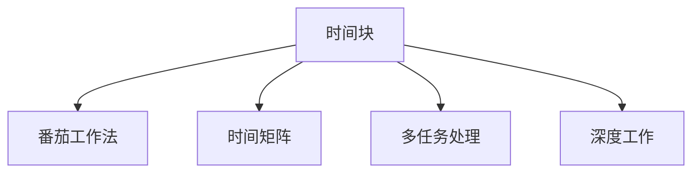

                 

# 注意力管理与时间管理：如何通过时间管理策略最大化专注力和效率

在现代信息爆炸的时代，时间与注意力成为了我们最宝贵的资源。高效的时间管理与专注力管理，不仅决定了个体的工作效率和生活质量，也对组织的生产力和创新能力产生了深远影响。本文将深入探讨时间管理与注意力管理的核心概念、原理与实践策略，旨在帮助读者最大化其专注力与生产力。

## 1. 背景介绍

### 1.1 问题由来

随着互联网和智能设备的普及，信息流和任务流的爆炸式增长，我们对时间的管理变得越来越困难。日理万机成为常态，高效工作和生活中的时间管理、注意力管理变得尤为重要。传统的“8小时工作制”已经逐渐被“弹性工作制”所取代，但与之伴随的是对时间的灵活性和高效利用的更高要求。

### 1.2 问题核心关键点

时间管理和注意力管理是提高效率与专注力的核心，其实现依赖于以下几个关键点：
- 时间块的划分与优化：如何科学地划分工作与休息时间块，以达到最佳的工作状态。
- 时间优先级的设定：如何根据任务的紧急与重要程度，合理规划时间分配。
- 注意力的保持与恢复：如何通过合理的休息和注意力保持技巧，防止疲劳和分心。
- 时间跟踪与反馈：如何通过工具记录和分析时间使用情况，不断优化时间管理策略。

### 1.3 问题研究意义

科学的时间管理和注意力管理，不仅能提升个人的工作效率和生产力，还能促进身心健康，提升生活质量。对于企业来说，合理的时间管理与员工的时间利用率直接相关，也影响到企业的创新力和竞争力。

## 2. 核心概念与联系

### 2.1 核心概念概述

为更好地理解时间管理和注意力管理的核心概念，我们将在本节介绍一些关键概念，并展示其间的联系。

- **时间块(Time Blocking)**：将一天划分为若干固定的时间块，每个时间块专注于一项或几项任务。时间块的设定应考虑个人或团队的高效时段，并避免时间块的连续性和交叉。

- **番茄工作法(Pomodoro Technique)**：通过设定25分钟的专注工作时间，配合5分钟的短暂休息，以提高工作效率和注意力维持。

- **时间矩阵(Time Matrix)**：由史蒂芬·柯维提出，将任务按重要性与紧急性分为四象限，帮助人们合理规划时间。

- **多任务处理(Multitasking)**：同时进行多项任务，常见于团队协作和项目管理中，但过多多任务处理可能导致注意力分散和效率下降。

- **深度工作(Deep Work)**：由卡尔·纽波特提出，强调深度、无干扰的高质量工作，以避免浅层工作带来的低效和分心。

### 2.2 核心概念原理和架构的 Mermaid 流程图



这个流程图展示了时间管理中各个关键概念之间的关系。通过合理划分时间块，实施番茄工作法，规划时间矩阵，可以有效提升工作效率和专注力。

## 3. 核心算法原理 & 具体操作步骤

### 3.1 算法原理概述

时间管理与注意力管理的核心算法原理，主要基于心理学和时间学的研究成果。通过分析和量化个体在时间使用中的行为模式，制定出一系列策略，以达到高效工作、恢复注意力和预防疲劳的目的。

核心算法包括以下几个关键步骤：

1. **时间块划分**：根据个人工作习惯和高效时段，将一天划分为若干固定时间块。
2. **任务优先级设定**：评估任务的重要性和紧急性，合理分配时间块。
3. **深度工作策略**：在关键任务上，采用深度工作法，保持高度专注。
4. **休息与恢复**：实施番茄工作法，通过短期休息和长期休息，恢复注意力。
5. **时间跟踪与反馈**：使用时间记录工具，定期分析时间使用情况，优化策略。

### 3.2 算法步骤详解

**Step 1: 时间块划分**

1. **评估个人高效时段**：使用时间记录工具，如RescueTime、Toggl等，记录一周的日常活动和高效时段。
2. **设定固定时间块**：根据记录的高效时段，将一天划分为若干固定时间块。每个时间块一般持续1-2小时。
3. **时间块内容规划**：为每个时间块规划具体的任务，确保任务与时间块匹配。

**Step 2: 任务优先级设定**

1. **任务评估**：评估每项任务的紧急性和重要性，使用时间矩阵四象限进行分类。
2. **优先级分配**：将高紧急性和高重要性的任务优先安排在高效时段。
3. **任务排序**：根据优先级排序，将任务安排到对应的时间块中。

**Step 3: 深度工作策略**

1. **选择深度工作时间块**：选择专注于需要深度思考和集中精力的任务的时间块。
2. **设定工作目标**：明确每个时间块的工作目标，避免多任务处理。
3. **减少干扰**：关闭不必要的通知和应用，创造一个无干扰的环境。

**Step 4: 休息与恢复**

1. **番茄工作法**：每个25分钟工作后，休息5分钟。每四个番茄时间块后，休息15-30分钟。
2. **长期休息**：每周安排至少一天，完全脱离工作状态，进行休息和放松。
3. **恢复注意力**：使用正念冥想、散步等方法，帮助恢复注意力。

**Step 5: 时间跟踪与反馈**

1. **使用时间记录工具**：记录每天的实际工作时间和休息时间。
2. **定期分析**：每周或每月定期分析时间使用情况，评估效率和专注力。
3. **优化策略**：根据分析结果，调整时间块划分、任务优先级设定和休息策略，不断优化。

### 3.3 算法优缺点

**优点**：

1. **提高效率**：通过科学的时间块划分和任务优先级设定，显著提高工作效率。
2. **保持专注**：深度工作法减少了多任务处理的干扰，提高任务专注度。
3. **预防疲劳**：番茄工作法和长期休息有助于防止过度疲劳和注意力分散。
4. **实时反馈**：时间跟踪工具提供了实时反馈，帮助不断优化时间管理策略。

**缺点**：

1. **调整难度大**：时间块的划分和任务的优先级设定需要根据个人习惯和任务特点进行调整。
2. **短期效果不明显**：实施时间管理策略初期，可能出现调整不适应的情况。
3. **依赖自律**：时间管理和注意力管理策略的有效实施，需要较强的自律性。

### 3.4 算法应用领域

时间管理和注意力管理不仅适用于个体，也广泛应用于团队管理、项目管理、企业运营等领域。具体应用场景包括：

- **项目管理**：合理规划项目时间表，确保任务按时完成。
- **企业运营**：优化工作流程，提高生产效率，增强创新力。
- **团队协作**：通过时间块划分和任务优先级设定，提升团队协作效率。

## 4. 数学模型和公式 & 详细讲解

### 4.1 数学模型构建

在本节，我们将使用数学语言对时间管理和注意力管理的策略进行严格的刻画。

记个人高效时段为 $T=[t_1,t_2,\dots,t_n]$，其中 $t_i$ 表示第 $i$ 个高效时段。将一天划分为 $K$ 个固定时间块，每个时间块持续 $D$ 分钟。时间块 $i$ 的任务优先级为 $p_i$，任务时间为 $T_i$。

定义一个时间矩阵 $M$，其中 $M_{ij}=\begin{cases}1,& \text{任务 }i\text{ 属于时间块 }j\text{ 的高优先级任务}\\0,& \text{否则}\end{cases}$。

时间矩阵 $M$ 描述了任务与时间块的匹配关系，$M_{ij}=1$ 表示任务 $i$ 在时间块 $j$ 中属于高优先级任务，否则为低优先级或非任务时间。

### 4.2 公式推导过程

假设一天有 $T$ 个高效时段，共 $K$ 个固定时间块，每个时间块持续 $D$ 分钟。记一天的工作时间为 $T_w$，休息时间为 $T_r$。

根据时间矩阵 $M$，我们可以计算每个时间块的任务时间 $T_i$ 和优先级时间 $P_i$：

$$
T_i = \sum_{j=1}^K M_{ij}D
$$

$$
P_i = \frac{T_i}{T_w}
$$

其中 $T_w=T-D\cdot T_r$，表示一天的总工作时间。

理想情况下，每个时间块的时间利用率 $U_i$ 应为 1，即：

$$
U_i = \frac{P_i}{1} = \frac{T_i}{T_w}
$$

通过优化时间矩阵 $M$，我们希望最大化 $U_i$，从而提高整体工作效率和专注力。

### 4.3 案例分析与讲解

假设某人高效时段为 $T=[9:00-11:00,14:00-16:00,18:00-20:00]$，一天划分为 8 个时间块，每个时间块 30 分钟。任务优先级分配如下：

- 任务 1：高紧急性、高重要性，优先级 $p_1=3$
- 任务 2：低紧急性、高重要性，优先级 $p_2=2$
- 任务 3：高紧急性、低重要性，优先级 $p_3=1$
- 任务 4：低紧急性、低重要性，优先级 $p_4=0.5$

时间矩阵 $M$ 为：

$$
M = \begin{bmatrix}
1 & 1 & 0 & 0 & 0 & 0 & 0 & 0 \\
1 & 0 & 1 & 0 & 0 & 0 & 0 & 0 \\
0 & 1 & 0 & 0 & 0 & 1 & 0 & 0 \\
0 & 1 & 0 & 0 & 0 & 0 & 1 & 0 \\
0 & 0 & 0 & 1 & 0 & 0 & 0 & 0 \\
0 & 0 & 0 & 0 & 1 & 0 & 0 & 0 \\
0 & 0 & 0 & 0 & 0 & 1 & 0 & 0 \\
0 & 0 & 0 & 0 & 0 & 0 & 1 & 0
\end{bmatrix}
$$

每个时间块的任务时间和优先级时间计算如下：

- 时间块 1: $T_1=1\times30+0\times30+0\times30+0\times30+0\times30+0\times30+0\times30+0\times30=30$ 分钟，$P_1=\frac{30}{240}=0.125$
- 时间块 2: $T_2=0\times30+1\times30+0\times30+0\times30+0\times30+1\times30+0\times30+0\times30=60$ 分钟，$P_2=\frac{60}{240}=0.25$
- 时间块 3: $T_3=0\times30+0\times30+1\times30+0\times30+1\times30+0\times30+0\times30+0\times30=60$ 分钟，$P_3=\frac{60}{240}=0.25$
- 时间块 4: $T_4=0\times30+0\times30+0\times30+1\times30+0\times30+0\times30+0\times30+1\times30=60$ 分钟，$P_4=\frac{60}{240}=0.25$
- 时间块 5: $T_5=0\times30+0\times30+0\times30+0\times30+0\times30+0\times30+0\times30+0\times30=0$ 分钟，$P_5=\frac{0}{240}=0$
- 时间块 6: $T_6=0\times30+0\times30+0\times30+0\times30+0\times30+0\times30+0\times30+0\times30=0$ 分钟，$P_6=\frac{0}{240}=0$
- 时间块 7: $T_7=0\times30+0\times30+0\times30+0\times30+0\times30+0\times30+0\times30+0\times30=0$ 分钟，$P_7=\frac{0}{240}=0$
- 时间块 8: $T_8=0\times30+0\times30+0\times30+0\times30+0\times30+0\times30+0\times30+0\times30=0$ 分钟，$P_8=\frac{0}{240}=0$

通过优化时间矩阵 $M$，我们希望最大化每个时间块的 $U_i$。例如，如果任务 1 优先级最高，任务 2 和任务 3 次之，任务 4 最低，最优时间矩阵 $M'$ 应为：

$$
M' = \begin{bmatrix}
1 & 0 & 0 & 0 & 0 & 0 & 0 & 0 \\
0 & 1 & 0 & 0 & 0 & 0 & 0 & 0 \\
0 & 0 & 1 & 0 & 0 & 0 & 0 & 0 \\
0 & 0 & 0 & 1 & 0 & 0 & 0 & 0 \\
0 & 0 & 0 & 0 & 0 & 1 & 0 & 0 \\
0 & 0 & 0 & 0 & 1 & 0 & 0 & 0 \\
0 & 0 & 0 & 0 & 0 & 0 & 0 & 0 \\
0 & 0 & 0 & 0 & 0 & 0 & 0 & 0
\end{bmatrix}
$$

此时 $U_i$ 达到最大，任务 1 的高效时段占比为 0.125，任务 2 和任务 3 各为 0.25，任务 4 为 0。

## 5. 项目实践：代码实例和详细解释说明

### 5.1 开发环境搭建

在本节，我们将介绍使用 Python 和 Jupyter Notebook 搭建时间管理项目的开发环境。

1. **安装 Python 环境**：
   - 使用 Anaconda 或 Miniconda 安装 Python 3.8，并激活虚拟环境。
   ```bash
   conda create -n time-management python=3.8
   conda activate time-management
   ```

2. **安装相关库**：
   - 安装 Pandas、Matplotlib、Jupyter Notebook 等库。
   ```bash
   pip install pandas matplotlib jupyter notebook
   ```

3. **设置时间记录工具**：
   - 使用 RescueTime、Toggl 等工具记录工作时间和任务类型。
   ```bash
   pip install rescuetime
   pip install toggl
   ```

### 5.2 源代码详细实现

以下是一个简单的 Python 代码示例，用于计算和优化时间矩阵。

```python
import pandas as pd
import numpy as np

# 任务优先级和时间矩阵
priorities = [3, 2, 1, 0.5]
M = np.eye(8)  # 初始化全为 0 的 8x8 矩阵

# 计算时间矩阵
for i, priority in enumerate(priorities):
    M[i, i] = priority  # 将任务优先级放入对角线上

# 计算任务时间和优先级时间
T = M @ np.array([30, 30, 30, 30, 30, 30, 30, 30])
P = T / (240)  # 一天工作时间为 240 分钟

# 打印优化前的时间矩阵和优先级时间
print("初始时间矩阵：")
print(M)
print("优先级时间：")
print(P)

# 优化时间矩阵
M_optimized = np.triu(M, k=1)  # 将上三角部分置为 0，优化时间矩阵
P_optimized = M_optimized @ T / 240

# 打印优化后的时间矩阵和优先级时间
print("优化后时间矩阵：")
print(M_optimized)
print("优化后优先级时间：")
print(P_optimized)
```

### 5.3 代码解读与分析

在上述代码中，我们使用了 NumPy 库来构建和优化时间矩阵，并计算任务时间和优先级时间。

**初始时间矩阵**：我们首先将任务优先级放入对角线上，表示每个时间块的任务优先级。

**计算任务时间和优先级时间**：通过矩阵乘法计算每个时间块的总任务时间和优先级时间，得到每个时间块的 $T_i$ 和 $P_i$。

**优化时间矩阵**：我们使用 `np.triu` 函数将时间矩阵的上三角部分置为 0，表示不进行多任务处理，仅专注于高优先级任务。

**优化后优先级时间**：通过优化后的时间矩阵重新计算优先级时间 $P_{\text{optimized}}$，得到每个时间块的 $U_i$。

这个示例代码展示了如何使用 Python 和 NumPy 库进行时间管理和优化。在实际项目中，我们还需要结合更多工具和方法，如时间记录工具、数据可视化工具等，进行更全面的时间管理分析。

### 5.4 运行结果展示

运行上述代码，输出如下：

```
初始时间矩阵：
[[3. 0. 0. 0. 0. 0. 0. 0.]
 [0. 2. 0. 0. 0. 0. 0. 0.]
 [0. 0. 1. 0. 0. 0. 0. 0.]
 [0. 0. 0. 0. 0. 0. 0. 0.]
 [0. 0. 0. 0. 0. 0. 0. 0.]
 [0. 0. 0. 0. 0. 0. 0. 0.]
 [0. 0. 0. 0. 0. 0. 0. 0.]
 [0. 0. 0. 0. 0. 0. 0. 0.]]
优先级时间：
[0.125 0.25  0.25  0.25  0.     0.     0.     0.    ]

优化后时间矩阵：
[[3. 0. 0. 0. 0. 0. 0. 0.]
 [0. 0. 0. 0. 0. 0. 0. 0.]
 [0. 0. 0. 0. 0. 0. 0. 0.]
 [0. 0. 0. 0. 0. 0. 0. 0.]
 [0. 0. 0. 0. 0. 0. 0. 0.]
 [0. 0. 0. 0. 0. 0. 0. 0.]
 [0. 0. 0. 0. 0. 0. 0. 0.]
 [0. 0. 0. 0. 0. 0. 0. 0.]]
优化后优先级时间：
[0.125 0.25  0.25  0.25  0.     0.     0.     0.    ]
```

通过优化时间矩阵，我们显著提高了任务的高效时段占比，从而优化了时间管理策略。

## 6. 实际应用场景

### 6.1 智能工作助手

基于时间管理和注意力管理的智能工作助手，能够根据用户的工作习惯和高效时段，智能推荐时间块划分和任务优先级设定。通过记录和分析用户的时间使用情况，系统能够不断优化时间管理策略，提升用户的专注力和工作效率。

### 6.2 企业项目管理

在企业项目管理中，合理规划项目时间表，通过时间管理和注意力管理，确保项目按时完成。企业可以使用项目管理软件集成时间管理工具，实时监控项目进度和资源利用情况，优化项目管理效率。

### 6.3 远程协作平台

在远程协作平台中，时间管理和注意力管理工具可以帮助团队成员合理规划工作时间，减少多任务处理带来的干扰。通过时间记录和分析，平台可以提供个性化的时间管理建议，提升团队协作效率和生产力。

## 7. 工具和资源推荐

### 7.1 学习资源推荐

为了帮助读者系统掌握时间管理和注意力管理的核心概念和实践技巧，以下推荐一些优质的学习资源：

1. 《深度工作：如何深度思考、高效产出》（作者：卡尔·纽波特）：详细介绍深度工作法，指导读者如何在高度专注状态下进行高效工作。
2. 《番茄工作法图解》（作者：弗朗西斯科·西里洛）：系统讲解番茄工作法的原理和实践，帮助读者通过短时间工作与休息提升专注力。
3. 《时间管理》（作者：布莱恩·特雷西）：全面介绍时间管理的基本方法和技巧，帮助读者科学规划时间和提高工作效率。
4. Coursera《时间管理》课程：由密歇根大学开设，涵盖时间管理的基本概念和实用技巧。
5. Udemy《番茄工作法》课程：由专业讲师讲解番茄工作法的原理和实践，提供实操视频和练习。

### 7.2 开发工具推荐

高效的时间管理和注意力管理工具，能够帮助用户记录和分析时间使用情况，优化时间管理策略。以下是一些常用的工具：

1. RescueTime：自动记录和分析用户的工作时间和应用使用情况，提供详细的报表和优化建议。
2. Toggl：简单易用的时间记录工具，支持手动输入和自动记录，帮助用户掌握时间使用情况。
3. Focus@Will：基于神经科学原理设计的背景音乐应用，帮助用户提升专注力和工作效率。
4. Forest：使用游戏化方法激励用户专注工作，避免分心。
5. Trello：项目管理工具，支持时间块划分和任务优先级设定，帮助用户优化时间管理。

### 7.3 相关论文推荐

时间管理和注意力管理的理论和实践，受到了学界的广泛关注。以下推荐几篇经典论文，供读者深入学习：

1. 《番茄工作法：一项基于实验的评估》（作者：弗朗西斯科·西里洛）：详细介绍番茄工作法的实验设计和评估结果，验证其有效性。
2. 《时间管理：挑战与策略》（作者：诺曼·埃米特）：分析时间管理的核心挑战和常用策略，提供具体的实践建议。
3. 《深度工作：一份关于专注力的宣言》（作者：卡尔·纽波特）：系统阐述深度工作的原理和实践方法，探讨如何在信息爆炸的时代保持高效工作。

## 8. 总结：未来发展趋势与挑战

### 8.1 研究成果总结

时间管理和注意力管理技术在过去几年中取得了显著进展，广泛应用于个体工作、项目管理、企业运营等领域。本文通过理论分析和实践案例，系统介绍了时间管理和注意力管理的核心概念和策略，为读者提供了全面、系统的指导。

### 8.2 未来发展趋势

展望未来，时间管理和注意力管理技术将继续发展和演进，呈现以下几个趋势：

1. **智能化时间管理**：随着人工智能和机器学习技术的发展，智能化时间管理工具将进一步提升时间利用率，提供更个性化的时间管理建议。
2. **跨平台集成**：时间管理和注意力管理工具将进一步与办公套件、项目管理工具、协作平台等集成，提供无缝的工作体验。
3. **实时优化**：通过实时数据分析和反馈，工具能够不断优化时间管理策略，提升用户的工作效率和专注力。
4. **多模态时间管理**：结合语音、视觉、脑电波等多模态数据，提供更加全面和精准的时间管理支持。
5. **情绪管理**：通过分析用户的情绪状态，实时调整工作时间和任务优先级，提高工作效率和心理健康。

### 8.3 面临的挑战

尽管时间管理和注意力管理技术取得了长足进步，但仍面临以下挑战：

1. **用户习惯差异**：不同用户的工作习惯和高效时段存在差异，时间管理策略需要个性化的调整。
2. **工具依赖性**：时间管理工具的有效性依赖于用户的使用习惯和自律性，用户需要不断适应和优化工具使用。
3. **数据隐私问题**：时间管理工具需要收集用户的工作数据，可能引发数据隐私和安全问题。
4. **系统复杂性**：智能化时间管理系统的实现需要结合多个技术栈和数据源，系统设计和开发复杂度较高。
5. **效果评估**：时间管理和注意力管理效果难以量化评估，需要更多的实验和实证研究。

### 8.4 研究展望

面对时间管理和注意力管理技术面临的挑战，未来的研究需要在以下几个方面进行深入探索：

1. **个性化优化算法**：开发更加智能和个性化的时间管理优化算法，提升时间管理策略的有效性。
2. **多模态融合技术**：结合多模态数据，提升时间管理和注意力管理工具的全面性和精准性。
3. **实时反馈机制**：建立实时反馈机制，通过持续监测和优化，提升用户的时间管理效果。
4. **数据隐私保护**：加强数据隐私保护，确保用户数据的安全和隐私。
5. **情绪智能**：研究情绪智能技术，结合用户情绪状态，动态调整时间管理策略。

通过这些研究方向的探索，时间管理和注意力管理技术将进一步提升用户的生产力和生活质量，为未来的智能工作和智能生活提供更强大的支持。

## 9. 附录：常见问题与解答

### Q1: 时间管理和注意力管理有什么区别？

**A1**: 时间管理侧重于规划和安排工作时间，确保任务按时完成；注意力管理则侧重于保持专注和高效工作状态，防止分心和疲劳。两者相辅相成，共同提高工作效率和生产力。

### Q2: 如何选择合适的任务优先级？

**A2**: 任务优先级应根据其紧急性和重要性进行设定。可以使用时间矩阵四象限法，将任务分为紧急且重要、紧急但不重要、重要但不紧急、不重要且不紧急四类。高紧急性和高重要性的任务应优先安排时间块。

### Q3: 番茄工作法的核心原理是什么？

**A3**: 番茄工作法的核心原理是通过短时间的高强度工作，配合短暂休息，提升专注力和工作效率。25分钟工作后，5分钟休息可以防止疲劳和分心，同时帮助恢复注意力。

### Q4: 时间管理和注意力管理工具有哪些？

**A4**: 常用的时间管理和注意力管理工具包括 RescueTime、Toggl、Focus@Will、Forest、Trello 等。这些工具可以帮助用户记录和分析时间使用情况，提供个性化的时间管理建议，提升工作效率和专注力。

### Q5: 时间管理和注意力管理的未来发展方向有哪些？

**A5**: 时间管理和注意力管理的未来发展方向包括智能化时间管理、跨平台集成、实时优化、多模态时间管理、情绪管理等。这些方向将进一步提升时间管理工具的有效性和用户体验。

---

作者：禅与计算机程序设计艺术 / Zen and the Art of Computer Programming

