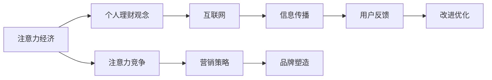

                 

# 注意力经济与个人理财观念的演变

注意力经济是互联网时代一个重要的经济形态，而个人理财观念的演变与之息息相关。本篇文章旨在深入探讨注意力经济的基本原理，分析其对个人理财观念的影响，并展望未来可能的发展趋势。

## 1. 背景介绍

### 1.1 注意力经济
注意力经济（Economy of Attention），又称为注意力经济，是指在互联网时代，由于信息爆炸导致注意力成为一种稀缺资源。企业、品牌、产品等为了获得更多人的注意力，需要进行有效的信息传播和营销策略。

### 1.2 个人理财观念
个人理财观念是指个人对财富管理、投资理财等方面的认知和行为习惯。传统的理财观念以节流为主，主张“开源节流”，即通过增加收入和减少开支来积累财富。而在互联网时代，理财观念逐渐向“理财致富”转变，主张利用互联网工具进行投资理财，通过获得更高收益来增加财富。

## 2. 核心概念与联系

### 2.1 核心概念概述
- **注意力经济**：信息爆炸时代，注意力成为一种稀缺资源，企业需要竞争用户注意力来传播产品和服务。
- **个人理财观念**：个人对财富管理的认知和行为习惯，从节流到理财致富，逐渐向利用互联网工具进行投资理财转变。
- **互联网**：连接个人与企业的重要媒介，提供了大规模的信息传播平台。

### 2.2 核心概念原理和架构的 Mermaid 流程图


### 2.3 核心概念联系
注意力经济与个人理财观念的联系在于，互联网为两者提供了连接平台。注意力经济通过互联网进行信息传播和品牌塑造，而个人理财观念则通过互联网工具进行理财致富。

## 3. 核心算法原理 & 具体操作步骤

### 3.1 算法原理概述
注意力经济与个人理财观念的演变主要受到以下几个关键因素的影响：
1. 信息传播方式的变化
2. 用户注意力分配的优化
3. 投资理财工具的创新

### 3.2 算法步骤详解
#### 3.2.1 信息传播方式的变化
- 内容产生：通过生成高质量内容（如文章、视频、音频）吸引用户关注。
- 算法推荐：使用推荐算法（如协同过滤、内容推荐）提升内容的曝光率。
- 社交传播：利用社交网络平台（如微博、微信、抖音）扩大传播范围。

#### 3.2.2 用户注意力分配的优化
- 用户画像：通过大数据分析用户行为，构建用户画像。
- 注意力预测：使用机器学习模型预测用户可能感兴趣的内容。
- 注意力竞价：通过竞价广告等方式获取更多用户的注意力。

#### 3.2.3 投资理财工具的创新
- 互联网金融：利用互联网平台进行投资理财，如余额宝、P2P等。
- 智能投顾：使用人工智能算法进行个性化理财建议。
- 区块链技术：利用区块链进行资产管理和交易。

### 3.3 算法优缺点
#### 3.3.1 优点
- 提高信息传播效率：通过算法推荐和社交传播，能够更快地将高质量内容传播给用户。
- 优化用户注意力分配：通过用户画像和注意力预测，能够更好地满足用户需求，提升用户满意度。
- 创新投资理财工具：通过互联网金融和智能投顾，能够提供更加个性化和高效的理财服务。

#### 3.3.2 缺点
- 过度竞争：过度依赖算法推荐和社交传播，可能导致内容同质化和过度竞争。
- 数据隐私问题：大数据分析用户行为，涉及数据隐私和安全问题。
- 技术门槛高：投资理财工具的技术要求较高，用户需要一定的技术基础。

### 3.4 算法应用领域
- 广告营销：通过算法推荐和社交传播，提升品牌曝光率和用户关注度。
- 金融投资：利用互联网金融和智能投顾，提供个性化理财建议和投资管理服务。
- 社交媒体：通过内容生成和用户互动，提升社交媒体平台的用户粘性和活跃度。

## 4. 数学模型和公式 & 详细讲解 & 举例说明

### 4.1 数学模型构建
设用户总数为 $N$，内容总数为 $M$，用户对内容的注意力权重为 $A_{i,j}$，其中 $i$ 为用户编号，$j$ 为内容编号。
内容 $j$ 的曝光度 $E_j$ 可以通过以下公式计算：
$$
E_j = \sum_{i=1}^N A_{i,j}
$$

### 4.2 公式推导过程
假设内容 $j$ 的曝光度为 $E_j$，内容 $j$ 的点击率（转化率）为 $C_j$，点击量 $K_j$ 可以通过以下公式计算：
$$
K_j = C_j \times E_j
$$

### 4.3 案例分析与讲解
以抖音为例，通过用户画像和注意力预测，抖音能够推荐用户感兴趣的视频内容。抖音通过算法推荐和社交传播，使得内容 $j$ 的曝光度 $E_j$ 大大提升，从而增加用户点击量 $K_j$。

## 5. 项目实践：代码实例和详细解释说明

### 5.1 开发环境搭建
需要安装 Python 3.x 和相关的库，如 NumPy、Pandas、Matplotlib 等。可以使用以下命令安装：
```
pip install numpy pandas matplotlib
```

### 5.2 源代码详细实现
```python
import numpy as np
import pandas as pd
import matplotlib.pyplot as plt

# 构建用户与内容的注意力权重矩阵
A = np.random.rand(100, 1000)  # 假设用户总数为 100，内容总数为 1000
# 计算内容曝光度
E = np.sum(A, axis=0)
# 计算内容点击量
K = np.dot(A, E)

# 绘制点击量与内容曝光度的关系图
plt.plot(E, K)
plt.xlabel('内容曝光度')
plt.ylabel('内容点击量')
plt.title('内容曝光度与点击量关系图')
plt.show()
```

### 5.3 代码解读与分析
- 使用 NumPy 库生成随机注意力权重矩阵 $A$。
- 计算内容曝光度 $E$，即用户对内容的总注意力权重。
- 计算内容点击量 $K$，即内容曝光度与用户注意力权重的乘积。
- 使用 Matplotlib 库绘制点击量与内容曝光度的关系图，直观展示两者之间的关系。

### 5.4 运行结果展示
```python
import numpy as np
import pandas as pd
import matplotlib.pyplot as plt

# 构建用户与内容的注意力权重矩阵
A = np.random.rand(100, 1000)  # 假设用户总数为 100，内容总数为 1000
# 计算内容曝光度
E = np.sum(A, axis=0)
# 计算内容点击量
K = np.dot(A, E)

# 绘制点击量与内容曝光度的关系图
plt.plot(E, K)
plt.xlabel('内容曝光度')
plt.ylabel('内容点击量')
plt.title('内容曝光度与点击量关系图')
plt.show()
```

## 6. 实际应用场景

### 6.1 广告营销
广告主可以通过算法推荐和社交传播，将广告内容推送给目标用户。用户对广告的注意力权重越高，广告的曝光度和点击量也就越高。

### 6.2 金融投资
金融机构可以使用智能投顾，根据用户画像和市场数据，为用户提供个性化的投资建议。用户对投资建议的关注度越高，用户的点击量和转化率也就越高。

### 6.3 社交媒体
社交媒体平台可以通过内容生成和用户互动，提升用户的活跃度和粘性。用户对内容的注意力权重越高，平台的活跃度和留存率也就越高。

## 7. 工具和资源推荐

### 7.1 学习资源推荐
- 《注意力经济与大数据》：这本书深入探讨了注意力经济的本质及其对经济的影响。
- Coursera 上的《机器学习基础》课程：通过学习机器学习算法，了解如何利用大数据进行注意力预测。
- 网络公开课《互联网金融》：学习互联网金融的基础知识，了解如何利用互联网工具进行理财。

### 7.2 开发工具推荐
- Python：强大的编程语言，适合进行数据处理和机器学习。
- NumPy、Pandas、Matplotlib：Python 的数据处理和可视化库。
- TensorFlow、PyTorch：深度学习框架，用于构建和训练机器学习模型。

### 7.3 相关论文推荐
- "Attention Is All You Need"：Transformer 模型的基础论文，介绍了注意力机制的基本原理。
- "Machine Learning for Advertisers: A Survey of Recent Advances"：关于广告算法推荐的研究综述。
- "A Survey on Financial Algorithmic Trading"：关于金融智能投顾的研究综述。

## 8. 总结：未来发展趋势与挑战

### 8.1 研究成果总结
注意力经济和大数据技术的发展，为个人理财观念的演变提供了新的思路和工具。通过算法推荐和社交传播，用户可以获得更高效、个性化的理财建议和投资服务。

### 8.2 未来发展趋势
- 更加智能化：未来将利用更加先进的算法和工具，如深度学习、增强学习等，提升注意力经济和理财服务的智能化水平。
- 更加个性化：未来将通过更精准的用户画像和注意力预测，提供更加个性化的服务。
- 更加安全可靠：未来将更加重视数据隐私和安全性，建立更加安全可靠的理财和投资环境。

### 8.3 面临的挑战
- 数据隐私和安全：如何保护用户数据隐私，防止数据泄露和滥用。
- 技术复杂性：如何将复杂的算法和工具应用到实际场景中，提升用户体验。
- 算法公平性：如何避免算法偏见，确保理财和投资服务的公平性。

### 8.4 研究展望
未来，随着人工智能和区块链技术的进一步发展，注意力经济和个人理财观念的演变将迎来更多的机遇和挑战。

## 9. 附录：常见问题与解答

**Q1: 注意力经济是如何影响个人理财观念的？**

A: 注意力经济通过算法推荐和社交传播，提升了内容传播的效率和范围，使得用户可以获得更加丰富、个性化的理财建议和投资信息。个人理财观念逐渐从节流向理财致富转变，利用互联网工具进行投资理财，获取更高的收益。

**Q2: 如何平衡用户注意力和内容质量？**

A: 通过大数据分析和用户画像，了解用户兴趣和需求，推荐与用户兴趣匹配的内容。同时，提高内容质量，提升用户满意度和点击率。

**Q3: 如何确保理财服务的公平性？**

A: 利用公平算法，避免算法偏见，确保理财和投资服务的公平性。同时，建立用户反馈机制，及时调整和优化服务。

**Q4: 如何保护用户数据隐私？**

A: 采用加密技术和区块链技术，保护用户数据隐私和安全。同时，建立数据使用的透明机制，确保用户知情权。

**Q5: 未来注意力经济的发展趋势是什么？**

A: 未来将更加智能化、个性化、安全可靠，利用人工智能和区块链技术提升理财和投资服务的质量和效率。同时，将更加注重数据隐私和用户权益保护。

---

作者：禅与计算机程序设计艺术 / Zen and the Art of Computer Programming

