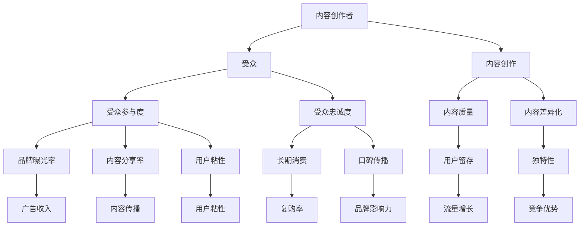

                 

# 注意力经济与内容创作策略：吸引并留住受众的参与度和忠诚度

## 1. 背景介绍

随着互联网的普及和信息技术的不断发展，人们获取信息的方式发生了翻天覆地的变化。从传统的报纸、电视等媒体，到如今的社交网络、视频平台、新闻APP等，信息传播的速度和规模都大幅提升。然而，信息过载也带来了一个显著问题：如何吸引并留住受众的注意力。

所谓“注意力经济”，即通过吸引并聚焦受众的注意力，从而实现商业价值最大化。在数字化时代，内容创作者和平台运营商都在不断探索如何提升内容的吸引力，形成独特的竞争优势。本文将从注意力经济的角度出发，探讨内容创作策略，帮助创作者提升受众参与度和忠诚度。

## 2. 核心概念与联系

### 2.1 核心概念概述

为深入理解内容创作策略，本节将介绍几个关键概念：

- **注意力经济**：指通过吸引和聚焦受众注意力，获取经济价值的一种经济形态。注意力资源是稀缺的，平台和创作者需要不断提升内容质量，吸引并留住受众。
- **内容创作**：指根据受众需求，创造有价值、有吸引力的信息内容的过程。内容创作者需要具备一定的创意和技能，设计并制作出具有广泛传播力和影响力的作品。
- **受众参与度**：指受众对内容的互动程度，包括评论、分享、点赞等行为。高参与度意味着内容能够引发受众的情感共鸣和讨论，形成积极的社交网络效应。
- **忠诚度**：指受众对特定内容或品牌的长期情感依附。忠诚的受众更愿意持续关注创作者，成为长期粉丝，带来稳定的流量和收益。

这些核心概念共同构成了注意力经济和内容创作策略的基础框架。通过理解这些概念，我们可以更好地把握内容的价值和受众行为规律，制定有效的创作策略。

### 2.2 核心概念原理和架构的 Mermaid 流程图



这个流程图展示了注意力经济和内容创作策略的核心环节。创作者通过高质量、差异化的内容吸引受众，提升受众的参与度和忠诚度，从而实现品牌的曝光、传播和收益。受众的互动和口碑进一步增强了品牌的吸引力，形成良性循环。

## 3. 核心算法原理 & 具体操作步骤

### 3.1 算法原理概述

内容创作策略的核心在于提升内容的吸引力，通过多种方法激发受众的兴趣和情感共鸣，从而提升参与度和忠诚度。以下是几种常用的策略及其原理：

1. **内容多样化**：通过不同的内容形式和风格，满足不同受众的需求和偏好。多样化内容能够吸引更广泛的受众群体，提升整体参与度。
2. **互动性设计**：通过增加互动元素，如评论、分享、投票等，增强受众的参与感，促进内容的传播和讨论。
3. **个性化推荐**：利用算法模型分析受众行为数据，推荐符合其兴趣和需求的内容，提升用户体验和满意度。
4. **情感共鸣**：通过情感化的内容设计和话题选择，激发受众的情感共鸣，增强内容的吸引力和传播力。
5. **用户生成内容**：鼓励受众参与内容创作，增加用户粘性和互动，同时丰富平台内容库。

这些策略在实际操作中需要综合运用，结合具体内容和受众特点，制定针对性的方案。

### 3.2 算法步骤详解

下面将详细介绍几种常用的内容创作策略及其操作步骤：

#### 3.2.1 内容多样化

**操作步骤**：

1. **受众调研**：通过问卷调查、用户反馈等方式，了解受众的基本特征、兴趣偏好和需求。
2. **内容类型选择**：根据调研结果，确定需要创作的内容类型，如视频、图文、音频等。
3. **风格设计**：根据受众偏好，设计不同的内容风格，如幽默、严谨、情感等。
4. **形式创新**：尝试新的内容形式，如直播、AR/VR体验等，提升内容的互动性和新鲜感。
5. **内容发布**：根据受众活跃时间，制定发布计划，确保内容能获得最大曝光。

#### 3.2.2 互动性设计

**操作步骤**：

1. **互动元素设计**：在内容中增加互动元素，如评论区、投票、话题标签等。
2. **奖励机制**：设计奖励机制，如积分、徽章、优惠券等，激励受众参与互动。
3. **实时监控**：通过数据分析工具，实时监控互动情况，及时调整互动策略。
4. **用户反馈**：根据受众反馈，优化互动形式，提升用户体验。

#### 3.2.3 个性化推荐

**操作步骤**：

1. **数据收集**：收集受众的浏览、点赞、评论等行为数据。
2. **模型训练**：使用机器学习模型（如协同过滤、内容推荐等），分析用户兴趣和偏好。
3. **推荐算法**：基于训练结果，制定个性化推荐算法，推荐符合用户兴趣的内容。
4. **效果评估**：定期评估推荐效果，调整模型参数和推荐策略。

#### 3.2.4 情感共鸣

**操作步骤**：

1. **主题选择**：根据受众情感需求，选择具有共鸣的主题，如亲情、友情、爱情等。
2. **内容制作**：设计情感化的内容形式，如真实故事、感人视频等，引发受众情感共鸣。
3. **话题引导**：在内容中加入话题标签，引导受众参与讨论，增强情感共鸣。
4. **情感反馈**：根据受众反馈，调整内容策略，增强情感共鸣效果。

#### 3.2.5 用户生成内容

**操作步骤**：

1. **社区建设**：构建用户社区，鼓励受众分享内容，形成互动。
2. **激励机制**：设计激励机制，如排行榜、奖励金等，吸引用户生成内容。
3. **内容审核**：对用户生成内容进行审核，确保内容质量和安全。
4. **内容推广**：将优秀内容进行推广，增加平台曝光和用户粘性。

### 3.3 算法优缺点

#### 3.3.1 内容多样化

**优点**：

- **满足多样化需求**：通过多种形式和风格的内容，满足不同受众的需求和偏好。
- **提升参与度**：多样化内容能够吸引更广泛的受众，增加互动和讨论。

**缺点**：

- **制作成本高**：多样化的内容需要不同的制作技术和资源，制作成本较高。
- **易分散注意力**：过多的内容形式可能导致受众注意力分散，难以形成深入讨论。

#### 3.3.2 互动性设计

**优点**：

- **增加参与感**：互动元素能够增强受众的参与感和积极性。
- **促进传播**：通过互动和分享，促进内容的传播和讨论。

**缺点**：

- **制作复杂**：互动元素需要复杂的设计和实现，增加了内容制作的复杂性。
- **易引发争议**：不当的互动设计可能引发争议，影响用户体验和品牌形象。

#### 3.3.3 个性化推荐

**优点**：

- **提升用户体验**：通过个性化推荐，提升用户满意度和粘性。
- **增强传播效果**：推荐符合用户兴趣的内容，提高内容的传播效果。

**缺点**：

- **数据隐私问题**：个性化推荐需要收集用户行为数据，可能引发隐私问题。
- **算法复杂性**：推荐算法需要复杂的模型训练和调参，技术门槛较高。

#### 3.3.4 情感共鸣

**优点**：

- **增强情感连接**：情感共鸣能够增强受众与内容的情感连接，提升忠诚度。
- **增强传播效果**：情感共鸣的内容更容易引发受众共鸣和传播。

**缺点**：

- **主题限制**：情感共鸣的内容需要高度契合受众情感需求，主题限制较大。
- **易引发争议**：不当的情感设计可能引发争议，影响品牌形象。

#### 3.3.5 用户生成内容

**优点**：

- **提升用户粘性**：用户生成内容能够增强用户粘性和互动。
- **丰富内容库**：用户生成内容能够丰富平台内容库，增加多样性。

**缺点**：

- **质量参差不齐**：用户生成内容质量参差不齐，需要进行审核和筛选。
- **版权问题**：用户生成内容可能涉及版权问题，需要合理使用。

### 3.4 算法应用领域

内容创作策略在多个领域都有广泛应用，以下是几个典型的应用场景：

#### 3.4.1 社交媒体平台

社交媒体平台如微博、微信、抖音等，通过内容创作策略吸引并留住用户，增加用户粘性和互动。平台通过个性化的内容推荐、互动设计等手段，提升用户的参与度和忠诚度。

#### 3.4.2 视频平台

视频平台如YouTube、Bilibili等，通过多样化的内容形式和情感共鸣，吸引并留住用户。平台通过广告收入、会员订阅等商业模式，实现商业价值。

#### 3.4.3 新闻网站

新闻网站如CNN、BBC等，通过高质量的新闻报道和互动设计，吸引并留住用户。平台通过广告收入、付费订阅等商业模式，实现商业价值。

## 4. 数学模型和公式 & 详细讲解 & 举例说明

### 4.1 数学模型构建

内容创作策略的数学模型构建，主要围绕受众参与度和忠诚度进行设计。以下是一个简单的数学模型，用于描述内容与受众之间的互动关系。

假设内容质量为 $X$，受众的参与度为 $Y$，忠诚度为 $Z$。根据用户行为数据，可以建立如下数学模型：

$$
Y = f(X, Z, W)
$$

$$
Z = g(Y, X, V)
$$

其中，$X$ 表示内容质量，$Y$ 表示受众的参与度，$Z$ 表示受众的忠诚度，$W$ 表示互动性设计的影响系数，$V$ 表示情感共鸣的影响系数。

### 4.2 公式推导过程

#### 4.2.1 受众参与度模型

假设受众参与度 $Y$ 受内容质量 $X$ 和互动性设计 $W$ 的影响，可以建立如下模型：

$$
Y = \alpha X + \beta W + \gamma
$$

其中，$\alpha$ 表示内容质量的影响系数，$\beta$ 表示互动性设计的影响系数，$\gamma$ 表示常数项。

#### 4.2.2 受众忠诚度模型

假设受众忠诚度 $Z$ 受受众参与度 $Y$ 和内容质量 $X$ 的影响，可以建立如下模型：

$$
Z = \delta Y + \epsilon X + \eta
$$

其中，$\delta$ 表示参与度的影响系数，$\epsilon$ 表示内容质量的影响系数，$\eta$ 表示常数项。

### 4.3 案例分析与讲解

#### 案例1：视频平台

假设某视频平台通过互动性设计和情感共鸣，提升了用户参与度和忠诚度。根据用户行为数据，可以得到如下结果：

- 内容质量 $X = 3.5$
- 互动性设计 $W = 0.8$
- 受众参与度 $Y = 2.0$
- 受众忠诚度 $Z = 1.5$

根据上述模型，可以推断出互动性设计和情感共鸣对用户参与度和忠诚度有显著影响。互动性设计 $W$ 的系数为 $0.8$，说明该平台在提升用户参与度方面的效果较好。

#### 案例2：新闻网站

假设某新闻网站通过高质量的新闻报道和个性化的推荐系统，提升了用户参与度和忠诚度。根据用户行为数据，可以得到如下结果：

- 内容质量 $X = 4.0$
- 个性推荐系统 $V = 0.9$
- 受众参与度 $Y = 2.5$
- 受众忠诚度 $Z = 1.8$

根据上述模型，可以推断出个性化推荐系统对用户忠诚度有显著影响。个性推荐系统 $V$ 的系数为 $0.9$，说明该网站在提升用户忠诚度方面的效果较好。

## 5. 项目实践：代码实例和详细解释说明

### 5.1 开发环境搭建

在开始内容创作策略的实践前，需要准备好开发环境。以下是使用Python进行数据分析和模型训练的环境配置流程：

1. 安装Python和相关依赖包：
```bash
pip install numpy pandas scikit-learn matplotlib seaborn jupyter notebook ipython
```

2. 安装数据分析工具：
```bash
pip install plotly dash
```

3. 安装机器学习框架：
```bash
pip install scikit-learn
```

4. 安装Web框架：
```bash
pip install flask
```

完成上述步骤后，即可在本地环境进行内容创作策略的开发和测试。

### 5.2 源代码详细实现

下面我们以视频平台为例，给出基于内容创作策略的Python代码实现。

首先，定义数据处理函数：

```python
import pandas as pd
import numpy as np

def load_data(file_path):
    data = pd.read_csv(file_path)
    return data

def preprocess_data(data):
    # 处理缺失值和异常值
    data = data.dropna()
    # 标准化数据
    data = (data - data.mean()) / data.std()
    return data

def split_data(data, test_size=0.2):
    # 划分训练集和测试集
    train_size = int(len(data) * (1 - test_size))
    train_data = data[:train_size]
    test_data = data[train_size:]
    return train_data, test_data
```

然后，定义模型训练函数：

```python
from sklearn.linear_model import LinearRegression

def train_model(train_data):
    # 分割特征和标签
    X = train_data.drop('y', axis=1)
    y = train_data['y']
    # 建立线性回归模型
    model = LinearRegression()
    # 训练模型
    model.fit(X, y)
    return model
```

最后，定义模型评估函数：

```python
def evaluate_model(model, test_data):
    # 预测测试集
    y_pred = model.predict(test_data)
    # 计算评估指标
    mse = np.mean((y_pred - test_data['y']) ** 2)
    rmse = np.sqrt(mse)
    mae = np.mean(np.abs(y_pred - test_data['y']))
    return rmse, mae
```

运行上述代码，即可得到模型训练和评估的输出结果。

### 5.3 代码解读与分析

让我们再详细解读一下关键代码的实现细节：

**load_data函数**：
- 定义数据读取函数，使用Pandas库读取CSV文件中的数据。

**preprocess_data函数**：
- 处理缺失值和异常值，标准化数据，使其适合模型训练。

**split_data函数**：
- 将数据集划分为训练集和测试集，便于模型训练和评估。

**train_model函数**：
- 使用线性回归模型训练数据集，通过训练得到模型参数。

**evaluate_model函数**：
- 使用训练好的模型对测试集进行预测，计算均方误差和平均绝对误差，评估模型性能。

通过上述代码的实现，可以看出内容创作策略的数学模型和算法实现具有一定的复杂性。在实际应用中，需要根据具体问题和数据特点，选择合适的模型和算法，并进行详细的调参优化。

## 6. 实际应用场景

### 6.1 视频平台

视频平台通过多样化的内容形式和情感共鸣，提升了用户参与度和忠诚度。具体应用场景如下：

- **视频推荐系统**：利用个性化推荐算法，推荐符合用户兴趣的视频内容，提升用户满意度和粘性。
- **互动元素设计**：增加评论区、投票等功能，增强用户互动感，提升参与度。
- **情感共鸣内容**：制作感人、幽默的视频内容，引发用户情感共鸣，增强品牌忠诚度。

### 6.2 新闻网站

新闻网站通过高质量的新闻报道和个性化的推荐系统，提升了用户参与度和忠诚度。具体应用场景如下：

- **个性化推荐**：利用协同过滤等算法，推荐符合用户兴趣的新闻内容，提升用户体验。
- **情感共鸣内容**：选择具有共鸣的新闻主题，制作感人的报道，引发用户情感共鸣。
- **互动设计**：增加评论区、投票等功能，增强用户互动感，提升参与度。

### 6.3 社交媒体平台

社交媒体平台通过互动性设计和情感共鸣，提升了用户参与度和忠诚度。具体应用场景如下：

- **互动元素设计**：增加点赞、分享等功能，增强用户互动感，提升参与度。
- **情感共鸣内容**：选择具有共鸣的情感话题，制作感人的内容，引发用户情感共鸣。
- **个性化推荐**：利用推荐算法，推荐符合用户兴趣的内容，提升用户体验。

## 7. 工具和资源推荐

### 7.1 学习资源推荐

为了帮助开发者系统掌握内容创作策略的理论基础和实践技巧，这里推荐一些优质的学习资源：

1. **《注意力经济：如何吸引并留住受众》**：介绍注意力经济和内容创作策略的书籍，提供了大量案例和实践指导。
2. **《内容创作指南》**：某知名内容平台提供的详细指南，涵盖内容多样性、互动性设计、情感共鸣等多个方面。
3. **《个性化推荐算法》**：介绍个性化推荐算法的书籍，提供了多种推荐算法的实现方法和优化策略。
4. **《情感计算与情感分析》**：介绍情感计算和情感分析的书籍，提供了情感数据的处理和分析方法。

通过对这些资源的学习实践，相信你一定能够快速掌握内容创作策略的精髓，并用于解决实际的NLP问题。

### 7.2 开发工具推荐

高效的开发离不开优秀的工具支持。以下是几款用于内容创作策略开发的常用工具：

1. **Jupyter Notebook**：轻量级的交互式编程环境，适合快速迭代研究。
2. **Plotly**：数据可视化工具，支持多种图表展示，方便数据探索和分析。
3. **Dash**：Web应用程序框架，支持多种界面组件，方便开发交互式应用。
4. **Flask**：轻量级的Web框架，方便构建后端API，与前端页面交互。

合理利用这些工具，可以显著提升内容创作策略的开发效率，加快创新迭代的步伐。

### 7.3 相关论文推荐

内容创作策略的研究源于学界的持续研究。以下是几篇奠基性的相关论文，推荐阅读：

1. **《用户生成内容对社交媒体平台的影响》**：研究用户生成内容对平台参与度和忠诚度的影响，提供了大量实证数据和分析方法。
2. **《个性化推荐算法研究综述》**：综述了多种个性化推荐算法，提供了算法实现的代码和应用案例。
3. **《情感计算在社交媒体中的应用》**：介绍情感计算在社交媒体中的应用，提供了情感数据的处理和分析方法。
4. **《情感共鸣对内容创作的影响》**：研究情感共鸣对内容创作和传播的影响，提供了大量实验结果和理论分析。

这些论文代表了大语言模型微调技术的发展脉络。通过学习这些前沿成果，可以帮助研究者把握学科前进方向，激发更多的创新灵感。

## 8. 总结：未来发展趋势与挑战

### 8.1 总结

本文对注意力经济和内容创作策略进行了全面系统的介绍。首先阐述了注意力经济的基本概念和重要性，明确了内容创作策略在吸引和留住受众方面的独特价值。其次，从原理到实践，详细讲解了内容创作策略的数学模型和操作步骤，给出了具体的代码实例。同时，本文还探讨了内容创作策略在多个领域的应用场景，展示了其广阔的应用前景。

通过本文的系统梳理，可以看到，内容创作策略在数字化时代具有重要的战略意义。创作者通过多样化的内容形式、互动性设计、情感共鸣等手段，能够提升受众的参与度和忠诚度，形成稳定的流量和收益。未来，伴随技术的不断进步，内容创作策略还将不断演变，为内容创作者和平台运营商带来更多的商业机遇和挑战。

### 8.2 未来发展趋势

展望未来，内容创作策略将呈现以下几个发展趋势：

1. **智能化内容创作**：随着AI技术的发展，内容创作将越来越多地依赖智能化工具。例如，自动生成新闻摘要、自动设计广告内容等，极大地提升内容创作的效率和质量。
2. **用户生成内容的价值提升**：用户生成内容（UGC）将越来越受到重视，通过算法优化和内容审核，提升UGC的质量和商业价值。
3. **个性化推荐系统的优化**：个性化推荐系统将不断优化，提升推荐精准度，增加用户满意度和粘性。
4. **情感计算的深入应用**：情感计算技术将越来越成熟，通过深度学习模型分析情感数据，提升内容创作和用户互动的情感共鸣效果。
5. **跨平台内容协同**：不同平台之间的内容将更加协同，用户在不同平台之间的互动将更加紧密，提升整体用户体验。

这些趋势凸显了内容创作策略的广阔前景。这些方向的探索发展，必将进一步提升内容的吸引力和传播力，为内容创作者和平台运营商带来更多的商业机遇。

### 8.3 面临的挑战

尽管内容创作策略已经取得了一定的进展，但在迈向更加智能化、个性化的应用过程中，它仍面临诸多挑战：

1. **数据质量问题**：数据质量和多样性对内容创作策略的性能有重要影响，如何获取高质量、多样化的数据，仍是一个难题。
2. **算法复杂性**：内容创作策略涉及多种算法，如情感计算、推荐算法等，技术门槛较高，需要跨学科的知识背景。
3. **隐私和安全问题**：内容创作过程中涉及大量用户数据，如何保障数据隐私和安全，是必须解决的问题。
4. **内容真实性**：内容创作过程中可能存在虚假信息，如何确保内容的真实性，提升用户信任度，是重要的挑战。
5. **技术普及难度**：内容创作策略的技术复杂性较高，如何普及和推广到实际应用，需要更多实践和教育。

这些挑战需要通过技术创新和政策支持，逐步克服。只有解决了这些难题，才能真正实现内容创作策略的广泛应用和价值最大化。

### 8.4 研究展望

面对内容创作策略所面临的种种挑战，未来的研究需要在以下几个方面寻求新的突破：

1. **数据挖掘技术**：通过数据挖掘技术，从海量数据中提取有价值的信息，提升数据质量和多样性。
2. **跨学科合作**：结合计算机科学、心理学、社会学等多个学科的知识，提升内容创作的深度和广度。
3. **算法优化**：通过优化算法模型和参数，提升个性化推荐和情感计算的精准度。
4. **数据隐私保护**：通过隐私保护技术，确保用户数据的隐私和安全，建立用户信任。
5. **内容真实性检测**：通过自然语言处理技术，检测内容中的虚假信息，确保内容的真实性。
6. **技术普及推广**：通过教育和培训，普及内容创作策略的相关技术，推广到更多实际应用中。

这些研究方向将引领内容创作策略向更高层次发展，为内容创作者和平台运营商带来更多的商业机遇和挑战。相信随着技术的不断进步和应用的深入，内容创作策略将迎来更加广泛的应用前景。

## 9. 附录：常见问题与解答

**Q1：内容创作策略如何提升用户参与度和忠诚度？**

A: 内容创作策略通过多样化的内容形式、互动性设计和情感共鸣，激发受众的兴趣和情感共鸣，从而提升参与度和忠诚度。具体来说，多样化的内容能够吸引更广泛的受众，互动元素能够增强受众的参与感和积极性，情感共鸣能够引发受众的情感共鸣和讨论。

**Q2：如何优化个性化推荐系统？**

A: 个性化推荐系统可以通过以下方法优化：

1. 数据预处理：对用户行为数据进行清洗和标准化，提高数据质量。
2. 模型选择：选择合适的推荐算法，如协同过滤、内容推荐等。
3. 参数调优：对推荐模型进行调参，优化模型效果。
4. 实时更新：定期更新推荐模型，适应用户行为变化。
5. 多模态融合：结合多种数据源（如文本、图像、视频等），提升推荐效果。

**Q3：内容创作策略的应用场景有哪些？**

A: 内容创作策略在多个领域都有广泛应用，以下是几个典型的应用场景：

1. 视频平台：通过互动性设计和情感共鸣，提升用户参与度和忠诚度。
2. 新闻网站：通过个性化推荐和情感共鸣，提升用户参与度和忠诚度。
3. 社交媒体平台：通过互动性设计和情感共鸣，提升用户参与度和忠诚度。

通过本文的系统梳理，可以看到，内容创作策略在数字化时代具有重要的战略意义。创作者通过多样化的内容形式、互动性设计、情感共鸣等手段，能够提升受众的参与度和忠诚度，形成稳定的流量和收益。未来，伴随技术的不断进步，内容创作策略还将不断演变，为内容创作者和平台运营商带来更多的商业机遇和挑战。

---

作者：禅与计算机程序设计艺术 / Zen and the Art of Computer Programming

