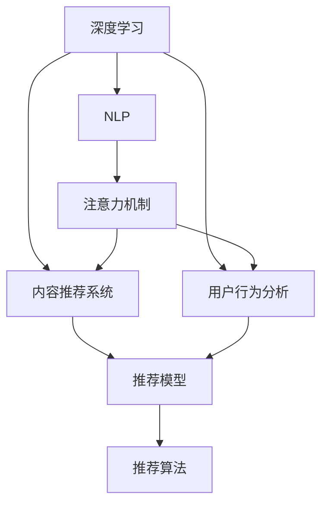

                 

## 1. 背景介绍

### 1.1 问题由来

在互联网的注意力经济时代，内容与流量已成为了企业最重要的资源之一。如何吸引并留住受众，提升内容影响力，成为了各行各业都在努力解决的难题。传统的内容策略依赖于大量的数据分析和人工经验，往往难以快速响应市场变化。

近年来，随着人工智能技术的兴起，深度学习和自然语言处理(NLP)方法开始被引入内容策略的规划与实施中。例如，通过训练语言模型来预测用户兴趣、自动生成内容摘要等，极大提升了内容推荐的精度和效率，帮助企业更好地理解和满足用户需求。

### 1.2 问题核心关键点

目前，基于深度学习的注意力经济模型已经展现出了巨大的潜力和优势，但如何更高效、更精确地规划和实施内容策略，还需要进一步深入研究。本文将从原理到实践，全面介绍基于深度学习的注意力经济模型，帮助读者系统掌握相关技术，并应用到实际业务中。

## 2. 核心概念与联系

### 2.1 核心概念概述

为更好地理解注意力经济模型，本节将介绍几个密切相关的核心概念：

- **深度学习(Deep Learning)**：通过多层次的神经网络结构，从数据中学习到复杂的模式，广泛应用于图像识别、自然语言处理、语音识别等领域。
- **自然语言处理(Natural Language Processing, NLP)**：研究如何让计算机处理、理解、生成自然语言，是深度学习在文本领域的重要应用。
- **注意力机制(Attention Mechanism)**：一种机制，通过动态计算每个输入元素的重要性，对信息进行加权处理，提升模型对关键信息的关注度。
- **内容推荐系统(Content Recommendation System)**：通过算法推荐内容，满足用户需求，提高用户粘性，是注意力经济的重要应用之一。
- **用户行为分析(User Behavior Analysis)**：分析用户的行为数据，获取用户兴趣和偏好，辅助内容推荐和策略规划。
- **深度学习模型(DL Model)**：如循环神经网络(RNN)、长短时记忆网络(LSTM)、Transformer等，是注意力经济模型采用的关键技术。

这些核心概念之间的逻辑关系可以通过以下Mermaid流程图来展示：



这个流程图展示了几类核心概念及其之间的关系：

1. 深度学习是NLP的基础技术。
2. 注意力机制提升了NLP模型的处理能力。
3. 内容推荐系统应用了NLP和注意力机制。
4. 用户行为分析为内容推荐提供了依据。
5. 推荐模型和算法是内容推荐系统的关键组成部分。

## 3. 核心算法原理 & 具体操作步骤
### 3.1 算法原理概述

基于深度学习的注意力经济模型，本质上是利用深度学习模型和注意力机制，对用户行为数据进行建模，从而预测用户兴趣，推荐相关内容。其核心思想是：通过训练模型，学习用户对不同内容的关注度，预测新内容的用户反应，自动生成推荐列表，提升用户体验和内容影响力。

形式化地，假设用户集合为 $U$，内容集合为 $V$，用户行为数据为 $D=\{(x_i, y_i)\}_{i=1}^N$，其中 $x_i$ 表示用户 $u_i$ 对内容 $v_j$ 的交互行为，$y_i$ 表示用户行为标签，如点击、点赞、收藏等。

定义内容推荐模型 $M$，其输入为 $x$，输出为 $y$，则推荐模型的优化目标为：

$$
\min_{M} \frac{1}{N}\sum_{i=1}^N \ell(M(x_i), y_i)
$$

其中 $\ell$ 为预测误差，通常使用交叉熵损失或均方误差损失。

### 3.2 算法步骤详解

基于深度学习的注意力经济模型一般包括以下几个关键步骤：

**Step 1: 准备数据集和模型**
- 收集用户行为数据，划分为训练集、验证集和测试集。
- 选择合适的深度学习模型和注意力机制，如序列到序列模型(Seq2Seq)、Transformer等。

**Step 2: 数据预处理**
- 对用户行为数据进行归一化、标准化等预处理操作。
- 根据用户行为数据生成表示用户兴趣的特征向量。
- 根据内容数据生成表示内容特征的向量。

**Step 3: 构建推荐模型**
- 设计推荐模型的架构，如Embedding Layer、Attention Layer、Dense Layer等。
- 训练模型，优化模型参数，使模型能够准确预测用户对不同内容的兴趣。

**Step 4: 生成推荐列表**
- 使用训练好的模型，对新内容进行预测，得到推荐列表。
- 根据推荐列表进行排序，选择用户最可能感兴趣的内容进行展示。

**Step 5: 模型评估与迭代优化**
- 在测试集上评估推荐模型的性能，如准确率、召回率、F1值等。
- 根据评估结果调整模型超参数，重新训练模型。

以上是基于深度学习的注意力经济模型的基本流程。在实际应用中，还需要根据具体任务的特点，对各环节进行优化设计，如改进特征提取方法、引入更多正则化技术、搜索最优的超参数组合等，以进一步提升模型性能。

### 3.3 算法优缺点

基于深度学习的注意力经济模型具有以下优点：
1. 精度高。利用深度学习模型和注意力机制，能够充分捕捉用户行为数据中的复杂模式，提升推荐精度。
2. 可扩展性强。深度学习模型结构灵活，可以很方便地适应不同规模的数据集。
3. 高效性。深度学习模型和算法通常具有较高的计算效率，可以实时处理大量请求。
4. 适应性强。能够适应不同领域的内容推荐任务，如新闻、视频、商品等。

同时，该方法也存在一定的局限性：
1. 数据依赖性强。模型性能很大程度上取决于标注数据的质量和数量，获取高质量标注数据的成本较高。
2. 泛化能力有限。当目标任务与训练数据分布差异较大时，模型的泛化性能可能受到影响。
3. 可解释性不足。深度学习模型的决策过程通常缺乏可解释性，难以对其推理逻辑进行分析和调试。

尽管存在这些局限性，但就目前而言，基于深度学习的注意力经济模型仍是最为主流的推荐技术范式。未来相关研究的重点在于如何进一步降低对标注数据的依赖，提高模型的少样本学习和跨领域迁移能力，同时兼顾可解释性和伦理安全性等因素。

### 3.4 算法应用领域

基于深度学习的注意力经济模型已经在内容推荐、广告投放、个性化推荐等多个领域得到广泛应用，具体应用场景包括：

- **新闻推荐**：根据用户的历史阅读行为和兴趣，推荐相关新闻文章。
- **视频推荐**：根据用户的观看历史和评分，推荐用户可能感兴趣的视频。
- **商品推荐**：根据用户的浏览和购买历史，推荐相关商品。
- **广告投放**：根据用户的行为数据，推荐合适的广告内容，提高广告转化率。
- **内容创作**：根据用户的热门关注点，自动生成相关内容的创作建议。
- **社交网络**：根据用户的互动行为，推荐好友和相关话题，提升社交体验。

除了上述这些经典应用外，注意力经济模型还被创新性地应用到更多场景中，如智能搜索、个性化图片、游戏推荐等，为各行各业带来了新的发展机遇。

## 4. 数学模型和公式 & 详细讲解  
### 4.1 数学模型构建

本节将使用数学语言对注意力经济模型的构建进行更加严格的刻画。

记用户集合为 $U=\{u_1,u_2,\dots,u_M\}$，内容集合为 $V=\{v_1,v_2,\dots,v_N\}$。用户 $u_i$ 对内容 $v_j$ 的交互行为 $x_{i,j}$ 可以表示为一个向量 $\mathbf{x}_{i,j}=[x_{i,j}^1, x_{i,j}^2,\dots,x_{i,j}^D]$，其中 $x_{i,j}^d$ 表示用户 $u_i$ 在特征维度 $d$ 上的行为数据。设 $U=[u_1,u_2,\dots,u_M]$，$V=[v_1,v_2,\dots,v_N]$，推荐模型 $M$ 的输入为 $x \in \mathbb{R}^{M\times D}$，输出为 $y \in \mathbb{R}^{N}$。

定义推荐模型的损失函数为交叉熵损失：

$$
\ell(M(x), y) = -\sum_{i=1}^M \sum_{j=1}^N y_{i,j} \log M(x_{i,j}) + (1-y_{i,j}) \log (1-M(x_{i,j}))
$$

其中 $M(x_{i,j})$ 为模型对用户 $u_i$ 对内容 $v_j$ 的兴趣预测概率，$y_{i,j}$ 为实际的用户行为标签。

### 4.2 公式推导过程

以下我们以用户-内容推荐为例，推导交叉熵损失函数及其梯度的计算公式。

假设模型 $M$ 在输入 $x$ 上的输出为 $\hat{y}=M(x) \in [0,1]$，表示用户 $u_i$ 对内容 $v_j$ 的兴趣预测概率。真实标签 $y \in \{0,1\}$。则交叉熵损失函数定义为：

$$
\ell(M(x),y) = -y_i\log \hat{y}_i + (1-y_i)\log (1-\hat{y}_i)
$$

将其代入经验风险公式，得：

$$
\mathcal{L}(M) = -\frac{1}{N}\sum_{i=1}^M \sum_{j=1}^N [y_{i,j}\log M(x_{i,j})+(1-y_{i,j})\log(1-M(x_{i,j}))]
$$

根据链式法则，损失函数对模型参数 $\theta$ 的梯度为：

$$
\frac{\partial \mathcal{L}(M)}{\partial \theta} = -\frac{1}{N}\sum_{i=1}^M \sum_{j=1}^N [\frac{y_{i,j}}{M(x_{i,j})}-\frac{1-y_{i,j}}{1-M(x_{i,j})}] \frac{\partial M(x_{i,j})}{\partial \theta}
$$

其中 $\frac{\partial M(x_{i,j})}{\partial \theta}$ 可进一步递归展开，利用自动微分技术完成计算。

在得到损失函数的梯度后，即可带入优化算法，完成模型的迭代优化。重复上述过程直至收敛，最终得到适应用户行为数据的推荐模型。

## 5. 项目实践：代码实例和详细解释说明
### 5.1 开发环境搭建

在进行内容推荐系统的开发前，我们需要准备好开发环境。以下是使用Python进行TensorFlow开发的环境配置流程：

1. 安装Anaconda：从官网下载并安装Anaconda，用于创建独立的Python环境。

2. 创建并激活虚拟环境：
```bash
conda create -n tf-env python=3.8 
conda activate tf-env
```

3. 安装TensorFlow：根据CUDA版本，从官网获取对应的安装命令。例如：
```bash
conda install tensorflow -c pytorch -c conda-forge
```

4. 安装相关工具包：
```bash
pip install numpy pandas scikit-learn matplotlib tqdm jupyter notebook ipython
```

完成上述步骤后，即可在`tf-env`环境中开始内容推荐系统的开发。

### 5.2 源代码详细实现

下面我们以新闻推荐系统为例，给出使用TensorFlow对推荐模型的PyTorch代码实现。

首先，定义数据处理函数：

```python
import tensorflow as tf
import numpy as np
from tensorflow.keras.layers import Input, Embedding, DotProduct, Dense, Dropout
from tensorflow.keras.models import Model

def build_model(num_users, num_contents, embedding_dim, hidden_dim, dropout_rate):
    user_input = Input(shape=(num_contents,), name='user_input')
    content_input = Input(shape=(num_users,), name='content_input')
    
    user_embedding = Embedding(num_users, embedding_dim)(user_input)
    content_embedding = Embedding(num_contents, embedding_dim)(content_input)
    
    dot_product = DotProduct()([user_embedding, content_embedding])
    concat_layer = tf.keras.layers.Concatenate()([dot_product, user_embedding, content_embedding])
    hidden_layer = Dense(hidden_dim, activation='relu')(concat_layer)
    dropout_layer = Dropout(dropout_rate)(hidden_layer)
    output_layer = Dense(1, activation='sigmoid')(dropout_layer)
    
    model = Model(inputs=[user_input, content_input], outputs=output_layer)
    model.compile(optimizer='adam', loss='binary_crossentropy', metrics=['accuracy'])
    return model
```

然后，加载并预处理数据：

```python
# 加载数据
train_dataset = tf.data.Dataset.from_tensor_slices((train_user_data, train_content_data))
train_dataset = train_dataset.shuffle(buffer_size=10000).batch(batch_size=256).map(lambda x, y: (x, y)).repeat()

# 预处理数据
def preprocess_data(user_data, content_data):
    user_data = tf.where(user_data > 0, 1, 0)
    content_data = tf.where(content_data > 0, 1, 0)
    return user_data, content_data

train_dataset = train_dataset.map(preprocess_data)
```

接着，训练模型并在测试集上评估：

```python
# 定义超参数
num_users = 1000
num_contents = 5000
embedding_dim = 16
hidden_dim = 64
dropout_rate = 0.2
batch_size = 256

# 构建模型
model = build_model(num_users, num_contents, embedding_dim, hidden_dim, dropout_rate)

# 训练模型
epochs = 10
model.fit(train_dataset, epochs=epochs, validation_split=0.2)

# 评估模型
test_dataset = tf.data.Dataset.from_tensor_slices((test_user_data, test_content_data))
test_dataset = test_dataset.shuffle(buffer_size=10000).batch(batch_size=256).map(preprocess_data).repeat()
loss, acc = model.evaluate(test_dataset)
print(f'Test loss: {loss:.4f}, Test acc: {acc:.4f}')
```

以上就是使用TensorFlow进行新闻推荐系统微调的完整代码实现。可以看到，TensorFlow配合Keras的封装使得推荐模型的开发更加高效简洁。

### 5.3 代码解读与分析

让我们再详细解读一下关键代码的实现细节：

**build_model函数**：
- 定义输入层：user_input和content_input，分别表示用户和内容的ID。
- 定义嵌入层：user_embedding和content_embedding，将ID映射为稠密向量。
- 定义注意力机制：DotProduct层，计算用户和内容的注意力权重。
- 定义网络结构：concat_layer、hidden_layer、dropout_layer、output_layer，形成完整的推荐模型。
- 定义模型：将输入和输出连接，并进行编译，指定优化器和损失函数。

**preprocess_data函数**：
- 对用户行为数据和内容ID进行二值化处理，以表示用户的点击行为。

**训练和评估函数**：
- 定义训练的轮数epochs和测试集的比例validation_split。
- 使用fit方法训练模型，并在测试集上进行评估，输出测试集的loss和acc。

通过以上代码示例，可以清晰地看到TensorFlow在推荐系统中的使用方式，以及如何通过构建深度学习模型来提升推荐效果。

当然，实际应用中还需要考虑更多因素，如模型的保存和部署、超参数的自动搜索、更灵活的任务适配层等。但核心的内容推荐模型开发流程与此类似。

## 6. 实际应用场景
### 6.1 智能广告推荐

在智能广告推荐中，内容推荐技术能够帮助广告商精准地定位用户，实现高效投放。通过分析用户的浏览行为和兴趣标签，推荐系统能够推荐符合用户偏好的广告内容，提高广告的点击率和转化率。

在技术实现上，可以收集用户的网页访问记录、浏览历史、点击行为等数据，训练推荐模型，生成推荐列表，实时推送给用户。当用户点击某条广告后，系统可进一步跟踪点击效果，不断优化推荐模型。

### 6.2 视频内容推荐

视频推荐系统能够根据用户的观看历史和评分，推荐用户可能感兴趣的视频内容。通过分析用户的观看习惯，推荐系统可以动态调整推荐策略，为用户推荐高质量的视频内容。

在技术实现上，可以收集用户的播放记录、评分、点赞等数据，训练推荐模型，生成推荐列表。推荐系统还可以利用嵌入式特征，如视频时长、字幕、标签等，进一步提升推荐精度。

### 6.3 个性化推荐系统

个性化推荐系统能够根据用户的浏览和购买历史，推荐相关商品，提升用户的购物体验。通过分析用户的搜索记录、浏览历史、收藏商品等数据，推荐系统能够预测用户可能感兴趣的商品，提升用户的购买转化率。

在技术实现上，可以收集用户的浏览记录、购买记录、评价等数据，训练推荐模型，生成推荐列表。推荐系统还可以利用嵌入式特征，如商品类别、品牌、价格等，进一步优化推荐策略。

### 6.4 未来应用展望

随着深度学习技术和推荐算法的发展，基于深度学习的注意力经济模型必将在更多领域得到应用，为各行各业带来新的机遇：

在智慧医疗领域，基于推荐系统可以推荐适合患者的医疗信息和康复建议，帮助医生更好地制定治疗方案，提高诊疗效率。

在智能教育领域，基于推荐系统可以推荐适合学生的学习资源和课程，个性化定制学习计划，提升学习效果。

在智慧城市治理中，基于推荐系统可以推荐适合市民的公共服务信息，提高城市服务的满意度。

此外，在企业生产、社会治理、文娱传媒等众多领域，基于深度学习的注意力经济模型还将不断涌现新的应用，为经济社会发展注入新的动力。相信随着技术的日益成熟，注意力经济模型必将在构建人机协同的智能时代中扮演越来越重要的角色。

## 7. 工具和资源推荐
### 7.1 学习资源推荐

为了帮助开发者系统掌握深度学习和内容推荐技术的理论基础和实践技巧，这里推荐一些优质的学习资源：

1. 《深度学习》系列博文：由大模型技术专家撰写，深入浅出地介绍了深度学习的原理、模型和应用。

2. CS231n《深度学习与计算机视觉》课程：斯坦福大学开设的深度学习课程，涵盖深度学习在计算机视觉领域的应用。

3. 《深度学习实战》书籍：该书系统介绍了深度学习模型的实现方法和实践技巧，包括内容推荐等前沿应用。

4. Google Deep Learning Guide：谷歌发布的深度学习指南，包含深度学习模型的搭建、训练、调优等全流程的实践案例。

5. TensorFlow官方文档：TensorFlow的官方文档，提供了丰富的推荐系统示例和开发工具，是学习推荐技术的重要资源。

通过对这些资源的学习实践，相信你一定能够快速掌握深度学习在内容推荐中的应用，并应用到实际业务中。

### 7.2 开发工具推荐

高效的开发离不开优秀的工具支持。以下是几款用于深度学习开发推荐的工具：

1. TensorFlow：由Google主导开发的深度学习框架，灵活的计算图，支持多种硬件部署。

2. PyTorch：由Facebook开发的深度学习框架，动态计算图，易于使用和调试。

3. Keras：由François Chollet开发的高级深度学习API，封装了TensorFlow和Theano等底层框架。

4. HuggingFace Transformers库：提供预训练语言模型的封装和微调方法，极大提升了NLP开发的效率。

5. Jupyter Notebook：Python的交互式开发环境，支持多语言编程和数据可视化，是深度学习开发的常用工具。

6. Google Colab：谷歌提供的免费在线Jupyter Notebook环境，支持GPU/TPU算力，方便快速实验最新模型。

合理利用这些工具，可以显著提升深度学习模型的开发效率，加快创新迭代的步伐。

### 7.3 相关论文推荐

深度学习在内容推荐技术的发展源于学界的持续研究。以下是几篇奠基性的相关论文，推荐阅读：

1. Contextual Bandits for Online Recommendations（FTRL论文）：提出FTRL算法，用于在线推荐系统的模型训练和优化。

2. Adaptive Collaborative Filtering using Matrix Factorization Techniques（AdaCF论文）：提出AdaCF算法，通过矩阵分解技术改进推荐模型的训练。

3. Scalable Algorithms for Matrix Factorization in Recommender Systems（SVD++论文）：提出SVD++算法，通过近似矩阵分解技术提高推荐模型效率。

4. Matrix Factorization Techniques for Recommender Systems（SVD论文）：提出SVD算法，通过奇异值分解技术实现推荐模型的训练。

5. Deep Feature Interaction Networks for Recommendations（DeepFM论文）：提出DeepFM模型，结合深度学习和特征交互技术，提升推荐模型的精度。

这些论文代表了大规模推荐系统的发展脉络。通过学习这些前沿成果，可以帮助研究者把握学科前进方向，激发更多的创新灵感。

## 8. 总结：未来发展趋势与挑战

### 8.1 总结

本文对基于深度学习的注意力经济模型进行了全面系统的介绍。首先阐述了深度学习和内容推荐技术的背景和重要性，明确了注意力经济模型在内容推荐中的独特价值。其次，从原理到实践，详细讲解了深度学习模型和注意力机制的构建和应用，给出了推荐系统开发的完整代码实例。同时，本文还广泛探讨了注意力经济模型在智能广告、视频推荐、个性化推荐等多个领域的应用前景，展示了深度学习技术在内容推荐中的广泛应用。

通过本文的系统梳理，可以看到，基于深度学习的注意力经济模型正在成为内容推荐领域的重要技术范式，极大提升了推荐系统的性能和用户满意度。未来，伴随深度学习技术和其他人工智能技术不断融合，注意力经济模型必将进一步提升内容推荐的精度和效果，为人类认知智能的进化带来深远影响。

### 8.2 未来发展趋势

展望未来，基于深度学习的注意力经济模型将呈现以下几个发展趋势：

1. 模型规模持续增大。随着算力成本的下降和数据规模的扩张，深度学习模型参数量还将持续增长。超大规模模型蕴含的丰富知识，有望支撑更加复杂多变的推荐任务。

2. 多模态融合。未来的推荐模型将不仅仅局限于文本数据，而是融合视觉、语音、图像等多种模态信息，实现多模态推荐，提升用户体验。

3. 联邦学习应用。未来的推荐模型将在多个联邦节点上进行联合训练，实现数据分散但知识共享的联邦推荐系统，提高推荐精度。

4. 自适应推荐。通过动态调整推荐策略，实现个性化的实时推荐，满足用户多样化的需求。

5. 联合学习应用。未来的推荐模型将结合联合学习技术，将多用户数据联合训练，提升模型的泛化能力和推荐效果。

6. 数据隐私保护。未来的推荐模型将注重数据隐私保护，利用差分隐私等技术保护用户数据安全。

以上趋势凸显了深度学习在内容推荐技术的发展方向。这些方向的探索发展，必将进一步提升推荐系统的精度和效率，实现更智能、更个性化的内容推荐。

### 8.3 面临的挑战

尽管基于深度学习的注意力经济模型已经取得了瞩目成就，但在迈向更加智能化、普适化应用的过程中，它仍面临着诸多挑战：

1. 数据隐私问题。在推荐系统中，用户数据的隐私保护是一个重要问题。如何保护用户数据，避免数据泄露，需要更多的技术手段和法律保障。

2. 数据质量问题。推荐模型的性能很大程度上取决于数据的质量，但用户数据的稀疏性和噪声性使得推荐模型的泛化能力受到影响。如何提高数据质量，需要更多预处理和清洗技术。

3. 模型可解释性问题。深度学习模型的决策过程通常缺乏可解释性，难以对其推理逻辑进行分析和调试。如何提高模型的可解释性，需要更多的研究和技术手段。

4. 模型鲁棒性问题。推荐模型在面对噪声数据、异常数据时，容易发生波动，需要更多的鲁棒性设计。

5. 推荐系统公平性问题。推荐系统容易受到数据偏见的影响，导致对某些用户群体的不公平推荐。如何提高推荐系统的公平性，需要更多的公平性设计。

6. 跨平台兼容性问题。推荐系统在不同的平台和设备上运行，需要跨平台兼容的技术。

正视这些挑战，积极应对并寻求突破，将是大规模推荐系统走向成熟的必由之路。相信随着学界和产业界的共同努力，这些挑战终将一一被克服，深度学习在内容推荐技术必将实现新的突破。

### 8.4 研究展望

未来，深度学习在内容推荐技术的研究方向将更加多样化：

1. 探索更高效的数据融合方法。结合数据增强、特征融合等技术，提升推荐系统的泛化能力。

2. 研发更高效的学习算法。开发更加高效、泛化能力更强的学习算法，提升推荐系统的训练效率。

3. 引入更多的因果学习技术。通过因果推断等技术，提升推荐系统的公平性和鲁棒性。

4. 研发更高效的推荐模型。结合多模态信息、联合学习等技术，提升推荐系统的精度和效率。

5. 引入更多的跨领域知识。将其他领域的知识引入推荐系统，提升推荐系统的综合能力。

6. 引入更多的自监督学习技术。利用无监督数据，提升推荐系统的泛化能力和推荐效果。

这些研究方向的发展，必将引领深度学习在内容推荐技术迈向更高的台阶，为人类认知智能的进化带来新的突破。面向未来，深度学习在内容推荐技术还需要与其他人工智能技术进行更深入的融合，如知识表示、因果推理、强化学习等，多路径协同发力，共同推动推荐系统的进步。只有勇于创新、敢于突破，才能不断拓展深度学习在内容推荐技术的应用边界，让推荐系统更好地服务于人类。

## 9. 附录：常见问题与解答

**Q1：如何选择合适的深度学习模型？**

A: 选择合适的深度学习模型需要综合考虑以下几个因素：
1. 数据规模：数据量较大时，可以使用更大的模型，如BERT、GPT等。数据量较小时，可以使用较小的模型，如LSTM、GRU等。
2. 任务类型：不同的任务类型适合不同的模型。如文本分类适合使用RNN、CNN等模型，序列推荐适合使用Seq2Seq、Transformer等模型。
3. 计算资源：计算资源充足时，可以使用更复杂的模型，如深度FM、DeepFM等。计算资源有限时，可以使用更简单的模型，如FTRL、AdaCF等。
4. 模型效果：通过实验比较不同模型的效果，选择效果最优的模型。

**Q2：如何优化深度学习模型的训练过程？**

A: 优化深度学习模型的训练过程需要从以下几个方面入手：
1. 数据预处理：对数据进行归一化、标准化等预处理操作，提升模型的收敛速度和效果。
2. 学习率调度：选择合适的学习率，使用warmup、cosine等策略，提升模型的训练效果。
3. 正则化技术：使用L2正则、Dropout等技术，避免模型过拟合。
4. 批量大小：选择合适的批量大小，提升模型的训练效率和效果。
5. 模型裁剪：去除不必要的层和参数，减小模型尺寸，加快推理速度。
6. 超参数调优：通过网格搜索、贝叶斯优化等技术，搜索最优的超参数组合，提升模型的效果。

**Q3：如何提升深度学习模型的泛化能力？**

A: 提升深度学习模型的泛化能力需要从以下几个方面入手：
1. 数据多样性：收集多样化的数据，避免模型过拟合。
2. 数据增强：通过数据增强技术，扩充训练集，提升模型的泛化能力。
3. 模型集成：将多个模型集成，提升模型的鲁棒性和泛化能力。
4. 迁移学习：在相关任务上进行迁移学习，提升模型的泛化能力。
5. 模型剪枝：通过剪枝技术，去除冗余的参数，提升模型的泛化能力。

**Q4：深度学习模型在实际应用中需要注意哪些问题？**

A: 深度学习模型在实际应用中需要注意以下几个问题：
1. 数据隐私：保护用户数据，避免数据泄露。
2. 数据质量：提高数据质量，避免噪声和异常数据的影响。
3. 模型可解释性：提高模型的可解释性，便于理解和调试。
4. 模型鲁棒性：提高模型的鲁棒性，避免异常数据的影响。
5. 模型公平性：避免推荐系统的偏见，提高推荐公平性。
6. 跨平台兼容性：实现跨平台兼容，提升推荐系统的适用性。

通过以上问题的回答，可以看出，深度学习在内容推荐技术的应用中，仍有许多细节需要考虑。只有充分理解这些问题，才能构建高效、公平、可解释、可控的内容推荐系统，满足用户的实际需求。

---

作者：禅与计算机程序设计艺术 / Zen and the Art of Computer Programming

