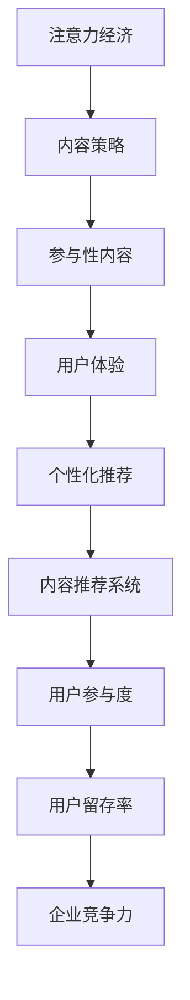

                 

# 注意力经济与内容策略：创建吸引并留住受众的参与性内容

> 关键词：注意力经济,内容策略,参与性内容,用户互动,用户体验,个性化推荐,内容推荐系统,用户参与度

## 1. 背景介绍

在数字化时代，信息洪流让人们面临前所未有的选择压力，如何吸引和留住用户的注意力成为了企业竞争的关键。注意力经济（Economy of Attention）理论认为，注意力是一种稀缺资源，如何高效分配和利用，成为决定企业能否成功的关键。本文将深入探讨注意力经济下，如何通过科学的内容策略，创建并提升内容的参与性，从而吸引并留住受众。

## 2. 核心概念与联系

### 2.1 核心概念概述

为更好地理解注意力经济下内容策略的核心要素，本节将介绍几个关键概念：

- 注意力经济（Economy of Attention）：指在信息爆炸的时代，用户注意力作为一种稀缺资源，需要被有效地分配和利用。
- 内容策略（Content Strategy）：指通过有目的、有计划地创作和发布内容，吸引、教育和引导用户，实现品牌、产品或服务的推广和价值传递。
- 参与性内容（Engaging Content）：指能够激发用户兴趣、激发用户参与的内容，具有高度互动性和反馈性。
- 用户体验（User Experience, UX）：指用户与产品或服务的交互体验，涉及界面设计、操作流程、情感共鸣等方面。
- 个性化推荐（Personalized Recommendation）：指根据用户的行为、偏好、历史数据等信息，动态生成并推荐最适合用户的个性化内容。
- 内容推荐系统（Content Recommendation System）：指能够自动化分析用户数据，精准推荐相关内容的系统，如Netflix、Amazon、抖音等。
- 用户参与度（User Engagement）：指用户与内容之间的互动程度，包括浏览、点赞、评论、分享等行为。

这些概念之间有着紧密的联系：注意力经济决定了内容策略的方向，参与性内容提升了用户体验，个性化推荐保证了内容推荐系统的精准度，而良好的用户体验和用户参与度，反过来又提升了用户留存率，从而增强了企业的竞争力。

### 2.2 核心概念原理和架构的 Mermaid 流程图



这个流程图展示了这个生态系统的核心联系：注意力经济驱动内容策略，内容策略产生参与性内容，参与性内容提升用户体验，个性化推荐保证了内容的精准度，内容推荐系统提升了用户参与度，最终用户参与度增加用户留存率，用户留存率增强企业竞争力。

## 3. 核心算法原理 & 具体操作步骤

### 3.1 算法原理概述

在注意力经济下，内容策略的核心目标是通过精准的内容推荐，提升用户的参与度和留存率。内容推荐系统依赖于用户行为数据的分析，以及对内容的深度理解。其中，基于协同过滤的推荐算法和基于深度学习的推荐算法是两个主要的研究方向。

协同过滤算法主要基于用户和物品之间的相似度，通过用户历史行为数据或物品特征，预测用户可能感兴趣的物品。常见的协同过滤算法包括基于用户的协同过滤和基于物品的协同过滤。

深度学习推荐算法则是通过构建神经网络模型，对用户行为数据和物品特征进行深度学习，挖掘更深层次的用户兴趣和行为模式。常见的深度学习模型包括神经协同过滤、深度学习推荐系统（如DeepFM、Wide&Deep等）。

### 3.2 算法步骤详解

#### 3.2.1 协同过滤算法步骤

1. **数据准备**：收集用户历史行为数据，如点击、购买、评分等。
2. **相似度计算**：计算用户之间的相似度或物品之间的相似度。
3. **推荐生成**：根据相似度计算结果，预测用户可能感兴趣的物品，生成推荐列表。
4. **排名与反馈**：根据预测结果和用户真实反馈，调整相似度计算模型，优化推荐效果。

#### 3.2.2 深度学习推荐算法步骤

1. **数据准备**：收集用户历史行为数据和物品特征。
2. **模型构建**：设计深度神经网络模型，包含用户行为嵌入层、物品特征嵌入层和预测层。
3. **训练与优化**：使用用户行为数据和物品特征，训练神经网络模型，优化损失函数。
4. **推荐生成**：将用户输入特征映射到推荐结果中，生成个性化推荐列表。
5. **效果评估**：通过AUC、RMSE等指标，评估推荐模型效果，不断优化模型。

### 3.3 算法优缺点

协同过滤算法优点在于模型简单，计算速度快，易于实现。缺点是难以处理稀疏数据和冷启动问题，推荐结果的泛化能力较差。

深度学习推荐算法优点在于能够深度挖掘用户行为和物品特征，推荐结果的精度高，适应性强。缺点是模型复杂，训练时间较长，计算资源需求大。

### 3.4 算法应用领域

基于注意力经济的内容策略，协同过滤和深度学习推荐算法被广泛应用于电子商务、在线视频、社交网络、新闻推荐等众多领域。以下是几个典型应用场景：

- **电子商务**：如淘宝、京东等电商平台，通过推荐用户可能感兴趣的商品，提升销售转化率。
- **在线视频**：如Netflix、YouTube等视频平台，根据用户历史观看记录和评分，推荐新影片或剧集。
- **社交网络**：如Facebook、微信等社交平台，推荐用户可能感兴趣的朋友、文章和活动。
- **新闻推荐**：如今日头条、澎湃新闻等新闻APP，根据用户历史阅读记录和兴趣标签，推荐相关新闻文章。
- **音乐推荐**：如Spotify、网易云音乐等音乐平台，推荐用户可能喜欢的音乐和歌单。

## 4. 数学模型和公式 & 详细讲解 & 举例说明

### 4.1 数学模型构建

基于协同过滤的推荐系统数学模型可以表示为：

$$
\hat{y}_{ui} = \hat{w}^T \cdot \vec{u} \odot \vec{i} + b
$$

其中，$\hat{y}_{ui}$ 表示用户 $u$ 对物品 $i$ 的评分预测值，$\vec{u}$ 和 $\vec{i}$ 分别表示用户 $u$ 和物品 $i$ 的特征向量，$\hat{w}$ 为模型参数，$b$ 为截距。

基于深度学习的推荐系统通常使用神经网络模型，如Wide&Deep架构，可以表示为：

$$
y_{ui} = MFTW(\vec{u}, \vec{i}) + \hat{w}^T \cdot \vec{u} + b
$$

其中，$MFTW(\vec{u}, \vec{i})$ 为多层感知器部分，$\vec{u}$ 和 $\vec{i}$ 分别表示用户和物品的特征向量，$\hat{w}$ 为全连接层的参数。

### 4.2 公式推导过程

基于协同过滤的推荐算法主要通过计算用户和物品之间的相似度来实现推荐。常见的相似度计算方法包括余弦相似度、皮尔逊相关系数等。

对于基于协同过滤的推荐算法，其推荐结果可以表示为：

$$
R_{ui} = \text{sim}(u_j, i_k) \cdot y_{uj} \cdot y_{ik}
$$

其中，$R_{ui}$ 表示用户 $u$ 对物品 $i$ 的评分预测值，$u_j$ 和 $i_k$ 分别表示与用户 $u$ 和物品 $i$ 相似度较高的其他用户和物品，$\text{sim}(u_j, i_k)$ 表示用户 $u_j$ 和物品 $i_k$ 之间的相似度。

基于深度学习的推荐算法则通过神经网络模型，对用户和物品的特征进行编码和映射，输出预测评分。

### 4.3 案例分析与讲解

以YouTube为例，其推荐系统采用了协同过滤和深度学习混合的策略。用户特征包括历史观看记录、观看时长、点赞数等，物品特征包括视频标题、标签、时长等。通过协同过滤算法计算用户和视频之间的相似度，结合深度学习模型，生成推荐列表。

## 5. 项目实践：代码实例和详细解释说明

### 5.1 开发环境搭建

进行内容推荐系统的开发，首先需要搭建开发环境。以下是使用Python进行PyTorch开发的常见环境配置流程：

1. 安装Anaconda：从官网下载并安装Anaconda，用于创建独立的Python环境。
2. 创建并激活虚拟环境：
```bash
conda create -n pytorch-env python=3.8 
conda activate pytorch-env
```
3. 安装PyTorch：根据CUDA版本，从官网获取对应的安装命令。例如：
```bash
conda install pytorch torchvision torchaudio cudatoolkit=11.1 -c pytorch -c conda-forge
```
4. 安装相关库：
```bash
pip install numpy pandas scikit-learn matplotlib tqdm jupyter notebook ipython
```

完成上述步骤后，即可在`pytorch-env`环境中进行内容推荐系统的开发。

### 5.2 源代码详细实现

以下是使用PyTorch进行基于协同过滤推荐系统的代码实现。

首先，定义推荐系统类：

```python
import torch
import torch.nn as nn
import torch.nn.functional as F
from torch.utils.data import Dataset, DataLoader

class RecommendationModel(nn.Module):
    def __init__(self, user_features_dim, item_features_dim, hidden_dim, output_dim):
        super(RecommendationModel, self).__init__()
        self.fc1 = nn.Linear(user_features_dim + item_features_dim, hidden_dim)
        self.fc2 = nn.Linear(hidden_dim, hidden_dim)
        self.fc3 = nn.Linear(hidden_dim, output_dim)
        self.sigmoid = nn.Sigmoid()
    
    def forward(self, user_features, item_features):
        features = torch.cat([user_features, item_features], dim=1)
        hidden = F.relu(self.fc1(features))
        hidden = F.relu(self.fc2(hidden))
        rating = self.fc3(hidden)
        rating = self.sigmoid(rating)
        return rating
```

然后，定义数据集类：

```python
class RecommendationDataset(Dataset):
    def __init__(self, users, items, ratings):
        self.users = users
        self.items = items
        self.ratings = ratings
        self.user_len = len(self.users)
        self.item_len = len(self.items)
    
    def __len__(self):
        return len(self.ratings)
    
    def __getitem__(self, idx):
        user_id = self.users[idx]
        item_id = self.items[idx]
        rating = self.ratings[idx]
        return user_id, item_id, rating
```

接着，定义模型和优化器：

```python
model = RecommendationModel(user_features_dim=16, item_features_dim=16, hidden_dim=32, output_dim=1)
optimizer = torch.optim.Adam(model.parameters(), lr=0.01)
```

最后，进行模型训练和测试：

```python
epochs = 10
batch_size = 64

for epoch in range(epochs):
    total_loss = 0
    for user_id, item_id, rating in dataloader:
        user_features = user_emb[user_id]
        item_features = item_emb[item_id]
        label = torch.tensor([rating], dtype=torch.float)
        model.train()
        optimizer.zero_grad()
        output = model(user_features, item_features)
        loss = F.mse_loss(output, label)
        loss.backward()
        optimizer.step()
        total_loss += loss.item()
    
    print(f"Epoch {epoch+1}, loss: {total_loss/len(dataloader):.4f}")
    
# 测试模型
model.eval()
with torch.no_grad():
    correct = 0
    total = 0
    for user_id, item_id, rating in dataloader:
        user_features = user_emb[user_id]
        item_features = item_emb[item_id]
        label = torch.tensor([rating], dtype=torch.float)
        output = model(user_features, item_features)
        if output > 0.5:
            correct += 1
        total += 1
    print(f"Accuracy: {correct/total:.4f}")
```

这就是使用PyTorch进行基于协同过滤推荐系统的完整代码实现。可以看到，借助PyTorch的强大封装能力，我们可以将模型训练和推理的实现过程简化为短短几行代码。

### 5.3 代码解读与分析

**RecommendationModel类**：
- `__init__`方法：初始化模型参数，包括两个全连接层和输出层的线性层。
- `forward`方法：定义前向传播过程，将用户和物品的特征编码成隐藏层表示，输出预测评分。

**RecommendationDataset类**：
- `__init__`方法：初始化数据集，包括用户ID、物品ID和评分。
- `__len__`方法：返回数据集长度。
- `__getitem__`方法：获取单个样本，返回用户ID、物品ID和评分。

**模型和优化器**：
- 使用Adam优化器进行参数更新，学习率为0.01。

**训练和测试**：
- 每个epoch内，在数据集上前向传播计算损失，反向传播更新模型参数，输出平均损失。
- 测试时，只输出预测结果，不更新模型参数。

可以看到，代码实现了基于协同过滤的推荐系统，包括数据集定义、模型构建、参数优化和模型评估。借助PyTorch的自动微分和优化器封装，使得推荐系统的实现变得简洁高效。

## 6. 实际应用场景

### 6.1 智能推荐系统

智能推荐系统是注意力经济下内容策略的重要应用场景。通过分析用户历史行为和偏好，智能推荐系统能够精准地推荐相关内容，提升用户参与度和留存率。

在电子商务领域，智能推荐系统通过分析用户的浏览、点击、购买行为，推荐商品和优惠信息，提升转化率和复购率。例如，亚马逊使用协同过滤算法和深度学习推荐系统，对商品进行精准推荐，极大提升了用户的购物体验。

在视频平台领域，智能推荐系统通过分析用户的观看记录、评分和点赞行为，推荐新影片和剧集。例如，Netflix使用协同过滤和深度学习混合的推荐策略，极大提升了用户的观看体验和留存率。

### 6.2 个性化广告投放

个性化广告投放也是注意力经济下内容策略的重要应用场景。通过分析用户的浏览、搜索、点击行为，个性化广告能够精准地推送给用户，提升广告效果和ROI。

在搜索引擎领域，个性化广告通过分析用户的搜索行为，推送相关的广告内容，提升用户的点击率和转化率。例如，谷歌AdWords使用协同过滤算法和深度学习推荐系统，对广告进行精准推荐，极大提升了广告效果和收入。

在社交媒体领域，个性化广告通过分析用户的互动行为，推送相关的广告内容，提升用户的参与度和品牌认知度。例如，Facebook使用协同过滤和深度学习混合的推荐策略，对广告进行精准推荐，极大提升了广告效果和用户留存率。

### 6.3 内容创作与优化

内容创作与优化也是注意力经济下内容策略的重要应用场景。通过分析用户的阅读、互动行为，内容创作者能够创作出更具吸引力的内容，提升用户参与度和留存率。

在新闻媒体领域，内容创作者通过分析用户的阅读行为，创作出更符合用户兴趣的新闻内容，提升用户的阅读量和互动率。例如，今日头条使用深度学习推荐系统，对新闻内容进行精准推荐，极大提升了用户的阅读体验和留存率。

在社交媒体领域，内容创作者通过分析用户的互动行为，创作出更具吸引力的内容，提升用户的互动率和分享率。例如，微博使用协同过滤和深度学习混合的推荐策略，对内容进行精准推荐，极大提升了内容的曝光率和用户留存率。

## 7. 工具和资源推荐

### 7.1 学习资源推荐

为了帮助开发者系统掌握内容策略的理论基础和实践技巧，这里推荐一些优质的学习资源：

1. 《推荐系统实战》：介绍推荐系统的基本概念和算法实现，包含协同过滤、深度学习等方法。
2. 《深度学习基础》：涵盖深度学习的基本概念和实现技术，包括神经网络、优化器、损失函数等。
3. 《Python深度学习》：讲解深度学习在NLP、计算机视觉等领域的应用，包括卷积神经网络、循环神经网络等。
4. 《内容策略指南》：介绍内容策略的理论和实践，包括用户需求分析、内容创作、品牌传播等。
5. 《数字营销全攻略》：讲解数字营销的基本概念和策略，包括SEO、SEM、社交媒体等。

通过对这些资源的学习实践，相信你一定能够快速掌握内容策略的理论基础和实践技巧，并将其应用于实际项目中。

### 7.2 开发工具推荐

高效的开发离不开优秀的工具支持。以下是几款用于内容推荐系统开发的常用工具：

1. PyTorch：基于Python的开源深度学习框架，灵活动态的计算图，适合快速迭代研究。大部分推荐系统都有PyTorch版本的实现。
2. TensorFlow：由Google主导开发的开源深度学习框架，生产部署方便，适合大规模工程应用。同样有丰富的推荐系统资源。
3. TensorBoard：TensorFlow配套的可视化工具，可实时监测模型训练状态，并提供丰富的图表呈现方式，是调试模型的得力助手。
4. Weights & Biases：模型训练的实验跟踪工具，可以记录和可视化模型训练过程中的各项指标，方便对比和调优。
5. Apache Spark：大数据处理框架，可以处理海量数据，支持分布式计算，适合推荐系统的离线处理和在线服务。

合理利用这些工具，可以显著提升推荐系统的开发效率，加快创新迭代的步伐。

### 7.3 相关论文推荐

内容推荐系统的发展源于学界的持续研究。以下是几篇奠基性的相关论文，推荐阅读：

1. BPR: Bayesian Personalized Ranking from Casual Impressions：提出BPR算法，采用隐式反馈数据进行推荐。
2. DeepFM: A Factorization-Machine with Feature Crossing for Recommender Systems：提出DeepFM模型，结合FM和深度神经网络，提升推荐效果。
3. Wide&Deep：结合宽模型和深度神经网络，提升推荐系统的精度和覆盖率。
4. Attention Is All You Need：提出Transformer结构，用于文本推荐系统。
5. AutoInt：使用自注意力机制，提升推荐系统的精度和泛化能力。

这些论文代表了大规模推荐系统的研究方向。通过学习这些前沿成果，可以帮助研究者把握学科前进方向，激发更多的创新灵感。

## 8. 总结：未来发展趋势与挑战

### 8.1 总结

本文对注意力经济下内容策略的理论与实践进行了全面系统的介绍。首先阐述了注意力经济的基本概念和内容策略的重要性，明确了内容策略在提升用户参与度和留存率方面的独特价值。其次，从原理到实践，详细讲解了内容推荐系统的数学模型和算法实现，给出了推荐系统的完整代码实例。同时，本文还广泛探讨了内容推荐系统在智能推荐、个性化广告、内容创作等多个领域的应用前景，展示了内容策略的广阔前景。此外，本文精选了内容推荐系统的各类学习资源，力求为读者提供全方位的技术指引。

通过本文的系统梳理，可以看到，基于注意力经济的内容策略在提升用户参与度和留存率方面具有巨大潜力，已成为企业竞争的关键。未来，伴随推荐算法的不断演进和数据技术的持续创新，内容推荐系统将进一步提升用户体验，推动NLP技术的产业化进程。

### 8.2 未来发展趋势

展望未来，内容推荐系统将呈现以下几个发展趋势：

1. 实时性增强。通过流式处理和增量学习，实时响应用户需求，提供动态推荐。
2. 多模态融合。结合文本、图片、视频等多模态数据，提供更加丰富和多元的内容推荐。
3. 跨域推荐。通过领域知识图谱、多领域协同等方法，实现跨领域内容的推荐。
4. 分布式推荐。通过分布式计算和大数据处理技术，提升推荐系统的处理能力和服务性能。
5. 联邦学习。通过在本地数据上训练模型，保护用户隐私，同时提升推荐系统的泛化能力。
6. 自动化内容生成。通过生成对抗网络（GAN）等技术，自动生成高质量的内容，提升推荐系统的效果。

以上趋势凸显了内容推荐系统的广阔前景。这些方向的探索发展，必将进一步提升用户体验，推动内容推荐系统的应用范围和技术水平。

### 8.3 面临的挑战

尽管内容推荐系统已经取得了瞩目成就，但在迈向更加智能化、普适化应用的过程中，它仍面临着诸多挑战：

1. 数据稀疏性。用户行为数据往往稀疏，难以覆盖所有用户和物品。如何有效处理稀疏数据，是推荐系统面临的重要问题。
2. 冷启动问题。新用户和冷门物品在推荐系统中往往难以找到合适的推荐结果。如何快速适应新用户和新物品，是推荐系统亟待解决的难题。
3. 安全性与隐私保护。用户数据隐私保护成为关注焦点，如何在保护隐私的同时，提供精准推荐，是推荐系统需要考虑的关键问题。
4. 可解释性不足。推荐系统的决策过程通常缺乏可解释性，难以对其推理逻辑进行分析和调试。如何赋予推荐系统更强的可解释性，是推荐系统未来发展的重要方向。
5. 高成本。推荐系统的构建和维护需要大量计算资源和专业人才，成本较高。如何降低成本，提高系统性能，是推荐系统需要解决的关键问题。

### 8.4 研究展望

面向未来，内容推荐系统需要从以下几个方向进行进一步的研究和探索：

1. 强化学习与推荐系统结合。通过强化学习算法，提升推荐系统的个性化和实时性。
2. 内容推荐与用户行为预测结合。通过预测用户未来行为，优化推荐系统的内容选择。
3. 跨媒体内容推荐。通过多模态数据融合，提升推荐系统的多样性和丰富性。
4. 实时流推荐。通过实时数据处理技术，提升推荐系统的实时响应能力。
5. 联邦学习与推荐系统结合。通过分布式学习技术，保护用户隐私，提升推荐系统的泛化能力。
6. 深度神经网络与推荐系统结合。通过深度神经网络模型，提升推荐系统的精度和泛化能力。

这些研究方向将推动内容推荐系统的发展，提升用户体验和系统的性能。相信随着技术的不断进步，内容推荐系统必将在更多领域得到应用，成为构建人机交互系统的核心组件。

## 9. 附录：常见问题与解答

**Q1：内容推荐系统如何解决冷启动问题？**

A: 冷启动问题是推荐系统常见的挑战之一，可以通过以下方法解决：
1. 基于用户画像的推荐：利用用户的人口统计信息、兴趣爱好等，推荐相关内容。
2. 基于物品属性的推荐：利用物品的标签、描述、图片等属性，推荐相似物品。
3. 基于协同过滤的推荐：利用已有用户的历史行为数据，推荐相似用户喜欢的物品。
4. 基于内容基的推荐：利用物品的文本描述、标签等信息，推荐相关内容。

**Q2：如何提升内容推荐系统的实时性？**

A: 提升内容推荐系统的实时性，可以通过以下方法实现：
1. 使用流式数据处理框架，如Apache Kafka、Apache Flink等，实时处理用户行为数据。
2. 使用增量学习算法，如在线学习、小批量更新等，快速响应用户需求。
3. 使用分布式计算框架，如Spark、Hadoop等，提高推荐系统的处理能力。
4. 使用缓存技术，如Redis、Memcached等，提升推荐系统的响应速度。

**Q3：如何保证内容推荐系统的安全性与隐私保护？**

A: 保护用户隐私是推荐系统的重要目标，可以通过以下方法实现：
1. 数据匿名化：对用户行为数据进行匿名化处理，保护用户隐私。
2. 差分隐私：在数据收集和处理过程中，加入噪声，保护用户隐私。
3. 联邦学习：在本地数据上训练模型，保护用户数据隐私。
4. 用户控制：允许用户控制自己的数据使用范围，保护用户隐私。

**Q4：如何提升内容推荐系统的可解释性？**

A: 推荐系统的决策过程通常缺乏可解释性，可以通过以下方法提升：
1. 使用可解释性较强的模型，如规则引擎、决策树等。
2. 使用可视化工具，如TensorBoard、Tableau等，展示推荐模型的决策过程。
3. 使用特征重要性分析，如SHAP、LIME等，解释推荐模型的决策依据。
4. 使用用户反馈机制，及时调整推荐模型的决策过程。

这些方法可以提升内容推荐系统的可解释性，帮助用户理解推荐系统的决策依据，增强系统的可信度。

**Q5：如何降低内容推荐系统的成本？**

A: 降低内容推荐系统的成本，可以通过以下方法实现：
1. 使用开源软件，如PyTorch、TensorFlow等，降低软件成本。
2. 使用分布式计算框架，提高推荐系统的处理能力，降低计算成本。
3. 使用缓存技术，减少重复计算，降低计算成本。
4. 使用小模型和小批量训练，降低内存和存储成本。

通过以上方法，可以降低内容推荐系统的成本，提高系统的效率和性能。

