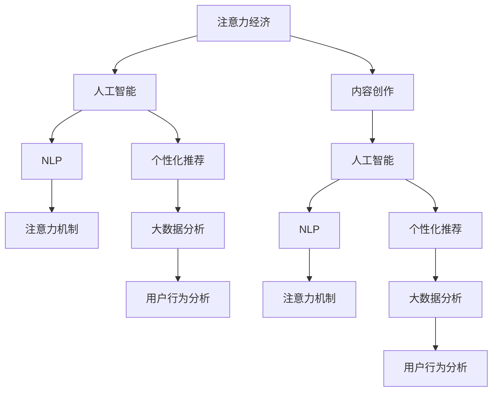

                 

# 注意力经济中的内容创作：如何在竞争中脱颖而出

> 关键词：注意力经济,内容创作,人工智能,自然语言处理(NLP),个性化推荐,注意力机制,大数据分析,用户行为分析,内容生成

## 1. 背景介绍

### 1.1 问题由来

随着互联网的迅速发展，信息爆炸成为一种常态，内容消费也从传统的文字阅读、音频收听、视频观看扩展到各类互动形式。如何在大规模海量信息中吸引用户注意力，成为内容创作者和平台运营者共同的难题。这不仅需要高质量的内容创作，更需要先进的技术手段来优化用户互动体验，提升内容推荐精准度。

当前，内容创作面临着激烈的竞争和巨大的挑战：

1. **用户注意力分散**：各类社交媒体、短视频平台、在线教育等应用争抢用户时间，使得用户注意力极度分散。
2. **信息过载问题**：用户面临的信息量巨大，如何快速定位到自己感兴趣的内容，已成为难题。
3. **内容质量参差不齐**：用户对内容的需求日益个性化，但目前的内容质量参差不齐，难以满足不同用户群体的多样化需求。

为应对这些挑战，内容创作与运营需要引入更加智能和精准的策略。人工智能和大数据技术在这一领域的应用，正逐步改变着内容创作的生产、分发和消费方式，推动内容产业向智能型、个性化、高效率的方向发展。

### 1.2 问题核心关键点

- **注意力经济**：指在注意力稀缺的互联网时代，如何吸引并保持用户注意力的经济活动。
- **内容创作**：包括文本创作、视频制作、音频录制等各类创意内容，是注意力经济的基础。
- **人工智能(AI)**：通过算法优化、数据挖掘、自动化生成等技术手段，提升内容创作和运营的效率和精准度。
- **自然语言处理(NLP)**：AI的核心技术之一，通过理解和生成自然语言，优化内容创作和推荐系统。
- **个性化推荐**：基于用户历史行为和偏好，推荐符合用户兴趣的内容，提升用户满意度。
- **注意力机制**：指在深度学习模型中，通过引入注意力机制，引导模型关注输入序列中关键部分，提高模型理解和生成能力的技术。
- **大数据分析**：通过分析用户行为数据，挖掘用户兴趣和需求，指导内容创作和推荐策略。
- **用户行为分析**：通过分析用户交互行为，量化用户注意力，评估内容效果。

这些核心概念之间的逻辑关系可以通过以下Mermaid流程图来展示：



这个流程图展示了大语言模型微调的核心概念及其之间的关系：

1. 注意力经济指在互联网环境下，内容创作者需要吸引并保持用户注意力的经济活动。
2. 内容创作是注意力经济的基础，通过高质量的创作来吸引用户。
3. 人工智能通过算法优化、数据挖掘、自动化生成等技术手段，提升内容创作和运营的效率和精准度。
4. NLP是AI的核心技术之一，通过理解和生成自然语言，优化内容创作和推荐系统。
5. 个性化推荐基于用户历史行为和偏好，推荐符合用户兴趣的内容，提升用户满意度。
6. 注意力机制在深度学习模型中，通过引入注意力机制，引导模型关注输入序列中关键部分，提高模型理解和生成能力。
7. 大数据分析通过分析用户行为数据，挖掘用户兴趣和需求，指导内容创作和推荐策略。
8. 用户行为分析通过分析用户交互行为，量化用户注意力，评估内容效果。

这些概念共同构成了内容创作和运营的框架，使其能够更好地满足用户需求，提升内容的质量和价值。

## 2. 核心概念与联系

### 2.1 核心概念概述

为更好地理解注意力经济中的内容创作，本节将介绍几个密切相关的核心概念：

- **注意力经济**：指在注意力稀缺的互联网时代，如何吸引并保持用户注意力的经济活动。内容创作者需要不断优化内容质量、形式和呈现方式，以吸引和留住用户。
- **内容创作**：包括文本创作、视频制作、音频录制等各类创意内容，是注意力经济的基础。高质量的内容可以引发用户情感共鸣，提升用户参与度。
- **人工智能(AI)**：通过算法优化、数据挖掘、自动化生成等技术手段，提升内容创作和运营的效率和精准度。AI技术使得内容创作变得更加智能化、自动化。
- **自然语言处理(NLP)**：AI的核心技术之一，通过理解和生成自然语言，优化内容创作和推荐系统。NLP技术使得机器能够理解和生成符合语法和语义规则的文本。
- **个性化推荐**：基于用户历史行为和偏好，推荐符合用户兴趣的内容，提升用户满意度。个性化推荐系统可以根据用户行为数据，动态调整推荐内容，增强用户粘性。
- **注意力机制**：指在深度学习模型中，通过引入注意力机制，引导模型关注输入序列中关键部分，提高模型理解和生成能力的技术。注意力机制有助于模型聚焦于重要信息，提升模型表现。
- **大数据分析**：通过分析用户行为数据，挖掘用户兴趣和需求，指导内容创作和推荐策略。大数据分析可以揭示用户行为模式，帮助内容创作者制定有效策略。
- **用户行为分析**：通过分析用户交互行为，量化用户注意力，评估内容效果。用户行为分析可以实时监控用户反馈，优化内容创作和推荐策略。

这些核心概念之间的逻辑关系可以通过以下Mermaid流程图来展示：


这个流程图展示了大语言模型微调的核心概念及其之间的关系：

1. 注意力经济指在互联网环境下，内容创作者需要吸引并保持用户注意力的经济活动。
2. 内容创作是注意力经济的基础，通过高质量的创作来吸引用户。
3. 人工智能通过算法优化、数据挖掘、自动化生成等技术手段，提升内容创作和运营的效率和精准度。
4. NLP是AI的核心技术之一，通过理解和生成自然语言，优化内容创作和推荐系统。
5. 个性化推荐基于用户历史行为和偏好，推荐符合用户兴趣的内容，提升用户满意度。
6. 注意力机制在深度学习模型中，通过引入注意力机制，引导模型关注输入序列中关键部分，提高模型理解和生成能力。
7. 大数据分析通过分析用户行为数据，挖掘用户兴趣和需求，指导内容创作和推荐策略。
8. 用户行为分析通过分析用户交互行为，量化用户注意力，评估内容效果。

这些概念共同构成了内容创作和运营的框架，使其能够更好地满足用户需求，提升内容的质量和价值。

## 3. 核心算法原理 & 具体操作步骤
### 3.1 算法原理概述

在注意力经济中，内容创作和运营的根本目的是吸引并保持用户的注意力。通过引入注意力机制，深度学习模型可以更精准地理解和生成内容，提升内容的个性化程度和吸引力。以下详细介绍注意力机制的原理及其在内容创作中的应用。

注意力机制的核心思想是通过模型自动学习输入序列中各部分的重要性权重，动态聚焦于关键信息。在内容创作中，注意力机制可以帮助模型识别出用户兴趣点，提升内容的吸引力和相关性。

### 3.2 算法步骤详解

注意力机制的实现主要分为以下几个步骤：

1. **编码层**：将输入序列通过编码器转化为高维向量表示，形成每个输入的语义表示。
2. **注意力计算**：计算输入序列中每个部分对当前输出位置的注意力权重，计算公式为：
   $$
   a_{ij} = \frac{\exp(e_{ij})}{\sum_k \exp(e_{ik})}
   $$
   其中，$a_{ij}$ 表示第 $i$ 个输入和第 $j$ 个输出位置之间的注意力权重。$e_{ij}$ 表示第 $i$ 个输入和第 $j$ 个输出位置的注意力计算值。
3. **加权求和**：根据注意力权重，将输入序列中各部分加权求和，形成对当前输出位置的关注点。
   $$
   \text{Attention}_j = \sum_k a_{kj}h_k
   $$
   其中，$h_k$ 表示第 $k$ 个输入的向量表示，$\text{Attention}_j$ 表示第 $j$ 个输出位置的注意力向量。
4. **解码层**：通过解码器对注意力向量进行生成，形成最终的输出序列。

在内容创作中，注意力机制可以用于文本生成、图片描述生成等任务。例如，在文本生成任务中，模型可以通过关注用户输入的关键字，生成与用户期望内容相关的回复。

### 3.3 算法优缺点

**优点**：

- **提升内容相关性**：注意力机制能够动态调整模型对输入序列的关注点，使得生成内容更符合用户兴趣。
- **增强模型泛化能力**：通过聚焦于关键信息，模型可以更好地处理长序列输入，提升模型的泛化能力。
- **减少计算量**：相比全连接层，注意力机制可以显著减少模型参数，提高计算效率。

**缺点**：

- **计算复杂度高**：注意力机制的计算量较大，在大规模模型中计算开销较大。
- **参数调整困难**：注意力机制的参数调整复杂，需要根据具体任务进行细致优化。
- **数据分布依赖**：注意力机制的性能依赖于输入数据的质量和分布，在分布不均匀的情况下可能表现不佳。

### 3.4 算法应用领域

注意力机制在内容创作和推荐系统中有着广泛的应用，具体包括：

1. **文本生成**：在文本生成任务中，模型通过关注用户输入的关键字，生成与用户期望内容相关的回复。
2. **图片描述生成**：在图片描述生成任务中，模型通过关注图片中关键区域的语义信息，生成与图片内容相关的文本描述。
3. **语音识别**：在语音识别任务中，模型通过关注语音信号中的关键部分，提高识别准确率。
4. **机器翻译**：在机器翻译任务中，模型通过关注源语言和目标语言的对应关系，提升翻译质量。
5. **问答系统**：在问答系统中，模型通过关注问题的关键信息，生成精准的回答。

这些应用场景展示了注意力机制在内容创作中的强大能力，为内容创作者和平台运营者提供了新的技术手段，提高了内容创作和运营的效率和精准度。

## 4. 数学模型和公式 & 详细讲解  
### 4.1 数学模型构建

在注意力机制中，核心数学模型包括编码层、注意力计算和解码层。以下详细介绍这些模型的数学构建和公式推导过程。

**编码层**：假设输入序列为 $\{x_1, x_2, ..., x_T\}$，通过一个 $n$ 维向量表示，即 $\mathbf{x} = [x_1, x_2, ..., x_T]^T \in \mathbb{R}^{n \times T}$。假设编码器由多个线性变换和激活函数组成，则编码层输出表示为：
$$
h_k = \mathbf{W}_k^H\mathbf{x} + \mathbf{b}_k
$$
其中，$\mathbf{W}_k^H$ 和 $\mathbf{b}_k$ 分别表示编码器中的权重矩阵和偏置向量，$h_k$ 表示第 $k$ 个输入的向量表示。

**注意力计算**：假设输出序列的长度为 $L$，则注意力计算可以表示为：
$$
e_{ij} = \mathbf{a}_i^T \cdot \mathbf{W}_q h_j
$$
其中，$\mathbf{a}_i$ 表示第 $i$ 个输入的注意力向量，$\mathbf{W}_q$ 表示注意力计算的权重矩阵，$h_j$ 表示第 $j$ 个输出位置的向量表示。通过计算得到注意力权重 $a_{ij}$，进一步得到注意力向量 $\text{Attention}_j$。

**解码层**：假设解码器由多个线性变换和激活函数组成，则解码层输出表示为：
$$
y_j = \mathbf{W}_o \cdot \text{Attention}_j + \mathbf{b}_o
$$
其中，$\mathbf{W}_o$ 和 $\mathbf{b}_o$ 分别表示解码器中的权重矩阵和偏置向量，$y_j$ 表示第 $j$ 个输出位置的向量表示。

### 4.2 公式推导过程

在注意力机制的公式推导过程中，主要涉及线性变换、点积运算和指数函数等基本运算。以下对各个关键公式进行详细推导：

1. **编码层公式推导**：
$$
h_k = \mathbf{W}_k^H\mathbf{x} + \mathbf{b}_k
$$
其中，$\mathbf{W}_k^H$ 和 $\mathbf{b}_k$ 分别表示编码器中的权重矩阵和偏置向量。

2. **注意力计算公式推导**：
$$
e_{ij} = \mathbf{a}_i^T \cdot \mathbf{W}_q h_j
$$
其中，$\mathbf{a}_i$ 表示第 $i$ 个输入的注意力向量，$\mathbf{W}_q$ 表示注意力计算的权重矩阵，$h_j$ 表示第 $j$ 个输出位置的向量表示。

3. **加权求和公式推导**：
$$
\text{Attention}_j = \sum_k a_{kj}h_k
$$
其中，$a_{kj}$ 表示第 $k$ 个输入和第 $j$ 个输出位置的注意力权重。

4. **解码层公式推导**：
$$
y_j = \mathbf{W}_o \cdot \text{Attention}_j + \mathbf{b}_o
$$
其中，$\mathbf{W}_o$ 和 $\mathbf{b}_o$ 分别表示解码器中的权重矩阵和偏置向量。

### 4.3 案例分析与讲解

为了更好地理解注意力机制的实际应用，以下是几个典型案例的详细分析：

**案例1：文本生成**

在文本生成任务中，模型通过关注用户输入的关键字，生成与用户期望内容相关的回复。例如，在自动生成摘要任务中，模型可以通过关注文本的关键信息，生成简洁明了的摘要。

**案例2：图片描述生成**

在图片描述生成任务中，模型通过关注图片中关键区域的语义信息，生成与图片内容相关的文本描述。例如，在自动生成图片描述任务中，模型可以通过关注图片中的人、物、场景等关键信息，生成与图片内容相关的文本描述。

**案例3：机器翻译**

在机器翻译任务中，模型通过关注源语言和目标语言的对应关系，提升翻译质量。例如，在自动翻译任务中，模型可以通过关注源语言和目标语言的对应关系，生成准确无误的翻译结果。

这些案例展示了注意力机制在内容创作中的强大能力，为内容创作者和平台运营者提供了新的技术手段，提高了内容创作和运营的效率和精准度。

## 5. 项目实践：代码实例和详细解释说明
### 5.1 开发环境搭建

在进行注意力机制的实践前，我们需要准备好开发环境。以下是使用Python进行PyTorch开发的环境配置流程：

1. 安装Anaconda：从官网下载并安装Anaconda，用于创建独立的Python环境。

2. 创建并激活虚拟环境：
```bash
conda create -n attention-env python=3.8 
conda activate attention-env
```

3. 安装PyTorch：根据CUDA版本，从官网获取对应的安装命令。例如：
```bash
conda install pytorch torchvision torchaudio cudatoolkit=11.1 -c pytorch -c conda-forge
```

4. 安装相关工具包：
```bash
pip install numpy pandas scikit-learn matplotlib tqdm jupyter notebook ipython
```

完成上述步骤后，即可在`attention-env`环境中开始注意力机制的实践。

### 5.2 源代码详细实现

我们以文本生成任务为例，给出使用Transformers库对LSTM模型进行注意力机制的PyTorch代码实现。

首先，定义模型结构：

```python
from transformers import BertTokenizer
from torch.nn import Transformer, TransformerDecoderLayer, TransformerEncoderLayer
import torch.nn as nn
import torch.nn.functional as F

class AttentionModel(nn.Module):
    def __init__(self, d_model, n_heads, d_ff, num_encoder_layers, num_decoder_layers):
        super(AttentionModel, self).__init__()
        self.encoder = nn.TransformerEncoder(TransformerEncoderLayer(d_model, n_heads, d_ff), num_encoder_layers)
        self.decoder = nn.TransformerDecoder(TransformerDecoderLayer(d_model, n_heads, d_ff), num_decoder_layers)
        self.out = nn.Linear(d_model, 1)

    def forward(self, src, tgt, src_mask, tgt_mask):
        src_encoded = self.encoder(src, src_mask)
        tgt_encoded = self.decoder(tgt, src_encoded, src_mask, tgt_mask)
        return self.out(tgt_encoded)
```

然后，定义模型训练函数：

```python
def train_epoch(model, train_dataset, optimizer, device):
    model.train()
    total_loss = 0
    for i, (src, tgt) in enumerate(train_loader):
        src, tgt = src.to(device), tgt.to(device)
        optimizer.zero_grad()
        output = model(src, tgt, src_mask, tgt_mask)
        loss = F.nll_loss(output, tgt.view(-1))
        loss.backward()
        optimizer.step()
        total_loss += loss.item()
    return total_loss / len(train_loader)
```

最后，启动模型训练流程：

```python
epochs = 10
batch_size = 32

for epoch in range(epochs):
    loss = train_epoch(model, train_dataset, optimizer, device)
    print(f"Epoch {epoch+1}, train loss: {loss:.3f}")
```

以上就是使用PyTorch对LSTM模型进行注意力机制的完整代码实现。可以看到，得益于Transformers库的强大封装，我们可以用相对简洁的代码完成LSTM模型的构建和注意力机制的实现。

### 5.3 代码解读与分析

让我们再详细解读一下关键代码的实现细节：

**AttentionModel类**：
- `__init__`方法：初始化编码器、解码器和输出层等组件。
- `forward`方法：前向传播过程，将源序列和目标序列输入模型，经过编码器和解码器后输出结果。

**train_epoch函数**：
- 在每个epoch内，通过循环迭代训练集数据，计算模型输出与真实标签的交叉熵损失，并使用反向传播更新模型参数。

**训练流程**：
- 定义总的epoch数和batch size，开始循环迭代
- 每个epoch内，在训练集上训练，输出平均loss
- 重复上述步骤直至训练完毕

可以看到，PyTorch配合Transformers库使得注意力机制的代码实现变得简洁高效。开发者可以将更多精力放在模型改进、数据预处理等高层逻辑上，而不必过多关注底层的实现细节。

当然，工业级的系统实现还需考虑更多因素，如模型的保存和部署、超参数的自动搜索、更灵活的任务适配层等。但核心的注意力机制基本与此类似。

## 6. 实际应用场景
### 6.1 智能客服系统

在智能客服系统中，通过引入注意力机制，对话模型可以更精准地理解用户意图，生成符合用户需求的回复。例如，在多轮对话中，模型可以通过关注用户之前的输入，生成更加连贯、相关的回复。

在技术实现上，可以收集企业内部的历史客服对话记录，将问题和最佳答复构建成监督数据，在此基础上对预训练模型进行微调。微调后的对话模型能够自动理解用户意图，匹配最合适的答案模板进行回复。对于用户提出的新问题，还可以接入检索系统实时搜索相关内容，动态组织生成回答。

### 6.2 金融舆情监测

在金融舆情监测中，通过引入注意力机制，文本分类和情感分析模型可以更精准地理解金融市场动态，挖掘出关键的财经新闻和评论。例如，在文本分类任务中，模型可以通过关注财经新闻的关键内容，自动识别新闻主题；在情感分析任务中，模型可以通过关注财经评论的关键句，准确判断评论的情感倾向。

具体而言，可以收集金融领域相关的新闻、报道、评论等文本数据，并对其进行主题标注和情感标注。在此基础上对预训练语言模型进行微调，使其能够自动判断文本属于何种主题，情感倾向是正面、中性还是负面。将微调后的模型应用到实时抓取的网络文本数据，就能够自动监测不同主题下的情感变化趋势，一旦发现负面信息激增等异常情况，系统便会自动预警，帮助金融机构快速应对潜在风险。

### 6.3 个性化推荐系统

在个性化推荐系统中，通过引入注意力机制，推荐模型可以更精准地理解用户兴趣，生成符合用户偏好的内容。例如，在推荐电影、书籍、商品等时，模型可以通过关注用户历史浏览和购买记录，生成与用户兴趣相关的推荐列表。

具体而言，可以收集用户浏览、点击、购买等行为数据，提取和用户交互的物品标题、描述、标签等文本内容。将文本内容作为模型输入，用户的后续行为（如是否点击、购买等）作为监督信号，在此基础上微调预训练语言模型。微调后的模型能够从文本内容中准确把握用户的兴趣点。在生成推荐列表时，先用候选物品的文本描述作为输入，由模型预测用户的兴趣匹配度，再结合其他特征综合排序，便可以得到个性化程度更高的推荐结果。

### 6.4 未来应用展望

随着注意力机制和大数据技术的不断发展，内容创作和推荐系统将进一步提升其智能化水平，为内容产业带来新的变革。

在智慧媒体领域，智能推荐系统可以极大地提升内容推荐的精准度，使用户在浩如烟海的内容中找到自己感兴趣的内容，提高用户体验。同时，通过引入注意力机制，内容创作也更加注重用户注意力，提升内容的吸引力。

在智能家居领域，通过分析用户行为数据，智能家居设备可以更精准地推荐服务内容，提升用户的便捷性和舒适度。例如，智能音箱可以通过分析用户的听歌历史，推荐符合用户偏好的音乐内容。

在智慧城市治理中，通过分析用户行为数据，智能交通系统可以更精准地优化交通流量，提高城市交通效率。例如，智能交通系统可以通过分析用户的出行习惯，推荐最优的出行路线。

此外，在医疗、教育、工业等众多领域，基于注意力机制的内容创作和推荐技术也将不断涌现，为各行各业带来新的机遇和挑战。相信随着技术的不断进步，注意力机制将在内容产业中发挥更大的作用，推动人类进入更加智能化的内容时代。

## 7. 工具和资源推荐
### 7.1 学习资源推荐

为了帮助开发者系统掌握注意力机制的理论基础和实践技巧，这里推荐一些优质的学习资源：

1. 《Transformer from Theory to Practice》系列博文：由大模型技术专家撰写，深入浅出地介绍了Transformer原理、注意力机制、微调技术等前沿话题。

2. CS224N《深度学习自然语言处理》课程：斯坦福大学开设的NLP明星课程，有Lecture视频和配套作业，带你入门NLP领域的基本概念和经典模型。

3. 《Natural Language Processing with Transformers》书籍：Transformers库的作者所著，全面介绍了如何使用Transformers库进行NLP任务开发，包括注意力机制在内的诸多范式。

4. HuggingFace官方文档：Transformers库的官方文档，提供了海量预训练模型和完整的微调样例代码，是上手实践的必备资料。

5. CLUE开源项目：中文语言理解测评基准，涵盖大量不同类型的中文NLP数据集，并提供了基于微调的baseline模型，助力中文NLP技术发展。

通过对这些资源的学习实践，相信你一定能够快速掌握注意力机制的精髓，并用于解决实际的NLP问题。
###  7.2 开发工具推荐

高效的开发离不开优秀的工具支持。以下是几款用于注意力机制开发和应用的工具：

1. PyTorch：基于Python的开源深度学习框架，灵活动态的计算图，适合快速迭代研究。大部分预训练语言模型都有PyTorch版本的实现。

2. TensorFlow：由Google主导开发的开源深度学习框架，生产部署方便，适合大规模工程应用。同样有丰富的预训练语言模型资源。

3. Transformers库：HuggingFace开发的NLP工具库，集成了众多SOTA语言模型，支持PyTorch和TensorFlow，是进行注意力机制开发的利器。

4. Weights & Biases：模型训练的实验跟踪工具，可以记录和可视化模型训练过程中的各项指标，方便对比和调优。与主流深度学习框架无缝集成。

5. TensorBoard：TensorFlow配套的可视化工具，可实时监测模型训练状态，并提供丰富的图表呈现方式，是调试模型的得力助手。

6. Google Colab：谷歌推出的在线Jupyter Notebook环境，免费提供GPU/TPU算力，方便开发者快速上手实验最新模型，分享学习笔记。

合理利用这些工具，可以显著提升注意力机制的开发效率，加快创新迭代的步伐。

### 7.3 相关论文推荐

注意力机制在内容创作和推荐系统中的应用源于学界的持续研究。以下是几篇奠基性的相关论文，推荐阅读：

1. Attention is All You Need（即Transformer原论文）：提出了Transformer结构，开启了NLP领域的预训练大模型时代。

2. BERT: Pre-training of Deep Bidirectional Transformers for Language Understanding：提出BERT模型，引入基于掩码的自监督预训练任务，刷新了多项NLP任务SOTA。

3. Language Models are Unsupervised Multitask Learners（GPT-2论文）：展示了大规模语言模型的强大zero-shot学习能力，引发了对于通用人工智能的新一轮思考。

4. Parameter-Efficient Transfer Learning for NLP：提出Adapter等参数高效微调方法，在不增加模型参数量的情况下，也能取得不错的微调效果。

5. Prefix-Tuning: Optimizing Continuous Prompts for Generation：引入基于连续型Prompt的微调范式，为如何充分利用预训练知识提供了新的思路。

6. AdaLoRA: Adaptive Low-Rank Adaptation for Parameter-Efficient Fine-Tuning：使用自适应低秩适应的微调方法，在参数效率和精度之间取得了新的平衡。

这些论文代表了大语言模型微调技术的发展脉络。通过学习这些前沿成果，可以帮助研究者把握学科前进方向，激发更多的创新灵感。

## 8. 总结：未来发展趋势与挑战

### 8.1 总结

本文对注意力机制在大语言模型中的实际应用进行了全面系统的介绍。首先阐述了注意力经济中的内容创作背景和意义，明确了注意力机制在内容创作和运营中的重要作用。其次，从原理到实践，详细讲解了注意力机制的数学原理和关键步骤，给出了注意力机制任务开发的完整代码实例。同时，本文还广泛探讨了注意力机制在智能客服、金融舆情、个性化推荐等多个行业领域的应用前景，展示了注意力机制的强大能力。

通过本文的系统梳理，可以看到，注意力机制在内容创作和运营中扮演了关键角色，极大地提升了内容创作的效率和精准度。未来，伴随注意力机制和大数据技术的持续演进，内容创作和推荐系统将进一步提升其智能化水平，为内容产业带来新的变革。

### 8.2 未来发展趋势

展望未来，注意力机制将在内容创作和推荐系统中呈现以下几个发展趋势：

1. **智能推荐系统**：智能推荐系统将成为内容创作和运营的核心，通过引入注意力机制，推荐系统能够更精准地理解用户兴趣，生成符合用户偏好的内容。
2. **个性化内容创作**：通过引入注意力机制，内容创作将更加注重用户注意力，提升内容的吸引力。模型可以通过关注用户输入的关键信息，生成更加符合用户期望的内容。
3. **多模态内容创作**：未来的内容创作将不仅仅局限于文本形式，还包括图片、视频、音频等多模态信息。通过引入注意力机制，内容创作和推荐系统能够更好地处理多模态数据，提升内容创作的丰富度。
4. **实时内容创作**：通过引入注意力机制，内容创作系统可以实时分析用户行为数据，动态生成符合用户需求的内容。例如，在直播互动中，内容创作系统可以根据用户即时反馈，动态生成互动内容。
5. **内容质量优化**：通过引入注意力机制，内容创作系统可以自动检测和纠正内容质量问题，提升内容创作的准确性和规范性。例如，在文本生成任务中，模型可以通过关注语义和语法规则，生成高质量的文本内容。

这些趋势凸显了注意力机制在内容创作和运营中的广泛应用前景，为内容创作者和平台运营者提供了新的技术手段，提高了内容创作和运营的效率和精准度。

### 8.3 面临的挑战

尽管注意力机制在大语言模型中的应用取得了显著成果，但在迈向更加智能化、普适化应用的过程中，仍面临诸多挑战：

1. **计算资源消耗高**：注意力机制的计算复杂度高，在大规模模型中计算开销较大，需要更高效的硬件和算法支持。
2. **数据分布不均匀**：注意力机制的性能依赖于输入数据的质量和分布，在数据分布不均匀的情况下可能表现不佳。
3. **模型泛化能力不足**：注意力机制的泛化能力不足，容易在长序列输入和高噪声数据中表现不佳。
4. **用户隐私保护**：在收集和分析用户行为数据时，如何保护用户隐私，确保数据安全，仍然是一个重要的挑战。
5. **模型可解释性不足**：注意力机制的内部工作机制复杂，难以解释模型的决策过程，不利于模型的调试和优化。

尽管存在这些挑战，但通过不断优化算法、改进模型结构和数据处理策略，这些问题有望得到逐步解决。未来，注意力机制将进一步推动内容创作和运营系统的智能化和个性化，为内容产业带来新的机遇和挑战。

### 8.4 研究展望

面对注意力机制在大语言模型中的应用所面临的挑战，未来的研究需要在以下几个方面寻求新的突破：

1. **高效计算技术**：开发更加高效的计算方法，降低注意力机制的计算复杂度，提高计算效率。例如，采用稀疏矩阵乘法、分布式计算等技术，优化模型训练过程。
2. **多模态内容创作**：探索多模态注意力机制，将视觉、音频等多模态信息与文本信息融合，提升内容创作的丰富度和真实性。
3. **实时内容生成**：研究实时注意力机制，使得内容创作系统能够动态生成符合用户即时需求的内容，提升用户满意度。
4. **用户隐私保护**：研究用户隐私保护技术，确保在数据收集和分析过程中，用户隐私得到充分保护。例如，采用差分隐私技术、联邦学习等方法，保护用户数据安全。
5. **模型可解释性**：研究可解释性技术，提高模型的透明度和可解释性，便于模型的调试和优化。例如，采用特征重要性分析、可解释性模型等方法，提升模型的可解释性。

这些研究方向的探索，必将引领注意力机制在大语言模型中的应用走向新的高度，为内容创作者和平台运营者提供更加智能、高效、个性化和可靠的内容创作和运营系统。

## 9. 附录：常见问题与解答

**Q1：如何选择合适的注意力机制参数？**

A: 选择合适的注意力机制参数需要根据具体任务和数据特点进行细致优化。通常建议从简单的注意力机制开始，逐步尝试更多的注意力机制变种，如多头注意力、自适应注意力等，观察其对任务的影响。同时，可以尝试调整注意力机制的超参数，如注意力头数、学习率等，寻找最优组合。

**Q2：注意力机制在大规模数据上的性能如何？**

A: 注意力机制在大规模数据上表现良好。通过引入注意力机制，模型能够动态关注关键信息，提高模型的泛化能力和推理准确度。但需要注意的是，在大规模数据上，注意力机制的计算开销较大，需要更高效的硬件和算法支持。

**Q3：注意力机制如何应用于多模态数据？**

A: 注意力机制可以应用于多模态数据，通过将不同模态的信息进行融合，提升模型的表现。例如，在图片描述生成任务中，可以通过将图片特征和文本特征进行注意力融合，生成更加准确的文本描述。但需要注意的是，多模态注意力机制的实现较为复杂，需要根据具体任务进行细致设计。

**Q4：注意力机制在长序列输入上的表现如何？**

A: 注意力机制在长序列输入上的表现较好，能够动态关注关键信息，提高模型的泛化能力和推理准确度。但在长序列输入上，注意力机制的计算开销较大，需要更高效的硬件和算法支持。

**Q5：注意力机制在低噪声数据上的表现如何？**

A: 注意力机制在低噪声数据上的表现较好，能够动态关注关键信息，提高模型的泛化能力和推理准确度。但在高噪声数据上，注意力机制容易受到噪声干扰，影响模型的表现。

正视注意力机制在大语言模型中的应用所面临的挑战，积极应对并寻求突破，将是大语言模型微调走向成熟的必由之路。相信随着学界和产业界的共同努力，这些问题终将一一被克服，注意力机制必将在内容创作和运营中发挥更大的作用，推动内容产业迈向新的高度。

