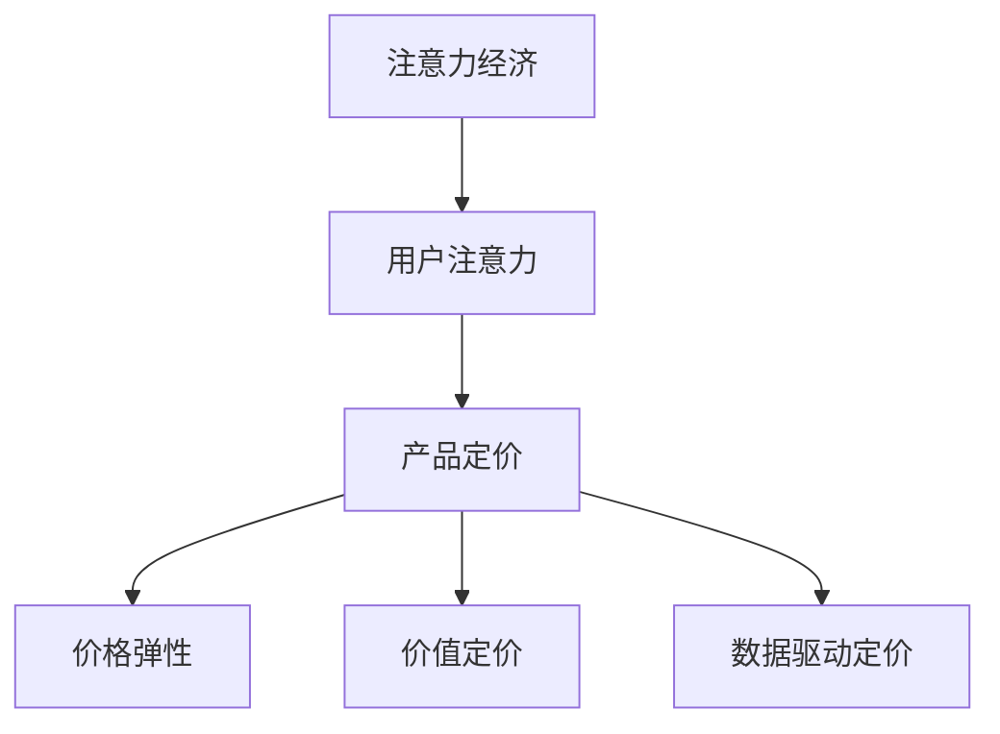
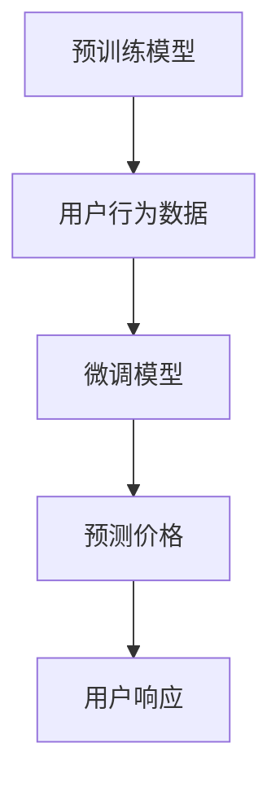

                 

## 1. 背景介绍

在数字经济时代，注意力成为一种稀缺资源，企业竞争的核心已从传统的商品和服务转变为用户注意力的争夺。这种变化对企业的市场策略、产品定价以及整体运营模式提出了新的要求。本文旨在深入探讨注意力经济对企业产品定价的新要求，为企业在数字经济时代的战略决策提供参考。

## 2. 核心概念与联系

### 2.1 核心概念概述

- **注意力经济（Attention Economy）**：指在信息过载时代，用户注意力成为稀缺资源，企业需通过各种手段吸引并保持用户的注意力，从而实现商业价值。
- **用户注意力（User Attention）**：用户对信息内容的关注程度，反映了信息的吸引力、相关性和时效性。
- **产品定价（Product Pricing）**：企业基于成本、需求、市场竞争等因素对产品或服务进行定价，以实现盈利最大化。
- **价格弹性（Price Elasticity）**：指产品或服务价格变化对需求量的影响程度，用于衡量价格调整对销售收入的敏感性。
- **价值定价（Value-based Pricing）**：基于产品或服务对用户的实际价值进行定价，而非传统的成本加成或竞争定价。
- **数据驱动定价（Data-driven Pricing）**：利用大数据分析用户行为、偏好等数据，制定动态和个性化定价策略。

这些概念之间的关系可以通过以下Mermaid流程图来展示：



### 2.2 核心概念原理和架构的 Mermaid 流程图



预训练模型通过大规模无监督学习获得用户行为特征，微调模型将这些特征与用户注意力数据结合，预测产品价格，并实时响应用户反馈，优化价格策略。

## 3. 核心算法原理 & 具体操作步骤

### 3.1 算法原理概述

注意力经济对产品定价的影响主要体现在以下几个方面：

- **用户注意力价值（User Attention Value）**：用户对某一产品或服务的关注度越高，其内在价值也越高，对应的价格应相应提升。
- **需求价格弹性（Demand Price Elasticity）**：用户对价格的敏感度直接影响产品的需求量，需要通过精确定价策略平衡价格和销量。
- **价值定价模型（Value-based Model）**：以用户对产品或服务的实际价值为基础，而非成本或竞争对标定价。
- **数据驱动定价（Data-driven Model）**：通过大数据分析用户行为，实时调整定价策略，以应对市场需求变化。

### 3.2 算法步骤详解

1. **数据收集与预处理**：收集用户行为数据、产品特征数据、市场竞争数据等，并进行清洗和标准化。
2. **用户注意力建模**：利用机器学习模型，如Transformer、BERT等，对用户行为数据进行特征提取和建模，获得用户注意力的量化指标。
3. **产品价值评估**：结合用户注意力数据和产品特征，评估产品对用户的实际价值。
4. **动态定价优化**：根据需求价格弹性，采用动态定价算法，调整产品价格。
5. **结果评估与反馈**：监测用户响应数据，评估定价策略效果，不断迭代优化。

### 3.3 算法优缺点

**优点**：

- 精确反映用户需求，提升用户体验和满意度。
- 动态定价策略灵活响应市场需求变化，提高市场竞争力。
- 结合用户实际价值进行定价，避免价格歧视，增强品牌信任。

**缺点**：

- 对数据质量和模型的依赖性较高，需要持续投入数据和模型训练。
- 动态定价策略复杂，需考虑多因素影响，实施难度较大。
- 数据隐私和安全问题需得到充分保障，防止信息泄露。

### 3.4 算法应用领域

注意力经济对产品定价的影响广泛适用于各种行业，包括但不限于：

- **电子商务**：利用用户点击、浏览、购买等行为数据，实时调整商品价格，提高销售转化率。
- **金融服务**：基于用户资金流动、交易记录等数据，进行个性化定价，提升客户忠诚度。
- **内容平台**：根据用户观看、评论、订阅等行为，动态调整内容收费策略，优化用户体验。
- **教育培训**：根据学生学习进度、反馈等数据，制定个性化定价，提升教育效果。
- **旅游服务**：结合用户出行偏好、评价数据，调整旅游产品定价，提升客户满意度。

## 4. 数学模型和公式 & 详细讲解

### 4.1 数学模型构建

假设用户对某一产品的关注度为 \( U \)，产品价格为 \( P \)，用户需求量为 \( Q \)，需求价格弹性为 \( \epsilon \)。产品价值评估模型为 \( V(U, P) \)。

目标是最优化利润函数：

$$
\max \sum_{i=1}^n V(U_i, P_i) - C_i
$$

其中 \( C_i \) 为第 \( i \) 个产品的成本。

### 4.2 公式推导过程

假设用户对产品的实际价值 \( V \) 与其关注度 \( U \) 成正比，即：

$$
V(U, P) = aU + bP
$$

其中 \( a \) 和 \( b \) 为模型参数。

需求价格弹性为：

$$
\epsilon = \frac{\partial Q}{\partial P}
$$

基于用户关注度和价格弹性，可构建动态定价模型：

$$
P_i = P_0 + k\log(\frac{U_i}{U_{avg}})
$$

其中 \( P_0 \) 为初始价格，\( k \) 为价格调整系数，\( U_{avg} \) 为平均用户关注度。

### 4.3 案例分析与讲解

以电商平台商品定价为例：

1. **数据收集**：收集用户浏览、点击、购买、评价等行为数据，并结合商品描述、价格、销量等特征。
2. **用户关注度建模**：利用BERT模型，对用户行为数据进行特征提取，获得每个用户的关注度得分。
3. **产品价值评估**：结合用户关注度和商品特征，构建价值评估函数 \( V(U, P) \)，评估每个商品对用户的实际价值。
4. **动态定价优化**：根据需求价格弹性，使用动态定价算法，调整商品价格。
5. **结果评估与反馈**：监测用户购买行为，评估定价策略效果，不断迭代优化模型参数。

## 5. 项目实践：代码实例和详细解释说明

### 5.1 开发环境搭建

- **Python**：安装最新版本的Python，并确保环境变量正确配置。
- **TensorFlow**：安装TensorFlow，用于构建和训练机器学习模型。
- **BERT库**：使用Hugging Face的Transformers库，方便进行用户关注度建模。
- **大数据平台**：如Apache Spark，用于处理和分析大规模用户行为数据。

### 5.2 源代码详细实现

以下是一个简单的Python代码示例，展示了如何使用BERT模型进行用户关注度建模和动态定价：

```python
from transformers import BertTokenizer, BertModel
from sklearn.preprocessing import StandardScaler
from sklearn.linear_model import LinearRegression

# 数据预处理
tokenizer = BertTokenizer.from_pretrained('bert-base-uncased')
model = BertModel.from_pretrained('bert-base-uncased')

def preprocess_data(data):
    # 将文本转换为BERT的输入格式
    tokenized = tokenizer.encode_plus(data, max_length=512, return_tensors='tf')
    return tokenized['input_ids'], tokenized['attention_mask']

# 用户关注度建模
def train_user_attention_model(train_data, train_labels):
    input_ids, attention_masks = preprocess_data(train_data)
    features = model(input_ids, attention_masks=attention_masks).last_hidden_state[:, 0, :]
    scaler = StandardScaler()
    features = scaler.fit_transform(features)
    model = LinearRegression()
    model.fit(features, train_labels)
    return model

# 动态定价优化
def dynamic_pricing(train_data, train_labels, test_data, model):
    train_input_ids, train_attention_masks = preprocess_data(train_data)
    test_input_ids, test_attention_masks = preprocess_data(test_data)
    features = model(input_ids, attention_masks=attention_masks).last_hidden_state[:, 0, :]
    features_test = model(test_input_ids, attention_masks=test_attention_masks).last_hidden_state[:, 0, :]
    features_test = scaler.transform(features_test)
    predictions = model.predict(features_test)
    return predictions

# 加载数据和模型
train_data = ...
train_labels = ...
test_data = ...
user_attention_model = train_user_attention_model(train_data, train_labels)
dynamic_prices = dynamic_pricing(test_data, train_labels, test_data, user_attention_model)

# 结果展示
print(dynamic_prices)
```

### 5.3 代码解读与分析

上述代码展示了如何用BERT模型对用户关注度进行建模，并基于建模结果进行动态定价。具体步骤如下：

1. **数据预处理**：将用户行为数据转换为BERT的输入格式，并计算出模型特征。
2. **用户关注度建模**：使用线性回归模型，将用户行为特征映射到关注度得分。
3. **动态定价优化**：利用训练好的用户关注度模型，对测试数据进行关注度预测，并结合需求价格弹性进行动态定价。
4. **结果展示**：输出动态定价结果，用于产品定价策略的评估和优化。

## 6. 实际应用场景

### 6.1 电子商务

电商平台通过用户浏览、点击、购买等行为数据，构建用户关注度模型，实时调整商品价格。例如，对于热门商品，可以适当提高价格，吸引价格敏感型用户；对于长尾商品，可以通过微调定价策略，提高销量。

### 6.2 金融服务

金融平台利用用户资金流动、交易记录等数据，评估用户对不同金融产品的关注度，并根据需求价格弹性，动态调整产品价格，提升客户忠诚度。

### 6.3 内容平台

内容平台根据用户观看、评论、订阅等行为数据，构建用户关注度模型，动态调整内容收费策略，优化用户体验。例如，对于热门内容，可以适当提高订阅价格，吸引付费用户。

### 6.4 教育培训

教育平台基于学生学习进度、反馈等数据，评估学生对不同课程的关注度，并根据需求价格弹性，动态调整课程价格，提升教育效果。

### 6.5 旅游服务

旅游平台结合用户出行偏好、评价数据，调整旅游产品定价，提升客户满意度。例如，对于热门旅游线路，可以适当提高价格，吸引价格敏感型用户。

## 7. 工具和资源推荐

### 7.1 学习资源推荐

- **《注意力经济》**：介绍注意力经济的基本概念和应用场景，适用于初学者入门。
- **《机器学习实战》**：涵盖机器学习基础和实践，包含BERT模型和动态定价算法的实现。
- **《Python数据科学手册》**：详细讲解Python在数据处理、机器学习中的应用，包括数据预处理和模型训练。

### 7.2 开发工具推荐

- **TensorFlow**：强大的机器学习框架，支持构建和训练复杂模型。
- **Hugging Face Transformers**：提供丰富的预训练模型和工具，方便进行用户关注度建模。
- **Apache Spark**：大数据处理和分析工具，适用于大规模数据处理和模型训练。

### 7.3 相关论文推荐

- **《用户注意力建模与动态定价策略》**：介绍用户关注度建模和动态定价算法的最新研究成果。
- **《注意力经济与电商价格优化》**：分析注意力经济对电商产品定价的影响和优化策略。
- **《基于价值定价的金融产品推荐》**：探讨价值定价在金融产品推荐中的应用。

## 8. 总结：未来发展趋势与挑战

### 8.1 总结

本文深入探讨了注意力经济对企业产品定价的新要求，详细介绍了用户关注度建模和动态定价的算法原理、具体操作步骤和实际应用场景。通过系统梳理，为企业在数字经济时代的战略决策提供了参考。

### 8.2 未来发展趋势

1. **多模态融合**：未来将融合视觉、听觉等多模态数据，提升用户关注度建模的准确性。
2. **深度学习模型的应用**：利用更先进的深度学习模型，如Transformer、GPT等，提升用户关注度建模和动态定价的效果。
3. **大数据与云计算结合**：利用云计算平台的大数据处理能力，实时处理和分析海量用户行为数据。
4. **智能定价系统**：开发智能定价系统，自动调整产品价格，实现更高效率和灵活性。

### 8.3 面临的挑战

1. **数据隐私和安全问题**：需要制定严格的数据隐私保护措施，防止信息泄露。
2. **算法复杂性**：用户关注度建模和动态定价算法复杂，需进行持续的模型优化和调参。
3. **实时处理需求**：需要构建高效的实时处理系统，以应对快速变化的市场需求。
4. **跨领域应用难度**：不同行业的定价模型需进行个性化设计，实现跨领域的定价优化。

### 8.4 研究展望

1. **深度学习模型的优化**：进一步优化深度学习模型的结构和参数，提升用户关注度建模的精度和速度。
2. **多模态数据融合**：研究多模态数据的融合方法，提升用户关注度建模的全面性和准确性。
3. **隐私保护技术**：开发隐私保护算法，确保用户数据的安全和隐私。
4. **实时定价系统**：构建高效、稳定的实时定价系统，实现动态定价策略的快速响应。

## 9. 附录：常见问题与解答

**Q1: 注意力经济如何影响产品定价策略？**

A: 注意力经济通过提升用户对产品的关注度，显著影响产品定价策略。关注度越高，产品的价值越大，价格应相应提升，以实现最优利润。

**Q2: 用户关注度建模的难点是什么？**

A: 用户关注度建模的难点主要在于如何准确量化用户对产品的关注程度，以及如何处理数据的不确定性和噪声。

**Q3: 动态定价的优缺点有哪些？**

A: 动态定价的优点在于能够灵活响应市场需求变化，提高盈利能力。缺点在于算法复杂，需要实时处理和调整，实施难度较大。

**Q4: 如何保障用户数据隐私？**

A: 用户数据隐私保护需制定严格的数据使用和存储政策，使用加密和匿名化技术，确保数据安全。

**Q5: 智能定价系统如何构建？**

A: 智能定价系统需结合用户关注度建模和动态定价算法，并采用实时处理技术，实现自动化和高效化的定价策略。

总之，注意力经济对产品定价提出了新的要求，企业需通过用户关注度建模和动态定价策略，灵活应对市场变化，提升用户体验和盈利能力。通过不断优化模型和算法，结合大数据和云计算技术，智能定价系统将成为企业竞争的重要工具。

---

作者：禅与计算机程序设计艺术 / Zen and the Art of Computer Programming

