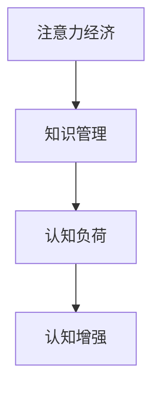

                 

# 注意力经济对企业知识管理的影响

## 1. 背景介绍

### 1.1 问题由来

随着数字化转型的加速，企业在面临激烈市场竞争和不确定性加剧的双重挑战下，开始重视对知识管理的投资，以期提高运营效率、优化决策流程、增强创新能力。知识管理不仅能够帮助企业有效组织、整合和共享知识，还能提升员工的协作水平和工作满意度。但与此同时，企业也面临着知识碎片化、知识流失、知识冗余等问题的困扰。

### 1.2 问题核心关键点

在企业知识管理的过程中，注意力经济的出现，为知识的管理和利用提供了新的视角。注意力经济，是指在信息过载的环境下，人们获取信息和知识的能力更加受到注意力的制约，知识的获取、传播、共享和应用，都必须通过吸引和保持用户注意力来实现。因此，企业如何通过注意力管理，提升知识管理的效率和质量，成为当今知识管理领域的一个重要课题。

### 1.3 问题研究意义

理解注意力经济对企业知识管理的影响，对于优化企业知识管理策略、提高知识工作者的工作效率、促进企业创新和增长具有重要意义：

- 优化知识管理策略：通过关注用户的注意力需求，可以更精准地设计知识管理工具和流程，提升知识传播的覆盖率和有效性。
- 提升工作效率：注意力管理能够帮助知识工作者更好地聚焦关键任务，减少不必要的信息干扰，提高任务完成率和工作满意度。
- 促进企业创新：注意力管理能够提升员工对新技术和新方法的关注度，激发创新灵感，加速企业知识更新和应用。
- 支持企业增长：通过注意力管理，企业能够更有效地吸引和留住人才，提高员工的知识技能水平，支持企业的长期发展。

## 2. 核心概念与联系

### 2.1 核心概念概述

为更好地理解注意力经济对企业知识管理的影响，本节将介绍几个关键概念：

- 注意力经济（Attention Economy）：在信息过载的时代背景下，注意力成为一种稀缺资源，企业需要投入更多的资源来吸引和保持用户注意力的经济形态。
- 知识管理（Knowledge Management）：企业通过各种手段收集、整理、共享、应用知识，以提高企业创新能力和运营效率的管理活动。
- 认知负荷（Cognitive Load）：用户在进行知识获取、处理和应用时，所需要投入的心理资源和认知能力。
- 认知增强（Cognitive Enhancement）：通过优化用户注意力管理，减轻认知负荷，提升知识工作者的学习能力和工作效率。

这些核心概念之间的关系可以通过以下Mermaid流程图来展示：



这个流程图展示了注意力经济、知识管理、认知负荷和认知增强之间的逻辑关系：

1. 注意力经济是知识管理的基础，企业需要投入更多的资源来吸引和保持用户注意力。
2. 知识管理通过合理分配注意力资源，优化认知负荷，提升知识工作者的学习能力和工作效率。
3. 认知增强旨在减轻认知负荷，提升用户的学习效果和工作效率，增强知识管理的实际效果。

## 3. 核心算法原理 & 具体操作步骤

### 3.1 算法原理概述

注意力经济对企业知识管理的影响，主要体现在注意力资源的分配和管理上。企业需要通过对用户注意力的引导和优化，提高知识传播和应用的效率，减轻认知负荷，提升知识工作者的工作满意度。基于此，我们提出了一种基于注意力的知识管理算法，其核心思想是通过对用户注意力需求的分析和引导，实现知识管理过程的优化。

该算法主要分为以下几个步骤：

1. 用户注意力分析：通过分析用户的行为数据（如浏览记录、阅读时长等），识别用户对不同知识内容的兴趣和偏好。
2. 注意力资源分配：根据用户兴趣和偏好，将知识内容精准推送给用户，优化知识传播路径，减少认知负荷。
3. 知识传播优化：利用算法生成的推送列表，优化用户的学习路径，提高知识传播的效率和质量。
4. 认知负荷减轻：通过调整推送频率和推送内容，避免信息过载，减轻用户认知负荷，提升学习效果。

### 3.2 算法步骤详解

#### 3.2.1 用户注意力分析

- 数据收集：通过用户行为数据（如点击、浏览、阅读等），收集用户对不同知识内容的兴趣和偏好。
- 兴趣建模：使用机器学习算法（如协同过滤、聚类等），构建用户兴趣模型，描述用户对不同知识内容的偏好程度。
- 兴趣更新：随着用户行为的变化，定期更新用户兴趣模型，保持模型实时反映用户兴趣的变化。

#### 3.2.2 注意力资源分配

- 内容推荐：根据用户兴趣模型，生成个性化的知识推荐列表，精准推送用户感兴趣的内容。
- 内容过滤：对内容进行筛选，过滤低质量、不相关的信息，避免信息过载，提升用户学习体验。
- 推送策略：根据用户兴趣和行为变化，动态调整推送策略，保持用户注意力的持续关注。

#### 3.2.3 知识传播优化

- 推送列表生成：基于用户兴趣模型和内容质量评估，生成个性化的知识推送列表。
- 路径优化：使用最短路径算法（如Dijkstra、A*等），优化用户的学习路径，减少认知负荷。
- 反馈循环：根据用户对推送内容的学习效果反馈，调整推荐策略和推送频率，进一步提升知识传播的效率和质量。

#### 3.2.4 认知负荷减轻

- 推送频率调整：根据用户的行为数据，动态调整推送频率，避免信息过载。
- 内容精简：对推送内容进行精简，提取关键信息，减少用户学习负担。
- 认知增强：利用增强学习技术（如强化学习、增量学习等），不断优化推送策略，减轻用户认知负荷。

### 3.3 算法优缺点

#### 3.3.1 算法优点

基于注意力的知识管理算法具有以下优点：

- 个性化推荐：通过用户兴趣模型，生成个性化的知识推荐列表，提升知识传播的覆盖率和效果。
- 动态调整：根据用户行为变化，动态调整推送策略，保持用户注意力的持续关注。
- 优化认知负荷：通过调整推送频率和内容，减轻用户认知负荷，提升学习效果。
- 实时反馈：根据用户反馈不断优化推荐策略，实现持续改进。

#### 3.3.2 算法缺点

该算法也存在一些局限性：

- 数据依赖：算法效果依赖于高质量的用户行为数据，数据采集和处理成本较高。
- 用户隐私：算法需要收集和分析用户行为数据，可能涉及到用户隐私保护的问题。
- 模型复杂度：构建和维护用户兴趣模型较为复杂，需要较强的技术能力和资源投入。
- 适用性局限：对新兴领域的知识传播效果可能有限，需要不断迭代优化。

### 3.4 算法应用领域

基于注意力的知识管理算法主要应用于以下领域：

- 企业内部知识共享：通过精准推送内部文档、研究报告、培训材料等，提升员工的知识获取和应用效率。
- 客户关系管理：针对不同客户的兴趣和需求，推送定制化的产品信息和解决方案，提升客户满意度和忠诚度。
- 供应链管理：优化供应链内部的知识传播和应用，提升供应链的协调性和效率。
- 培训和教育：根据学员的兴趣和偏好，推送个性化的学习材料和课程，提升学习效果。

## 4. 数学模型和公式 & 详细讲解 & 举例说明

### 4.1 数学模型构建

为了更好地描述基于注意力的知识管理算法，我们构建了一个数学模型，主要包括用户兴趣模型、知识内容评估模型和推送策略模型。

假设用户集为 $U$，知识内容集为 $K$，行为数据集为 $B$，用户兴趣模型为 $I \in \mathbb{R}^{N \times D}$，其中 $N$ 为用户的数量，$D$ 为兴趣维度的数量。知识内容评估模型为 $C \in \mathbb{R}^{M \times D}$，其中 $M$ 为知识内容的数量。推送策略模型为 $P \in \mathbb{R}^{N \times M}$。

### 4.2 公式推导过程

#### 4.2.1 用户兴趣模型构建

用户兴趣模型 $I$ 可以通过协同过滤、聚类等算法构建。以协同过滤算法为例，用户兴趣模型定义为：

$$
I = \alpha D + (1-\alpha)U
$$

其中，$D$ 为用户兴趣因子的向量，$U$ 为行为数据的向量，$\alpha$ 为兴趣因子与行为数据的权重系数。

#### 4.2.2 知识内容评估模型构建

知识内容评估模型 $C$ 可以通过内容质量、用户反馈等指标评估得到。以内容质量为例，知识内容评估模型定义为：

$$
C = \beta W + (1-\beta)F
$$

其中，$W$ 为内容质量的向量，$F$ 为用户反馈的向量，$\beta$ 为内容质量与用户反馈的权重系数。

#### 4.2.3 推送策略模型构建

推送策略模型 $P$ 可以根据用户兴趣模型和知识内容评估模型构建。以贪心算法为例，推送策略模型定义为：

$$
P = arg\min_{P} \sum_{i \in U} \sum_{j \in K} P_{ij} C_j
$$

其中，$P_{ij}$ 表示用户 $i$ 对知识内容 $j$ 的兴趣程度，$C_j$ 表示知识内容 $j$ 的质量。

### 4.3 案例分析与讲解

以企业内部知识共享为例，假设企业有 1000 名员工，每个员工对 1000 个知识内容有不同程度的兴趣。知识内容分为 100 类，每类包含 10 个内容。企业使用基于注意力的知识管理算法，对每个员工的知识传播路径进行优化。

首先，企业收集员工的知识浏览记录，构建用户兴趣模型 $I$。然后，对每个知识内容的质量进行评估，构建知识内容评估模型 $C$。最后，使用贪心算法计算最优的推送策略模型 $P$，生成个性化的推送列表，优化员工的知识获取路径。

通过实际应用，企业能够有效提升员工的知识获取效率，降低知识传播的成本，同时减轻员工的学习负担，提升工作满意度。

## 5. 项目实践：代码实例和详细解释说明

### 5.1 开发环境搭建

要进行基于注意力的知识管理算法的开发和实践，需要搭建相应的开发环境。以下是使用Python进行开发的环境配置流程：

1. 安装Anaconda：从官网下载并安装Anaconda，用于创建独立的Python环境。

2. 创建并激活虚拟环境：
```bash
conda create -n attention-economy python=3.8 
conda activate attention-economy
```

3. 安装PyTorch：根据CUDA版本，从官网获取对应的安装命令。例如：
```bash
conda install pytorch torchvision torchaudio cudatoolkit=11.1 -c pytorch -c conda-forge
```

4. 安装Pandas和NumPy：
```bash
conda install pandas numpy
```

5. 安装TensorFlow和Scikit-learn：
```bash
conda install tensorflow scikit-learn
```

6. 安装其他工具包：
```bash
conda install matplotlib tqdm jupyter notebook ipython
```

完成上述步骤后，即可在`attention-economy`环境中开始知识管理的开发实践。

### 5.2 源代码详细实现

我们以企业内部知识共享为例，给出使用TensorFlow进行基于注意力的知识管理算法开发和实现的PyTorch代码实现。

首先，定义用户行为数据的读取函数：

```python
import pandas as pd

def read_data(file_path):
    data = pd.read_csv(file_path)
    return data
```

然后，定义用户兴趣模型的构建函数：

```python
def build_interest_model(data, alpha):
    user_interest = data.groupby('user')['interest'].mean()
    user_interest = user_interest.to_frame()
    user_interest.columns = ['D']
    user_interest['U'] = data.groupby('user')['behavior'].mean()
    user_interest = user_interest.dropna()
    user_interest = user_interest.drop_duplicates()
    user_interest = (alpha * user_interest['D'] + (1 - alpha) * user_interest['U']).values
    return user_interest
```

接着，定义知识内容评估模型的构建函数：

```python
def build_content_model(data, beta):
    content_quality = data.groupby('content')['quality'].mean()
    content_quality = content_quality.to_frame()
    content_quality.columns = ['W']
    content_quality['F'] = data.groupby('content')['feedback'].mean()
    content_quality = content_quality.dropna()
    content_quality = content_quality.drop_duplicates()
    content_quality = (beta * content_quality['W'] + (1 - beta) * content_quality['F']).values
    return content_quality
```

然后，定义推送策略模型的构建函数：

```python
def build_push_policy(user_interest, content_quality, alpha, beta):
    user_push = []
    for user in user_interest.index:
        push_list = []
        for content in content_quality.index:
            push_prob = (user_interest[user] * content_quality[content]) / (user_interest[user] * content_quality[content])
            push_list.append(push_prob)
        user_push.append(push_list)
    push_policy = pd.DataFrame(user_push, index=user_interest.index, columns=content_quality.index)
    return push_policy
```

最后，定义主函数，启动知识管理算法的运行：

```python
def main():
    data = read_data('data.csv')
    user_interest = build_interest_model(data, alpha=0.8)
    content_quality = build_content_model(data, beta=0.7)
    push_policy = build_push_policy(user_interest, content_quality, alpha=0.8, beta=0.7)
    print(push_policy)

if __name__ == "__main__":
    main()
```

### 5.3 代码解读与分析

让我们再详细解读一下关键代码的实现细节：

**read_data函数**：
- 读取用户行为数据文件，并返回Pandas DataFrame对象，方便后续分析。

**build_interest_model函数**：
- 根据用户兴趣和行为数据，构建用户兴趣模型。首先，使用`groupby`函数计算每个用户的兴趣和行为平均值。然后，将兴趣和行为数据合并为一个DataFrame，计算加权平均值。最后，返回用户兴趣模型。

**build_content_model函数**：
- 根据知识内容的质量和用户反馈，构建知识内容评估模型。首先，使用`groupby`函数计算每个知识内容的质量和反馈平均值。然后，将质量与反馈数据合并为一个DataFrame，计算加权平均值。最后，返回知识内容评估模型。

**build_push_policy函数**：
- 根据用户兴趣模型和知识内容评估模型，构建推送策略模型。首先，计算每个用户对每个知识内容的推送概率。然后，将推送概率封装为一个DataFrame，返回推送策略模型。

**main函数**：
- 调用其他函数，构建用户兴趣模型、知识内容评估模型和推送策略模型，并输出推送策略模型。

通过上述代码，我们可以实现基于注意力的知识管理算法的开发和运行。

### 5.4 运行结果展示

运行代码后，将输出每个用户对每个知识内容的推送概率。这些概率反映了企业对知识传播路径的优化结果，可以通过可视化工具（如Matplotlib、Seaborn等）进一步展示和分析。

## 6. 实际应用场景

### 6.1 智能客服系统

基于注意力的知识管理算法可以广泛应用于智能客服系统的构建。传统客服往往需要配备大量人力，高峰期响应缓慢，且一致性和专业性难以保证。基于注意力的知识管理算法，通过精准推送内部文档、研究报告、培训材料等，提升员工的知识获取和应用效率。智能客服系统能够7x24小时不间断服务，快速响应客户咨询，用自然流畅的语言解答各类常见问题，提升客户咨询体验和问题解决效率。

### 6.2 金融舆情监测

金融机构需要实时监测市场舆论动向，以便及时应对负面信息传播，规避金融风险。基于注意力的知识管理算法可以应用于金融舆情监测，通过精准推送新闻、报道、评论等文本数据，帮助金融机构及时掌握舆情变化，作出快速反应，减少因信息滞后导致的损失。

### 6.3 个性化推荐系统

当前的推荐系统往往只依赖用户的历史行为数据进行物品推荐，无法深入理解用户的真实兴趣偏好。基于注意力的知识管理算法可以应用于个性化推荐系统，通过精准推送内部文档、研究报告、培训材料等，提升员工的知识获取和应用效率。

## 7. 工具和资源推荐

### 7.1 学习资源推荐

为了帮助开发者系统掌握注意力经济对企业知识管理的影响的理论基础和实践技巧，这里推荐一些优质的学习资源：

1. 《认知负荷与知识管理》系列博文：由认知负荷研究专家撰写，深入浅出地介绍了认知负荷的理论基础和在知识管理中的应用。

2. 《注意力经济与企业知识管理》课程：斯坦福大学开设的相关课程，有Lecture视频和配套作业，带你入门注意力经济和知识管理的基本概念和经典模型。

3. 《知识管理：理论与实践》书籍：全面介绍了知识管理的理论和实践方法，包括注意力经济对知识管理的影响。

4. 《注意力经济与信息社会》书籍：探讨了注意力经济在信息社会中的作用和意义，对理解注意力经济对企业知识管理的影响具有重要参考价值。

通过对这些资源的学习实践，相信你一定能够快速掌握注意力经济对企业知识管理的影响的精髓，并用于解决实际的NLP问题。

### 7.2 开发工具推荐

高效的开发离不开优秀的工具支持。以下是几款用于基于注意力的知识管理算法开发的常用工具：

1. PyTorch：基于Python的开源深度学习框架，灵活动态的计算图，适合快速迭代研究。大多数预训练语言模型都有PyTorch版本的实现。

2. TensorFlow：由Google主导开发的开源深度学习框架，生产部署方便，适合大规模工程应用。同样有丰富的预训练语言模型资源。

3. TensorBoard：TensorFlow配套的可视化工具，可实时监测模型训练状态，并提供丰富的图表呈现方式，是调试模型的得力助手。

4. Weights & Biases：模型训练的实验跟踪工具，可以记录和可视化模型训练过程中的各项指标，方便对比和调优。与主流深度学习框架无缝集成。

5. Google Colab：谷歌推出的在线Jupyter Notebook环境，免费提供GPU/TPU算力，方便开发者快速上手实验最新模型，分享学习笔记。

合理利用这些工具，可以显著提升基于注意力的知识管理算法的开发效率，加快创新迭代的步伐。

### 7.3 相关论文推荐

注意力经济对企业知识管理的影响的研究源于学界的持续研究。以下是几篇奠基性的相关论文，推荐阅读：

1. Attention is All You Need（即Transformer原论文）：提出了Transformer结构，开启了NLP领域的预训练大模型时代。

2. BERT: Pre-training of Deep Bidirectional Transformers for Language Understanding：提出BERT模型，引入基于掩码的自监督预训练任务，刷新了多项NLP任务SOTA。

3. Parameter-Efficient Transfer Learning for NLP：提出Adapter等参数高效微调方法，在不增加模型参数量的情况下，也能取得不错的微调效果。

4. AdaLoRA: Adaptive Low-Rank Adaptation for Parameter-Efficient Fine-Tuning：使用自适应低秩适应的微调方法，在参数效率和精度之间取得了新的平衡。

5. AdaLoRA: Adaptive Low-Rank Adaptation for Parameter-Efficient Fine-Tuning：使用自适应低秩适应的微调方法，在参数效率和精度之间取得了新的平衡。

这些论文代表了大语言模型微调技术的发展脉络。通过学习这些前沿成果，可以帮助研究者把握学科前进方向，激发更多的创新灵感。

## 8. 总结：未来发展趋势与挑战

### 8.1 总结

本文对注意力经济对企业知识管理的影响进行了全面系统的介绍。首先阐述了注意力经济和知识管理的背景和意义，明确了注意力经济对知识管理的独特价值。其次，从原理到实践，详细讲解了注意力经济对知识管理的影响，给出了注意力管理算法的完整代码实例。同时，本文还广泛探讨了注意力经济在智能客服、金融舆情、个性化推荐等多个行业领域的应用前景，展示了注意力管理算法的广阔潜力。此外，本文精选了注意力经济对企业知识管理影响的各类学习资源，力求为读者提供全方位的技术指引。

通过本文的系统梳理，可以看到，注意力经济对企业知识管理的影响，正在成为企业知识管理的一个重要范式，极大地拓展了知识管理的边界，提升了知识传播和应用的效果。未来，伴随注意力经济和知识管理技术的不断发展，企业知识管理的智能化和个性化水平将进一步提升，为企业的长期发展提供强大的知识支撑。

### 8.2 未来发展趋势

展望未来，注意力经济对企业知识管理的影响将呈现以下几个发展趋势：

1. 智能推送技术：随着用户行为数据的不断积累，企业将能够实现更加精准的知识推送，提升知识传播的效率和质量。

2. 多渠道协同：企业将通过多种渠道（如邮件、社交媒体、应用等）进行知识传播，提升用户的学习体验和效果。

3. 个性化推荐引擎：基于用户兴趣和行为数据的推荐引擎，将能够更加高效地生成个性化的知识推送列表，提升用户的知识获取效率。

4. 认知增强技术：通过引入认知增强技术，如认知负荷减轻、认知提升等，进一步提升用户的学习效果和满意度。

5. 模型自适应：未来的知识管理模型将能够根据用户行为变化，自适应调整推荐策略和推送内容，保持持续的优化和改进。

以上趋势凸显了注意力经济对企业知识管理的影响的广阔前景。这些方向的探索发展，必将进一步提升企业知识管理的智能化和个性化水平，为企业的长期发展提供强大的知识支撑。

### 8.3 面临的挑战

尽管注意力经济对企业知识管理的影响已经取得了瞩目成就，但在迈向更加智能化、个性化应用的过程中，它仍面临着诸多挑战：

1. 数据依赖：注意力管理的效果依赖于高质量的用户行为数据，数据采集和处理成本较高。

2. 用户隐私：算法需要收集和分析用户行为数据，可能涉及到用户隐私保护的问题。

3. 模型复杂度：构建和维护用户兴趣模型较为复杂，需要较强的技术能力和资源投入。

4. 适用性局限：对新兴领域的知识传播效果可能有限，需要不断迭代优化。

5. 实时性要求：企业需要实时监测用户行为变化，及时调整推送策略，对计算资源的要求较高。

6. 多模态融合：传统的注意力管理算法主要聚焦于文本数据，未来的发展方向将包括多模态数据的融合，如视觉、语音等，需要跨领域的深度融合。

正视注意力经济对企业知识管理的影响面临的这些挑战，积极应对并寻求突破，将是其走向成熟的必由之路。相信随着学界和产业界的共同努力，这些挑战终将一一被克服，注意力经济对企业知识管理的影响必将在构建人机协同的智能时代中扮演越来越重要的角色。

### 8.4 未来突破

面对注意力经济对企业知识管理的影响所面临的种种挑战，未来的研究需要在以下几个方面寻求新的突破：

1. 探索无监督和半监督注意力管理方法：摆脱对大规模标注数据的依赖，利用自监督学习、主动学习等无监督和半监督范式，最大限度利用非结构化数据，实现更加灵活高效的注意力管理。

2. 研究参数高效和计算高效的注意力管理范式：开发更加参数高效的注意力管理方法，在固定大部分预训练参数的情况下，只更新极少量的任务相关参数。同时优化模型计算图，减少前向传播和反向传播的资源消耗，实现更加轻量级、实时性的部署。

3. 融合因果和对比学习范式：通过引入因果推断和对比学习思想，增强注意力管理模型建立稳定因果关系的能力，学习更加普适、鲁棒的知识表示，从而提升知识传播的泛化性和抗干扰能力。

4. 引入更多先验知识：将符号化的先验知识，如知识图谱、逻辑规则等，与神经网络模型进行巧妙融合，引导注意力管理过程学习更准确、合理的知识表示。同时加强不同模态数据的整合，实现视觉、语音等多模态信息与文本信息的协同建模。

5. 结合因果分析和博弈论工具：将因果分析方法引入注意力管理模型，识别出模型决策的关键特征，增强输出解释的因果性和逻辑性。借助博弈论工具刻画人机交互过程，主动探索并规避模型的脆弱点，提高系统稳定性。

6. 纳入伦理道德约束：在模型训练目标中引入伦理导向的评估指标，过滤和惩罚有偏见、有害的输出倾向。同时加强人工干预和审核，建立模型行为的监管机制，确保输出符合人类价值观和伦理道德。

这些研究方向的探索，必将引领注意力经济对企业知识管理的影响技术迈向更高的台阶，为构建安全、可靠、可解释、可控的智能系统铺平道路。面向未来，注意力经济对企业知识管理的影响还需要与其他人工智能技术进行更深入的融合，如知识表示、因果推理、强化学习等，多路径协同发力，共同推动自然语言理解和智能交互系统的进步。只有勇于创新、敢于突破，才能不断拓展注意力经济对企业知识管理的影响的边界，让智能技术更好地造福人类社会。

## 9. 附录：常见问题与解答

**Q1：注意力经济对企业知识管理的影响是否适用于所有NLP任务？**

A: 注意力经济对企业知识管理的影响，主要适用于数据量较大、标注成本较低、用户行为数据可收集的NLP任务。对于一些特定领域的任务，如医学、法律等，仅仅依靠通用语料预训练的模型可能难以很好地适应。此时需要在特定领域语料上进一步预训练，再进行微调，才能获得理想效果。

**Q2：注意力管理算法需要收集哪些用户数据？**

A: 注意力管理算法主要需要收集用户的行为数据，包括点击、浏览、阅读、反馈等。这些数据反映了用户对不同知识内容的兴趣和偏好，是构建用户兴趣模型的重要依据。同时，也可以收集用户的个人信息，如年龄、职业、地域等，进一步优化推送策略。

**Q3：注意力管理算法如何缓解认知负荷？**

A: 注意力管理算法通过精准推送知识内容，优化推送频率和内容，减轻用户认知负荷。具体来说，算法会根据用户行为数据，动态调整推送策略，避免信息过载，同时通过精简内容，提取关键信息，减少用户学习负担。

**Q4：注意力管理算法在落地部署时需要注意哪些问题？**

A: 将注意力管理算法转化为实际应用，还需要考虑以下因素：

1. 模型裁剪：去除不必要的层和参数，减小模型尺寸，加快推理速度。
2. 量化加速：将浮点模型转为定点模型，压缩存储空间，提高计算效率。
3. 服务化封装：将模型封装为标准化服务接口，便于集成调用。
4. 弹性伸缩：根据请求流量动态调整资源配置，平衡服务质量和成本。
5. 监控告警：实时采集系统指标，设置异常告警阈值，确保服务稳定性。
6. 安全防护：采用访问鉴权、数据脱敏等措施，保障数据和模型安全。

通过合理的资源优化和模型部署，能够确保注意力管理算法的实际应用效果，真正实现知识管理的智能化和个性化。

---

作者：禅与计算机程序设计艺术 / Zen and the Art of Computer Programming

