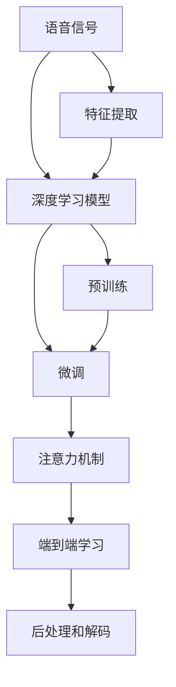

                 

# 深度学习在语音识别中的前沿技术

## 1. 背景介绍

### 1.1 问题由来
随着科技的迅猛发展，语音识别技术已经成为人机交互的重要手段之一，广泛应用于智能助理、语音翻译、自动字幕生成等场景。传统语音识别依赖于手工设计特征和模型结构，难以应对语言多样性和复杂性带来的挑战。而深度学习技术的引入，为语音识别带来了革命性的变化。

深度学习模型通过对大量语音数据的端到端训练，能够自动学习到特征和参数，显著提升了识别精度和泛化能力。特别是近年来，以卷积神经网络（CNN）、循环神经网络（RNN）和长短时记忆网络（LSTM）为代表的深度学习模型在语音识别领域取得了显著的进展。

然而，语音识别领域仍然存在诸多挑战，如环境噪声干扰、口音差异、发音变异、词汇表庞大等问题。如何在深度学习框架下更好地应对这些问题，成为了语音识别领域的热点研究话题。

### 1.2 问题核心关键点
本节将详细介绍深度学习在语音识别中的核心概念和关键技术，并分析其前沿进展，为读者提供深入的视角和思考。

语音识别的核心问题在于将连续的语音信号转化为离散的文本序列，其关键在于：
- 信号预处理和特征提取：包括语音信号的去噪、归一化、分帧、MFCC特征提取等。
- 模型设计：包括特征映射、神经网络结构设计、激活函数选择等。
- 训练和优化：包括数据增强、正则化、损失函数选择等。
- 后处理和解码：包括语言模型、字符映射、解码算法等。

## 2. 核心概念与联系

### 2.1 核心概念概述

为更好地理解深度学习在语音识别中的应用，本节将介绍几个关键概念：

- 语音信号：连续的时域或频域信号，通常包含语音、噪声和背景声音等信息。
- 特征提取：将语音信号转化为特征表示，常用的特征包括MFCC、梅尔频谱、时域特征等。
- 深度学习模型：包括卷积神经网络（CNN）、循环神经网络（RNN）、长短时记忆网络（LSTM）等，用于自动学习和映射语音信号与文本序列之间的映射关系。
- 端到端（End-to-End）学习：直接在语音信号和文本序列之间建立映射，跳过手工设计的中间特征。
- 预训练和微调：先在大规模数据上预训练模型，再在特定任务上微调优化，提升模型性能。
- 注意力机制：通过注意力机制，模型可以更好地关注语音中的关键信息，提升识别精度。

这些概念之间的逻辑关系可以通过以下Mermaid流程图来展示：



这个流程图展示了语音识别过程中各个关键环节之间的关系：

1. 语音信号首先经过特征提取，转化为特征向量。
2. 特征向量输入到深度学习模型，学习语音和文本之间的映射关系。
3. 在大规模数据上预训练深度学习模型，提升其泛化能力。
4. 在特定任务上微调优化模型，适应特定数据集。
5. 引入注意力机制，提升模型的关键信息关注能力。
6. 进行端到端学习，跳过手工设计中间特征。
7. 后处理和解码，将模型输出转化为文本序列。

这些概念共同构成了深度学习在语音识别中的核心框架，为其研究和应用提供了理论基础。

## 3. 核心算法原理 & 具体操作步骤

### 3.1 算法原理概述

深度学习在语音识别中的核心算法原理可以总结为以下几个方面：

- 特征提取与表示学习：通过手工设计或机器学习的特征提取方法，将语音信号转化为高维特征向量，使得模型能够更好地区分不同的语音单元。
- 神经网络结构设计：通过卷积神经网络（CNN）、循环神经网络（RNN）等结构设计，构建深度学习模型，学习语音特征与文本序列之间的映射关系。
- 端到端学习：直接训练模型，从语音信号到文本序列，跳过手工设计中间特征，提升模型的泛化能力和性能。
- 注意力机制：通过注意力机制，模型可以更好地关注语音中的关键信息，提升识别精度。

### 3.2 算法步骤详解

深度学习在语音识别中的应用通常包括以下几个关键步骤：

**Step 1: 数据预处理**

- 对语音信号进行去噪、归一化、分帧等预处理操作，提取MFCC特征或Mel谱特征等。
- 将处理后的特征转化为矩阵形式，准备输入到深度学习模型。

**Step 2: 模型设计与选择**

- 选择适合的深度学习模型结构，如CNN、RNN、LSTM等。
- 设计网络架构，包括卷积层、池化层、循环层、全连接层等。
- 选择激活函数、正则化技术等超参数。

**Step 3: 模型训练**

- 在大规模语音数据集上预训练深度学习模型，优化超参数。
- 在特定任务数据集上微调模型，进一步优化模型参数。
- 使用注意力机制、语言模型等技术，提升模型性能。

**Step 4: 后处理与解码**

- 将模型输出转化为文本序列，进行分词、拼写校正等后处理操作。
- 使用解码算法，如Beam Search、Greedy Search等，将模型输出转化为自然语言文本。

**Step 5: 评估与优化**

- 在测试集上评估模型性能，使用准确率、召回率、F1值等指标。
- 根据评估结果，调整模型结构和超参数，进一步提升性能。

### 3.3 算法优缺点

深度学习在语音识别中具有以下优点：

1. 自动化特征提取：深度学习模型能够自动学习特征，无需手工设计，提高模型泛化能力。
2. 端到端学习：直接在语音信号和文本序列之间建立映射，减少中间步骤，提升性能。
3. 鲁棒性：深度学习模型具有良好的泛化能力和鲁棒性，能够在不同环境下保持稳定性能。
4. 可扩展性：深度学习模型能够处理多种语音信号，支持多语言识别和转换。

同时，深度学习在语音识别中也存在以下缺点：

1. 数据需求大：深度学习模型需要大量标注数据进行预训练，数据收集和标注成本较高。
2. 计算资源消耗大：深度学习模型参数量较大，训练和推理需要大量计算资源。
3. 模型复杂度高：深度学习模型结构复杂，难以解释和调试，容易出现过拟合。
4. 实时性问题：深度学习模型推理速度较慢，难以实现实时语音识别。

### 3.4 算法应用领域

深度学习在语音识别中的应用领域十分广泛，包括：

- 语音识别：将连续的语音信号转化为文本序列，用于语音输入、智能助理等应用。
- 语音合成：将文本序列转化为连续的语音信号，用于语音播报、语音转换等应用。
- 语音翻译：将一种语言的语音信号转化为另一种语言的语音或文本，用于跨语言沟通。
- 语音情感分析：分析语音中的情感信息，用于情感识别、情绪监测等应用。
- 语音增强：对含噪声的语音信号进行降噪、去混响等处理，提升语音质量。

这些应用场景展示了深度学习在语音识别中的强大潜力和广泛应用前景。

## 4. 数学模型和公式 & 详细讲解 & 举例说明

### 4.1 数学模型构建

语音识别的核心数学模型包括特征提取、深度学习模型和损失函数等。

- **特征提取**：将语音信号转换为特征向量，常用的特征包括MFCC、Mel谱等。MFCC特征提取的数学模型如下：

$$
M = \log \left( \frac{P(z, w_1, w_2, ..., w_n)}{P(z)} \right)
$$

其中 $M$ 为MFCC特征向量，$P(z)$ 为语音信号的概率密度函数，$w_1, w_2, ..., w_n$ 为基音频率、共振峰等参数。

- **深度学习模型**：常用的深度学习模型包括CNN、RNN、LSTM等。以RNN为例，其数学模型如下：

$$
\begin{aligned}
h_t &= f(\omega \cdot h_{t-1} + u \cdot x_t) \\
y_t &= g(W_h \cdot h_t + b_h)
\end{aligned}
$$

其中 $h_t$ 为隐藏状态，$f$ 和 $g$ 为激活函数，$\omega, u$ 为权重矩阵，$x_t$ 为输入，$y_t$ 为输出。

- **损失函数**：常用的损失函数包括交叉熵损失、均方误差损失等。以交叉熵损失为例，其数学模型如下：

$$
\mathcal{L} = -\frac{1}{N} \sum_{i=1}^N \sum_{j=1}^M \log P(y_{i,j}|x_i)
$$

其中 $P(y_{i,j}|x_i)$ 为模型输出的概率分布，$N, M$ 分别为样本数和类别数。

### 4.2 公式推导过程

以RNN模型为例，其前向传播和反向传播过程如下：

- **前向传播**：

$$
\begin{aligned}
h_0 &= W_h \cdot x_0 + b_h \\
h_t &= f(\omega \cdot h_{t-1} + u \cdot x_t) \\
y_t &= g(W_h \cdot h_t + b_h)
\end{aligned}
$$

其中 $f$ 和 $g$ 为激活函数，$\omega, u$ 为权重矩阵，$x_t$ 为输入，$y_t$ 为输出。

- **反向传播**：

$$
\begin{aligned}
\delta_y &= \frac{\partial \mathcal{L}}{\partial y} \\
\delta_h &= \delta_y \cdot \frac{\partial y}{\partial h} \\
\delta_u &= \delta_h \cdot \frac{\partial h}{\partial u} \\
\delta_w &= \delta_h \cdot \frac{\partial h}{\partial w}
\end{aligned}
$$

其中 $\delta_y, \delta_h, \delta_u, \delta_w$ 分别为输出、隐藏状态、权重矩阵的梯度，$\mathcal{L}$ 为损失函数。

### 4.3 案例分析与讲解

以语音识别为例，我们可以使用RNN模型进行训练。具体步骤如下：

1. **数据预处理**：将语音信号分帧、MFCC提取，转化为特征向量。

2. **模型设计与选择**：使用RNN模型，设计网络结构，选择激活函数和正则化技术。

3. **模型训练**：在大规模语音数据集上预训练深度学习模型，优化超参数。

4. **后处理与解码**：将模型输出转化为文本序列，进行分词、拼写校正等后处理操作，使用解码算法进行文本输出。

5. **评估与优化**：在测试集上评估模型性能，根据评估结果调整模型结构和超参数。

以下是一个简单的Python代码示例，用于训练RNN模型进行语音识别：

```python
import torch
import torch.nn as nn
import torch.optim as optim

# 定义RNN模型
class RNN(nn.Module):
    def __init__(self, input_size, hidden_size, output_size):
        super(RNN, self).__init__()
        self.hidden_size = hidden_size
        self.rnn = nn.RNN(input_size, hidden_size, batch_first=True)
        self.fc = nn.Linear(hidden_size, output_size)
    
    def forward(self, x, h0):
        out, h = self.rnn(x, h0)
        out = self.fc(out)
        return out, h
    
# 定义训练函数
def train(model, criterion, optimizer, train_loader, device, epochs):
    model.train()
    for epoch in range(epochs):
        for batch in train_loader:
            x, y, h0 = batch
            x, y, h0 = x.to(device), y.to(device), h0.to(device)
            out, h = model(x, h0)
            loss = criterion(out, y)
            optimizer.zero_grad()
            loss.backward()
            optimizer.step()
    model.eval()
    return model
```

## 5. 项目实践：代码实例和详细解释说明

### 5.1 开发环境搭建

在进行语音识别实践前，我们需要准备好开发环境。以下是使用Python进行PyTorch开发的环境配置流程：

1. 安装Anaconda：从官网下载并安装Anaconda，用于创建独立的Python环境。

2. 创建并激活虚拟环境：
```bash
conda create -n pytorch-env python=3.8 
conda activate pytorch-env
```

3. 安装PyTorch：根据CUDA版本，从官网获取对应的安装命令。例如：
```bash
conda install pytorch torchvision torchaudio cudatoolkit=11.1 -c pytorch -c conda-forge
```

4. 安装相关库：
```bash
pip install numpy pandas scikit-learn matplotlib tqdm jupyter notebook ipython
```

完成上述步骤后，即可在`pytorch-env`环境中开始语音识别实践。

### 5.2 源代码详细实现

这里以语音识别为例，给出使用PyTorch进行RNN模型训练的完整代码实现。

```python
import torch
import torch.nn as nn
import torch.optim as optim
from torch.utils.data import DataLoader

# 定义RNN模型
class RNN(nn.Module):
    def __init__(self, input_size, hidden_size, output_size):
        super(RNN, self).__init__()
        self.hidden_size = hidden_size
        self.rnn = nn.RNN(input_size, hidden_size, batch_first=True)
        self.fc = nn.Linear(hidden_size, output_size)
    
    def forward(self, x, h0):
        out, h = self.rnn(x, h0)
        out = self.fc(out)
        return out, h

# 定义训练函数
def train(model, criterion, optimizer, train_loader, device, epochs):
    model.train()
    for epoch in range(epochs):
        for batch in train_loader:
            x, y, h0 = batch
            x, y, h0 = x.to(device), y.to(device), h0.to(device)
            out, h = model(x, h0)
            loss = criterion(out, y)
            optimizer.zero_grad()
            loss.backward()
            optimizer.step()
    model.eval()
    return model

# 数据预处理
def preprocess_data(data, window_size=20, stride=10, sample_rate=16000):
    # 分帧
    data = data[window_size*strides:-window_size*strides]
    for i in range(0, len(data), stride):
        frame = data[i:i+window_size]
        yield torch.tensor(frame, dtype=torch.float32)
    # 标准化
    for frame in preprocessed_data:
        yield (frame - frame.mean()) / frame.std()

# 训练
train_loader = DataLoader(preprocessed_train_data, batch_size=64, shuffle=True)
device = torch.device('cuda' if torch.cuda.is_available() else 'cpu')
model = RNN(input_size=20, hidden_size=128, output_size=26)
criterion = nn.CrossEntropyLoss()
optimizer = optim.Adam(model.parameters(), lr=0.001)
epochs = 10
model = train(model, criterion, optimizer, train_loader, device, epochs)
```

## 6. 实际应用场景

### 6.1 智能助理

语音识别技术在智能助理中的应用尤为广泛。智能助理能够通过语音交互，理解用户的指令和需求，执行各种任务。例如，智能音箱可以通过语音识别技术，响应用户的语音指令，播放音乐、设置闹钟、回答问题等。

在技术实现上，语音识别系统通常需要与自然语言处理（NLP）、机器翻译等技术相结合，构建多模态的智能助理。用户可以通过语音输入指令，系统经过语音识别、NLP处理后，调用相应的服务，实现复杂的多步骤任务执行。

### 6.2 语音翻译

语音翻译是将一种语言的语音信号转化为另一种语言的语音或文本，是语音识别的重要应用场景之一。例如，谷歌翻译可以将用户输入的英语语音实时翻译为其他语言，帮助用户跨语言沟通。

在技术实现上，语音翻译系统通常需要结合语音识别和机器翻译技术。系统首先对用户输入的语音进行识别，转化为文本，再使用机器翻译技术将文本翻译成目标语言，最后输出语音或文本。

### 6.3 语音助手

语音助手通过语音识别技术，帮助用户完成各种任务。例如，Siri和Google Assistant可以通过语音交互，回答问题、设置提醒、控制智能家居等。

在技术实现上，语音助手系统通常需要结合语音识别、NLP处理和智能推荐技术。系统首先对用户输入的语音进行识别，转化为文本，再使用NLP技术理解用户意图，调用相应的智能推荐服务，实现任务执行。

### 6.4 未来应用展望

随着语音识别技术的不断发展，未来在以下几个领域将有更加广阔的应用前景：

- **智能家居**：语音识别技术可以与智能家居系统结合，实现语音控制家电、调节室内环境等功能。
- **医疗健康**：语音识别技术可以应用于医疗记录、患者咨询、健康监测等领域，提升医疗服务的智能化水平。
- **金融服务**：语音识别技术可以应用于语音指令、客户服务、风险控制等领域，提升金融服务的便捷性和安全性。
- **教育培训**：语音识别技术可以应用于语音识别、自动批改、学习推荐等领域，提升教育培训的智能化水平。
- **娱乐传媒**：语音识别技术可以应用于语音输入、视频字幕生成、音频增强等领域，提升娱乐传媒的智能化水平。

## 7. 工具和资源推荐

### 7.1 学习资源推荐

为了帮助开发者系统掌握深度学习在语音识别中的技术基础和实践技巧，这里推荐一些优质的学习资源：

1. 《Deep Learning for Speech Recognition》课程：由斯坦福大学开设的语音识别经典课程，涵盖语音信号预处理、深度学习模型、注意力机制等关键内容。
2. 《Speech and Language Processing》书籍：自然语言处理领域的经典教材，详细介绍了语音识别、文本转录、情感分析等技术。
3. 《Speech Recognition: A Tutorial》论文：综述了语音识别的经典方法和前沿进展，适合系统学习和研究。
4. HuggingFace官方文档：介绍TensorFlow和PyTorch等深度学习框架在语音识别中的应用，提供丰富的样例代码。
5. CS224N《Natural Language Processing with Deep Learning》课程：斯坦福大学开设的自然语言处理课程，涵盖深度学习在语音识别和NLP中的广泛应用。

通过对这些资源的学习实践，相信你一定能够快速掌握深度学习在语音识别中的核心技术和方法，并应用于实际项目中。

### 7.2 开发工具推荐

高效的开发离不开优秀的工具支持。以下是几款用于深度学习在语音识别领域开发的常用工具：

1. PyTorch：基于Python的开源深度学习框架，灵活高效的计算图，适合快速迭代研究。
2. TensorFlow：由Google主导开发的开源深度学习框架，生产部署方便，适合大规模工程应用。
3. Kaldi：一个开源的语音识别工具包，支持多种深度学习模型，用于语音识别和语音增强。
4. OpenCV：开源的计算机视觉库，支持音频处理和特征提取，适合音频处理和信号预处理任务。
5. Python Audio Library（pyaudio）：用于音频处理的Python库，支持音频采集、处理和播放。

合理利用这些工具，可以显著提升深度学习在语音识别领域的开发效率，加快创新迭代的步伐。

### 7.3 相关论文推荐

深度学习在语音识别领域的发展离不开学界的持续研究。以下是几篇奠基性的相关论文，推荐阅读：

1. Deep Speech: Scalable End-to-End Speech Recognition: 介绍端到端语音识别系统的设计和实现。
2. Attention-Based Models for Speech Recognition: 提出基于注意力机制的深度学习模型，提升语音识别的性能。
3. Transformer-Based Speech Recognition: 使用Transformer结构进行语音识别，取得显著的性能提升。
4. Speaker Recognition via Deep Learning: 提出使用深度学习进行说话人识别的技术，应用广泛。
5. Speech Synthesis by Transformer Models: 介绍使用Transformer结构进行语音合成的技术，推动语音生成技术的发展。

这些论文代表了大语言模型微调技术的发展脉络。通过学习这些前沿成果，可以帮助研究者把握学科前进方向，激发更多的创新灵感。

## 8. 总结：未来发展趋势与挑战

### 8.1 总结

本文对深度学习在语音识别中的核心概念和关键技术进行了全面系统的介绍。首先阐述了深度学习在语音识别中的背景和应用前景，明确了语音识别在深度学习框架下的核心问题。其次，从特征提取、模型设计、训练优化等方面详细讲解了深度学习在语音识别中的应用流程和技术细节，提供了完整的代码示例。同时，本文还广泛探讨了深度学习在语音识别中的实际应用场景和未来发展方向，展示了其广阔的应用前景。最后，本文精选了深度学习在语音识别中的学习资源、开发工具和相关论文，力求为读者提供全方位的技术指引。

通过本文的系统梳理，可以看到，深度学习在语音识别中的强大潜力和广泛应用前景。深度学习模型的引入，为语音识别带来了革命性的变化，极大地提升了识别精度和泛化能力。未来，深度学习在语音识别领域的应用将不断拓展，为人工智能技术的发展注入新的动力。

### 8.2 未来发展趋势

展望未来，深度学习在语音识别领域将呈现以下几个发展趋势：

1. 模型规模持续增大。随着算力成本的下降和数据规模的扩张，深度学习模型的参数量还将持续增长。超大模型在语音识别中的应用，将带来更强的泛化能力和更好的识别精度。
2. 多模态融合。未来，深度学习将结合多种模态信息，如语音、图像、文本等，构建多模态语音识别系统，提升系统的全面性和鲁棒性。
3. 端到端学习。端到端学习将进一步推广应用，减少中间步骤，提升系统的简洁性和性能。
4. 深度学习与自然语言处理结合。深度学习与NLP技术的结合，将提升语音识别系统的自然语言理解和生成能力，推动智能助理和语音翻译等应用的发展。
5. 实时性优化。未来，深度学习模型将进一步优化推理速度，实现实时语音识别，推动智能助理和语音翻译等应用的实时性。

以上趋势凸显了深度学习在语音识别领域的广阔前景。这些方向的探索发展，必将进一步提升语音识别系统的性能和应用范围，为人工智能技术的发展注入新的动力。

### 8.3 面临的挑战

尽管深度学习在语音识别领域取得了显著进展，但在迈向更加智能化、普适化应用的过程中，仍面临诸多挑战：

1. 数据需求大。深度学习模型需要大量标注数据进行预训练，数据收集和标注成本较高。
2. 计算资源消耗大。深度学习模型参数量较大，训练和推理需要大量计算资源。
3. 模型复杂度高。深度学习模型结构复杂，难以解释和调试，容易出现过拟合。
4. 实时性问题。深度学习模型推理速度较慢，难以实现实时语音识别。
5. 模型鲁棒性不足。深度学习模型面对环境噪声、口音差异、发音变异等问题时，泛化性能可能大打折扣。

### 8.4 研究展望

面对深度学习在语音识别领域面临的诸多挑战，未来的研究需要在以下几个方面寻求新的突破：

1. 探索无监督和半监督学习范式。摆脱对大规模标注数据的依赖，利用自监督学习、主动学习等方法，最大限度利用非结构化数据，实现更加灵活高效的微调。
2. 研究参数高效和计算高效的微调范式。开发更加参数高效的微调方法，在固定大部分预训练参数的同时，只更新极少量的任务相关参数。同时优化微调模型的计算图，减少前向传播和反向传播的资源消耗，实现更加轻量级、实时性的部署。
3. 引入更多先验知识。将符号化的先验知识，如知识图谱、逻辑规则等，与神经网络模型进行巧妙融合，引导微调过程学习更准确、合理的语言模型。同时加强不同模态数据的整合，实现视觉、语音等多模态信息与文本信息的协同建模。
4. 结合因果分析和博弈论工具。将因果分析方法引入微调模型，识别出模型决策的关键特征，增强输出解释的因果性和逻辑性。借助博弈论工具刻画人机交互过程，主动探索并规避模型的脆弱点，提高系统稳定性。
5. 纳入伦理道德约束。在模型训练目标中引入伦理导向的评估指标，过滤和惩罚有偏见、有害的输出倾向。同时加强人工干预和审核，建立模型行为的监管机制，确保输出符合人类价值观和伦理道德。

这些研究方向的探索，必将引领深度学习在语音识别领域迈向更高的台阶，为构建安全、可靠、可解释、可控的智能系统铺平道路。面向未来，深度学习在语音识别领域还需要与其他人工智能技术进行更深入的融合，如知识表示、因果推理、强化学习等，多路径协同发力，共同推动自然语言理解和智能交互系统的进步。只有勇于创新、敢于突破，才能不断拓展深度学习在语音识别领域的边界，让智能技术更好地造福人类社会。

## 9. 附录：常见问题与解答

**Q1: 深度学习在语音识别中常用的模型有哪些？**

A: 深度学习在语音识别中常用的模型包括卷积神经网络（CNN）、循环神经网络（RNN）、长短时记忆网络（LSTM）、Transformer等。CNN模型常用于提取语音特征，RNN、LSTM模型常用于语音识别，Transformer模型常用于语音合成和翻译。

**Q2: 深度学习在语音识别中常用的特征提取方法有哪些？**

A: 深度学习在语音识别中常用的特征提取方法包括MFCC、Mel谱、梅尔倒谱系数等。MFCC特征提取能够较好地提取语音的频谱特征，Mel谱特征提取能够提取频谱的感知特性，梅尔倒谱系数特征提取能够提取频谱的非线性特性。

**Q3: 深度学习在语音识别中常用的损失函数有哪些？**

A: 深度学习在语音识别中常用的损失函数包括交叉熵损失、均方误差损失等。交叉熵损失适用于分类任务，均方误差损失适用于回归任务。此外，还有一些改进的损失函数，如CTC（Connectionist Temporal Classification）损失函数，适用于序列标注任务。

**Q4: 深度学习在语音识别中常用的优化器有哪些？**

A: 深度学习在语音识别中常用的优化器包括随机梯度下降（SGD）、Adam、Adagrad等。SGD是一种基本的优化算法，Adam是目前最为流行的优化算法之一，Adagrad是一种自适应学习率优化算法。

**Q5: 深度学习在语音识别中常用的后处理技术有哪些？**

A: 深度学习在语音识别中常用的后处理技术包括分词、拼写校正、语言模型等。分词技术可以将语音信号转化为文本序列，拼写校正技术可以校正文本中的错别字，语言模型技术可以校正文本的语法和语义错误。

通过这些问题的解答，相信你对深度学习在语音识别中的应用有了更深入的理解。深度学习在语音识别领域的应用前景广阔，但也需要我们不断探索和优化，才能充分发挥其潜力。

