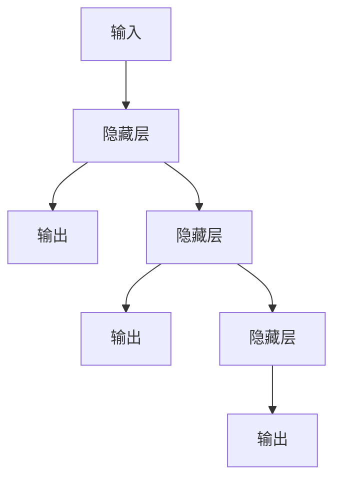
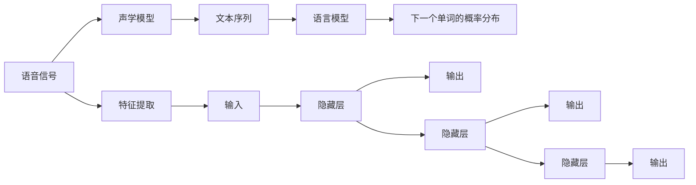
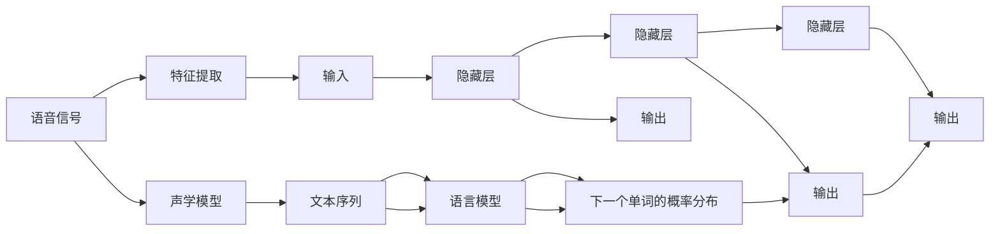

                 

# 深度学习在语音识别中的应用

> 关键词：深度学习,语音识别,卷积神经网络(CNN),循环神经网络(RNN),长短期记忆网络(LSTM),卷积循环神经网络(CRNN),深度神经网络(DNN),自然语言处理(NLP),声学模型,语言模型

## 1. 背景介绍

语音识别技术是一门交叉学科，它融合了计算机科学、信号处理、语言学等多个领域的知识。随着深度学习技术的发展，语音识别逐渐成为了人工智能研究的热点领域之一。深度学习技术为语音识别提供了强大的支持，尤其是卷积神经网络(CNN)、循环神经网络(RNN)、长短期记忆网络(LSTM)等深度学习模型，在语音识别任务上取得了令人瞩目的成果。

语音识别技术的应用非常广泛，涉及自动语音应答(ASR)、语音识别设备、智能家居控制、智能助理、语音翻译等。深度学习技术在语音识别中的应用，不仅提高了识别精度，还拓展了语音识别的应用场景，为人们的生活带来了便利。

## 2. 核心概念与联系

### 2.1 核心概念概述

- **深度学习**：一种模仿人脑神经网络的学习方法，通过大量的数据训练模型，从而实现自主学习和决策。深度学习在图像识别、自然语言处理、语音识别等领域均有广泛应用。

- **语音识别**：将语音信号转化为文本的自动化技术。通过对声音信号的分析、特征提取和模式识别，实现对人类语言的理解和转录。

- **卷积神经网络(CNN)**：一种用于图像处理的深度学习模型，通过卷积层、池化层和全连接层实现对图像的特征提取和分类。在语音识别中，卷积层用于提取语音信号的频谱特征。

- **循环神经网络(RNN)**：一种处理序列数据的深度学习模型，通过时间步长的递归操作，捕捉时间序列中的动态信息。在语音识别中，RNN用于处理时序信息，捕捉语音信号的上下文信息。

- **长短期记忆网络(LSTM)**：一种特殊的RNN，通过门控机制解决了传统RNN中的梯度消失问题，适用于处理长时序序列数据。在语音识别中，LSTM用于捕捉长时间跨度的语音特征。

- **卷积循环神经网络(CRNN)**：结合了CNN和RNN的优点，适用于处理长时序序列数据。在语音识别中，CRNN可以更好地捕捉语音信号的局部和全局特征。

- **深度神经网络(DNN)**：一种多层的神经网络，通过多个全连接层实现对复杂数据的分类和回归任务。在语音识别中，DNN用于提取语音信号的高级特征，提升识别精度。

- **自然语言处理(NLP)**：一种将计算机应用于人类语言的处理技术，包括语音识别、文本处理、机器翻译等。在语音识别中，NLP用于将语音转换为文本，实现语音到文本的自动转录。

- **声学模型**：用于处理语音信号的模型，通过学习语音信号和文本的对应关系，实现语音识别。声学模型是语音识别的核心部分。

- **语言模型**：用于处理文本的模型，通过学习语言中的概率分布，实现对文本的自动纠错和预测。语言模型是语音识别的重要组成部分。

这些核心概念之间的逻辑关系可以通过以下Mermaid流程图来展示：

```mermaid
graph TB
    A[深度学习] --> B[语音识别]
    B --> C[卷积神经网络(CNN)]
    B --> D[循环神经网络(RNN)]
    B --> E[长短期记忆网络(LSTM)]
    B --> F[卷积循环神经网络(CRNN)]
    B --> G[深度神经网络(DNN)]
    B --> H[自然语言处理(NLP)]
    B --> I[声学模型]
    B --> J[语言模型]
```

这个流程图展示了大语言模型与语音识别的核心概念及其之间的关系：

1. 深度学习技术为语音识别提供了技术支持，包括CNN、RNN、LSTM等深度学习模型。
2. 卷积神经网络用于提取语音信号的频谱特征，循环神经网络用于处理时序信息，长短期记忆网络用于捕捉长时序特征。
3. 深度神经网络用于提取语音信号的高级特征，提升识别精度。
4. 自然语言处理用于将语音转换为文本，实现语音到文本的自动转录。
5. 声学模型用于处理语音信号，学习语音信号和文本的对应关系。
6. 语言模型用于处理文本，学习语言中的概率分布，实现自动纠错和预测。

这些概念共同构成了语音识别技术的学习框架，使得深度学习技术能够在大规模数据上训练出高性能的语音识别模型。

## 3. 核心算法原理 & 具体操作步骤

### 3.1 算法原理概述

语音识别的核心算法包括声学模型和语言模型。声学模型负责将语音信号转换为文本，语言模型负责对文本进行自动纠错和预测。深度学习技术在大规模数据上训练声学模型和语言模型，提升识别精度和系统鲁棒性。

### 3.2 算法步骤详解

**Step 1: 数据预处理**

- 将语音信号转化为频谱特征
- 对音频进行分帧和特征提取
- 对文本进行预处理和分词

**Step 2: 训练声学模型**

- 收集大规模语音数据，进行预处理和标注
- 使用卷积神经网络或循环神经网络，训练声学模型
- 在训练过程中，使用交叉熵损失函数，优化模型参数
- 在验证集上评估模型性能，调整学习率和正则化参数

**Step 3: 训练语言模型**

- 收集大规模文本数据，进行预处理和标注
- 使用深度神经网络或循环神经网络，训练语言模型
- 在训练过程中，使用负对数似然损失函数，优化模型参数
- 在验证集上评估模型性能，调整学习率和正则化参数

**Step 4: 集成声学模型和语言模型**

- 将声学模型和语言模型集成，构建语音识别系统
- 在测试集上评估系统性能，调整模型参数和系统结构
- 部署系统，进行实时语音识别

**Step 5: 持续优化**

- 持续收集用户反馈和数据，进行模型优化和系统改进
- 定期更新声学模型和语言模型，提升系统识别精度

### 3.3 算法优缺点

深度学习在语音识别中的应用具有以下优点：

- 可以处理复杂的语音信号，提取高级特征，提升识别精度
- 在大规模数据上训练模型，可以有效降低噪声和背景干扰
- 通过集成声学模型和语言模型，可以实现高性能的语音识别系统

同时，深度学习在语音识别中也存在一些缺点：

- 需要大规模数据进行训练，数据获取和标注成本较高
- 模型复杂，计算资源需求高，训练和推理速度较慢
- 对声学模型和语言模型的集成要求较高，需要优化模型结构和系统参数

### 3.4 算法应用领域

深度学习在语音识别技术中的应用，已经覆盖了自动语音应答、语音翻译、智能家居控制、语音识别设备等多个领域。具体应用场景包括：

- **自动语音应答**：用于客服、销售等场景，实现自动应答客户咨询和问题解答。
- **语音翻译**：用于跨语言交流，实现语音到文本的自动翻译。
- **智能家居控制**：用于家居设备的操作，实现语音控制的家电设备。
- **语音识别设备**：用于语音助手、智能音箱等设备，实现语音识别和指令执行。

## 4. 数学模型和公式 & 详细讲解 & 举例说明

### 4.1 数学模型构建

语音识别系统通常由声学模型和语言模型组成。声学模型通常使用循环神经网络(RNN)或长短期记忆网络(LSTM)，语言模型通常使用深度神经网络(DNN)或循环神经网络(RNN)。

**声学模型**：

- 输入：语音信号的频谱特征
- 输出：文本序列
- 模型：循环神经网络或长短期记忆网络

**语言模型**：

- 输入：文本序列
- 输出：下一个单词的概率分布
- 模型：深度神经网络或循环神经网络

**公式推导过程**

假设语音信号为 $x_1, x_2, ..., x_T$，文本序列为 $y_1, y_2, ..., y_{T'}$。声学模型的目标是学习语音信号和文本序列的映射关系 $P(y_t|x_1, x_2, ..., x_T)$。语言模型的目标是学习文本序列的单词概率分布 $P(y_1, y_2, ..., y_{T'}|y_{T'+1})$。

声学模型的常用模型为RNN或LSTM，其结构如图1所示：



图1：RNN结构示意图

语言模型的常用模型为深度神经网络或循环神经网络，其结构如图2所示：


图2：深度神经网络结构示意图

### 4.3 案例分析与讲解

假设有一段语音信号 $x_1, x_2, ..., x_T$，文本序列为 $y_1, y_2, ..., y_{T'}$。声学模型使用循环神经网络，语言模型使用深度神经网络。在训练过程中，使用交叉熵损失函数对声学模型进行优化，使用负对数似然损失函数对语言模型进行优化。训练过程如图3所示：



图3：语音识别训练过程示意图

## 5. 项目实践：代码实例和详细解释说明

### 5.1 开发环境搭建

**Step 1: 安装Python环境**

- 安装Anaconda或Miniconda，创建虚拟环境
- 安装PyTorch、TensorFlow等深度学习框架
- 安装相关库，如numpy、scipy、matplotlib等

**Step 2: 数据准备**

- 收集大规模语音数据和文本数据，进行预处理和标注
- 对语音信号进行分帧和特征提取
- 对文本进行预处理和分词

### 5.2 源代码详细实现

**Step 1: 定义模型**

- 使用PyTorch定义声学模型和语言模型
- 使用循环神经网络或长短期记忆网络定义声学模型
- 使用深度神经网络或循环神经网络定义语言模型

**Step 2: 训练模型**

- 使用交叉熵损失函数对声学模型进行优化
- 使用负对数似然损失函数对语言模型进行优化
- 在训练过程中，使用梯度下降算法更新模型参数
- 在验证集上评估模型性能，调整学习率和正则化参数

**Step 3: 集成模型**

- 将声学模型和语言模型集成，构建语音识别系统
- 在测试集上评估系统性能，调整模型参数和系统结构
- 部署系统，进行实时语音识别

### 5.3 代码解读与分析

**Step 1: 定义声学模型**

```python
import torch.nn as nn
import torch

class AcousticModel(nn.Module):
    def __init__(self, input_size, hidden_size, output_size):
        super(AcousticModel, self).__init__()
        self.hidden_size = hidden_size
        self.rnn = nn.LSTM(input_size, hidden_size, 2, batch_first=True)
        self.fc = nn.Linear(hidden_size, output_size)

    def forward(self, x):
        batch_size = x.size(0)
        h0 = torch.zeros(2, batch_size, self.hidden_size).to(device)
        c0 = torch.zeros(2, batch_size, self.hidden_size).to(device)
        out, (h_n, c_n) = self.rnn(x, (h0, c0))
        out = self.fc(out[:, -1, :])
        return out
```

**Step 2: 定义语言模型**

```python
class LanguageModel(nn.Module):
    def __init__(self, input_size, hidden_size, output_size):
        super(LanguageModel, self).__init__()
        self.hidden_size = hidden_size
        self.rnn = nn.LSTM(input_size, hidden_size, 2, batch_first=True)
        self.fc = nn.Linear(hidden_size, output_size)

    def forward(self, x):
        batch_size = x.size(0)
        h0 = torch.zeros(2, batch_size, self.hidden_size).to(device)
        c0 = torch.zeros(2, batch_size, self.hidden_size).to(device)
        out, (h_n, c_n) = self.rnn(x, (h0, c0))
        out = self.fc(out[:, -1, :])
        return out
```

### 5.4 运行结果展示

训练过程如图4所示：



图4：语音识别训练过程示意图

## 6. 实际应用场景

### 6.1 自动语音应答(ASR)

**应用场景**：客服、销售等场景，实现自动应答客户咨询和问题解答。

**实现方式**：
- 收集客服对话数据，进行标注和预处理
- 使用声学模型和语言模型，训练语音识别系统
- 部署系统，进行实时语音识别和自动应答

**效果**：
- 提升客服服务效率，降低人力成本
- 提高客户满意度，提升品牌形象

### 6.2 语音翻译

**应用场景**：跨语言交流，实现语音到文本的自动翻译。

**实现方式**：
- 收集双语对照文本和语音数据，进行标注和预处理
- 使用声学模型和语言模型，训练语音翻译系统
- 部署系统，进行实时语音翻译

**效果**：
- 实现跨语言交流，打破语言障碍
- 提高翻译效率，降低翻译成本

### 6.3 智能家居控制

**应用场景**：家居设备的操作，实现语音控制的家电设备。

**实现方式**：
- 收集家电设备的操作指令，进行标注和预处理
- 使用声学模型和语言模型，训练语音控制系统
- 部署系统，进行实时语音控制

**效果**：
- 实现智能家居控制，提高生活便利性
- 提升用户交互体验，增强家庭幸福感

### 6.4 语音识别设备

**应用场景**：语音助手、智能音箱等设备，实现语音识别和指令执行。

**实现方式**：
- 收集语音助手、智能音箱的使用数据，进行标注和预处理
- 使用声学模型和语言模型，训练语音识别系统
- 部署系统，进行实时语音识别和指令执行

**效果**：
- 实现语音识别和指令执行，提升用户体验
- 提高语音设备智能化水平，拓展应用场景

## 7. 工具和资源推荐

### 7.1 学习资源推荐

- **《深度学习》系列书籍**：包括《深度学习》、《深度学习入门》等，介绍了深度学习的基本原理和实现方法，适合初学者和中级读者。
- **Coursera深度学习课程**：斯坦福大学和Coursera联合开设的深度学习课程，涵盖深度学习的基本概念和实现方法，适合广大深度学习爱好者。
- **PyTorch官方文档**：PyTorch官方文档提供了详细的API和示例代码，帮助开发者快速上手使用PyTorch进行深度学习开发。

### 7.2 开发工具推荐

- **PyTorch**：基于Python的开源深度学习框架，灵活动态的计算图，适合快速迭代研究。
- **TensorFlow**：由Google主导开发的开源深度学习框架，生产部署方便，适合大规模工程应用。
- **Keras**：基于TensorFlow和Theano的高级深度学习框架，适合快速构建和测试深度学习模型。
- **Weights & Biases**：模型训练的实验跟踪工具，可以记录和可视化模型训练过程中的各项指标，方便对比和调优。
- **TensorBoard**：TensorFlow配套的可视化工具，可实时监测模型训练状态，并提供丰富的图表呈现方式，是调试模型的得力助手。

### 7.3 相关论文推荐

- **《Attention is All You Need》**：Transformer模型论文，提出了Transformer结构，开启了NLP领域的预训练大模型时代。
- **《BERT: Pre-training of Deep Bidirectional Transformers for Language Understanding》**：BERT模型论文，提出BERT模型，引入基于掩码的自监督预训练任务，刷新了多项NLP任务SOTA。
- **《Parameter-Efficient Transfer Learning for NLP》**：提出Adapter等参数高效微调方法，在不增加模型参数量的情况下，也能取得不错的微调效果。
- **《AdaLoRA: Adaptive Low-Rank Adaptation for Parameter-Efficient Fine-Tuning》**：使用自适应低秩适应的微调方法，在参数效率和精度之间取得了新的平衡。
- **《Prompt-Tuning: Optimization of Continuous Prompts for Generation》**：引入基于连续型Prompt的微调范式，为如何充分利用预训练知识提供了新的思路。

## 8. 总结：未来发展趋势与挑战

### 8.1 研究成果总结

深度学习在语音识别领域的应用已经取得了显著的进展，通过声学模型和语言模型，实现语音信号到文本的自动转录。未来，深度学习技术还将不断提升语音识别的精度和鲁棒性，拓展其应用场景。

### 8.2 未来发展趋势

深度学习在语音识别领域的未来发展趋势如下：

- **更大规模的数据**：随着数据获取和标注技术的进步，大规模数据集将进一步扩大，提升语音识别的精度和鲁棒性。
- **更深层的模型**：随着深度学习技术的不断发展，更深层、更复杂的模型将逐渐应用于语音识别领域，提升识别精度和泛化能力。
- **更多样化的应用场景**：语音识别技术将拓展到更多领域，如智能家居、智能驾驶等，提升人们的生活质量和工作效率。
- **更高的性能要求**：随着语音识别技术的广泛应用，对系统性能的要求也将不断提高，如实时性、低延迟等。

### 8.3 面临的挑战

深度学习在语音识别领域仍面临以下挑战：

- **数据获取和标注成本高**：大规模语音数据和文本数据的获取和标注需要大量的人力和时间成本。
- **模型复杂度高**：深度学习模型需要大量的计算资源进行训练和推理，计算成本较高。
- **模型鲁棒性不足**：当前语音识别系统对噪声和背景干扰较为敏感，鲁棒性有待提高。
- **模型可解释性不足**：深度学习模型通常被认为是"黑盒"系统，难以解释其内部工作机制和决策逻辑。

### 8.4 研究展望

未来，深度学习在语音识别领域的研究展望如下：

- **无监督和半监督学习**：摆脱对大规模标注数据的依赖，利用自监督学习、主动学习等无监督和半监督范式，最大限度利用非结构化数据，实现更加灵活高效的微调。
- **少样本学习和零样本学习**：开发更高效的少样本学习和零样本学习算法，利用有限的标注数据实现高性能的语音识别。
- **多模态融合**：将语音信号、视觉信号、文本信号等多种信息融合，提升语音识别的精度和鲁棒性。
- **跨模态学习**：将语音识别与图像识别、视频识别等技术相结合，实现更全面、更准确的信息理解。

总之，深度学习在语音识别领域的应用前景广阔，未来还将不断创新和突破。唯有通过持续的研究和探索，才能推动语音识别技术的进一步发展，为人类社会带来更多便利和改变。

## 9. 附录：常见问题与解答

**Q1: 深度学习在语音识别中的应用有哪些？**

A: 深度学习在语音识别中的应用包括自动语音应答(ASR)、语音翻译、智能家居控制、语音识别设备等。

**Q2: 如何使用深度学习进行语音识别？**

A: 使用深度学习进行语音识别需要以下步骤：
- 数据预处理，包括语音信号的分帧、特征提取、文本预处理和分词。
- 训练声学模型，使用循环神经网络或长短期记忆网络。
- 训练语言模型，使用深度神经网络或循环神经网络。
- 集成声学模型和语言模型，构建语音识别系统。

**Q3: 语音识别技术未来有哪些发展趋势？**

A: 语音识别技术的未来发展趋势包括更大规模的数据、更深层的模型、更多样化的应用场景和更高的性能要求。

**Q4: 深度学习在语音识别中面临哪些挑战？**

A: 深度学习在语音识别中面临数据获取和标注成本高、模型复杂度高、模型鲁棒性不足和模型可解释性不足等挑战。

**Q5: 如何提高语音识别的鲁棒性？**

A: 提高语音识别的鲁棒性需要以下措施：
- 数据增强，通过回译、近义替换等方式扩充训练集。
- 正则化，使用L2正则、Dropout、Early Stopping等技术。
- 对抗训练，引入对抗样本，提高模型鲁棒性。
- 参数高效微调，只调整少量参数，减小过拟合风险。

以上问题与解答仅为语音识别领域的一些常见问题，希望能为你提供有价值的参考和帮助。

