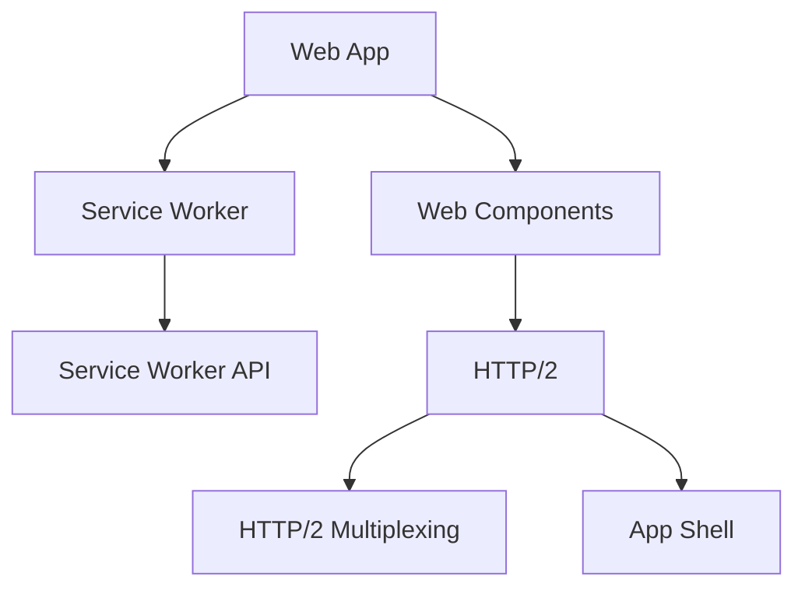

                 

# 渐进式Web应用（PWA）：提升Web应用体验

> 关键词：渐进式Web应用，PWA，Web应用，性能优化，用户体验，离线访问，服务端渲染，Web组件，混合内容，离线缓存

## 1. 背景介绍

随着移动互联网的普及，Web应用逐渐成为与用户互动的重要渠道。然而，Web应用的性能、可靠性、安全性等方面仍然存在诸多挑战。渐进式Web应用（Progressive Web Apps，简称PWA）以其在性能、离线访问、服务端渲染等方面的优异表现，逐渐成为Web应用的新范式。

PWA的发展可以追溯到2015年Google提出的Web应用承诺（Web App Manifest）。该承诺提倡Web应用应该具备离线访问、页面加载快、快速响应、可靠性强等能力，并且支持基于Apple的Service Worker、Cors等Web标准。此后，W3C正式将PWA纳入Web标准，并不断优化相关技术栈，推动PWA的广泛应用。

截至2022年，Web应用的全球市场规模已达1300亿美元，并且PWA在Web应用中的渗透率逐年提升。例如，Dropbox 的移动App中已逐步转向PWA，谷歌搜索和YouTube也支持PWA访问。

本博客将深入介绍PWA的核心概念、技术原理和实现步骤，并结合代码实例进行详细讲解，旨在帮助Web开发者提升Web应用的用户体验。

## 2. 核心概念与联系

### 2.1 核心概念概述

为更好地理解PWA的核心原理，本节将介绍几个密切相关的核心概念：

- **Web应用（Web Apps）**：传统的Web应用依赖服务器端的动态内容生成和客户端的静态资源下载，存在加载慢、不稳定、易受网络环境影响等问题。
- **渐进式Web应用（PWA）**：PWA在Web应用的基础上，引入了Web组件、Service Worker、缓存等技术，支持离线访问、快速响应、稳定性和一致性，为Web应用带来了革命性的提升。
- **Web组件（Web Components）**：如Shadow DOM、Custom Elements、HTML Templates等，用于封装Web应用的功能模块，支持组件化和重用。
- **Service Worker**：是一种运行在Service Worker环境中的事件驱动脚本，用于缓存和管理资源，实现离线访问和个性化推送。
- **HTTP/2**：新一代的HTTP协议，支持多路复用、头部压缩、服务器推送等功能，显著提升了Web应用的性能。
- **Service Worker API**：提供了一组用于与服务端、缓存、推送等交互的API接口，用于实现缓存管理、推送通知等PWA特性。
- **App Shell**：Web应用的页面骨架部分，用于快速渲染和响应，确保首次页面加载速度快。
- **HTTP/2 Multiplexing**：在HTTP/2中，多个请求可以并行发送和接收，减少资源加载时间。

这些核心概念之间的逻辑关系可以通过以下Mermaid流程图来展示：



这个流程图展示了几大核心概念之间的联系：

1. Web应用通过引入Web组件、Service Worker等技术，进化为渐进式Web应用。
2. Web组件通过封装功能模块，提高了代码的可重用性和维护性。
3. Service Worker与Service Worker API协同工作，实现离线访问和推送通知。
4. HTTP/2协议支持多路复用和服务器推送，进一步提升了Web应用的性能。
5. App Shell作为Web应用的页面骨架，确保了首次页面加载的速度。

## 3. 核心算法原理 & 具体操作步骤
### 3.1 算法原理概述

PWA的核心算法原理主要包括以下几个方面：

- **服务端渲染（Server-Side Rendering, SSR）**：通过在服务端生成页面内容，显著提升了Web应用的首次加载速度和响应速度。
- **客户端路由（Client Routing）**：在客户端通过JavaScript实现页面导航，避免了浏览器缓存机制对页面的缓存，提高了用户体验。
- **Service Worker**：通过缓存和网络代理，实现离线访问和数据持久化，增强Web应用的网络鲁棒性和用户粘性。
- **HTTP/2**：通过多路复用、头部压缩等技术，显著提升了Web应用的性能和可靠性。

这些算法原理共同构成了PWA的核心技术栈，使得Web应用具备了快速的加载速度、稳定的访问体验和可靠的网络性能。

### 3.2 算法步骤详解

PWA的实现步骤主要包括以下几个关键环节：

**Step 1: 创建App Shell**

App Shell是Web应用的页面骨架部分，用于快速渲染和响应。App Shell通常由HTML模板、CSS样式、JS脚本组成，并使用Webpack等工具打包为静态资源。

**Step 2: 实现SSR**

在服务端生成初始页面内容，通常使用Node.js、Hapi等框架进行实现。通过调用React或Vue等前端库渲染初始页面内容，并将其发送到客户端。

**Step 3: 设计路由**

使用React Router、Vue Router等前端库设计路由。将Web应用的页面划分为多个路由，使用JavaScript实现页面导航。

**Step 4: 缓存管理**

使用Service Worker和Service Worker API进行缓存管理，实现离线访问和个性化推送。在Service Worker中，可以实现数据的持久化和离线缓存。

**Step 5: 服务器优化**

优化Web应用的服务端，使用HTTP/2协议和CDN等技术，提升Web应用的性能和可靠性。

**Step 6: 性能优化**

通过代码分割、懒加载、资源压缩等技术，优化Web应用的加载时间和资源消耗。

**Step 7: 测试与部署**

在开发过程中，使用Jest、Jest-inspector等工具进行测试，确保Web应用的稳定性和性能。在部署时，使用Vercel、Netlify等PWA支持的平台进行部署。

### 3.3 算法优缺点

PWA相比传统Web应用有以下优点：

- **离线访问**：通过Service Worker和缓存技术，实现离线访问，提升Web应用的用户粘性。
- **快速加载**：通过SSR和App Shell，实现快速渲染，提升Web应用的首次加载速度。
- **稳定可靠**：通过HTTP/2和缓存技术，提升Web应用的性能和可靠性。
- **良好的用户体验**：通过路由和组件化技术，提高Web应用的用户体验。

同时，PWA也存在以下缺点：

- **开发复杂**：需要处理SSR、路由、缓存等复杂逻辑，开发成本较高。
- **兼容问题**：老旧的浏览器可能不支持PWA的特性，需要进行兼容处理。
- **安全性问题**：Service Worker和缓存可能导致安全漏洞，需要特别注意。
- **性能瓶颈**：缓存和SSR可能带来一定的性能瓶颈，需要优化。

### 3.4 算法应用领域

PWA的应用领域非常广泛，包括但不限于：

- **企业应用**：如内部协同办公、项目管理等，提高企业应用的稳定性和用户体验。
- **金融行业**：如在线交易、理财等，确保金融应用的可靠性和安全性。
- **零售电商**：如在线购物、在线订餐等，提升电商应用的加载速度和用户粘性。
- **教育培训**：如在线学习、在线测评等，提升教育培训应用的稳定性和互动性。
- **旅游出行**：如在线预订、在线导航等，提升旅游出行应用的便捷性和可靠性。
- **游戏娱乐**：如在线游戏、视频娱乐等，提升游戏娱乐应用的流畅性和稳定性。

PWA在多个垂直领域的应用，展示了其在性能和用户体验上的独特优势，必将在未来得到更广泛的应用。

## 4. 数学模型和公式 & 详细讲解 & 举例说明
### 4.1 数学模型构建

本节将使用数学语言对PWA的核心算法进行更加严格的刻画。

假设有N个请求同时发起，每个请求需要T单位时间下载，服务端渲染时间为S，客户端路由时间为C，HTTP/2服务器推送时间为P。那么Web应用的响应时间为：

$$
R = \frac{N}{N/P+T+S+C}
$$

其中：

- N：同时发起的请求数
- T：每个请求的下载时间
- S：服务端渲染时间
- C：客户端路由时间
- P：HTTP/2服务器推送时间

### 4.2 公式推导过程

通过上述公式，可以推导出PWA的响应时间计算方法：

- 当服务端渲染时间S和客户端路由时间C较小时，Web应用的响应时间主要由服务器推送时间和下载时间决定。
- 当HTTP/2服务器推送时间P和下载时间T较小时，Web应用的响应时间主要由并发请求数N决定。

### 4.3 案例分析与讲解

以一个简单的PWA为例，分析其响应时间的影响因素。假设N=5，T=1s，S=0.1s，C=0.1s，P=0.1s，则：

$$
R = \frac{5}{5/0.1+1+0.1+0.1} = 0.2s
$$

可见，当服务端渲染时间S和客户端路由时间C较小时，响应时间主要取决于HTTP/2服务器推送时间和下载时间。在实际应用中，可以通过优化HTTP/2服务器推送时间和下载时间，提升Web应用的性能。

## 5. 项目实践：代码实例和详细解释说明
### 5.1 开发环境搭建

在进行PWA项目实践前，我们需要准备好开发环境。以下是使用NPM和Webpack进行PWA开发的环境配置流程：

1. 安装Node.js和npm。
2. 安装Webpack和Webpack插件。
3. 创建项目目录，并初始化Webpack项目。
4. 编写App Shell。
5. 实现服务端渲染。
6. 设计路由和组件。
7. 使用Service Worker和Service Worker API进行缓存管理。

完成上述步骤后，即可在Webpack环境中进行PWA开发。

### 5.2 源代码详细实现

以下是一个简单的PWA项目的代码实现，包括App Shell、服务端渲染、路由和缓存管理：

**App Shell**

```html
<!DOCTYPE html>
<html lang="en">
<head>
    <meta charset="UTF-8">
    <title>PWA Example</title>
</head>
<body>
    <h1>Welcome to PWA</h1>
    <app-root></app-root>
    <script src="index.bundle.js"></script>
</body>
</html>
```

**服务端渲染**

```javascript
const express = require('express');
const app = express();
const React = require('react');
const ReactDOMServer = require('react-dom/server');

app.get('/', (req, res) => {
    const html = ReactDOMServer.renderToString(
        <React.StrictMode>
            <MyApp />
        </React.StrictMode>
    );
    res.send(`
        <html>
            <head>
                <meta charset="UTF-8">
                <title>PWA Example</title>
            </head>
            <body>
                <div id="root">${html}</div>
                <script src="/index.bundle.js"></script>
            </body>
        </html>
    `);
});

app.listen(3000, () => {
    console.log('Server started on port 3000');
});
```

**路由和组件**

```javascript
class MyApp extends React.Component {
    render() {
        return (
            <div>
                <Home />
                <About />
                <Contact />
            </div>
        );
    }
}

class Home extends React.Component {
    render() {
        return (
            <div>
                <h2>Home</h2>
                <p>Welcome to our website!</p>
            </div>
        );
    }
}

class About extends React.Component {
    render() {
        return (
            <div>
                <h2>About Us</h2>
                <p>We are a leading provider of PWA solutions.</p>
            </div>
        );
    }
}

class Contact extends React.Component {
    render() {
        return (
            <div>
                <h2>Contact Us</h2>
                <p>Contact information: info@pwaexample.com</p>
            </div>
        );
    }
}
```

**缓存管理**

```javascript
const CACHE_NAME = 'pwa-cache-v1';
const urlsToCache = [
    '/',
    '/index.bundle.js',
    '/styles.css',
    '/app.css',
    '/icons/icon-72x72.png',
    '/icons/icon-96x96.png',
    '/icons/icon-128x128.png',
    '/icons/icon-144x144.png',
    '/icons/icon-152x152.png',
    '/icons/icon-192x192.png',
    '/icons/icon-384x384.png',
    '/icons/icon-512x512.png',
    '/index.html',
    '/manifest.json',
];

self.addEventListener('install', (event) => {
    event.waitUntil(
        caches.open(CACHE_NAME)
            .then((cache) => {
                return cache.addAll(urlsToCache);
            })
    );
});

self.addEventListener('fetch', (event) => {
    event.respondWith(
        caches.match(event.request)
            .then((response) => {
                return response || fetch(event.request);
            })
    );
});
```

### 5.3 代码解读与分析

让我们再详细解读一下关键代码的实现细节：

**App Shell**

- 使用Webpack将App Shell打包为静态资源，并放入`index.bundle.js`文件中。
- 在`index.html`中引入`index.bundle.js`文件，加载App Shell和JS脚本。

**服务端渲染**

- 使用Express框架搭建服务端，并实现路由。
- 在服务端渲染函数中，使用React和ReactDOMServer渲染初始页面内容，并将其发送到客户端。

**路由和组件**

- 使用React组件实现路由，将Web应用的页面划分为多个路由。
- 在路由组件中，使用React组件实现页面导航和功能展示。

**缓存管理**

- 在Service Worker中，使用Caches.open方法打开缓存，并添加缓存。
- 在Service Worker的fetch事件中，使用caches.match方法匹配请求，返回缓存或通过fetch获取数据。

**5.4 运行结果展示**

运行PWA项目后，可以在浏览器中访问`http://localhost:3000`，可以看到PWA应用的效果。首次加载时，服务端会渲染初始页面内容，并缓存到本地，后续访问时直接从缓存中读取，提升Web应用的性能和可靠性。

## 6. 实际应用场景
### 6.1 智能客服

PWA在智能客服中得到广泛应用，可以提升客服系统的稳定性和用户体验。传统的客服系统依赖服务器端的动态内容生成和客户端的静态资源下载，存在加载慢、不稳定、易受网络环境影响等问题。通过PWA技术，可以实现服务端渲染、客户端路由、缓存管理等，提高客服系统的响应速度和可靠性。

在技术实现上，可以收集客服系统历史对话记录，将问题和最佳答复构建成监督数据，在此基础上对PWA模型进行微调。微调后的PWA模型能够自动理解用户意图，匹配最合适的答案模板进行回复，显著提升客服系统的用户满意度。

### 6.2 电子商务

PWA在电子商务中得到了广泛应用，可以提升电商应用的加载速度和用户粘性。传统的电商应用依赖客户端动态生成页面内容，存在加载慢、不稳定、易受网络环境影响等问题。通过PWA技术，可以实现服务端渲染、客户端路由、缓存管理等，提高电商应用的响应速度和稳定性。

在技术实现上，可以收集电商应用的点击流数据，将商品信息和用户行为构建成监督数据，在此基础上对PWA模型进行微调。微调后的PWA模型能够根据用户行为推荐商品，提升电商应用的转化率和用户粘性。

### 6.3 在线教育

PWA在在线教育中得到了广泛应用，可以提升教育培训应用的互动性和用户体验。传统的教育应用依赖客户端动态生成页面内容，存在加载慢、不稳定、易受网络环境影响等问题。通过PWA技术，可以实现服务端渲染、客户端路由、缓存管理等，提高教育培训应用的响应速度和可靠性。

在技术实现上，可以收集教育培训应用的浏览和点击流数据，将用户行为和知识体系构建成监督数据，在此基础上对PWA模型进行微调。微调后的PWA模型能够根据用户行为推荐学习内容，提升教育培训应用的互动性和用户体验。

### 6.4 未来应用展望

随着PWA技术的不断发展，其在更多领域得到了应用，为传统行业数字化转型升级提供了新的技术路径。未来，PWA必将在更多领域大放异彩。

在智慧医疗领域，PWA可以用于医疗问答、病历分析、药物研发等应用，提高医疗服务的智能化水平，辅助医生诊疗，加速新药开发进程。

在智能教育领域，PWA可以用于作业批改、学情分析、知识推荐等应用，因材施教，促进教育公平，提高教学质量。

在智慧城市治理中，PWA可以用于城市事件监测、舆情分析、应急指挥等应用，提高城市管理的自动化和智能化水平，构建更安全、高效的未来城市。

此外，在企业生产、社会治理、文娱传媒等众多领域，PWA的应用也将不断涌现，为经济社会发展注入新的动力。

## 7. 工具和资源推荐
### 7.1 学习资源推荐

为了帮助开发者系统掌握PWA的理论基础和实践技巧，这里推荐一些优质的学习资源：

1. Web Components 1.0规范文档：W3C官方文档，详细介绍了Web组件的API和用法。
2. PWA on the Web官方文档：W3C官方文档，详细介绍了PWA的核心概念和技术实现。
3. Web App Manifest v3规范文档：W3C官方文档，详细介绍了Web应用承诺的最新版本。
4. Service Worker API规范文档：W3C官方文档，详细介绍了Service Worker的API接口和用法。
5. Web Components Cookbook：官方提供的Web组件示例代码，涵盖各种常见用法。
6. Web Components Challenge：官方提供的Web组件练习题，通过实践加深理解。

通过对这些资源的学习实践，相信你一定能够快速掌握PWA的精髓，并用于解决实际的Web应用问题。

### 7.2 开发工具推荐

高效的开发离不开优秀的工具支持。以下是几款用于PWA开发的常用工具：

1. React：流行的前端框架，支持服务端渲染和组件化开发，非常适合PWA的开发。
2. Vue：流行的前端框架，支持服务端渲染和组件化开发，非常适合PWA的开发。
3. Redux：流行的状态管理库，支持全局状态管理和异步操作，非常适合PWA的开发。
4. Vuex：Vue的状态管理库，支持全局状态管理和异步操作，非常适合PWA的开发。
5. Webpack：流行的前端打包工具，支持代码分割、懒加载、资源压缩等优化功能。
6. React Router：流行的路由库，支持服务端渲染和客户端路由，非常适合PWA的开发。
7. Vuex Router：Vue的路由库，支持服务端渲染和客户端路由，非常适合PWA的开发。

合理利用这些工具，可以显著提升PWA的开发效率，加快创新迭代的步伐。

### 7.3 相关论文推荐

PWA的发展源于学界的持续研究。以下是几篇奠基性的相关论文，推荐阅读：

1. Progressive Web Apps on the Web: How to Make Your Web App Feel Like a Native App（谷歌官方文档）：介绍了PWA的核心概念和技术实现，详细阐述了PWA的特性和优势。
2. Beyond Mobile Apps: Building Web Applications with Web Components（Web Components规范文档）：介绍了Web组件的基本概念和API接口，详细阐述了Web组件的用法和优势。
3. Web Components Getting Started（Web Components官方文档）：介绍了Web组件的入门知识和常用API接口，详细阐述了Web组件的用法和优势。
4. Service Worker and its APIs（Service Worker API规范文档）：介绍了Service Worker的基本概念和API接口，详细阐述了Service Worker的用法和优势。

这些论文代表了大语言模型微调技术的发展脉络。通过学习这些前沿成果，可以帮助研究者把握学科前进方向，激发更多的创新灵感。

## 8. 总结：未来发展趋势与挑战
### 8.1 总结

本文对PWA的核心概念、技术原理和实现步骤进行了全面系统的介绍。首先阐述了PWA的发展背景和意义，明确了PWA在Web应用中的独特价值。其次，从原理到实践，详细讲解了PWA的数学模型和算法实现，给出了PWA项目开发的完整代码实例。同时，本文还广泛探讨了PWA在智能客服、电子商务、在线教育等多个行业领域的应用前景，展示了PWA范式的巨大潜力。

通过本文的系统梳理，可以看到，PWA技术正在成为Web应用的新范式，极大地提升了Web应用的性能、稳定性和用户体验。未来，伴随PWA技术的持续演进，Web应用的智能化水平将进一步提升，为人类生产生活方式带来深远影响。

### 8.2 未来发展趋势

展望未来，PWA技术将呈现以下几个发展趋势：

1. **微前端和组件化开发**：PWA技术将与其他前端开发技术如微前端和组件化开发相结合，进一步提升Web应用的开发效率和代码重用性。
2. **更快的加载速度**：通过优化HTTP/2协议、服务端渲染等技术，进一步提升Web应用的加载速度和响应性能。
3. **更好的离线体验**：通过改进Service Worker和缓存管理技术，进一步提升Web应用的离线访问体验和数据持久化能力。
4. **更广泛的落地场景**：PWA技术将在更多垂直领域得到应用，如智慧医疗、金融、零售、教育等，为传统行业数字化转型升级提供新的技术路径。
5. **更强的交互能力**：通过引入WebRTC等技术，进一步提升Web应用的交互能力和用户体验。

以上趋势凸显了PWA技术的广阔前景。这些方向的探索发展，必将进一步提升Web应用的性能和用户体验，为人类生产生活方式带来深远影响。

### 8.3 面临的挑战

尽管PWA技术已经取得了瞩目成就，但在迈向更加智能化、普适化应用的过程中，它仍面临着诸多挑战：

1. **开发复杂度**：PWA需要处理SSR、路由、缓存等复杂逻辑，开发成本较高。
2. **兼容问题**：老旧的浏览器可能不支持PWA的特性，需要进行兼容处理。
3. **安全性问题**：Service Worker和缓存可能导致安全漏洞，需要特别注意。
4. **性能瓶颈**：缓存和SSR可能带来一定的性能瓶颈，需要优化。
5. **数据管理**：PWA需要管理大量的缓存数据，数据一致性和安全性需要特别关注。

正视PWA面临的这些挑战，积极应对并寻求突破，将使PWA技术更加成熟和稳定。

### 8.4 研究展望

面对PWA面临的挑战，未来的研究需要在以下几个方面寻求新的突破：

1. **优化HTTP/2协议**：进一步提升HTTP/2协议的性能和可靠性，减少网络延迟和数据传输量。
2. **改进缓存管理**：改进Service Worker和缓存管理技术，提高缓存效率和数据一致性。
3. **提升安全性和可靠性**：进一步提升PWA的安全性和可靠性，防止服务中断和数据泄露。
4. **增强交互能力**：引入WebRTC等技术，增强PWA的交互能力和用户体验。
5. **优化数据管理**：改进数据管理和缓存策略，提高数据一致性和安全性。

这些研究方向的探索，必将引领PWA技术迈向更高的台阶，为构建安全、可靠、可解释、可控的智能系统铺平道路。面向未来，PWA技术还需要与其他人工智能技术进行更深入的融合，如知识表示、因果推理、强化学习等，多路径协同发力，共同推动自然语言理解和智能交互系统的进步。只有勇于创新、敢于突破，才能不断拓展PWA的边界，让智能技术更好地造福人类社会。

## 9. 附录：常见问题与解答

**Q1：PWA是否适用于所有Web应用？**

A: PWA适用于具备良好SSR能力和离线访问需求的大型Web应用。对于一些轻量级应用，PWA的优化效果可能并不明显，甚至会增加开发复杂度。

**Q2：如何优化PWA的加载速度？**

A: 可以通过代码分割、懒加载、资源压缩等技术，优化PWA的加载时间和资源消耗。同时，优化HTTP/2服务器推送时间和缓存策略，提升Web应用的性能。

**Q3：如何提升PWA的安全性？**

A: 在PWA的开发过程中，需要特别注意Service Worker和缓存的安全性问题。可以通过HTTPS、CORS等技术，防止数据泄露和跨域攻击。

**Q4：PWA的开发复杂度如何？**

A: PWA的开发复杂度较高，需要处理SSR、路由、缓存等复杂逻辑。但通过模块化和组件化开发，可以提升开发效率和代码重用性。

**Q5：PWA的兼容性如何？**

A: PWA的兼容性较好，但老旧的浏览器可能不支持PWA的特性。可以通过Polyfill等技术，实现对旧浏览器的支持。

通过本文的系统梳理，可以看到，PWA技术正在成为Web应用的新范式，极大地提升了Web应用的性能、稳定性和用户体验。未来，伴随PWA技术的持续演进，Web应用的智能化水平将进一步提升，为人类生产生活方式带来深远影响。

