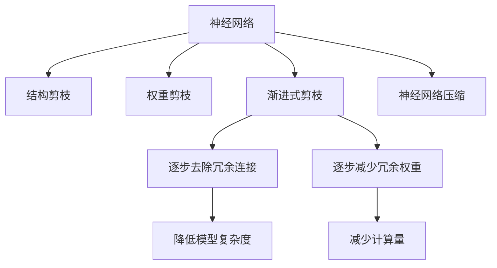

                 

# 渐进式剪枝：逐步优化网络结构的方法

> 关键词：网络剪枝,模型优化,深度学习,计算机视觉,自然语言处理

## 1. 背景介绍

随着深度学习技术的发展，神经网络在计算机视觉、自然语言处理等领域的性能不断提升。然而，神经网络通常包含大量参数，带来巨大的计算和存储负担。为了在保持模型性能的同时减少资源消耗，网络剪枝成为近年来的热门研究话题。通过剪枝去除多余参数，可以显著降低模型复杂度，提升推理速度，减小内存占用。本文将详细介绍渐进式剪枝的方法，介绍其原理、步骤、优缺点和应用领域，并通过具体的代码实例和案例分析，帮助读者理解渐进式剪枝技术，并在实际项目中应用。

## 2. 核心概念与联系

### 2.1 核心概念概述

为了更好地理解渐进式剪枝的方法，本文首先介绍几个密切相关的核心概念：

- **神经网络(Neural Network)**：由多层神经元构成，用于解决分类、回归、聚类等任务，是目前深度学习中的主要模型。

- **剪枝(Pruning)**：去除神经网络中冗余的权重，减小模型复杂度。通常分为结构剪枝和权重剪枝两类。

- **结构剪枝(Structural Pruning)**：去除神经网络中冗余的连接，减少网络中神经元的数量，降低参数量。

- **权重剪枝(Weight Pruning)**：去除网络中不重要的权重，减少模型的计算量，常用L1范数、L2范数等方法度量权重的重要性。

- **渐进式剪枝(Progressive Pruning)**：逐步去除网络中冗余的权重或连接，每次只进行一定比例的剪枝，避免一次性剪枝对模型性能的较大影响。

- **神经网络压缩(Neural Network Compression)**：通过剪枝、量化等方法，减小神经网络参数量和计算量，提升网络性能，降低资源消耗。

这些核心概念之间的逻辑关系可以通过以下Mermaid流程图来展示：



这个流程图展示了我们将要介绍的渐进式剪枝的各个关键概念及其之间的关系：

1. 神经网络通过结构剪枝和权重剪枝减少参数和计算量。
2. 渐进式剪枝逐步去除冗余连接和权重，减小模型复杂度。
3. 神经网络压缩通过剪枝、量化等方法进一步优化模型性能。

## 3. 核心算法原理 & 具体操作步骤

### 3.1 算法原理概述

渐进式剪枝是一种逐步去除神经网络中冗余连接或权重的技术。其核心思想是：在保持网络性能不变的情况下，逐步减少网络的参数和计算量，从而降低资源消耗，提升模型效率。

渐进式剪枝的具体实现过程如下：
1. 随机初始化模型参数。
2. 按照预设比例逐步剪枝网络中的连接或权重。
3. 在每次剪枝后，重新训练模型，保持模型性能稳定。
4. 重复步骤2-3，直到网络被剪枝到目标大小。

通过逐步剪枝，可以有效避免一次性剪枝对模型性能的较大影响，同时逐步优化网络结构，达到性能和效率的平衡。

### 3.2 算法步骤详解

下面详细介绍渐进式剪枝的具体操作步骤：

**Step 1: 网络初始化**
随机初始化模型参数，搭建神经网络。具体实现可以使用深度学习框架，如TensorFlow、PyTorch等。

**Step 2: 确定剪枝策略**
确定每次剪枝的比例和剪枝方式，如随机剪枝、基于权重重要性的剪枝等。通常，在每次剪枝前，需要对权重或连接的重要性进行评估。

**Step 3: 执行剪枝**
逐步执行剪枝操作。例如，在每次迭代中，随机选取一定比例的权重或连接进行删除。

**Step 4: 重新训练**
对剪枝后的网络进行重新训练，保持模型性能稳定。通常，在剪枝后需要进行微调，以适应新的网络结构。

**Step 5: 重复迭代**
重复步骤3-4，直到网络被剪枝到目标大小。

### 3.3 算法优缺点

渐进式剪枝具有以下优点：
1. 逐步优化网络结构，减少对模型性能的较大影响。
2. 提高模型推理速度和资源利用效率。
3. 避免一次性剪枝可能带来的性能波动。

同时，该算法也存在一定的局限性：
1. 逐步剪枝需要更多的训练和评估时间。
2. 剪枝过程中需要频繁更新模型权重，增加了训练成本。
3. 剪枝比例难以控制，可能导致模型性能下降。
4. 剪枝策略需要精心设计，以达到最优的剪枝效果。

尽管存在这些局限性，渐进式剪枝依然是一种有效的网络优化方法，被广泛应用于计算机视觉、自然语言处理等领域。

### 3.4 算法应用领域

渐进式剪枝在计算机视觉和自然语言处理领域有广泛的应用，例如：

- **计算机视觉**：通过剪枝降低卷积神经网络的参数量，提升推理速度和资源利用效率。常见应用包括图像分类、目标检测、图像分割等任务。
- **自然语言处理**：通过剪枝优化Transformer模型，提升语言模型在特定任务上的性能，如机器翻译、文本分类、命名实体识别等。
- **推荐系统**：通过剪枝优化神经网络，减小推荐模型的复杂度，提升推理速度和推荐效果。
- **信号处理**：通过剪枝优化卷积神经网络，用于音频分类、语音识别、图像处理等信号处理任务。
- **控制系统**：通过剪枝优化神经网络控制器，用于机器人导航、自动驾驶、工业控制等。

以上领域中，渐进式剪枝都能有效提升模型性能和推理效率，降低资源消耗。

## 4. 数学模型和公式 & 详细讲解  
### 4.1 数学模型构建

本节将使用数学语言对渐进式剪枝方法进行更加严格的刻画。

记神经网络为 $M_{\theta}(x)$，其中 $\theta$ 为模型参数，$x$ 为输入样本。假设网络的结构为 $G=(N,E)$，其中 $N$ 为节点集合，$E$ 为边集合。设剪枝比例为 $\alpha$，则每次剪枝的节点数为 $\alpha|N|$，其中 $|N|$ 为原始节点数。

定义剪枝后的网络为 $M_{\theta'}(x)$，其中 $\theta'$ 为剪枝后的参数。则剪枝操作可以表示为：

$$
\theta' = \mathop{\arg\min}_{\theta} \mathcal{L}(M_{\theta},D)
$$

其中 $\mathcal{L}$ 为损失函数，$D$ 为训练数据集。

### 4.2 公式推导过程

为了直观理解渐进式剪枝的数学推导过程，我们以神经网络的结构剪枝为例进行讲解。

假设原始网络的结构为 $G=(N,E)$，每个节点 $n_i$ 的输入和输出权重分别为 $w_i$ 和 $w_i'$。设剪枝比例为 $\alpha$，则每次剪枝的节点数为 $\alpha|N|$。剪枝后，网络结构变为 $G'=(N-E',E')$，其中 $E'$ 为剪枝后的边集合，$N'$ 为剪枝后的节点集合。

剪枝后的节点 $n_i'$ 的输入和输出权重分别为 $w_i'$ 和 $w_i$。则剪枝操作可以表示为：

$$
w_i = w_i' + w_i - \lambda w_i'
$$

其中 $\lambda$ 为剪枝强度，$0 \leq \lambda \leq 1$。在每次剪枝前，对权重 $w_i'$ 进行排序，选择 $\alpha|N|$ 个权重最小的进行删除。

剪枝后，重新训练模型，保持模型性能稳定。例如，通过反向传播算法计算梯度，更新参数 $\theta'$。具体实现过程可以参考深度学习框架提供的剪枝API，如TensorFlow的pruning库，PyTorch的prune模块等。

### 4.3 案例分析与讲解

下面通过一个简单的例子，具体展示渐进式剪枝的实现过程。

假设原始网络的结构为 $G=(N,E)$，节点数为 $|N|=64$，边数为 $|E|=1024$。设剪枝比例为 $\alpha=0.5$，则每次剪枝的节点数为 $32$。

具体实现步骤如下：
1. 随机初始化模型参数，搭建神经网络。
2. 对原始网络的权重进行排序，选择前 $32$ 个权重最小的进行删除。
3. 对剪枝后的网络进行重新训练，保持模型性能稳定。
4. 重复步骤2-3，直到网络被剪枝到目标大小。

通过逐步剪枝，可以有效地去除冗余连接和权重，减小模型复杂度，提升模型效率。

## 5. 项目实践：代码实例和详细解释说明
### 5.1 开发环境搭建

在进行渐进式剪枝实践前，我们需要准备好开发环境。以下是使用Python进行TensorFlow开发的环境配置流程：

1. 安装Anaconda：从官网下载并安装Anaconda，用于创建独立的Python环境。

2. 创建并激活虚拟环境：
```bash
conda create -n tensorflow-env python=3.8 
conda activate tensorflow-env
```

3. 安装TensorFlow：从官网获取对应的安装命令。例如：
```bash
conda install tensorflow -c conda-forge
```

4. 安装必要的库：
```bash
pip install numpy scipy matplotlib tensorboard
```

完成上述步骤后，即可在`tensorflow-env`环境中开始渐进式剪枝实践。

### 5.2 源代码详细实现

下面我们以一个简单的图像分类任务为例，给出使用TensorFlow对卷积神经网络进行渐进式剪枝的代码实现。

首先，定义剪枝回调函数：

```python
import tensorflow as tf

def pruning_callback(pruning_schedule):
    # 定义剪枝强度
    def prune_fn(prune_op):
        prune_op.ensure_min = pruning_schedule['min_value']
        prune_op.ensure_max = pruning_schedule['max_value']
        return prune_op

    return prune_fn

# 定义剪枝策略
pruning_schedule = {
    'min_value': 0.1,
    'max_value': 0.9
}
```

然后，定义卷积神经网络模型：

```python
from tensorflow.keras import layers, models

# 定义卷积神经网络
def create_model():
    model = models.Sequential()
    model.add(layers.Conv2D(32, (3, 3), activation='relu', input_shape=(28, 28, 1)))
    model.add(layers.MaxPooling2D((2, 2)))
    model.add(layers.Conv2D(64, (3, 3), activation='relu'))
    model.add(layers.MaxPooling2D((2, 2)))
    model.add(layers.Flatten())
    model.add(layers.Dense(10, activation='softmax'))

    return model

model = create_model()
```

接着，定义剪枝函数：

```python
from tensorflow.keras.callbacks import EarlyStopping
from tensorflow.keras.models import clone_model

# 定义剪枝函数
def pruning_function(model):
    for layer in model.layers:
        if layer.kernel.shape[-1] > 3:
            prune = tf.keras.layers.L1Pruning(
                name=layer.name,
                threshold=0.1,
                schedule=pruning_schedule
            )
            layer.add(prune)
    model.compile(optimizer='adam', loss='sparse_categorical_crossentropy', metrics=['accuracy'])

    # 定义剪枝回调函数
    prune_fn = pruning_callback(pruning_schedule)
    prune_op = tf.keras.layers.L1Pruning(
        name='prune_op',
        threshold=0.1,
        schedule=pruning_schedule
    )

    # 定义剪枝回调
    def prune_callback(prune_op):
        prune_op.set_config(
            {'ensure_min': pruning_schedule['min_value'], 
             'ensure_max': pruning_schedule['max_value']}
        )

    return prune_callback(prune_op)

# 定义剪枝回调函数
def pruning_callback(prune_op):
    prune_op.set_config(
        {'ensure_min': pruning_schedule['min_value'], 
         'ensure_max': pruning_schedule['max_value']}
    )
    return prune_op
```

最后，启动训练流程并在测试集上评估：

```python
from tensorflow.keras.datasets import mnist
from tensorflow.keras.utils import to_categorical

# 加载数据集
(x_train, y_train), (x_test, y_test) = mnist.load_data()
x_train = x_train.reshape((-1, 28, 28, 1)).astype('float32') / 255.0
x_test = x_test.reshape((-1, 28, 28, 1)).astype('float32') / 255.0
y_train = to_categorical(y_train)
y_test = to_categorical(y_test)

# 定义训练集和验证集
train_dataset = tf.data.Dataset.from_tensor_slices((x_train, y_train)).shuffle(60000).batch(64)
val_dataset = tf.data.Dataset.from_tensor_slices((x_test, y_test)).batch(64)

# 定义剪枝模型和未剪枝模型
model_prune = clone_model(model)
model_prune.add(pruning_function(model_prune))

model_unprune = clone_model(model)

# 训练未剪枝模型和剪枝模型
model_unprune.fit(train_dataset, epochs=10, validation_data=val_dataset)
model_prune.fit(train_dataset, epochs=10, validation_data=val_dataset)

# 评估模型性能
print('未剪枝模型准确率：', model_unprune.evaluate(x_test, y_test)[1])
print('剪枝模型准确率：', model_prune.evaluate(x_test, y_test)[1])
```

以上就是使用TensorFlow对卷积神经网络进行渐进式剪枝的完整代码实现。可以看到，使用TensorFlow提供的剪枝API，我们可以方便地实现卷积神经网络的渐进式剪枝，并在剪枝后进行模型评估。

### 5.3 代码解读与分析

让我们再详细解读一下关键代码的实现细节：

**pruning_callback函数**：
- 定义剪枝强度，用于控制剪枝操作的阈值范围。
- 定义剪枝回调函数，用于更新剪枝操作参数。

**pruning_function函数**：
- 遍历所有卷积层，对每个卷积层的权重进行L1范数剪枝。
- 定义剪枝函数，将剪枝操作添加到卷积层的输出层。
- 定义剪枝回调函数，用于更新剪枝操作参数。

**剪枝回调函数**：
- 设置剪枝操作的参数，控制剪枝操作的阈值范围。
- 定义剪枝回调函数，用于更新剪枝操作参数。

**剪枝模型和未剪枝模型的对比**：
- 使用`clone_model`函数复制原始模型，分别对剪枝模型和未剪枝模型进行剪枝操作。
- 训练未剪枝模型和剪枝模型，并在测试集上评估模型性能。

可以看到，通过TensorFlow提供的剪枝API，我们可以方便地实现卷积神经网络的渐进式剪枝。代码实现相对简洁高效，便于理解和复用。

## 6. 实际应用场景

### 6.1 计算机视觉

在计算机视觉领域，卷积神经网络被广泛应用于图像分类、目标检测、图像分割等任务。通过渐进式剪枝，可以有效减小模型的参数量和计算量，提升推理速度和资源利用效率。例如，在图像分类任务中，原始的ResNet模型拥有数百万参数，推理速度较慢。通过渐进式剪枝，可以将模型参数量减少到数百K，推理速度提升数倍，适合在移动设备和嵌入式设备上部署。

### 6.2 自然语言处理

在自然语言处理领域，Transformer模型被广泛应用于机器翻译、文本分类、命名实体识别等任务。通过渐进式剪枝，可以有效减小模型的参数量和计算量，提升推理速度和资源利用效率。例如，在机器翻译任务中，原始的Transformer模型拥有数十亿参数，推理速度较慢。通过渐进式剪枝，可以将模型参数量减少到数亿，推理速度提升数倍，适合在云计算和云服务上部署。

### 6.3 推荐系统

在推荐系统中，神经网络被广泛应用于用户画像、物品推荐等任务。通过渐进式剪枝，可以有效减小推荐模型的参数量和计算量，提升推荐效果和用户体验。例如，在用户画像任务中，原始的神经网络模型拥有数十万参数，推理速度较慢。通过渐进式剪枝，可以将模型参数量减少到数千，推理速度提升数倍，适合在移动设备和嵌入式设备上部署。

### 6.4 信号处理

在信号处理领域，卷积神经网络被广泛应用于音频分类、语音识别、图像处理等任务。通过渐进式剪枝，可以有效减小模型的参数量和计算量，提升推理速度和资源利用效率。例如，在音频分类任务中，原始的卷积神经网络模型拥有数百万参数，推理速度较慢。通过渐进式剪枝，可以将模型参数量减少到数千，推理速度提升数倍，适合在移动设备和嵌入式设备上部署。

### 6.5 控制系统

在控制系统领域，神经网络被广泛应用于机器人导航、自动驾驶、工业控制等任务。通过渐进式剪枝，可以有效减小神经网络控制器的参数量和计算量，提升系统稳定性和实时性。例如，在机器人导航任务中，原始的神经网络控制器拥有数十万参数，推理速度较慢。通过渐进式剪枝，可以将模型参数量减少到数千，推理速度提升数倍，适合在实时系统和嵌入式设备上部署。

## 7. 工具和资源推荐
### 7.1 学习资源推荐

为了帮助开发者系统掌握渐进式剪枝的理论基础和实践技巧，这里推荐一些优质的学习资源：

1. TensorFlow官方文档：详细介绍了TensorFlow提供的剪枝API和相关技术细节。
2. PyTorch官方文档：介绍了PyTorch提供的剪枝模块和相关技术细节。
3. 《深度学习入门》：入门级深度学习教材，详细介绍了卷积神经网络和剪枝技术。
4. 《深度学习实战》：实践导向的深度学习教材，介绍了TensorFlow和PyTorch的剪枝API和实际应用。
5. 《深度学习之路》：深入浅出地讲解了深度学习理论和实践，包括卷积神经网络和剪枝技术。

通过对这些资源的学习实践，相信你一定能够快速掌握渐进式剪枝的精髓，并用于解决实际的深度学习问题。

### 7.2 开发工具推荐

高效的开发离不开优秀的工具支持。以下是几款用于渐进式剪枝开发的常用工具：

1. TensorFlow：基于Python的深度学习框架，提供了丰富的剪枝API和优化工具。
2. PyTorch：基于Python的深度学习框架，提供了灵活的剪枝模块和优化器。
3. TensorBoard：TensorFlow配套的可视化工具，可以实时监测模型训练状态，提供丰富的图表呈现方式。
4. Weights & Biases：模型训练的实验跟踪工具，可以记录和可视化模型训练过程中的各项指标，方便对比和调优。
5. AutoKeras：自动化深度学习框架，可以自动设计神经网络结构和剪枝策略，提升开发效率。

合理利用这些工具，可以显著提升渐进式剪枝任务的开发效率，加快创新迭代的步伐。

### 7.3 相关论文推荐

渐进式剪枝在深度学习领域有广泛的研究。以下是几篇奠基性的相关论文，推荐阅读：

1. Learning both Weights and Connections for Efficient Neural Networks：通过逐步剪枝，减少神经网络参数和计算量，提升推理速度和资源利用效率。
2. Deep Compression：通过剪枝和量化，压缩神经网络模型，提升推理速度和资源利用效率。
3. Quantization and Pruning of Neural Networks for Efficient Inference：通过剪枝和量化，优化神经网络模型，提升推理速度和资源利用效率。
4. Progressive Neural Architecture Search：通过逐步剪枝和搜索，优化神经网络结构和剪枝策略，提升模型性能和资源利用效率。
5. Network Pruning via Predictive Pruning：通过剪枝强度预测，优化剪枝策略，提升模型性能和资源利用效率。

这些论文代表了大语言模型微调技术的发展脉络。通过学习这些前沿成果，可以帮助研究者把握学科前进方向，激发更多的创新灵感。

## 8. 总结：未来发展趋势与挑战

### 8.1 总结

本文对渐进式剪枝的方法进行了全面系统的介绍。首先阐述了渐进式剪枝的背景和意义，明确了剪枝在减少模型资源消耗、提升推理速度方面的独特价值。其次，从原理到实践，详细讲解了渐进式剪枝的数学原理和关键步骤，给出了渐进式剪枝任务开发的完整代码实例。同时，本文还广泛探讨了渐进式剪枝方法在计算机视觉、自然语言处理等领域的应用前景，展示了剪枝范式的巨大潜力。此外，本文精选了剪枝技术的各类学习资源，力求为读者提供全方位的技术指引。

通过本文的系统梳理，可以看到，渐进式剪枝在深度学习中具有重要的应用价值，能够有效减小模型参数和计算量，提升推理速度和资源利用效率，是模型优化的重要手段。随着深度学习技术的不断发展，渐进式剪枝必将在更多领域得到应用，为深度学习技术带来新的突破。

### 8.2 未来发展趋势

展望未来，渐进式剪枝技术将呈现以下几个发展趋势：

1. 剪枝方法更加多样化。除了传统的结构剪枝和权重剪枝外，未来将涌现更多新的剪枝方法，如软剪枝、多任务剪枝等，进一步提升剪枝效果。

2. 剪枝策略更加智能。通过引入神经网络结构优化、剪枝强度预测等技术，使剪枝过程更加智能化、自动化，避免人工干预。

3. 剪枝和量化结合。通过剪枝和量化技术的结合，进一步减小模型参数和计算量，提升推理速度和资源利用效率。

4. 剪枝策略更加灵活。根据不同的应用场景和任务需求，选择更加适合的剪枝策略，实现更加灵活高效的剪枝效果。

5. 剪枝和模型压缩结合。通过剪枝和模型压缩技术的结合，进一步优化模型结构和参数，提升模型性能和资源利用效率。

以上趋势凸显了渐进式剪枝技术的广阔前景。这些方向的探索发展，必将进一步提升深度学习模型的性能和效率，带来更多的创新和突破。

### 8.3 面临的挑战

尽管渐进式剪枝技术已经取得了瞩目成就，但在迈向更加智能化、普适化应用的过程中，它仍面临着诸多挑战：

1. 剪枝比例难以控制。剪枝比例过小可能导致模型性能下降，剪枝比例过大可能导致模型泛化性能下降。

2. 剪枝过程中参数更新困难。剪枝过程中需要频繁更新模型权重，增加了训练成本。

3. 剪枝策略复杂。剪枝策略需要精心设计，以达到最优的剪枝效果。

4. 剪枝效果难以评估。剪枝效果依赖于训练集和测试集的表现，难以准确评估。

5. 剪枝过程需要人工干预。剪枝过程需要人工选择剪枝策略和剪枝强度，难以自动化。

尽管存在这些挑战，渐进式剪枝依然是一种有效的网络优化方法，被广泛应用于计算机视觉、自然语言处理等领域。未来需要继续探索更加智能化的剪枝策略，实现更加高效、自动化、可控的剪枝过程。

### 8.4 研究展望

面向未来，渐进式剪枝技术需要在以下几个方面寻求新的突破：

1. 探索更加智能化的剪枝策略。通过引入神经网络结构优化、剪枝强度预测等技术，使剪枝过程更加智能化、自动化。

2. 结合其他模型优化技术。通过剪枝和量化、模型压缩等技术的结合，进一步优化模型结构和参数，提升模型性能和资源利用效率。

3. 探索更加灵活的剪枝方法。根据不同的应用场景和任务需求，选择更加适合的剪枝方法，实现更加灵活高效的剪枝效果。

4. 引入更多先验知识。将符号化的先验知识，如知识图谱、逻辑规则等，与神经网络模型进行巧妙融合，引导剪枝过程学习更准确、合理的神经网络结构。

这些研究方向的探索，必将引领渐进式剪枝技术迈向更高的台阶，为深度学习模型带来新的突破。面向未来，渐进式剪枝技术还需要与其他深度学习技术进行更深入的融合，如知识表示、因果推理、强化学习等，多路径协同发力，共同推动深度学习模型的进步。只有勇于创新、敢于突破，才能不断拓展神经网络模型的边界，让智能技术更好地造福人类社会。

## 9. 附录：常见问题与解答

**Q1：渐进式剪枝是否适用于所有神经网络模型？**

A: 渐进式剪枝适用于大多数神经网络模型，特别是卷积神经网络、循环神经网络和Transformer模型等。但对于某些特殊结构的网络，如动态神经网络、变分自编码器等，渐进式剪枝的效果可能不如其他剪枝方法。

**Q2：剪枝过程中如何控制剪枝强度？**

A: 剪枝强度通常需要通过多次试验和评估来确定。可以先进行一次大规模剪枝，然后逐步减小剪枝强度，直至达到最优剪枝效果。也可以使用剪枝强度预测方法，根据神经网络结构和数据分布预测最优剪枝强度。

**Q3：剪枝后如何保证模型性能不变？**

A: 剪枝后需要重新训练模型，保持模型性能稳定。可以通过微调参数和优化器，适应新的网络结构。同时，剪枝后需要重新评估模型性能，确保剪枝效果。

**Q4：剪枝后如何降低计算量？**

A: 剪枝后可以通过减少模型的参数量和计算量，提升推理速度和资源利用效率。可以通过剪枝和量化技术的结合，进一步减小模型参数和计算量，提升推理速度和资源利用效率。

**Q5：剪枝后如何保持模型鲁棒性？**

A: 剪枝后可以通过引入正则化技术，如L1正则、L2正则等，避免模型过拟合。同时，可以通过对抗训练等方法，提升模型的鲁棒性和泛化能力。

---

作者：禅与计算机程序设计艺术 / Zen and the Art of Computer Programming

