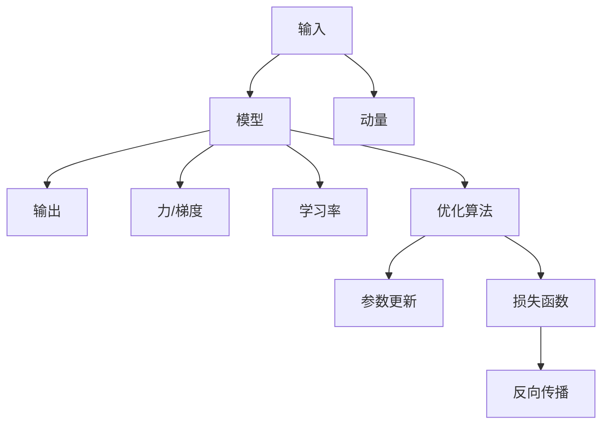

                 

## 1. 背景介绍

牛顿力学，作为经典物理学的重要基石，其深刻的物理意义和数学表达，不仅在物理学领域有着举足轻重的地位，还对现代人工智能（AI）产生了深远的影响。在AI的算法设计、优化策略以及应用模型中，牛顿力学的思想和方法经常被借鉴和运用。

## 2. 核心概念与联系

### 2.1 核心概念概述

牛顿力学主要包括以下几个核心概念：

- **力**：作用在物体上并改变其运动状态的因素。
- **动量**：物体的质量和速度的乘积，代表物体运动状态的惯性。
- **加速度**：物体速度随时间变化的速率，与物体所受合力成正比。
- **运动方程**：描述物体运动的微分方程，包括牛顿第二运动定律。
- **守恒定律**：牛顿第一、第三定律，描述力与运动的守恒关系。

这些概念在AI中亦有对应，例如：

- **输入**：作用于模型的数据流，驱动模型输出发生变化。
- **动量**：模型的历史状态，如梯度累积，影响后续优化。
- **学习率**：调整模型参数更新的速率。
- **优化算法**：描述模型参数更新的动态规则。
- **损失函数**：衡量模型预测与真实标签之间的差异，描述模型优化目标。

### 2.2 核心概念原理和架构的 Mermaid 流程图



该图展示了输入如何通过模型转化为输出，模型的动量如何影响参数更新，以及损失函数和优化算法如何共同作用于模型的参数更新。

## 3. 核心算法原理 & 具体操作步骤

### 3.1 算法原理概述

在AI中，牛顿力学的主要作用是通过对力、动量、加速度等概念的类比，优化模型的训练过程。具体来说，牛顿力学的应用主要体现在以下几个方面：

- **梯度下降算法**：类比牛顿第二运动定律，通过计算参数的梯度来指导参数的更新方向。
- **动量优化**：类比牛顿力学中的动量概念，通过累积历史梯度来稳定参数更新，防止震荡。
- **自适应学习率**：通过自适应调整学习率，保证模型在各阶段的稳定性和收敛速度。
- **正则化**：通过增加模型的惯性，避免过拟合，确保模型的泛化能力。

### 3.2 算法步骤详解

#### 3.2.1 梯度下降算法

梯度下降算法是牛顿力学在AI中最直观的应用。具体步骤包括：

1. **初始化模型参数**：随机初始化模型参数。
2. **计算梯度**：计算损失函数对每个参数的偏导数。
3. **更新参数**：根据梯度的方向和大小，更新模型参数。
4. **重复迭代**：重复以上步骤，直到收敛或达到预设的迭代次数。

公式表示为：
$$
\theta_{t+1} = \theta_t - \eta \nabla_\theta L(\theta_t)
$$

其中，$\theta_t$ 表示第 $t$ 次迭代的模型参数，$\eta$ 是学习率，$\nabla_\theta L(\theta_t)$ 是损失函数 $L$ 对 $\theta$ 的梯度。

#### 3.2.2 动量优化

动量优化通过累积历史梯度，进一步稳定参数更新，防止梯度下降过程中的震荡。具体步骤如下：

1. **初始化动量参数**：随机初始化动量参数 $\Delta_t$。
2. **计算梯度**：计算损失函数对每个参数的偏导数。
3. **计算动量更新**：根据动量参数和梯度的方向，更新动量参数。
4. **更新参数**：根据动量和梯度的方向，更新模型参数。
5. **重复迭代**：重复以上步骤，直到收敛或达到预设的迭代次数。

公式表示为：
$$
v_{t+1} = \beta v_t + (1-\beta) \nabla_\theta L(\theta_t)
$$
$$
\theta_{t+1} = \theta_t - \eta v_{t+1}
$$

其中，$v_t$ 是第 $t$ 次迭代的动量参数，$\beta$ 是动量参数的衰减系数，$\eta$ 是学习率。

#### 3.2.3 自适应学习率

自适应学习率算法通过动态调整学习率，确保模型在各阶段的稳定性和收敛速度。常见的自适应学习率算法包括AdaGrad、RMSProp和Adam等。

AdaGrad算法根据每个参数的历史梯度平方和，动态调整学习率。公式为：
$$
G_t = G_{t-1} + \nabla_\theta L(\theta_t)
$$
$$
\theta_{t+1} = \theta_t - \frac{\eta}{\sqrt{G_t} + \epsilon} \nabla_\theta L(\theta_t)
$$

RMSProp算法则使用移动平均的方式来平滑历史梯度的方差。公式为：
$$
v_{t+1} = \beta v_t + (1-\beta) \nabla_\theta L(\theta_t)^2
$$
$$
\theta_{t+1} = \theta_t - \frac{\eta}{\sqrt{v_{t+1}} + \epsilon} \nabla_\theta L(\theta_t)
$$

Adam算法结合了动量优化和RMSProp的优点，通过计算梯度的移动平均和平方移动平均，自适应调整学习率。公式为：
$$
m_t = \beta_1 m_{t-1} + (1-\beta_1) \nabla_\theta L(\theta_t)
$$
$$
v_t = \beta_2 v_{t-1} + (1-\beta_2) \nabla_\theta L(\theta_t)^2
$$
$$
\hat{m}_t = \frac{m_t}{1-\beta_1^t}
$$
$$
\hat{v}_t = \frac{v_t}{1-\beta_2^t}
$$
$$
\theta_{t+1} = \theta_t - \frac{\eta}{\sqrt{\hat{v}_t} + \epsilon} \hat{m}_t
$$

其中，$\beta_1$ 和 $\beta_2$ 是移动平均的衰减系数，$\epsilon$ 是数值稳定项。

### 3.3 算法优缺点

#### 3.3.1 优点

1. **收敛速度快**：动量和自适应学习率算法能够更快地收敛到最优解，提高模型训练效率。
2. **稳定性高**：通过动量和自适应学习率，模型能够避免梯度下降过程中的震荡，保证训练的稳定性。
3. **自适应性强**：自适应学习率算法能够根据每个参数的表现动态调整学习率，适应复杂的优化环境。

#### 3.3.2 缺点

1. **模型复杂度高**：动量和自适应学习率算法增加了模型的计算量和存储量，可能导致训练速度变慢。
2. **参数调整难度大**：需要调整动量参数、学习率衰减系数等超参数，调整不当可能导致训练不稳定。
3. **过拟合风险增加**：自适应学习率算法可能会过度拟合，导致模型在训练集上表现优异，但在测试集上表现不佳。

### 3.4 算法应用领域

牛顿力学在AI中的应用领域广泛，包括但不限于以下方面：

1. **深度学习模型训练**：梯度下降算法、动量优化和自适应学习率算法广泛应用于深度学习模型的训练过程。
2. **优化问题求解**：牛顿法用于求解非线性优化问题，如线性回归、逻辑回归等。
3. **强化学习**：牛顿法用于求解强化学习中的动作选择问题。
4. **计算机视觉**：用于图像处理和识别中的参数优化。
5. **自然语言处理**：应用于文本分类、情感分析等NLP任务的模型优化。

## 4. 数学模型和公式 & 详细讲解 & 举例说明

### 4.1 数学模型构建

牛顿力学与AI的数学模型构建有紧密的联系。以牛顿第二运动定律为例，其数学模型为：
$$
F = ma
$$
其中，$F$ 是作用在物体上的力，$m$ 是物体的质量，$a$ 是物体的加速度。

在AI中，可以将力 $F$ 类比为模型中的梯度，质量 $m$ 类比为模型参数的动量，加速度 $a$ 类比为模型的学习率。

### 4.2 公式推导过程

以梯度下降算法为例，推导其数学模型。

设模型参数为 $\theta$，损失函数为 $L$，学习率为 $\eta$。梯度下降算法可以表示为：
$$
\theta_{t+1} = \theta_t - \eta \nabla_\theta L(\theta_t)
$$

对上式进行变形，得到：
$$
\nabla_\theta L(\theta_t) = \theta_{t+1} - \theta_t
$$
$$
\theta_{t+1} = \theta_t - \eta (\theta_{t+1} - \theta_t)
$$

进一步整理得到：
$$
(1 + \eta) \theta_{t+1} = (1 - \eta) \theta_t
$$

因此：
$$
\theta_{t+1} = \frac{1 - \eta}{1 + \eta} \theta_t
$$

这表明，每次更新后，模型参数会按照比例 $\frac{1 - \eta}{1 + \eta}$ 进行缩放。

### 4.3 案例分析与讲解

以一个简单的线性回归问题为例，分析牛顿力学的应用。

假设有一个线性回归问题，模型为：
$$
y = \theta_0 + \theta_1 x
$$

给定一组数据 $(x_i, y_i)$，我们要找到最优的 $\theta_0$ 和 $\theta_1$。使用梯度下降算法，需要计算梯度：
$$
\nabla_\theta L(\theta) = \frac{1}{n} \sum_{i=1}^n \nabla_\theta (\theta_0 + \theta_1 x_i - y_i)^2
$$
$$
\nabla_\theta L(\theta) = \frac{1}{n} \sum_{i=1}^n (-2) (x_i - \hat{x}_i)
$$

其中，$\hat{x}_i = \theta_0 + \theta_1 x_i$ 是模型的预测值。

使用牛顿第二运动定律，可以将其转化为：
$$
F = -2n(\hat{x}_i - y_i)
$$
$$
m \ddot{x} = F
$$

其中，$m$ 表示模型参数的动量，$\ddot{x}$ 表示参数的加速度。

进一步得到：
$$
m \ddot{x} = -2n(\theta_0 + \theta_1 x_i - y_i)
$$

这就是使用牛顿力学在AI中进行参数优化的数学模型。

## 5. 项目实践：代码实例和详细解释说明

### 5.1 开发环境搭建

在进行牛顿力学的应用开发前，需要准备好开发环境。以下是使用Python进行TensorFlow开发的环境配置流程：

1. 安装Anaconda：从官网下载并安装Anaconda，用于创建独立的Python环境。

2. 创建并激活虚拟环境：
```bash
conda create -n tf-env python=3.8 
conda activate tf-env
```

3. 安装TensorFlow：
```bash
pip install tensorflow==2.7
```

4. 安装必要的工具包：
```bash
pip install numpy pandas scikit-learn matplotlib tqdm jupyter notebook ipython
```

完成上述步骤后，即可在`tf-env`环境中开始牛顿力学的应用实践。

### 5.2 源代码详细实现

下面我们以一个简单的线性回归问题为例，给出使用TensorFlow进行牛顿力学的代码实现。

```python
import tensorflow as tf
import numpy as np
import matplotlib.pyplot as plt

# 生成样本数据
x = np.random.randn(100)
y = 3 * x + 2 + np.random.randn(100)

# 定义模型
theta_0 = tf.Variable(tf.random.normal([1]))
theta_1 = tf.Variable(tf.random.normal([1]))

# 定义损失函数
def loss_function(x, y):
    return tf.reduce_mean(tf.square(y - theta_0 - theta_1 * x))

# 定义优化器
optimizer = tf.optimizers.SGD(learning_rate=0.01)

# 定义优化过程
def train_step(x, y):
    with tf.GradientTape() as tape:
        current_loss = loss_function(x, y)
    gradients = tape.gradient(current_loss, [theta_0, theta_1])
    optimizer.apply_gradients(zip(gradients, [theta_0, theta_1]))

# 训练模型
for i in range(1000):
    train_step(x, y)
    if i % 100 == 0:
        print(f"Iteration {i}, loss: {loss_function(x, y).numpy()}")

# 测试模型
y_pred = theta_0.numpy() + theta_1.numpy() * x
plt.plot(x, y_pred, label='Prediction')
plt.plot(x, y, 'ro', label='Actual')
plt.legend()
plt.show()
```

### 5.3 代码解读与分析

让我们再详细解读一下关键代码的实现细节：

**线性回归问题**：
- 生成100个样本数据，用于训练和测试模型。
- 定义模型参数 $\theta_0$ 和 $\theta_1$。
- 定义损失函数为均方误差损失函数。

**优化器**：
- 使用SGD优化器，设置学习率为0.01。

**优化过程**：
- 每次迭代使用梯度下降算法，计算梯度并更新模型参数。
- 打印每次迭代的损失函数值。

**测试模型**：
- 使用训练好的模型进行预测，并在图中展示预测结果和实际数据。

通过上述代码，我们可以看到如何使用TensorFlow实现牛顿力学的应用，通过梯度下降算法不断优化模型参数，最终得到较为准确的预测结果。

## 6. 实际应用场景

### 6.1 牛顿力学的实际应用场景

牛顿力学在AI中的应用场景广泛，下面列举几个典型的应用场景：

1. **深度学习模型的训练**：在深度学习模型训练过程中，使用梯度下降算法、动量优化和自适应学习率算法进行模型参数的优化。
2. **优化问题的求解**：在求解线性回归、逻辑回归等优化问题时，使用牛顿法进行参数优化。
3. **强化学习**：在强化学习中，使用牛顿法进行动作选择问题的求解。
4. **计算机视觉**：在图像处理和识别中，使用牛顿法进行参数优化。
5. **自然语言处理**：在文本分类、情感分析等NLP任务中，使用牛顿法进行模型优化。

## 7. 工具和资源推荐

### 7.1 学习资源推荐

为了帮助开发者系统掌握牛顿力学的应用，这里推荐一些优质的学习资源：

1. 《深度学习》课程（Coursera）：斯坦福大学的Andrew Ng教授讲授的深度学习课程，系统介绍深度学习的基础知识和算法。
2. 《Python深度学习》书籍：Francois Chollet所著，详细介绍TensorFlow和Keras的使用。
3. 《TensorFlow官方文档》：TensorFlow官方提供的文档，包含详细的API文档和教程。
4. 《强化学习》课程（Coursera）：David Silver教授讲授的强化学习课程，详细介绍强化学习的基本理论和算法。
5. 《机器学习》书籍（周志华）：全面介绍机器学习的基础知识和算法，包括梯度下降、优化算法等。

通过对这些资源的学习实践，相信你一定能够快速掌握牛顿力学的应用，并用于解决实际的AI问题。

### 7.2 开发工具推荐

高效的开发离不开优秀的工具支持。以下是几款用于牛顿力学应用开发的常用工具：

1. TensorFlow：由Google主导开发的开源深度学习框架，生产部署方便，适合大规模工程应用。
2. PyTorch：由Facebook主导开发的开源深度学习框架，灵活性高，适合研究性应用。
3. Scikit-learn：Python机器学习库，提供了丰富的优化算法和数据预处理工具。
4. Keras：高层次神经网络API，基于TensorFlow和Theano，易于使用，适合快速原型开发。
5. Weights & Biases：模型训练的实验跟踪工具，可以记录和可视化模型训练过程中的各项指标，方便对比和调优。
6. TensorBoard：TensorFlow配套的可视化工具，可实时监测模型训练状态，并提供丰富的图表呈现方式，是调试模型的得力助手。

合理利用这些工具，可以显著提升牛顿力学应用开发的效率，加快创新迭代的步伐。

### 7.3 相关论文推荐

牛顿力学的应用研究涉及多个领域，以下是几篇奠基性的相关论文，推荐阅读：

1. "On the Optimization of Deep Learning Models" by Geoffrey Hinton：讨论了深度学习模型的优化算法。
2. "Acceleration of Stochastic Optimization Using Momentum" by Sebastian Ruder：介绍了动量优化算法。
3. "Adam: A Method for Stochastic Optimization" by Kingma and Ba：介绍了自适应学习率算法Adam。
4. "Learning Rate Adaptation in Deep Learning" by Charles M. Carpenters：讨论了自适应学习率算法的原理和应用。
5. "TensorFlow: A System for Large-Scale Machine Learning" by Abdel-rahman Mohamed et al：介绍了TensorFlow的架构和应用。

这些论文代表了大规模机器学习算法的研究进展，通过学习这些前沿成果，可以帮助研究者把握学科前进方向，激发更多的创新灵感。

## 8. 总结：未来发展趋势与挑战

### 8.1 总结

本文对牛顿力学在AI中的应用进行了全面系统的介绍。首先阐述了牛顿力学的核心概念和其在AI中的类比，明确了牛顿力学在优化算法、动量更新等方面的重要贡献。其次，从原理到实践，详细讲解了牛顿力学的应用，给出了TensorFlow实现牛顿力学应用的完整代码实例。同时，本文还广泛探讨了牛顿力学在深度学习、优化问题、强化学习等领域的广泛应用，展示了牛顿力学在AI中的强大潜力。

通过本文的系统梳理，可以看到，牛顿力学在AI中的应用，不仅在算法设计中提供了重要的数学工具，还在优化策略、参数更新等方面提供了理论基础。未来，牛顿力学的应用将进一步深化和拓展，成为AI算法优化中的重要方法之一。

### 8.2 未来发展趋势

展望未来，牛顿力学在AI中的应用将呈现以下几个发展趋势：

1. **算法融合**：牛顿力学与其他优化算法的融合，如遗传算法、粒子群算法等，将产生新的优化方法，适用于更加复杂的优化问题。
2. **自适应学习率算法**：自适应学习率算法将继续发展，引入更多自适应策略，提高模型的稳定性和收敛速度。
3. **多目标优化**：牛顿力学将用于解决多目标优化问题，适用于更加复杂的应用场景。
4. **分布式优化**：分布式优化算法将结合牛顿力学的思想，适用于大规模数据集和计算环境。
5. **理论研究**：牛顿力学在AI中的应用将引发更多理论研究，探索其更广泛的应用领域。

### 8.3 面临的挑战

尽管牛顿力学在AI中的应用已经取得了显著成果，但在迈向更加智能化、普适化应用的过程中，它仍面临着诸多挑战：

1. **算法复杂度高**：牛顿力学算法需要计算更多的梯度和矩阵运算，导致计算复杂度高，可能限制其在大规模数据集上的应用。
2. **参数调整难度大**：需要调整的超参数较多，调整不当可能导致算法性能下降。
3. **过拟合风险高**：牛顿力学算法可能会过度拟合，导致模型在训练集上表现优异，但在测试集上表现不佳。
4. **多目标优化困难**：牛顿力学算法在多目标优化问题上的表现尚不如其他算法，需要进一步优化。
5. **分布式计算挑战**：牛顿力学算法在大规模分布式计算环境中的应用还需进一步探索。

### 8.4 研究展望

面对牛顿力学在AI应用中的挑战，未来的研究需要在以下几个方面寻求新的突破：

1. **算法优化**：通过算法优化，提高牛顿力学的计算效率，降低参数调整的难度。
2. **多目标优化**：引入多目标优化算法，提高牛顿力学在多目标优化问题上的表现。
3. **分布式计算**：探索分布式计算技术，优化牛顿力学在大规模数据集上的应用。
4. **理论与实践结合**：加强理论与实践的结合，推动牛顿力学在AI中的应用研究。
5. **跨领域应用**：探索牛顿力学的跨领域应用，如生物信息学、金融学等领域。

这些研究方向的探索，必将引领牛顿力学在AI中的应用走向更高的台阶，为构建智能系统提供更加强大的优化工具。

## 9. 附录：常见问题与解答

**Q1: 牛顿力学在AI中的作用是什么？**

A: 牛顿力学在AI中的应用主要体现在优化算法和动量更新等方面。牛顿力学通过类比力、动量和加速度，设计了梯度下降算法、动量优化和自适应学习率算法，极大地提高了模型的训练效率和稳定性。

**Q2: 牛顿力学在AI中的应用有哪些？**

A: 牛顿力学在AI中的应用广泛，包括深度学习模型的训练、优化问题的求解、强化学习、计算机视觉、自然语言处理等。通过使用牛顿力学算法，可以在这些领域内提升模型的性能和泛化能力。

**Q3: 如何提高牛顿力学的计算效率？**

A: 可以通过算法优化、引入多目标优化算法、探索分布式计算技术等方法，提高牛顿力学的计算效率，降低参数调整的难度。

**Q4: 牛顿力学在多目标优化问题上的表现如何？**

A: 牛顿力学在多目标优化问题上的表现尚不如其他算法，需要进一步优化和研究。

**Q5: 如何加强理论与实践的结合？**

A: 加强理论与实践的结合，可以通过跨学科合作、实际应用案例的积累、科研论文的发表等方法，推动牛顿力学在AI中的应用研究。

通过本文的系统梳理，可以看到，牛顿力学在AI中的应用，不仅在算法设计中提供了重要的数学工具，还在优化策略、参数更新等方面提供了理论基础。未来，牛顿力学的应用将进一步深化和拓展，成为AI算法优化中的重要方法之一。

