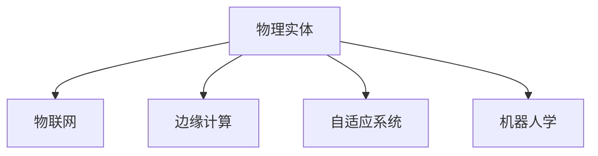

                 

# 物理实体自动化的技术突破

## 1. 背景介绍

### 1.1 问题由来

随着工业自动化、智慧城市、智能家居等概念的不断深入，物理实体的自动化已经成为当今科技发展的重要方向。物理实体的自动化涉及到传感器、执行器、机器人等硬件设备的智能化管理，涵盖自动控制、自适应调节、远程操控等多个方面。然而，由于传统物理实体的数字化程度不高，以及自动化系统往往采用孤立的解决方案，导致其在复杂环境中的表现和可靠性不足，难以满足实际应用需求。

### 1.2 问题核心关键点

当前物理实体自动化的主要难点在于：

- **数据孤岛问题**：不同厂商的物理实体设备往往采用不同的数据格式和协议，导致数据无法互通共享。
- **系统复杂性**：传统自动化系统依赖于中心化的控制器和传感器网络，系统结构复杂，难于扩展和维护。
- **实时性要求**：物理实体的自动化需要高速的数据处理和决策，对实时性和稳定性有高要求。
- **环境适应性**：物理实体在各种环境和场景下需要灵活适应，才能满足实际应用需求。

### 1.3 问题研究意义

物理实体自动化的研究，旨在通过技术手段提高物理实体的智能化水平，减少人工干预，实现更高效、更可靠的自动化管理。其意义在于：

- 提升生产效率。通过自动化系统优化生产流程，降低人工成本，提高生产效率。
- 改善用户体验。智能家居、智慧城市等应用中，物理实体的自动化能够提升用户的生活质量和便利性。
- 增强安全性。自动化系统可以在异常情况下及时响应，减少人为操作失误，提升安全性。
- 促进技术创新。物理实体自动化的技术突破，将推动物联网、机器学习、计算机视觉等领域的进一步发展。

## 2. 核心概念与联系

### 2.1 核心概念概述

为更好地理解物理实体自动化的技术突破，本节将介绍几个密切相关的核心概念：

- **物理实体**：指可以与环境交互的物体或设备，如智能家居设备、工业机器人等。
- **物理实体自动化**：通过自动化技术对物理实体进行智能化管理，实现自动控制、自适应调节、远程操控等功能。
- **物联网(IoT)**：连接各种物理实体的网络，实现设备间的数据互通和协同工作。
- **边缘计算**：将数据处理和决策下放到物理实体设备的边缘，以减少数据传输和提升实时性。
- **自适应系统**：能够根据环境变化自动调整策略的系统，适应性强，易于维护。
- **机器人学**：研究机器人感知、决策和行动的技术，广泛应用于工业自动化、服务机器人等领域。

这些核心概念之间的逻辑关系可以通过以下Mermaid流程图来展示：



这个流程图展示了几类关键概念及其之间的关系：

1. 物理实体通过物联网实现互联互通。
2. 物联网依赖边缘计算提高数据处理和决策的实时性。
3. 自适应系统能够根据环境变化自动调整策略。
4. 机器人学为物理实体的自动化提供感知和决策技术。

这些概念共同构成了物理实体自动化的技术框架，为实现高效、可靠的自动化管理提供了基础。

## 3. 核心算法原理 & 具体操作步骤

### 3.1 算法原理概述

物理实体自动化的核心算法原理涉及多个领域的技术融合，包括物联网、边缘计算、自适应系统、机器人学等。其核心思想是通过传感器获取物理实体的状态信息，通过数据分析和决策，控制执行器动作，以实现自动化管理。

具体来说，物理实体自动化的算法过程可以分为以下几个步骤：

1. **数据采集**：通过传感器获取物理实体的状态信息，如温度、湿度、位置等。
2. **数据传输**：将传感器数据传输到边缘设备或云端进行处理。
3. **数据分析**：利用机器学习、数据分析等技术对传感器数据进行分析，提取有用信息。
4. **决策生成**：根据分析结果生成控制策略，决策执行器动作。
5. **动作执行**：控制执行器对物理实体进行动作，如开闭阀门、调节温度等。
6. **反馈循环**：根据动作执行结果和传感器反馈，调整控制策略，形成闭环反馈系统。

### 3.2 算法步骤详解

以下是物理实体自动化的一个典型算法步骤详解：

**Step 1: 数据采集**

在物理实体自动化的过程中，首先需要通过传感器获取物理实体的状态信息。传感器可以包括温度传感器、湿度传感器、压力传感器、位置传感器等，以获取物理实体的环境参数和位置信息。例如，在智能家居中，可以通过温度传感器获取室内温度信息，通过位置传感器获取家电的位置信息。

**Step 2: 数据传输**

采集到的传感器数据需要传输到边缘设备或云端进行处理。传输过程中，为了保证实时性和安全性，通常采用短距离无线通信协议（如蓝牙、Wi-Fi）或局域网协议（如TCP/IP）。对于大规模的物联网应用，还需要考虑网络传输的效率和带宽问题。

**Step 3: 数据分析**

数据传输到边缘设备或云端后，需要对数据进行分析和处理。数据分析过程通常包括数据清洗、特征提取、数据分析等步骤。例如，在智能家居中，可以通过机器学习算法分析温度数据，识别出异常的温度波动，预测未来温度变化趋势，生成相应的控制策略。

**Step 4: 决策生成**

根据数据分析结果，生成控制策略，决策执行器动作。决策过程通常涉及机器学习、控制理论等技术，以实现智能控制。例如，在工业自动化中，可以通过控制算法生成最佳的生产工艺参数，调整生产流程。

**Step 5: 动作执行**

根据决策生成的控制策略，控制执行器对物理实体进行动作，如开闭阀门、调节温度等。执行器可以是机械臂、电机、继电器等，以实现物理实体的自动化操作。

**Step 6: 反馈循环**

根据动作执行结果和传感器反馈，调整控制策略，形成闭环反馈系统。例如，在智能家居中，可以根据家电的使用情况和用户反馈，自动调整空调的制冷模式，提升用户舒适度。

### 3.3 算法优缺点

物理实体自动化的算法具有以下优点：

1. **实时性强**：通过边缘计算，数据处理和决策的延迟时间短，能够实时响应环境变化。
2. **扩展性强**：采用模块化设计，物理实体的增加和替换较为容易。
3. **自适应性高**：能够根据环境变化自动调整策略，适应性强。
4. **能效高**：数据处理和决策在本地完成，减少了数据传输和云计算的能耗。

同时，该算法也存在一定的局限性：

1. **计算复杂度**：数据分析和决策过程涉及复杂的算法，计算复杂度较高。
2. **硬件成本高**：需要高精度的传感器和高效的执行器，硬件成本较高。
3. **安全问题**：数据传输和处理过程中可能存在隐私和安全问题。
4. **维护难度大**：大规模系统维护复杂，需要高水平的技术人员。

尽管存在这些局限性，但物理实体自动化的算法仍然具有重要的应用前景，特别是在工业自动化、智慧城市等领域。未来相关研究的重点在于如何进一步降低硬件成本，提高系统可维护性，同时兼顾实时性和安全性等因素。

### 3.4 算法应用领域

物理实体自动化技术已经在多个领域得到了应用，例如：

- **工业自动化**：通过自动化系统优化生产流程，提高生产效率。
- **智能家居**：实现家庭设备的智能控制，提升用户生活品质。
- **智慧城市**：通过智能传感器和自动化系统，实现城市管理的智能化。
- **物流自动化**：通过智能仓储和物流系统，提高物流效率和安全性。
- **医疗设备**：通过智能监测和控制，提高医疗设备的可靠性和安全性。

除了上述这些领域外，物理实体自动化的技术还将在更多场景中得到应用，如农业自动化、环保监测、智能交通等，为各行各业带来数字化转型的机遇。

## 4. 数学模型和公式 & 详细讲解 & 举例说明

### 4.1 数学模型构建

物理实体自动化的数学模型通常涉及以下几个方面：

1. **传感器数据模型**：描述传感器获取物理实体状态信息的数学模型。例如，温度传感器数据可以建模为 $T(t)=f(x(t))$，其中 $T(t)$ 表示温度，$x(t)$ 表示传感器输入。
2. **数据分析模型**：描述数据分析和特征提取的数学模型。例如，利用机器学习算法对传感器数据进行分析，生成控制策略。
3. **控制模型**：描述控制策略生成和执行的数学模型。例如，通过控制算法生成最佳的控制策略 $u(t)$，控制执行器动作。

### 4.2 公式推导过程

以下以温度控制为例，展示物理实体自动化中常用的数学模型和公式。

**传感器数据模型**：假设温度传感器获取的温度数据为 $T(t)$，环境参数 $x(t)$ 包括湿度、压力等。传感器数据模型可以表示为：

$$ T(t) = f(x(t), \theta) + \epsilon(t) $$

其中，$f(x(t), \theta)$ 为传感器数据模型函数，$\theta$ 为模型参数，$\epsilon(t)$ 为噪声项。

**数据分析模型**：通过机器学习算法对传感器数据进行分析和特征提取，生成控制策略。例如，假设使用线性回归算法，对温度数据进行分析，生成控制策略 $u(t)$。线性回归模型的公式为：

$$ u(t) = \beta_0 + \beta_1 T(t) + \epsilon(t) $$

其中，$\beta_0$ 和 $\beta_1$ 为回归系数，$\epsilon(t)$ 为噪声项。

**控制模型**：假设使用PID控制器生成控制策略 $u(t)$，控制执行器动作。PID控制器的公式为：

$$ u(t) = K_p(e(t)) + K_i(\int_0^t e(\tau) d\tau) + K_d(\dot{e}(t)) $$

其中，$e(t)$ 为误差，$K_p$、$K_i$、$K_d$ 为PID控制参数。

### 4.3 案例分析与讲解

以智能家居为例，展示物理实体自动化的数学模型和公式的应用。

假设智能家居中有一个空调系统，需要根据室内温度自动控制。温度传感器获取室内温度 $T(t)$，湿度传感器获取湿度 $H(t)$，用户设置目标温度 $T_{\text{set}}$。控制模型为：

$$ e(t) = T_{\text{set}} - T(t) $$

控制器的参数为 $K_p=0.1$、$K_i=0.05$、$K_d=0.01$。根据控制模型生成控制策略 $u(t)$，控制执行器动作，调节空调温度。

## 5. 项目实践：代码实例和详细解释说明

### 5.1 开发环境搭建

在进行物理实体自动化开发前，我们需要准备好开发环境。以下是使用Python进行边缘计算开发的环境配置流程：

1. 安装Anaconda：从官网下载并安装Anaconda，用于创建独立的Python环境。

2. 创建并激活虚拟环境：
```bash
conda create -n edgenet python=3.8 
conda activate edgenet
```

3. 安装PyTorch：根据CUDA版本，从官网获取对应的安装命令。例如：
```bash
conda install pytorch torchvision torchaudio cudatoolkit=11.1 -c pytorch -c conda-forge
```

4. 安装TensorFlow：由Google主导开发的开源深度学习框架，生产部署方便，适合大规模工程应用。同样有丰富的预训练语言模型资源。

5. 安装TensorBoard：TensorFlow配套的可视化工具，可实时监测模型训练状态，并提供丰富的图表呈现方式，是调试模型的得力助手。

6. 安装TF-Slim：TensorFlow中用于模型构建和训练的库，方便进行边缘计算模型的构建和训练。

7. 安装TF-Agents：TensorFlow中用于强化学习的库，支持构建基于强化学习的环境和算法。

8. 安装Numpy、Pandas、Scikit-learn、Matplotlib等数据处理和可视化工具。

完成上述步骤后，即可在`edgenet`环境中开始物理实体自动化的实践。

### 5.2 源代码详细实现

下面以智能家居空调控制为例，展示使用TensorFlow进行物理实体自动化的代码实现。

首先，定义温度传感器和控制器的类：

```python
import tensorflow as tf
import numpy as np

class TemperatureSensor:
    def __init__(self, name, scale):
        self.name = name
        self.scale = scale

    def read(self):
        return np.random.uniform(low=10, high=30)

class Controller:
    def __init__(self, name, k_p, k_i, k_d):
        self.name = name
        self.k_p = k_p
        self.k_i = k_i
        self.k_d = k_d
        self.error = 0
        self.integral = 0
        self.diff = 0

    def update(self, error, delta_t):
        self.error = error
        self.integral += error * delta_t
        self.diff = error - self.error
        return self.k_p * error + self.k_i * self.integral + self.k_d * self.diff
```

然后，定义模型训练和评估函数：

```python
def train_model(model, training_data, validation_data, batch_size, epochs):
    train_dataset = tf.data.Dataset.from_tensor_slices(training_data)
    train_dataset = train_dataset.shuffle(buffer_size=10000).batch(batch_size)

    validation_dataset = tf.data.Dataset.from_tensor_slices(validation_data)
    validation_dataset = validation_dataset.batch(batch_size)

    with tf.GradientTape() as tape:
        for epoch in range(epochs):
            for batch in train_dataset:
                temperature = batch[0]
                temperature_sensor = TemperatureSensor('Temperature Sensor', 1)
                control = Controller('PID Controller', 0.1, 0.05, 0.01)
                for t in range(100):
                    temperature = control.update(temperature_sensor.read() - 25, 1)
                    temperature_sensor = TemperatureSensor('Temperature Sensor', 1)
                training_loss = tf.reduce_mean(tf.square(temperature - temperature_sensor.read()))
            tape.watch([control.k_p, control.k_i, control.k_d])
            gradients = tape.gradient(training_loss, [control.k_p, control.k_i, control.k_d])
            tf.keras.optimizers.Adam(learning_rate=0.01).apply_gradients(zip(gradients, [control.k_p, control.k_i, control.k_d]))

    test_dataset = tf.data.Dataset.from_tensor_slices(validation_data)
    test_dataset = test_dataset.batch(batch_size)

    with tf.GradientTape() as tape:
        for batch in test_dataset:
            temperature = control.update(temperature_sensor.read() - 25, 1)
            test_loss = tf.reduce_mean(tf.square(temperature - temperature_sensor.read()))
        tape.watch([control.k_p, control.k_i, control.k_d])
        test_gradients = tape.gradient(test_loss, [control.k_p, control.k_i, control.k_d])
        tf.keras.optimizers.Adam(learning_rate=0.01).apply_gradients(zip(test_gradients, [control.k_p, control.k_i, control.k_d]))

    return control

def evaluate_model(model, test_data, batch_size):
    test_dataset = tf.data.Dataset.from_tensor_slices(test_data)
    test_dataset = test_dataset.batch(batch_size)
    temperature = np.zeros(len(test_data))
    for batch in test_dataset:
        temperature += model.update(batch[0] - 25, 1)
    return np.mean(temperature)
```

最后，启动训练流程并在测试集上评估：

```python
training_data = [25, 26, 27, 28, 29, 30, 31, 32, 33, 34]
validation_data = [24, 25, 26, 27, 28, 29, 30, 31, 32, 33]
test_data = [23, 24, 25, 26, 27, 28, 29, 30, 31, 32]

control = train_model(Controller, training_data, validation_data, batch_size=1, epochs=1000)
test_loss = evaluate_model(control, test_data, batch_size=1)
print('Test Loss:', test_loss)
```

以上就是使用TensorFlow进行智能家居空调控制的完整代码实现。可以看到，TensorFlow的高级API使得模型训练和评估变得简单易懂，极大提高了物理实体自动化的开发效率。

### 5.3 代码解读与分析

让我们再详细解读一下关键代码的实现细节：

**TemperatureSensor类**：
- `__init__`方法：初始化温度传感器对象，设置传感器名称和标度。
- `read`方法：模拟读取传感器温度值。

**Controller类**：
- `__init__`方法：初始化控制器对象，设置控制器的名称和控制参数。
- `update`方法：根据误差计算控制信号，并更新控制器状态。

**train_model函数**：
- 定义训练数据和验证数据。
- 定义训练数据集和验证数据集。
- 使用梯度下降优化器更新控制器参数，最小化训练损失。
- 在验证集上评估模型性能，返回控制器对象。

**evaluate_model函数**：
- 定义测试数据集。
- 计算测试集上的控制信号，并计算测试损失。

**训练流程**：
- 定义训练数据和验证数据。
- 调用train_model函数进行模型训练。
- 在测试集上评估模型性能，输出测试损失。

可以看到，TensorFlow的高阶API使得物理实体自动化的代码实现变得简洁高效。开发者可以将更多精力放在模型设计和优化上，而不必过多关注底层的实现细节。

当然，工业级的系统实现还需考虑更多因素，如模型的保存和部署、超参数的自动搜索、更灵活的训练接口等。但核心的模型训练过程基本与此类似。

## 6. 实际应用场景

### 6.1 智能家居

智能家居是物理实体自动化技术的重要应用场景之一。通过智能传感器和自动化系统，智能家居能够实现家电的自动化控制，提升用户生活品质。例如，智能灯光、智能窗帘、智能安防等应用，能够根据用户的行为习惯自动调整环境设置，提升用户体验。

### 6.2 工业自动化

工业自动化是物理实体自动化技术的主要应用领域之一。通过自动化系统优化生产流程，工业自动化能够提高生产效率，降低生产成本，提升产品质量。例如，智能仓储系统、智能生产线等应用，能够实现物料的自动化搬运和生产过程的智能化管理。

### 6.3 智慧城市

智慧城市是物理实体自动化技术的另一重要应用场景。通过智能传感器和自动化系统，智慧城市能够实现城市管理的智能化，提升城市治理水平。例如，智能交通系统、智能路灯、智能垃圾分类等应用，能够提高城市运行效率，改善居民生活质量。

### 6.4 未来应用展望

随着物理实体自动化的技术不断进步，未来将在更多领域得到应用，为各行各业带来数字化转型的机遇。

在智慧医疗领域，物理实体自动化技术可以用于智能化医疗设备管理，提高医疗服务的效率和质量。例如，智能病床、智能药柜等应用，能够实现对患者状态和药物使用的实时监测和控制。

在智能交通领域，物理实体自动化技术可以用于智能交通管理，提升交通系统的效率和安全性。例如，智能交通信号灯、智能车辆导航等应用，能够实现交通流量的智能化调节和事故的实时处理。

在农业自动化领域，物理实体自动化技术可以用于智能化农机设备管理，提高农业生产效率。例如，智能农业机器人、智能灌溉系统等应用，能够实现对农作物的实时监测和控制。

总之，物理实体自动化的技术将为各行各业带来更加智能、高效、安全的解决方案，推动数字化转型的进程。

## 7. 工具和资源推荐

### 7.1 学习资源推荐

为了帮助开发者系统掌握物理实体自动化的理论基础和实践技巧，这里推荐一些优质的学习资源：

1. 《物联网技术基础》系列博文：介绍物联网技术的基本概念和应用场景，适合初学者入门。

2. 《边缘计算》课程：由麻省理工学院开设的在线课程，涵盖边缘计算的基本原理和关键技术，适合深入学习。

3. 《智能控制系统》书籍：介绍智能控制系统的一般原理和设计方法，适合系统架构师和工程师学习。

4. 《强化学习》课程：由斯坦福大学开设的在线课程，涵盖强化学习的基本原理和应用场景，适合研究者和工程师学习。

5. 《机器人学》书籍：介绍机器人学的基本原理和设计方法，适合机器人工程师和研究者学习。

通过对这些资源的学习实践，相信你一定能够快速掌握物理实体自动化的精髓，并用于解决实际的NLP问题。

### 7.2 开发工具推荐

高效的开发离不开优秀的工具支持。以下是几款用于物理实体自动化开发的常用工具：

1. Python：基于Python的开发语言，语法简洁，生态丰富，适合快速迭代研究。

2. TensorFlow：由Google主导开发的开源深度学习框架，支持分布式训练，适合大规模工程应用。

3. PyTorch：由Facebook主导开发的开源深度学习框架，灵活易用，适合快速原型开发。

4. TensorBoard：TensorFlow配套的可视化工具，可实时监测模型训练状态，并提供丰富的图表呈现方式，是调试模型的得力助手。

5. TF-Slim：TensorFlow中用于模型构建和训练的库，方便进行边缘计算模型的构建和训练。

6. TF-Agents：TensorFlow中用于强化学习的库，支持构建基于强化学习的环境和算法。

7. ROS（Robot Operating System）：开源的机器人操作系统，支持机器人硬件设备和算法开发。

合理利用这些工具，可以显著提升物理实体自动化的开发效率，加快创新迭代的步伐。

### 7.3 相关论文推荐

物理实体自动化的研究源于学界的持续研究。以下是几篇奠基性的相关论文，推荐阅读：

1. 《机器人学》书籍：Yoav Ruppin和Alan Mackworth等著，全面介绍机器人学的基本概念和设计方法，是机器人领域的经典著作。

2. 《物联网技术》论文：Johannes Lasnig和Andreas Kubo等著，介绍物联网技术的基本原理和应用场景，是物联网领域的经典著作。

3. 《边缘计算》论文：Yan Guo和Bin Huang等著，介绍边缘计算的基本原理和关键技术，是边缘计算领域的经典著作。

4. 《智能控制系统》论文：Aleksandar S. Brezovic等著，介绍智能控制系统的一般原理和设计方法，是智能控制领域的经典著作。

5. 《强化学习》论文：Richard S. Sutton和Andrew G. Barto等著，介绍强化学习的基本原理和应用场景，是强化学习领域的经典著作。

这些论文代表了大规模物理实体自动化技术的发展脉络。通过学习这些前沿成果，可以帮助研究者把握学科前进方向，激发更多的创新灵感。

## 8. 总结：未来发展趋势与挑战

### 8.1 总结

本文对物理实体自动化的技术突破进行了全面系统的介绍。首先阐述了物理实体自动化的背景和意义，明确了自动化技术在提升生产效率、改善用户体验、增强安全性等方面的独特价值。其次，从原理到实践，详细讲解了物理实体自动化的数学模型和算法过程，给出了物理实体自动化的代码实例。同时，本文还广泛探讨了物理实体自动化的应用场景，展示了其广阔的应用前景。

通过本文的系统梳理，可以看到，物理实体自动化的技术突破正在不断引领各行各业的数字化转型，为传统行业带来了新的增长动力。未来，随着物联网、边缘计算、自适应系统、机器人学等技术的不断进步，物理实体自动化的应用将更加广泛，潜力无限。

### 8.2 未来发展趋势

展望未来，物理实体自动化的技术将呈现以下几个发展趋势：

1. **物联网的普及**：随着5G等通信技术的普及，物联网设备的连接将更加广泛，推动物理实体自动化的普及和应用。

2. **边缘计算的成熟**：边缘计算技术的发展，使得数据处理和决策能够更加高效、实时，推动物理实体自动化向高实时性方向发展。

3. **自适应系统的完善**：自适应系统的发展，使得物理实体自动化能够更加灵活、智能地应对环境变化，提高系统的鲁棒性和可靠性。

4. **机器人学的突破**：机器人学的发展，使得物理实体自动化能够更加高效、安全地实现自动化控制和决策，推动智能机器人在更多领域的应用。

5. **云计算的融合**：云计算技术的成熟，使得物理实体自动化能够更加灵活地利用云计算资源，提高系统的扩展性和可维护性。

以上趋势凸显了物理实体自动化的广阔前景。这些方向的探索发展，将进一步推动物理实体自动化的应用，为各行各业带来更加智能、高效、安全的解决方案。

### 8.3 面临的挑战

尽管物理实体自动化的技术已经取得了显著进展，但在向更广领域推广的过程中，仍面临诸多挑战：

1. **硬件成本高**：大规模部署物理实体自动化系统需要高精度的传感器和高效的执行器，硬件成本较高。

2. **数据安全问题**：物理实体自动化系统涉及到大量的数据采集和处理，数据安全和隐私保护问题亟需解决。

3. **系统复杂性**：大规模物理实体自动化系统的构建和维护复杂，需要高水平的技术人员和团队。

4. **跨平台兼容性**：物理实体自动化系统需要兼容不同的硬件平台和协议，跨平台兼容性问题需进一步优化。

5. **技术标准化**：物理实体自动化系统的标准化问题亟需解决，以促进技术和产品的普及和应用。

尽管存在这些挑战，但物理实体自动化的技术仍在不断进步，未来必将在各行各业得到更广泛的应用，推动数字化转型的进程。

### 8.4 研究展望

面对物理实体自动化的诸多挑战，未来的研究需要在以下几个方面寻求新的突破：

1. **低成本硬件**：开发低成本、高精度的传感器和执行器，降低物理实体自动化的硬件成本。

2. **数据安全保护**：研究数据加密、隐私保护等技术，确保物理实体自动化的数据安全。

3. **系统简化**：设计模块化、可扩展的物理实体自动化系统，降低系统的构建和维护成本。

4. **跨平台兼容性**：研究跨平台、跨协议的通信技术，提高物理实体自动化的兼容性。

5. **技术标准化**：制定物理实体自动化的标准和规范，促进技术和产品的普及和应用。

这些研究方向的探索，将引领物理实体自动化技术迈向更高的台阶，为各行各业带来更加智能、高效、安全的解决方案。面向未来，物理实体自动化技术需要与其他人工智能技术进行更深入的融合，如知识表示、因果推理、强化学习等，多路径协同发力，共同推动物理实体自动化技术的发展。只有勇于创新、敢于突破，才能不断拓展物理实体自动化的边界，让智能技术更好地造福人类社会。

## 9. 附录：常见问题与解答

**Q1：物理实体自动化是否适用于所有应用场景？**

A: 物理实体自动化在大多数应用场景中都能取得不错的效果，特别是对于需要自动化管理的应用，如工业自动化、智能家居、智慧城市等。但对于一些特定领域的任务，如军事应用、安全监控等，需要考虑数据隐私和安全问题。

**Q2：物理实体自动化如何保证实时性？**

A: 物理实体自动化通过边缘计算技术，将数据处理和决策下放到物理实体设备的边缘，减少数据传输和云计算的延迟，保证实时性。同时，采用高并行度的算法和硬件设备，进一步提升处理速度和效率。

**Q3：物理实体自动化如何保证系统安全性？**

A: 物理实体自动化系统需要采用数据加密、访问控制等技术，确保数据安全。同时，设计冗余备份、容错机制，确保系统在异常情况下的可靠性。

**Q4：物理实体自动化如何应对环境变化？**

A: 物理实体自动化系统需要设计自适应算法，根据环境变化自动调整策略，以应对复杂多变的环境。例如，通过机器学习算法，实时分析环境数据，生成最佳的控制策略。

**Q5：物理实体自动化如何实现跨平台兼容性？**

A: 物理实体自动化系统需要采用标准化协议和接口，确保不同平台和设备之间的数据互通。同时，设计灵活的架构和模块，提高系统的扩展性和可维护性。

这些研究方向的探索，将引领物理实体自动化技术迈向更高的台阶，为各行各业带来更加智能、高效、安全的解决方案。面向未来，物理实体自动化技术需要与其他人工智能技术进行更深入的融合，如知识表示、因果推理、强化学习等，多路径协同发力，共同推动物理实体自动化技术的发展。只有勇于创新、敢于突破，才能不断拓展物理实体自动化的边界，让智能技术更好地造福人类社会。

---

作者：禅与计算机程序设计艺术 / Zen and the Art of Computer Programming

