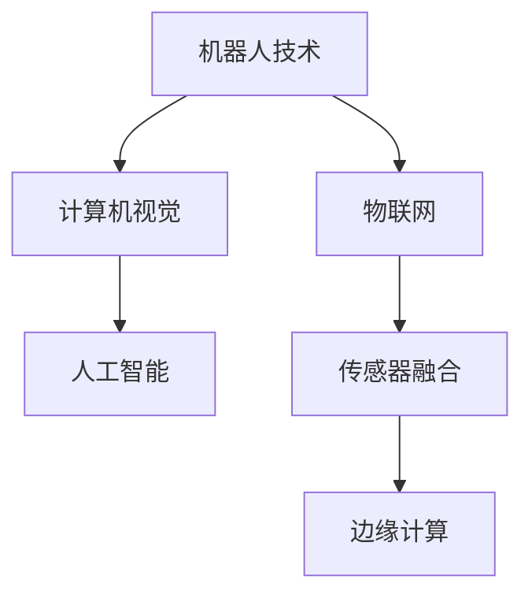

                 

# 物理实体自动化的未来趋势

## 1. 背景介绍

### 1.1 问题由来

物理实体自动化（Physical Entity Automation）是指通过计算机视觉、机器人技术、物联网（IoT）等技术手段，实现对物理世界实体（如机器人、无人机、自动化生产线等）的精准控制和管理。随着技术的飞速发展，物理实体自动化已经成为现代工业制造、物流配送、家庭服务等多个领域的重要方向。物理实体自动化的核心目标是提高效率、降低成本、增强安全性。

近年来，随着深度学习、计算机视觉、机器人控制等领域的技术突破，物理实体自动化领域取得了显著进展。机器人能够进行更复杂的任务，如精准手术、协作制造、自主导航等；物联网技术能够实现更广泛的设备互联和数据集成，提高了系统的智能化水平。然而，由于物理实体自动化涉及多个领域的融合，其应用和部署仍然面临诸多挑战，如数据处理、决策优化、资源调度、安全防护等。

### 1.2 问题核心关键点

物理实体自动化的核心关键点在于如何实现物理世界实体的高效、安全、智能运行。这包括以下几个方面：

- **数据处理**：物理实体自动化需要大量高精度的数据进行训练和决策。数据获取、处理和分析是关键步骤，需要设计合理的数据采集和处理方案。
- **决策优化**：物理实体的运行和决策需要依赖强大的算法和模型。如何设计高效、鲁棒的算法，是提升自动化系统性能的关键。
- **资源调度**：物理实体的运行需要合理的资源配置和调度，以实现最优的经济和性能效果。如何构建灵活、可扩展的资源调度系统，是系统设计和优化的一项重要内容。
- **安全防护**：物理实体的运行环境复杂多变，需要考虑各种安全风险，如设备损坏、数据泄露、操作失误等。如何设计可靠的安全防护机制，是系统稳定运行的重要保障。

## 2. 核心概念与联系

### 2.1 核心概念概述

为更好地理解物理实体自动化的未来趋势，本节将介绍几个密切相关的核心概念：

- **机器人技术**：包括机器人硬件、软件和控制系统，用于实现物理实体的精准操控和任务执行。
- **计算机视觉**：通过摄像头、传感器等设备，获取物理世界的信息，并利用深度学习算法进行图像处理和特征提取。
- **物联网（IoT）**：通过传感器、通信设备等，实现物理实体之间的互联和数据共享，实现实时监控和控制。
- **人工智能（AI）**：结合机器学习、深度学习、自然语言处理等技术，实现物理实体的智能决策和优化。
- **传感器融合**：将来自不同传感器（如视觉传感器、力觉传感器等）的信息进行融合，提高系统的感知能力和决策精度。
- **边缘计算**：在物理实体上进行数据处理和计算，减少数据传输和处理延迟，提升系统实时性。

这些核心概念之间的逻辑关系可以通过以下Mermaid流程图来展示：



这个流程图展示出物理实体自动化中各关键技术之间的关系：

1. 机器人技术是物理实体自动化的核心载体，用于执行各类任务。
2. 计算机视觉提供高精度感知，帮助机器人识别和定位。
3. 物联网实现设备互联，提供实时数据支持。
4. 人工智能用于智能决策和优化，提升自动化系统的性能。
5. 传感器融合提升感知能力，边缘计算提升实时性。

## 3. 核心算法原理 & 具体操作步骤
### 3.1 算法原理概述

物理实体自动化的核心算法主要涉及计算机视觉、机器人控制、优化决策等方面。其基本原理是通过传感器获取物理世界的感知数据，通过计算机视觉技术进行图像处理和特征提取，结合人工智能算法进行智能决策和优化，最终控制机器人执行任务。

### 3.2 算法步骤详解

物理实体自动化的主要算法步骤如下：

1. **数据采集**：使用视觉传感器、力觉传感器等设备，获取物理实体的感知数据。
2. **数据处理**：对感知数据进行预处理、滤波、增强等操作，去除噪声和干扰，提取出有用的特征。
3. **特征提取**：利用计算机视觉算法，如卷积神经网络（CNN）、递归神经网络（RNN）等，从感知数据中提取高维特征。
4. **智能决策**：将提取出的特征输入到深度学习模型或规则引擎，进行智能决策和任务规划。
5. **机器人控制**：将决策结果转化为控制信号，通过机器人控制器执行相应任务。

### 3.3 算法优缺点

物理实体自动化的主要算法具有以下优点：

- **高精度感知**：计算机视觉和传感器融合技术提供了高精度的感知能力，提升了系统的准确性和可靠性。
- **智能决策**：深度学习和大数据分析技术实现了智能决策和优化，提升了系统的自动化水平。
- **灵活性**：基于模块化和组件化的设计思想，物理实体自动化的各个组件可以独立升级和优化。
- **实时性**：通过边缘计算技术，数据处理和决策优化可以在物理实体上进行，减少了数据传输和处理延迟。

然而，物理实体自动化的算法也存在一些局限性：

- **数据依赖**：算法依赖于高质量的数据，数据获取和处理成本较高。
- **复杂度**：系统设计复杂，涉及多个领域的技术融合，实现难度较大。
- **安全性**：系统的安全性依赖于多种技术手段，如数据加密、访问控制等，设计难度较大。
- **可解释性**：深度学习模型和复杂算法难以解释其内部决策过程，缺乏透明度。

### 3.4 算法应用领域

物理实体自动化在多个领域得到了广泛应用，包括：

- **工业制造**：机器人自动装配、智能质检、无人仓库等。
- **物流配送**：无人驾驶汽车、无人机配送、智能分拣等。
- **医疗健康**：手术机器人、康复机器人、健康监测等。
- **家庭服务**：家务机器人、智能家居、安防监控等。
- **农业生产**：自动化农场、智能农机、作物监测等。

## 4. 数学模型和公式 & 详细讲解 & 举例说明

### 4.1 数学模型构建

物理实体自动化的数学模型主要包括以下几个部分：

- **感知模型**：用于描述物理世界感知数据的生成过程，通常使用贝叶斯网络、高斯混合模型等概率模型。
- **决策模型**：用于描述物理实体的决策过程，通常使用深度强化学习、多目标优化等方法。
- **控制系统**：用于描述机器人控制器的动力学模型和控制策略，通常使用线性系统、非线性系统、控制理论等方法。

### 4.2 公式推导过程

以下以工业机器人的轨迹规划为例，推导相关的数学模型和算法：

设工业机器人的位置为 $\mathbf{x}(t)$，速度为 $\mathbf{v}(t)$，加速度为 $\mathbf{a}(t)$，动力学方程为：

$$
\mathbf{f}(t) = \mathbf{m}(t) \mathbf{a}(t) = \mathbf{u}(t) - \mathbf{d}(t)
$$

其中 $\mathbf{f}(t)$ 为机器人的受力，$\mathbf{m}(t)$ 为机器人的质量，$\mathbf{u}(t)$ 为控制输入，$\mathbf{d}(t)$ 为系统干扰。

假设机器人的运动轨迹可以通过优化问题描述，目标是最小化轨迹上的能量消耗，即：

$$
\min_{\mathbf{x}(t), \mathbf{v}(t), \mathbf{a}(t)} \int_{t_0}^{t_f} (\mathbf{f}^T \mathbf{f}) dt
$$

其中 $t_0$ 和 $t_f$ 分别为时间起点和终点。

将上述优化问题转化为拉格朗日方程，得到：

$$
L(\mathbf{x},\mathbf{v},\mathbf{a},\lambda) = \int_{t_0}^{t_f} (\mathbf{v}^T \mathbf{f} - \lambda (\mathbf{m} \mathbf{a})) dt
$$

求导并解方程组，得到机器人的最优轨迹：

$$
\mathbf{a}(t) = -k_1 \mathbf{f}(t) + k_2 \frac{d\mathbf{f}(t)}{dt}
$$

其中 $k_1$ 和 $k_2$ 为控制参数，可以通过实验或模型优化得到。

### 4.3 案例分析与讲解

以工业机器人的轨迹规划为例，分析如何通过计算机视觉和深度学习技术实现最优轨迹的自动规划。

首先，使用视觉传感器获取机器人的位置和姿态信息，并利用深度学习算法进行特征提取。然后，将提取出的特征输入到优化算法中，求解最优轨迹。最后，根据求解出的轨迹生成控制指令，驱动机器人执行任务。

## 5. 项目实践：代码实例和详细解释说明
### 5.1 开发环境搭建

在进行物理实体自动化的项目实践前，我们需要准备好开发环境。以下是使用Python进行ROS开发的环境配置流程：

1. 安装ROS（Robot Operating System）：从官网下载并安装ROS，适用于多机器人协同和设备互联。
2. 创建并激活ROS工作空间：
```bash
mkdir -p ~/catkin_ws/src
cd ~/catkin_ws
catkin_make
source devel/setup.bash
```
3. 安装必要的ROS节点和库：
```bash
sudo apt-get install ros-{distro}-{package} python-{package}
```
4. 安装Python开发环境：
```bash
sudo apt-get install python3-pip python3-dev
```
5. 安装PyTorch和其他必要的库：
```bash
pip install torch torchvision torchaudio scikit-learn pandas matplotlib tqdm jupyter notebook ipython
```

完成上述步骤后，即可在ROS工作空间中进行物理实体自动化的开发和测试。

### 5.2 源代码详细实现

下面我们以工业机器人轨迹规划为例，给出使用ROS和PyTorch进行物理实体自动化的代码实现。

首先，定义ROS节点和PyTorch模型：

```python
import rospy
from sensor_msgs.msg import Image, Joy
from std_msgs.msg import Float32
import torch
import torchvision
import torch.nn as nn
import torch.optim as optim
import numpy as np

# 定义ROS节点
rospy.init_node('trajectory_planner', anonymous=True)

# 定义PyTorch模型
class TrajectoryModel(nn.Module):
    def __init__(self):
        super(TrajectoryModel, self).__init__()
        self.fc1 = nn.Linear(2, 64)
        self.fc2 = nn.Linear(64, 2)

    def forward(self, x):
        x = self.fc1(x)
        x = nn.functional.relu(x)
        x = self.fc2(x)
        return x
```

然后，定义ROS消息处理函数和模型训练函数：

```python
# 定义ROS消息处理函数
def image_callback(img_msg):
    # 将ROS消息转换为Numpy数组
    img = np.array(img_msg.data, dtype=np.uint8).reshape(640, 480, 3)
    # 使用PyTorch进行特征提取和预测
    model.eval()
    with torch.no_grad():
        input_tensor = torch.from_numpy(img[:,:,:,0].astype(np.float32)).float()
        input_tensor.unsqueeze_(0)
        prediction = model(input_tensor)
        prediction_np = prediction.numpy()
        # 将预测结果转换为ROS消息
        out_msg = Float32()
        out_msg.data = prediction_np[0]
        # 发布ROS消息
        rospy.Publisher('/trajectory_output', Float32, queue_size=1).publish(out_msg)

# 定义模型训练函数
def train_model(model, optimizer, num_epochs):
    for epoch in range(num_epochs):
        # 加载数据
        data = np.load('data.npy')
        data = torch.from_numpy(data).float()
        # 前向传播和反向传播
        optimizer.zero_grad()
        output = model(data)
        loss = nn.functional.mse_loss(output, target)
        loss.backward()
        optimizer.step()
        # 打印训练结果
        print('Epoch {}: loss={:.4f}'.format(epoch+1, loss.item()))

# 加载数据并进行训练
data = np.load('data.npy')
model = TrajectoryModel()
optimizer = optim.Adam(model.parameters(), lr=0.001)
train_model(model, optimizer, 100)
```

最后，启动ROS节点并运行训练：

```bash
rospy.spin()
```

以上就是使用ROS和PyTorch进行工业机器人轨迹规划的完整代码实现。可以看到，通过ROS提供的多机器人协同和数据传输能力，可以方便地将计算机视觉和深度学习技术应用到物理实体自动化中，实现机器人轨迹规划的自动优化。

### 5.3 代码解读与分析

让我们再详细解读一下关键代码的实现细节：

**ROS节点定义**：
- `rospy.init_node`：初始化ROS节点，并设置节点名称为`trajectory_planner`。
- `rospy.Publisher`：定义ROS消息发布器，用于发布预测结果。

**PyTorch模型定义**：
- `nn.Linear`：定义线性层，用于特征提取和预测。
- `nn.functional.relu`：定义ReLU激活函数，用于增加模型的非线性能力。
- `torch.from_numpy`：将Numpy数组转换为PyTorch张量。

**ROS消息处理函数**：
- `image_callback`：定义ROS消息处理函数，用于处理视觉传感器获取的图像数据。
- `img_msg.data`：获取ROS消息中的图像数据。
- `np.array`：将ROS消息中的图像数据转换为Numpy数组。
- `model.eval()`：将模型设置为评估模式，不进行梯度计算。
- `torch.no_grad()`：关闭PyTorch的自动微分机制，加速计算。
- `torch.from_numpy`：将Numpy数组转换为PyTorch张量。
- `nn.functional.mse_loss`：定义均方误差损失函数，用于计算预测误差。
- `optimizer.zero_grad()`：清除优化器中的梯度。
- `optimizer.step()`：更新模型参数。

**模型训练函数**：
- `num_epochs`：定义训练轮数。
- `data`：加载训练数据。
- `model`：定义PyTorch模型。
- `optimizer`：定义优化器。
- `train_model`：定义训练函数，循环迭代训练轮数。
- `torch.from_numpy`：将Numpy数组转换为PyTorch张量。
- `output`：模型前向传播输出。
- `loss`：定义均方误差损失函数，用于计算预测误差。
- `loss.backward()`：反向传播计算梯度。
- `optimizer.step()`：更新模型参数。
- `print`：打印训练结果。

## 6. 实际应用场景

### 6.1 智能制造

在智能制造领域，物理实体自动化技术可以实现无人化生产线的构建。通过工业机器人和自动化设备的协同工作，可以大幅提高生产效率，降低人工成本，提升产品质量。

具体而言，可以设计并训练工业机器人进行自动化装配、质检、焊接等任务。利用计算机视觉技术，实时监测设备运行状态和产品外观，及时发现异常并调整生产流程。通过物联网技术，实现设备和系统的互联互通，优化资源配置和调度，提升生产效率。

### 6.2 智慧仓储

智慧仓储是物流配送领域的重要应用之一。通过物理实体自动化技术，可以实现无人化的仓库管理，提升仓储效率，降低人力成本。

具体而言，可以设计并训练无人配送车、自动分拣机器人、AGV（自动导引车）等设备。利用计算机视觉技术，实时监测货物位置和状态，进行路径规划和任务分配。通过物联网技术，实现仓储设备的互联互通，优化仓库布局和操作流程，提升仓储效率。

### 6.3 医疗健康

医疗健康领域对物理实体自动化的需求日益增加。通过机器人技术，可以提升手术的精准性和安全性，减轻医护人员的工作负担。

具体而言，可以设计并训练手术机器人、康复机器人、健康监测设备等。利用计算机视觉技术，实时监测手术进程和患者状态，提供手术辅助和反馈。通过物联网技术，实现医疗设备的互联互通，优化医疗资源配置和操作流程，提升医疗服务质量。

### 6.4 未来应用展望

随着物理实体自动化技术的不断进步，未来的应用场景将更加广泛，涉及更多领域，带来更大的社会和经济价值。以下是一些未来应用展望：

- **智能家居**：通过自动化家庭设备，实现智能化的家居管理，提升家庭生活的便利性和舒适度。
- **智慧城市**：通过自动化的城市管理设备，实现智能化的城市治理，提升城市管理的效率和质量。
- **农业生产**：通过自动化农机设备和智慧农场，实现精准化的农业生产，提升农产品的产量和质量。
- **环境保护**：通过自动化的环境监测设备和治理设施，实现智能化的环境管理，提升环境治理的效果。

## 7. 工具和资源推荐
### 7.1 学习资源推荐

为了帮助开发者系统掌握物理实体自动化的理论和实践，这里推荐一些优质的学习资源：

1. **《机器人学导论》（Introduction to Robotics）**：由David G. Vossen等人著，全面介绍了机器人技术的基本概念、运动学、动力学、控制等核心内容，是机器人领域的经典教材。
2. **《深度学习与计算机视觉：理论和实践》（Deep Learning and Computer Vision: Theory and Practice）**：由Gary Tesauro等人著，系统讲解了深度学习在计算机视觉中的应用，包括卷积神经网络、图像处理、目标检测等技术。
3. **ROS官方文档**：ROS的官方文档提供了详细的ROS系统介绍和开发指南，是学习ROS和进行物理实体自动化开发的重要资源。
4. **OpenAI Gym**：Gym是OpenAI开发的开源环境，用于训练和测试强化学习模型，提供了丰富的环境和任务，是进行智能决策和优化学习的重要工具。
5. **PyTorch官方文档**：PyTorch的官方文档提供了详细的PyTorch框架介绍和开发指南，是进行深度学习和计算机视觉开发的重要资源。

通过对这些资源的学习实践，相信你一定能够快速掌握物理实体自动化的精髓，并用于解决实际的物理实体自动化问题。

### 7.2 开发工具推荐

高效的开发离不开优秀的工具支持。以下是几款用于物理实体自动化开发的常用工具：

1. **ROS（Robot Operating System）**：ROS是机器人领域广泛使用的开源平台，提供了丰富的ROS节点、工具包和接口，支持多机器人协同和设备互联。
2. **Gazebo**：Gazebo是一个仿真平台，支持多物理仿真和机器人仿真，可以用于测试和调试物理实体自动化系统。
3. **OpenCV**：OpenCV是一个开源计算机视觉库，提供了丰富的图像处理和特征提取算法，支持深度学习模型的集成。
4. **PyTorch**：PyTorch是深度学习框架，提供了灵活的计算图和自动微分机制，支持复杂的深度学习模型开发。
5. **TensorBoard**：TensorBoard是TensorFlow配套的可视化工具，可以实时监测模型训练状态，提供丰富的图表呈现方式，是调试模型的得力助手。
6. **Google Colab**：Google Colab是谷歌推出的在线Jupyter Notebook环境，免费提供GPU/TPU算力，方便开发者快速上手实验最新模型，分享学习笔记。

合理利用这些工具，可以显著提升物理实体自动化开发的效率，加快创新迭代的步伐。

### 7.3 相关论文推荐

物理实体自动化涉及计算机视觉、机器人控制、优化决策等多个领域，以下是几篇奠基性的相关论文，推荐阅读：

1. **《机器人视觉感知与智能决策综述》（A Survey on Robot Visual Perception and Intelligent Decision-Making）**：由Qi Chen等人著，系统综述了机器人视觉感知和智能决策的技术现状和未来趋势，是机器人领域的经典文献。
2. **《多目标优化算法综述》（A Survey of Multiobjective Optimization Algorithms）**：由Xinyue Zhu等人著，系统综述了多目标优化算法的理论、方法和应用，是优化决策领域的经典文献。
3. **《强化学习在机器人控制中的应用》（Reinforcement Learning in Robotics Control）**：由Michael A. Lewis等人著，系统讲解了强化学习在机器人控制中的应用，包括模型训练、奖励函数设计等技术。
4. **《计算机视觉在自动驾驶中的应用》（Computer Vision Applications in Automated Driving）**：由Robert P. sidway等人著，系统讲解了计算机视觉在自动驾驶中的应用，包括图像处理、目标检测等技术。
5. **《深度强化学习在智能制造中的应用》（Deep Reinforcement Learning in Intelligent Manufacturing）**：由Zhenhui Ren等人著，系统讲解了深度强化学习在智能制造中的应用，包括生产调度、质量控制等技术。

这些论文代表了大语言模型微调技术的发展脉络。通过学习这些前沿成果，可以帮助研究者把握学科前进方向，激发更多的创新灵感。

## 8. 总结：未来发展趋势与挑战

### 8.1 总结

本文对物理实体自动化的未来趋势进行了全面系统的介绍。首先阐述了物理实体自动化的研究背景和应用场景，明确了物理实体自动化的重要性和应用潜力。其次，从原理到实践，详细讲解了物理实体自动化的算法步骤和实现细节，给出了物理实体自动化开发的全流程代码实现。同时，本文还广泛探讨了物理实体自动化的未来应用前景，展示了物理实体自动化的广阔前景。

通过本文的系统梳理，可以看到，物理实体自动化技术正在成为现代工业制造、物流配送、医疗健康等领域的重要方向，极大地提升了生产效率、降低了成本、增强了安全性。未来，伴随技术进步，物理实体自动化技术还将得到更广泛的应用，带来更大的社会和经济价值。

### 8.2 未来发展趋势

展望未来，物理实体自动化技术将呈现以下几个发展趋势：

1. **多模态融合**：物理实体自动化的应用场景将更加复杂多样，需要结合多种感知和控制技术，实现多模态融合，提升系统的感知能力和决策能力。
2. **自适应学习**：物理实体自动化系统需要具备自适应学习能力，能够根据环境变化动态调整策略，实现更智能的决策和控制。
3. **边缘计算**：随着边缘计算技术的发展，物理实体自动化的数据处理和计算可以在本地进行，减少数据传输和处理延迟，提升系统实时性。
4. **自监督学习**：物理实体自动化的训练数据获取和标注成本较高，通过自监督学习技术，可以在无标注数据的情况下进行训练，降低对标注数据的依赖。
5. **安全防护**：物理实体自动化系统面临的安全风险包括设备损坏、数据泄露、操作失误等，需要设计可靠的安全防护机制，确保系统稳定运行。
6. **人机协同**：物理实体自动化系统需要与人类进行协同工作，提升系统的灵活性和适应性，增强人机交互体验。

以上趋势凸显了物理实体自动化技术的广阔前景。这些方向的探索发展，必将进一步提升物理实体自动化的性能和应用范围，为自动化系统带来新的突破。

### 8.3 面临的挑战

尽管物理实体自动化技术已经取得了瞩目成就，但在迈向更加智能化、普适化应用的过程中，它仍面临着诸多挑战：

1. **数据获取成本高**：物理实体自动化的训练数据获取和标注成本较高，数据不足成为制约系统性能的瓶颈。如何降低数据获取成本，获取更丰富、高质量的数据，将是未来研究的重要方向。
2. **系统复杂度高**：物理实体自动化的系统设计复杂，涉及多个领域的融合，实现难度较大。如何构建灵活、可扩展的系统，实现高效的设计和开发，将是未来研究的重要方向。
3. **安全性和可靠性**：物理实体自动化系统面临的安全风险较高，需要设计可靠的安全防护机制，确保系统的稳定运行。如何设计安全可靠的物理实体自动化系统，将是未来研究的重要方向。
4. **算力和成本**：物理实体自动化的训练和推理计算成本较高，需要高效、经济的算力支持。如何优化算力资源，降低成本，提升系统效率，将是未来研究的重要方向。
5. **标准和规范**：物理实体自动化的标准化和规范化尚不完善，需要制定统一的标准和规范，确保系统互操作性和一致性。如何制定物理实体自动化的标准和规范，将是未来研究的重要方向。

### 8.4 研究展望

面对物理实体自动化所面临的诸多挑战，未来的研究需要在以下几个方面寻求新的突破：

1. **多模态融合**：结合多种感知和控制技术，实现物理实体自动化的多模态融合，提升系统的感知能力和决策能力。
2. **自适应学习**：设计自适应学习算法，使物理实体自动化系统能够根据环境变化动态调整策略，实现更智能的决策和控制。
3. **边缘计算**：优化物理实体自动化系统的边缘计算架构，减少数据传输和处理延迟，提升系统实时性。
4. **自监督学习**：结合自监督学习技术，降低对标注数据的依赖，提升系统在无标注数据情况下的性能。
5. **安全防护**：设计可靠的安全防护机制，确保物理实体自动化系统的稳定运行。
6. **人机协同**：设计灵活、可扩展的物理实体自动化系统，提升系统的灵活性和适应性，增强人机交互体验。

这些研究方向的探索，必将引领物理实体自动化技术迈向更高的台阶，为构建安全、可靠、高效、智能的自动化系统铺平道路。面向未来，物理实体自动化技术还需要与其他人工智能技术进行更深入的融合，如知识表示、因果推理、强化学习等，多路径协同发力，共同推动物理实体自动化技术的进步。只有勇于创新、敢于突破，才能不断拓展物理实体自动化的边界，让自动化技术更好地造福人类社会。

## 9. 附录：常见问题与解答

**Q1：物理实体自动化是否可以应用于所有领域？**

A: 物理实体自动化可以应用于绝大多数工业、农业、服务业等领域，但在特定的高安全要求或精细化要求的场景中，如军事、医疗等，需要结合具体的场景和需求进行优化和适配。

**Q2：物理实体自动化的发展瓶颈是什么？**

A: 物理实体自动化的发展瓶颈主要包括数据获取成本高、系统复杂度高、安全性和可靠性不高等问题。未来需要进一步降低数据获取成本，提高系统复杂度的可管理性，以及增强系统的安全性和可靠性。

**Q3：物理实体自动化在工业制造中的应用前景如何？**

A: 物理实体自动化在工业制造中的应用前景非常广阔，可以显著提升生产效率、降低成本、提高产品质量。未来，随着技术的进一步发展，物理实体自动化在智能制造中的应用将更加深入和广泛。

**Q4：物理实体自动化与人工智能的关系是什么？**

A: 物理实体自动化与人工智能是相辅相成的。人工智能提供智能决策和优化算法，物理实体自动化提供感知、控制和执行能力，两者结合可以提升系统的智能化水平和应用效果。

**Q5：物理实体自动化未来面临的主要挑战是什么？**

A: 物理实体自动化未来面临的主要挑战包括数据获取成本高、系统复杂度高、安全性和可靠性不高等问题。需要进一步降低数据获取成本，提高系统复杂度的可管理性，以及增强系统的安全性和可靠性。

作者：禅与计算机程序设计艺术 / Zen and the Art of Computer Programming

