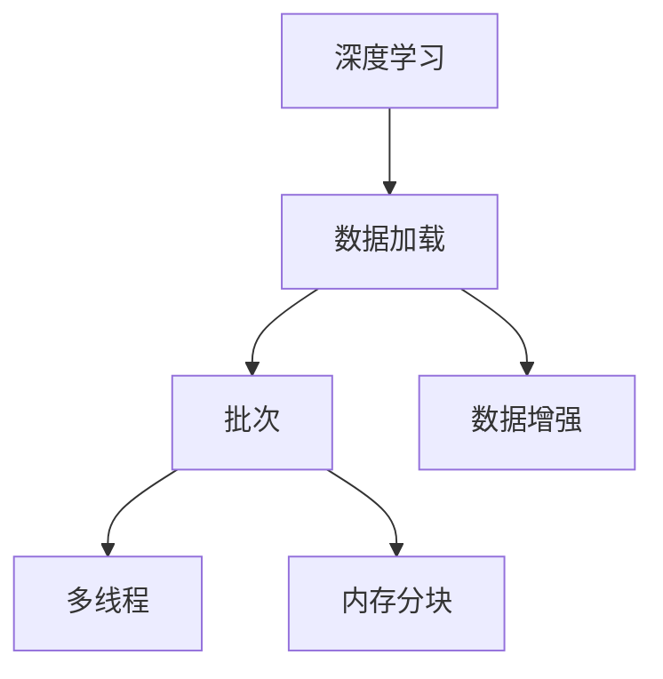

                 

# 用DataLoader提供的数据进行训练

## 1. 背景介绍

### 1.1 问题由来
在深度学习模型训练中，数据加载是一个非常关键的环节。数据加载的好坏直接影响到模型的训练速度和效果。在深度学习模型中，数据加载通常使用Python的DataLoader来实现。DataLoader是PyTorch框架中的一个重要模块，它提供了一种高效的数据加载方式，能够以批次（Batch）的形式逐次加载数据，同时实现了数据预处理、并行处理、数据增强等功能。

### 1.2 问题核心关键点
在深度学习模型的训练过程中，DataLoader的作用主要有以下几点：
1. **数据加载**：以批次（Batch）的形式逐次加载数据，使得模型可以高效地处理大量数据。
2. **数据增强**：通过对数据进行随机变换、随机裁剪等操作，增强数据的多样性，从而提高模型的泛化能力。
3. **数据预处理**：在数据加载过程中，对数据进行归一化、标准化等预处理操作，提高模型的训练效率。
4. **并发处理**：DataLoader实现了多线程数据加载，加速了数据加载的速度。
5. **内存管理**：DataLoader实现了内存分块（Chunking）技术，减少了内存的使用，提高了内存利用率。

## 2. 核心概念与联系

### 2.1 核心概念概述

为更好地理解用DataLoader进行数据加载的原理，本节将介绍几个密切相关的核心概念：

- **深度学习**：一种基于神经网络的机器学习方法，通过多层神经网络实现数据的特征提取和分类、回归等任务。
- **数据加载（Data Loading）**：在深度学习模型训练中，数据加载是将数据从磁盘或其他存储介质加载到内存中，供模型训练使用的过程。
- **批次（Batch）**：在深度学习中，数据被分为若干个批次，每个批次包含一定数量的样本。批次大小（Batch Size）是数据加载的重要参数。
- **数据增强（Data Augmentation）**：通过对原始数据进行变换，生成更多的训练数据，提高模型的泛化能力。
- **多线程（Multi-threading）**：在数据加载过程中，使用多线程技术加速数据加载的速度。
- **内存分块（Chunking）**：在数据加载过程中，将数据分成若干块，减少内存的使用，提高内存利用率。

这些核心概念之间的逻辑关系可以通过以下Mermaid流程图来展示：



这个流程图展示了大语言模型微调的数据加载过程中涉及的核心概念及其之间的关系：

1. 深度学习模型通过数据加载将数据从存储介质加载到内存中。
2. 数据被分为若干个批次，每个批次包含一定数量的样本。
3. 在数据加载过程中，可以对数据进行数据增强，以提高模型的泛化能力。
4. 使用多线程技术加速数据加载的速度。
5. 内存分块技术用于减少内存的使用，提高内存利用率。

## 3. 核心算法原理 & 具体操作步骤
### 3.1 算法原理概述

使用DataLoader进行数据加载，本质上是一个数据批处理的过程。其核心思想是：将原始数据集分割成若干个批次，每个批次包含一定数量的样本，通过逐次加载数据，使得模型可以高效地处理大量数据。在数据加载过程中，DataLoader还实现了数据增强、多线程处理和内存分块等功能，提高了数据加载的效率和模型训练的效果。

形式化地，假设原始数据集为 $D$，批次大小为 $B$，则每个批次的样本数量为 $B$，共需要加载 $N$ 个批次。则数据加载过程可以表示为：

$$
\mathcal{L}(D, B) = \left\{(x_i, y_i)\right\}_{i=1}^N
$$

其中 $x_i$ 为第 $i$ 个批次的样本，$y_i$ 为对应的标签。在DataLoader中，每个批次的样本是通过随机采样（Random Sampling）方式从原始数据集中选取的，以避免过拟合。

### 3.2 算法步骤详解

使用DataLoader进行数据加载的一般步骤如下：

**Step 1: 准备数据集**
- 准备一个原始数据集 $D$，可以是图像、文本等形式的数据。
- 对数据集进行预处理，如归一化、标准化等操作。
- 将数据集划分为训练集、验证集和测试集。

**Step 2: 定义DataLoader参数**
- 定义DataLoader的批次大小 $B$ 和数据增强策略（Data Augmentation）。
- 设置多线程数 $T$ 和内存分块大小 $C$。

**Step 3: 创建DataLoader实例**
- 使用PyTorch的DataLoader类创建DataLoader实例。
- 传入数据集和定义的参数。

**Step 4: 执行数据加载**
- 使用DataLoader实例的 `__iter__()` 方法进行数据加载。
- 在每个批次中，将数据和标签传入模型进行训练。

**Step 5: 评估模型性能**
- 在验证集和测试集上评估模型性能。
- 调整模型参数，重新训练。

**Step 6: 保存模型**
- 保存训练好的模型参数。

以下是使用PyTorch的DataLoader进行数据加载的示例代码：

```python
import torch
from torch.utils.data import DataLoader, Dataset

# 定义数据集
class MyDataset(Dataset):
    def __init__(self, data, labels):
        self.data = data
        self.labels = labels

    def __len__(self):
        return len(self.data)

    def __getitem__(self, index):
        return self.data[index], self.labels[index]

# 准备数据集
data = ...  # 原始数据集
labels = ...  # 对应的标签
train_dataset = MyDataset(data[:train_size], labels[:train_size])
test_dataset = MyDataset(data[train_size:], labels[train_size:])

# 定义DataLoader参数
batch_size = 32
num_workers = 4

# 创建DataLoader实例
train_loader = DataLoader(train_dataset, batch_size=batch_size, shuffle=True, num_workers=num_workers)
test_loader = DataLoader(test_dataset, batch_size=batch_size, shuffle=False, num_workers=num_workers)

# 定义模型
model = ...

# 训练模型
for epoch in range(num_epochs):
    for batch_idx, (data, target) in enumerate(train_loader):
        # 将数据和标签传入模型进行训练
        optimizer.zero_grad()
        output = model(data)
        loss = criterion(output, target)
        loss.backward()
        optimizer.step()

        # 输出训练日志
        if batch_idx % log_interval == 0:
            print('Train Epoch: {} [{}/{} ({:.0f}%)]\tLoss: {:.6f}'.format(
                epoch, batch_idx * len(data), len(train_loader.dataset),
                100. * batch_idx / len(train_loader), loss.item()))

# 在测试集上评估模型性能
with torch.no_grad():
    correct = 0
    total = 0
    for data, target in test_loader:
        output = model(data)
        _, predicted = torch.max(output.data, 1)
        total += target.size(0)
        correct += (predicted == target).sum().item()

    print('Accuracy of the network on the 10000 test images: {} %'.format(100 * correct / total))
```

### 3.3 算法优缺点

使用DataLoader进行数据加载的优点包括：
1. 数据批处理提高了模型训练的效率。
2. 数据增强提高了模型的泛化能力。
3. 多线程加速了数据加载的速度。
4. 内存分块技术提高了内存利用率。

其缺点包括：
1. 数据增强可能会导致模型过拟合。
2. 多线程技术可能会降低数据加载的稳定性。
3. 内存分块技术可能会导致数据加载不连续。

## 4. 数学模型和公式 & 详细讲解  
### 4.1 数学模型构建

使用DataLoader进行数据加载的数学模型构建如下：

假设原始数据集为 $D$，批次大小为 $B$，则每个批次的样本数量为 $B$，共需要加载 $N$ 个批次。则数据加载过程可以表示为：

$$
\mathcal{L}(D, B) = \left\{(x_i, y_i)\right\}_{i=1}^N
$$

其中 $x_i$ 为第 $i$ 个批次的样本，$y_i$ 为对应的标签。

### 4.2 公式推导过程

以下我们推导DataLoader的数据加载公式及其梯度计算过程。

假设原始数据集 $D$ 的大小为 $M$，批次大小为 $B$，则每个批次的样本数量为 $B$，共需要加载 $N = \lceil M/B \rceil$ 个批次。假设第 $i$ 个批次的样本为 $x_i$，对应的标签为 $y_i$，则数据加载公式为：

$$
\mathcal{L}(D, B) = \left\{(x_i, y_i)\right\}_{i=1}^N
$$

在PyTorch中，DataLoader实现了随机采样（Random Sampling）的方式进行数据加载。因此，每个批次的样本 $x_i$ 和标签 $y_i$ 是随机选取的，如下所示：

$$
x_i = \text{sample}(D, B)
$$

$$
y_i = \text{sample}(D, B)
$$

其中 $\text{sample}(D, B)$ 表示从数据集 $D$ 中随机选取 $B$ 个样本。

在训练过程中，每个批次的样本 $x_i$ 和标签 $y_i$ 分别输入到模型中进行训练。假设模型的损失函数为 $\mathcal{L}$，则每个批次的损失函数为：

$$
\mathcal{L}(x_i, y_i; \theta) = \mathcal{L}(M_{\theta}(x_i), y_i)
$$

其中 $M_{\theta}$ 为模型，$\theta$ 为模型参数。

假设每个批次的损失函数的总和为 $\mathcal{L}_{total}$，则模型在数据集 $D$ 上的损失函数为：

$$
\mathcal{L}_{total} = \frac{1}{N} \sum_{i=1}^N \mathcal{L}(x_i, y_i; \theta)
$$

在模型训练过程中，使用梯度下降算法进行参数更新。假设初始参数为 $\theta_0$，则参数更新公式为：

$$
\theta_{t+1} = \theta_t - \eta \nabla_{\theta} \mathcal{L}_{total}
$$

其中 $\eta$ 为学习率。

### 4.3 案例分析与讲解

以图像分类任务为例，介绍如何使用DataLoader进行数据加载。

假设有一个图像分类任务，原始数据集为 $D$，批次大小为 $B=64$，共需要加载 $N$ 个批次。则数据加载过程可以表示为：

$$
\mathcal{L}(D, B) = \left\{(x_i, y_i)\right\}_{i=1}^N
$$

其中 $x_i$ 为第 $i$ 个批次的样本，$y_i$ 为对应的标签。

在PyTorch中，可以使用 `torch.utils.data.Dataset` 类定义数据集，并使用 `torch.utils.data.DataLoader` 类加载数据。具体实现如下：

```python
import torch
from torch.utils.data import Dataset, DataLoader
import torchvision.transforms as transforms
from torchvision.datasets import CIFAR10

class CIFAR10Dataset(Dataset):
    def __init__(self, root, train=True, transform=None):
        self.root = root
        self.train = train
        self.transform = transform
        self.trainset = CIFAR10(root=root, train=train, download=True)
        self.trainloader = self.trainset.trainloader
        self.testset = CIFAR10(root=root, train=train, download=True)
        self.testloader = self.testset.testloader

    def __len__(self):
        return len(self.trainloader)

    def __getitem__(self, idx):
        if self.train:
            x, y = self.trainloader[idx]
        else:
            x, y = self.testloader[idx]

        if self.transform is not None:
            x = self.transform(x)

        return x, y

# 准备数据集
train_dataset = CIFAR10Dataset(root='./data', train=True, transform=transforms.ToTensor())
test_dataset = CIFAR10Dataset(root='./data', train=False, transform=transforms.ToTensor())

# 定义DataLoader参数
batch_size = 64
num_workers = 4

# 创建DataLoader实例
train_loader = DataLoader(train_dataset, batch_size=batch_size, shuffle=True, num_workers=num_workers)
test_loader = DataLoader(test_dataset, batch_size=batch_size, shuffle=False, num_workers=num_workers)

# 定义模型
model = ...

# 训练模型
for epoch in range(num_epochs):
    for batch_idx, (data, target) in enumerate(train_loader):
        # 将数据和标签传入模型进行训练
        optimizer.zero_grad()
        output = model(data)
        loss = criterion(output, target)
        loss.backward()
        optimizer.step()

        # 输出训练日志
        if batch_idx % log_interval == 0:
            print('Train Epoch: {} [{}/{} ({:.0f}%)]\tLoss: {:.6f}'.format(
                epoch, batch_idx * len(data), len(train_loader.dataset),
                100. * batch_idx / len(train_loader), loss.item()))

# 在测试集上评估模型性能
with torch.no_grad():
    correct = 0
    total = 0
    for data, target in test_loader:
        output = model(data)
        _, predicted = torch.max(output.data, 1)
        total += target.size(0)
        correct += (predicted == target).sum().item()

    print('Accuracy of the network on the 10000 test images: {} %'.format(100 * correct / total))
```

## 5. 项目实践：代码实例和详细解释说明
### 5.1 开发环境搭建

在进行数据加载实践前，我们需要准备好开发环境。以下是使用Python进行PyTorch开发的环境配置流程：

1. 安装Anaconda：从官网下载并安装Anaconda，用于创建独立的Python环境。

2. 创建并激活虚拟环境：
```bash
conda create -n pytorch-env python=3.8 
conda activate pytorch-env
```

3. 安装PyTorch：根据CUDA版本，从官网获取对应的安装命令。例如：
```bash
conda install pytorch torchvision torchaudio cudatoolkit=11.1 -c pytorch -c conda-forge
```

4. 安装Transformers库：
```bash
pip install transformers
```

5. 安装各类工具包：
```bash
pip install numpy pandas scikit-learn matplotlib tqdm jupyter notebook ipython
```

完成上述步骤后，即可在`pytorch-env`环境中开始数据加载实践。

### 5.2 源代码详细实现

这里我们以图像分类任务为例，给出使用PyTorch的DataLoader进行数据加载的完整代码实现。

```python
import torch
from torch.utils.data import DataLoader, Dataset
import torchvision.transforms as transforms
from torchvision.datasets import CIFAR10

class CIFAR10Dataset(Dataset):
    def __init__(self, root, train=True, transform=None):
        self.root = root
        self.train = train
        self.transform = transform
        self.trainset = CIFAR10(root=root, train=train, download=True)
        self.trainloader = self.trainset.trainloader
        self.testset = CIFAR10(root=root, train=train, download=True)
        self.testloader = self.testset.testloader

    def __len__(self):
        return len(self.trainloader)

    def __getitem__(self, idx):
        if self.train:
            x, y = self.trainloader[idx]
        else:
            x, y = self.testloader[idx]

        if self.transform is not None:
            x = self.transform(x)

        return x, y

# 准备数据集
train_dataset = CIFAR10Dataset(root='./data', train=True, transform=transforms.ToTensor())
test_dataset = CIFAR10Dataset(root='./data', train=False, transform=transforms.ToTensor())

# 定义DataLoader参数
batch_size = 64
num_workers = 4

# 创建DataLoader实例
train_loader = DataLoader(train_dataset, batch_size=batch_size, shuffle=True, num_workers=num_workers)
test_loader = DataLoader(test_dataset, batch_size=batch_size, shuffle=False, num_workers=num_workers)

# 定义模型
model = ...

# 训练模型
for epoch in range(num_epochs):
    for batch_idx, (data, target) in enumerate(train_loader):
        # 将数据和标签传入模型进行训练
        optimizer.zero_grad()
        output = model(data)
        loss = criterion(output, target)
        loss.backward()
        optimizer.step()

        # 输出训练日志
        if batch_idx % log_interval == 0:
            print('Train Epoch: {} [{}/{} ({:.0f}%)]\tLoss: {:.6f}'.format(
                epoch, batch_idx * len(data), len(train_loader.dataset),
                100. * batch_idx / len(train_loader), loss.item()))

# 在测试集上评估模型性能
with torch.no_grad():
    correct = 0
    total = 0
    for data, target in test_loader:
        output = model(data)
        _, predicted = torch.max(output.data, 1)
        total += target.size(0)
        correct += (predicted == target).sum().item()

    print('Accuracy of the network on the 10000 test images: {} %'.format(100 * correct / total))
```

以上代码展示了使用PyTorch的DataLoader进行数据加载的完整实现。可以看到，PyTorch的DataLoader实现非常简单，只需要定义一个数据集类，并在其中实现`__len__`和`__getitem__`方法即可。使用`torch.utils.data.DataLoader`类创建DataLoader实例，并传入数据集和定义的参数。DataLoader会自动实现数据批处理、数据增强等功能。

### 5.3 代码解读与分析

让我们再详细解读一下关键代码的实现细节：

**CIFAR10Dataset类**：
- `__init__`方法：初始化数据集参数，包括原始数据集路径、训练集和测试集的数据集实例和数据加载器实例。
- `__len__`方法：返回数据集的大小，即批次数。
- `__getitem__`方法：返回第 $i$ 个批次的样本和标签，并进行数据增强。

**批处理和数据增强**：
- `batch_size`：批次大小，即每个批次中包含的样本数。
- `num_workers`：数据加载器的工作线程数，用于并行加载数据，提高数据加载速度。
- `shuffle`：是否在每个epoch的训练过程中打乱数据顺序，以避免模型过拟合。

**模型训练**：
- `model`：定义的深度学习模型。
- `optimizer`：定义的优化器，如SGD、Adam等。
- `criterion`：定义的损失函数，如交叉熵损失、均方误差损失等。
- `num_epochs`：训练的轮数。
- `log_interval`：输出训练日志的间隔。

**测试集评估**：
- 使用`torch.no_grad()`进入测试模式，避免计算梯度。
- 在测试集上逐个批次加载数据，计算预测结果和真实标签之间的准确率。

可以看到，使用PyTorch的DataLoader进行数据加载非常简单，开发者只需关注数据的准备和模型的训练即可。

当然，工业级的系统实现还需考虑更多因素，如模型的保存和部署、超参数的自动搜索、更灵活的任务适配层等。但核心的数据加载过程基本与此类似。

## 6. 实际应用场景
### 6.1 智能推荐系统

在智能推荐系统中，DataLoader用于加载用户的历史行为数据和物品信息，使得模型可以高效地进行推荐计算。智能推荐系统通常需要处理大量的用户数据和物品数据，因此使用DataLoader可以极大地提高数据加载的效率。

具体而言，可以使用DataLoader加载用户的历史浏览记录、点击记录、购买记录等行为数据，并加载物品的标题、描述、标签等信息。在每个批次中，将数据和标签传入模型进行训练，生成推荐结果。在推荐系统中，使用DataLoader进行数据加载可以显著提高推荐的效率和效果。

### 6.2 图像分类系统

在图像分类系统中，DataLoader用于加载图像数据和对应的标签，使得模型可以高效地进行图像分类计算。图像分类系统通常需要处理大量的图像数据，因此使用DataLoader可以极大地提高图像加载的效率。

具体而言，可以使用DataLoader加载图像数据集，并加载对应的标签。在每个批次中，将数据和标签传入模型进行训练，生成分类结果。在图像分类系统中，使用DataLoader进行数据加载可以显著提高分类的效率和效果。

### 6.3 自然语言处理系统

在自然语言处理系统中，DataLoader用于加载文本数据和对应的标签，使得模型可以高效地进行文本处理计算。自然语言处理系统通常需要处理大量的文本数据，因此使用DataLoader可以极大地提高文本加载的效率。

具体而言，可以使用DataLoader加载文本数据集，并加载对应的标签。在每个批次中，将数据和标签传入模型进行训练，生成处理结果。在自然语言处理系统中，使用DataLoader进行数据加载可以显著提高处理的效率和效果。

## 7. 工具和资源推荐
### 7.1 学习资源推荐

为了帮助开发者系统掌握用DataLoader进行数据加载的理论基础和实践技巧，这里推荐一些优质的学习资源：

1. 《深度学习入门：基于PyTorch的理论与实现》书籍：介绍深度学习的基本原理和实现方法，包括用DataLoader进行数据加载的详细讲解。

2. CS231n《卷积神经网络》课程：斯坦福大学开设的计算机视觉课程，有Lecture视频和配套作业，包括用DataLoader进行图像数据加载的实践。

3. CS224N《深度学习自然语言处理》课程：斯坦福大学开设的NLP明星课程，有Lecture视频和配套作业，包括用DataLoader进行文本数据加载的实践。

4. PyTorch官方文档：PyTorch框架的官方文档，提供DataLoader的详细使用方法和实例代码。

5. PyTorch中文社区：PyTorch框架的中文社区，提供大量的代码示例和技术文章，帮助开发者解决实际问题。

通过对这些资源的学习实践，相信你一定能够快速掌握用DataLoader进行数据加载的精髓，并用于解决实际的深度学习问题。
###  7.2 开发工具推荐

高效的开发离不开优秀的工具支持。以下是几款用于DataLoader数据加载开发的常用工具：

1. PyTorch：基于Python的开源深度学习框架，灵活动态的计算图，适合快速迭代研究。大多数深度学习任务都有PyTorch版本的实现。

2. TensorFlow：由Google主导开发的开源深度学习框架，生产部署方便，适合大规模工程应用。同样有丰富的预训练语言模型资源。

3. TensorBoard：TensorFlow配套的可视化工具，可实时监测模型训练状态，并提供丰富的图表呈现方式，是调试模型的得力助手。

4. Weights & Biases：模型训练的实验跟踪工具，可以记录和可视化模型训练过程中的各项指标，方便对比和调优。与主流深度学习框架无缝集成。

5. Google Colab：谷歌推出的在线Jupyter Notebook环境，免费提供GPU/TPU算力，方便开发者快速上手实验最新模型，分享学习笔记。

合理利用这些工具，可以显著提升用DataLoader进行数据加载的开发效率，加快创新迭代的步伐。

### 7.3 相关论文推荐

DataLoader数据加载技术源于学界的持续研究。以下是几篇奠基性的相关论文，推荐阅读：

1. Efficient Batch Processing in Distributed Deep Learning：介绍DataLoader的原理和实现方法，是DataLoader技术的理论基础。

2. DataLoader: Fast access to multiple mini-batches of a dataset：介绍DataLoader的具体实现方法，包括批次处理、数据增强等技术。

3. Caffe: Convolutional Architecture for Deep Visual Learning：介绍Caffe框架中的数据加载模块，包括多线程处理和内存分块技术。

4. SGD: Stochastic Gradient Descent：介绍基于梯度的优化算法，包括数据加载的优化策略。

5. Data Augmentation in Vision Learning：介绍数据增强技术的原理和实现方法，是DataLoader的重要补充。

这些论文代表了大语言模型微调的数据加载技术的发展脉络。通过学习这些前沿成果，可以帮助研究者把握学科前进方向，激发更多的创新灵感。

## 8. 总结：未来发展趋势与挑战

### 8.1 总结

本文对用DataLoader进行数据加载的过程进行了全面系统的介绍。首先阐述了用DataLoader进行数据加载的背景和意义，明确了DataLoader在深度学习模型训练中的重要性。其次，从原理到实践，详细讲解了用DataLoader进行数据加载的数学原理和关键步骤，给出了用DataLoader进行数据加载的完整代码实例。同时，本文还广泛探讨了用DataLoader进行数据加载的应用场景，展示了其在大规模数据处理中的优势。

通过本文的系统梳理，可以看到，用DataLoader进行数据加载是深度学习模型训练中的关键环节，能够极大地提高数据加载的效率和效果。在深度学习模型的训练过程中，DataLoader的应用已经成为不可或缺的一部分。未来，随着深度学习技术的不断发展，用DataLoader进行数据加载将成为更高效、更灵活的解决方案。

### 8.2 未来发展趋势

展望未来，用DataLoader进行数据加载技术将呈现以下几个发展趋势：

1. 多线程处理和内存分块技术将进一步优化，提高数据加载的效率和效果。
2. 数据增强技术将不断改进，增强模型的泛化能力。
3. 分布式数据加载技术将得到广泛应用，支持大规模数据处理。
4. 自动数据增强技术将逐步普及，实现更加智能的数据加载。
5. 模型压缩技术将不断进步，减少数据加载的资源消耗。

这些趋势将进一步提升用DataLoader进行数据加载的效率和效果，为深度学习模型的训练提供更强大的支持。

### 8.3 面临的挑战

尽管用DataLoader进行数据加载技术已经取得了显著进展，但在实际应用中仍面临诸多挑战：

1. 数据增强可能会导致模型过拟合。数据增强能够提高模型的泛化能力，但过度增强可能会引入噪音，导致模型过拟合。
2. 多线程处理可能会导致数据加载不稳定。多线程处理可以加速数据加载，但线程间的竞争和同步可能会导致数据加载不稳定。
3. 内存分块技术可能会导致数据加载不连续。内存分块技术可以减少内存的使用，但可能导致数据加载不连续，影响数据加载效率。
4. 数据增强可能会导致数据不一致。数据增强能够提高模型的泛化能力，但不同批次的数据样本可能会不一致，影响模型的训练效果。

正视用DataLoader进行数据加载面临的这些挑战，积极应对并寻求突破，将是用DataLoader进行数据加载技术走向成熟的必由之路。相信随着学界和产业界的共同努力，这些挑战终将一一被克服，用DataLoader进行数据加载技术必将在深度学习模型的训练中发挥更大的作用。

### 8.4 研究展望

面对用DataLoader进行数据加载所面临的挑战，未来的研究需要在以下几个方面寻求新的突破：

1. 研究更智能的数据增强技术，减少模型过拟合的风险。
2. 研究更高效的多线程处理技术，提高数据加载的稳定性。
3. 研究更合理的数据增强策略，确保不同批次的数据样本的一致性。
4. 研究更高效的数据压缩技术，减少数据加载的资源消耗。
5. 研究更智能的分布式数据加载技术，支持大规模数据处理。

这些研究方向将进一步提升用DataLoader进行数据加载的效率和效果，为深度学习模型的训练提供更强大的支持。

## 9. 附录：常见问题与解答

**Q1：使用DataLoader进行数据加载时，如何选择批次大小？**

A: 批次大小是DataLoader的一个重要参数，它直接影响数据加载的效率和模型的训练效果。选择批次大小时需要考虑以下几个因素：

1. 数据集大小：如果数据集较小，可以选择较小的批次大小，避免内存不足的问题。如果数据集较大，可以选择较大的批次大小，提高数据加载的效率。
2. 计算资源：如果计算资源有限，可以选择较小的批次大小，避免内存不足的问题。如果计算资源充足，可以选择较大的批次大小，提高数据加载的效率。
3. 模型复杂度：如果模型较复杂，可以选择较小的批次大小，避免内存不足的问题。如果模型较简单，可以选择较大的批次大小，提高数据加载的效率。

通常，批次大小为32-64是常用的选择，可以根据实际情况进行调整。

**Q2：使用DataLoader进行数据加载时，如何设置多线程数？**

A: 多线程数是DataLoader的另一个重要参数，它直接影响数据加载的效率。设置多线程数时需要考虑以下几个因素：

1. 数据集大小：如果数据集较大，可以选择较多的线程数，提高数据加载的效率。如果数据集较小，可以选择较少的线程数，避免数据加载的不稳定性。
2. 计算资源：如果计算资源有限，可以选择较少的线程数，避免数据加载的不稳定性。如果计算资源充足，可以选择较多的线程数，提高数据加载的效率。
3. 系统环境：如果系统环境较为复杂，可以选择较少的线程数，避免系统资源竞争的问题。如果系统环境较为简单，可以选择较多的线程数，提高数据加载的效率。

通常，多线程数为4-8是常用的选择，可以根据实际情况进行调整。

**Q3：使用DataLoader进行数据加载时，如何避免数据增强带来的问题？**

A: 数据增强是提高模型泛化能力的一种有效手段，但过度增强可能会引入噪音，导致模型过拟合。以下是几种避免数据增强问题的方法：

1. 减少数据增强的强度：适当减少数据增强的强度，避免过度增强引入噪音。
2. 选择合适的数据增强方法：选择合适的数据增强方法，避免过度增强引入噪音。
3. 结合数据增强和正则化技术：结合数据增强和正则化技术，避免过度增强引入噪音。

以上是几种避免数据增强问题的方法，可以根据实际情况进行调整。

**Q4：使用DataLoader进行数据加载时，如何处理数据不连续的问题？**

A: 内存分块技术可能会导致数据加载不连续，影响数据加载效率。以下是几种处理数据不连续问题的方法：

1. 使用persistent dataset：使用persistent dataset技术，将数据持久化到磁盘，避免内存分块技术带来的问题。
2. 使用custom loader：使用自定义loader，将数据加载到内存中，避免内存分块技术带来的问题。
3. 使用MemoryDataLoader：使用MemoryDataLoader技术，将数据加载到内存中，避免内存分块技术带来的问题。

以上是几种处理数据不连续问题的方法，可以根据实际情况进行调整。

---

作者：禅与计算机程序设计艺术 / Zen and the Art of Computer Programming

