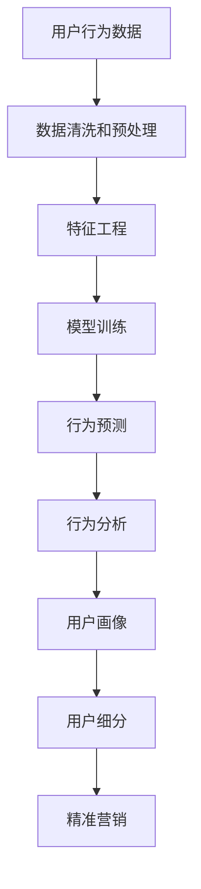

                 

# 用户行为分析：AI如何洞察用户需求，优化商品供给和营销策略

在数字时代，如何深入理解用户行为，洞察用户需求，优化商品供给和营销策略，成为企业数字化转型的关键。人工智能（AI）技术，特别是深度学习和大数据技术，提供了一套强大的工具，帮助企业从海量用户数据中提取有价值的洞见，实现智能运营。本文将从用户行为分析的基本概念、核心算法、项目实践和实际应用场景入手，探讨AI如何在商品供给和营销策略优化中发挥作用，为读者提供一个全面的技术指南。

## 1. 背景介绍

### 1.1 问题由来

在数字经济时代，企业面临的竞争日趋激烈。如何精准把握用户需求，优化商品供给，提升营销效果，成为企业必须解决的难题。传统的市场调研、数据分析方法已经无法满足高速度、高精度的要求，AI技术则提供了全新的解决方案。

AI技术，特别是深度学习算法，能够处理海量数据，从中找到隐含的模式和趋势，为决策提供依据。通过AI技术，企业不仅能够洞察用户需求，还可以优化商品供给和营销策略，从而在竞争中占据优势。

### 1.2 问题核心关键点

为了深入探讨AI在用户行为分析中的应用，本文将从以下几个核心关键点入手：

- 用户行为分析的基本概念和原理。
- 核心算法原理和操作步骤。
- 数学模型和公式的详细讲解。
- 项目实践和代码实现。
- 实际应用场景和未来发展展望。
- 学习资源和工具的推荐。
- 总结研究成果，展望未来趋势和挑战。

## 2. 核心概念与联系

### 2.1 核心概念概述

用户行为分析（User Behavior Analysis, UBA）指的是通过分析用户的行为数据，理解用户需求、行为模式和偏好，从而优化产品和服务。UBA应用广泛，涵盖市场营销、客户关系管理、产品开发等多个领域。

- **用户行为数据**：包括用户的点击、浏览、购买、互动等行为数据，以及用户基本信息和历史数据。
- **用户画像**：基于用户行为数据，构建用户的综合画像，如年龄、性别、兴趣、消费习惯等。
- **用户细分**：将用户根据行为特征划分为不同的群体，以便精准营销。
- **行为预测**：通过机器学习算法，预测用户未来的行为，指导产品推荐和营销策略。

### 2.2 核心概念原理和架构的 Mermaid 流程图



### 2.3 核心概念之间的联系

用户行为分析的各个环节紧密相连，形成一个完整的闭环：

- **数据清洗和预处理**：清洗和处理用户行为数据，去除噪声和异常值，确保数据质量。
- **特征工程**：从原始数据中提取有意义的特征，用于模型训练。
- **模型训练**：选择合适的算法，在标注数据上训练模型，学习用户行为规律。
- **行为预测**：使用训练好的模型，对新数据进行预测，理解用户行为。
- **行为分析**：对用户行为数据进行分析和可视化，生成用户画像。
- **用户细分**：根据用户画像，将用户划分为不同的群体，实施精准营销。

这一流程中，每个环节都至关重要，相互之间相互影响，共同构成用户行为分析的核心。

## 3. 核心算法原理 & 具体操作步骤

### 3.1 算法原理概述

用户行为分析的算法主要集中在数据预处理、特征工程、模型训练和行为预测四个方面。本文将重点介绍机器学习在用户行为分析中的应用。

机器学习算法能够从大量用户行为数据中提取模式和规律，通过训练得到模型，并用于行为预测和分析。常用的算法包括决策树、随机森林、支持向量机、神经网络等。

### 3.2 算法步骤详解

#### 3.2.1 数据清洗和预处理

数据清洗和预处理是用户行为分析的第一步，其目的是提升数据质量，为后续分析提供可靠的基础。具体步骤如下：

1. **数据收集**：从多个渠道收集用户行为数据，包括点击记录、购买记录、互动记录等。
2. **数据清洗**：去除重复数据、缺失数据、异常数据等，确保数据的一致性和完整性。
3. **数据标准化**：对数据进行归一化、编码等标准化处理，便于算法处理。

#### 3.2.2 特征工程

特征工程是用户行为分析的核心环节，其目的是从原始数据中提取有意义的特征，用于模型训练。具体步骤如下：

1. **特征选择**：根据领域知识选择对目标变量有影响的特征，剔除无关特征。
2. **特征构造**：通过数学变换、组合等方法构造新的特征，增强模型的预测能力。
3. **特征缩放**：对特征进行归一化、标准化等处理，提升模型的收敛速度和性能。

#### 3.2.3 模型训练

模型训练是用户行为分析的关键步骤，其目的是通过训练得到模型，用于行为预测和分析。具体步骤如下：

1. **选择合适的算法**：根据问题特点选择合适的算法，如线性回归、决策树、神经网络等。
2. **划分训练集和测试集**：将数据划分为训练集和测试集，用于模型训练和评估。
3. **训练模型**：在训练集上训练模型，调整超参数，优化模型性能。

#### 3.2.4 行为预测

行为预测是用户行为分析的最终目标，其目的是通过模型预测用户未来的行为，指导产品推荐和营销策略。具体步骤如下：

1. **预测模型**：在测试集上评估模型性能，选择性能最优的模型用于行为预测。
2. **预测结果**：使用模型对新数据进行预测，生成用户行为预测结果。
3. **结果应用**：根据预测结果，调整产品推荐和营销策略，实现精准营销。

### 3.3 算法优缺点

用户行为分析的算法在提供洞见的同时，也存在一些缺点：

**优点：**

1. **精准预测**：机器学习算法能够从大量数据中提取模式和规律，提供精准的行为预测。
2. **自动化分析**：算法能够自动化处理数据，生成用户画像和行为分析结果，提高效率。
3. **动态调整**：通过实时数据，动态调整模型参数，提高预测准确性。

**缺点：**

1. **数据依赖**：算法效果依赖于数据质量，数据缺失或不准确会影响预测结果。
2. **模型复杂**：复杂的模型需要大量计算资源和时间，不适用于小型数据集。
3. **解释性差**：机器学习模型通常是黑盒，难以解释其内部工作机制。

### 3.4 算法应用领域

用户行为分析的算法在多个领域中得到了广泛应用：

1. **电子商务**：通过分析用户购买行为，推荐相关商品，提升用户体验和销售额。
2. **金融服务**：分析用户交易行为，预测风险，提供个性化的金融产品和服务。
3. **社交媒体**：分析用户互动行为，优化广告投放策略，提升用户粘性和留存率。
4. **健康医疗**：分析用户健康行为，提供个性化的健康建议和治疗方案。
5. **旅游行业**：分析用户旅游行为，优化旅游产品和服务，提升用户满意度。

## 4. 数学模型和公式 & 详细讲解

### 4.1 数学模型构建

用户行为分析的数学模型主要包括以下几个部分：

1. **数据预处理模型**：包括数据清洗、特征工程等步骤。
2. **预测模型**：基于用户行为数据，使用机器学习算法进行行为预测。
3. **行为分析模型**：对用户行为数据进行分析和可视化，生成用户画像。

### 4.2 公式推导过程

#### 4.2.1 数据预处理模型

数据预处理模型主要用于清洗和标准化数据，常见的预处理模型包括：

1. **缺失值处理模型**：通过插值、删除等方法处理缺失数据。
2. **异常值检测模型**：通过统计学方法检测和处理异常值。
3. **数据归一化模型**：使用归一化方法对数据进行标准化处理。

#### 4.2.2 预测模型

预测模型是用户行为分析的核心，常见的预测模型包括：

1. **线性回归模型**：$$\hat{y} = \beta_0 + \beta_1x_1 + \beta_2x_2 + \cdots + \beta_nx_n$$
2. **决策树模型**：$$\hat{y} = \begin{cases} 1, & \text{if} \; x_1 \leq T_1 \\ 0, & \text{if} \; x_1 > T_1 \end{cases}$$
3. **神经网络模型**：$$\hat{y} = \sigma(Wx + b)$$

#### 4.2.3 行为分析模型

行为分析模型主要用于生成用户画像和可视化分析结果，常见的行为分析模型包括：

1. **聚类分析模型**：通过K-means等算法对用户进行聚类分析。
2. **关联规则模型**：通过Apriori等算法发现用户行为中的关联规则。
3. **时间序列模型**：使用ARIMA等算法分析用户行为的时间序列规律。

### 4.3 案例分析与讲解

假设某电商平台收集了用户的历史购买数据，希望通过分析用户行为，优化商品推荐策略。具体步骤如下：

1. **数据清洗和预处理**：去除重复数据，处理缺失值，标准化数据。
2. **特征工程**：选择用户基本信息、浏览记录、购买记录等特征，构造新的特征，如购买频率、平均消费金额等。
3. **模型训练**：使用随机森林算法训练预测模型，预测用户未来的购买行为。
4. **行为分析**：分析用户购买行为，生成用户画像，进行用户细分。
5. **优化推荐策略**：根据用户画像和购买行为，优化商品推荐策略，提升用户满意度。

## 5. 项目实践：代码实例和详细解释说明

### 5.1 开发环境搭建

在进行用户行为分析项目实践时，需要使用Python和相关工具，具体步骤如下：

1. **安装Python和相关库**：
```bash
sudo apt-get update
sudo apt-get install python3
sudo pip3 install pandas numpy scikit-learn matplotlib
```

2. **设置Python环境**：
```bash
python3 -m venv env
source env/bin/activate
```

### 5.2 源代码详细实现

以下是一个简单的用户行为分析项目代码示例：

```python
import pandas as pd
from sklearn.ensemble import RandomForestRegressor
from sklearn.model_selection import train_test_split
import matplotlib.pyplot as plt

# 读取数据
data = pd.read_csv('user_behavior_data.csv')

# 数据清洗和预处理
data.drop_duplicates(inplace=True)
data.dropna(subset=['id', 'purchase_amount'], inplace=True)
data['purchase_amount'] = data['purchase_amount'].astype(float)
data['time'] = pd.to_datetime(data['time'], format='%Y-%m-%d %H:%M:%S')

# 特征工程
features = ['id', 'age', 'gender', 'time', 'purchase_amount']
target = 'revenue'
X = data[features]
y = data[target]

# 模型训练
X_train, X_test, y_train, y_test = train_test_split(X, y, test_size=0.2, random_state=42)
model = RandomForestRegressor(n_estimators=100, random_state=42)
model.fit(X_train, y_train)

# 行为预测
predictions = model.predict(X_test)

# 行为分析
user_profile = data.groupby('id').agg({'time': 'mean', 'purchase_amount': 'mean'})
plt.figure(figsize=(10, 6))
plt.plot(user_profile['time'], user_profile['purchase_amount'], marker='o', linestyle='-', color='blue')
plt.xlabel('Time')
plt.ylabel('Purchase Amount')
plt.title('User Purchase Behavior')
plt.show()

# 用户细分
kmeans = KMeans(n_clusters=5, random_state=42)
kmeans.fit(X_train)
X_train['cluster'] = kmeans.predict(X_train)

# 精准营销
segmentation_data = data.groupby('cluster').agg({'target': 'count'})
print(segmentation_data)
```

### 5.3 代码解读与分析

以上代码实现了用户行为分析的基本流程，包括以下几个关键步骤：

1. **数据读取和预处理**：使用Pandas库读取数据，并进行清洗和预处理，去除重复数据和缺失值。
2. **特征工程**：选择用户基本信息、时间、购买金额等特征，使用随机森林算法训练预测模型。
3. **模型训练**：在训练集上训练模型，生成预测结果。
4. **行为分析**：使用matplotlib库生成用户购买行为的时间序列图。
5. **用户细分**：使用K-means算法对用户进行聚类分析，生成用户细分结果。
6. **精准营销**：使用用户细分结果，实施精准营销策略。

## 6. 实际应用场景

### 6.1 智能推荐系统

智能推荐系统是用户行为分析的重要应用场景，通过分析用户的历史行为数据，推荐相关商品或内容，提升用户体验和满意度。智能推荐系统在电子商务、在线媒体、社交网络等领域广泛应用。

#### 6.1.1 技术实现

1. **数据收集**：收集用户的历史浏览、点击、购买等行为数据。
2. **数据预处理**：清洗和标准化数据，去除噪声和异常值。
3. **特征工程**：选择对推荐效果有影响的特征，构造新的特征，如浏览频率、购买金额等。
4. **模型训练**：使用协同过滤、神经网络等算法训练推荐模型。
5. **行为预测**：使用训练好的模型预测用户的行为，生成推荐结果。
6. **推荐系统优化**：根据用户反馈和行为数据，动态调整推荐策略，提升推荐效果。

#### 6.1.2 实际应用

某电商平台的推荐系统通过用户行为分析，实现了个性化推荐，提升了用户的购买转化率和满意度。具体步骤如下：

1. **数据收集**：收集用户的历史浏览、点击、购买等行为数据。
2. **数据预处理**：清洗和标准化数据，去除噪声和异常值。
3. **特征工程**：选择用户基本信息、浏览记录、购买记录等特征，构造新的特征，如购买频率、平均消费金额等。
4. **模型训练**：使用协同过滤算法训练推荐模型，生成推荐结果。
5. **行为预测**：分析用户购买行为，生成用户画像，进行用户细分。
6. **推荐系统优化**：根据用户画像和购买行为，优化推荐策略，提升用户满意度。

### 6.2 客户关系管理

客户关系管理（CRM）系统是企业了解用户需求、提升用户体验的重要工具。通过分析用户行为数据，企业可以了解用户的偏好和需求，制定精准的营销策略，提升客户满意度和忠诚度。

#### 6.2.1 技术实现

1. **数据收集**：收集用户的联系信息、历史互动数据等。
2. **数据预处理**：清洗和标准化数据，去除噪声和异常值。
3. **特征工程**：选择对客户关系管理有影响的特征，构造新的特征，如互动频率、投诉次数等。
4. **模型训练**：使用逻辑回归、决策树等算法训练模型，预测用户流失风险。
5. **行为预测**：使用训练好的模型预测用户流失风险，生成用户画像。
6. **客户关系管理**：根据用户画像，制定精准的营销策略，提升客户满意度和忠诚度。

#### 6.2.2 实际应用

某金融公司的CRM系统通过用户行为分析，实现了精准的客户流失预测和预警，提升了客户满意度和留存率。具体步骤如下：

1. **数据收集**：收集用户的联系信息、交易记录、投诉记录等。
2. **数据预处理**：清洗和标准化数据，去除噪声和异常值。
3. **特征工程**：选择用户基本信息、交易记录、投诉记录等特征，构造新的特征，如交易频率、投诉次数等。
4. **模型训练**：使用逻辑回归算法训练模型，预测用户流失风险。
5. **行为预测**：分析用户交易行为，生成用户画像，进行客户细分。
6. **客户关系管理**：根据用户画像和流失风险，制定精准的营销策略，提升客户满意度和留存率。

## 7. 工具和资源推荐

### 7.1 学习资源推荐

为了帮助开发者系统掌握用户行为分析的理论基础和实践技巧，这里推荐一些优质的学习资源：

1. **《Python数据科学手册》**：涵盖了Python在数据科学中的应用，包括数据清洗、特征工程、模型训练等。
2. **《机器学习实战》**：通过实战案例，介绍机器学习算法的应用，适合初学者。
3. **Kaggle**：包含大量机器学习和数据科学竞赛数据集，适合练习和验证算法。
4. **Google Colab**：免费的Python在线环境，方便开发者快速迭代和测试算法。
5. **Coursera**：提供机器学习和数据科学课程，涵盖从入门到进阶的各个阶段。

### 7.2 开发工具推荐

高效的开发离不开优秀的工具支持。以下是几款用于用户行为分析开发的常用工具：

1. **Python**：开源、灵活的编程语言，适合数据处理和算法开发。
2. **Pandas**：数据处理和分析库，支持大规模数据集操作。
3. **NumPy**：数值计算库，支持高效的数据处理和计算。
4. **Scikit-learn**：机器学习库，提供丰富的算法和工具。
5. **TensorFlow**：深度学习框架，支持复杂的模型训练和优化。
6. **PyTorch**：深度学习框架，支持动态计算图和高效的模型训练。

### 7.3 相关论文推荐

用户行为分析的相关论文代表了大数据和机器学习技术的发展脉络。以下是几篇奠基性的相关论文，推荐阅读：

1. **《用户行为分析的分类与技术》**：介绍用户行为分析的分类方法和技术，适合入门学习。
2. **《基于机器学习的行为分析》**：通过案例介绍机器学习在用户行为分析中的应用，适合深入理解。
3. **《用户行为分析的最新进展》**：总结用户行为分析的最新进展和技术趋势，适合前沿研究。

## 8. 总结：未来发展趋势与挑战

### 8.1 总结

本文对用户行为分析的基本概念、核心算法、项目实践和实际应用进行了全面系统的介绍。通过用户行为分析，企业能够深入了解用户需求和行为模式，优化商品供给和营销策略，提升用户满意度和市场竞争力。

### 8.2 未来发展趋势

展望未来，用户行为分析技术将呈现以下几个发展趋势：

1. **数据融合与协同分析**：未来，用户行为分析将更多地融合多源数据，进行协同分析，提供更全面、准确的用户画像。
2. **实时分析和动态调整**：实时数据分析和动态调整将成为用户行为分析的重要方向，提高决策的实时性和有效性。
3. **个性化推荐与定制化服务**：通过深度学习算法，实现个性化推荐和定制化服务，提升用户体验和满意度。
4. **跨平台与跨设备协同**：用户行为分析将更多地关注跨平台、跨设备的数据协同，实现更全面、精准的用户画像。
5. **自动化与智能化**：通过AI技术，实现自动化用户行为分析和智能化决策支持，提高工作效率和准确性。

### 8.3 面临的挑战

尽管用户行为分析技术已经取得了一定的进展，但在实际应用中仍面临以下挑战：

1. **数据隐私与安全**：用户行为数据的隐私和安全问题亟需解决，如何保护用户隐私、确保数据安全，成为重要的研究方向。
2. **算法透明性与可解释性**：机器学习算法的透明性和可解释性问题需要进一步解决，以便更好地理解和信任算法。
3. **数据质量与可用性**：高质量、可用性的数据是用户行为分析的基础，数据缺失、不准确等问题亟需解决。
4. **计算资源与成本**：大规模数据集和复杂算法的计算资源和成本问题需要解决，以便更好地支持用户行为分析。

### 8.4 研究展望

面对用户行为分析面临的挑战，未来的研究需要在以下几个方面寻求新的突破：

1. **隐私保护与数据安全**：研究隐私保护和数据安全技术，保护用户隐私和数据安全。
2. **算法透明性与可解释性**：研究算法透明性和可解释性技术，提升算法的可信度和可解释性。
3. **数据质量与可用性**：研究数据清洗和预处理技术，提高数据质量和可用性。
4. **计算资源与成本优化**：研究计算资源与成本优化技术，支持大规模用户行为分析。
5. **跨平台与跨设备协同**：研究跨平台与跨设备数据协同技术，实现更全面、精准的用户画像。
6. **实时分析与动态调整**：研究实时分析和动态调整技术，提高决策的实时性和有效性。

总之，用户行为分析技术需要从多个方面进行突破，才能更好地满足实际应用的需求，为用户提供更精准、高效的服务。

## 9. 附录：常见问题与解答

### Q1：用户行为分析是否适用于所有行业？

A: 用户行为分析在电子商务、金融服务、社交媒体、健康医疗、旅游行业等多个领域中得到了广泛应用。不同行业的用户行为分析方法略有差异，需要结合行业特点进行优化。

### Q2：如何进行用户画像的生成和分析？

A: 用户画像的生成和分析需要结合具体业务需求进行。常用的方法包括：

1. **数据收集**：收集用户的浏览、点击、购买等行为数据。
2. **数据预处理**：清洗和标准化数据，去除噪声和异常值。
3. **特征工程**：选择对业务有影响的特征，构造新的特征，如购买频率、平均消费金额等。
4. **模型训练**：使用机器学习算法训练模型，生成用户画像。
5. **行为分析**：对用户画像进行可视化分析，生成报告和图表。

### Q3：用户行为分析对企业有哪些具体应用？

A: 用户行为分析对企业有以下具体应用：

1. **智能推荐系统**：根据用户行为数据，推荐相关商品或内容，提升用户体验和满意度。
2. **客户关系管理**：了解用户需求和行为模式，制定精准的营销策略，提升客户满意度和忠诚度。
3. **商品供给优化**：分析用户行为数据，优化商品种类和库存，提升用户购买转化率。
4. **个性化定制服务**：通过用户行为分析，提供个性化的产品和服务，提升用户体验和满意度。
5. **营销策略优化**：分析用户行为数据，优化广告投放策略，提升广告效果和ROI。

### Q4：用户行为分析面临哪些技术挑战？

A: 用户行为分析面临以下技术挑战：

1. **数据隐私与安全**：用户行为数据的隐私和安全问题亟需解决。
2. **算法透明性与可解释性**：机器学习算法的透明性和可解释性问题需要进一步解决。
3. **数据质量与可用性**：高质量、可用性的数据是用户行为分析的基础，数据缺失、不准确等问题亟需解决。
4. **计算资源与成本**：大规模数据集和复杂算法的计算资源和成本问题需要解决。
5. **跨平台与跨设备协同**：用户行为分析需要更多地关注跨平台、跨设备的数据协同，实现更全面、精准的用户画像。

### Q5：用户行为分析在实际应用中如何提升用户体验？

A: 用户行为分析在实际应用中可以通过以下方式提升用户体验：

1. **个性化推荐**：根据用户行为数据，推荐相关商品或内容，提升用户体验和满意度。
2. **精准营销**：分析用户行为数据，制定精准的营销策略，提升用户满意度和忠诚度。
3. **商品优化**：分析用户行为数据，优化商品种类和库存，提升用户购买转化率。
4. **定制化服务**：通过用户行为分析，提供个性化的产品和服务，提升用户体验和满意度。
5. **营销策略优化**：分析用户行为数据，优化广告投放策略，提升广告效果和ROI。

总之，用户行为分析技术需要结合具体业务需求进行优化，才能更好地提升用户体验和市场竞争力。

---

作者：禅与计算机程序设计艺术 / Zen and the Art of Computer Programming

