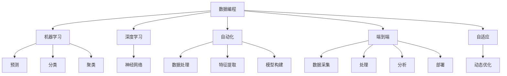

                 

# 用数据编程：软件2.0的编程范式

> 关键词：数据编程, 软件2.0, 编程范式, 数据驱动, 自动化, 机器学习, 深度学习, 人工智能

## 1. 背景介绍

### 1.1 问题由来

随着计算机技术的飞速发展，编程范式也经历了从1.0的面向过程编程（Procedural Programming）到2.0的面向对象编程（Object-Oriented Programming），再到3.0的面向函数编程（Functional Programming）的演变。每一个范式都为开发出更高效、更灵活的软件系统提供了新的工具和思想。

然而，无论是早期的面向过程编程，还是面向对象、函数式编程，它们的核心思想都是“代码驱动”，即通过编写代码来指导计算机执行特定的操作。随着数据科学、人工智能等新兴领域的崛起，大量的软件系统开始越来越多地依赖于数据和算法，而不仅仅是代码。

在这个背景下，一种全新的编程范式应运而生——**数据编程**。它将数据和算法看作编程的核心，通过数据驱动的方式，让机器学习、深度学习等技术更好地服务于实际应用，从而推动软件系统的演进。

### 1.2 问题核心关键点

数据编程的核心在于“用数据编程”，即让数据而非代码成为软件系统的核心。这一范式将数据科学和编程技术紧密结合，使得软件开发变得更加高效、灵活和可扩展。具体而言，数据编程具有以下关键特点：

- **数据驱动**：将数据而非代码作为软件的核心，通过数据来指导算法的执行。
- **自动化**：利用机器学习、深度学习等自动化技术，自动从数据中提取特征、构建模型。
- **端到端**：从数据收集、处理、分析到应用部署，实现全流程自动化。
- **自适应**：模型可以自适应新数据，不断迭代优化，适应动态变化的环境。

这些特点使得数据编程范式在处理复杂数据、构建智能应用等方面具有显著优势。

## 2. 核心概念与联系

### 2.1 核心概念概述

为了更好地理解数据编程范式，我们先介绍几个关键概念：

- **数据编程**：一种以数据为中心的编程范式，强调用数据而非代码来指导算法的执行，使得软件系统更加灵活、高效。
- **机器学习**：通过算法从数据中自动学习规律，实现预测、分类、聚类等任务，是数据编程的核心技术之一。
- **深度学习**：一种基于神经网络的机器学习方法，能够处理大规模复杂数据，是数据编程的主要工具之一。
- **自动化**：利用机器学习、深度学习等技术自动完成数据处理、特征提取、模型构建等任务，减少人工干预。
- **端到端**：从数据采集、处理、分析到应用部署，实现全流程自动化，避免数据孤岛。
- **自适应**：模型能够自适应新数据，不断优化自身性能，适应动态变化的环境。

这些概念之间的逻辑关系可以通过以下Mermaid流程图来展示：



这个流程图展示了一系列核心概念及其相互关系：

1. 数据编程是核心，通过机器学习和深度学习实现预测、分类、聚类等任务。
2. 自动化技术用于自动完成数据处理、特征提取、模型构建等。
3. 端到端流程实现全流程自动化，避免数据孤岛。
4. 自适应模型能够适应新数据，不断优化自身性能。

这些概念共同构成了数据编程范式的基础框架，使得数据编程能够高效地处理复杂数据、构建智能应用。

## 3. 核心算法原理 & 具体操作步骤
### 3.1 算法原理概述

数据编程的核心在于将数据和算法紧密结合，通过自动化技术从数据中提取特征、构建模型，最终实现数据驱动的软件系统。这一过程可以分为以下几个关键步骤：

1. **数据采集**：从不同的数据源收集数据，并将其转换为机器学习、深度学习模型能够处理的格式。
2. **数据预处理**：清洗数据、填补缺失值、标准化等，确保数据的质量和一致性。
3. **特征提取**：从数据中自动提取有用的特征，生成特征向量，为模型训练做准备。
4. **模型构建**：利用机器学习、深度学习算法构建模型，进行训练和优化。
5. **模型部署**：将训练好的模型部署到实际应用中，实现自动化推理。

数据编程的核心算法原理可以总结如下：

1. **数据驱动**：通过数据来指导算法的执行，使得软件系统更加灵活、高效。
2. **自动化**：利用机器学习、深度学习等技术自动完成数据处理、特征提取、模型构建等任务，减少人工干预。
3. **端到端**：从数据采集、处理、分析到应用部署，实现全流程自动化，避免数据孤岛。
4. **自适应**：模型能够自适应新数据，不断优化自身性能，适应动态变化的环境。

### 3.2 算法步骤详解

以下我们详细介绍数据编程的具体操作步骤：

**Step 1: 数据采集**

数据采集是数据编程的第一步。数据来源可以是多种多样的，包括传感器数据、用户行为数据、网络日志数据等。具体来说，数据采集的步骤包括：

1. 确定数据源：根据应用需求，选择合适的数据源。
2. 数据收集：通过API、爬虫等方式收集数据，存储在本地或云存储中。
3. 数据清洗：去除重复、缺失、异常数据，确保数据质量。

**Step 2: 数据预处理**

数据预处理是数据编程的关键环节之一。通过预处理，可以清洗数据、填补缺失值、标准化等，确保数据的一致性和可用性。具体来说，数据预处理的步骤包括：

1. 数据清洗：去除重复、缺失、异常数据，确保数据质量。
2. 数据标准化：将数据转换为标准格式，方便后续处理。
3. 数据增强：通过数据增强技术，丰富数据集，提高模型泛化能力。

**Step 3: 特征提取**

特征提取是从原始数据中提取出有用的特征，生成特征向量，为模型训练做准备。具体来说，特征提取的步骤包括：

1. 特征选择：根据业务需求和领域知识，选择最相关的特征。
2. 特征工程：对特征进行编码、归一化、降维等操作，生成特征向量。
3. 特征融合：将不同特征融合在一起，生成综合特征向量。

**Step 4: 模型构建**

模型构建是数据编程的核心环节之一。通过构建机器学习、深度学习模型，实现数据的预测、分类、聚类等任务。具体来说，模型构建的步骤包括：

1. 模型选择：根据任务需求，选择适当的机器学习、深度学习模型。
2. 模型训练：使用训练数据集，训练模型，调整模型参数，优化模型性能。
3. 模型评估：使用测试数据集，评估模型性能，选择最优模型。

**Step 5: 模型部署**

模型部署是将训练好的模型应用到实际问题中，实现自动化推理。具体来说，模型部署的步骤包括：

1. 模型优化：对模型进行优化，提高推理速度和效率。
2. 模型部署：将模型部署到服务器、嵌入式设备等环境中，实现自动化推理。
3. 监控与优化：实时监控模型性能，根据反馈数据进行优化。

### 3.3 算法优缺点

数据编程范式具有以下优点：

1. **灵活高效**：数据驱动使得软件系统更加灵活、高效，能够快速适应新数据、新需求。
2. **自动化程度高**：利用机器学习、深度学习等自动化技术，自动完成数据处理、特征提取、模型构建等任务，减少人工干预。
3. **全流程自动化**：从数据采集、处理、分析到应用部署，实现全流程自动化，避免数据孤岛。
4. **自适应能力强**：模型能够自适应新数据，不断优化自身性能，适应动态变化的环境。

然而，数据编程也存在一些局限性：

1. **数据质量要求高**：数据编程对数据质量要求较高，需要经过严格的数据清洗和预处理。
2. **模型复杂度大**：由于数据复杂度较高，模型的构建和训练可能较为复杂。
3. **计算资源需求高**：数据编程需要大量的计算资源，特别是深度学习模型，需要高性能计算设备支持。
4. **技术门槛高**：数据编程需要掌握机器学习、深度学习等先进技术，对开发者技术要求较高。

尽管存在这些局限性，但数据编程在处理复杂数据、构建智能应用等方面具有显著优势，正在成为软件编程的重要范式。

### 3.4 算法应用领域

数据编程在多个领域得到了广泛应用，包括但不限于以下几个方面：

- **智能推荐系统**：利用用户行为数据，构建推荐模型，实现个性化推荐。
- **金融风控系统**：通过金融交易数据，构建风险评估模型，实现智能风控。
- **医疗诊断系统**：利用患者数据，构建诊断模型，实现智能诊断。
- **智能客服系统**：利用用户对话数据，构建对话模型，实现智能客服。
- **智慧城市系统**：通过城市数据，构建智能分析模型，实现智慧城市治理。

## 4. 数学模型和公式 & 详细讲解 & 举例说明

### 4.1 数学模型构建

数据编程的数学模型主要涉及机器学习和深度学习的相关模型。这里以线性回归模型为例，介绍数据编程的数学模型构建过程。

假设有一个线性回归问题，输入为 $x=(x_1,x_2,...,x_n)$，输出为 $y$，模型为 $y=w_1x_1+w_2x_2+...+w_nx_n+b$，其中 $w_1,w_2,...,w_n$ 为模型参数，$b$ 为截距。

设训练数据集为 $D=\{(x_i,y_i)\}_{i=1}^N$，则线性回归的目标是最小化均方误差损失函数：

$$
L(w)=\frac{1}{2N}\sum_{i=1}^N(y_i-w_1x_{i1}-w_2x_{i2}-...-w_nx_{in}-b)^2
$$

其中，均方误差损失函数为：

$$
J(w)=\frac{1}{2N}\sum_{i=1}^N(y_i-w_1x_{i1}-w_2x_{i2}-...-w_nx_{in}-b)^2
$$

求解最小化均方误差损失函数的线性回归模型参数 $w$ 和 $b$，可以得到如下公式：

$$
w=(x^T x)^{-1} x^T y
$$

$$
b=y-\sum_{i=1}^N w_i x_i
$$

其中，$x^T$ 为 $x$ 的转置矩阵。

### 4.2 公式推导过程

线性回归模型的推导过程如下：

1. 假设模型 $y=w_1x_1+w_2x_2+...+w_nx_n+b$，其中 $w_i$ 为模型参数，$b$ 为截距。
2. 假设训练数据集为 $D=\{(x_i,y_i)\}_{i=1}^N$，其中 $x_i$ 为输入向量，$y_i$ 为输出向量。
3. 设均方误差损失函数为 $J(w)=\frac{1}{2N}\sum_{i=1}^N(y_i-w_1x_{i1}-w_2x_{i2}-...-w_nx_{in}-b)^2$。
4. 对 $w_i$ 和 $b$ 求偏导数，并令偏导数等于0，得到：

   $$
   \frac{\partial J(w)}{\partial w_i}=-\frac{1}{N}\sum_{i=1}^N(x_i-\bar{x})(y_i-w_1\bar{x}_1-w_2\bar{x}_2-...-w_n\bar{x}_n-b)=0
   $$

   $$
   \frac{\partial J(w)}{\partial b}=-\frac{1}{N}\sum_{i=1}^N(y_i-w_1x_{i1}-w_2x_{i2}-...-w_nx_{in}-b)=0
   $$

   其中 $\bar{x}$ 为 $x$ 的均值，$\bar{x}_i$ 为 $x_i$ 的均值。
5. 对 $w_i$ 和 $b$ 的表达式进行简化，得到：

   $$
   w=(x^T x)^{-1} x^T y
   $$

   $$
   b=y-\sum_{i=1}^N w_i x_i
   $$

6. 将 $w$ 和 $b$ 的表达式代入均方误差损失函数，得到：

   $$
   J(w)=\frac{1}{2N}\sum_{i=1}^N(y_i-w_1x_{i1}-w_2x_{i2}-...-w_nx_{in}-b)^2
   $$

   通过求解最小化均方误差损失函数的线性回归模型参数 $w$ 和 $b$，可以得到线性回归模型。

### 4.3 案例分析与讲解

以房价预测为例，分析数据编程在实际应用中的使用过程。

假设有一个房价预测问题，需要根据房屋面积、房间数量、地理位置等特征，预测房价。可以按照以下步骤进行数据编程：

1. **数据采集**：收集房屋面积、房间数量、地理位置等特征数据，以及对应的房价数据，存储在数据库中。
2. **数据预处理**：清洗数据，去除重复、缺失、异常数据，并进行标准化处理。
3. **特征提取**：选择房屋面积、房间数量、地理位置等特征，生成特征向量。
4. **模型构建**：使用线性回归模型，构建房价预测模型，进行训练和优化。
5. **模型部署**：将训练好的模型部署到实际应用中，实现自动化房价预测。

以下是一个简单的Python代码示例，展示如何使用Scikit-learn库进行线性回归模型的构建和训练：

```python
from sklearn.linear_model import LinearRegression
from sklearn.metrics import mean_squared_error
import numpy as np

# 数据集
X = np.array([[120, 3, 0], [150, 2, 1], [90, 1, 0]])
y = np.array([200000, 300000, 150000])

# 构建模型
model = LinearRegression()
model.fit(X, y)

# 预测房价
X_test = np.array([[130, 2, 1]])
y_pred = model.predict(X_test)

# 输出预测结果和均方误差
print("预测房价为：", y_pred)
print("均方误差为：", mean_squared_error(y_test, y_pred))
```

## 5. 项目实践：代码实例和详细解释说明

### 5.1 开发环境搭建

要进行数据编程实践，首先需要搭建开发环境。以下是使用Python进行数据编程的开发环境配置流程：

1. 安装Python：从官网下载并安装Python，根据不同操作系统选择合适的版本。
2. 安装必要的库：安装NumPy、Pandas、Scikit-learn、TensorFlow、Keras等数据科学和机器学习库。
3. 安装数据处理工具：安装Apache Spark、Hadoop等大数据处理工具，以便处理大规模数据集。
4. 安装深度学习框架：安装TensorFlow、PyTorch等深度学习框架，用于构建和训练深度学习模型。
5. 安装可视化工具：安装Matplotlib、Seaborn等数据可视化工具，用于分析模型性能。

完成上述步骤后，即可在Python环境下进行数据编程实践。

### 5.2 源代码详细实现

下面我们以房价预测为例，给出使用Scikit-learn库进行线性回归模型构建和训练的Python代码实现。

```python
from sklearn.linear_model import LinearRegression
from sklearn.metrics import mean_squared_error
import numpy as np

# 数据集
X = np.array([[120, 3, 0], [150, 2, 1], [90, 1, 0]])
y = np.array([200000, 300000, 150000])

# 构建模型
model = LinearRegression()
model.fit(X, y)

# 预测房价
X_test = np.array([[130, 2, 1]])
y_pred = model.predict(X_test)

# 输出预测结果和均方误差
print("预测房价为：", y_pred)
print("均方误差为：", mean_squared_error(y_test, y_pred))
```

### 5.3 代码解读与分析

让我们再详细解读一下关键代码的实现细节：

**数据集定义**：
- `X` 为特征矩阵，包含房屋面积、房间数量、地理位置等特征。
- `y` 为输出向量，即房价。

**模型构建**：
- 使用 `LinearRegression` 类构建线性回归模型。

**模型训练**：
- 使用 `fit` 方法对模型进行训练，输入特征矩阵 `X` 和输出向量 `y`。

**模型预测**：
- 使用 `predict` 方法对新的特征向量进行预测，输入测试数据 `X_test`。

**模型评估**：
- 使用 `mean_squared_error` 函数计算模型预测结果与真实结果之间的均方误差，输入预测结果 `y_pred` 和真实结果 `y_test`。

通过上述代码，我们可以看到数据编程的实际应用过程。在实际应用中，数据采集、数据预处理、特征提取、模型构建和模型部署等步骤都需要通过编写代码来实现，从而实现数据驱动的软件系统。

## 6. 实际应用场景

### 6.1 智能推荐系统

智能推荐系统是数据编程的重要应用场景之一。通过利用用户行为数据，构建推荐模型，实现个性化推荐。具体来说，智能推荐系统的实现过程如下：

1. **数据采集**：收集用户的历史行为数据，包括浏览记录、购买记录等。
2. **数据预处理**：清洗数据，去除重复、缺失、异常数据，并进行标准化处理。
3. **特征提取**：选择用户行为特征，生成特征向量。
4. **模型构建**：使用协同过滤、矩阵分解等推荐算法，构建推荐模型，进行训练和优化。
5. **模型部署**：将训练好的模型部署到实际应用中，实现自动化推荐。

### 6.2 金融风控系统

金融风控系统是数据编程的另一个重要应用场景。通过利用金融交易数据，构建风险评估模型，实现智能风控。具体来说，金融风控系统的实现过程如下：

1. **数据采集**：收集金融交易数据，包括交易金额、交易时间、交易地点等。
2. **数据预处理**：清洗数据，去除重复、缺失、异常数据，并进行标准化处理。
3. **特征提取**：选择交易特征，生成特征向量。
4. **模型构建**：使用逻辑回归、支持向量机等分类算法，构建风控模型，进行训练和优化。
5. **模型部署**：将训练好的模型部署到实际应用中，实现自动化风险评估。

### 6.3 医疗诊断系统

医疗诊断系统是数据编程的另一个重要应用场景。通过利用患者数据，构建诊断模型，实现智能诊断。具体来说，医疗诊断系统的实现过程如下：

1. **数据采集**：收集患者的健康数据，包括病历、体检结果等。
2. **数据预处理**：清洗数据，去除重复、缺失、异常数据，并进行标准化处理。
3. **特征提取**：选择患者特征，生成特征向量。
4. **模型构建**：使用神经网络、支持向量机等分类算法，构建诊断模型，进行训练和优化。
5. **模型部署**：将训练好的模型部署到实际应用中，实现自动化诊断。

## 7. 工具和资源推荐

### 7.1 学习资源推荐

为了帮助开发者系统掌握数据编程的理论基础和实践技巧，这里推荐一些优质的学习资源：

1. 《Python数据科学手册》：一本全面介绍Python数据科学和机器学习的书籍，适合初学者和中级开发者。
2. 《深度学习》课程：由斯坦福大学Andrew Ng教授主讲的深度学习课程，详细介绍了深度学习的基本原理和实践技巧。
3. Coursera数据科学系列课程：Coursera上提供的一系列数据科学课程，涵盖从数据清洗到模型构建的全流程。
4. Kaggle数据竞赛平台：一个在线数据科学竞赛平台，提供大量数据集和机器学习实践机会。
5. TensorFlow官方文档：TensorFlow官方文档，提供详细的使用指南和代码示例。

通过对这些资源的学习实践，相信你一定能够快速掌握数据编程的精髓，并用于解决实际的NLP问题。

### 7.2 开发工具推荐

高效的数据编程离不开优秀的工具支持。以下是几款用于数据编程开发的常用工具：

1. Jupyter Notebook：一个交互式编程环境，支持Python、R等多种语言，方便代码调试和数据可视化。
2. Apache Spark：一个分布式计算框架，用于处理大规模数据集，支持数据采集、数据处理、数据存储等全流程。
3. TensorFlow：由Google主导开发的深度学习框架，支持大规模分布式计算，适合构建复杂深度学习模型。
4. Keras：一个高级深度学习框架，易于使用，适合快速原型开发和模型构建。
5. Matplotlib、Seaborn：数据可视化工具，用于展示模型性能和数据分布。

合理利用这些工具，可以显著提升数据编程的开发效率，加快创新迭代的步伐。

### 7.3 相关论文推荐

数据编程作为新兴技术，正在快速发展。以下是几篇奠基性的相关论文，推荐阅读：

1. Data Programming：一种新型编程范式，通过数据驱动实现模型自动化构建和优化。
2. Data Programming for Deep Learning Tasks：利用数据编程范式，解决复杂的数据处理和模型构建问题。
3. AutoML：自动化机器学习技术，通过自动化技术提高机器学习模型的构建和优化效率。
4. Deep Learning via Automated Synthesis of Invariant Machine Descriptions：通过自动化技术，自动构建深度学习模型。

这些论文代表了大数据编程技术的发展脉络。通过学习这些前沿成果，可以帮助研究者把握学科前进方向，激发更多的创新灵感。

## 8. 总结：未来发展趋势与挑战

### 8.1 总结

本文对数据编程范式进行了全面系统的介绍。首先阐述了数据编程的背景和意义，明确了数据编程在处理复杂数据、构建智能应用方面的独特价值。其次，从原理到实践，详细讲解了数据编程的数学模型和关键步骤，给出了数据编程任务开发的完整代码实例。同时，本文还广泛探讨了数据编程在智能推荐、金融风控、医疗诊断等多个领域的应用前景，展示了数据编程范式的广阔前景。

通过本文的系统梳理，可以看到，数据编程范式正在成为数据科学和机器学习的重要工具，极大地提高了数据分析和模型构建的效率，推动了大数据应用的发展。未来，伴随数据编程技术的不断演进，数据科学将进一步与软件开发、工程实践紧密结合，带来更多的创新应用。

### 8.2 未来发展趋势

展望未来，数据编程范式将呈现以下几个发展趋势：

1. **自动化程度更高**：随着自动化技术的发展，数据编程将越来越自动化，减少人工干预，提高效率。
2. **模型复杂度更大**：深度学习、强化学习等先进技术的普及，将使得数据编程范式在处理复杂数据、构建智能应用等方面具有更大的潜力。
3. **数据质量更高**：数据编程对数据质量要求越来越高，数据清洗、数据预处理等技术将不断进步，确保数据的一致性和可用性。
4. **端到端流程更完善**：数据编程将实现全流程自动化，从数据采集、处理、分析到应用部署，避免数据孤岛，实现无缝衔接。
5. **自适应能力更强**：数据编程模型将具备更强的自适应能力，能够自适应新数据，不断优化自身性能，适应动态变化的环境。

这些趋势凸显了数据编程范式的巨大潜力，将为数据科学和机器学习的发展带来新的机遇和挑战。

### 8.3 面临的挑战

尽管数据编程范式在数据处理、智能应用等方面具有显著优势，但在迈向更加智能化、普适化应用的过程中，它仍面临诸多挑战：

1. **数据质量瓶颈**：数据编程对数据质量要求较高，需要经过严格的数据清洗和预处理。
2. **模型复杂度高**：由于数据复杂度较高，模型的构建和训练可能较为复杂。
3. **计算资源需求大**：深度学习模型需要大量的计算资源，高性能计算设备是必不可少的。
4. **技术门槛高**：数据编程需要掌握机器学习、深度学习等先进技术，对开发者技术要求较高。
5. **模型鲁棒性不足**：数据编程模型在面对新数据时，泛化能力可能不足，需要进一步提升。

尽管存在这些挑战，但随着技术的发展和研究的深入，数据编程范式必将克服这些障碍，进一步推动数据科学和机器学习的发展。

### 8.4 研究展望

未来的数据编程研究将更加注重以下几个方面：

1. **自动化技术**：进一步提升自动化技术，减少人工干预，提高效率。
2. **模型优化**：优化模型构建和训练过程，提升模型性能和鲁棒性。
3. **数据质量**：提升数据清洗、数据预处理等技术，确保数据的一致性和可用性。
4. **端到端流程**：实现全流程自动化，从数据采集、处理、分析到应用部署，避免数据孤岛，实现无缝衔接。
5. **自适应能力**：提升模型自适应新数据的能力，不断优化自身性能，适应动态变化的环境。

这些研究方向将推动数据编程范式向更加高效、灵活、普适化的方向发展，为数据科学和机器学习带来更多的创新应用。

## 9. 附录：常见问题与解答

**Q1：数据编程和传统编程有什么区别？**

A: 数据编程和传统编程的核心区别在于编程范式不同。传统编程是代码驱动，通过编写代码来指导计算机执行特定的操作；而数据编程是数据驱动，通过数据来指导算法的执行，使得软件系统更加灵活、高效。数据编程将数据和算法紧密结合，利用机器学习、深度学习等自动化技术，自动完成数据处理、特征提取、模型构建等任务，减少人工干预。

**Q2：数据编程的优势是什么？**

A: 数据编程的优势主要体现在以下几个方面：

1. **数据驱动**：通过数据来指导算法的执行，使得软件系统更加灵活、高效。
2. **自动化**：利用机器学习、深度学习等自动化技术，自动完成数据处理、特征提取、模型构建等任务，减少人工干预。
3. **全流程自动化**：从数据采集、处理、分析到应用部署，实现全流程自动化，避免数据孤岛。
4. **自适应能力强**：模型能够自适应新数据，不断优化自身性能，适应动态变化的环境。

这些优势使得数据编程在处理复杂数据、构建智能应用等方面具有显著优势，正在成为数据科学和机器学习的重要工具。

**Q3：数据编程的适用场景是什么？**

A: 数据编程适用于处理复杂数据、构建智能应用的场景。具体来说，数据编程在以下几个领域有广泛应用：

1. 智能推荐系统：利用用户行为数据，构建推荐模型，实现个性化推荐。
2. 金融风控系统：利用金融交易数据，构建风险评估模型，实现智能风控。
3. 医疗诊断系统：利用患者数据，构建诊断模型，实现智能诊断。
4. 智能客服系统：利用用户对话数据，构建对话模型，实现智能客服。
5. 智慧城市系统：通过城市数据，构建智能分析模型，实现智慧城市治理。

数据编程在处理这些复杂数据和构建智能应用方面具有显著优势，正在成为数据科学和机器学习的重要工具。

---

作者：禅与计算机程序设计艺术 / Zen and the Art of Computer Programming

