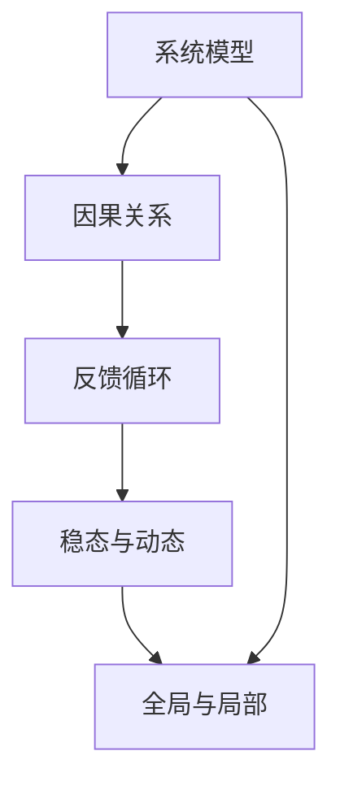

                 

## 1. 背景介绍

### 1.1 问题由来

在当今复杂多变的商业环境中，无论是产品设计、项目管理还是运营策略，都面临着越来越复杂的挑战。面对这些问题，传统的思维方式和解决方案已经显得力不从心。系统思考（Systems Thinking）作为一种新兴的思维方式，旨在通过全局视角、动态系统观和反馈机制，帮助人们更好地理解、分析和解决复杂问题。

### 1.2 问题核心关键点

系统思考的核心在于将问题视为一个整体系统，通过分析系统的各个组成部分、它们之间的关系以及系统整体的行为模式，来找到问题的根本原因，并制定出更有效的解决方案。其核心方法包括：

1. **系统模型构建**：将问题抽象成模型，识别出系统的关键要素及其相互关系。
2. **反馈机制建立**：理解系统内部的反馈循环，识别出系统中的正反馈和负反馈，以预测系统行为。
3. **全局视角审视**：从系统整体的角度考虑问题，避免陷入局部最优解。
4. **动态系统观**：认识到系统是动态变化的，解决短期问题时需考虑长期影响。
5. **仿真与实验**：利用仿真和实验验证系统模型的正确性，调整模型以适应实际情况。

系统思考方法特别适用于解决复杂问题，如供应链管理、资源配置、市场竞争等，通过系统分析，可以更全面、更深入地理解问题，找到根本原因，并制定出更加有效和持续的解决方案。

### 1.3 问题研究意义

在复杂系统中，传统的单点、局部思考方式往往难以发现问题的根本原因，导致解决方案的有效性大打折扣。系统思考通过全局视角和动态系统的观点，帮助决策者识别问题本质，并制定出更具前瞻性和适应性的策略。

系统思考的应用，不仅在商业管理领域具有重要意义，在科技创新、公共政策制定等领域同样具有广泛价值。通过系统思考，能够更好地平衡短期利益和长期目标，实现可持续发展，提高系统整体性能。

## 2. 核心概念与联系

### 2.1 核心概念概述

为了更好地理解系统思考，首先需要掌握其中的核心概念：

1. **系统模型（System Model）**：将问题抽象成数学或符号模型，以描述系统的组成和行为。
2. **反馈循环（Feedback Loop）**：系统中信息流从输出到输入的循环，决定了系统的稳定性和动态行为。
3. **稳态与动态**：系统在一定条件下保持稳定状态，而在外界干扰下可能进入动态变化。
4. **因果关系（Causal Relationship）**：系统各要素之间的相互作用关系，决定着系统的行为模式。
5. **全局与局部**：系统整体与局部之间的相互作用，决定了系统的全局行为。

这些核心概念通过系统模型、因果关系和反馈循环等方式，构成了一个系统思考的框架。理解这些概念有助于我们更好地应用系统思考方法，解决复杂问题。

### 2.2 核心概念原理和架构的 Mermaid 流程图



这个流程图展示了系统思考的核心概念之间的逻辑关系。系统模型作为整体架构，通过因果关系和反馈循环来理解系统行为，同时考虑全局与局部的相互作用，形成系统的动态变化。

## 3. 核心算法原理 & 具体操作步骤

### 3.1 算法原理概述

系统思考的核心算法原理是通过构建系统模型，识别系统中的关键要素及其相互作用，从而理解系统的行为模式。以下是系统思考的基本步骤：

1. **问题抽象**：将复杂问题抽象成系统模型，识别出系统中的关键要素。
2. **因果关系分析**：理解系统各要素之间的相互作用关系，识别出系统中的因果链条。
3. **反馈循环分析**：识别出系统中的反馈循环，理解系统的动态变化。
4. **稳态与动态平衡**：分析系统在稳定状态下的行为，以及在外界干扰下的动态变化。
5. **全局与局部均衡**：从全局视角审视系统行为，考虑局部行为对整体的影响。
6. **仿真与实验**：通过仿真和实验验证系统模型，调整模型以适应实际情况。

通过这些步骤，系统思考能够全面、深入地理解复杂问题，找到问题的根本原因，并制定出更有效的解决方案。

### 3.2 算法步骤详解

以下是系统思考的具体操作步骤，每个步骤将详细阐述：

#### 3.2.1 问题抽象与系统模型构建

1. **问题定义**：明确问题的具体描述，理解问题的背景和目标。
2. **要素识别**：列出系统中的关键要素，包括输入、输出、中间过程等。
3. **模型建立**：将问题抽象成数学或符号模型，描述系统各要素及其相互作用。

例如，对于供应链管理问题，要素包括供应商、生产商、仓库、客户等，通过建立供应链模型，可以描述货物从供应商到客户的流动过程。

#### 3.2.2 因果关系分析

1. **因果链条识别**：识别系统各要素之间的因果链条，理解要素之间的相互作用关系。
2. **因果链可视化**：通过因果图、网络图等方式，可视化系统中的因果链条。

例如，在供应链管理中，供应商的交付时间会影响生产商的生产计划，进而影响仓库的库存管理，最终影响客户的需求满足。

#### 3.2.3 反馈循环分析

1. **正负反馈识别**：识别系统中的正反馈和负反馈循环，理解系统的动态变化。
2. **反馈循环可视化**：通过反馈图、动态模型等方式，可视化系统中的反馈循环。

例如，在供应链管理中，供应商的延迟交付会引发生产商的生产延迟，进而导致仓库库存短缺，形成负反馈循环，最终影响客户满意度。

#### 3.2.4 稳态与动态平衡分析

1. **稳态分析**：分析系统在稳定状态下的行为，理解系统在稳定状态下的性能。
2. **动态分析**：分析系统在外界干扰下的动态变化，理解系统在动态变化中的行为。

例如，在供应链管理中，供应链的稳态是货物从供应商到客户的顺利流动，而动态变化可能是供应商延迟交付、市场需求波动等因素导致的库存短缺或过剩。

#### 3.2.5 全局与局部均衡分析

1. **全局视角审视**：从全局视角审视系统行为，考虑局部行为对整体的影响。
2. **局部优化**：识别出局部优化策略，以提高系统的整体性能。

例如，在供应链管理中，从全局视角审视，优化供应商的交付时间、生产商的生产计划和仓库的库存管理，可以提升供应链的整体效率。

#### 3.2.6 仿真与实验

1. **系统仿真**：使用仿真工具模拟系统行为，验证系统模型的正确性。
2. **实验验证**：在实际环境中进行实验，调整系统模型以适应实际情况。

例如，在供应链管理中，使用仿真工具模拟供应链的运行过程，验证供应链模型的正确性，并通过实际实验调整模型参数，以提高供应链的实际效率。

### 3.3 算法优缺点

系统思考具有以下优点：

1. **全面视角**：通过全局视角和动态系统的观点，能够全面理解问题，找到根本原因。
2. **动态分析**：理解系统中的反馈循环和动态变化，能够预测系统行为，制定更加有效的解决方案。
3. **仿真验证**：通过仿真和实验验证系统模型，能够调整模型以适应实际情况。

同时，系统思考也存在一些缺点：

1. **建模复杂**：构建系统模型需要深入理解系统各要素及其相互作用，对于复杂系统可能难以建模。
2. **模型验证困难**：验证系统模型的正确性需要大量的实验数据，成本较高。
3. **动态变化难预测**：系统中的动态变化和不确定性因素较多，预测其行为存在一定难度。

尽管如此，系统思考依然具有广泛的应用前景，尤其是在复杂系统的管理、决策等领域，能够帮助决策者全面、深入地理解问题，制定出更加有效和持续的解决方案。

### 3.4 算法应用领域

系统思考在多个领域都有广泛应用，以下是一些典型的应用领域：

1. **供应链管理**：通过系统模型和因果分析，优化供应链各环节的协调，提升供应链效率。
2. **项目管理**：通过系统模型和反馈分析，优化项目各阶段的管理，提高项目成功率。
3. **资源配置**：通过系统模型和全局优化，优化资源分配，提高资源利用率。
4. **市场竞争**：通过系统模型和动态分析，预测市场变化，制定市场策略。
5. **公共政策制定**：通过系统模型和全局视角，制定更加公平、有效的公共政策。

系统思考方法不仅能够帮助决策者更好地理解复杂问题，还能够制定出更加有效和持续的解决方案，具有广泛的应用前景。

## 4. 数学模型和公式 & 详细讲解 & 举例说明

### 4.1 数学模型构建

在系统思考中，常见的数学模型包括差分方程、微分方程、网络图等。下面以差分方程为例，介绍如何构建系统模型。

假设系统中的某变量 $x$ 随时间 $t$ 变化，满足如下差分方程：

$$
x(t+1) = f(x(t), x(t-1), ..., x(t-n))
$$

其中 $f$ 为系统函数，表示系统各要素之间的相互作用关系。该差分方程可以描述系统的动态变化过程，通过求解该方程，可以预测系统行为。

### 4.2 公式推导过程

以供应链管理为例，考虑货物从供应商到客户的流动过程，假设货物在供应链各环节之间的流动满足如下差分方程：

$$
S(t+1) = \frac{I(t+1)}{D(t+1)}
$$

其中 $S(t)$ 表示供应链中的库存，$I(t)$ 表示供应商的交付量，$D(t)$ 表示客户的需求量。该方程描述了供应链中的库存变化过程，通过求解该方程，可以预测供应链的库存状态。

### 4.3 案例分析与讲解

假设某公司生产某产品，供应商的交付时间会影响生产商的生产计划，进而影响仓库的库存管理，最终影响客户的需求满足。通过建立供应链模型，可以描述货物从供应商到客户的流动过程，识别出系统中的因果链条和反馈循环，分析系统的稳态与动态行为，从而制定出更加有效的供应链管理策略。

## 5. 项目实践：代码实例和详细解释说明

### 5.1 开发环境搭建

在系统思考的应用中，通常使用Python进行仿真和数据分析。以下是使用Python进行系统思考建模的开发环境配置流程：

1. **安装Anaconda**：从官网下载并安装Anaconda，用于创建独立的Python环境。

2. **创建并激活虚拟环境**：
```bash
conda create -n systems-env python=3.8 
conda activate systems-env
```

3. **安装必要的Python包**：
```bash
pip install numpy pandas scipy sympy matplotlib seaborn jupyter notebook
```

4. **安装可视化工具**：
```bash
pip install pygraphviz
```

完成上述步骤后，即可在`systems-env`环境中开始系统思考的实践。

### 5.2 源代码详细实现

下面以供应链管理为例，给出使用Python进行系统建模的代码实现。

首先，定义供应链中的变量和参数：

```python
import numpy as np

# 定义变量
S = np.zeros(100)  # 供应链库存
I = np.zeros(100)  # 供应商交付量
D = np.zeros(100)  # 客户需求量

# 定义参数
L = 1  # 供应商延迟时间
C = 0.8  # 供应链调整系数
k = 0.5  # 需求增加速率
alpha = 0.5  # 库存调整系数
```

然后，建立供应链模型，并计算系统的稳态和动态行为：

```python
# 建立供应链模型
def update_system(t, S, I, D):
    S[t+1] = C * (I[t+1] / D[t+1])
    I[t+1] = I[t] + np.random.normal(0, L, 1)
    D[t+1] = D[t] + k * (1 - D[t])
    
# 计算稳态
S_steady = np.zeros(100)
I_steady = np.zeros(100)
D_steady = np.zeros(100)
for t in range(100):
    update_system(t, S_steady, I_steady, D_steady)
    
# 计算动态行为
S_dynamic = np.zeros(100)
I_dynamic = np.zeros(100)
D_dynamic = np.zeros(100)
for t in range(100):
    update_system(t, S_dynamic, I_dynamic, D_dynamic)
```

最后，使用可视化工具绘制供应链系统的稳态和动态行为：

```python
import matplotlib.pyplot as plt
import pygraphviz as pgv

# 绘制稳态图
plt.plot(S_steady, label='Steady State S')
plt.plot(I_steady, label='Steady State I')
plt.plot(D_steady, label='Steady State D')
plt.legend()
plt.title('Steady State of Supply Chain')
plt.show()

# 绘制动态图
plt.plot(S_dynamic, label='Dynamic S')
plt.plot(I_dynamic, label='Dynamic I')
plt.plot(D_dynamic, label='Dynamic D')
plt.legend()
plt.title('Dynamic Behavior of Supply Chain')
plt.show()

# 绘制因果图
graph = pgv.AGraph(directed=True)
graph.add_node('S', 'Stock')
graph.add_node('I', 'Inventory')
graph.add_node('D', 'Demand')
graph.add_edge('I', 'S')
graph.add_edge('S', 'D')
graph.add_edge('D', 'I')
graph.write('supply_chain_graph.gv', format='graphviz')
```

这段代码展示了如何使用Python进行供应链系统建模，通过仿真和可视化工具，可以直观地理解供应链的稳态和动态行为，识别出系统中的因果链条和反馈循环。

### 5.3 代码解读与分析

让我们再详细解读一下关键代码的实现细节：

**变量定义**：
- `S`、`I`、`D`：分别表示供应链库存、供应商交付量和客户需求量，通过数组进行记录和更新。

**供应链模型定义**：
- `update_system`函数：定义供应链系统的更新规则，通过差分方程描述系统的动态变化。

**稳态计算**：
- 使用循环进行稳态计算，输出供应链库存、供应商交付量和客户需求量的稳态值。

**动态计算**：
- 使用循环进行动态计算，输出供应链库存、供应商交付量和客户需求量的动态值。

**可视化绘制**：
- 使用matplotlib和pygraphviz进行可视化，绘制供应链系统的稳态和动态行为，以及因果关系图。

**输出结果展示**：
- 绘制供应链系统的稳态图和动态图，可以直观地理解系统的行为模式。
- 绘制因果图，可以清晰地识别出系统中的因果链条和反馈循环。

通过上述代码实现，可以更好地理解系统思考的数学建模和仿真过程，以及系统行为的可视化展示。

## 6. 实际应用场景

### 6.1 智能制造

在系统思考中，智能制造是一个典型的应用场景。智能制造通过构建系统的全局视角和动态系统的观点，优化生产流程，提升制造效率。

智能制造系统通常包括设备、材料、人员等要素，通过系统思考的方法，可以识别出各要素之间的因果关系和反馈循环，制定出更加有效的生产计划和资源分配策略。例如，通过系统思考，可以预测设备故障对生产的影响，优化生产调度，提高制造效率。

### 6.2 能源管理

在系统思考中，能源管理也是一个重要的应用场景。能源管理系统通常包括电力、燃料、设备等要素，通过系统思考的方法，可以优化能源的分配和使用，提高能源利用率。

能源管理系统通过系统模型和因果分析，可以预测能源需求和供应变化，优化能源的分配和使用，提高能源利用效率。例如，通过系统思考，可以预测能源需求的变化趋势，优化能源的储存和分配，降低能源成本。

### 6.3 城市规划

在系统思考中，城市规划也是一个典型的应用场景。城市规划系统通常包括交通、建筑、环境等要素，通过系统思考的方法，可以优化城市规划方案，提升城市运行效率。

城市规划系统通过系统模型和全局优化，可以识别出各要素之间的因果关系和反馈循环，制定出更加有效的城市规划方案。例如，通过系统思考，可以预测交通拥堵对城市运行的影响，优化交通规划，提高城市运行效率。

## 7. 工具和资源推荐

### 7.1 学习资源推荐

为了帮助开发者系统掌握系统思考的理论基础和实践技巧，这里推荐一些优质的学习资源：

1. **《系统思考：复杂系统的方法》**：这本书详细介绍了系统思考的基本概念和方法，适合初学者入门。
2. **Coursera《系统思考与建模》课程**：Coursera提供的系统思考课程，涵盖了系统思考的基本概念和方法，适合进一步学习。
3. **MIT OpenCourseWare《系统动力学》课程**：MIT提供的系统动力学课程，深入讲解了系统思考的数学建模和仿真方法。
4. **Simulink系统仿真平台**：Simulink是一个强大的系统仿真平台，可以用于建模和仿真复杂的系统。

通过对这些资源的学习实践，相信你一定能够快速掌握系统思考的精髓，并应用于解决复杂的系统问题。

### 7.2 开发工具推荐

在系统思考的应用中，常用的开发工具包括：

1. **Python**：Python是一个功能强大的编程语言，适合系统思考的建模和仿真。
2. **MATLAB/Simulink**：MATLAB和Simulink是一个强大的系统仿真平台，适合构建复杂系统模型。
3. **JMP**：JMP是一个统计分析软件，适合进行数据分析和建模。
4. **Tableau**：Tableau是一个数据可视化工具，适合进行数据的可视化展示。

这些工具可以帮助开发者更好地进行系统建模和仿真，提高系统思考的应用效果。

### 7.3 相关论文推荐

系统思考在科学研究和技术应用中具有重要意义，以下是几篇经典的相关论文，推荐阅读：

1. **《系统动力学：一种系统思考的建模方法》**：这篇论文介绍了系统动力学的基本概念和方法，适合系统思考的初学者。
2. **《系统思考的数学建模与仿真》**：这篇论文深入探讨了系统思考的数学建模和仿真方法，适合进一步学习。
3. **《基于系统思考的管理决策模型》**：这篇论文介绍了系统思考在管理决策中的应用，适合管理决策领域的从业者。
4. **《系统思考与复杂系统管理》**：这篇论文深入探讨了系统思考在复杂系统管理中的应用，适合系统管理领域的从业者。

这些论文代表了大系统思考的理论发展，通过学习这些前沿成果，可以帮助研究者更好地理解和应用系统思考方法，解决复杂问题。

## 8. 总结：未来发展趋势与挑战

### 8.1 总结

本文对系统思考进行了全面系统的介绍。首先阐述了系统思考的研究背景和意义，明确了系统思考在解决复杂问题中的独特价值。其次，从原理到实践，详细讲解了系统思考的数学建模和仿真方法，给出了系统思考任务开发的完整代码实例。同时，本文还广泛探讨了系统思考在智能制造、能源管理、城市规划等多个领域的应用前景，展示了系统思考的广泛应用价值。最后，本文精选了系统思考的学习资源、开发工具和相关论文，力求为读者提供全方位的技术指引。

通过本文的系统梳理，可以看到，系统思考方法通过全局视角和动态系统的观点，能够全面、深入地理解复杂问题，找到问题的根本原因，并制定出更加有效和持续的解决方案。

### 8.2 未来发展趋势

展望未来，系统思考将呈现以下几个发展趋势：

1. **智能系统融合**：系统思考将与人工智能、大数据等技术进一步融合，形成更加智能化的系统管理方法。
2. **跨学科应用**：系统思考将扩展到更多的学科领域，如生物系统、生态系统等，解决更复杂的问题。
3. **大规模应用**：系统思考将应用于更大规模的系统，如城市、工业等，提升系统整体性能。
4. **实时仿真**：系统思考将与物联网、云计算等技术结合，实现实时仿真和预测。
5. **人机协同**：系统思考将与人类专家的知识结合，实现人机协同，提升系统管理水平。

这些趋势凸显了系统思考的广泛应用前景，未来在系统管理、决策等领域将发挥更加重要的作用。

### 8.3 面临的挑战

尽管系统思考方法具有广泛的应用前景，但在实际应用中也面临一些挑战：

1. **复杂性高**：系统思考涉及多个要素和复杂关系，建模和分析难度较大。
2. **数据需求高**：系统思考需要大量数据支持，数据获取和处理成本较高。
3. **仿真复杂**：系统仿真涉及多维变量和复杂方程，仿真难度较大。
4. **人机协同难**：系统思考需要与人类专家结合，人机协同难度较大。
5. **应用局限**：系统思考在部分领域的应用效果不如其他方法。

尽管存在这些挑战，但系统思考在解决复杂问题中的独特优势不可替代，未来在系统管理、决策等领域将发挥更加重要的作用。

### 8.4 研究展望

未来的研究需要在以下几个方面寻求新的突破：

1. **简化建模方法**：研究如何简化系统模型的构建，降低建模难度。
2. **优化仿真技术**：研究如何优化系统仿真技术，提高仿真效率。
3. **强化人机协同**：研究如何加强人机协同，提升系统管理水平。
4. **跨学科应用**：研究系统思考在跨学科领域的应用，解决更复杂的问题。
5. **实时预测**：研究如何实现实时预测和仿真，提升系统管理效率。

这些研究方向的探索发展，必将引领系统思考方法走向更高的台阶，为系统管理、决策等领域带来新的突破。

## 9. 附录：常见问题与解答

**Q1：系统思考和传统方法有哪些区别？**

A: 系统思考与传统方法的主要区别在于全局视角和动态系统的观点。传统方法往往从局部视角考虑问题，难以发现问题的根本原因，而系统思考通过全局视角和动态系统的观点，能够全面、深入地理解问题，找到问题的根本原因。

**Q2：系统思考需要哪些数学知识？**

A: 系统思考需要一定的数学知识，包括差分方程、微分方程、概率论、统计学等。系统思考的数学建模和仿真方法需要较强的数学基础。

**Q3：系统思考需要哪些技术支持？**

A: 系统思考需要一定的技术支持，包括编程语言（如Python、MATLAB）、仿真平台（如Simulink）、数据分析工具（如JMP、Tableau）等。这些工具可以帮助开发者更好地进行系统建模和仿真。

**Q4：系统思考的适用范围有哪些？**

A: 系统思考适用于解决复杂问题，如供应链管理、智能制造、能源管理、城市规划等。这些问题的解决需要全局视角和动态系统的观点，系统思考能够提供有效的方法。

**Q5：系统思考在实际应用中需要注意哪些问题？**

A: 系统思考在实际应用中需要注意以下几个问题：
1. 复杂性高：系统思考涉及多个要素和复杂关系，建模和分析难度较大。
2. 数据需求高：系统思考需要大量数据支持，数据获取和处理成本较高。
3. 仿真复杂：系统仿真涉及多维变量和复杂方程，仿真难度较大。
4. 人机协同难：系统思考需要与人类专家结合，人机协同难度较大。

这些问题的解决需要不断优化建模和仿真方法，加强人机协同，提高数据获取和处理效率。

---

作者：禅与计算机程序设计艺术 / Zen and the Art of Computer Programming

