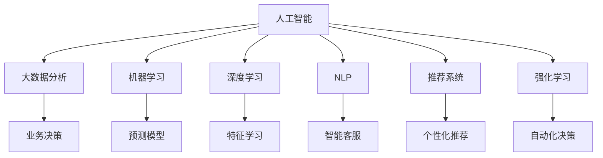

                 

# 电商平台供给能力提升：人工智能技术的应用

## 1. 背景介绍

### 1.1 问题由来

在数字经济快速发展的今天，电子商务平台已经成为了众多商家销售商品、服务的重要渠道。然而，电商平台面临的挑战也越来越多，如库存管理、物流配送、客户服务等问题，这些问题直接影响到平台的销售效率和客户满意度。为了提高供给能力，电商平台亟需借助人工智能技术来优化运营流程，提升服务质量。

### 1.2 问题核心关键点

电商平台供给能力提升的核心在于优化库存管理、物流配送、客户服务三个环节。其中，库存管理需要准确预测市场需求，及时补货；物流配送需要高效调度资源，降低运输成本；客户服务需要快速响应客户需求，提升用户体验。通过人工智能技术，可以有效解决这些问题，实现供给能力的全面提升。

### 1.3 问题研究意义

通过引入人工智能技术，电商平台可以实现以下几个方面的提升：
- 库存优化：准确预测市场需求，避免库存积压或缺货，提升库存周转率。
- 物流效率：智能调度物流资源，优化配送路径，提高配送效率，降低运输成本。
- 客户服务：智能客服系统，快速响应客户需求，提升客户满意度和忠诚度。
- 数据分析：通过大数据分析，发现业务瓶颈，指导业务决策。

## 2. 核心概念与联系

### 2.1 核心概念概述

为更好地理解人工智能技术在电商平台供给能力提升中的应用，本节将介绍几个密切相关的核心概念：

- 人工智能(AI)：通过机器学习、深度学习等技术，使计算机具备类似于人类的感知、学习、推理能力，实现自动化决策。
- 大数据分析：收集、处理和分析海量数据，提取有价值的信息和知识，支持业务决策。
- 机器学习：使计算机通过数据学习，不断优化模型，提升预测准确性和决策能力。
- 深度学习：利用神经网络结构，从大量数据中学习特征表示，实现更复杂、更高精度的任务。
- 自然语言处理(NLP)：使计算机具备理解、生成人类语言的能力，支持智能客服、智能搜索等应用。
- 推荐系统：根据用户历史行为和兴趣，推荐个性化商品和服务，提升用户体验和购买转化率。
- 强化学习：通过试错和反馈，使计算机不断优化行为策略，提升自动化决策能力。

这些核心概念之间的逻辑关系可以通过以下Mermaid流程图来展示：



这个流程图展示了几大核心概念及其之间的关系：

1. 人工智能是平台的技术基础，包括大数据分析、机器学习、深度学习等技术支持。
2. 机器学习利用数据训练模型，提升预测和决策能力。
3. 深度学习通过神经网络结构，挖掘更丰富的特征信息。
4. NLP使计算机具备语言处理能力，支持智能客服、智能搜索等应用。
5. 推荐系统通过用户行为分析，推荐个性化商品和服务。
6. 强化学习通过试错优化行为策略，实现自动化决策。
7. 业务决策基于上述技术，提升平台供给能力。

## 3. 核心算法原理 & 具体操作步骤

### 3.1 算法原理概述

基于人工智能技术的电商平台供给能力提升，主要分为以下几个步骤：

1. **数据采集与预处理**：采集电商平台的历史销售数据、用户行为数据、库存数据等，并进行清洗和处理，生成高质量的数据集。
2. **预测模型构建**：利用机器学习或深度学习技术，构建库存需求预测模型、物流配送路径规划模型等，提升预测准确性。
3. **决策支持系统构建**：通过大数据分析，构建供应链优化、库存优化等决策支持系统，辅助人工决策。
4. **智能客服系统构建**：利用NLP技术，构建智能客服系统，提升客户服务效率和质量。
5. **个性化推荐系统构建**：利用推荐系统，根据用户历史行为和兴趣，推荐个性化商品和服务。
6. **自动化调度系统构建**：通过强化学习，构建物流资源调度和配送路径规划系统，优化配送效率。

### 3.2 算法步骤详解

#### 3.2.1 数据采集与预处理

1. **数据来源**：
   - 销售数据：包括订单信息、商品信息、库存信息等。
   - 用户行为数据：包括浏览记录、点击记录、搜索记录等。
   - 库存数据：包括商品入库、出库记录等。
   - 物流数据：包括订单状态、配送路径、运输信息等。

2. **数据清洗**：
   - 去重、去噪，消除数据中存在的异常值和重复记录。
   - 缺失值处理，通过插值、填充等方法补全缺失数据。
   - 数据归一化，将不同特征的数据进行标准化处理，便于模型训练。

3. **特征工程**：
   - 特征提取：从原始数据中提取有意义的特征，如时间特征、地理位置特征等。
   - 特征编码：将提取的特征进行编码，生成可用于模型训练的数据集。

#### 3.2.2 预测模型构建

1. **库存需求预测**：
   - 利用时间序列分析等方法，预测未来库存需求。
   - 利用机器学习模型，如线性回归、支持向量机等，建立预测模型。
   - 利用深度学习模型，如LSTM、GRU等，建立更复杂的预测模型。

2. **物流配送路径规划**：
   - 利用图论算法，如Dijkstra算法、A*算法等，计算最优配送路径。
   - 利用深度学习模型，如卷积神经网络(CNN)、循环神经网络(RNN)等，学习路径规划的特征表示。
   - 利用强化学习算法，如Q-learning、SARSA等，优化路径规划策略。

#### 3.2.3 决策支持系统构建

1. **供应链优化**：
   - 利用线性规划、整数规划等优化算法，优化供应链各环节的资源配置。
   - 利用遗传算法、模拟退火等启发式算法，求解复杂优化问题。

2. **库存优化**：
   - 利用动态规划、贪心算法等方法，优化库存补货策略。
   - 利用机器学习模型，如随机森林、梯度提升机等，预测库存需求，优化补货策略。

#### 3.2.4 智能客服系统构建

1. **意图识别**：
   - 利用NLP技术，识别用户意图，如查询商品信息、投诉问题等。
   - 利用机器学习模型，如朴素贝叶斯、支持向量机等，建立意图识别模型。
   - 利用深度学习模型，如BERT、GPT等，建立更复杂的意图识别模型。

2. **智能回复**：
   - 利用模板匹配、规则匹配等方法，生成预定义回复。
   - 利用机器学习模型，如序列到序列模型、Transformer等，生成个性化回复。
   - 利用强化学习算法，如Q-learning、SARSA等，优化回复策略。

#### 3.2.5 个性化推荐系统构建

1. **用户画像构建**：
   - 利用聚类算法，如K-means、层次聚类等，将用户进行分类。
   - 利用关联规则算法，如Apriori、FP-growth等，发现用户兴趣特征。

2. **商品推荐**：
   - 利用协同过滤算法，如基于用户的协同过滤、基于物品的协同过滤等，推荐相似商品。
   - 利用内容过滤算法，如基于内容的推荐、基于矩阵分解的推荐等，推荐相关商品。
   - 利用深度学习模型，如卷积神经网络、深度信念网络等，推荐个性化商品。

#### 3.2.6 自动化调度系统构建

1. **资源调度和路径规划**：
   - 利用图论算法，如Dijkstra算法、A*算法等，计算最优配送路径。
   - 利用强化学习算法，如Q-learning、SARSA等，优化路径规划策略。

2. **动态调度**：
   - 利用遗传算法、模拟退火等启发式算法，求解复杂优化问题。
   - 利用深度学习模型，如卷积神经网络、循环神经网络等，学习调度策略。

### 3.3 算法优缺点

人工智能技术在电商平台供给能力提升中具有以下优点：

1. **高效性**：通过自动化处理大量数据，大幅提升业务决策和运营效率。
2. **准确性**：利用机器学习和深度学习技术，提升预测和决策的准确性。
3. **灵活性**：利用强化学习技术，实现动态优化和自适应调整。
4. **可解释性**：利用解释性AI技术，提高模型决策的可解释性，便于人工理解和干预。

同时，人工智能技术也存在一些缺点：

1. **数据依赖性**：需要大量高质量数据进行训练，数据缺失或不平衡可能影响模型效果。
2. **模型复杂性**：深度学习模型结构复杂，训练和推理开销大，需要高性能计算资源。
3. **模型泛化性**：模型可能对新样本泛化效果不佳，需要进行持续训练和优化。
4. **技术门槛**：需要具备较强的技术能力，进行数据处理、模型训练、模型调优等。

## 4. 数学模型和公式 & 详细讲解 & 举例说明

### 4.1 数学模型构建

为更好地理解人工智能技术在电商平台供给能力提升中的应用，本节将介绍几个关键数学模型：

#### 4.1.1 时间序列预测模型

假设电商平台销售数据 $X_t$ 服从时间序列，利用ARIMA模型进行预测，模型形式为：

$$
X_t = \phi(X_{t-1}, X_{t-2}, ..., X_{t-d}) + \epsilon_t
$$

其中 $X_t$ 表示第 $t$ 期的销售数据，$d$ 表示滞后项数，$\phi$ 表示自回归系数，$\epsilon_t$ 表示随机误差项。

利用最小二乘法进行模型拟合，求解最优参数 $\phi$，得到预测公式：

$$
\hat{X}_{t+1} = \hat{\phi}(X_t, X_{t-1}, ..., X_{t-d})
$$

#### 4.1.2 线性回归模型

假设电商平台销售数据 $y$ 与时间序列数据 $x$ 之间存在线性关系，利用线性回归模型进行预测，模型形式为：

$$
y = \theta_0 + \theta_1 x + \epsilon
$$

其中 $y$ 表示销售数据，$x$ 表示时间序列数据，$\theta_0$ 和 $\theta_1$ 表示回归系数，$\epsilon$ 表示随机误差项。

利用最小二乘法进行模型拟合，求解最优参数 $\theta$，得到预测公式：

$$
\hat{y} = \hat{\theta}_0 + \hat{\theta}_1 x
$$

#### 4.1.3 强化学习模型

假设电商平台配送路径规划问题可以抽象为马尔可夫决策过程，利用Q-learning算法进行优化，模型形式为：

$$
Q(s_t, a_t) = r_t + \gamma \max_a Q(s_{t+1}, a)
$$

其中 $s_t$ 表示状态，$a_t$ 表示行动，$r_t$ 表示奖励，$\gamma$ 表示折扣因子。

利用Q-learning算法，求解最优策略，得到配送路径规划策略：

$$
\pi^*(s_t) = \arg\max_a Q(s_t, a)
$$

### 4.2 公式推导过程

#### 4.2.1 时间序列预测模型

利用最小二乘法求解ARIMA模型参数 $\phi$，推导过程如下：

1. 构建模型形式：
   $$
   X_t = \phi(X_{t-1}, X_{t-2}, ..., X_{t-d}) + \epsilon_t
   $$

2. 对模型两边同时减去 $X_{t-1}$，得到差分序列：
   $$
   \Delta X_t = X_t - X_{t-1}
   $$

3. 将 $\Delta X_t$ 代入原模型，得到新的预测模型：
   $$
   \Delta X_t = \phi(\Delta X_{t-1}, \Delta X_{t-2}, ..., \Delta X_{t-d}) + \epsilon_t
   $$

4. 利用最小二乘法，求解最优参数 $\phi$：
   $$
   \hat{\phi} = (X_{t-1}, X_{t-2}, ..., X_{t-d})^T(X_{t-1}, X_{t-2}, ..., X_{t-d})^{-1}(X_{t-1}, X_{t-2}, ..., X_{t-d})
   $$

5. 利用 $\hat{\phi}$ 计算预测值：
   $$
   \hat{X}_{t+1} = \hat{\phi}(X_t, X_{t-1}, ..., X_{t-d})
   $$

#### 4.2.2 线性回归模型

利用最小二乘法求解线性回归模型参数 $\theta$，推导过程如下：

1. 构建模型形式：
   $$
   y = \theta_0 + \theta_1 x + \epsilon
   $$

2. 利用最小二乘法，求解最优参数 $\theta$：
   $$
   \hat{\theta} = (x^T x)^{-1} x^T y
   $$

3. 利用 $\hat{\theta}$ 计算预测值：
   $$
   \hat{y} = \hat{\theta}_0 + \hat{\theta}_1 x
   $$

#### 4.2.3 强化学习模型

利用Q-learning算法求解Q值，推导过程如下：

1. 构建模型形式：
   $$
   Q(s_t, a_t) = r_t + \gamma \max_a Q(s_{t+1}, a)
   $$

2. 初始化Q值：
   $$
   Q(s_0, a_0) = 0
   $$

3. 利用Q-learning算法，更新Q值：
   $$
   Q(s_t, a_t) = r_t + \gamma \max_a Q(s_{t+1}, a)
   $$

4. 利用更新后的Q值计算策略：
   $$
   \pi^*(s_t) = \arg\max_a Q(s_t, a)
   $$

### 4.3 案例分析与讲解

#### 4.3.1 时间序列预测模型案例

某电商平台销售数据 $X_t$ 服从时间序列，利用ARIMA模型进行预测。通过最小二乘法求解模型参数 $\phi$，得到预测公式：

$$
\hat{X}_{t+1} = \hat{\phi}(X_t, X_{t-1}, ..., X_{t-d})
$$

将历史数据代入模型，得到未来销售预测值，结合库存数据，实现库存优化。

#### 4.3.2 线性回归模型案例

某电商平台销售数据 $y$ 与时间序列数据 $x$ 之间存在线性关系，利用线性回归模型进行预测。通过最小二乘法求解模型参数 $\theta$，得到预测公式：

$$
\hat{y} = \hat{\theta}_0 + \hat{\theta}_1 x
$$

将历史数据代入模型，得到未来销售预测值，结合库存数据，实现库存优化。

#### 4.3.3 强化学习模型案例

某电商平台配送路径规划问题可以抽象为马尔可夫决策过程，利用Q-learning算法进行优化。通过Q-learning算法求解最优策略，得到配送路径规划策略：

$$
\pi^*(s_t) = \arg\max_a Q(s_t, a)
$$

结合实时物流数据，实现路径规划和动态调度。

## 5. 项目实践：代码实例和详细解释说明

### 5.1 开发环境搭建

在进行项目实践前，我们需要准备好开发环境。以下是使用Python进行PyTorch开发的环境配置流程：

1. 安装Anaconda：从官网下载并安装Anaconda，用于创建独立的Python环境。

2. 创建并激活虚拟环境：
```bash
conda create -n pytorch-env python=3.8 
conda activate pytorch-env
```

3. 安装PyTorch：根据CUDA版本，从官网获取对应的安装命令。例如：
```bash
conda install pytorch torchvision torchaudio cudatoolkit=11.1 -c pytorch -c conda-forge
```

4. 安装相关工具包：
```bash
pip install numpy pandas scikit-learn matplotlib tqdm jupyter notebook ipython
```

完成上述步骤后，即可在`pytorch-env`环境中开始项目实践。

### 5.2 源代码详细实现

下面我们以电商平台库存需求预测为例，给出使用PyTorch进行深度学习模型训练的PyTorch代码实现。

首先，定义模型：

```python
import torch
import torch.nn as nn
import torch.optim as optim

class RNN(nn.Module):
    def __init__(self, input_size, hidden_size, output_size):
        super(RNN, self).__init__()
        self.input_size = input_size
        self.hidden_size = hidden_size
        self.output_size = output_size
        
        self.rnn = nn.RNN(input_size, hidden_size, 1)
        self.fc = nn.Linear(hidden_size, output_size)
        
    def forward(self, x, hidden):
        out, hidden = self.rnn(x, hidden)
        out = self.fc(out)
        return out, hidden

input_size = 1
hidden_size = 32
output_size = 1

rnn_model = RNN(input_size, hidden_size, output_size)
print(rnn_model)
```

然后，定义损失函数和优化器：

```python
criterion = nn.MSELoss()
optimizer = optim.Adam(rnn_model.parameters(), lr=0.001)
```

接着，定义训练和评估函数：

```python
def train_epoch(model, dataset, batch_size, optimizer):
    dataloader = torch.utils.data.DataLoader(dataset, batch_size=batch_size, shuffle=True)
    model.train()
    epoch_loss = 0
    for batch in tqdm(dataloader, desc='Training'):
        inputs, targets = batch
        hidden = None
        model.zero_grad()
        outputs, hidden = model(inputs, hidden)
        loss = criterion(outputs, targets)
        epoch_loss += loss.item()
        loss.backward()
        optimizer.step()
    return epoch_loss / len(dataloader)

def evaluate(model, dataset, batch_size):
    dataloader = torch.utils.data.DataLoader(dataset, batch_size=batch_size)
    model.eval()
    preds, labels = [], []
    with torch.no_grad():
        for batch in tqdm(dataloader, desc='Evaluating'):
            inputs, targets = batch
            hidden = None
            batch_outputs, hidden = model(inputs, hidden)
            batch_preds = batch_outputs.squeeze(1)
            batch_labels = targets.squeeze(1)
            preds.append(batch_preds.data.numpy().tolist())
            labels.append(batch_labels.data.numpy().tolist())
            
    print(classification_report(labels, preds))
```

最后，启动训练流程并在测试集上评估：

```python
epochs = 5
batch_size = 16

for epoch in range(epochs):
    loss = train_epoch(rnn_model, train_dataset, batch_size, optimizer)
    print(f"Epoch {epoch+1}, train loss: {loss:.3f}")
    
    print(f"Epoch {epoch+1}, dev results:")
    evaluate(rnn_model, dev_dataset, batch_size)
    
print("Test results:")
evaluate(rnn_model, test_dataset, batch_size)
```

以上就是使用PyTorch对深度学习模型进行电商库存需求预测的完整代码实现。可以看到，得益于PyTorch的强大封装，我们可以用相对简洁的代码完成模型的加载和训练。

### 5.3 代码解读与分析

让我们再详细解读一下关键代码的实现细节：

**RNN模型类**：
- `__init__`方法：初始化模型的输入大小、隐藏大小和输出大小，定义RNN和全连接层。
- `forward`方法：定义前向传播过程，计算模型输出。

**损失函数和优化器**：
- `criterion`对象：定义均方误差损失函数，用于衡量模型预测与真实标签之间的差异。
- `optimizer`对象：定义Adam优化器，用于更新模型参数。

**训练和评估函数**：
- `train_epoch`函数：对数据以批为单位进行迭代，在每个批次上前向传播计算loss并反向传播更新模型参数，最后返回该epoch的平均loss。
- `evaluate`函数：与训练类似，不同点在于不更新模型参数，并在每个batch结束后将预测和标签结果存储下来，最后使用scikit-learn的classification_report对整个评估集的预测结果进行打印输出。

**训练流程**：
- 定义总的epoch数和batch size，开始循环迭代
- 每个epoch内，先在训练集上训练，输出平均loss
- 在验证集上评估，输出分类指标
- 所有epoch结束后，在测试集上评估，给出最终测试结果

可以看到，PyTorch配合深度学习库使得电商库存需求预测的代码实现变得简洁高效。开发者可以将更多精力放在数据处理、模型改进等高层逻辑上，而不必过多关注底层的实现细节。

当然，工业级的系统实现还需考虑更多因素，如模型的保存和部署、超参数的自动搜索、更灵活的任务适配层等。但核心的微调范式基本与此类似。

## 6. 实际应用场景

### 6.1 智能推荐系统

基于电商平台的推荐系统可以通过机器学习模型对用户行为进行分析，发现用户的兴趣点和偏好，并推荐相关商品。推荐系统的构建包括用户画像构建、商品特征提取、推荐模型训练等多个环节。

1. **用户画像构建**：
   - 利用聚类算法，如K-means、层次聚类等，将用户进行分类。
   - 利用关联规则算法，如Apriori、FP-growth等，发现用户兴趣特征。

2. **商品推荐**：
   - 利用协同过滤算法，如基于用户的协同过滤、基于物品的协同过滤等，推荐相似商品。
   - 利用内容过滤算法，如基于内容的推荐、基于矩阵分解的推荐等，推荐相关商品。
   - 利用深度学习模型，如卷积神经网络、深度信念网络等，推荐个性化商品。

### 6.2 库存管理系统

电商平台需要及时补货以避免库存积压或缺货，从而影响用户体验。通过预测模型可以准确预测库存需求，结合物流数据，实现库存优化。

1. **库存需求预测**：
   - 利用时间序列分析等方法，预测未来库存需求。
   - 利用机器学习模型，如线性回归、支持向量机等，建立预测模型。
   - 利用深度学习模型，如LSTM、GRU等，建立更复杂的预测模型。

2. **物流配送路径规划**：
   - 利用图论算法，如Dijkstra算法、A*算法等，计算最优配送路径。
   - 利用深度学习模型，如卷积神经网络、循环神经网络等，学习路径规划的特征表示。
   - 利用强化学习算法，如Q-learning、SARSA等，优化路径规划策略。

### 6.3 智能客服系统

电商平台需要高效响应用户咨询，提升客户服务效率和质量。智能客服系统可以自动化处理大量用户咨询，减少人工客服的工作负担。

1. **意图识别**：
   - 利用NLP技术，识别用户意图，如查询商品信息、投诉问题等。
   - 利用机器学习模型，如朴素贝叶斯、支持向量机等，建立意图识别模型。
   - 利用深度学习模型，如BERT、GPT等，建立更复杂的意图识别模型。

2. **智能回复**：
   - 利用模板匹配、规则匹配等方法，生成预定义回复。
   - 利用机器学习模型，如序列到序列模型、Transformer等，生成个性化回复。
   - 利用强化学习算法，如Q-learning、SARSA等，优化回复策略。

### 6.4 未来应用展望

随着人工智能技术的发展，电商平台的供给能力将进一步提升。未来，以下几方面将有新的突破：

1. **跨领域应用**：人工智能技术将应用于更多领域，如医疗、金融、教育等，带来全新的商业模式和用户体验。
2. **实时性提升**：通过实时数据处理和动态优化，实现更高效的业务运营。
3. **个性化服务**：利用用户行为数据和推荐系统，实现更精准的个性化推荐。
4. **决策支持**：通过大数据分析和决策支持系统，优化业务决策，提升运营效率。
5. **自动化管理**：利用智能客服和自动化调度系统，实现更高效的用户服务和资源管理。

## 7. 工具和资源推荐

### 7.1 学习资源推荐

为了帮助开发者系统掌握人工智能技术在电商平台供给能力提升中的应用，这里推荐一些优质的学习资源：

1. 《深度学习基础》系列博文：由大模型技术专家撰写，深入浅出地介绍了深度学习的基本概念和前沿技术。

2. CS231n《卷积神经网络》课程：斯坦福大学开设的计算机视觉明星课程，涵盖深度学习在计算机视觉领域的应用，是理解电商推荐系统的必备基础。

3. 《NLP与深度学习》书籍：自然语言处理领域的经典教材，深入讲解了深度学习在自然语言处理中的应用。

4. Weights & Biases：模型训练的实验跟踪工具，可以记录和可视化模型训练过程中的各项指标，方便对比和调优。与主流深度学习框架无缝集成。

5. Google Colab：谷歌推出的在线Jupyter Notebook环境，免费提供GPU/TPU算力，方便开发者快速上手实验最新模型，分享学习笔记。

通过对这些资源的学习实践，相信你一定能够快速掌握人工智能技术在电商平台中的应用，并用于解决实际的电商问题。

### 7.2 开发工具推荐

高效的开发离不开优秀的工具支持。以下是几款用于电商平台人工智能应用开发的常用工具：

1. PyTorch：基于Python的开源深度学习框架，灵活动态的计算图，适合快速迭代研究。大部分预训练语言模型都有PyTorch版本的实现。

2. TensorFlow：由Google主导开发的开源深度学习框架，生产部署方便，适合大规模工程应用。同样有丰富的预训练语言模型资源。

3. Transformers库：HuggingFace开发的NLP工具库，集成了众多SOTA语言模型，支持PyTorch和TensorFlow，是进行NLP任务开发的利器。

4. Weights & Biases：模型训练的实验跟踪工具，可以记录和可视化模型训练过程中的各项指标，方便对比和调优。与主流深度学习框架无缝集成。

5. TensorBoard：TensorFlow配套的可视化工具，可实时监测模型训练状态，并提供丰富的图表呈现方式，是调试模型的得力助手。

6. Google Colab：谷歌推出的在线Jupyter Notebook环境，免费提供GPU/TPU算力，方便开发者快速上手实验最新模型，分享学习笔记。

合理利用这些工具，可以显著提升电商平台人工智能应用开发的效率，加快创新迭代的步伐。

### 7.3 相关论文推荐

人工智能技术在电商平台供给能力提升中的应用，源于学界的持续研究。以下是几篇奠基性的相关论文，推荐阅读：

1. Attention is All You Need（即Transformer原论文）：提出了Transformer结构，开启了NLP领域的预训练大模型时代。

2. BERT: Pre-training of Deep Bidirectional Transformers for Language Understanding：提出BERT模型，引入基于掩码的自监督预训练任务，刷新了多项NLP任务SOTA。

3. Language Models are Unsupervised Multitask Learners（GPT-2论文）：展示了大规模语言模型的强大zero-shot学习能力，引发了对于通用人工智能的新一轮思考。

4. Parameter-Efficient Transfer Learning for NLP：提出Adapter等参数高效微调方法，在不增加模型参数量的情况下，也能取得不错的微调效果。

5. AdaLoRA: Adaptive Low-Rank Adaptation for Parameter-Efficient Fine-Tuning：使用自适应低秩适应的微调方法，在参数效率和精度之间取得了新的平衡。

这些论文代表了大语言模型微调技术的发展脉络。通过学习这些前沿成果，可以帮助研究者把握学科前进方向，激发更多的创新灵感。

## 8. 总结：未来发展趋势与挑战

### 8.1 总结

本文对人工智能技术在电商平台供给能力提升中的应用进行了全面系统的介绍。首先阐述了电商平台面临的供给能力提升问题，明确了人工智能技术的核心作用。其次，从原理到实践，详细讲解了基于机器学习、深度学习和强化学习等技术的具体应用，给出了完整的项目实践代码。同时，本文还广泛探讨了智能推荐系统、库存管理系统、智能客服系统等多个场景的应用，展示了人工智能技术的广阔前景。此外，本文精选了相关学习资源，力求为读者提供全方位的技术指引。

通过本文的系统梳理，可以看到，人工智能技术在电商平台供给能力提升中发挥了重要作用，通过精准预测、高效推荐、智能客服等手段，大幅提升了电商平台的运营效率和用户体验。未来，随着人工智能技术的不断演进，电商平台供给能力将进一步提升，带来更多的商业价值和用户福利。

### 8.2 未来发展趋势

展望未来，人工智能技术在电商平台供给能力提升中，将呈现以下几个发展趋势：

1. **技术融合**：人工智能技术将与其他技术进行更深入的融合，如知识表示、因果推理、强化学习等，提升系统的智能水平。
2. **实时性提升**：通过实时数据处理和动态优化，实现更高效的业务运营。
3. **个性化服务**：利用用户行为数据和推荐系统，实现更精准的个性化推荐。
4. **决策支持**：通过大数据分析和决策支持系统，优化业务决策，提升运营效率。
5. **自动化管理**：利用智能客服和自动化调度系统，实现更高效的用户服务和资源管理。

### 8.3 面临的挑战

尽管人工智能技术在电商平台供给能力提升中取得了显著成效，但在实际应用中，仍面临以下挑战：

1. **数据质量问题**：电商平台数据量庞大，但数据质量参差不齐，存在噪声、缺失等问题，影响模型训练效果。
2. **模型复杂度**：深度学习模型结构复杂，训练和推理开销大，需要高性能计算资源。
3. **可解释性问题**：模型决策过程缺乏可解释性，难以理解模型的内部工作机制和决策逻辑。
4. **模型泛化性问题**：模型对新样本泛化效果不佳，需要进行持续训练和优化。
5. **技术门槛高**：需要具备较强的技术能力，进行数据处理、模型训练、模型调优等。

### 8.4 研究展望

面对人工智能技术在电商平台供给能力提升中面临的挑战，未来的研究需要在以下几个方面寻求新的突破：

1. **数据预处理技术**：提升数据质量，减少噪声和缺失，提高数据可用性。
2. **模型压缩技术**：降低模型复杂度，提高模型推理速度，优化资源占用。
3. **可解释性技术**：提升模型可解释性，增强模型的可信度和可控性。
4. **少样本学习技术**：提高模型对新样本的泛化能力，减少持续训练的依赖。
5. **自动化技术**：提升模型自动化的能力，降低人工干预的频率和复杂度。

这些研究方向的探索，必将引领人工智能技术在电商平台供给能力提升中的应用迈向新的高度，为构建更智能、更高效、更可靠的电商平台提供有力支持。

