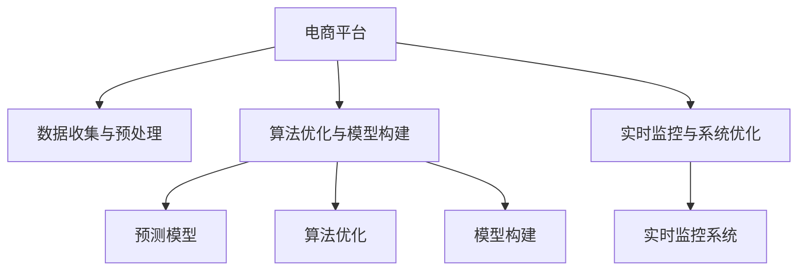

                 

# 电商平台供给能力提升：大数据分析的应用

> 关键词：电商平台,供给能力提升,大数据分析,算法优化,预测模型,实时监控,系统优化

## 1. 背景介绍

在当今电子商务竞争激烈的市场环境中，如何提升平台的供给能力，满足用户的多样化需求，成为电商平台企业关注的焦点。大数据分析作为核心的技术手段，通过海量数据的深度挖掘和分析，帮助企业实现精准营销、库存优化、服务提升等目标，从而有效提升平台的供给能力。本文将详细介绍大数据分析在电商平台供给能力提升中的关键应用，包括数据收集与预处理、算法优化与模型构建、实时监控与系统优化等内容。

## 2. 核心概念与联系

### 2.1 核心概念概述

为更好地理解大数据分析在电商平台供给能力提升中的应用，本节将介绍几个关键概念：

- **电商平台（E-commerce Platform）**：指基于互联网的电子商务平台，通过在线交易和数据处理，实现商品展示、交易、支付、物流等全流程服务。
- **供给能力（Supply Capability）**：指平台能够提供的商品种类、数量、质量、库存水平等资源能力。
- **大数据分析（Big Data Analysis）**：指利用大数据技术，对平台海量数据进行存储、处理和分析，从而挖掘数据价值，驱动业务决策的过程。
- **算法优化（Algorithm Optimization）**：指通过优化算法，提升数据分析模型的效率和效果，实现更精确的预测和决策。
- **预测模型（Predictive Model）**：指基于历史数据和机器学习算法，构建用于预测未来行为或结果的模型。
- **实时监控（Real-Time Monitoring）**：指利用实时数据流和数据分析技术，对平台运营状态进行持续监控，及时发现和解决问题。
- **系统优化（System Optimization）**：指通过改进系统架构、资源配置、流程设计等措施，提升平台的运行效率和服务质量。

这些概念之间的逻辑关系可以通过以下Mermaid流程图来展示：



这个流程图展示了大数据分析在电商平台供给能力提升中的关键步骤：

1. 电商平台收集海量数据，并进行预处理。
2. 使用算法优化技术，构建和优化预测模型。
3. 通过实时监控系统，持续跟踪平台运营状态。
4. 不断优化系统架构和流程，提升平台供给能力。

## 3. 核心算法原理 & 具体操作步骤
### 3.1 算法原理概述

大数据分析在电商平台供给能力提升中的应用，主要涉及数据预处理、算法优化和模型构建等方面。核心算法原理包括以下几个部分：

- **数据预处理（Data Preprocessing）**：包括数据清洗、特征提取、归一化等步骤，保证数据质量，为后续分析提供可靠的基础。
- **算法优化（Algorithm Optimization）**：通过优化算法，提高模型的准确性和效率。常用的优化算法包括梯度下降、随机森林、神经网络等。
- **模型构建（Model Construction）**：基于优化后的算法，构建预测模型，如回归模型、分类模型、聚类模型等。
- **实时监控（Real-Time Monitoring）**：通过实时数据流和流式计算技术，构建监控系统，实时跟踪平台运营状态。
- **系统优化（System Optimization）**：改进系统架构、配置和流程，提升平台供给能力。

### 3.2 算法步骤详解

**Step 1: 数据收集与预处理**

- **数据收集（Data Collection）**：
  - **来源**：包括用户行为数据、交易数据、库存数据、供应链数据等，数据来源多样，涉及平台各个环节。
  - **工具**：如Apache Hadoop、Apache Spark等大数据平台，可以高效地存储和处理海量数据。
  - **方法**：采用ETL（Extract, Transform, Load）技术，从不同数据源抽取数据，进行清洗和转换，最终加载到数据仓库中。

- **数据预处理（Data Preprocessing）**：
  - **清洗（Data Cleaning）**：去除数据中的噪声、缺失值和异常值，保证数据质量。
  - **特征提取（Feature Extraction）**：从原始数据中提取有意义的特征，如用户购买频率、商品库存量、历史交易量等。
  - **归一化（Normalization）**：对数据进行归一化处理，如标准化、最小-最大规范化等，以便后续建模。

**Step 2: 算法优化与模型构建**

- **算法优化（Algorithm Optimization）**：
  - **模型选择（Model Selection）**：根据业务需求和数据特性，选择合适的预测模型，如线性回归、决策树、随机森林、梯度提升树等。
  - **算法调优（Algorithm Tuning）**：通过网格搜索、交叉验证等技术，调整算法参数，找到最优的模型配置。
  - **特征选择（Feature Selection）**：使用特征选择技术，如信息增益、卡方检验、L1正则等，筛选出最具预测能力的特征。

- **模型构建（Model Construction）**：
  - **模型训练（Model Training）**：使用优化后的算法，构建预测模型，并使用训练数据进行模型训练。
  - **模型评估（Model Evaluation）**：使用测试数据集评估模型的性能，常用的评估指标包括准确率、召回率、F1分数等。
  - **模型集成（Model Ensemble）**：通过集成多个模型，提高预测精度，如集成学习、投票法、堆叠法等。

**Step 3: 实时监控与系统优化**

- **实时监控（Real-Time Monitoring）**：
  - **数据采集（Data Acquisition）**：通过实时数据流技术，如Kafka、Flink等，采集平台运营状态数据。
  - **流式计算（Stream Processing）**：使用流式计算平台，如Apache Storm、Apache Flink等，对实时数据进行高效处理。
  - **监控系统（Monitoring System）**：构建监控系统，实时跟踪平台运营状态，如库存量、订单量、用户行为等。

- **系统优化（System Optimization）**：
  - **架构改进（Architecture Improvement）**：通过改进系统架构，如采用微服务架构、分布式系统等，提升系统可扩展性和可靠性。
  - **资源配置（Resource Allocation）**：优化资源配置，如CPU、内存、存储等，保证系统高效运行。
  - **流程设计（Process Design）**：设计高效的业务流程，如订单处理、库存管理等，提升平台运营效率。

### 3.3 算法优缺点

大数据分析在电商平台供给能力提升中的应用，具有以下优点：

- **高效性**：能够快速处理海量数据，实时监控平台运营状态，提高决策效率。
- **准确性**：通过优化算法和模型构建，提高预测精度，减少业务误差。
- **可扩展性**：适用于大规模数据处理，支持平台扩展和业务增长。

同时，也存在一些局限性：

- **数据质量要求高**：需要高质量的数据源和有效的数据清洗方法，以确保分析结果的准确性。
- **技术复杂度**：大数据分析涉及多种技术和工具，需要一定的技术积累和经验。
- **资源投入大**：需要高性能计算资源和专业人才支持，成本较高。

### 3.4 算法应用领域

大数据分析在电商平台供给能力提升中的应用，可以覆盖多个领域，包括：

- **商品推荐系统（Product Recommendation System）**：通过分析用户行为数据，构建推荐模型，提升用户体验和购买率。
- **库存管理（Inventory Management）**：通过预测模型，优化库存水平，减少库存成本，提升供应链效率。
- **订单处理（Order Processing）**：通过实时监控系统，跟踪订单状态，提升订单处理速度和准确性。
- **客户服务（Customer Service）**：通过分析客户反馈数据，优化服务流程，提升客户满意度。

## 4. 数学模型和公式 & 详细讲解 & 举例说明

### 4.1 数学模型构建

大数据分析在电商平台供给能力提升中的应用，主要涉及以下几个数学模型：

- **回归模型（Regression Model）**：用于预测连续数值，如预测用户购买次数、商品销售量等。
- **分类模型（Classification Model）**：用于预测离散标签，如预测用户是否购买某商品、商品是否缺货等。
- **聚类模型（Clustering Model）**：用于发现数据中的潜在群体，如用户分群、商品分类等。

以回归模型为例，其数学模型如下：

$$
y = f(x; \theta)
$$

其中，$y$ 为预测目标，$x$ 为输入特征，$\theta$ 为模型参数。常用的回归模型包括线性回归、多项式回归、岭回归等。

### 4.2 公式推导过程

以线性回归模型为例，其公式推导过程如下：

- **线性回归模型**：
  $$
  y = \theta_0 + \theta_1 x_1 + \theta_2 x_2 + \ldots + \theta_n x_n
  $$

- **最小二乘法（Ordinary Least Squares, OLS）**：
  $$
  \theta = (X^T X)^{-1} X^T y
  $$

其中，$X$ 为特征矩阵，$y$ 为目标向量，$\theta$ 为回归系数。

### 4.3 案例分析与讲解

**案例：电商平台库存优化**

- **数据收集**：
  - **来源**：交易数据、库存数据、供应链数据等。
  - **工具**：Hadoop、Spark等大数据平台。
  - **方法**：ETL技术，从不同数据源抽取数据，进行清洗和转换。

- **数据预处理**：
  - **清洗**：去除噪声、缺失值和异常值。
  - **特征提取**：提取商品库存量、销售量、用户购买频率等特征。
  - **归一化**：标准化处理，如将库存量转换为标准化值。

- **算法优化**：
  - **模型选择**：线性回归模型。
  - **参数调优**：网格搜索，调整回归系数。
  - **特征选择**：卡方检验，筛选重要特征。

- **模型构建**：
  - **模型训练**：使用训练数据，训练线性回归模型。
  - **模型评估**：使用测试数据，评估模型精度。
  - **模型集成**：集成多个模型，提高预测精度。

- **实时监控**：
  - **数据采集**：通过Kafka采集实时数据流。
  - **流式计算**：使用Flink处理实时数据。
  - **监控系统**：实时跟踪库存水平、订单量等。

- **系统优化**：
  - **架构改进**：采用微服务架构，提升系统可扩展性。
  - **资源配置**：优化CPU、内存等资源，保证系统高效运行。
  - **流程设计**：设计高效的订单处理流程，提升服务质量。

## 5. 项目实践：代码实例和详细解释说明

### 5.1 开发环境搭建

在进行项目实践前，我们需要准备好开发环境。以下是使用Python进行Apache Spark开发的环境配置流程：

1. 安装Anaconda：从官网下载并安装Anaconda，用于创建独立的Python环境。

2. 创建并激活虚拟环境：
```bash
conda create -n spark-env python=3.8 
conda activate spark-env
```

3. 安装Spark：根据系统要求，从官网获取对应的安装命令。例如：
```bash
conda install apache-spark=3.0.2
```

4. 安装相关库：
```bash
pip install pandas numpy scikit-learn pyarrow
```

完成上述步骤后，即可在`spark-env`环境中开始项目实践。

### 5.2 源代码详细实现

下面我们以电商平台库存优化为例，给出使用Apache Spark进行数据预处理和回归模型构建的PySpark代码实现。

首先，定义数据预处理函数：

```python
from pyspark.sql import SparkSession
from pyspark.sql.functions import col, when, array
from pyspark.sql.types import IntegerType

spark = SparkSession.builder.appName("Inventory Optimization").getOrCreate()

# 读取数据
df = spark.read.format("csv").option("header", "true").load("inventory_data.csv")

# 清洗数据
df = df.dropna(subset=["item_id", "quantity"])
df = df.drop_duplicates(subset=["item_id", "timestamp"])

# 特征提取
df = df.select("item_id", "timestamp", "quantity", col("quantity").alias("quantity_diff"), col("quantity").alias("quantity_ratio"))
df = df.withColumn("quantity_diff", col("quantity").diff(col("quantity").shift(1)))
df = df.withColumn("quantity_ratio", col("quantity") / col("quantity").shift(1))

# 归一化
df = df.withColumn("quantity_diff", col("quantity_diff") / col("quantity_diff").max())
df = df.withColumn("quantity_ratio", col("quantity_ratio") / col("quantity_ratio").max())

# 特征工程
features = array("quantity_diff", "quantity_ratio", col("timestamp").cast(IntegerType()).dayofweek())
label = col("quantity") - col("quantity").shift(1)

# 分拆数据集
train_df, test_df = df.randomSplit([0.8, 0.2])

# 训练模型
from pyspark.ml.regression import LinearRegression
from pyspark.ml.feature import VectorAssembler
from pyspark.ml.evaluation import RegressionEvaluator

assembler = VectorAssembler(inputCols=features, outputCol="features")
train_data = assembler.transform(train_df)
test_data = assembler.transform(test_df)

regressor = LinearRegression()
regressor.fit(train_data)
```

然后，评估模型性能：

```python
# 预测
test_data = assembler.transform(test_df)
predictions = regressor.transform(test_data)
predictions.select("prediction").show()

# 评估
evaluator = RegressionEvaluator(metricName="rmse", labelCol="label", predictionCol="prediction")
rmse = evaluator.evaluate(predictions)
print(f"RMSE: {rmse}")
```

以上就是使用Apache Spark对电商平台库存进行优化和回归模型构建的完整代码实现。可以看到，通过Spark的高效分布式计算能力，数据预处理和模型构建的过程可以并行执行，大大提高了处理效率。

### 5.3 代码解读与分析

让我们再详细解读一下关键代码的实现细节：

**数据预处理函数**：
- **数据读取（Data Reading）**：通过Spark读取CSV文件，转换为数据帧（DataFrame）。
- **数据清洗（Data Cleaning）**：去除缺失值和重复记录。
- **特征提取（Feature Engineering）**：计算库存差量和库存比率，并进行归一化处理。
- **特征工程（Feature Engineering）**：将库存差量、库存比率和日期特征组合成一个向量，作为模型输入。

**模型训练与评估**：
- **特征选择（Feature Selection）**：使用向量组合工具，将特征转换为标准格式。
- **回归模型（Regression Model）**：使用线性回归模型进行训练和预测。
- **模型评估（Model Evaluation）**：使用RMSE评估模型性能，输出评估结果。

## 6. 实际应用场景

### 6.1 智能推荐系统

基于大数据分析的智能推荐系统，能够根据用户的历史行为和偏好，实时推荐个性化商品，提升用户体验和购买率。推荐系统通常包括用户画像构建、商品相似度计算、推荐算法优化等多个环节。通过分析用户行为数据和商品标签数据，构建推荐模型，如协同过滤、内容推荐、混合推荐等，可以在不增加太多标注数据的情况下，实现高效精准的推荐服务。

### 6.2 库存管理系统

库存管理系统通过实时监控和预测，优化库存水平，减少库存成本，提升供应链效率。系统可以实时跟踪商品的销售量、库存量等关键指标，预测未来需求，指导采购和库存管理。常用的库存优化算法包括动态规划、线性规划、鲁棒优化等，能够有效应对供应链中的不确定性。

### 6.3 订单处理系统

订单处理系统通过大数据分析，优化订单处理流程，提升订单处理速度和准确性。系统可以实时监控订单状态，预测订单处理时间，合理分配订单处理资源，优化物流配送路径，提高整体运营效率。常用的订单处理算法包括遗传算法、蚁群算法、粒子群算法等。

### 6.4 未来应用展望

随着大数据技术的不断进步，大数据分析在电商平台供给能力提升中的应用将更加广泛和深入。未来的趋势可能包括：

- **多模态数据融合**：结合视觉、语音、文本等多种数据源，构建多模态分析模型，提升平台供给能力的全面性和精准性。
- **实时流式分析**：利用实时流式计算技术，对海量数据进行实时分析和处理，实现即时决策。
- **智能预测与优化**：引入深度学习、强化学习等高级算法，构建智能预测与优化模型，提升供应链的灵活性和适应性。
- **用户行为分析**：通过深入分析用户行为数据，构建用户画像，提供个性化的服务体验，提升用户粘性和忠诚度。

## 7. 工具和资源推荐

### 7.1 学习资源推荐

为了帮助开发者系统掌握大数据分析在电商平台供给能力提升中的应用，这里推荐一些优质的学习资源：

1. 《大数据技术与应用》课程：清华大学开设的大数据技术与应用课程，涵盖了Hadoop、Spark等大数据技术，适合初学者入门。
2. 《机器学习实战》书籍：本书通过实战项目，介绍了机器学习算法在大数据分析中的应用，包括回归、分类、聚类等。
3. 《大数据分析与商业智能》书籍：本书详细介绍了大数据分析的技术方法和商业应用，适合业务人员和技术人员的参考。
4. 《Apache Spark实战》书籍：本书通过案例和代码实现，介绍了Spark的大数据处理和分析技术，适合Spark开发者参考。

通过对这些资源的学习实践，相信你一定能够快速掌握大数据分析的精髓，并用于解决实际的电商平台供给能力提升问题。

### 7.2 开发工具推荐

高效的大数据分析离不开优秀的工具支持。以下是几款用于大数据分析开发的常用工具：

1. Apache Hadoop：基于分布式文件系统的数据处理框架，适合大规模数据的存储和处理。
2. Apache Spark：基于内存计算的分布式计算框架，适合快速数据处理和分析。
3. Apache Flink：实时流式计算框架，适合处理实时数据流。
4. Jupyter Notebook：交互式编程环境，适合数据预处理、模型训练和结果展示。
5. PySpark：Spark的Python API，适合Python开发者使用。

合理利用这些工具，可以显著提升大数据分析的开发效率，加快创新迭代的步伐。

### 7.3 相关论文推荐

大数据分析在电商平台供给能力提升中的应用，已经引起了学界的广泛关注。以下是几篇奠基性的相关论文，推荐阅读：

1. "A Survey of Data Mining Techniques for E-commerce Applications"：综述了大数据分析在电商平台中的应用，包括推荐系统、库存管理等。
2. "Big Data Analytics for E-commerce Customer Service"：介绍了大数据分析在电商平台客户服务中的应用，通过分析客户反馈数据，优化服务流程。
3. "Real-Time Supply Chain Analytics Using Big Data"：探讨了大数据分析在实时供应链管理中的应用，通过实时监控和预测，优化供应链运营。
4. "Big Data Analytics for Inventory Management"：详细介绍了大数据分析在电商平台库存管理中的应用，通过预测模型，优化库存水平。

这些论文代表了大数据分析技术在电商平台中的应用方向，深入探讨了相关算法的原理和实现方法。通过学习这些前沿成果，可以帮助研究者把握学科前进方向，激发更多的创新灵感。

## 8. 总结：未来发展趋势与挑战

### 8.1 总结

本文对大数据分析在电商平台供给能力提升中的应用进行了全面系统的介绍。首先阐述了电商平台的供给能力提升背景和重要性，明确了大数据分析在其中的关键作用。其次，从原理到实践，详细讲解了数据预处理、算法优化和模型构建等关键步骤，给出了大数据分析任务开发的完整代码实例。同时，本文还广泛探讨了大数据分析在智能推荐、库存管理、订单处理等多个行业领域的应用前景，展示了大数据分析的巨大潜力。

通过本文的系统梳理，可以看到，大数据分析在电商平台供给能力提升中的重要作用。它通过高效的数据处理和深度挖掘，帮助企业优化资源配置，提升服务质量，实现数字化转型。未来，伴随大数据技术的持续演进和算法优化，大数据分析必将在更多领域得到应用，为电商平台的持续发展注入新的动力。

### 8.2 未来发展趋势

展望未来，大数据分析在电商平台供给能力提升中的应用将呈现以下几个发展趋势：

1. **技术融合**：大数据分析将与其他AI技术如机器学习、深度学习、强化学习等融合，构建更加智能的分析和决策系统。
2. **实时处理**：实时流式计算和大数据技术将进一步发展，支持更加快速和精确的实时分析。
3. **多模态分析**：结合视觉、语音、文本等多种数据源，构建多模态分析模型，提升平台供给能力的全面性和精准性。
4. **智能预测**：引入深度学习、强化学习等高级算法，构建智能预测与优化模型，提升供应链的灵活性和适应性。
5. **个性化服务**：通过深入分析用户行为数据，构建用户画像，提供个性化的服务体验，提升用户粘性和忠诚度。

以上趋势凸显了大数据分析技术的广阔前景。这些方向的探索发展，必将进一步提升电商平台的供给能力，推动数字化转型的深入实施。

### 8.3 面临的挑战

尽管大数据分析在电商平台供给能力提升中已经取得了瞩目成就，但在迈向更加智能化、普适化应用的过程中，它仍面临着诸多挑战：

1. **数据质量瓶颈**：高质量的数据源和有效的数据清洗方法，是大数据分析的基础，如何获取和处理海量高质数据，仍是一大难题。
2. **技术复杂度**：大数据分析涉及多种技术和工具，需要一定的技术积累和经验，如何降低技术门槛，提升应用效率，还需要进一步研究。
3. **成本投入大**：高性能计算资源和专业人才的投入，是大数据分析的必要条件，如何降低成本，提高资源利用率，仍是一个重要课题。
4. **隐私与安全**：海量数据的存储和处理，带来了数据隐私和安全的风险，如何保护用户隐私，防止数据泄露，是必须解决的问题。

### 8.4 研究展望

面对大数据分析面临的这些挑战，未来的研究需要在以下几个方面寻求新的突破：

1. **自动化数据预处理**：开发自动化的数据清洗和特征工程工具，降低数据预处理的复杂度。
2. **大数据融合技术**：研究多模态数据融合技术，提高数据分析的全面性和准确性。
3. **低成本高效算法**：开发低成本高效的大数据分析算法，提升算法效率和性能。
4. **隐私保护机制**：构建隐私保护机制，如差分隐私、联邦学习等，保护用户数据隐私。
5. **智能监控系统**：开发智能监控系统，实现实时数据监控和异常检测，提升系统鲁棒性。

这些研究方向将推动大数据分析技术的不断进步，为电商平台的供给能力提升提供更加高效、安全、智能的解决方案。

## 9. 附录：常见问题与解答

**Q1：大数据分析在电商平台中的应用有哪些？**

A: 大数据分析在电商平台中的应用主要包括以下几个方面：

1. **用户画像构建**：通过分析用户行为数据，构建用户画像，提供个性化的服务体验。
2. **商品推荐系统**：根据用户历史行为和偏好，实时推荐个性化商品，提升用户体验和购买率。
3. **库存管理**：通过实时监控和预测，优化库存水平，减少库存成本，提升供应链效率。
4. **订单处理**：优化订单处理流程，提升订单处理速度和准确性，合理分配订单处理资源。
5. **客户服务**：通过分析客户反馈数据，优化服务流程，提升客户满意度。

**Q2：如何选择合适的预测模型？**

A: 选择预测模型时，应根据业务需求和数据特性，综合考虑以下几个因素：

1. **数据类型**：如连续型数据、离散型数据、时间序列数据等。
2. **预测目标**：如回归、分类、聚类等。
3. **数据量和复杂度**：如数据量较小，可以选择简单的模型如线性回归；数据量较大，可以选择复杂的模型如深度神经网络。
4. **计算资源**：如计算资源有限，可以选择轻量级模型；计算资源充足，可以选择复杂的深度学习模型。

**Q3：如何降低大数据分析的复杂度？**

A: 降低大数据分析的复杂度，可以从以下几个方面入手：

1. **自动化数据预处理**：开发自动化的数据清洗和特征工程工具，减少人工干预。
2. **简化的模型架构**：选择轻量级、高效的模型架构，如线性回归、决策树等。
3. **可视化工具**：使用可视化工具如Tableau、Power BI等，直观展示数据和模型结果，降低复杂度。
4. **业务驱动分析**：根据业务需求和目标，简化分析过程，聚焦关键指标和核心问题。

**Q4：大数据分析在电商平台中应注意哪些隐私和安全问题？**

A: 大数据分析在电商平台中应注意以下几个隐私和安全问题：

1. **数据匿名化**：使用差分隐私等技术，对用户数据进行匿名化处理，保护用户隐私。
2. **数据加密**：对敏感数据进行加密处理，防止数据泄露。
3. **访问控制**：设置严格的访问控制机制，控制数据访问权限，防止未经授权的数据访问。
4. **安全监控**：构建安全监控系统，实时监控数据访问和使用情况，及时发现和处理异常行为。

这些措施可以有效保护用户数据隐私和安全，增强平台的可信度和用户信任度。

**Q5：如何优化电商平台的库存管理？**

A: 优化电商平台的库存管理，可以从以下几个方面入手：

1. **实时监控**：利用实时数据流和流式计算技术，实时监控库存水平和订单状态。
2. **预测模型**：使用回归模型、时间序列模型等预测未来需求，指导采购和库存管理。
3. **多模态分析**：结合销售数据、供应链数据、市场数据等，构建多模态分析模型，提升预测精度。
4. **智能调度**：使用优化算法如遗传算法、粒子群算法等，优化库存调度和物流配送。
5. **库存优化算法**：引入动态规划、线性规划、鲁棒优化等算法，优化库存水平，减少库存成本。

通过以上措施，可以大幅提升平台的库存管理效率，降低运营成本，提升供应链的灵活性和适应性。

**Q6：如何构建电商平台的推荐系统？**

A: 构建电商平台的推荐系统，可以从以下几个方面入手：

1. **用户画像构建**：通过分析用户行为数据，构建用户画像，了解用户兴趣和偏好。
2. **商品相似度计算**：使用协同过滤、内容推荐等算法，计算商品之间的相似度。
3. **推荐算法优化**：选择适当的推荐算法，如协同过滤、深度学习等，优化推荐效果。
4. **实时推荐**：利用流式计算和大数据技术，实现实时推荐，提升用户体验。
5. **效果评估**：使用A/B测试、点击率、转化率等指标，评估推荐系统效果，不断优化和改进。

通过以上措施，可以构建高效精准的推荐系统，提升用户体验和购买率。

---

作者：禅与计算机程序设计艺术 / Zen and the Art of Computer Programming

