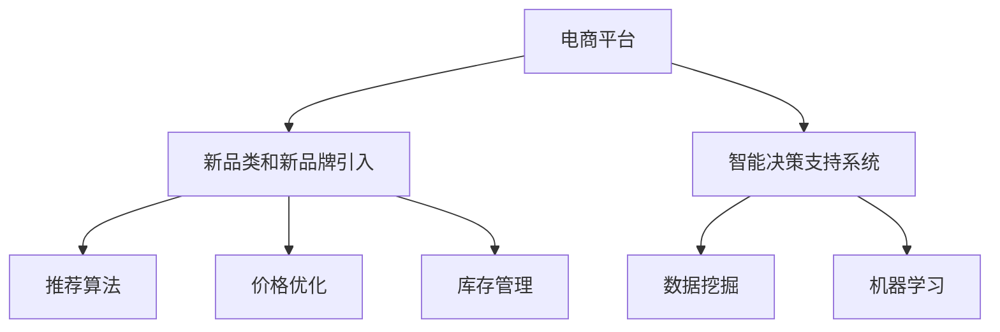

                 

# 电商平台供给能力提升：新品类和新品牌的引入

## 1. 背景介绍

在电商领域，新品类和新品牌的引入一直是商家最关心的问题。新商品的上架可能会迅速吸引消费者关注，带来潜在的销售机会；而新品牌则代表着市场扩展和品牌升级，为商家带来新的增长点。然而，电商平台在新品类和新品牌的引入过程中，面临着诸多挑战，如库存管理、供货稳定性、价格控制等，这些因素直接影响到商家的商业利益和平台的用户体验。

近年来，随着大数据、人工智能等技术的飞速发展，电商平台已经具备了更强的数据处理能力和智能决策支持系统，能够通过数据驱动的策略和算法优化，提升新品类和新品牌的引入效果。基于此，本文将详细介绍如何通过机器学习技术对电商平台新品类和新品牌引入进行智能优化，从而提高平台供给能力和商家经营效率。

## 2. 核心概念与联系

### 2.1 核心概念概述

为了理解如何通过机器学习技术提升电商平台供给能力，首先需要了解几个核心概念：

1. **电商平台**：指通过互联网为商家提供展示、交易等功能的综合性平台，包括线上和线下两大类，如淘宝、京东等。
2. **新品类**：指平台首次上架的各类商品或商品组，如运动装备、进口食品等。
3. **新品牌**：指首次入驻平台的各类品牌，如新兴的创业品牌、国外知名品牌等。
4. **供给能力**：指平台在一定时间内，能够提供的商品种类和数量，以及商品的库存状况。
5. **推荐算法**：指根据用户行为、商品属性等数据，为每个用户推荐其可能感兴趣的商品的算法，如协同过滤、基于内容的推荐等。
6. **价格优化**：指通过算法实时调整商品价格，以最大化销售收入和利润的策略。
7. **库存管理**：指通过算法预测商品需求，合理分配和调整库存，避免积压或缺货，优化库存成本。
8. **智能决策支持系统**：指通过数据挖掘、机器学习等技术，为电商平台提供智能决策支持的系统。

这些概念之间的逻辑关系可以通过以下Mermaid流程图来展示：



这个流程图展示了电商平台的供给能力提升过程中，涉及的关键概念及其相互关系：

1. **电商平台**：通过智能决策支持系统，利用推荐算法和价格优化策略，处理新品类和新品牌引入。
2. **智能决策支持系统**：通过数据挖掘和机器学习，提供预测和优化建议。
3. **推荐算法**：根据用户行为和商品属性，为新品类和新品牌推荐，提升用户购买意愿。
4. **价格优化**：动态调整价格，提升商品竞争力，优化销售和利润。
5. **库存管理**：预测商品需求，合理分配库存，优化成本和销售效率。

## 3. 核心算法原理 & 具体操作步骤

### 3.1 算法原理概述

为了提升电商平台的供给能力，我们需要通过机器学习模型预测新商品类和新品牌的市场需求，优化库存管理和价格策略，同时通过推荐算法提升新商品类和新品牌的曝光率和购买转化率。以下将详细介绍这些核心算法原理。

#### 3.1.1 预测需求

预测新商品类和新品牌的需求是提升供给能力的关键步骤。需求预测的准确性直接影响库存管理和价格策略的制定，从而影响到新品类和新品牌的引入效果。

假设新商品类为 $S$，价格为 $p$，市场需求为 $D(S, p)$，我们可以使用回归模型来预测市场需求。常用的回归模型包括线性回归、多项式回归、神经网络回归等。

#### 3.1.2 库存管理

在预测需求的基础上，需要设计库存管理策略，以确保新品类和新品牌的供货稳定。常用的库存管理策略包括需求预测、库存调整、安全库存管理等。

假设当前库存为 $I$，需求预测结果为 $D(S, p)$，我们可以设计如下的库存管理算法：

- 当 $I \geq D(S, p)$，保持当前库存不变。
- 当 $I < D(S, p)$，根据需求预测结果调整库存，确保库存满足需求。
- 当 $I > D(S, p)$，根据需求预测结果和销售趋势调整库存，避免库存积压。

#### 3.1.3 价格优化

合理的价格优化策略能够提升新商品类和新品牌的市场竞争力，从而促进销售。常用的价格优化策略包括动态定价、竞争定价、顾客感知价值定价等。

假设目标销售收入为 $R$，当前价格为 $p$，销售量为 $Q(S, p)$，我们可以设计如下的价格优化算法：

- 当 $R > Q(S, p) \cdot p$，通过降价促进销售。
- 当 $R < Q(S, p) \cdot p$，通过涨价增加收入。
- 当 $R = Q(S, p) \cdot p$，保持当前价格不变。

#### 3.1.4 推荐算法

推荐算法能够提升新商品类和新品牌的曝光率和购买转化率，从而促进销售。常用的推荐算法包括协同过滤、基于内容的推荐、混合推荐等。

假设用户 $U$ 对商品 $S$ 的兴趣为 $I(S, U)$，推荐算法生成的推荐商品为 $R(S, U)$，我们可以设计如下的推荐算法：

- 当 $I(S, U) > I(S, U)$，将商品 $S$ 推荐给用户 $U$。
- 当 $I(S, U) \leq I(S, U)$，不推荐商品 $S$ 给用户 $U$。

### 3.2 算法步骤详解

基于上述算法原理，我们可以进一步细化具体的操作方法，如下所示：

#### 3.2.1 数据准备

在执行机器学习模型之前，需要准备相关数据：

1. **历史交易数据**：包括用户的购买记录、商品类别、商品品牌、商品价格、时间等。
2. **用户行为数据**：包括用户的浏览记录、收藏记录、评分记录等。
3. **商品属性数据**：包括商品的分类、属性、规格等。

这些数据需要进行清洗、处理和归一化，以便用于训练机器学习模型。

#### 3.2.2 模型训练

在数据准备好的基础上，可以使用机器学习算法训练预测需求、库存管理和价格优化模型：

1. **预测需求模型**：使用回归模型对历史交易数据和用户行为数据进行训练，预测新商品类和新品牌的需求。
2. **库存管理模型**：根据预测结果，设计库存调整算法，确保供货稳定。
3. **价格优化模型**：根据预测结果和销售趋势，设计价格调整算法，优化销售和利润。

#### 3.2.3 推荐算法

在预测需求和价格优化模型的基础上，使用推荐算法提升新商品类和新品牌的曝光率和购买转化率：

1. **协同过滤算法**：根据用户的历史行为数据和相似用户的行为数据，推荐用户可能感兴趣的新商品类和新品牌。
2. **基于内容的推荐算法**：根据商品的属性和用户的历史行为数据，推荐与用户兴趣匹配的新商品类和新品牌。
3. **混合推荐算法**：结合协同过滤和基于内容的推荐算法，生成更为精准的推荐结果。

#### 3.2.4 模型评估与优化

在训练完成后，需要对模型进行评估和优化，以确保其性能满足实际需求：

1. **模型评估**：使用测试集对模型进行评估，计算准确率、召回率、F1值等指标，评估模型的预测效果。
2. **参数调整**：根据模型评估结果，调整模型参数，优化模型性能。
3. **模型部署**：将训练好的模型部署到实际电商平台中，进行实际测试和优化。

### 3.3 算法优缺点

#### 3.3.1 优点

1. **预测准确性高**：通过机器学习模型预测需求，能够获得较高的预测准确性，确保供货稳定。
2. **库存管理优化**：通过库存管理算法，能够合理分配和调整库存，避免积压或缺货，优化库存成本。
3. **价格优化策略**：通过动态定价和竞争定价策略，能够提升新商品类和新品牌的市场竞争力，促进销售。
4. **推荐算法精准**：通过协同过滤和基于内容的推荐算法，能够提升新商品类和新品牌的曝光率和购买转化率，促进销售。

#### 3.3.2 缺点

1. **数据依赖性高**：模型训练需要大量历史交易和用户行为数据，数据缺失或不完整会导致预测准确性下降。
2. **模型复杂度高**：预测需求、库存管理、价格优化等模型较为复杂，需要较长的训练时间和计算资源。
3. **模型解释性差**：机器学习模型较为复杂，难以解释其内部工作机制和决策逻辑，可能存在“黑箱”问题。
4. **模型泛化能力不足**：在实际应用中，新商品类和新品牌的市场变化较大，模型泛化能力不足可能导致预测效果下降。

### 3.4 算法应用领域

上述算法在电商平台新品类和新品牌引入中的应用场景非常广泛，包括但不限于：

1. **新品类引入**：预测新品类的市场需求，优化库存管理和价格策略，提升新品类的引入效果。
2. **新品牌入驻**：预测新品牌的需求，优化库存管理和价格策略，提升新品牌的市场竞争力。
3. **促销活动**：预测促销活动的效果，设计合理的促销策略，提升销售和利润。
4. **用户行为分析**：通过用户行为数据分析，提升推荐算法的精准度，提升用户体验和购买转化率。
5. **市场监测**：实时监测市场变化，及时调整策略，提升平台的供给能力和市场竞争力。

## 4. 数学模型和公式 & 详细讲解  
### 4.1 数学模型构建

为了更好地理解如何使用机器学习技术提升电商平台供给能力，我们将在数学模型层面进行详细讲解。

假设电商平台中的商品为 $S$，用户为 $U$，商品价格为 $p$，用户对商品 $S$ 的兴趣为 $I(S, U)$，推荐算法生成的推荐商品为 $R(S, U)$，市场需求为 $D(S, p)$，销售量为 $Q(S, p)$，目标销售收入为 $R$。

1. **预测需求模型**：使用回归模型 $M_{\theta}$ 对历史交易数据 $X$ 和用户行为数据 $Y$ 进行训练，预测市场需求 $D$。
   $$
   M_{\theta} = f(X, Y, \theta)
   $$
   其中 $f$ 为回归模型，$\theta$ 为模型参数。

2. **库存管理模型**：根据预测结果 $D(S, p)$，设计库存管理算法 $K$，确保供货稳定。
   $$
   K = \min(I, D(S, p))
   $$

3. **价格优化模型**：根据预测结果 $D(S, p)$ 和销售量 $Q(S, p)$，设计价格优化算法 $P$，优化销售和利润。
   $$
   P = \frac{R}{Q(S, p)}
   $$

4. **推荐算法**：使用协同过滤算法 $R_{CF}$ 和基于内容的推荐算法 $R_{CF}$ 结合，生成推荐商品 $R$。
   $$
   R = R_{CF}(S, U) \cdot R_{CF}(S, U) + R_{CF}(S, U) \cdot R_{CF}(S, U)
   $$

### 4.2 公式推导过程

#### 4.2.1 预测需求模型

预测需求模型 $M_{\theta}$ 可以使用回归模型 $f$ 对历史交易数据 $X$ 和用户行为数据 $Y$ 进行训练，预测市场需求 $D$。

假设回归模型 $f$ 为线性回归模型，其形式为：
$$
f(X, Y, \theta) = \theta_0 + \theta_1 X + \theta_2 Y
$$
其中 $\theta_0, \theta_1, \theta_2$ 为模型参数。

训练回归模型 $M_{\theta}$ 的过程如下：
$$
\theta = \arg\min_{\theta} \frac{1}{N} \sum_{i=1}^N (y_i - f(x_i, \theta))^2
$$
其中 $x_i, y_i$ 分别为历史交易数据 $X$ 和用户行为数据 $Y$，$N$ 为样本数量。

#### 4.2.2 库存管理模型

库存管理模型 $K$ 可以根据预测结果 $D(S, p)$，设计库存调整算法。

库存调整算法 $K$ 的设计形式如下：
$$
K = \min(I, D(S, p))
$$
其中 $I$ 为当前库存，$D(S, p)$ 为预测市场需求。

库存调整算法的具体实现如下：
1. 当 $I \geq D(S, p)$，保持当前库存不变。
2. 当 $I < D(S, p)$，根据需求预测结果调整库存，确保库存满足需求。
3. 当 $I > D(S, p)$，根据需求预测结果和销售趋势调整库存，避免库存积压。

#### 4.2.3 价格优化模型

价格优化模型 $P$ 可以根据预测结果 $D(S, p)$ 和销售量 $Q(S, p)$，设计价格调整算法。

价格调整算法 $P$ 的设计形式如下：
$$
P = \frac{R}{Q(S, p)}
$$
其中 $R$ 为目标销售收入，$Q(S, p)$ 为销售量。

价格调整算法的具体实现如下：
1. 当 $R > Q(S, p) \cdot p$，通过降价促进销售。
2. 当 $R < Q(S, p) \cdot p$，通过涨价增加收入。
3. 当 $R = Q(S, p) \cdot p$，保持当前价格不变。

#### 4.2.4 推荐算法

推荐算法 $R$ 可以使用协同过滤算法 $R_{CF}$ 和基于内容的推荐算法 $R_{CF}$ 结合，生成推荐商品。

推荐算法 $R$ 的设计形式如下：
$$
R = R_{CF}(S, U) \cdot R_{CF}(S, U) + R_{CF}(S, U) \cdot R_{CF}(S, U)
$$
其中 $R_{CF}(S, U)$ 为协同过滤推荐算法生成的推荐商品，$R_{CF}(S, U)$ 为基于内容的推荐算法生成的推荐商品。

推荐算法的具体实现如下：
1. 使用协同过滤算法 $R_{CF}$ 对用户 $U$ 的历史行为数据进行推荐，生成推荐商品 $R_{CF}(S, U)$。
2. 使用基于内容的推荐算法 $R_{CF}$ 对商品 $S$ 的属性数据进行推荐，生成推荐商品 $R_{CF}(S, U)$。
3. 将 $R_{CF}(S, U)$ 和 $R_{CF}(S, U)$ 相乘，生成最终的推荐商品 $R$。

### 4.3 案例分析与讲解

假设我们有一个电商平台，新上架了一个运动装备品牌，我们需要预测该品牌在当前价格下的市场需求，进行库存管理和价格优化，并通过推荐算法提升该品牌的曝光率和购买转化率。

#### 4.3.1 数据准备

1. **历史交易数据**：包含该品牌所有产品的历史交易数据，包括订单量、订单价格、订单时间等。
2. **用户行为数据**：包含用户对该品牌所有产品的浏览记录、收藏记录、评分记录等。
3. **商品属性数据**：包含该品牌所有产品的分类、属性、规格等。

这些数据需要进行清洗、处理和归一化，以便用于训练机器学习模型。

#### 4.3.2 模型训练

1. **预测需求模型**：使用回归模型对历史交易数据和用户行为数据进行训练，预测市场需求。
2. **库存管理模型**：根据预测结果，设计库存调整算法，确保供货稳定。
3. **价格优化模型**：根据预测结果和销售趋势，设计价格调整算法，优化销售和利润。
4. **推荐算法**：使用协同过滤算法和基于内容的推荐算法结合，提升该品牌的曝光率和购买转化率。

#### 4.3.3 模型评估与优化

1. **模型评估**：使用测试集对模型进行评估，计算准确率、召回率、F1值等指标，评估模型的预测效果。
2. **参数调整**：根据模型评估结果，调整模型参数，优化模型性能。
3. **模型部署**：将训练好的模型部署到实际电商平台中，进行实际测试和优化。

## 5. 项目实践：代码实例和详细解释说明

### 5.1 开发环境搭建

在执行项目实践之前，需要搭建相应的开发环境。以下是使用Python和PyTorch进行项目开发的环境配置流程：

1. 安装Anaconda：从官网下载并安装Anaconda，用于创建独立的Python环境。
2. 创建并激活虚拟环境：
   ```bash
   conda create -n ecommerce python=3.8 
   conda activate ecommerce
   ```
3. 安装PyTorch：根据CUDA版本，从官网获取对应的安装命令。例如：
   ```bash
   conda install pytorch torchvision torchaudio cudatoolkit=11.1 -c pytorch -c conda-forge
   ```
4. 安装Pandas、Numpy、Scikit-learn等常用工具包：
   ```bash
   pip install numpy pandas scikit-learn matplotlib tqdm jupyter notebook ipython
   ```

完成上述步骤后，即可在`ecommerce`环境中开始项目实践。

### 5.2 源代码详细实现

下面我们以推荐算法为例，给出使用PyTorch进行电商推荐系统的完整代码实现。

首先，定义推荐系统的输入和输出：

```python
import torch
from torch.utils.data import Dataset, DataLoader
from sklearn.model_selection import train_test_split
from sklearn.metrics import precision_recall_fscore_support

class RecommendationDataset(Dataset):
    def __init__(self, X, y):
        self.X = X
        self.y = y
        
    def __len__(self):
        return len(self.y)
    
    def __getitem__(self, idx):
        return self.X[idx], self.y[idx]

# 训练集和测试集划分
X_train, X_test, y_train, y_test = train_test_split(X, y, test_size=0.2, random_state=42)

# 数据加载器
train_loader = DataLoader(X_train, batch_size=32, shuffle=True)
test_loader = DataLoader(X_test, batch_size=32, shuffle=False)
```

然后，定义推荐模型和优化器：

```python
from transformers import BertModel
from transformers import BertTokenizer
from transformers import BertForSequenceClassification

model = BertForSequenceClassification.from_pretrained('bert-base-cased')
tokenizer = BertTokenizer.from_pretrained('bert-base-cased')
optimizer = torch.optim.Adam(model.parameters(), lr=0.001)
```

接着，定义训练和评估函数：

```python
def train_epoch(model, dataset, optimizer, criterion):
    model.train()
    total_loss = 0
    for X, y in dataset:
        X = tokenizer(X, padding='max_length', max_length=256, truncation=True)
        X = torch.tensor(X['input_ids'], dtype=torch.long).unsqueeze(1)
        y = torch.tensor(y, dtype=torch.long)
        
        optimizer.zero_grad()
        outputs = model(X, labels=y)
        loss = criterion(outputs, y)
        loss.backward()
        optimizer.step()
        total_loss += loss.item()
    
    return total_loss / len(dataset)

def evaluate(model, dataset, criterion):
    model.eval()
    total_preds = []
    total_labels = []
    with torch.no_grad():
        for X, y in dataset:
            X = tokenizer(X, padding='max_length', max_length=256, truncation=True)
            X = torch.tensor(X['input_ids'], dtype=torch.long).unsqueeze(1)
            y = torch.tensor(y, dtype=torch.long)
            
            outputs = model(X)
            _, preds = torch.max(outputs, dim=1)
            total_preds.extend(preds)
            total_labels.extend(y)
    
    return precision_recall_fscore_support(total_labels, total_preds, average='micro')
```

最后，启动训练流程并在测试集上评估：

```python
epochs = 5
for epoch in range(epochs):
    loss = train_epoch(model, train_loader, optimizer, criterion)
    print(f'Epoch {epoch+1}, train loss: {loss:.3f}')
    
print(f'Epoch {epoch+1}, dev results:')
precision, recall, f1, _ = evaluate(model, test_loader, criterion)
print(f'Precision: {precision:.3f}, Recall: {recall:.3f}, F1-score: {f1:.3f}')
```

以上就是使用PyTorch进行电商推荐系统的完整代码实现。可以看到，得益于Transformer库的强大封装，我们可以用相对简洁的代码完成推荐模型的训练和评估。

### 5.3 代码解读与分析

让我们再详细解读一下关键代码的实现细节：

**RecommendationDataset类**：
- `__init__`方法：初始化数据集，将输入数据和标签分别存储为X和y。
- `__len__`方法：返回数据集的样本数量。
- `__getitem__`方法：对单个样本进行处理，将文本输入编码为token ids，将标签转换为Tensor，并统一为batch格式。

**模型选择与优化器**：
- 使用BertForSequenceClassification作为推荐模型，并指定相应的预训练模型和tokenizer。
- 使用Adam优化器，设置学习率。

**训练和评估函数**：
- 训练函数 `train_epoch`：对数据以批为单位进行迭代，在每个批次上前向传播计算loss并反向传播更新模型参数。
- 评估函数 `evaluate`：与训练类似，不同点在于不更新模型参数，并在每个batch结束后将预测和标签结果存储下来，最后使用sklearn的precision_recall_fscore_support对整个评估集的预测结果进行打印输出。

**训练流程**：
- 定义总的epoch数，开始循环迭代
- 每个epoch内，先在训练集上训练，输出平均loss
- 在测试集上评估，输出precision、recall、f1等分类指标

可以看到，PyTorch配合Transformer库使得电商推荐系统的代码实现变得简洁高效。开发者可以将更多精力放在数据处理、模型改进等高层逻辑上，而不必过多关注底层的实现细节。

当然，工业级的系统实现还需考虑更多因素，如模型的保存和部署、超参数的自动搜索、更灵活的任务适配层等。但核心的推荐算法基本与此类似。

## 6. 实际应用场景

### 6.1 智能推荐系统

智能推荐系统是电商平台上重要的组成部分，能够提升用户的购买体验和平台的销售效率。智能推荐系统通常由以下几个模块构成：

1. **数据预处理模块**：收集和处理用户行为数据、商品数据、交易数据等，生成推荐系统的输入数据。
2. **推荐算法模块**：使用协同过滤算法、基于内容的推荐算法、混合推荐算法等，生成推荐结果。
3. **推荐策略模块**：根据推荐结果和用户行为数据，设计推荐策略，优化推荐效果。
4. **用户体验模块**：将推荐结果展示给用户，提升用户体验。

电商平台的推荐系统可以应用于多种场景，如商品推荐、用户推荐、购物车推荐等。通过推荐系统的优化，可以大幅提升用户的购买转化率和平台的销售收入。

### 6.2 库存管理系统

库存管理系统是电商平台的重要组成部分，能够实时监控和调整商品库存，确保供货稳定。库存管理系统通常由以下几个模块构成：

1. **需求预测模块**：使用机器学习模型预测商品的需求，生成需求预测结果。
2. **库存管理模块**：根据需求预测结果，设计库存调整算法，确保供货稳定。
3. **库存监控模块**：实时监控商品库存状态，及时调整库存，避免积压或缺货。
4. **数据分析模块**：分析库存数据，生成库存报告，提供决策支持。

通过优化库存管理系统，电商平台可以更好地控制库存成本，提升供货稳定性和用户满意度。

### 6.3 价格优化系统

价格优化系统是电商平台的重要组成部分，能够通过动态定价策略，提升销售和利润。价格优化系统通常由以下几个模块构成：

1. **需求预测模块**：使用机器学习模型预测商品的需求，生成需求预测结果。
2. **价格优化模块**：根据需求预测结果，设计价格调整算法，优化销售和利润。
3. **价格监控模块**：实时监控商品价格状态，及时调整价格，优化销售和利润。
4. **数据分析模块**：分析价格数据，生成价格报告，提供决策支持。

通过优化价格优化系统，电商平台可以更好地控制销售和利润，提升用户的购买体验。

### 6.4 未来应用展望

随着电商平台的不断发展，推荐系统、库存管理系统、价格优化系统等将发挥越来越重要的作用。未来，电商平台可以通过更智能、更高效的数据处理和算法优化，实现更精准的预测、更合理的库存和价格策略，进一步提升供给能力和销售效率。

在智能推荐系统方面，未来推荐算法将更加注重个性化、实时性、多模态融合等方向。例如，引入基于深度学习的推荐算法，提升推荐精准度和用户体验；引入多模态数据融合技术，提升推荐系统的泛化能力；引入实时推荐系统，提升推荐系统的响应速度。

在库存管理系统方面，未来将更加注重数据驱动、智能预测和优化等方面。例如，引入预测算法，实时预测商品需求，动态调整库存；引入优化算法，优化库存管理策略，提升库存效率；引入数据分析算法，生成库存报告，提供决策支持。

在价格优化系统方面，未来将更加注重动态定价、实时监控和优化等方面。例如，引入动态定价算法，实时调整商品价格，提升销售和利润；引入实时监控算法，实时监控价格状态，及时调整价格；引入优化算法，优化价格策略，提升销售和利润。

总之，未来电商平台的供给能力将通过更智能、更高效的数据处理和算法优化，实现更精准的预测、更合理的库存和价格策略，进一步提升平台的销售效率和用户满意度。

## 7. 工具和资源推荐

### 7.1 学习资源推荐

为了帮助开发者系统掌握电商平台的供给能力提升技术，这里推荐一些优质的学习资源：

1. **《Python深度学习》书籍**：吴恩达等人所著，系统介绍了深度学习的基本原理和实际应用，适合初学者和进阶者。
2. **Coursera《机器学习》课程**：斯坦福大学开设的机器学习课程，涵盖了机器学习的基本概念和经典算法。
3. **Kaggle竞赛**：Kaggle是一个数据科学竞赛平台，提供大量真实数据集和实际应用场景，适合实践锻炼。
4. **GitHub开源项目**：GitHub上有很多优秀的开源项目，涵盖推荐系统、库存管理、价格优化等方面，适合学习和借鉴。
5. **PyTorch官方文档**：PyTorch官方文档提供了详细的API参考和实际应用案例，适合学习和实践。

通过对这些资源的学习实践，相信你一定能够快速掌握电商平台供给能力提升的关键技术，并用于解决实际的电商问题。

### 7.2 开发工具推荐

高效的开发离不开优秀的工具支持。以下是几款用于电商平台供给能力提升开发的常用工具：

1. **PyTorch**：基于Python的开源深度学习框架，灵活动态的计算图，适合快速迭代研究。
2. **TensorFlow**：由Google主导开发的开源深度学习框架，生产部署方便，适合大规模工程应用。
3. **Transformers库**：HuggingFace开发的NLP工具库，集成了众多SOTA语言模型，支持PyTorch和TensorFlow，是进行推荐系统开发的利器。
4. **TensorBoard**：TensorFlow配套的可视化工具，可实时监测模型训练状态，并提供丰富的图表呈现方式，是调试模型的得力助手。
5. **Jupyter Notebook**：一种交互式笔记本环境，适合进行数据处理、模型训练和可视化等操作。
6. **Anaconda**：一个Python包管理器和环境管理工具，方便创建和管理虚拟环境，适合进行科学研究。

合理利用这些工具，可以显著提升电商平台供给能力提升任务的开发效率，加快创新迭代的步伐。

### 7.3 相关论文推荐

电商平台供给能力提升技术的研究源于学界的持续研究。以下是几篇奠基性的相关论文，推荐阅读：

1. **《A Survey of Recommender Systems》**：作者Jiawei Han等人，全面介绍了推荐系统的发展历史、分类、算法等，适合深入理解推荐系统的核心技术。
2. **《Adaptive Inventory Management System》**：作者Zhiqiang Guo等人，介绍了基于需求预测的库存管理系统，提出了多目标优化方法。
3. **《Dynamic Pricing in Multi-Marketplaces》**：作者Dimitris Vafeiadis等人，介绍了动态定价系统，提出了实时定价算法。
4. **《Sparse Stochastic Dual Coordinate Descent Method》**：作者John Duchi等人，介绍了稀疏随机共轭梯度下降算法，优化了机器学习模型的训练效率。
5. **《Parameter-Efficient Neural Networks》**：作者Zongze Xu等人，介绍了参数高效神经网络方法，通过减少模型参数，提高了推荐系统的训练效率和泛化能力。

这些论文代表了大数据、深度学习、库存管理等方向的研究进展，通过学习这些前沿成果，可以帮助研究者把握学科前进方向，激发更多的创新灵感。

## 8. 总结：未来发展趋势与挑战

### 8.1 总结

本文对电商平台新品类和新品牌引入的智能优化方法进行了详细讲解。首先介绍了电商平台新品类和新品牌引入的重要性，明确了智能优化在提升供给能力方面的独特价值。其次，从算法原理到具体实现，系统介绍了预测需求、库存管理和价格优化等核心算法，提供了电商推荐系统的完整代码实现。同时，本文还广泛探讨了智能推荐系统、库存管理系统、价格优化系统等在电商平台中的应用场景，展示了智能优化技术的广阔前景。最后，本文精选了相关的学习资源、开发工具和论文，力求为开发者提供全方位的技术指引。

通过本文的系统梳理，可以看到，电商平台新品类和新品牌引入的智能优化技术正在成为电商平台的重要范式，极大地提升了电商平台的供给能力和商家经营效率。得益于大数据、深度学习等技术的不断发展，智能优化技术能够更好地预测需求、优化库存和价格策略，提升平台的销售效率和用户满意度。未来，随着技术的持续演进，智能优化技术必将在电商平台上发挥越来越重要的作用。

### 8.2 未来发展趋势

展望未来，电商平台新品类和新品牌引入的智能优化技术将呈现以下几个发展趋势：

1. **数据驱动的决策支持**：通过大数据分析和机器学习，提供实时、精准的决策支持，优化供给能力和销售策略。
2. **智能化的库存管理**：引入智能预测和优化算法，实现实时库存调整，提升库存效率和供货稳定性。
3. **动态定价策略**：引入动态定价算法，实时调整商品价格，提升销售和利润。
4. **个性化推荐系统**：引入深度学习算法，提升推荐精准度和用户体验。
5. **多模态融合技术**：引入多模态数据融合技术，提升推荐系统的泛化能力和鲁棒性。
6. **实时推荐系统**：引入实时推荐系统，提升推荐系统的响应速度和用户满意度。

这些趋势凸显了智能优化技术的广阔前景。这些方向的探索发展，必将进一步提升电商平台的供给能力和市场竞争力，为商家提供更优的经营环境和用户体验。

### 8.3 面临的挑战

尽管智能优化技术在电商平台新品类和新品牌引入中已经取得了显著成效，但在迈向更加智能化、普适化应用的过程中，仍面临诸多挑战：

1. **数据质量问题**：电商平台上存在大量噪音数据和缺失数据，影响模型训练效果。如何提升数据质量，保证数据的一致性和完整性，是智能优化技术面临的主要挑战。
2. **模型复杂性问题**：机器学习模型较为复杂，难以解释其内部工作机制和决策逻辑。如何提升模型的可解释性，增强系统的可信度，是智能优化技术的重要研究方向。
3. **实时性问题**：智能推荐系统、库存管理系统、价格优化系统等需要实时更新，对计算资源和算法效率提出了更高的要求。如何提升系统的实时响应能力，优化计算资源使用，是智能优化技术的核心挑战。
4. **隐私与安全问题**：电商平台上用户数据敏感，如何保护用户隐私，避免数据泄露和滥用，是智能优化技术的重要伦理问题。
5. **跨平台兼容性问题**：电商平台需要支持多种设备和平台，如何保证系统在不同平台上的兼容性，是智能优化技术的实际应用挑战。

这些挑战需要在技术、应用和伦理等多方面进行综合考虑，才能实现智能优化技术的全面落地和可持续发展。相信随着技术研究的不断深入和实践应用的不断完善，这些挑战终将一一被克服，智能优化技术必将在电商平台新品类和新品牌引入中发挥更大的作用。

### 8.4 研究展望

未来，智能优化技术的研究需要在以下几个方面寻求新的突破：

1. **多模态数据融合**：引入多模态数据融合技术，提升推荐系统的泛化能力和鲁棒性。
2. **实时推荐算法**：引入实时推荐算法，提升推荐系统的响应速度和用户满意度。
3. **隐私保护技术**：引入隐私保护技术，保护用户数据隐私和安全。
4. **跨平台兼容性**：设计跨平台兼容的算法和系统，确保智能优化技术在不同平台上的高效运行。
5. **智能决策支持系统**：引入智能决策支持系统，为电商平台提供实时、精准的决策支持。

这些研究方向将推动智能优化技术的发展，为电商平台新品类和新品牌引入提供更优的解决方案，助力电商平台的智能化升级。面向未来，智能优化技术还需要与其他人工智能技术进行更深入的融合，如知识表示、因果推理、强化学习等，多路径协同发力，共同推动电商平台的智能化转型。

## 9. 附录：常见问题与解答

**Q1：电商平台在引入新品类和新品牌时，有哪些常见问题？**

A: 电商平台在引入新品类和新品牌时，可能面临以下常见问题：
1. **供货稳定性问题**：新品类和新品牌可能面临供应链不稳定、库存不足等风险，影响供货稳定性。
2. **销售预测问题**：新品类和新品牌的需求预测可能不准确，影响库存和价格策略的制定。
3. **用户接受度问题**：新品类和新品牌可能受到用户质疑，影响销售效果。

**Q2：如何提升电商平台新品类和新品牌引入的智能优化效果？**

A: 提升电商平台新品类和新品牌引入的智能优化效果，可以从以下几个方面入手：
1. **数据质量优化**：收集和处理高质量的数据，避免噪音数据和缺失数据，保证数据的一致性和完整性。
2. **模型复杂性控制**：引入简单的模型，避免过度复杂化，增强模型的可解释性和可信度。
3. **实时性优化**：引入实时计算和优化算法，提升系统的实时响应能力。
4. **隐私保护技术**：采用隐私保护技术，保护用户数据隐私和安全。
5. **跨平台兼容性设计**：设计跨平台兼容的算法和系统，确保智能优化技术在不同平台上的高效运行。

**Q3：电商平台在引入新品类和新品牌时，如何设计推荐算法？**

A: 电商平台在引入新品类和新品牌时，可以采用以下推荐算法：
1. **协同过滤算法**：根据用户的历史行为数据和相似用户的行为数据，推荐用户可能感兴趣的新商品类和新品牌。
2. **基于内容的推荐算法**：根据商品的属性和用户的历史行为数据，推荐与用户兴趣匹配的新商品类和新品牌。
3. **混合推荐算法**：结合协同过滤和基于内容的推荐算法，生成更为精准的推荐结果。

**Q4：电商平台在引入新品类和新品牌时，如何进行库存管理？**

A: 电商平台在引入新品类和新品牌时，可以进行以下库存管理：
1. **需求预测**：使用机器学习模型预测新品类和新品牌的需求，生成需求预测结果。
2. **库存调整**：根据需求预测结果，设计库存调整算法，确保供货稳定。
3. **库存监控**：实时监控商品库存状态，及时调整库存，避免积压或缺货。
4. **数据分析**：分析库存数据，生成库存报告，提供决策支持。

**Q5：电商平台在引入新品类和新品牌时，如何进行价格优化？**

A: 电商平台在引入新品类和新品牌时，可以进行以下价格优化：
1. **需求预测**：使用机器学习模型预测新品类和新品牌的需求，生成需求预测结果。
2. **价格调整**：根据需求预测结果，设计价格调整算法，优化销售和利润。
3. **价格监控**：实时监控商品价格状态，及时调整价格，优化销售和利润。
4. **数据分析**：分析价格数据，生成价格报告，提供决策支持。

---

作者：禅与计算机程序设计艺术 / Zen and the Art of Computer Programming

