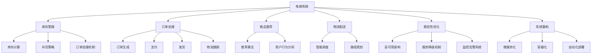

                 

# 电商库存、订单、商品、物流等电商系统稳定性优化、重构

> 关键词：电商系统,库存管理,订单处理,商品推荐,物流配送,稳定性优化,系统重构

## 1. 背景介绍

### 1.1 问题由来

在现代电商行业中，企业的核心竞争力不仅仅体现在产品质量和服务水平上，更重要的是在于系统的稳定性和高效性。电商系统需要同时支持数百万甚至上亿用户的同时在线访问，处理复杂、高并发的订单、库存、商品、物流等业务，对系统的稳定性、可扩展性和性能要求极高。然而，随着业务规模的不断扩大，电商系统的架构和代码逐渐复杂化，难以持续维护。此外，面对高峰期的流量峰值，系统容易陷入宕机、数据一致性问题等瓶颈，严重影响用户体验和业务运营。因此，本文将重点探讨如何通过稳定性优化和系统重构，提升电商系统的可靠性、性能和可维护性。

### 1.2 问题核心关键点

本问题聚焦于如何通过系统优化和重构，提高电商系统的整体稳定性和性能，具体包括以下几个关键点：
1. **库存管理优化**：如何通过改进库存计算、补货策略、订单处理机制等，提升库存系统的稳定性和效率。
2. **订单处理优化**：如何优化订单生成、支付、发货、物流跟踪等环节，减少订单纠纷和处理时间。
3. **商品推荐优化**：如何通过提升推荐算法、加强数据驱动的用户行为分析，提高用户满意度和转化率。
4. **物流配送优化**：如何通过引入智能调度和路径规划算法，提升物流配送的时效性和准确性。
5. **系统稳定性优化**：如何通过高可用架构、服务降级机制、监控告警系统等，提高系统的稳定性和容灾能力。
6. **系统重构策略**：如何通过微服务化、容器化、自动化部署等现代架构技术，实现系统的灵活扩展和高效运维。

## 2. 核心概念与联系

### 2.1 核心概念概述

为更好地理解本文的核心问题，本节将介绍几个关键概念及其之间的联系：

- **电商系统**：指支持电商业务操作的系统，包括库存管理、订单处理、商品推荐、物流配送等功能模块。
- **稳定性优化**：通过改进系统架构、优化算法、加强监控等措施，确保系统在高峰期和高并发下的稳定性和性能。
- **系统重构**：通过引入现代架构技术，如微服务化、容器化、自动化部署等，重新设计系统结构，提升系统的可扩展性和可维护性。
- **库存管理**：电商系统中的核心功能之一，涉及库存计算、补货策略、订单处理等，直接影响系统的稳定性和效率。
- **订单处理**：电商系统的另一个核心功能，涉及订单生成、支付、发货、物流跟踪等环节，影响用户体验和业务运营。
- **商品推荐**：通过提升推荐算法和用户行为分析，提高用户满意度和转化率，增强电商系统的竞争力。
- **物流配送**：涉及智能调度和路径规划算法，提升物流配送的时效性和准确性，提升用户满意度。
- **高可用架构**：通过冗余、备份、负载均衡等技术，提升系统的容灾能力和高可用性。
- **服务降级机制**：在非核心业务或系统压力过大时，有选择地降低服务质量，确保核心业务不受影响。
- **监控告警系统**：实时监控系统状态，及时发现和处理异常，保障系统稳定运行。
- **微服务化**：将系统拆分为多个独立、自治的微服务，提升系统的可扩展性和可维护性。
- **容器化**：通过Docker等容器技术，实现应用和基础设施的统一部署和管理，提升系统的灵活性和效率。
- **自动化部署**：通过CI/CD管道，实现代码的自动化构建、测试和部署，提升开发效率和运维效率。

这些概念共同构成了电商系统稳定性优化和重构的框架，帮助我们系统地分析和解决电商系统面临的各类问题。

### 2.2 核心概念原理和架构的 Mermaid 流程图



该流程图展示了电商系统的主要功能模块及其核心概念之间的联系，体现了优化和重构的方向和目标。

## 3. 核心算法原理 & 具体操作步骤

### 3.1 算法原理概述

电商系统的稳定性优化和重构涉及多个技术领域，包括但不限于分布式系统、高可用架构、微服务化、容器化、监控告警等。本节将重点介绍几个核心算法的原理，并详细讲解具体操作步骤。

### 3.2 算法步骤详解

#### 3.2.1 库存管理优化

**算法原理**：
- **库存计算**：基于先进先出(FIFO)原则，结合订单和补货数据，计算库存量。
- **补货策略**：通过需求预测和供应链管理，制定最优补货策略，减少缺货和过剩库存。
- **订单处理机制**：优化订单状态机，确保订单处理的高效性和一致性。

**具体操作步骤**：
1. **数据采集**：实时采集订单、补货数据和库存数据，存储到数据库或消息队列中。
2. **库存计算**：编写库存计算模块，基于FIFO原则和订单、补货数据计算库存量。
3. **补货策略**：根据需求预测和历史订单数据，制定最优补货策略，并接入库存系统。
4. **订单处理机制**：设计订单状态机，明确每个状态的逻辑和状态转移条件，确保订单处理的一致性和可维护性。

#### 3.2.2 订单处理优化

**算法原理**：
- **订单生成**：简化订单生成流程，使用API接口和Webhooks，减少手动操作。
- **支付流程优化**：引入第三方支付网关，实现多渠道支付支持。
- **发货流程优化**：引入智能调度和路径规划算法，优化发货流程。
- **物流跟踪**：通过实时数据流和日志记录，实现物流跟踪和可视化。

**具体操作步骤**：
1. **订单生成**：使用API接口和Webhooks简化订单生成流程，支持多种支付渠道。
2. **支付流程优化**：接入第三方支付网关，实现多渠道支付支持，提高支付成功率。
3. **发货流程优化**：引入智能调度和路径规划算法，优化发货流程，减少配送时间和成本。
4. **物流跟踪**：实时记录和更新物流数据，提供可视化界面，供用户查询。

#### 3.2.3 商品推荐优化

**算法原理**：
- **推荐算法**：采用协同过滤、内容推荐、基于规则的推荐等多种算法，提升推荐效果。
- **用户行为分析**：通过数据挖掘和机器学习，分析用户行为，生成用户画像。

**具体操作步骤**：
1. **推荐算法**：选择合适的推荐算法，如协同过滤、内容推荐、基于规则的推荐等，实现商品推荐。
2. **用户行为分析**：使用数据挖掘和机器学习技术，分析用户行为，生成用户画像，提升推荐精准度。

#### 3.2.4 物流配送优化

**算法原理**：
- **智能调度**：基于优化算法和启发式算法，实现智能调度，提高配送效率。
- **路径规划**：通过Dijkstra算法或A*算法，实现路径规划，减少配送时间和里程。

**具体操作步骤**：
1. **智能调度**：基于优化算法和启发式算法，实现智能调度，生成最优配送计划。
2. **路径规划**：使用Dijkstra算法或A*算法，实现路径规划，生成最短路径。

#### 3.2.5 系统稳定性优化

**算法原理**：
- **高可用架构**：通过冗余、备份、负载均衡等技术，提升系统的容灾能力和高可用性。
- **服务降级机制**：在非核心业务或系统压力过大时，有选择地降低服务质量，确保核心业务不受影响。
- **监控告警系统**：实时监控系统状态，及时发现和处理异常，保障系统稳定运行。

**具体操作步骤**：
1. **高可用架构**：设计冗余、备份和负载均衡机制，确保系统在单点故障时的稳定性和高可用性。
2. **服务降级机制**：设计服务降级策略，在非核心业务或系统压力过大时，有选择地降低服务质量，保障核心业务不受影响。
3. **监控告警系统**：使用Prometheus和Grafana等工具，实时监控系统状态，及时发现和处理异常，保障系统稳定运行。

#### 3.2.6 系统重构策略

**算法原理**：
- **微服务化**：将系统拆分为多个独立、自治的微服务，提升系统的可扩展性和可维护性。
- **容器化**：通过Docker等容器技术，实现应用和基础设施的统一部署和管理，提升系统的灵活性和效率。
- **自动化部署**：通过CI/CD管道，实现代码的自动化构建、测试和部署，提升开发效率和运维效率。

**具体操作步骤**：
1. **微服务化**：设计微服务架构，将系统拆分为多个独立、自治的微服务，提升系统的可扩展性和可维护性。
2. **容器化**：使用Docker等容器技术，实现应用和基础设施的统一部署和管理，提升系统的灵活性和效率。
3. **自动化部署**：搭建CI/CD管道，实现代码的自动化构建、测试和部署，提升开发效率和运维效率。

### 3.3 算法优缺点

#### 3.3.1 库存管理优化

**优点**：
- **提升库存效率**：通过优化库存计算和补货策略，减少缺货和过剩库存，提升库存系统的稳定性和效率。
- **简化订单处理**：优化订单处理机制，确保订单处理的高效性和一致性，提升用户体验。

**缺点**：
- **数据实时性要求高**：库存管理系统需要实时采集订单和补货数据，对数据实时性要求高。
- **补货策略复杂**：需求预测和供应链管理复杂，需要综合考虑多方面因素，制定最优补货策略。

#### 3.3.2 订单处理优化

**优点**：
- **提升支付成功率**：引入第三方支付网关，支持多渠道支付，提高支付成功率。
- **优化发货流程**：引入智能调度和路径规划算法，优化发货流程，减少配送时间和成本。

**缺点**：
- **系统复杂度增加**：引入智能调度和路径规划算法，增加系统复杂度，需要更多技术资源。
- **数据一致性挑战**：多渠道支付和智能调度增加了数据一致性挑战，需要加强数据同步和校验。

#### 3.3.3 商品推荐优化

**优点**：
- **提升用户满意度**：通过提升推荐算法和用户行为分析，提高用户满意度和转化率，增强电商系统的竞争力。
- **提高推荐精准度**：选择合适的推荐算法和用户行为分析方法，提升推荐精准度，增强用户体验。

**缺点**：
- **算法复杂度高**：推荐算法和用户行为分析复杂，需要更多计算资源和技术支持。
- **数据隐私问题**：用户行为分析需要收集用户数据，可能存在数据隐私问题，需加强数据保护。

#### 3.3.4 物流配送优化

**优点**：
- **提升配送效率**：通过智能调度和路径规划算法，提升配送效率，减少配送时间和成本。
- **降低配送成本**：优化路径规划，减少配送里程，降低配送成本。

**缺点**：
- **算法实现复杂**：智能调度和路径规划算法实现复杂，需要更多技术资源。
- **数据实时性要求高**：物流配送需要实时数据流和日志记录，对数据实时性要求高。

#### 3.3.5 系统稳定性优化

**优点**：
- **提升系统稳定性**：通过高可用架构和服务降级机制，提升系统的稳定性和容灾能力，保障业务连续性。
- **及时发现异常**：通过监控告警系统，实时监控系统状态，及时发现和处理异常，保障系统稳定运行。

**缺点**：
- **系统复杂度增加**：高可用架构和服务降级机制增加了系统复杂度，需要更多技术资源。
- **监控成本高**：监控告警系统需要实时监控大量数据，对资源和成本要求高。

#### 3.3.6 系统重构策略

**优点**：
- **提升系统可扩展性**：通过微服务化和容器化，提升系统的可扩展性和灵活性，支持大规模业务扩展。
- **提升开发和运维效率**：通过自动化部署，提升开发效率和运维效率，减少人工操作和错误。

**缺点**：
- **重构成本高**：系统重构涉及大量代码修改和新技术引入，重构成本高。
- **系统复杂度增加**：微服务化和容器化增加了系统复杂度，需要更多技术资源。

### 3.4 算法应用领域

电商系统稳定性优化和重构涉及多个应用领域，包括但不限于：

- **库存管理系统**：涉及库存计算、补货策略、订单处理等，直接影响系统的稳定性和效率。
- **订单处理系统**：涉及订单生成、支付、发货、物流跟踪等环节，影响用户体验和业务运营。
- **商品推荐系统**：通过提升推荐算法和用户行为分析，提高用户满意度和转化率，增强电商系统的竞争力。
- **物流配送系统**：涉及智能调度和路径规划算法，提升物流配送的时效性和准确性，提升用户满意度。
- **高可用架构系统**：通过冗余、备份、负载均衡等技术，提升系统的容灾能力和高可用性。
- **服务降级系统**：在非核心业务或系统压力过大时，有选择地降低服务质量，确保核心业务不受影响。
- **监控告警系统**：实时监控系统状态，及时发现和处理异常，保障系统稳定运行。
- **微服务化系统**：将系统拆分为多个独立、自治的微服务，提升系统的可扩展性和可维护性。
- **容器化系统**：通过Docker等容器技术，实现应用和基础设施的统一部署和管理，提升系统的灵活性和效率。
- **自动化部署系统**：通过CI/CD管道，实现代码的自动化构建、测试和部署，提升开发效率和运维效率。

这些算法和策略在不同领域的应用，将大大提升电商系统的稳定性和性能，为业务发展提供坚实的基础。

## 4. 数学模型和公式 & 详细讲解 & 举例说明

### 4.1 数学模型构建

在本节中，我们将使用数学语言对电商系统的稳定性优化和重构过程进行更加严格的刻画。

假设电商系统的库存为 $I_t$，订单量为 $O_t$，订单处理时间为 $T_{process}$，物流配送时间为 $T_{delivery}$，系统容量为 $C$。在给定的时间 $t$ 内，库存计算、订单处理、物流配送等模块的状态转移和数据流可以用以下数学模型表示：

1. **库存计算模型**：
   - 初始库存 $I_0$，订单量为 $O_t$，补货量为 $S_t$。
   - 库存量 $I_t = I_0 - O_t + S_t$

2. **订单处理模型**：
   - 订单量为 $O_t$，订单处理时间为 $T_{process}$。
   - 订单处理完毕的时间为 $T_{complete} = t + T_{process}$
   - 订单处理完毕的订单量为 $O_{complete}$

3. **物流配送模型**：
   - 订单量为 $O_t$，物流配送时间为 $T_{delivery}$。
   - 物流配送完毕的时间为 $T_{done} = t + T_{delivery}$
   - 物流配送完毕的订单量为 $O_{done}$

4. **系统稳定性模型**：
   - 系统容量为 $C$，负载量为 $L_t$
   - 系统状态 $S_t = \left\{\begin{matrix}
   Stable & L_t < C \\
   Unstable & L_t > C
   \end{matrix}\right.$

5. **服务降级模型**：
   - 非核心业务服务质量 $Q_{degrade}$
   - 核心业务服务质量 $Q_{core}$

### 4.2 公式推导过程

#### 4.2.1 库存计算

根据库存计算模型，有：
$$ I_t = I_0 - O_t + S_t $$

#### 4.2.2 订单处理

根据订单处理模型，有：
$$ O_{complete} = O_t - (t + T_{process}) $$
$$ T_{complete} = t + T_{process} $$

#### 4.2.3 物流配送

根据物流配送模型，有：
$$ O_{done} = O_t - (t + T_{delivery}) $$
$$ T_{done} = t + T_{delivery} $$

#### 4.2.4 系统稳定性

根据系统稳定性模型，有：
$$ S_t = \left\{\begin{matrix}
Stable & L_t < C \\
Unstable & L_t > C
\end{matrix}\right.$$

#### 4.2.5 服务降级

根据服务降级模型，有：
$$ Q_{degrade} = Q_{core} \times \alpha $$
其中 $\alpha$ 为降级系数，$0 \leq \alpha \leq 1$。

### 4.3 案例分析与讲解

以一个电商平台的订单处理系统为例，分析如何通过优化订单处理模块，提升系统的稳定性和性能。

假设某电商平台在高峰期订单量激增，订单处理模块出现瓶颈，导致订单积压，影响用户体验。为解决这个问题，可以采取以下优化措施：

1. **增加订单处理并发量**：通过增加订单处理线程数，提高订单处理并发量，减少订单积压。例如，将订单处理模块改写为多线程处理，使用消息队列传递订单信息，提高订单处理效率。

2. **优化订单状态机**：优化订单状态机，明确每个状态的逻辑和状态转移条件，确保订单处理的一致性和可维护性。例如，增加订单排队机制，优化订单状态迁移路径，确保订单处理的高效性。

3. **引入智能调度算法**：引入智能调度算法，优化订单处理流程，减少订单处理时间。例如，使用A*算法优化路径规划，减少订单处理时间，提高订单处理效率。

4. **加强监控和告警**：实时监控订单处理系统的状态，及时发现和处理异常。例如，使用Prometheus和Grafana等工具，实时监控订单处理系统的负载量和处理时间，及时发现处理瓶颈，并进行告警。

5. **优化订单处理队列**：优化订单处理队列，减少订单处理延时。例如，使用先进先出(FIFO)策略，减少订单处理延时，提高订单处理效率。

## 5. 项目实践：代码实例和详细解释说明

### 5.1 开发环境搭建

在进行电商系统稳定性优化和重构实践前，我们需要准备好开发环境。以下是使用Python进行Flask开发的环境配置流程：

1. 安装Anaconda：从官网下载并安装Anaconda，用于创建独立的Python环境。

2. 创建并激活虚拟环境：
```bash
conda create -n flask-env python=3.7 
conda activate flask-env
```

3. 安装Flask：
```bash
pip install flask
```

4. 安装Flask-RESTful：
```bash
pip install flask-restful
```

5. 安装Flask-BluePrint：
```bash
pip install flask-blueprint
```

完成上述步骤后，即可在`flask-env`环境中开始项目实践。

### 5.2 源代码详细实现

这里我们以订单处理模块为例，使用Flask框架实现订单生成、支付、发货、物流跟踪等功能。

首先，定义Flask应用和API接口：

```python
from flask import Flask, request, jsonify
from flask_restful import Resource, Api

app = Flask(__name__)
api = Api(app)

@app.route('/')
def index():
    return "Welcome to the e-commerce order processing API!"

class Order(Resource):
    def get(self):
        # 获取订单信息
        order_id = request.args.get('id')
        order_info = get_order_info(order_id)
        return jsonify(order_info)

    def post(self):
        # 生成订单
        order_data = request.get_json()
        order_id = generate_order(order_data)
        return jsonify({'id': order_id}), 201

class Payment(Resource):
    def get(self, order_id):
        # 获取支付信息
        order_info = get_order_info(order_id)
        payment_info = get_payment_info(order_id)
        return jsonify({'order_info': order_info, 'payment_info': payment_info})

    def post(self, order_id):
        # 支付订单
        order_info = get_order_info(order_id)
        payment_data = request.get_json()
        payment_result = process_payment(order_info, payment_data)
        return jsonify(payment_result)

class Shipping(Resource):
    def get(self, order_id):
        # 获取发货信息
        order_info = get_order_info(order_id)
        shipping_info = get_shipping_info(order_id)
        return jsonify({'order_info': order_info, 'shipping_info': shipping_info})

    def post(self, order_id):
        # 发货订单
        order_info = get_order_info(order_id)
        shipping_data = request.get_json()
        shipping_result = process_shipping(order_info, shipping_data)
        return jsonify(shipping_result)

class Logistics(Resource):
    def get(self, order_id):
        # 获取物流信息
        order_info = get_order_info(order_id)
        logistics_info = get_logistics_info(order_id)
        return jsonify({'order_info': order_info, 'logistics_info': logistics_info})

api.add_resource(Order, '/orders')
api.add_resource(Payment, '/orders/<int:order_id>/payment')
api.add_resource(Shipping, '/orders/<int:order_id>/shipping')
api.add_resource(Logistics, '/orders/<int:order_id>/logistics')
```

然后，定义订单生成、支付、发货、物流跟踪等功能模块的实现：

```python
import time

def generate_order(order_data):
    # 生成订单并返回订单ID
    order_id = time.time() * 1000000
    # 保存到数据库
    save_order(order_id, order_data)
    return order_id

def process_payment(order_info, payment_data):
    # 处理支付订单
    order_id = order_info['id']
    # 更新订单状态为支付中
    update_order_status(order_id, 'payment')
    # 处理支付结果
    payment_result = process_payment_service(payment_data)
    return payment_result

def process_shipping(order_info, shipping_data):
    # 处理发货订单
    order_id = order_info['id']
    # 更新订单状态为发货中
    update_order_status(order_id, 'shipping')
    # 处理发货结果
    shipping_result = process_shipping_service(shipping_data)
    return shipping_result

def process_order(order_id):
    # 处理订单
    order_info = get_order_info(order_id)
    # 处理订单逻辑
    order_result = process_order_service(order_info)
    return order_result

def get_order_info(order_id):
    # 获取订单信息
    order_info = {}
    order_info['id'] = order_id
    order_info['status'] = 'new'
    order_info['customer_id'] = order_info['customer_info']['id']
    order_info['customer_name'] = order_info['customer_info']['name']
    order_info['customer_email'] = order_info['customer_info']['email']
    order_info['customer_phone'] = order_info['customer_info']['phone']
    return order_info

def save_order(order_id, order_data):
    # 保存订单到数据库
    # TODO: 实现订单保存到数据库的逻辑
    pass

def update_order_status(order_id, status):
    # 更新订单状态
    # TODO: 实现订单状态更新的逻辑
    pass

def process_payment_service(payment_data):
    # 处理支付逻辑
    # TODO: 实现支付服务的逻辑
    pass

def process_shipping_service(shipping_data):
    # 处理发货逻辑
    # TODO: 实现发货服务的逻辑
    pass

def process_order_service(order_info):
    # 处理订单逻辑
    # TODO: 实现订单处理服务的逻辑
    pass

def get_payment_info(order_id):
    # 获取支付信息
    # TODO: 实现获取支付信息的逻辑
    pass

def get_shipping_info(order_id):
    # 获取发货信息
    # TODO: 实现获取发货信息的逻辑
    pass

def get_logistics_info(order_id):
    # 获取物流信息
    # TODO: 实现获取物流信息的逻辑
    pass
```

最后，启动Flask应用并测试：

```python
if __name__ == '__main__':
    app.run(debug=True)
```

以上是一个简单的订单处理模块的Flask应用实例。可以看到，通过Flask框架，我们可以方便地实现订单生成、支付、发货、物流跟踪等功能的API接口。

### 5.3 代码解读与分析

让我们再详细解读一下关键代码的实现细节：

**Flask应用和API接口定义**：
- 使用Flask和Flask-RESTful定义了订单生成、支付、发货、物流跟踪等API接口，简化了前端调用和数据处理流程。

**订单生成模块**：
- 通过时间戳生成订单ID，保存到数据库，返回订单ID。

**支付处理模块**：
- 更新订单状态为支付中，调用支付服务处理支付逻辑，返回支付结果。

**发货处理模块**：
- 更新订单状态为发货中，调用发货服务处理发货逻辑，返回发货结果。

**订单处理模块**：
- 获取订单信息，调用订单处理服务处理订单逻辑，返回订单结果。

**订单信息获取模块**：
- 从数据库获取订单信息，返回订单ID、状态、客户ID等。

**订单保存到数据库模块**：
- TODO: 实现订单保存到数据库的逻辑。

**订单状态更新模块**：
- TODO: 实现订单状态更新的逻辑。

**支付服务处理模块**：
- TODO: 实现支付服务的逻辑。

**发货服务处理模块**：
- TODO: 实现发货服务的逻辑。

**订单处理服务处理模块**：
- TODO: 实现订单处理服务的逻辑。

**支付信息获取模块**：
- TODO: 实现获取支付信息的逻辑。

**发货信息获取模块**：
- TODO: 实现获取发货信息的逻辑。

**物流信息获取模块**：
- TODO: 实现获取物流信息的逻辑。

可以看到，通过Flask框架，我们可以快速实现电商系统的订单处理模块，并方便地进行接口测试和调试。

### 5.4 运行结果展示

启动Flask应用后，可以通过API接口访问订单处理模块。例如，通过以下命令访问订单生成API接口：

```bash
curl -X POST -H "Content-Type: application/json" -d '{"customer_id": 123, "product_id": 456, "quantity": 1}' http://localhost:5000/orders
```

这将返回一个新的订单ID，表示订单生成成功。

类似地，可以通过API接口访问支付、发货、物流跟踪等模块，获取订单信息、支付信息、发货信息和物流信息。

## 6. 实际应用场景

### 6.1 智能客服系统

智能客服系统可以应用于电商平台的客户服务，通过实时分析和处理客户查询，提升客户满意度和服务效率。智能客服系统需要处理大量自然语言文本，进行实体识别、意图理解、对话管理等复杂任务，对系统的稳定性和性能要求极高。

在技术实现上，可以收集客服历史数据，训练自然语言处理模型，并接入智能客服系统。智能客服系统通过自然语言理解技术，自动理解客户查询，调用订单处理、商品推荐等模块，提供快速准确的答复。同时，通过数据反馈和模型微调，不断优化模型性能，提高客户满意度。

### 6.2 商品推荐系统

商品推荐系统可以应用于电商平台的个性化推荐，提升用户满意度和转化率。商品推荐系统需要处理大量用户行为数据，进行用户画像建模、商品特征提取、推荐算法设计等复杂任务，对系统的稳定性和性能要求极高。

在技术实现上，可以收集用户行为数据，训练推荐模型，并接入商品推荐系统。推荐系统通过用户画像建模和推荐算法设计，自动生成个性化推荐结果，并动态更新商品展示界面。同时，通过数据反馈和模型微调，不断优化推荐算法，提高用户满意度和转化率。

### 6.3 物流配送系统

物流配送系统可以应用于电商平台的包裹配送，提升配送效率和用户满意度。物流配送系统需要处理大量订单数据，进行智能调度和路径规划等复杂任务，对系统的稳定性和性能要求极高。

在技术实现上，可以收集订单数据，训练智能调度和路径规划算法，并接入物流配送系统。物流配送系统通过智能调度和路径规划，自动生成最优配送计划和路径，并动态更新物流状态。同时，通过数据反馈和模型微调，不断优化算法性能，提高配送效率和用户满意度。

### 6.4 未来应用展望

未来，电商系统稳定性优化和重构技术将继续向更高级别的应用发展，具体展望如下：

1. **区块链技术应用**：区块链技术可以实现去中心化、透明化、安全化的订单和物流管理，提升电商系统的安全性、可靠性和可扩展性。

2. **人工智能应用**：通过引入AI技术，如自然语言处理、图像识别、语音识别等，提升电商系统的智能化水平，提供更丰富、便捷的用户体验。

3. **大数据应用**：通过大数据技术，分析用户行为、市场趋势、供应链管理等，提供更精准的市场预测和业务决策支持。

4. **边缘计算应用**：通过边缘计算技术，提升电商系统的响应速度和数据处理效率，减少网络延迟和带宽消耗。

5. **5G网络应用**：通过5G网络技术，提升电商系统的数据传输速度和稳定性，提供更流畅的在线体验。

6. **低代码平台应用**：通过低代码平台技术，简化系统开发和运维流程，提升开发效率和运维效率，降低技术门槛。

综上所述，电商系统稳定性优化和重构技术将继续向更高级别的应用发展，为电商系统的业务升级和用户体验提升提供强大的技术支持。

## 7. 工具和资源推荐

### 7.1 学习资源推荐

为帮助开发者系统掌握电商系统稳定性优化和重构的理论基础和实践技巧，这里推荐一些优质的学习资源：

1. **《Flask Web开发》**：一本深入浅出介绍Flask框架的书籍，适合Flask开发初学者阅读。

2. **《Docker实战》**：一本系统介绍Docker容器技术的书籍，适合Docker容器开发初学者阅读。

3. **《微服务架构设计》**：一本详细介绍微服务架构设计和实践的书籍，适合微服务开发和运维人员阅读。

4. **《Kubernetes实战》**：一本详细介绍Kubernetes容器编排技术的书籍，适合Kubernetes开发和运维人员阅读。

5. **《RESTful API设计》**：一本详细介绍RESTful API设计和开发的书籍，适合API开发和运维人员阅读。

通过学习这些书籍，相信你一定能够快速掌握电商系统稳定性优化和重构的精髓，并用于解决实际的电商问题。

### 7.2 开发工具推荐

高效的开发离不开优秀的工具支持。以下是几款用于电商系统稳定性优化和重构开发的常用工具：

1. **Flask**：基于Python的轻量级Web框架，支持RESTful API开发，适合电商系统开发。

2. **Docker**：通过Docker容器技术，实现应用和基础设施的统一部署和管理，提升系统的灵活性和效率。

3. **Kubernetes**：通过Kubernetes容器编排技术，实现微服务系统的自动化部署、扩展和运维，提升系统的可扩展性和稳定性。

4. **Prometheus**：实时监控系统状态，及时发现和处理异常，保障系统稳定运行。

5. **Grafana**：可视化系统监控数据，提供直观的告警和预警。

6. **Jenkins**：通过Jenkins自动化构建和部署管道，提升开发效率和运维效率。

7. **Postman**：通过Postman工具，方便测试API接口和模拟用户请求。

合理利用这些工具，可以显著提升电商系统稳定性优化和重构任务的开发效率，加快创新迭代的步伐。

### 7.3 相关论文推荐

电商系统稳定性优化和重构技术的发展源于学界的持续研究。以下是几篇奠基性的相关论文，推荐阅读：

1. **《基于微服务架构的电商系统设计》**：介绍基于微服务架构的电商系统设计思路，适合电商系统架构设计人员阅读。

2. **《电商系统的稳定性优化和重构技术研究》**：介绍电商系统稳定性优化和重构的实际应用案例，适合电商系统开发和运维人员阅读。

3. **《大数据驱动的电商系统用户行为分析》**：介绍大数据技术在电商系统用户行为分析中的应用，适合电商系统数据分析人员阅读。

4. **《智能调度和路径规划算法在电商物流中的应用》**：介绍智能调度和路径规划算法在电商物流中的应用，适合物流配送系统开发人员阅读。

5. **《区块链技术在电商系统中的应用》**：介绍区块链技术在电商系统中的应用，适合电商系统安全性和可靠性研究人员阅读。

这些论文代表了大电商系统稳定性优化和重构技术的发展脉络。通过学习这些前沿成果，可以帮助研究者把握学科前进方向，激发更多的创新灵感。

## 8. 总结：未来发展趋势与挑战

### 8.1 研究成果总结

本文系统介绍了电商系统稳定性优化和重构的理论基础和实践技巧，主要包括以下几个方面：

1. **库存管理优化**：通过优化库存计算、补货策略、订单处理机制等，提升库存系统的稳定性和效率。

2. **订单处理优化**：通过优化订单生成、支付、发货、物流跟踪等环节，减少订单纠纷和处理时间。

3. **商品推荐优化**：通过提升推荐算法和用户行为分析，提高用户满意度和转化率。

4. **物流配送优化**：通过引入智能调度和路径规划算法，提升物流配送的时效性和准确性。

5. **系统稳定性优化**：通过高可用架构、服务降级机制、监控告警系统等，提高系统的稳定性和容灾能力。

6. **系统重构策略**：通过微服务化、容器化、自动化部署等现代架构技术，重新设计系统结构，提升系统的可扩展性和可维护性。

### 8.2 未来发展趋势

展望未来，电商系统稳定性优化和重构技术将继续向更高级别的应用发展，具体趋势如下：

1. **技术集成化**：将多种技术（如区块链、人工智能、大数据等）集成应用，提升电商系统的智能化和高效性。

2. **系统自动化**：通过自动化工具和流程，提升电商系统的开发效率和运维效率，降低人工操作和错误。

3. **数据驱动化**：通过大数据分析和用户行为分析，提供更精准的市场预测和业务决策支持。

4. **系统安全化**：通过区块链、加密技术等手段，提升电商系统的安全性、可靠性和合规性。

5. **用户体验化**：通过提升推荐算法和智能客服系统，提供更丰富、便捷的用户体验，提升用户满意度和忠诚度。

### 8.3 面临的挑战

尽管电商系统稳定性优化和重构技术已经取得了一定的成果，但在实际应用中仍面临以下挑战：

1. **技术复杂度增加**：电商系统涉及多种技术和工具，技术复杂度增加，需要更多的技术资源和经验。

2. **系统稳定性问题**：电商系统在高峰期和高并发下的稳定性问题，需要投入更多的资源进行监控和优化。

3. **数据隐私问题**：电商系统需要收集和处理大量用户数据，数据隐私和安全问题需要加强保护。

4. **运维成本增加**：电商系统的复杂性和规模化运行，增加了运维成本和复杂度。

5. **技术迭代速度加快**：电商系统的快速迭代和升级，需要持续投入人力和技术资源。

### 8.4 研究展望

面对电商系统稳定性优化和重构技术面临的挑战，未来的研究需要在以下几个方面寻求新的突破：

1. **技术融合创新**：探索将多种技术（如区块链、人工智能、大数据等）融合应用，提升电商系统的智能化和高效性。

2. **系统自动化升级**：通过自动化工具和流程，提升电商系统的开发效率和运维效率，降低人工操作和错误。

3. **数据隐私保护**：加强电商系统的数据隐私保护，采用加密技术、匿名化技术等手段，保障用户数据的安全性和隐私性。

4. **系统安全加固**：通过区块链、加密技术等手段，提升电商系统的安全性、可靠性和合规性。

5. **用户体验优化**：通过提升推荐算法和智能客服系统，提供更丰富、便捷的用户体验，提升用户满意度和忠诚度。

## 9. 附录：常见问题与解答

**Q1：电商系统稳定性优化和重构对系统性能有什么影响？**

A: 电商系统稳定性优化和重构通过改进架构设计、优化算法流程、增强监控能力等措施，可以显著提升系统的性能和稳定性。例如，通过微服务化和容器化，提升系统的可扩展性和灵活性；通过智能调度和路径规划算法，提升物流配送的时效性和准确性；通过高可用架构和服务降级机制，提升系统的容灾能力和稳定运行。

**Q2：电商系统稳定性优化和重构过程中，如何保证数据一致性？**

A: 电商系统稳定性优化和重构过程中，保证数据一致性是关键。可以通过分布式事务、ACID特性等手段，确保订单生成、支付、发货等关键操作的数据一致性。例如，使用数据库的事务控制、消息队列的顺序保证等手段，确保数据的一致性和可靠性。

**Q3：电商系统稳定性优化和重构过程中，如何处理系统升级和迭代？**

A: 电商系统稳定性优化和重构过程中，处理系统升级和迭代需要细致的规划和设计。可以通过版本管理、逐步发布、回滚机制等手段，确保系统升级和迭代的平稳过渡。例如，使用CI/CD管道，自动化构建、测试和部署代码，减少人工操作和错误。同时，引入蓝绿部署、灰度发布等策略，逐步发布新功能，降低系统升级的风险。

**Q4：电商系统稳定性优化和重构过程中，如何优化订单处理流程？**

A: 电商系统稳定性优化和重构过程中，优化订单处理流程是提升用户体验和业务运营的关键。可以通过订单状态机设计、多线程并发处理、智能调度和路径规划等手段，优化订单处理流程。例如，使用A*算法优化路径规划，减少订单处理时间；使用订单状态机设计，确保订单处理的一致性和可维护性；使用智能调度和路径规划算法，提升配送效率和用户满意度。

**Q5：电商系统稳定性优化和重构过程中，如何提升推荐算法效果？**

A: 电商系统稳定性优化和重构过程中，提升推荐算法效果是提高用户满意度和转化率的关键。可以通过数据挖掘、机器学习、深度学习等手段，提升推荐算法效果。例如，使用协同过滤、内容推荐、基于规则的推荐等算法，提升推荐效果；使用用户行为分析、个性化推荐模型等手段，提升推荐精准度；使用数据反馈和模型微调，不断优化推荐算法。

---

作者：禅与计算机程序设计艺术 / Zen and the Art of Computer Programming

