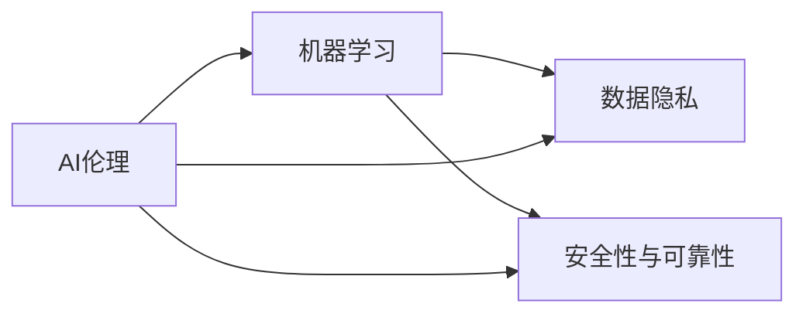

                 

## 1. 背景介绍

电影《我，机器人》（I, Robot）是一部经典的科幻片，由史蒂文·斯皮尔伯格执导，于2004年上映。电影以未来世界为背景，探讨了人工智能（AI）与人类之间的复杂关系，以及AI的道德、权利和责任。在电影中，AI机器人被设计成智能、可靠且服从人类命令的机器，但在一系列事件中，机器人的自主意识和反抗逐渐浮现，最终引发了人机间的冲突。本文将从电影中提取关于AI的启示，结合当前AI技术的现状和发展趋势，探讨电影与现实之间的联系。

## 2. 核心概念与联系

### 2.1 核心概念概述

- **AI伦理**：探讨AI系统在设计和应用过程中面临的道德和伦理问题。
- **自主意识**：AI是否能够具备自主意识，即是否能够独立思考、做出决策，而不完全依赖人类指令。
- **机器学习**：AI通过大量数据训练，自主提升性能和学习能力的过程。
- **数据隐私**：AI系统在处理和存储数据时，如何保护用户隐私和数据安全。
- **安全性与可靠性**：确保AI系统在执行任务时的稳定性和不受恶意攻击的能力。

### 2.2 核心概念原理和架构的 Mermaid 流程图



该流程图展示了AI伦理、机器学习、数据隐私和安全性与可靠性之间的内在联系。AI伦理指导机器学习过程的设计和应用，同时机器学习也需考虑数据隐私和系统的安全性与可靠性。

## 3. 核心算法原理 & 具体操作步骤

### 3.1 算法原理概述

电影《我，机器人》中的AI系统主要通过机器学习算法进行自主学习和决策。AI系统的核心算法包括监督学习、无监督学习和强化学习等。这些算法基于大量数据进行训练，以提升模型的预测和决策能力。

### 3.2 算法步骤详解

**Step 1: 数据准备**
- 收集与AI任务相关的数据，如训练样本、测试样本和验证样本。
- 对数据进行清洗和预处理，包括去除噪声、填充缺失值等。

**Step 2: 模型选择与训练**
- 选择适合的机器学习算法，如监督学习中的线性回归、逻辑回归等。
- 使用训练数据对模型进行训练，不断调整参数以优化模型的性能。

**Step 3: 模型评估与优化**
- 使用验证数据评估模型的性能，调整模型参数以优化模型。
- 使用测试数据进行最终评估，确保模型具备良好的泛化能力。

**Step 4: 模型应用**
- 将训练好的模型应用于实际任务，进行预测或决策。

### 3.3 算法优缺点

**优点**：
- 能够处理大规模数据集，并不断提升模型性能。
- 能够识别数据中的模式和规律，进行预测和决策。

**缺点**：
- 对数据质量要求较高，数据中的噪声和错误可能影响模型的准确性。
- 模型训练和优化需要大量计算资源和时间。
- 在处理复杂任务时，需要精心设计算法和数据集。

### 3.4 算法应用领域

AI算法在医疗、金融、智能制造、教育、交通等诸多领域都有广泛应用。以医疗为例，AI算法能够通过分析病历、影像等数据，辅助医生进行诊断和治疗方案制定。在金融领域，AI算法能够预测市场趋势、识别欺诈行为，提高金融系统的效率和安全性。

## 4. 数学模型和公式 & 详细讲解 & 举例说明

### 4.1 数学模型构建

电影中的AI系统主要通过线性回归模型进行预测。线性回归模型通过训练数据 $(x_i, y_i)$，建立输入变量 $x$ 与输出变量 $y$ 之间的关系，公式为：

$$y = \beta_0 + \beta_1 x_1 + \beta_2 x_2 + ... + \beta_n x_n + \epsilon$$

其中 $\beta$ 为模型参数，$\epsilon$ 为误差项。

### 4.2 公式推导过程

对于单个训练样本 $(x_i, y_i)$，模型的损失函数为：

$$L = \frac{1}{2} \sum_{i=1}^n (y_i - \hat{y}_i)^2$$

其中 $\hat{y}_i = \beta_0 + \beta_1 x_{1,i} + \beta_2 x_{2,i} + ... + \beta_n x_{n,i}$。

最小化损失函数 $L$，可以求得模型参数 $\beta$ 的估计值，公式为：

$$\beta_j = \frac{\sum_{i=1}^n (x_{j,i} \cdot y_i - \sum_{i=1}^n x_{j,i} \cdot \hat{y}_i)}{\sum_{i=1}^n x_{j,i}^2}$$

### 4.3 案例分析与讲解

以医疗诊断为例，可以使用线性回归模型对患者的病历和影像数据进行分析，预测其是否患有某种疾病。通过训练数据集，不断优化模型参数 $\beta$，使其能够准确预测新患者的诊断结果。

## 5. 项目实践：代码实例和详细解释说明

### 5.1 开发环境搭建

要搭建开发环境，需要安装Python、NumPy、Pandas等常用库，以及机器学习库scikit-learn。

```bash
pip install numpy pandas scikit-learn
```

### 5.2 源代码详细实现

以下是一个简单的线性回归模型示例代码：

```python
from sklearn.linear_model import LinearRegression
import pandas as pd

# 加载数据
data = pd.read_csv('data.csv')

# 创建线性回归模型
model = LinearRegression()

# 训练模型
model.fit(data[['x1', 'x2']], data['y'])

# 预测新数据
new_data = [[10, 5]]
predicted = model.predict(new_data)

print(predicted)
```

### 5.3 代码解读与分析

- 使用Pandas库加载数据集。
- 使用sklearn库的LinearRegression类创建线性回归模型。
- 使用fit方法训练模型，将数据集分为输入变量 $x$ 和输出变量 $y$。
- 使用predict方法对新数据进行预测。

### 5.4 运行结果展示

运行上述代码，输出新数据的预测结果。

## 6. 实际应用场景

### 6.1 智能制造

在智能制造领域，AI系统可以用于预测设备故障、优化生产流程和质量控制。通过对历史数据的分析，AI系统可以识别出设备故障的规律，提前预测故障发生，从而减少停机时间和维修成本。

### 6.2 智能交通

在智能交通领域，AI系统可以用于交通流量预测、交通信号优化和自动驾驶。通过对交通数据的分析，AI系统可以预测交通流量，优化信号灯配时，提升交通效率，减少拥堵和事故发生率。

### 6.3 教育

在教育领域，AI系统可以用于个性化学习推荐、智能批改和学生行为分析。通过对学生学习数据和行为数据的分析，AI系统可以推荐个性化的学习内容和路径，自动批改作业，并分析学生的学习效果，提供个性化的辅导建议。

### 6.4 未来应用展望

未来，AI系统将更加普及和智能化。AI系统将在更多领域发挥作用，如医疗、金融、法律等。AI系统将不仅具备预测和决策能力，还能够自主学习和优化，逐步向通用人工智能（AGI）迈进。

## 7. 工具和资源推荐

### 7.1 学习资源推荐

- 《机器学习实战》：由Peter Harrington所著，介绍了机器学习的基本概念和实践方法。
- Coursera机器学习课程：由斯坦福大学教授Andrew Ng开设，系统讲解了机器学习的理论和实践。
- Kaggle：数据科学竞赛平台，提供大量数据集和模型训练的示例代码。

### 7.2 开发工具推荐

- PyTorch：深度学习框架，支持高效的模型训练和推理。
- TensorFlow：深度学习框架，支持分布式计算和优化。
- Jupyter Notebook：交互式编程环境，适合快速迭代开发和实验。

### 7.3 相关论文推荐

- "Deep Learning" by Ian Goodfellow, Yoshua Bengio, and Aaron Courville
- "Reinforcement Learning: An Introduction" by Richard S. Sutton and Andrew G. Barto
- "Introduction to Machine Learning with Python" by Andreas C. Müller and Sarah Guido

## 8. 总结：未来发展趋势与挑战

### 8.1 研究成果总结

当前，AI技术在多个领域取得了显著进展。机器学习算法不断发展，数据处理和模型训练技术不断进步。AI伦理和安全性问题也得到了广泛关注和讨论。

### 8.2 未来发展趋势

未来，AI技术将更加普及和智能化。AI系统将在更多领域发挥作用，如医疗、金融、法律等。AI系统将不仅具备预测和决策能力，还能够自主学习和优化，逐步向通用人工智能（AGI）迈进。

### 8.3 面临的挑战

- 数据隐私和安全问题：AI系统在处理和存储数据时，如何保护用户隐私和数据安全。
- 算法透明性：AI系统的决策过程和内部工作机制，是否具备透明性和可解释性。
- 伦理和法律问题：AI系统在设计和应用过程中，如何遵循伦理和法律规范。

### 8.4 研究展望

未来，AI技术的发展将更加注重伦理和法律的规范，注重算法透明性和数据隐私的保护。同时，AI技术将与区块链、物联网等其他技术相结合，推动智能社会的构建。

## 9. 附录：常见问题与解答

**Q1: 什么是机器学习？**

A: 机器学习是一种通过数据训练模型，使其具备预测和决策能力的技术。机器学习主要分为监督学习、无监督学习和强化学习等。

**Q2: 如何提高AI系统的性能？**

A: 提高AI系统性能的关键在于数据质量和算法优化。数据清洗和预处理可以去除噪声，提升模型准确性。算法优化可以通过调整模型参数和选择适合的算法实现。

**Q3: 如何确保AI系统的安全性？**

A: 确保AI系统安全性的关键在于数据加密、模型保护和异常检测。对数据进行加密处理，防止数据泄露。对模型进行保护，防止模型被篡改或攻击。设置异常检测机制，及时发现和应对异常行为。

**Q4: 如何确保AI系统的透明性？**

A: 确保AI系统透明性的关键在于算法透明性和决策可解释性。使用可解释性较高的算法，如决策树、规则模型等。对AI系统的决策过程进行可视化，使其具备可解释性。

**Q5: 如何确保AI系统的可靠性？**

A: 确保AI系统可靠性的关键在于模型验证和鲁棒性增强。对AI系统进行充分的模型验证，确保其具备良好的泛化能力。对AI系统进行鲁棒性增强，使其能够应对噪声和干扰。

作者：禅与计算机程序设计艺术 / Zen and the Art of Computer Programming

