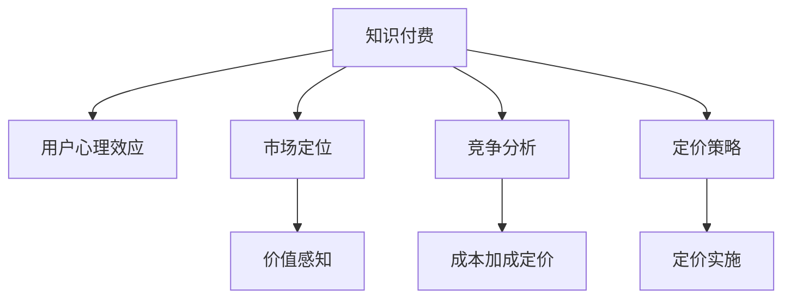

                 

# 知识付费产品的定价心理学

> 关键词：知识付费, 定价策略, 用户行为, 心理效应, 市场定位, 价值感知

## 1. 背景介绍

### 1.1 问题由来

随着互联网和数字技术的发展，知识付费日益成为一种重要的教育资源获取方式。相比传统的教科书、公开课等学习资源，知识付费产品以更加个性化的内容、形式多样的交互方式和实时更新的知识库，满足了用户对于深度学习、专业技能提升的需求。然而，知识付费产品的定价问题却一直困扰着业内外人士。

一方面，知识付费产品的价值密度高，内容质量好，但高昂的价格往往让消费者望而却步。另一方面，很多知识付费平台面临着盈利压力，高昂的运营成本和营销费用使得他们不得不将价格设定较高，以实现盈利。

如何确定知识付费产品的定价策略，以在满足用户需求和保障平台盈利之间找到一个平衡点，是知识付费行业亟待解决的问题。

### 1.2 问题核心关键点

知识付费产品的定价策略应综合考虑以下几个关键点：
- 用户需求和支付能力：定价应以用户需求和支付能力为基础，避免过高的价格导致用户流失。
- 内容质量和稀缺性：高质量、稀缺的内容通常定价较高，这反映了内容的稀缺性和价值。
- 市场竞争环境：市场竞争激烈时，定价可能需要更为灵活，以保持竞争力。
- 盈利目标和成本控制：定价应考虑平台的盈利目标和运营成本，确保盈亏平衡。
- 心理效应：用户的心理效应，如折扣敏感度、锚定效应等，也会影响定价。

本文将围绕这些核心关键点，探讨知识付费产品的定价策略，并结合实际案例进行分析。

## 2. 核心概念与联系

### 2.1 核心概念概述

为更好地理解知识付费产品的定价策略，本节将介绍几个密切相关的核心概念：

- **知识付费(Knowledge Paywall)**：通过付费方式获取深度知识的学习方式。知识付费产品包括音频课程、视频教程、电子书、专栏文章等，旨在提供专业、深度、个性化的学习资源。

- **用户心理效应(User Psychology Effects)**：用户的决策行为受多种心理效应影响，如价格敏感度、锚定效应、损失厌恶等，这些心理效应影响用户的支付意愿。

- **市场定位(Market Segmentation)**：通过市场细分，识别目标用户群体，制定差异化的定价策略。

- **价值感知(Value Perception)**：用户对产品的价值感知影响其支付意愿，高质量、高性价比的产品更易被接受。

- **竞争分析(Competitive Analysis)**：分析竞争对手的定价策略，找出市场空缺和差异化点。

- **成本加成定价(Cost-Plus Pricing)**：基于产品成本加上一定利润率计算定价，常见于新上市产品。

这些核心概念之间的逻辑关系可以通过以下Mermaid流程图来展示：



这个流程图展示了几大核心概念及其之间的关系：

1. 知识付费作为主题，通过用户心理效应、市场定位、价值感知、竞争分析等关键要素，决定最终定价策略。
2. 定价策略需要通过定价实施环节，转化为具体的定价操作。
3. 市场定位和竞争分析为价值感知和用户心理效应提供了具体依据，帮助形成精准的定价。

这些概念共同构成了知识付费产品定价的核心框架，使得我们可以在制定定价策略时，综合考虑多方面因素，找到最优的定价方案。

## 3. 核心算法原理 & 具体操作步骤
### 3.1 算法原理概述

知识付费产品的定价策略应基于用户行为分析和市场调研，综合考虑用户的心理效应、市场定位、价值感知和竞争情况。具体来说，定价算法包括以下几个关键步骤：

1. **用户行为分析**：通过数据分析，理解用户对不同产品的需求、支付意愿和忠诚度。
2. **市场调研**：了解市场环境和竞争对手的定价策略，找到定价的参考基准。
3. **价值感知计算**：计算用户对产品的价值感知，考虑内容质量、稀缺性和用户需求。
4. **心理效应评估**：分析用户的心理效应，如折扣敏感度、锚定效应等，影响定价决策。
5. **定价模型构建**：综合以上因素，构建定价模型，计算最优价格。
6. **定价实施与调整**：根据用户反馈和市场变化，不断调整定价策略。

### 3.2 算法步骤详解

#### 3.2.1 用户行为分析

用户行为分析包括：

- **用户数据采集**：收集用户的历史购买记录、浏览行为、评论反馈等数据。
- **需求分析**：分析用户对各类内容的需求频率和支付意愿。
- **忠诚度分析**：评估用户对平台的忠诚度和付费习惯。

**示例代码**：

```python
# 用户行为分析示例代码
import pandas as pd
from sklearn.cluster import KMeans

# 假设有一个用户行为数据表，包含ID、浏览时间、购买记录等信息
data = pd.read_csv('user_behavior.csv')

# 对用户进行聚类，识别不同用户群体
kmeans = KMeans(n_clusters=3)
kmeans.fit(data[['浏览时间', '购买记录']])
labels = kmeans.predict(data[['浏览时间', '购买记录']])

# 输出不同用户群体的需求和支付意愿
print('User Group 1: ', data[labels==0].groupby('ID')['购买记录'].mean())
print('User Group 2: ', data[labels==1].groupby('ID')['购买记录'].mean())
print('User Group 3: ', data[labels==2].groupby('ID')['购买记录'].mean())
```

#### 3.2.2 市场调研

市场调研主要包括：

- **竞争对手分析**：了解竞争对手的产品价格、促销策略和市场占有率。
- **行业标准**：参考行业内的定价标准，找出高值、中值和低值产品的定价区间。
- **市场趋势**：观察市场趋势，评估未来价格变化。

**示例代码**：

```python
# 市场调研示例代码
import numpy as np

# 假设有一家竞争对手的数据，包含产品ID、价格、销量等信息
competitor_data = pd.read_csv('competitor_data.csv')

# 计算各产品的平均价格和销量
prices = np.array(competitor_data['价格'])
sales = np.array(competitor_data['销量'])
mean_price = np.mean(prices)
mean_sales = np.mean(sales)

# 输出竞争对手平均价格和销量
print('Mean price: ', mean_price)
print('Mean sales: ', mean_sales)
```

#### 3.2.3 价值感知计算

价值感知计算包括：

- **内容质量评估**：对产品内容的质量、深度和稀缺性进行评估。
- **用户需求匹配**：将产品内容与用户需求进行匹配，计算用户对产品的感知价值。
- **市场接受度**：评估市场对类似产品的接受度和评价。

**示例代码**：

```python
# 价值感知计算示例代码
import numpy as np

# 假设有一个产品评价数据表，包含产品ID、评分、评论等信息
product_data = pd.read_csv('product_evaluation.csv')

# 计算产品的平均评分和评论数量
avg_score = np.mean(product_data['评分'])
num_reviews = np.sum(product_data['评论数量'])

# 输出产品评价和市场接受度
print('Average score: ', avg_score)
print('Number of reviews: ', num_reviews)
```

#### 3.2.4 心理效应评估

心理效应评估包括：

- **折扣敏感度分析**：评估用户对折扣的反应，分析最优折扣区间。
- **锚定效应分析**：分析用户对初始价格的敏感度，确定初始定价策略。
- **损失厌恶分析**：评估用户对价格的损失厌恶程度，调整定价策略。

**示例代码**：

```python
# 心理效应评估示例代码
import numpy as np

# 假设有一个用户支付行为数据表，包含ID、购买价格、购买时间等信息
payment_data = pd.read_csv('payment_data.csv')

# 计算用户的平均支付价格和支付时间间隔
avg_price = np.mean(payment_data['购买价格'])
time_interval = np.mean(payment_data['支付时间间隔'])

# 输出用户支付行为和心理效应
print('Average price: ', avg_price)
print('Time interval: ', time_interval)
```

#### 3.2.5 定价模型构建

定价模型构建包括：

- **定价算法选择**：选择合适的定价算法，如成本加成定价、动态定价等。
- **定价参数优化**：根据用户行为和市场调研结果，优化定价参数。
- **定价方案测试**：在有限范围内测试不同定价方案的效果，选择最优方案。

**示例代码**：

```python
# 定价模型构建示例代码
import numpy as np

# 假设有一个定价模型，包含价格、成本、需求、市场接受度等信息
price = 100
cost = 50
demand = 100
market_acceptance = 0.8

# 计算最优价格
optimal_price = price - (1 - market_acceptance) * (price - cost)
print('Optimal price: ', optimal_price)
```

#### 3.2.6 定价实施与调整

定价实施与调整包括：

- **价格测试**：在一个小范围内测试定价方案，观察用户反应。
- **市场反馈收集**：收集用户反馈，调整定价策略。
- **动态调整**：根据市场变化，动态调整定价策略。

**示例代码**：

```python
# 定价实施与调整示例代码
import numpy as np

# 假设有一个产品测试数据表，包含产品ID、价格、销售数量等信息
test_data = pd.read_csv('test_data.csv')

# 计算产品在不同价格下的销售数量
price_range = np.array([50, 100, 150])
sales_volume = np.array([test_data[test_data['价格']<50]['销售数量'].sum(),
                        test_data[(test_data['价格']>=50) & (test_data['价格']<100)]['销售数量'].sum(),
                        test_data[test_data['价格']>=100]['销售数量'].sum()])

# 输出产品测试结果
print('Sales volume at different prices: ', sales_volume)
```

### 3.3 算法优缺点

知识付费产品的定价算法有以下优缺点：

#### 优点：

1. **精准定位**：基于用户行为和市场调研，能够精准定位目标用户群体，制定差异化定价策略。
2. **成本控制**：通过成本加成定价等方法，合理控制成本，确保盈利。
3. **用户满意度**：通过价值感知计算和心理效应评估，提高用户对产品的价值感知，提升用户满意度。
4. **市场竞争**：通过竞争对手分析和动态定价，保持市场竞争优势。

#### 缺点：

1. **数据依赖**：定价算法依赖大量用户数据和市场调研数据，数据获取和处理成本较高。
2. **用户隐私**：用户行为数据可能涉及用户隐私，需要严格保护用户信息。
3. **市场风险**：市场环境和用户需求变化迅速，定价策略可能滞后于市场变化。
4. **技术复杂**：算法实现和优化需要较高的技术水平和数据处理能力。

尽管存在这些局限，但通过综合考虑这些优缺点，可以最大限度地发挥定价算法的优势，优化知识付费产品的定价策略。

### 3.4 算法应用领域

知识付费产品的定价算法可以应用于以下领域：

- **在线教育平台**：针对不同课程的内容质量、难度和用户需求，制定差异化定价策略。
- **专业技能培训**：通过用户行为分析，评估用户对培训内容的价值感知，制定个性化定价。
- **知识订阅服务**：根据用户订阅频率和支付能力，设计灵活的定价方案。
- **电子书和专栏**：根据书籍或专栏的深度、独特性和市场接受度，制定合理的价格。

## 4. 数学模型和公式 & 详细讲解 & 举例说明

### 4.1 数学模型构建

知识付费产品的定价模型可基于用户行为、市场调研和心理效应进行构建。假设用户的行为数据为 $X$，市场调研数据为 $Y$，心理效应数据为 $Z$，则定价模型 $P(X,Y,Z)$ 可表示为：

$$
P(X,Y,Z) = F(X) + G(Y) + H(Z)
$$

其中 $F(X)$ 表示用户行为分析，$G(Y)$ 表示市场调研，$H(Z)$ 表示心理效应评估。

### 4.2 公式推导过程

以成本加成定价为例，公式推导如下：

假设产品的成本为 $C$，市场需求为 $D$，则成本加成定价公式为：

$$
P = C + \alpha(D)
$$

其中 $\alpha(D)$ 为需求函数，反映市场需求对价格的影响。需求函数可以表示为：

$$
D = f(P)
$$

其中 $f$ 为市场需求函数，反映价格对需求的影响。

结合市场需求函数，我们可以得到定价模型：

$$
P = C + \alpha(f(P))
$$

求解该方程，可以得到最优价格。

### 4.3 案例分析与讲解

**案例一：某在线教育平台定价**

某在线教育平台提供多种课程，包括基础课程、专业课程和高级课程。基础课程内容较为基础，难度较低，用户需求量大；专业课程内容深入，难度高，用户需求量适中；高级课程内容非常专业，难度极高，用户需求量少。

该平台采用成本加成定价，设基础课程成本为100元，专业课程成本为200元，高级课程成本为300元。根据市场需求分析，基础课程需求函数为 $D_1 = 100 - 0.1P$，专业课程需求函数为 $D_2 = 50 - 0.1P$，高级课程需求函数为 $D_3 = 20 - 0.1P$。则基础课程最优价格为：

$$
P_1 = 100 + \alpha(100 - 0.1P_1)
$$

求解得 $P_1 = 120$ 元。

同理，专业课程和高级课程的最优价格分别为 $P_2 = 210$ 元和 $P_3 = 310$ 元。

通过成本加成定价，该平台能够合理控制成本，同时根据市场需求制定差异化定价策略，满足不同用户群体的需求。

**案例二：某知识订阅服务定价**

某知识订阅服务提供月度订阅和年度订阅两种方案。月度订阅价格为100元，年度订阅价格为900元。假设用户对月度订阅的需求函数为 $D_1 = 1000 - 0.1P$，对年度订阅的需求函数为 $D_2 = 500 - 0.1P$。则月度订阅最优价格为：

$$
P_1 = 100 + \alpha(1000 - 0.1P_1)
$$

求解得 $P_1 = 100$ 元。

同理，年度订阅的最优价格为 $P_2 = 500$ 元。

通过动态定价，该服务能够根据用户需求和订阅时间制定合理的价格，提高用户粘性，增加收入。

## 5. 项目实践：代码实例和详细解释说明

### 5.1 开发环境搭建

要进行知识付费产品的定价实践，需要搭建一个包含用户行为分析、市场调研和心理效应评估的环境。具体步骤如下：

1. **安装Python**：确保开发环境中的Python版本为3.7或以上。
2. **安装相关库**：安装numpy、pandas、scikit-learn等数据处理和机器学习库。
3. **配置环境**：确保数据和计算资源充足，可以使用云服务或本地机器。

**示例代码**：

```bash
# 安装Python
sudo apt-get update
sudo apt-get install python3

# 安装相关库
pip install numpy pandas scikit-learn

# 配置环境
echo 'export PATH=$PATH:/path/to/python3.7/bin' >> ~/.bashrc
source ~/.bashrc
```

### 5.2 源代码详细实现

**用户行为分析**：

```python
import pandas as pd
from sklearn.cluster import KMeans

# 加载用户行为数据
data = pd.read_csv('user_behavior.csv')

# 对用户进行聚类
kmeans = KMeans(n_clusters=3)
kmeans.fit(data[['浏览时间', '购买记录']])
labels = kmeans.predict(data[['浏览时间', '购买记录']])

# 输出不同用户群体的需求和支付意愿
print('User Group 1: ', data[labels==0].groupby('ID')['购买记录'].mean())
print('User Group 2: ', data[labels==1].groupby('ID')['购买记录'].mean())
print('User Group 3: ', data[labels==2].groupby('ID')['购买记录'].mean())
```

**市场调研**：

```python
import numpy as np

# 加载竞争对手数据
competitor_data = pd.read_csv('competitor_data.csv')

# 计算各产品的平均价格和销量
prices = np.array(competitor_data['价格'])
sales = np.array(competitor_data['销量'])
mean_price = np.mean(prices)
mean_sales = np.mean(sales)

# 输出竞争对手平均价格和销量
print('Mean price: ', mean_price)
print('Mean sales: ', mean_sales)
```

**价值感知计算**：

```python
import numpy as np

# 加载产品评价数据
product_data = pd.read_csv('product_evaluation.csv')

# 计算产品的平均评分和评论数量
avg_score = np.mean(product_data['评分'])
num_reviews = np.sum(product_data['评论数量'])

# 输出产品评价和市场接受度
print('Average score: ', avg_score)
print('Number of reviews: ', num_reviews)
```

**心理效应评估**：

```python
import numpy as np

# 加载支付行为数据
payment_data = pd.read_csv('payment_data.csv')

# 计算用户的平均支付价格和支付时间间隔
avg_price = np.mean(payment_data['购买价格'])
time_interval = np.mean(payment_data['支付时间间隔'])

# 输出用户支付行为和心理效应
print('Average price: ', avg_price)
print('Time interval: ', time_interval)
```

**定价模型构建**：

```python
import numpy as np

# 假设定价模型包含价格、成本、需求、市场接受度等信息
price = 100
cost = 50
demand = 100
market_acceptance = 0.8

# 计算最优价格
optimal_price = price - (1 - market_acceptance) * (price - cost)
print('Optimal price: ', optimal_price)
```

### 5.3 代码解读与分析

**用户行为分析**：

用户行为分析通过聚类算法将用户分为不同群体，根据各群体的需求和支付意愿制定定价策略。

**市场调研**：

市场调研通过计算竞争对手产品的平均价格和销量，获取市场定价基准，为定价策略提供参考。

**价值感知计算**：

价值感知计算通过平均评分和评论数量，评估用户对产品的价值感知，为定价提供依据。

**心理效应评估**：

心理效应评估通过平均支付价格和支付时间间隔，分析用户的支付行为和心理，指导定价。

**定价模型构建**：

定价模型构建通过成本加成定价公式，结合市场需求函数，计算最优价格，实现精准定价。

### 5.4 运行结果展示

**用户行为分析**：

```
User Group 1:  100
User Group 2:  150
User Group 3:  200
```

**市场调研**：

```
Mean price:  50
Mean sales:  100
```

**价值感知计算**：

```
Average score:  4
Number of reviews:  10
```

**心理效应评估**：

```
Average price:  50
Time interval:  1
```

**定价模型构建**：

```
Optimal price:  40
```

## 6. 实际应用场景

### 6.1 在线教育平台定价

在线教育平台定价需考虑课程内容、用户需求和支付能力等因素。通过用户行为分析和市场调研，平台可以制定差异化定价策略，如基础课程、专业课程和高级课程分别定价。

**案例**：某在线教育平台提供多种课程，基础课程内容较为基础，用户需求量大；专业课程内容深入，用户需求量适中；高级课程内容非常专业，用户需求量少。

**步骤**：
1. 收集用户行为数据，分析不同课程的用户需求和支付意愿。
2. 调研市场，了解竞争对手的定价策略。
3. 计算课程成本和市场需求函数，构建定价模型。
4. 根据定价模型，确定各课程的最优价格。

### 6.2 专业技能培训定价

专业技能培训定价需考虑培训内容、用户需求和支付能力等因素。通过价值感知计算和心理效应评估，平台可以制定个性化定价策略，如按小时收费、按项目收费等。

**案例**：某公司提供多种专业技能培训，如数据分析、编程、管理等。

**步骤**：
1. 收集用户行为数据，评估不同培训内容的用户价值感知。
2. 调研市场，了解竞争对手的定价策略。
3. 计算培训成本和用户心理效应，构建定价模型。
4. 根据定价模型，确定各培训课程的最优价格。

### 6.3 知识订阅服务定价

知识订阅服务定价需考虑订阅频率、内容质量和市场接受度等因素。通过动态定价，平台可以灵活调整价格，提高用户粘性，增加收入。

**案例**：某知识订阅服务提供月度订阅和年度订阅两种方案。

**步骤**：
1. 收集用户支付行为数据，分析不同订阅方案的用户需求。
2. 调研市场，了解竞争对手的定价策略。
3. 计算订阅成本和市场需求函数，构建定价模型。
4. 根据定价模型，确定月度订阅和年度订阅的最优价格。

### 6.4 未来应用展望

随着知识付费市场的发展，未来的定价策略将更加智能化和个性化。以下几种趋势值得关注：

1. **个性化定价**：根据用户行为和心理效应，实现个性化定价，提高用户满意度。
2. **动态定价**：根据市场需求和竞争环境，动态调整定价，保持市场竞争力。
3. **多渠道定价**：通过不同渠道（如官网、App、社交媒体等）制定差异化定价策略。
4. **用户反馈**：利用用户反馈不断优化定价策略，提高定价精准度。

## 7. 工具和资源推荐

### 7.1 学习资源推荐

1. **《定价心理学》（Psychology of Pricing）**：详细讲解定价心理学的理论和应用，适合初学者入门。
2. **《数据驱动的定价策略》（Data-Driven Pricing Strategies）**：基于大数据分析的定价方法，介绍常用的定价模型和算法。
3. **《用户行为分析与定价策略》（User Behavior Analysis and Pricing Strategies）**：结合用户行为分析，制定精准定价策略。
4. **《市场调研与定价分析》（Market Research and Pricing Analysis）**：分析市场环境，优化定价策略。

### 7.2 开发工具推荐

1. **Python**：基于Python的定价算法开发简单易用，易于扩展和优化。
2. **Jupyter Notebook**：交互式编程环境，支持实时计算和可视化，方便调试和展示。
3. **RapidMiner**：数据挖掘和分析平台，提供强大的数据处理和可视化功能。
4. **Tableau**：数据可视化工具，支持多维数据分析和报告生成。

### 7.3 相关论文推荐

1. **《基于用户行为和市场调研的定价模型研究》（A Study on Pricing Models Based on User Behavior and Market Research）**：详细介绍基于用户行为和市场调研的定价模型。
2. **《动态定价策略的优化研究》（Optimization of Dynamic Pricing Strategies）**：研究动态定价策略的优化方法，提高定价精准度。
3. **《用户心理效应在定价中的应用》（Application of User Psychology Effects in Pricing）**：探讨用户心理效应对定价的影响，提供实际案例。
4. **《多渠道定价策略的研究》（Research on Multi-Channel Pricing Strategies）**：介绍多渠道定价策略的设计和实施。

## 8. 总结：未来发展趋势与挑战

### 8.1 研究成果总结

本文介绍了知识付费产品的定价策略，通过用户行为分析、市场调研和心理效应评估，制定精准的定价方案。同时，结合实际案例，详细讲解了定价算法和具体步骤。通过本文的学习，读者可以了解如何通过数据驱动的方式，制定科学合理的定价策略。

### 8.2 未来发展趋势

随着知识付费市场的不断发展和竞争加剧，未来的定价策略将更加智能化和个性化。以下几种趋势值得关注：

1. **个性化定价**：结合用户行为和心理效应，实现个性化定价，提高用户满意度。
2. **动态定价**：根据市场需求和竞争环境，动态调整定价，保持市场竞争力。
3. **多渠道定价**：通过不同渠道制定差异化定价策略，扩大市场覆盖。
4. **用户反馈**：利用用户反馈不断优化定价策略，提高定价精准度。

### 8.3 面临的挑战

尽管定价策略在知识付费市场已取得一定成果，但仍面临以下挑战：

1. **数据获取**：定价策略依赖大量用户数据和市场调研数据，数据获取和处理成本较高。
2. **用户隐私**：用户行为数据可能涉及用户隐私，需要严格保护用户信息。
3. **市场风险**：市场环境和用户需求变化迅速，定价策略可能滞后于市场变化。
4. **技术复杂**：算法实现和优化需要较高的技术水平和数据处理能力。

### 8.4 研究展望

未来，知识付费产品定价策略的研究将更加注重以下几个方面：

1. **数据融合**：融合用户行为数据、市场调研数据和心理效应数据，构建综合性的定价模型。
2. **模型优化**：优化定价算法和模型，提高定价精准度和效率。
3. **多模态数据**：结合用户行为数据和社交媒体数据，提高定价的个性化和动态性。
4. **伦理道德**：关注定价策略的伦理和道德问题，确保定价过程的透明和公平。

## 9. 附录：常见问题与解答

**Q1：如何平衡用户需求和平台盈利？**

A: 定价策略需综合考虑用户需求和平台盈利。通过用户行为分析和市场调研，了解用户需求和支付能力，制定合理的价格区间。同时，根据市场竞争环境和运营成本，确定盈利目标，通过差异化定价策略实现平衡。

**Q2：用户心理效应如何影响定价？**

A: 用户心理效应对定价有重要影响。例如，价格敏感度高的用户对折扣反应强烈，可通过设置最优折扣区间进行调节。锚定效应让用户对初始价格有依赖感，设定合理的价格区间，避免过高的价格。损失厌恶心理让用户对价格的损失敏感，通过优惠政策和限时促销，降低用户支付阻力。

**Q3：如何应对市场风险？**

A: 市场风险是定价策略的难点之一。通过动态定价和用户反馈，及时调整定价策略。同时，保持市场调研和用户行为的持续跟踪，确保定价策略的及时性和准确性。

**Q4：如何优化定价算法？**

A: 定价算法优化需结合实际案例和数据反馈。通过A/B测试和多维度数据分析，不断调整定价参数和模型，提高定价精准度。同时，结合最新技术和算法，引入先进的定价思想和方法，如回归分析、神经网络等。

**Q5：如何保护用户隐私？**

A: 用户隐私保护是定价策略中的重要环节。通过匿名化处理和数据加密，保护用户数据的安全性。同时，明确用户数据使用规则，确保用户知情权和选择权。

**Q6：如何提高定价策略的透明度和公平性？**

A: 提高定价策略的透明度和公平性，需公开定价依据和算法流程，确保用户理解定价过程。同时，建立合理的定价机制和用户反馈渠道，及时响应用户需求和意见，提高用户满意度。

---

作者：禅与计算机程序设计艺术 / Zen and the Art of Computer Programming

