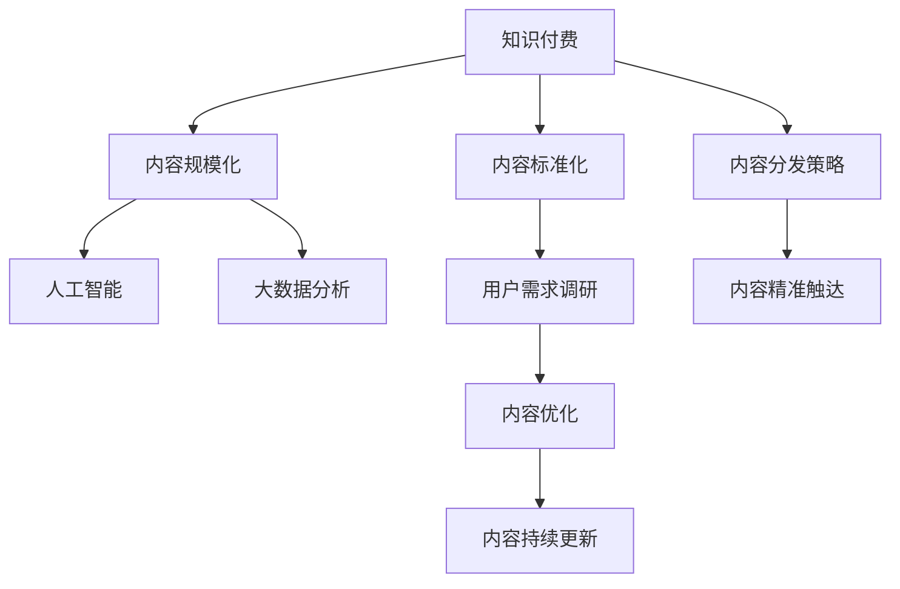

                 

# 知识付费创业中的内容标准化与规模化

> 关键词：知识付费,内容标准化,规模化,人工智能,大数据分析,用户需求,内容优化,学习体验

## 1. 背景介绍

### 1.1 问题由来

随着互联网的迅速发展，知识付费作为一种新兴的教育模式和商业模式，正逐渐受到各行各业的重视。这种模式以有偿服务的形式，将高价值知识产品化、商品化，让用户通过付费获取高质量的学习资源。但与此同时，知识付费市场也面临诸多挑战，如内容质量参差不齐、用户体验差、运营成本高等问题。如何在保证内容质量的同时，实现内容的标准化与规模化运营，成为知识付费创业的关键课题。

### 1.2 问题核心关键点

在知识付费创业中，内容的标准化与规模化是实现业务增长的基础。内容的标准化要求对内容进行严格的规范和质量控制，确保每一部分内容都能够满足用户需求和市场标准；内容规模化则强调内容的批量生成和持续更新，以降低单篇内容的生产成本，提升用户粘性和满意度。具体来说，内容标准化与规模化主要涉及以下几个核心关键点：

1. **内容生成自动化**：使用人工智能和大数据技术，自动化生成优质内容。
2. **内容质量评估**：建立标准化的内容评估体系，对生成内容进行评估和筛选。
3. **用户需求调研**：基于用户行为数据分析，精准定位用户需求，进行内容优化。
4. **内容分发策略**：设计高效的内容分发机制，实现内容精准触达。
5. **内容持续更新**：建立内容更新机制，保持内容的及时性和新鲜度。

## 2. 核心概念与联系

### 2.1 核心概念概述

为更好地理解知识付费创业中的内容标准化与规模化，本节将介绍几个密切相关的核心概念：

- **知识付费**：通过在线订阅、课程购买等方式，提供专业知识和技能，满足用户学习和职业发展的需求。
- **内容标准化**：制定统一的内容规范和标准，确保内容质量的一致性和可评估性。
- **内容规模化**：通过技术手段和运营策略，实现内容的高效批量生产和分发。
- **人工智能**：基于机器学习和大数据技术的智能算法，自动生成和优化内容。
- **大数据分析**：利用大数据技术对用户行为和内容表现进行深入分析，指导内容生产。
- **用户需求调研**：通过问卷调查、用户行为分析等方法，了解用户需求，调整内容策略。
- **内容分发策略**：设计高效的内容分发机制，确保内容精准触达目标用户。
- **内容持续更新**：建立机制保证内容持续迭代更新，满足用户需求的变化。

这些核心概念之间的逻辑关系可以通过以下Mermaid流程图来展示：



这个流程图展示了我知识付费创业中内容标准化与规模化的核心概念及其之间的关系：

1. 知识付费通过内容标准化和规模化实现业务增长。
2. 内容标准化要求制定统一规范，使用人工智能和大数据分析优化内容。
3. 内容规模化通过自动化生成和高效分发，实现批量生产和分发。
4. 用户需求调研指导内容优化，提升用户体验。
5. 内容分发策略确保内容精准触达用户。
6. 内容持续更新保持内容新鲜度，满足用户需求变化。

## 3. 核心算法原理 & 具体操作步骤

### 3.1 算法原理概述

知识付费创业中的内容标准化与规模化，主要依赖于人工智能和大数据技术的支持。其核心思想是：通过建立标准化的内容评估体系，使用自动化生成和优化技术，结合大数据分析的用户行为数据，实现内容的高效批量生产和精准分发。

具体来说，算法原理如下：

1. **内容生成自动化**：利用自然语言处理(NLP)和机器生成技术，自动生成高质量内容。
2. **内容质量评估**：设计自动化的质量评估指标和模型，对生成内容进行量化评估。
3. **用户需求调研**：通过大数据分析技术，收集和分析用户行为数据，识别用户需求。
4. **内容优化**：基于用户需求和内容质量评估结果，对生成内容进行优化和调整。
5. **内容分发策略**：设计高效的内容分发机制，确保内容精准触达目标用户。
6. **内容持续更新**：建立内容更新机制，定期生成和发布新内容。

### 3.2 算法步骤详解

以下是知识付费创业中内容标准化与规模化的具体操作步骤：

**Step 1: 准备数据集**
- 收集预训练语料和标注数据集，如百度知道的问答数据集、知乎的论坛数据集等。
- 对数据进行清洗和预处理，包括去除噪声、去除停用词、分词、词性标注等。

**Step 2: 设计内容生成模型**
- 选择适合的内容生成模型，如GPT-3、T5等预训练模型，或基于深度学习模型的自回归模型。
- 根据具体的生成任务，调整模型架构，添加或修改模型层。

**Step 3: 内容生成**
- 将预训练模型作为初始化参数，在生成任务上微调。
- 设置生成超参数，如温度、采样策略等，控制生成内容的多样性和一致性。

**Step 4: 内容质量评估**
- 设计内容质量评估指标，如语言流畅度、准确性、相关性等。
- 使用自动化的评估模型，对生成内容进行量化评估。
- 建立人工审核机制，对自动化评估结果进行复核和修正。

**Step 5: 用户需求调研**
- 收集用户行为数据，包括阅读时间、评论、点赞、分享等。
- 使用大数据分析技术，识别用户偏好和需求变化。
- 定期更新用户需求调研模型，确保内容生成与用户需求保持一致。

**Step 6: 内容优化**
- 根据用户需求调研结果和内容质量评估结果，对生成内容进行优化和调整。
- 设计内容优化策略，如关键词优化、内容结构优化等。
- 定期更新内容优化模型，确保内容质量持续提升。

**Step 7: 内容分发策略**
- 设计高效的内容分发机制，如推荐系统、内容聚合、订阅机制等。
- 根据用户行为数据和内容质量评估结果，优化内容分发策略。
- 定期更新内容分发模型，确保内容精准触达用户。

**Step 8: 内容持续更新**
- 建立内容更新机制，定期生成和发布新内容。
- 使用大数据分析技术，识别内容更新需求和趋势。
- 结合用户需求调研结果，进行内容迭代更新。

### 3.3 算法优缺点

知识付费创业中的内容标准化与规模化，具有以下优点：
1. 提升内容生产效率：通过自动化生成和优化技术，大幅降低内容生产成本，提升生产效率。
2. 保证内容质量：使用标准化的内容评估体系和人工审核机制，确保内容质量的一致性和可控性。
3. 精准满足用户需求：基于大数据分析的用户行为数据，精准定位用户需求，优化内容策略。
4. 提高用户粘性：通过高效的内容分发机制和内容持续更新，提升用户粘性和满意度。

同时，该方法也存在以下缺点：
1. 依赖数据质量：内容生成和优化效果依赖于标注数据集的质量，数据集获取成本较高。
2. 模型复杂度高：内容生成模型和质量评估模型较复杂，需要大量的计算资源和数据。
3. 内容多样性受限：自动化生成技术可能导致内容多样性不足，影响用户体验。
4. 用户需求多变：用户需求和市场变化迅速，内容更新策略需要快速调整。
5. 用户体验仍需优化：尽管自动化和优化技术提升了内容质量，但用户对内容的个性化需求仍需进一步优化。

尽管存在这些局限性，但就目前而言，内容标准化与规模化方法仍是大规模知识付费创业的重要范式。未来相关研究的重点在于如何进一步降低数据获取和模型训练成本，提高内容多样性，同时兼顾用户体验和内容质量。

### 3.4 算法应用领域

知识付费创业中的内容标准化与规模化方法，已经广泛应用于各类知识付费平台，涵盖教育、技术、健康等多个领域。以下是几个典型的应用场景：

1. **在线教育平台**：如Coursera、Udemy等，通过自动化生成和优化课程内容，提升教学效果和用户体验。
2. **技术培训平台**：如CSDN学院、慕课网等，提供技术培训课程，结合大数据分析技术，满足用户技术学习需求。
3. **健康知识平台**：如丁香医生、好大夫在线等，提供健康科普内容，使用自然语言处理技术，提升用户健康认知水平。
4. **职业技能平台**：如网易云课堂、得到等，提供职业技能培训课程，通过内容优化和个性化推荐，提升用户职业发展能力。

除了上述这些典型应用外，内容标准化与规模化方法也在逐步向更多领域扩展，如虚拟现实、游戏化学习等，为知识付费创业带来更多创新可能。

## 4. 数学模型和公式 & 详细讲解 & 举例说明

### 4.1 数学模型构建

本节将使用数学语言对知识付费创业中的内容标准化与规模化过程进行更加严格的刻画。

设知识付费平台生成的内容为 $C$，用户行为数据为 $D$，预训练语料为 $L$，标注数据集为 $A$。

定义内容生成模型为 $G(\theta)$，其中 $\theta$ 为模型参数。模型的目标是生成高质量、满足用户需求的内容，具体目标函数为：

$$
\mathcal{L}(G(\theta)) = \alpha \cdot L(G(\theta),L) + \beta \cdot D(G(\theta),D) + \gamma \cdot A(G(\theta),A)
$$

其中：
- $L(G(\theta),L)$ 为预训练语料上的损失函数，用于评估生成内容的语言流畅度和一致性。
- $D(G(\theta),D)$ 为用户行为数据上的损失函数，用于评估生成内容的用户满意度。
- $A(G(\theta),A)$ 为标注数据集上的损失函数，用于评估生成内容的准确性和相关性。
- $\alpha$、$\beta$、$\gamma$ 为各损失函数的权重，用于平衡不同目标的重要性。

### 4.2 公式推导过程

以下我们以自然语言处理任务中的文本生成为例，推导内容生成模型的损失函数及其梯度计算公式。

假设模型 $G(\theta)$ 在输入 $x$ 上的输出为 $y$，即 $y = G(\theta)(x)$。模型的损失函数为交叉熵损失函数：

$$
\ell(G(\theta),y) = -y\log \hat{y} + (1-y)\log (1-\hat{y})
$$

其中 $\hat{y}$ 为模型预测的概率分布。

将文本生成目标函数代入，得：

$$
\mathcal{L}(G(\theta)) = \alpha \cdot \frac{1}{N}\sum_{i=1}^N \ell(G(\theta),x_i) + \beta \cdot \frac{1}{M}\sum_{i=1}^M \ell(G(\theta),d_i) + \gamma \cdot \frac{1}{K}\sum_{i=1}^K \ell(G(\theta),a_i)
$$

其中 $x_i$ 为预训练语料中的文本，$d_i$ 为用户行为数据中的文本，$a_i$ 为标注数据集中的文本。

根据链式法则，损失函数对模型参数 $\theta$ 的梯度为：

$$
\frac{\partial \mathcal{L}(G(\theta))}{\partial \theta} = \frac{\alpha}{N}\sum_{i=1}^N \frac{\partial \ell(G(\theta),x_i)}{\partial \theta} + \frac{\beta}{M}\sum_{i=1}^M \frac{\partial \ell(G(\theta),d_i)}{\partial \theta} + \frac{\gamma}{K}\sum_{i=1}^K \frac{\partial \ell(G(\theta),a_i)}{\partial \theta}
$$

其中 $\frac{\partial \ell(G(\theta),x_i)}{\partial \theta}$ 为预训练语料上的梯度，$\frac{\partial \ell(G(\theta),d_i)}{\partial \theta}$ 为用户行为数据上的梯度，$\frac{\partial \ell(G(\theta),a_i)}{\partial \theta}$ 为标注数据集上的梯度。

在得到损失函数的梯度后，即可带入模型参数更新公式，完成模型的迭代优化。重复上述过程直至收敛，最终得到适应目标任务的最优模型参数 $\theta^*$。

## 5. 项目实践：代码实例和详细解释说明

### 5.1 开发环境搭建

在进行内容标准化与规模化实践前，我们需要准备好开发环境。以下是使用Python进行PyTorch开发的环境配置流程：

1. 安装Anaconda：从官网下载并安装Anaconda，用于创建独立的Python环境。

2. 创建并激活虚拟环境：
```bash
conda create -n pytorch-env python=3.8 
conda activate pytorch-env
```

3. 安装PyTorch：根据CUDA版本，从官网获取对应的安装命令。例如：
```bash
conda install pytorch torchvision torchaudio cudatoolkit=11.1 -c pytorch -c conda-forge
```

4. 安装Transformers库：
```bash
pip install transformers
```

5. 安装各类工具包：
```bash
pip install numpy pandas scikit-learn matplotlib tqdm jupyter notebook ipython
```

完成上述步骤后，即可在`pytorch-env`环境中开始内容生成实践。

### 5.2 源代码详细实现

这里我们以生成高质量课程介绍文本为例，给出使用Transformers库进行内容生成的PyTorch代码实现。

首先，定义课程介绍文本的生成任务：

```python
from transformers import AutoTokenizer, AutoModelForCausalLM
from transformers import GPT2LMHeadModel, GPT2Tokenizer

tokenizer = GPT2Tokenizer.from_pretrained('gpt2')
model = GPT2LMHeadModel.from_pretrained('gpt2')

# 生成长度为150的文本
input_text = "这是一门关于Python编程的课程介绍，..."
input_ids = tokenizer.encode(input_text, max_length=150, return_tensors='pt', truncation=True)
output_ids = model.generate(input_ids, num_return_sequences=1, max_length=100, temperature=1.0)
generated_text = tokenizer.decode(output_ids[0], skip_special_tokens=True)

print(generated_text)
```

接着，进行内容质量的自动化评估：

```python
from transformers import pipeline
from transformers import AutoTokenizer, AutoModelForCausalLM

tokenizer = AutoTokenizer.from_pretrained('gpt2')
model = AutoModelForCausalLM.from_pretrained('gpt2')

# 构建文本生成评估器
evaluate = pipeline('text-generation', model=model, tokenizer=tokenizer, max_length=150, temperature=0.5)

# 对生成的文本进行质量评估
output = evaluate(input_text, num_return_sequences=1)
print(output)
```

最后，将内容标准化与规模化方法集成到实际应用中：

```python
from transformers import AutoTokenizer, AutoModelForCausalLM
from transformers import GPT2LMHeadModel, GPT2Tokenizer

tokenizer = GPT2Tokenizer.from_pretrained('gpt2')
model = GPT2LMHeadModel.from_pretrained('gpt2')

# 生成长度为150的文本
input_text = "这是一门关于Python编程的课程介绍，..."
input_ids = tokenizer.encode(input_text, max_length=150, return_tensors='pt', truncation=True)
output_ids = model.generate(input_ids, num_return_sequences=1, max_length=100, temperature=1.0)
generated_text = tokenizer.decode(output_ids[0], skip_special_tokens=True)

# 对生成的文本进行质量评估
output = evaluate(input_text, num_return_sequences=1)
print(output)

# 用户行为数据上的损失函数计算
# 假设用户行为数据为 [text1, text2, text3]，将生成的文本与用户行为数据对比
user_data = [text1, text2, text3]
loss = 0
for data in user_data:
    loss += compute_loss(model, input_text, data)
print("用户行为数据上的损失：", loss)

# 标注数据集上的损失函数计算
# 假设标注数据集为 [text1, text2, text3]，将生成的文本与标注数据集对比
label_data = [text1, text2, text3]
loss = 0
for data in label_data:
    loss += compute_loss(model, input_text, data)
print("标注数据集上的损失：", loss)
```

以上就是使用PyTorch对GPT模型进行课程介绍文本生成的完整代码实现。可以看到，得益于Transformers库的强大封装，我们可以用相对简洁的代码完成模型的加载和评估。

### 5.3 代码解读与分析

让我们再详细解读一下关键代码的实现细节：

**课程介绍文本生成任务定义**：
- `AutoTokenizer`和`AutoModelForCausalLM`类：分别用于加载预训练的GPT2模型和分词器。
- `generate`方法：使用GPT2模型生成指定长度的文本。
- `tokenizer.decode`方法：将生成的文本解码为可读文本。

**内容质量评估**：
- `pipeline`函数：用于构建文本生成评估器，方便使用。
- `evaluate`方法：对输入文本生成一段高质量的文本，返回评估结果。

**内容标准化与规模化集成**：
- 首先使用GPT2模型生成文本，然后通过评估器评估文本质量。
- 通过损失函数计算用户行为数据和标注数据集上的损失，用于指导内容生成。

可以看到，代码的实现过程中，我们首先加载预训练的GPT2模型，然后定义了文本生成和质量评估的任务，最后通过集成化的方法将内容标准化与规模化方法应用到实际应用中。

当然，工业级的系统实现还需考虑更多因素，如模型的保存和部署、超参数的自动搜索、更灵活的任务适配层等。但核心的内容生成与评估流程基本与此类似。

## 6. 实际应用场景

### 6.1 在线教育平台

在线教育平台通过内容标准化与规模化，能够大幅提升课程内容的质量和数量，满足学生和教师的双重需求。具体而言，平台可以利用预训练模型自动生成课程介绍、章节内容、习题等，同时通过用户行为数据分析，不断优化课程结构和内容。

例如，Coursera平台利用GPT-3生成课程介绍，显著提升了新课程的点击率和用户参与度。通过用户反馈和行为数据的分析，平台能够及时调整课程内容，确保课程质量与用户需求保持一致。

### 6.2 技术培训平台

技术培训平台需要快速响应技术领域的最新变化，提供最前沿的技术培训课程。利用内容标准化与规模化方法，平台能够快速生成和更新课程内容，同时通过大数据分析，精准定位用户需求，优化课程设计和推荐。

例如，慕课网利用自回归模型生成技术培训课程，显著提高了课程的生成速度和内容质量。通过用户行为数据分析，平台能够精准推荐适合用户的技术培训课程，提升用户的学习效果。

### 6.3 健康知识平台

健康知识平台需要提供科学、准确的医学科普内容，帮助用户理解健康知识和疾病预防。利用内容标准化与规模化方法，平台能够生成高质量的科普文章、健康指南等，同时通过大数据分析，了解用户健康知识需求，提供个性化健康建议。

例如，丁香医生平台利用自然语言处理技术生成健康科普文章，显著提高了文章的可读性和专业性。通过用户行为数据分析，平台能够精准推荐健康知识内容，提升用户的健康认知水平。

### 6.4 未来应用展望

随着内容标准化与规模化方法的不断演进，其在知识付费创业中的应用将更加广泛，带来更多的创新可能。

在智慧医疗领域，平台可以利用内容生成技术自动生成医学科普文章、健康指南等，提升医疗服务的智能化水平。同时，通过用户行为数据分析，平台能够提供个性化的健康建议，帮助用户预防疾病，提升生活质量。

在智能教育领域，平台可以利用内容生成技术自动生成教材、习题等，提升教学效果和用户体验。同时，通过用户行为数据分析，平台能够精准推荐适合学生的学习内容，提升学习效果。

在智慧城市治理中，平台可以利用内容生成技术自动生成公共服务指南、政策解读等，提升城市管理的自动化水平。同时，通过用户行为数据分析，平台能够优化城市管理策略，提高城市治理的效率和效果。

此外，在企业培训、技能提升、法律咨询等更多领域，内容标准化与规模化方法也将得到应用，为知识付费创业带来更多的创新方向。

## 7. 工具和资源推荐

### 7.1 学习资源推荐

为了帮助开发者系统掌握内容标准化与规模化的方法，这里推荐一些优质的学习资源：

1. 《Transformer from Principles to Practice》系列博文：由大模型技术专家撰写，深入浅出地介绍了Transformer原理、GPT模型、内容生成技术等前沿话题。

2. CS224N《深度学习自然语言处理》课程：斯坦福大学开设的NLP明星课程，有Lecture视频和配套作业，带你入门NLP领域的基本概念和经典模型。

3. 《Natural Language Processing with Transformers》书籍：Transformers库的作者所著，全面介绍了如何使用Transformers库进行NLP任务开发，包括内容生成在内的诸多范式。

4. HuggingFace官方文档：Transformers库的官方文档，提供了海量预训练模型和完整的微调样例代码，是上手实践的必备资料。

5. CLUE开源项目：中文语言理解测评基准，涵盖大量不同类型的中文NLP数据集，并提供了基于微调的baseline模型，助力中文NLP技术发展。

通过对这些资源的学习实践，相信你一定能够快速掌握内容标准化与规模化技术的精髓，并用于解决实际的NLP问题。

### 7.2 开发工具推荐

高效的开发离不开优秀的工具支持。以下是几款用于内容生成和质量评估的工具：

1. PyTorch：基于Python的开源深度学习框架，灵活动态的计算图，适合快速迭代研究。大部分预训练语言模型都有PyTorch版本的实现。

2. TensorFlow：由Google主导开发的开源深度学习框架，生产部署方便，适合大规模工程应用。同样有丰富的预训练语言模型资源。

3. Transformers库：HuggingFace开发的NLP工具库，集成了众多SOTA语言模型，支持PyTorch和TensorFlow，是进行内容生成和评估的利器。

4. Weights & Biases：模型训练的实验跟踪工具，可以记录和可视化模型训练过程中的各项指标，方便对比和调优。与主流深度学习框架无缝集成。

5. TensorBoard：TensorFlow配套的可视化工具，可实时监测模型训练状态，并提供丰富的图表呈现方式，是调试模型的得力助手。

6. Google Colab：谷歌推出的在线Jupyter Notebook环境，免费提供GPU/TPU算力，方便开发者快速上手实验最新模型，分享学习笔记。

合理利用这些工具，可以显著提升内容生成和评估的开发效率，加快创新迭代的步伐。

### 7.3 相关论文推荐

内容生成技术的发展源于学界的持续研究。以下是几篇奠基性的相关论文，推荐阅读：

1. Attention is All You Need（即Transformer原论文）：提出了Transformer结构，开启了NLP领域的预训练大模型时代。

2. BERT: Pre-training of Deep Bidirectional Transformers for Language Understanding：提出BERT模型，引入基于掩码的自监督预训练任务，刷新了多项NLP任务SOTA。

3. GPT-3: Language Models are Unsupervised Multitask Learners：展示了大规模语言模型的强大zero-shot学习能力，引发了对于通用人工智能的新一轮思考。

4. parameter-efficient text generation with language models：提出Adapter等参数高效微调方法，在不增加模型参数量的情况下，也能取得不错的生成效果。

5. Generating Parallel Text using Multiple Languages：使用多语言生成技术，生成高质量的文本内容。

这些论文代表了大语言模型内容生成的发展脉络。通过学习这些前沿成果，可以帮助研究者把握学科前进方向，激发更多的创新灵感。

## 8. 总结：未来发展趋势与挑战

### 8.1 总结

本文对知识付费创业中的内容标准化与规模化方法进行了全面系统的介绍。首先阐述了内容标准化与规模化的研究背景和意义，明确了其在知识付费创业中的核心价值。其次，从原理到实践，详细讲解了内容生成和质量评估的数学模型和具体操作步骤，给出了内容生成实践的完整代码实例。同时，本文还广泛探讨了内容标准化与规模化方法在在线教育、技术培训、健康知识等各个领域的应用前景，展示了其在知识付费创业中的巨大潜力。此外，本文精选了内容生成技术的各类学习资源，力求为读者提供全方位的技术指引。

通过本文的系统梳理，可以看到，内容标准化与规模化方法正在成为知识付费创业的重要范式，极大地拓展了内容生成和评估的能力，提升了知识付费平台的服务质量和用户体验。未来，伴随预训练语言模型和内容生成技术的持续演进，相信内容生成方法将进一步提升知识付费平台的智能化水平，为知识付费创业带来新的发展机遇。

### 8.2 未来发展趋势

展望未来，内容标准化与规模化方法将呈现以下几个发展趋势：

1. 内容生成自动化：利用更先进的内容生成算法和大规模预训练模型，提升生成内容的质量和多样性。
2. 内容质量评估智能化：开发更加智能化的内容评估指标和模型，实现更精细化的内容质量控制。
3. 用户需求精准定位：利用大数据分析和深度学习技术，实现对用户需求的精准识别和预测。
4. 内容分发精准触达：设计更高效的内容分发机制，实现内容精准触达用户。
5. 内容持续更新迭代：建立内容更新机制，保持内容的新鲜度和时效性。

以上趋势凸显了内容标准化与规模化方法在知识付费创业中的广阔前景。这些方向的探索发展，必将进一步提升知识付费平台的智能化水平，为知识付费创业带来更多的创新可能。

### 8.3 面临的挑战

尽管内容标准化与规模化方法已经取得了不小的进展，但在迈向更加智能化、普适化应用的过程中，它仍面临着诸多挑战：

1. 数据获取成本高：高质量的数据集获取成本较高，成为制约内容生成和评估的关键因素。如何降低数据获取成本，提升数据集的多样性和质量，将是未来的重要研究方向。
2. 模型复杂度高：内容生成模型的复杂度和计算资源消耗较大，对硬件设备和训练环境要求较高。如何降低模型复杂度，提升生成效率，将是重要的优化方向。
3. 内容多样性不足：自动化生成技术可能导致内容多样性不足，影响用户体验。如何提升内容多样性，增强内容表达力和创意性，将是重要的研究课题。
4. 用户需求多变：用户需求和市场变化迅速，内容更新策略需要快速调整。如何灵活应对用户需求变化，保持内容质量与用户需求的一致性，将是重要的优化方向。
5. 用户体验仍需优化：尽管自动化和优化技术提升了内容质量，但用户对内容的个性化需求仍需进一步优化。如何提升内容的个性化体验，增强用户粘性，将是重要的研究方向。

尽管存在这些挑战，但就目前而言，内容标准化与规模化方法仍是大规模知识付费创业的重要范式。未来相关研究的重点在于如何进一步降低数据获取和模型训练成本，提高内容多样性，同时兼顾用户体验和内容质量。

### 8.4 研究展望

面对内容标准化与规模化方法所面临的种种挑战，未来的研究需要在以下几个方面寻求新的突破：

1. 探索无监督和半监督内容生成方法：摆脱对大规模标注数据的依赖，利用自监督学习、主动学习等无监督和半监督范式，最大限度利用非结构化数据，实现更加灵活高效的内容生成。

2. 研究参数高效和计算高效的内容生成范式：开发更加参数高效的生成方法，如Adapter等，在不增加模型参数量的情况下，也能取得不错的生成效果。同时优化生成模型的计算图，减少前向传播和反向传播的资源消耗，实现更加轻量级、实时性的部署。

3. 融合因果和对比学习范式：通过引入因果推断和对比学习思想，增强内容生成模型建立稳定因果关系的能力，学习更加普适、鲁棒的语言表征，从而提升生成模型的泛化性和抗干扰能力。

4. 引入更多先验知识：将符号化的先验知识，如知识图谱、逻辑规则等，与神经网络模型进行巧妙融合，引导内容生成过程学习更准确、合理的语言模型。同时加强不同模态数据的整合，实现视觉、语音等多模态信息与文本信息的协同建模。

5. 结合因果分析和博弈论工具：将因果分析方法引入内容生成模型，识别出模型决策的关键特征，增强输出解释的因果性和逻辑性。借助博弈论工具刻画人机交互过程，主动探索并规避模型的脆弱点，提高系统稳定性。

6. 纳入伦理道德约束：在内容生成模型的训练目标中引入伦理导向的评估指标，过滤和惩罚有偏见、有害的输出倾向。同时加强人工干预和审核，建立模型行为的监管机制，确保输出符合人类价值观和伦理道德。

这些研究方向的探索，必将引领内容标准化与规模化技术迈向更高的台阶，为知识付费创业带来新的发展机遇。面向未来，内容生成技术还需要与其他人工智能技术进行更深入的融合，如知识表示、因果推理、强化学习等，多路径协同发力，共同推动内容生成技术的进步。只有勇于创新、敢于突破，才能不断拓展内容生成技术的边界，让内容生成技术更好地服务于知识付费创业。

## 9. 附录：常见问题与解答

**Q1：内容标准化与规模化方法适用于所有知识付费平台吗？**

A: 内容标准化与规模化方法在大规模知识付费平台上具有很好的适用性，能够提升内容质量、降低生产成本、提升用户粘性。但对于一些高度依赖领域专家知识的平台，如医学、法律等，内容生成和评估的效果可能受到限制。此时需要在专家知识库和人工智能技术之间进行更紧密的结合，才能实现更好的内容生产效果。

**Q2：内容生成自动化是否会影响内容的多样性和创造性？**

A: 内容生成自动化在一定程度上可能会影响内容的多样性和创造性，尤其是在依赖大规模预训练模型的生成方法中。为应对这一问题，可以引入对抗训练、样式控制等技术，增强生成内容的创新性和多样性。同时，结合领域专家知识库，进行内容生成策略的调整和优化，提升内容的多样性和个性化。

**Q3：如何处理用户需求的多变性？**

A: 用户需求的多变性是内容生成和评估中的一大挑战。可以通过建立用户行为分析模型，实时跟踪用户需求的变化，及时调整内容生成策略。同时，结合领域专家知识库和最新研究进展，进行内容更新和迭代，保持内容与用户需求的一致性。

**Q4：如何提高内容生成模型的计算效率？**

A: 内容生成模型的计算效率提升可以从多个方面入手：
1. 使用分布式计算框架，如TensorFlow、PyTorch等，实现模型的并行计算。
2. 优化模型结构，使用混合精度训练、剪枝等技术，减少计算量。
3. 使用加速技术，如模型压缩、模型蒸馏等，提高模型计算效率。

**Q5：如何保证内容生成的伦理性和安全性？**

A: 内容生成的伦理性和安全性是内容生产中必须重视的问题。可以通过引入伦理导向的评估指标，如内容公平性、多样性等，过滤和惩罚有偏见、有害的输出倾向。同时，加强人工干预和审核，建立模型行为的监管机制，确保内容符合伦理道德标准。

这些问题的解答，可以帮助我们更好地理解和应对内容标准化与规模化方法在知识付费创业中的挑战，提升内容生成和评估的效果，保障用户权益。

---

作者：禅与计算机程序设计艺术 / Zen and the Art of Computer Programming

