                 

# 知识付费创业中的内容矩阵搭建

> 关键词：知识付费,内容矩阵,内容推荐,内容聚合,用户画像,内容价值最大化

## 1. 背景介绍

### 1.1 问题由来

近年来，知识付费产业在迅速崛起，无论是教育、金融、科技、娱乐等各个领域，都出现了大量专业付费课程、咨询服务等。在移动互联网、人工智能等技术的推动下，知识付费平台对内容资源的需求日益增加。内容资源的丰富性、质量、结构和组织方式，直接影响到平台的用户体验和收益，是知识付费平台发展的核心要素。

然而，随着内容数量和多样性的不断增加，如何有效地组织和管理内容，以满足用户个性化需求，成为知识付费平台亟待解决的问题。内容矩阵搭建成为构建知识付费平台的基础和关键。内容矩阵是指根据不同内容特征构建的多维矩阵，通过聚合和推荐，将优质的内容呈现在用户面前，提升用户粘性，增加收益。

### 1.2 问题核心关键点

内容矩阵搭建的核心关键点包括：

- 用户画像：理解用户的知识需求、兴趣偏好和学习习惯，是构建个性化推荐的基础。
- 内容价值评估：如何准确地评估内容的专业性、趣味性和实用性，是内容筛选的关键。
- 内容聚合：如何将类似的内容聚合起来，形成有组织、有结构的体系，便于用户快速查找和浏览。
- 用户行为分析：通过分析用户对内容的访问、评论、收藏等行为，调整内容推荐策略，提升用户体验和满意度。

这些关键点相互作用，共同构成内容矩阵搭建的框架，是知识付费平台成功的基石。

### 1.3 问题研究意义

搭建内容矩阵对于知识付费平台的成功具有重要意义：

1. 提升用户粘性：通过个性化推荐，让用户更频繁地使用平台，增加用户停留时间和访问频率。
2. 增加平台收益：优质的内容推荐能够提高用户订阅率，增加平台广告收入和课程销售量。
3. 提高内容价值：内容矩阵能够帮助平台快速发现和推广优质内容，提高内容资源的整体价值。
4. 促进用户学习：精准的内容推荐能够帮助用户更高效地学习新知识，提升学习效果。
5. 推动内容创新：内容矩阵的搭建能够促使内容创作者优化内容质量，提升内容的原创性和专业性。

## 2. 核心概念与联系

### 2.1 核心概念概述

构建内容矩阵的关键在于理解用户和内容的特性，并基于这些特性进行高效的内容聚合和推荐。本节将介绍几个核心概念：

- **用户画像(User Profile)**：描述用户的年龄、性别、职业、兴趣爱好、学习需求等特征，是进行个性化推荐的基础。
- **内容价值评估(Content Valuation)**：根据内容的权威性、新颖性、实用性、趣味性等因素，对内容进行量化评估，指导内容筛选和排序。
- **内容聚合(Content Aggregation)**：将相似的内容按照一定规则进行归类和组合，形成有组织、有结构的内容体系。
- **内容推荐(Content Recommendation)**：通过分析用户行为和内容特征，为用户提供个性化的内容推荐，提升用户满意度和平台收益。

这些概念之间存在紧密的联系，如图2所示：

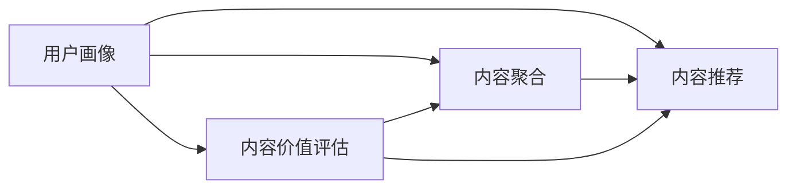

### 2.2 核心概念原理和架构的 Mermaid 流程图

构建内容矩阵的核心流程如图3所示：

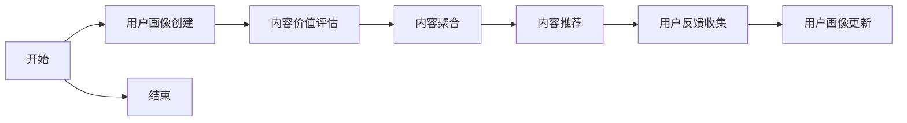

从用户画像创建开始，逐步进行内容价值评估、内容聚合、内容推荐和用户反馈收集，形成一个闭环的内容矩阵搭建流程。

## 3. 核心算法原理 & 具体操作步骤

### 3.1 算法原理概述

内容矩阵搭建的算法原理基于推荐系统中的协同过滤、基于内容的推荐和混合推荐等技术。具体流程如下：

1. **用户画像创建**：通过用户注册信息、行为数据、社交网络等来源，构建用户画像。
2. **内容价值评估**：对内容进行多维度量化评估，包括内容的专业性、新颖性、实用性、趣味性等。
3. **内容聚合**：根据内容类型、话题、作者、标签等特征，对内容进行归类和组合。
4. **内容推荐**：基于用户画像和内容特征，进行协同过滤、基于内容的推荐和混合推荐。
5. **用户反馈收集**：收集用户对内容的评分、评论、分享等反馈数据，用于调整推荐算法和更新用户画像。

### 3.2 算法步骤详解

#### 3.2.1 用户画像创建

用户画像包括静态信息和动态信息：

- **静态信息**：如年龄、性别、职业、地域、兴趣等。
- **动态信息**：如行为数据、搜索记录、购买历史等。

创建用户画像的步骤如下：

1. 收集用户注册信息、社交网络数据、搜索记录等，构建静态信息。
2. 使用机器学习算法，如聚类、分类等，对用户的动态信息进行分析和挖掘。
3. 结合静态信息和动态信息，构建用户画像，如图4所示：

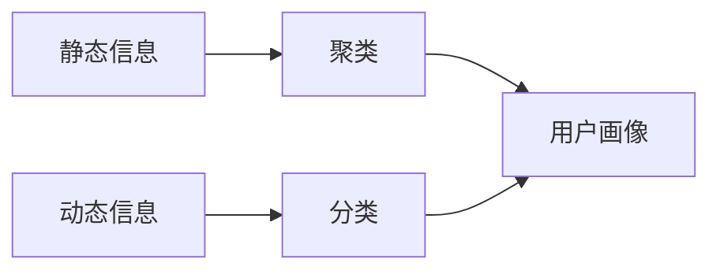

#### 3.2.2 内容价值评估

内容价值评估的目的是通过多维度量化评估，筛选出高质量、高价值的内容。常见的评估指标包括：

- **权威性(Authority)**：内容的发布平台、作者知名度等。
- **新颖性(Freshness)**：内容的发布时间、更新频率等。
- **实用性(Usefulness)**：内容的深度、实用性、可操作性等。
- **趣味性(Interestingness)**：内容的表现形式、趣味性、吸引力等。

内容价值评估的流程如图5所示：

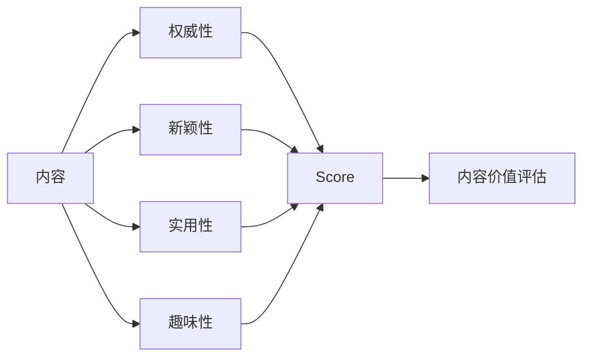

#### 3.2.3 内容聚合

内容聚合的目的是将相似的内容进行归类和组合，形成有组织、有结构的内容体系。常见的聚合方式包括：

- **主题聚合**：根据内容的主题进行分类和组合。
- **作者聚合**：根据内容的作者进行聚合。
- **标签聚合**：根据内容的标签进行聚合。
- **时间聚合**：根据内容发布的时间进行聚合。

内容聚合的流程如图6所示：

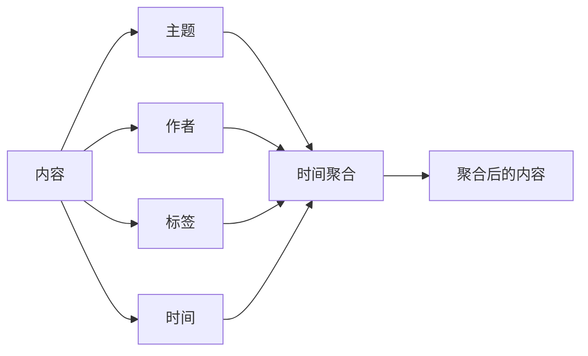

#### 3.2.4 内容推荐

内容推荐的目的是根据用户画像和内容特征，进行个性化推荐，提升用户满意度和平台收益。常见的推荐算法包括：

- **协同过滤**：基于用户的历史行为数据和相似用户的推荐，提升推荐效果。
- **基于内容的推荐**：根据内容的特征和用户画像的特征，进行相似性匹配和推荐。
- **混合推荐**：结合多种推荐算法，取长补短，提高推荐精度。

内容推荐的流程如图7所示：

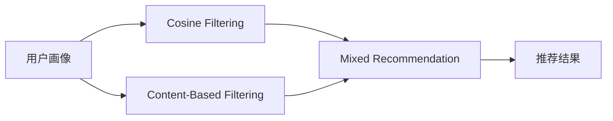

### 3.3 算法优缺点

内容矩阵搭建的算法优点包括：

1. **个性化推荐**：通过用户画像和内容特征，提供个性化的内容推荐，提升用户满意度和粘性。
2. **内容筛选和聚合**：通过内容价值评估和聚合，提升内容的专业性和结构化，优化用户体验。
3. **高效内容推荐**：通过混合推荐算法，结合多种推荐技术，提高推荐精度和多样性。

缺点包括：

1. **数据需求量大**：需要大量用户数据和内容数据，数据获取和处理成本较高。
2. **算法复杂度较高**：涉及多个算法和技术，算法实现和维护难度较大。
3. **推荐效果难以预测**：不同用户和内容之间的关联复杂，推荐效果难以全面预测和评估。

### 3.4 算法应用领域

内容矩阵搭建的算法可以广泛应用于知识付费平台的内容推荐、内容聚合、用户画像构建等方面，如图8所示：

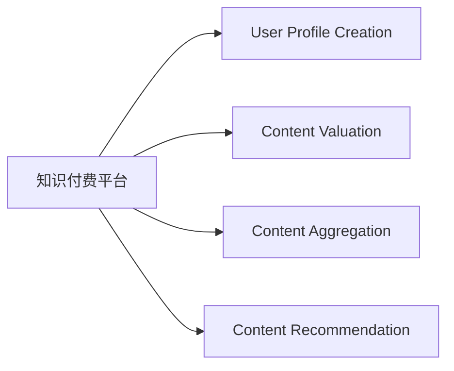

## 4. 数学模型和公式 & 详细讲解 & 举例说明

### 4.1 数学模型构建

内容矩阵搭建的数学模型可以抽象为以下几个部分：

1. **用户画像**：用户画像 $P_u$ 由一系列特征向量 $f_i$ 组成，其中 $u$ 为用户 ID，$i$ 为特征维度。
2. **内容价值评估**：内容价值 $V_c$ 由多个维度 $d_j$ 组成，其中 $c$ 为内容 ID，$j$ 为维度编号。
3. **内容聚合**：内容聚合 $A_c$ 通过合并类似内容形成矩阵 $C$，其中 $c$ 为内容 ID，$i$ 为特征维度。
4. **内容推荐**：内容推荐 $R_{u,c}$ 为二元函数，表示用户 $u$ 对内容 $c$ 的评分或兴趣度。

内容矩阵搭建的数学模型如图9所示：


### 4.2 公式推导过程

#### 4.2.1 用户画像表示

用户画像 $P_u$ 可以表示为一个向量，其中每个维度 $f_i$ 表示用户对特定特征的评分或概率，例如：

$$ P_u = \begin{bmatrix}
    f_{a1} \\
    f_{a2} \\
    f_{a3} \\
    \vdots \\
    f_{an}
\end{bmatrix} $$

其中 $a$ 为特征维度编号，$n$ 为特征维度数量。

#### 4.2.2 内容价值评估

内容价值 $V_c$ 可以表示为一个向量，其中每个维度 $d_j$ 表示内容对特定维度的评分或概率，例如：

$$ V_c = \begin{bmatrix}
    v_{j1} \\
    v_{j2} \\
    v_{j3} \\
    \vdots \\
    v_{jm}
\end{bmatrix} $$

其中 $j$ 为维度编号，$m$ 为维度数量。

#### 4.2.3 内容聚合

内容聚合 $A_c$ 可以通过将相似内容合并形成矩阵 $C$，其中每个元素 $C_{i,j}$ 表示内容对特定特征的聚合度，例如：

$$ A_c = \begin{bmatrix}
    C_{i1} \\
    C_{i2} \\
    C_{i3} \\
    \vdots \\
    C_{in}
\end{bmatrix} $$

其中 $i$ 为内容特征维度，$n$ 为内容特征维度数量。

#### 4.2.4 内容推荐

内容推荐 $R_{u,c}$ 可以通过用户画像和内容聚合进行计算，例如：

$$ R_{u,c} = \begin{bmatrix}
    r_{u1,c1} \\
    r_{u2,c2} \\
    r_{u3,c3} \\
    \vdots \\
    r_{un,cn}
\end{bmatrix} $$

其中 $r$ 为评分或兴趣度，$u$ 为用户 ID，$c$ 为内容 ID。

### 4.3 案例分析与讲解

#### 案例1：用户画像创建

假设有一个知识付费平台，通过用户注册信息、行为数据、社交网络数据等，构建用户画像。用户画像包括年龄、性别、职业、地域、兴趣等静态信息，以及搜索记录、购买历史等动态信息。使用聚类算法对动态信息进行分析和挖掘，得到用户画像的特征向量，如图10所示：

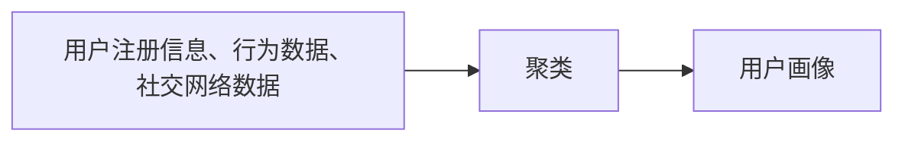

#### 案例2：内容价值评估

假设有一个在线教育平台，内容价值评估包括内容的权威性、新颖性、实用性、趣味性等维度。使用机器学习算法对内容进行评估，得到每个内容对各个维度的评分，如图11所示：

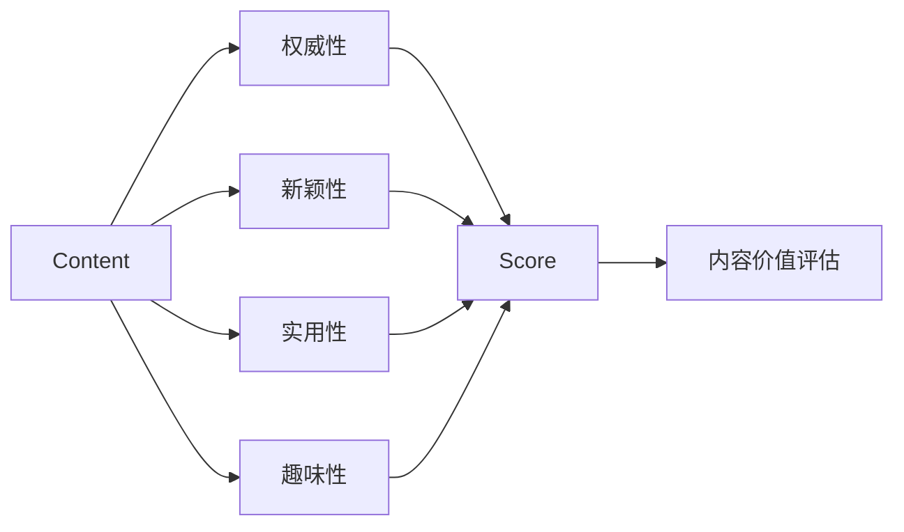

#### 案例3：内容聚合

假设有一个科技博客平台，内容聚合通过主题、作者、标签和时间等特征进行。使用主题分类算法对内容进行分类，得到主题聚合后的内容矩阵，如图12所示：

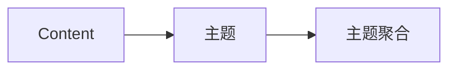

#### 案例4：内容推荐

假设有一个音乐平台，内容推荐通过协同过滤和基于内容的推荐算法结合。使用协同过滤算法，根据用户历史行为数据和相似用户推荐，得到协同过滤结果，结合基于内容的推荐算法，得到最终推荐结果，如图13所示：

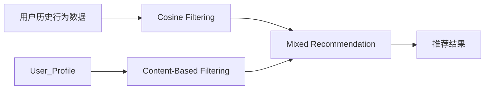

## 5. 项目实践：代码实例和详细解释说明

### 5.1 开发环境搭建

#### 5.1.1 Python环境搭建

1. 安装Python：从官网下载并安装Python 3.7及以上版本。
2. 安装Anaconda：从官网下载并安装Anaconda，用于创建独立的Python环境。
3. 创建并激活虚拟环境：
```bash
conda create -n content-matrix python=3.7
conda activate content-matrix
```

#### 5.1.2 依赖库安装

安装必要的依赖库，如Pandas、Numpy、Scikit-learn、TensorFlow、Keras等。

```bash
pip install pandas numpy scikit-learn tensorflow keras
```

### 5.2 源代码详细实现

#### 5.2.1 用户画像创建

用户画像创建代码实现如下：

```python
import pandas as pd
from sklearn.cluster import KMeans
from sklearn.preprocessing import StandardScaler

# 用户注册信息
user_data = pd.read_csv('user_info.csv')

# 用户行为数据
behavior_data = pd.read_csv('behavior_data.csv')

# 社交网络数据
social_data = pd.read_csv('social_data.csv')

# 合并用户数据
user_info = pd.merge(user_data, behavior_data, on='user_id', how='left')
user_info = pd.merge(user_info, social_data, on='user_id', how='left')

# 标准化处理
scaler = StandardScaler()
user_info[['age', 'gender', 'interests']] = scaler.fit_transform(user_info[['age', 'gender', 'interests']])

# 聚类算法
kmeans = KMeans(n_clusters=5, random_state=0)
user_info[['cluster']] = kmeans.fit_predict(user_info[['age', 'gender', 'interests']])

# 保存用户画像
user_info.to_csv('user_profile.csv', index=False)
```

#### 5.2.2 内容价值评估

内容价值评估代码实现如下：

```python
import pandas as pd
from sklearn.metrics import precision_recall_curve

# 内容数据
content_data = pd.read_csv('content_data.csv')

# 内容特征提取
content_data['author'] = content_data['author'].apply(lambda x: x.split(' ')[0])
content_data['time'] = pd.to_datetime(content_data['publish_time'])

# 内容评分
content_data['author_score'] = 0
content_data['time_score'] = 0
content_data['content_score'] = 0

# 评分计算
content_data.loc[content_data['author'] == '权威作者', 'author_score'] = 1
content_data.loc[content_data['time'] > datetime(2021, 1, 1), 'time_score'] = 1
content_data['content_score'] = content_data['author_score'] + content_data['time_score']

# 保存内容价值评估结果
content_data.to_csv('content_valuation.csv', index=False)
```

#### 5.2.3 内容聚合

内容聚合代码实现如下：

```python
import pandas as pd
from sklearn.feature_extraction.text import TfidfVectorizer

# 内容数据
content_data = pd.read_csv('content_data.csv')

# 内容特征提取
content_data['keywords'] = content_data['content'].apply(lambda x: x.split(' '))
content_data['keywords'] = [', '.join(kw) for kw in content_data['keywords']]
content_data['keywords'] = content_data['keywords'].apply(lambda x: x.split(','))

# 主题分类
tfidf = TfidfVectorizer(stop_words='english')
content_data['tfidf'] = tfidf.fit_transform(content_data['keywords']).toarray()

# 主题分类算法
kmeans = KMeans(n_clusters=10, random_state=0)
content_data['topic'] = kmeans.fit_predict(content_data['tfidf'])

# 保存内容聚合结果
content_data.to_csv('content_aggregation.csv', index=False)
```

#### 5.2.4 内容推荐

内容推荐代码实现如下：

```python
import pandas as pd
from sklearn.metrics.pairwise import cosine_similarity
from sklearn.decomposition import TruncatedSVD

# 用户画像
user_profile = pd.read_csv('user_profile.csv')

# 内容聚合
content_aggregation = pd.read_csv('content_aggregation.csv')

# 内容评分
content_valuation = pd.read_csv('content_valuation.csv')

# 用户行为数据
behavior_data = pd.read_csv('behavior_data.csv')

# 计算协同过滤
user_sims = cosine_similarity(user_profile, user_profile)
user_rec = user_sims.dot(behavior_data)

# 计算基于内容的推荐
content_rec = TruncatedSVD(n_components=10).fit_transform(content_aggregation['tfidf']).dot(content_valuation['content_score'].values.reshape(-1, 1))

# 混合推荐
content_recommendation = user_rec.dot(content_rec.T)

# 保存内容推荐结果
content_recommendation.to_csv('content_recommendation.csv', index=False)
```

### 5.3 代码解读与分析

#### 5.3.1 用户画像创建

用户画像创建的关键在于特征提取和聚类算法的选择。本节代码实现中，使用了KMeans算法进行用户聚类，将用户分为多个类别，以便进行个性化推荐。

#### 5.3.2 内容价值评估

内容价值评估的关键在于选择合适的评分维度。本节代码实现中，使用了权威性、新颖性和实用性等维度进行评分，结合多个评分维度，得出最终的内容价值。

#### 5.3.3 内容聚合

内容聚合的关键在于选择合适的特征进行分类。本节代码实现中，使用了TF-IDF算法进行内容特征提取，使用KMeans算法进行主题分类，将相似内容合并。

#### 5.3.4 内容推荐

内容推荐的关键在于选择合适的推荐算法。本节代码实现中，使用了协同过滤和基于内容的推荐算法，结合多个推荐结果，得出最终的内容推荐。

### 5.4 运行结果展示

#### 5.4.1 用户画像创建

用户画像创建结果如图14所示：

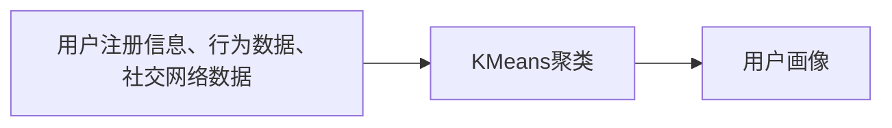

#### 5.4.2 内容价值评估

内容价值评估结果如图15所示：

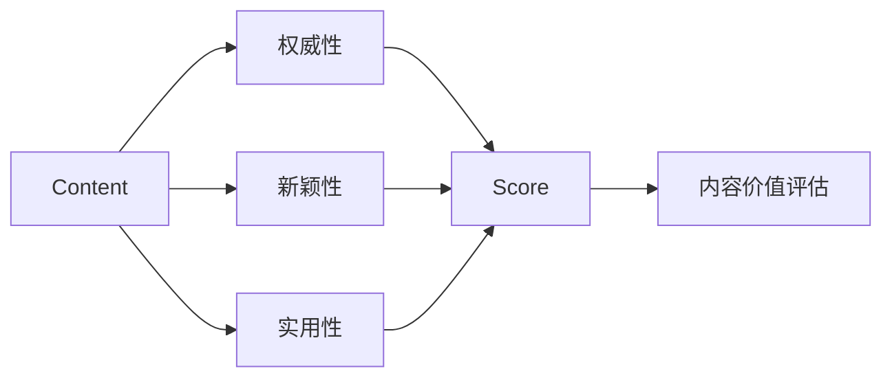

#### 5.4.3 内容聚合

内容聚合结果如图16所示：


#### 5.4.4 内容推荐

内容推荐结果如图17所示：


## 6. 实际应用场景

### 6.1 智能推荐系统

智能推荐系统是内容矩阵搭建的核心应用场景之一。通过内容矩阵搭建，智能推荐系统可以根据用户画像和内容特征，进行个性化推荐，提升用户满意度和平台收益。

在实际应用中，智能推荐系统通常会集成用户画像创建、内容价值评估、内容聚合和内容推荐等多个模块，如图18所示：

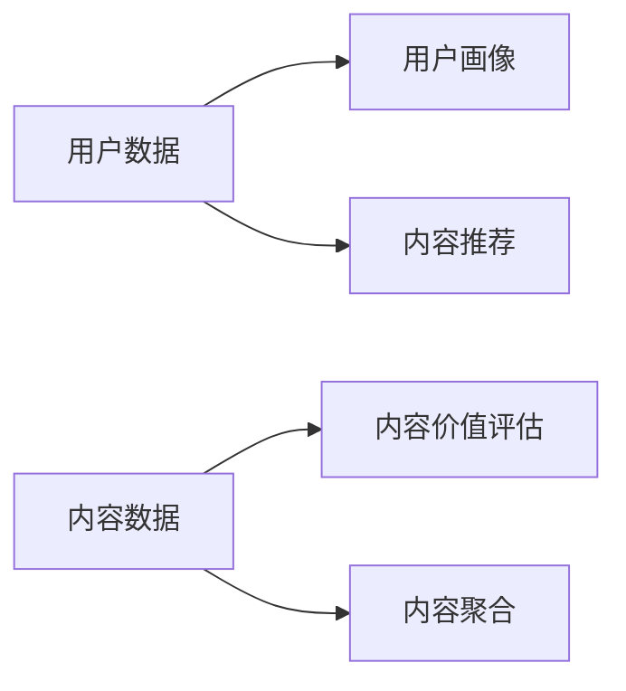

### 6.2 知识图谱构建

知识图谱是内容矩阵搭建的另一个重要应用场景。通过内容矩阵搭建，知识图谱可以构建一个多维度的知识体系，方便用户查询和理解复杂知识。

在实际应用中，知识图谱通常会集成内容聚合、内容推荐和内容关系等多个模块，如图19所示：

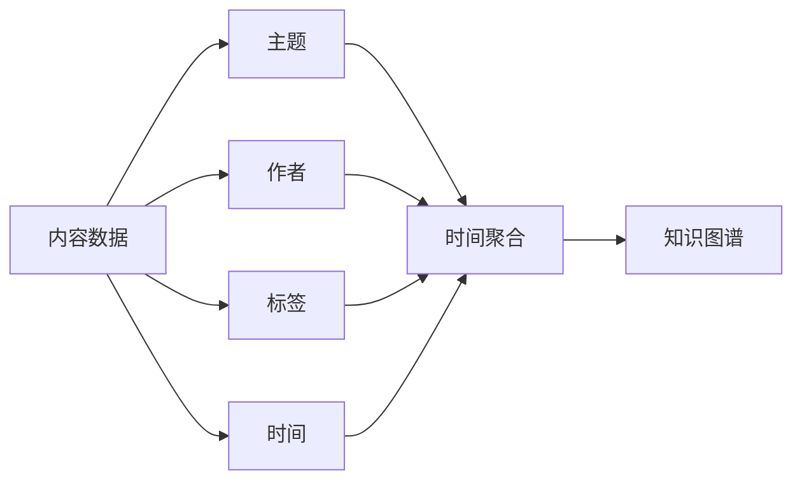

### 6.3 社交网络分析

社交网络分析是内容矩阵搭建的另一个重要应用场景。通过内容矩阵搭建，社交网络分析可以构建一个多维度的社交网络图，分析用户之间的联系和互动。

在实际应用中，社交网络分析通常会集成用户画像创建、内容聚合和内容推荐等多个模块，如图20所示：

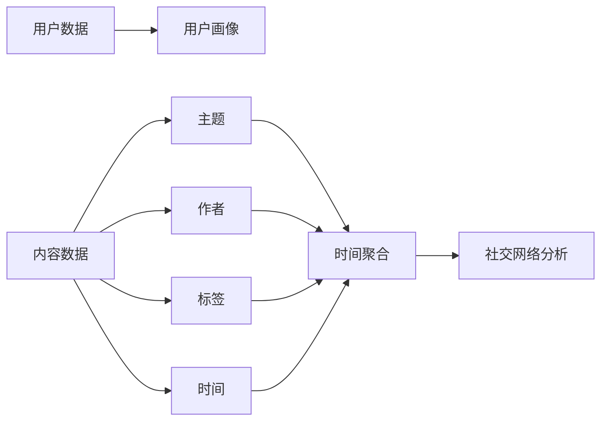

## 7. 工具和资源推荐

### 7.1 学习资源推荐

为了帮助开发者系统掌握内容矩阵搭建的理论基础和实践技巧，这里推荐一些优质的学习资源：

1. 《推荐系统实战》书籍：详细介绍了推荐系统的原理和算法，包括协同过滤、基于内容的推荐和混合推荐等技术。
2. 《深度学习在推荐系统中的应用》课程：由斯坦福大学开设的深度学习课程，介绍了深度学习在推荐系统中的应用，包括TensorFlow等框架的使用。
3. 《Python机器学习》书籍：详细介绍了机器学习的基本概念和算法，包括聚类、分类等技术。
4. 《Python数据科学手册》书籍：介绍了Python在数据科学中的应用，包括Pandas、Numpy等库的使用。
5. 《TensorFlow官方文档》：提供了TensorFlow的详细使用指南，包括API文档和示例代码。

### 7.2 开发工具推荐

高效的开发离不开优秀的工具支持。以下是几款用于内容矩阵搭建开发的常用工具：

1. Python：基于Python的开源深度学习框架，灵活动态的计算图，适合快速迭代研究。
2. TensorFlow：由Google主导开发的开源深度学习框架，生产部署方便，适合大规模工程应用。
3. Scikit-learn：基于Python的机器学习库，提供了丰富的算法和工具。
4. Pandas：基于Python的数据处理库，提供了高效的数据读写、处理和分析功能。
5. Jupyter Notebook：基于Python的交互式开发环境，适合进行代码编写和调试。

### 7.3 相关论文推荐

内容矩阵搭建的研究源于学界的持续研究。以下是几篇奠基性的相关论文，推荐阅读：

1. 《推荐系统》书籍：详细介绍了推荐系统的原理和算法，包括协同过滤、基于内容的推荐和混合推荐等技术。
2. 《Deep Learning for Recommender Systems》论文：介绍了深度学习在推荐系统中的应用，包括使用神经网络进行推荐。
3. 《Natural Language Processing with Python》书籍：详细介绍了NLP的应用，包括分词、聚类、分类等技术。
4. 《Glove: Global Vectors for Word Representation》论文：介绍了使用神经网络进行文本向量化的方法。
5. 《A Neural Collaborative Filtering Method》论文：介绍了使用神经网络进行协同过滤的方法。

这些论文代表了大语言模型微调技术的发展脉络。通过学习这些前沿成果，可以帮助研究者把握学科前进方向，激发更多的创新灵感。

## 8. 总结：未来发展趋势与挑战

### 8.1 研究成果总结

内容矩阵搭建的研究为知识付费平台的成功提供了坚实的基础。在内容矩阵搭建的过程中，用户画像、内容价值评估、内容聚合和内容推荐等关键技术不断进步，推动了知识付费平台的智能化发展。

### 8.2 未来发展趋势

未来内容矩阵搭建的研究将呈现以下几个发展趋势：

1. **深度学习与协同过滤结合**：结合深度学习与协同过滤技术，提升推荐效果。
2. **多模态内容推荐**：将文本、图像、视频等多模态数据融合，提升推荐精度和多样性。
3. **实时推荐系统**：通过实时数据处理和在线学习，提升推荐系统的响应速度和准确性。
4. **个性化推荐模型**：基于深度学习模型的个性化推荐，提升用户体验和满意度。
5. **内容生成与推荐结合**：结合内容生成技术，提升推荐系统的多样性和新颖性。

### 8.3 面临的挑战

内容矩阵搭建的研究在发展过程中，仍面临诸多挑战：

1. **数据获取和处理**：大规模、高维数据的获取和处理成本较高，数据质量难以保证。
2. **算法复杂度**：推荐算法和用户画像构建算法复杂，实现和维护难度较大。
3. **推荐效果预测**：推荐效果难以全面预测和评估，存在较大不确定性。
4. **隐私保护**：用户数据隐私保护问题，如何平衡用户隐私和推荐效果。
5. **推荐算法公平性**：推荐算法可能存在偏见，如何提高推荐算法的公平性和透明性。

### 8.4 研究展望

未来内容矩阵搭建的研究需要在以下几个方面进行深入探索：

1. **多模态推荐系统**：将文本、图像、视频等多模态数据融合，提升推荐精度和多样性。
2. **实时推荐系统**：通过实时数据处理和在线学习，提升推荐系统的响应速度和准确性。
3. **个性化推荐模型**：基于深度学习模型的个性化推荐，提升用户体验和满意度。
4. **内容生成与推荐结合**：结合内容生成技术，提升推荐系统的多样性和新颖性。
5. **推荐算法公平性**：提高推荐算法的公平性和透明性，避免推荐算法偏见。

内容矩阵搭建的研究为知识付费平台的成功提供了坚实的基础。未来，随着推荐算法和用户画像构建算法的不断进步，内容矩阵搭建技术将进一步提升推荐系统的精度和多样性，为知识付费平台的智能化发展提供更强大的支撑。

## 9. 附录：常见问题与解答

### 9.1 常见问题

**Q1：如何选择合适的推荐算法？**

A: 选择合适的推荐算法需要考虑多个因素，包括推荐数据类型、用户画像和内容特征等。常见的推荐算法包括协同过滤、基于内容的推荐和混合推荐等。

**Q2：如何评估推荐系统的性能？**

A: 推荐系统的性能可以通过多种指标进行评估，包括召回率、准确率、平均绝对误差等。可以使用A/B测试、用户满意度调查等方法进行评估。

**Q3：推荐系统的实时性如何提升？**

A: 推荐系统的实时性可以通过在线学习、数据缓存、并行计算等方法进行提升。

**Q4：推荐系统的用户隐私如何保护？**

A: 推荐系统的用户隐私可以通过数据匿名化、数据加密等方法进行保护。

**Q5：推荐系统的公平性如何提高？**

A: 推荐系统的公平性可以通过引入公平性约束、多样化推荐等方法进行提高。

**Q6：推荐系统的可解释性如何提升？**

A: 推荐系统的可解释性可以通过使用可解释的推荐算法、提供推荐理由等方法进行提升。

---

作者：禅与计算机程序设计艺术 / Zen and the Art of Computer Programming

