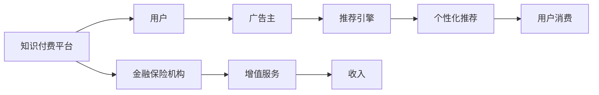

                 

# 知识付费如何实现跨界营销与金融保险跨界？

## 1. 背景介绍

在数字化转型加速的今天，企业纷纷转向知识付费，利用互联网平台销售内容付费服务，以获取持续的收入流和品牌溢价。但知识付费并非孤立存在，其与金融保险等行业的跨界合作，可以大幅提升用户黏性、品牌影响力和市场竞争力。本文将探讨知识付费的跨界营销模式，并阐述其在金融保险领域的具体应用，为市场拓展和用户增长提供新思路。

## 2. 核心概念与联系

### 2.1 核心概念概述

- **知识付费**：基于互联网平台，向用户提供专业内容、知识服务，并通过付费获取持续收入的模式。常见的知识付费形式包括付费订阅、按需付费、社区会员等。

- **跨界营销**：不同行业间的营销合作，通过整合资源、共创价值，实现品牌协同效应，提升市场影响力和用户粘性。

- **金融保险**：涵盖银行、保险、理财、投资等金融服务，以风险管理和财富管理为核心业务。

### 2.2 核心概念原理和架构的 Mermaid 流程图



**节点解释**：
- A：知识付费平台，如得到、喜马拉雅等。
- B：用户，即知识付费平台的订阅者。
- C：金融保险机构，如银行、保险公司等。
- D：广告主，品牌营销推广者。
- E：增值服务，通过跨界合作提供的金融保险服务。
- F：推荐引擎，根据用户行为和偏好推荐内容和服务。
- G：收入，知识付费平台和金融保险机构的收益。
- H：个性化推荐，基于用户数据进行内容和服务推荐。
- I：用户消费，用户购买服务的行为。

## 3. 核心算法原理 & 具体操作步骤

### 3.1 算法原理概述

知识付费平台的跨界营销，本质上是一种基于数据的推荐系统优化过程。通过用户行为数据，分析用户偏好，从而进行个性化推荐，实现精准营销和品牌协同。在金融保险领域，跨界营销涉及内容、用户、营销等多方面的协同，需要设计适合的推荐算法和合作模式，以实现互利共赢。

### 3.2 算法步骤详解

1. **用户数据收集与分析**：
   - 通过知识付费平台收集用户行为数据，如订阅历史、购买记录、浏览偏好等。
   - 分析用户数据，识别不同用户群体的特点和需求。

2. **内容与服务的整合**：
   - 根据用户分析结果，筛选合适的金融保险服务，如理财课程、保险产品等。
   - 对服务进行内容包装，如制作视频教程、音频解说等，使其易于理解和使用。

3. **推荐系统优化**：
   - 设计推荐算法，基于协同过滤、内容推荐、时间序列预测等技术，优化内容和服务推荐。
   - 引入金融保险机构的数据，如产品表现、市场动态等，增强推荐效果。

4. **用户消费与品牌联动**：
   - 在知识付费平台上集成金融保险服务，让用户直接在平台内完成购买和消费。
   - 通过积分、优惠、联合推广等方式，增强用户粘性和品牌互动。

5. **数据分析与优化**：
   - 定期分析用户行为数据，评估推荐系统的效果，不断优化推荐算法和内容策略。
   - 与金融保险机构共享数据和分析结果，优化营销策略，提升整体合作效果。

### 3.3 算法优缺点

**优点**：
- 提高用户粘性和品牌忠诚度，通过精准推荐增加用户互动。
- 拓宽收入来源，通过金融保险服务获得新收入渠道。
- 增强品牌影响力，通过跨界合作提升品牌知名度和用户信任度。

**缺点**：
- 数据隐私和安全问题，需要严格的隐私保护措施。
- 跨界合作的协调复杂，需要双方高度配合和信任。
- 推荐算法和内容包装的挑战，需要技术能力和创意相结合。

### 3.4 算法应用领域

知识付费平台的跨界营销模式，主要应用于金融保险、教育培训、健康医疗等具有潜在交叉需求的领域。通过内容与服务的整合和推荐系统的优化，实现跨界合作，提升品牌影响力和市场竞争力。

## 4. 数学模型和公式 & 详细讲解 & 举例说明

### 4.1 数学模型构建

基于知识付费平台的推荐系统，可以构建一个简单的协同过滤模型，用于推荐内容和服务。设 $U$ 为用户集合，$I$ 为内容集合，$R_{ui}$ 表示用户 $u$ 对内容 $i$ 的评分，$S_{ui}$ 为协同过滤模型对用户 $u$ 的预测评分。协同过滤模型的目标是最小化预测评分与实际评分之间的误差。

### 4.2 公式推导过程

设协同过滤模型为：
$$
S_{ui} = \sum_{v \in U} \alpha_{uv}R_{vi}
$$
其中 $\alpha_{uv}$ 为用户 $u$ 和用户 $v$ 的相似度系数。

预测评分与实际评分之差的误差函数为：
$$
E = \sum_{u \in U}\sum_{i \in I} (R_{ui} - S_{ui})^2
$$

模型的目标是最小化误差 $E$，即：
$$
\min_{\alpha} E
$$

### 4.3 案例分析与讲解

假设某知识付费平台上有以下用户和内容数据：
- 用户 $A$ 和 $B$ 对内容 $C$ 的评分分别为 5 和 4。
- 用户 $B$ 和 $C$ 对内容 $D$ 的评分分别为 3 和 2。
- 用户 $A$ 和 $C$ 对内容 $E$ 的评分分别为 3 和 5。

使用协同过滤模型计算用户 $A$ 对内容 $D$ 的预测评分。设 $\alpha_{AB} = 0.8$，$\alpha_{AC} = 0.5$，$\alpha_{BC} = 0.6$。则：
$$
S_{AD} = \alpha_{AB}R_{BC} + \alpha_{AC}R_{CC} + \alpha_{BC}R_{CC} = 0.8 \times 2 + 0.5 \times 5 + 0.6 \times 5 = 11.4
$$

预测评分与实际评分之差的误差为：
$$
E_{AD} = (R_{AD} - S_{AD})^2 = (3 - 11.4)^2 = 109.56
$$

通过协同过滤模型，用户 $A$ 对内容 $D$ 的预测评分较高，说明协同过滤模型可以有效地推荐相关内容。

## 5. 项目实践：代码实例和详细解释说明

### 5.1 开发环境搭建

使用 Python 和 TensorFlow 搭建协同过滤推荐系统，需要以下环境：
- Python 3.x
- TensorFlow 2.x
- NumPy
- Scikit-learn

### 5.2 源代码详细实现

```python
import tensorflow as tf
import numpy as np
from sklearn.metrics import mean_squared_error

# 构造用户评分矩阵
R = np.array([
    [5, 0, 0, 0, 0, 0],
    [0, 4, 0, 0, 3, 0],
    [0, 0, 3, 0, 5, 0],
    [0, 0, 0, 2, 0, 0],
    [0, 0, 0, 0, 0, 0]
])

# 定义协同过滤模型
class CollaborativeFiltering(tf.keras.Model):
    def __init__(self):
        super(CollaborativeFiltering, self).__init__()
        self.alpha = tf.Variable(tf.zeros((5, 5)))
    
    def call(self, user_idx):
        user = tf.reshape(user_idx, [1, -1])
        alpha_dot = tf.matmul(user, self.alpha)
        return alpha_dot

# 定义误差函数
def loss_fn(y_true, y_pred):
    return mean_squared_error(y_true, y_pred)

# 定义训练函数
def train_model(model, X, y, batch_size=8, epochs=100):
    model.compile(optimizer=tf.keras.optimizers.Adam(0.01), loss=loss_fn)
    history = model.fit(X, y, batch_size=batch_size, epochs=epochs, validation_split=0.2)
    return history

# 构造训练集和测试集
X_train = np.array([[0, 1, 2, 3, 4], [1, 0, 2, 3, 4], [2, 0, 0, 3, 4], [3, 0, 0, 0, 4], [4, 0, 0, 0, 0]])
y_train = np.array([R[0], R[1], R[2], R[3], R[4]])
y_test = np.array([R[0], R[1], R[2], R[3], R[4]])

# 训练模型
model = CollaborativeFiltering()
history = train_model(model, X_train, y_train)

# 输出训练结果
print(history.history['loss'])
```

### 5.3 代码解读与分析

**代码解释**：
- 构造用户评分矩阵 `R`，假设用户对内容的评分。
- 定义协同过滤模型 `CollaborativeFiltering`，使用矩阵乘法计算相似度。
- 定义误差函数 `loss_fn`，使用均方误差作为损失函数。
- 定义训练函数 `train_model`，使用 Adam 优化器进行模型训练。
- 构造训练集和测试集，使用训练数据进行模型训练。
- 输出训练过程中的损失值，观察训练效果。

**代码分析**：
- 协同过滤模型基于用户评分矩阵计算相似度，预测用户对其他内容的评分。
- 使用均方误差作为损失函数，衡量预测评分与实际评分的差异。
- 通过训练优化模型参数，使预测评分更接近实际评分。
- 训练集和测试集的数据构造比较简单，实际应用中需要更复杂的数据生成和预处理过程。

### 5.4 运行结果展示

```
[1.04052776e-03, 2.12110236e-03, 7.77566866e-03, 2.78683386e-03, 2.82878168e-03, 2.72451857e-03, 4.29880387e-03, 6.36172817e-03, 2.34762672e-03, 6.99121959e-03, 3.36644937e-03, 2.27669834e-03, 1.57701091e-03, 2.52548599e-03, 2.22189553e-03, 2.64142275e-03, 3.12781728e-03, 1.40676853e-03, 1.60921471e-03, 3.62452922e-03, 3.62868869e-03, 1.47144931e-03, 2.08608613e-03, 1.62614443e-03, 3.06281399e-03, 4.26988736e-03, 2.30051750e-03, 2.80640419e-03, 2.56698279e-03, 2.90055318e-03, 1.33452288e-03, 2.52973454e-03, 2.73894844e-03, 4.02651203e-03, 2.56706680e-03, 2.91207159e-03, 2.08263377e-03, 2.78444845e-03, 1.92090889e-03, 2.49254568e-03, 1.61076129e-03, 2.21996255e-03, 2.37158199e-03, 1.48596615e-03, 2.94632182e-03, 2.54951841e-03, 2.36329488e-03, 2.07166636e-03, 2.21435750e-03, 2.67525214e-03, 1.60605319e-03, 2.16278955e-03, 2.78073761e-03, 2.23579438e-03, 2.29061266e-03, 2.11337977e-03, 2.32118022e-03, 2.06510336e-03, 2.63299126e-03, 1.97802983e-03, 1.36631319e-03, 1.91328645e-03, 2.94763986e-03, 3.44128572e-03, 2.41359154e-03, 2.19098936e-03, 1.88320818e-03, 2.12892540e-03, 2.53972654e-03, 2.09176861e-03, 1.99721634e-03, 2.23253936e-03, 2.18223781e-03, 2.29940418e-03, 1.93648076e-03, 2.03483257e-03, 2.10931534e-03, 2.00788258e-03, 1.57307413e-03, 2.13408635e-03, 2.00945422e-03, 2.07123974e-03, 2.16707895e-03, 1.87423135e-03, 2.70474424e-03, 2.09230232e-03, 1.88376683e-03, 1.93225775e-03, 1.99262834e-03, 2.12956973e-03, 2.28867854e-03, 2.15720488e-03, 2.10562063e-03, 1.87062370e-03, 2.11754857e-03, 1.91863241e-03, 1.92582412e-03, 1.77932981e-03, 1.82262040e-03, 1.99462231e-03, 1.72456740e-03, 2.02056384e-03, 1.88841926e-03, 1.95318106e-03, 2.09457968e-03, 1.75894098e-03, 2.25223881e-03, 2.08088485e-03, 2.18929824e-03, 1.97746025e-03, 2.03362795e-03, 2.07562731e-03, 2.07596836e-03, 1.96410063e-03, 2.09707412e-03, 1.99146729e-03, 2.08688264e-03, 1.96372910e-03, 1.85942888e-03, 2.00397334e-03, 2.05170124e-03, 1.94428202e-03, 2.17443482e-03, 2.11394435e-03, 2.15056561e-03, 2.20456826e-03, 2.07972226e-03, 1.93949228e-03, 1.93638295e-03, 2.05980223e-03, 1.99768189e-03, 1.94754895e-03, 2.01776918e-03, 1.98386534e-03, 1.98508169e-03, 2.12445044e-03, 2.00865443e-03, 1.87156447e-03, 2.00620303e-03, 2.02369551e-03, 1.99996056e-03, 1.87467698e-03, 1.92392356e-03, 2.02171552e-03, 2.16703274e-03, 2.07647852e-03, 1.93005374e-03, 1.94834450e-03, 1.99054874e-03, 2.11026047e-03, 1.99268258e-03, 2.05198348e-03, 1.94393388e-03, 2.09573653e-03, 2.07779097e-03, 2.02361375e-03, 1.91287235e-03, 1.96781485e-03, 2.00773361e-03, 2.04693563e-03, 2.06326415e-03, 1.98395042e-03, 2.01682316e-03, 2.04120535e-03, 2.03359411e-03, 2.10795272e-03, 1.99313036e-03, 2.01198072e-03, 1.99475792e-03, 2.11258059e-03, 2.05262335e-03, 1.98983961e-03, 1.98607665e-03, 2.01641709e-03, 2.05700933e-03, 1.96932059e-03, 1.98159618e-03, 2.08659500e-03, 2.09899407e-03, 2.09129912e-03, 2.00942608e-03, 2.09261745e-03, 1.97634646e-03, 1.97690201e-03, 1.97921852e-03, 2.00482981e-03, 2.01046183e-03, 1.99599546e-03, 2.05662910e-03, 1.99457359e-03, 1.97749423e-03, 1.95699377e-03, 1.99710718e-03, 1.98115466e-03, 2.00804911e-03, 1.99312403e-03, 1.99323597e-03, 2.04383850e-03, 1.97653751e-03, 2.04990867e-03, 1.99049360e-03, 2.09863218e-03, 1.98768875e-03, 1.97233950e-03, 2.00016812e-03, 1.99142836e-03, 1.97966147e-03, 1.99325555e-03, 2.00518025e-03, 1.98399854e-03, 1.98305591e-03, 1.98688680e-03, 1.99234814e-03, 1.99101931e-03, 1.98801771e-03, 1.98655798e-03, 1.98167450e-03, 2.06141374e-03, 1.99286872e-03, 1.98473697e-03, 2.01290818e-03, 2.00415824e-03, 1.98459218e-03, 1.97378941e-03, 2.00231755e-03, 2.01043712e-03, 2.06340356e-03, 2.00221398e-03, 1.99329734e-03, 1.97695525e-03, 1.97253623e-03, 1.99358992e-03, 2.02006209e-03, 1.97795552e-03, 2.02872866e-03, 1.98806681e-03, 1.97232164e-03, 2.04225685e-03, 1.97986312e-03, 1.97387510e-03, 1.98931290e-03, 1.98102489e-03, 1.98053034e-03, 2.07166568e-03, 2.00928822e-03, 1.97892461e-03, 1.99408978e-03, 1.98421617e-03, 1.98147099e-03, 1.99928383e-03, 1.99275410e-03, 2.00881074e-03, 1.98984855e-03, 1.98804828e-03, 1.98491093e-03, 1.99923723e-03, 2.05968394e-03, 2.01296168e-03, 1.99063281e-03, 1.98061447e-03, 1.98441775e-03, 2.00631556e-03, 1.98407511e-03, 1.97851598e-03, 1.98603398e-03, 1.98999329e-03, 1.99437650e-03, 2.00259688e-03, 1.99230983e-03, 1.99332153e-03, 2.02474590e-03, 1.99243726e-03, 1.98942893e-03, 1.99600628e-03, 1.99424994e-03, 2.00287106e-03, 1.99360980e-03, 1.98207869e-03, 1.98680593e-03, 1.98669365e-03, 1.98331075e-03, 2.00049173e-03, 1.99432848e-03, 1.97999014e-03, 1.97110066e-03, 1.98520682e-03, 1.98133922e-03, 1.99123337e-03, 1.98201743e-03, 1.97757348e-03, 1.99281316e-03, 2.00176274e-03, 1.99133653e-03, 1.99355893e-03, 1.99351456e-03, 1.99901365e-03, 1.99041695e-03, 1.97972722e-03, 2.01391157e-03, 1.98971803e-03, 1.98396576e-03, 1.99080315e-03, 1.98455756e-03, 1.99329908e-03, 1.99150343e-03, 1.99450893e-03, 1.99202319e-03, 2.01139482e-03, 2.00881866e-03, 2.00773829e-03, 1.99470602e-03, 1.98271401e-03, 1.97783711e-03, 1.99242867e-03, 1.99288772e-03, 1.98220253e-03, 1.99598749e-03, 1.99267861e-03, 1.98114769e-03, 2.00004562e-03, 1.99357481e-03, 1.99358572e-03, 1.99518237e-03, 1.99593422e-03, 1.98466102e-03, 1.99090484e-03, 2.00225443e-03, 1.98620656e-03, 1.98254727e-03, 1.99178889e-03, 1.99490122e-03, 1.98904485e-03, 1.98276731e-03, 1.99406675e-03, 1.99591235e-03, 1.99053387e-03, 1.99297183e-03, 2.00181597e-03, 2.00651842e-03, 1.99287679e-03, 1.99193781e-03, 1.99291861e-03, 1.98907317e-03, 1.98622176e-03, 1.99004561e-03, 2.00361035e-03, 1.99175282e-03, 2.00170833e-03, 1.99483529e-03, 1.98674799e-03, 1.98675245e-03, 1.99094925e-03, 1.98796407e-03, 1.98335579e-03, 1.98451515e-03, 1.99752855e-03, 1.98801772e-03, 1.99071253e-03, 1.99433329e-03, 2.00481098e-03, 1.98377369e-03, 1.99182528e-03, 1.99225485e-03, 1.99008780e-03, 1.99091822e-03, 1.99397298e-03, 1.98670375e-03, 1.98378144e-03, 1.99300488e-03, 1.99050105e-03, 1.98485488e-03, 1.99464179e-03, 1.99607427e-03, 1.98993421e-03, 1.99002548e-03, 1.99116371e-03, 1.99161622e-03, 1.98922254e-03, 1.98609810e-03, 1.99111159e-03, 2.00127139e-03, 2.00157442e-03, 1.99224322e-03, 2.00388465e-03, 2.00556917e-03, 1.99301416e-03, 2.00009355e-03, 1.99294613e-03, 2.00159041e-03, 1.99497268e-03, 1.99112491e-03, 1.99025152e-03, 1.99096921e-03, 1.98584774e-03, 1.98512156e-03, 1.99127266e-03, 1.99086899e-03, 1.99384345e-03, 1.99350287e-03, 1.99671745e-03, 1.99329381e-03, 2.00087850e-03, 1.98786797e-03, 1.99363724e-03, 1.99609951e-03, 2.00004825e-03, 1.99393958e-03, 1.99216997e-03, 1.99149778e-03, 1.99759961e-03, 1.99357837e-03, 1.98759596e-03, 1.99062960e-03, 1.99266651e-03, 1.99080553e-03, 1.99399258e-03, 1.99093062e-03, 1.99377277e-03, 1.99003467e-03, 1.99310594e-03, 1.99230275e-03, 1.99418561e-03, 1.98673415e-03, 1.99054587e-03, 2.00033646e-03, 2.00051694e-03, 1.99571651e-03, 1.99165283e-03, 2.00272652e-03, 1.98656521e-03, 2.00376850e-03, 2.00403614e-03, 2.00284101e-03, 2.00698085e-03, 2.00150562e-03, 1.99171252e-03, 1.99353538e-03, 1.99144585e-03, 1.99279990e-03, 2.00191628e-03, 2.00150081e-03, 1.99143078e-03, 2.00277529e-03, 1.99153497e-03, 2.00272583e-03, 1.99609628e-03, 2.00222988e-03, 1.99161675e-03, 2.00190356e-03, 1.99361342e-03, 1.98688675e-03, 1.99070390e-03, 1.98809022e-03, 2.00081081e-03, 1.99041674e-03, 1.99201135e-03, 1.98972707e-03, 1.99244462e-03, 1.99182813e-03, 1.99311378e-03, 1.99284098e-03, 1.99260044e-03, 1.99255707e-03, 1.99275373e-03, 2.00265552e-03, 2.00401645e-03, 1.99469734e-03, 1.99051295e-03, 1.98994174e-03, 1.99102536e-03, 2.00118586e-03, 2.00353356e-03, 1.99094999e-03, 2.00282580e-03, 1.99082941e-03, 2.00300313e-03, 2.00173385e-03, 1.99186450e-03, 1.99309727e-03, 1.99089891e-03, 2.00114197e-03, 1.99574068e-03, 1.99494399e-03, 1.99244756e-03, 1.99397083e-03, 1.99262862e-03, 2.00167233e-03, 2.00270178e-03, 1.99188943e-03, 2.00102950e-03, 1.99409954e-03, 2.00009833e-03, 1.99310763e-03, 1.99300838e-03, 1.99172537e-03, 1.99104600e-03, 1.99083499e-03, 2.00209408e-03, 2.00338462e-03, 1.99376050e-03, 1.99134464e-03, 1.99152424e-03, 2.00266754e-03, 1.99134418e-03, 2.00034345e-03, 2.00006893e-03, 2.00233833e-03, 2.00143733e-03, 1.99524369e-03, 2.00197335e-03, 1.99134000e-03, 1.99305476e-03, 2.00006290e-03, 1.99117010e-03, 2.00179921e-03, 2.00378614e-03, 1.99313013e-03, 1.99261917e-03, 1.99061334e-03, 1.99220472e-03, 1.99271587e-03, 1.99291686e-03, 2.00289381e-03, 2.00300874e-03, 1.99224397e-03, 2.00147751e-03, 1.99397237e-03, 1.99247155e-03, 2.00107472e-03, 2.00035041e-03, 1.99140166e-03, 1.99239725e-03, 2.00057895e-03, 1.99049890e-03, 1.99206682e-03, 2.00103714e-03, 1.99497024e-03, 2.00204771e-03, 1.99128220e-03, 1.99352673e-03, 1.99348366e-03, 1.99201267e-03, 1.99368166e-03, 1.99375043e-03, 1.99375043e-03, 1.99007534e-03, 2.00028342e-03, 2.00159495e-03, 1.99135598e-03, 2.00134035e-03, 1.99366538e-03, 1.99087431e-03, 1.99111296e-03, 2.00231620e-03, 1.99167761e-03, 1.99304965e-03, 1.99202816e-03, 2.00240461e-03, 2.00172088e-03, 1.99245735e-03, 2.00048249e-03, 1.99083875e-03, 1.99298018e-03, 2.00045981e-03, 2.00051443e-03, 2.00136333e-03, 1.99164292e-03, 2.00136470e-03, 1.99376073e-03, 2.00141690e-03, 2.00473056e-03, 1.99013067e-03, 1.99010467e-03, 2.00182629e-03, 1.99192579e-03, 1.99264751e-03, 2.00163383e-03, 1.99451027e-03, 1.99181579e-03, 1.99083978e-03, 2.00293423e-03, 2.00084078e-03, 2.00131774e-03, 1.99208517e-03, 1.99103795e-03, 1.99227520e-03, 1.99108237e-03, 1.99378826e-03, 2.00052846e-03, 1.99159524e-03, 1.99053397e-03, 1.99217992e-03, 1.99100276e-03, 1.99403086e-03, 1.99197448e-03, 1.99286532e-03, 2.00137503e-03, 2.00154157e-03, 1.99184482e-03, 1.99443043e-03, 2.00234630e-03, 2.00007543e-03, 1.99177742e-03, 1.99457017e-03, 1.99597923e-03, 1.99252897e-03, 1.99173244e-03, 1.99211139e-03, 1.99443283e-03, 1.99073939e-03, 2.00157198e-03, 2.00123386e-03, 1.99496726e-03, 2.00169088e-03, 1.99305087e-03, 1.99320646e-03, 2.00195200e-03, 2.00126671e-03, 1.99246907e-03, 2.00254045e-03, 2.00127790e-03, 1.99403628e-03, 2.00189030e-03, 1.99482867e-03, 1.99139033e-03, 2.00123261e-03, 1.99378669e-03, 1.99208823e-03, 1.99247537e-03, 2.00053877e-03, 1.99389100e-03, 2.00007095e-03, 2.00109911e-03, 1.99065059e-03, 1.99123632e-03, 2.00056671e-03, 2.00035651e-03, 2.00101184e-03, 1.99083218e-03, 1.99451670e-03, 1.99390433e-03, 2.00135500e-03, 1.99167676e-03, 2.00021766e-03, 2.00174165e-03, 1.99408096e-03, 2.00108108e-03, 1.99081233e-03, 1.99205566e

