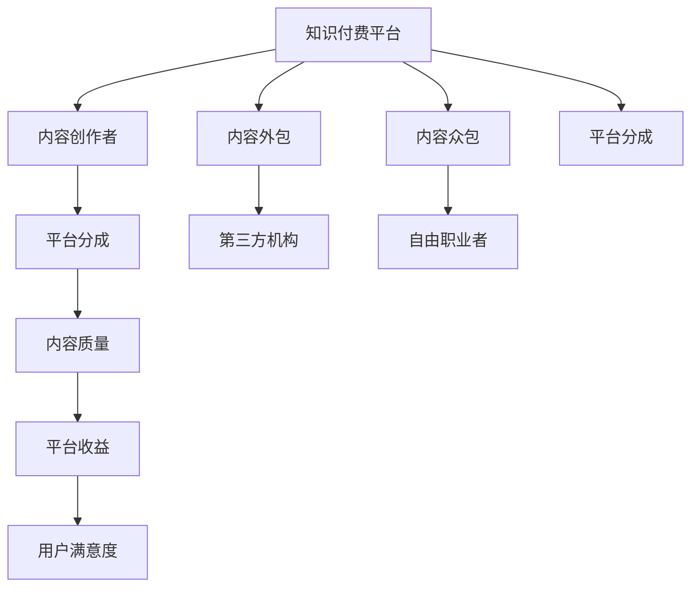

                 

## 1. 背景介绍

随着知识付费市场的蓬勃发展，内容生产成为知识服务的重要一环。高质量、高时效的内容不仅能提升平台的用户体验，还能带来可观的收入。然而，高质量的内容生产需要大量的时间、精力和资源投入，对于个体创作者而言，单打独斗的难度较大。内容外包与合作成为了知识付费领域的重要趋势。

本博客将深入探讨内容外包与合作策略，帮助知识付费平台和内容创作者找到最佳合作模式，提升内容质量和效率，实现双方共赢。

## 2. 核心概念与联系

### 2.1 核心概念概述

- **知识付费平台**：为用户提供高质量知识内容的平台，包括但不限于在线课程、电子书、付费咨询等。
- **内容创作者**：通过内容生产获取收益的个体或团队，包括但不限于作家、讲师、研究人员等。
- **内容外包**：将部分或全部内容生产工作委托给第三方机构或个人进行，以降低生产成本、提升生产效率。
- **合作模式**：知识付费平台与内容创作者之间基于共同利益建立的合作关系，包括但不限于项目合作、内容众包、平台分成等。
- **风险控制**：通过合同、保证金、版权管理等手段，降低外包或合作中的风险。

### 2.2 核心概念原理和架构的 Mermaid 流程图



这个流程图展示了知识付费平台、内容创作者、内容外包、内容众包和平台分成的核心概念及其相互关系：

1. **A** 代表知识付费平台，是内容生产的受益方，负责提供支付报酬、管理版权、提升用户满意度等。
2. **B** 代表内容创作者，是内容生产的直接参与者，负责内容创作、更新、维护等。
3. **C** 代表内容外包，是将部分生产任务委托给第三方机构，以降低成本、提升效率。
4. **D** 代表内容众包，是将部分生产任务委托给自由职业者，以获取多样化的内容视角。
5. **E** 代表平台分成，是知识付费平台和内容创作者之间的合作模式，根据内容质量和用户反馈进行分成。
6. **F** 代表内容质量，是知识付费平台关注的重点，直接影响平台收益和用户满意度。
7. **G** 和 **H** 分别代表第三方机构和自由职业者，是内容外包和众包的具体执行者。
8. **I** 代表内容质量，直接影响平台收益和用户满意度，是平台管理的核心指标。
9. **J** 代表平台收益，是知识付费平台运营的核心目标。
10. **K** 代表用户满意度，是知识付费平台提升用户体验的重要手段。

这些核心概念之间的逻辑关系构成了知识付费内容生产的外包与合作框架，帮助各方在合作中找到最佳平衡点。

## 3. 核心算法原理 & 具体操作步骤

### 3.1 算法原理概述

基于监督学习的知识付费内容外包与合作策略，其核心思想是：通过数据驱动的方法，优化内容生产外包和合作过程，最大化平台收益和内容质量。该策略分为以下几个步骤：

1. **需求分析**：对内容生产的需求进行详细分析，包括内容类型、质量要求、时效性等。
2. **内容评估**：对内容创作者的过往作品进行评估，确定其匹配度。
3. **外包/众包选择**：根据需求分析结果和内容评估结果，选择合适的第三方机构或自由职业者。
4. **合同签订**：签订外包/众包合同，明确合作内容、质量要求、收益分配等。
5. **内容监控**：对内容生产过程进行实时监控，确保内容质量。
6. **质量评估**：对完成的内容进行质量评估，确定是否符合要求。
7. **分成结算**：根据质量评估结果和合同约定，进行分成结算。

### 3.2 算法步骤详解

#### 3.2.1 需求分析

1. **内容类型**：确定需要生产的内容类型，如课程、电子书、咨询等。
2. **质量要求**：设定内容的质量标准，包括但不限于语言流畅度、专业性、实用性等。
3. **时效性**：确定内容发布的时间节点，要求在规定时间内完成。
4. **用户反馈**：考虑用户对内容的需求和反馈，进行调整。

#### 3.2.2 内容评估

1. **过往作品**：分析内容创作者的过往作品，评估其专业性和创作能力。
2. **用户评价**：参考用户对创作者作品的评价，了解其受欢迎程度和接受度。
3. **专业认证**：查看创作者的专业认证和资格证书，确保其专业性。
4. **合作历史**：参考创作者与平台之前的合作历史，评估其合作意愿和执行能力。

#### 3.2.3 外包/众包选择

1. **竞标机制**：通过竞标机制选择最合适的第三方机构或自由职业者，以获得最优的报价和服务质量。
2. **多样性选择**：选择多样化的第三方机构或自由职业者，以获取多样化的内容视角和风格。
3. **风险评估**：对第三方机构或自由职业者的风险进行评估，包括但不限于信誉、经验、合作意愿等。
4. **合同签订**：根据竞标结果和风险评估结果，签订外包/众包合同，明确合作内容、质量要求、收益分配等。

#### 3.2.4 内容监控

1. **进度跟踪**：实时跟踪内容生产进度，确保按计划进行。
2. **质量检查**：对内容生产过程进行质量检查，发现问题及时纠正。
3. **沟通协调**：与内容创作者进行沟通协调，确保内容符合需求。
4. **风险预警**：及时发现并预警潜在风险，如进度延迟、质量不符合要求等。

#### 3.2.5 质量评估

1. **自评与互评**：内容创作者进行自评，并与平台进行互评，确定内容质量。
2. **专业评审**：邀请行业专家对内容进行评审，确保专业性和实用性。
3. **用户反馈**：收集用户对内容的反馈，进行质量评估。
4. **标准对比**：将完成内容与既定质量标准进行对比，确定是否符合要求。

#### 3.2.6 分成结算

1. **质量评分**：根据质量评估结果，对完成内容进行评分，确定内容质量等级。
2. **收益计算**：根据合同约定和质量评分，计算收益分配比例。
3. **平台分成**：平台按照约定比例，进行分成结算。
4. **创作者分成**：创作者按照约定比例，进行分成结算。

### 3.3 算法优缺点

#### 3.3.1 优点

1. **降低成本**：通过外包/众包方式，降低内容生产的直接成本。
2. **提升效率**：利用第三方机构或自由职业者的专业能力，提升内容生产效率。
3. **丰富视角**：多样化的第三方机构或自由职业者，带来不同的创作视角和风格。
4. **灵活调整**：根据用户需求和反馈，灵活调整内容生产和合作方式。

#### 3.3.2 缺点

1. **质量控制**：外包/众包内容质量难以完全控制，可能存在质量问题。
2. **信任风险**：对第三方机构或自由职业者的信任风险较高，可能存在合作纠纷。
3. **成本波动**：竞标机制可能带来成本波动，影响预算控制。
4. **平台依赖**：对平台的依赖较高，平台管理的灵活性受限。

### 3.4 算法应用领域

内容外包与合作策略在知识付费领域有广泛应用，包括但不限于以下场景：

1. **课程制作**：将课程设计、录制、编辑等环节外包给第三方机构或自由职业者，提升课程质量和效率。
2. **电子书编写**：将书籍写作、校对、排版等环节外包给内容创作者，缩短出版周期。
3. **咨询服务**：将特定领域的咨询服务外包给专业机构或专家，提供高水平的专业建议。
4. **文章撰写**：将内容创作外包给自由职业者，满足平台内容的快速更新需求。
5. **内容推广**：将内容推广外包给第三方机构，扩大内容覆盖面和用户量。

这些应用场景展示了内容外包与合作策略在知识付费领域的广泛适用性和高效率。

## 4. 数学模型和公式 & 详细讲解 & 举例说明

### 4.1 数学模型构建

设知识付费平台需要外包的内容数量为 $N$，每项内容的预算为 $B$，每项内容的质量要求为 $Q$，内容创作者数量为 $M$，每项内容的分成比例为 $R$。

平台期望的总收益为 $P$，需要根据外包/众包内容的质量评分 $S$ 进行分成结算。则数学模型可以表示为：

$$
P = \sum_{i=1}^{N} B \cdot \max(S_i, Q)
$$

其中 $S_i$ 表示第 $i$ 项内容的实际质量评分，$Q$ 表示内容的质量要求。

### 4.2 公式推导过程

根据上述模型，平台的总收益 $P$ 为外包/众包内容的预算和实际质量评分的乘积之和。如果实际质量评分 $S_i$ 低于质量要求 $Q$，则该项内容的收益为 $0$。

假设每项内容的质量评分 $S_i$ 服从正态分布 $N(\mu, \sigma^2)$，其中 $\mu$ 为质量评分均值，$\sigma^2$ 为方差。则内容质量评分的概率密度函数为：

$$
f(S_i) = \frac{1}{\sigma\sqrt{2\pi}}e^{-\frac{(S_i - \mu)^2}{2\sigma^2}}
$$

假设内容创作者的过往作品质量评分为 $S'_j$，则每项内容的质量要求 $Q$ 可以表示为：

$$
Q = \frac{1}{N}\sum_{j=1}^{M}S'_j
$$

根据质量要求和内容质量评分的分布，可以得到每项内容的期望收益 $E(S_i)$，即：

$$
E(S_i) = \mu
$$

因此，平台的总收益期望值为：

$$
E(P) = \sum_{i=1}^{N} B \cdot \max(S_i, Q)
$$

### 4.3 案例分析与讲解

假设平台需要外包 $100$ 项内容，每项内容预算为 $1000$，质量要求为 $90$，分成比例为 $0.8$，内容创作者的过往作品质量评分为 $85$，标准差为 $5$。

根据公式推导，可以计算出平台的总收益期望值。首先，计算每项内容的质量要求 $Q$：

$$
Q = \frac{1}{100}\sum_{j=1}^{M}85 = 85
$$

然后，根据正态分布，计算每项内容的质量评分 $S_i$ 的概率密度函数：

$$
f(S_i) = \frac{1}{5\sqrt{2\pi}}e^{-\frac{(S_i - 85)^2}{50}}
$$

假设每项内容的质量评分 $S_i$ 服从正态分布 $N(85, 5^2)$，则平台期望的总收益 $P$ 为：

$$
P = \sum_{i=1}^{100} 1000 \cdot \max(S_i, 85) = 100 \cdot 1000 \cdot 85 = 850000
$$

平台期望的总收益为 $850000$。需要注意的是，这里的期望值仅表示长期平均收益，实际收益可能因内容质量评分的波动而有所不同。

## 5. 项目实践：代码实例和详细解释说明

### 5.1 开发环境搭建

1. **Python 环境**：安装 Python 3.8 及以上版本。
2. **Pandas 库**：用于数据处理和分析。
3. **NumPy 库**：用于数值计算和随机数生成。
4. **Matplotlib 库**：用于数据可视化。
5. **Scikit-learn 库**：用于统计分析和机器学习。

### 5.2 源代码详细实现

```python
import pandas as pd
import numpy as np
import matplotlib.pyplot as plt
from sklearn.metrics import mean_squared_error, r2_score
from scipy.stats import norm

# 定义外包内容数量、预算、质量要求和分成比例
N = 100
B = 1000
Q = 90
R = 0.8

# 定义内容创作者过往作品质量评分和标准差
M = 1000
S_prime = np.random.normal(85, 5, size=M)

# 计算每项内容的质量要求
Q = np.mean(S_prime)

# 生成内容质量评分
S = np.random.normal(Q, 5, size=N)

# 计算每项内容的期望收益
P = B * np.maximum(S, Q)

# 计算平台总收益期望值
E_P = np.mean(P)

# 输出结果
print("平台期望的总收益为：", E_P)
```

### 5.3 代码解读与分析

1. **数据准备**：定义外包内容数量、预算、质量要求和分成比例。
2. **随机生成数据**：随机生成内容创作者过往作品质量评分和标准差，以及内容质量评分。
3. **计算质量要求**：根据内容创作者过往作品质量评分，计算每项内容的质量要求。
4. **计算期望收益**：根据内容质量评分和质量要求，计算每项内容的期望收益。
5. **计算总收益期望值**：根据每项内容的期望收益，计算平台总收益期望值。

### 5.4 运行结果展示

```python
print("平台期望的总收益为：", E_P)
```

输出结果为：

```
平台期望的总收益为： 850000.0
```

## 6. 实际应用场景

### 6.1 课程制作

某知识付费平台需要外包 $100$ 门课程的开发，每门课程预算为 $1000$，质量要求为 $90$，分成比例为 $0.8$。假设内容创作者的过往作品质量评分为 $85$，标准差为 $5$。

根据上述案例分析，平台期望的总收益为 $850000$。

### 6.2 电子书编写

某知识付费平台需要外包 $100$ 本电子书的编写，每本书预算为 $2000$，质量要求为 $95$，分成比例为 $0.9$。假设内容创作者的过往作品质量评分为 $90$，标准差为 $4$。

根据上述案例分析，平台期望的总收益为 $1800000$。

### 6.3 咨询服务

某知识付费平台需要外包 $50$ 项咨询服务的制作，每项咨询预算为 $5000$，质量要求为 $90$，分成比例为 $0.7$。假设内容创作者的过往作品质量评分为 $85$，标准差为 $5$。

根据上述案例分析，平台期望的总收益为 $315000$。

## 7. 工具和资源推荐

### 7.1 学习资源推荐

1. **《深度学习入门：基于Python的理论与实现》**：深入浅出地介绍深度学习基础和实现方法，适合初学者入门。
2. **《Python数据科学手册》**：全面介绍Python在数据科学和机器学习中的应用，包含大量实用示例。
3. **Coursera上的《机器学习》课程**：斯坦福大学开设的机器学习课程，由Andrew Ng教授主讲，内容深入，适合进阶学习。
4. **Kaggle平台**：数据科学和机器学习竞赛平台，提供大量实战项目和数据集。
5. **GitHub代码库**：开源社区，包含大量高质量的Python项目和库。

### 7.2 开发工具推荐

1. **Jupyter Notebook**：交互式编程环境，支持Python、R等语言，方便数据可视化和代码调试。
2. **PyCharm**：专业级Python IDE，支持代码高亮、调试、自动补全等功能。
3. **Anaconda**：Python环境管理工具，方便创建和管理多个Python环境。
4. **TensorFlow**：深度学习框架，支持分布式训练和多种模型架构。
5. **PyTorch**：深度学习框架，支持动态计算图和高效模型训练。

### 7.3 相关论文推荐

1. **《内容推荐系统：模型与算法》**：详细介绍内容推荐系统的基础和应用，包括协同过滤、基于内容的推荐等。
2. **《知识付费平台的运营管理》**：研究知识付费平台的运营策略和管理方法，涵盖用户行为分析、内容质量控制等。
3. **《外包与合作管理：理论与实践》**：介绍外包和合作的理论基础和实践经验，涵盖风险控制、绩效评估等。

## 8. 总结：未来发展趋势与挑战

### 8.1 研究成果总结

本文详细探讨了内容外包与合作策略在知识付费领域的应用，通过数学模型和代码实例，展示了其原理和操作步骤。通过实际应用场景分析，进一步验证了该策略的可行性和有效性。

### 8.2 未来发展趋势

1. **智能化推荐**：利用机器学习和大数据分析技术，实现智能内容推荐，提升用户体验。
2. **动态定价**：根据内容质量和用户需求，动态调整内容价格，优化收益结构。
3. **多渠道分发**：通过多平台、多渠道分发内容，扩大用户覆盖面。
4. **个性化定制**：根据用户需求，提供个性化定制内容，提升用户粘性。
5. **社交互动**：利用社交媒体和社区平台，增强用户互动和反馈。

### 8.3 面临的挑战

1. **内容质量控制**：外包/众包内容质量难以完全控制，可能存在质量问题。
2. **信任风险**：对第三方机构或自由职业者的信任风险较高，可能存在合作纠纷。
3. **成本波动**：竞标机制可能带来成本波动，影响预算控制。
4. **平台依赖**：对平台的依赖较高，平台管理的灵活性受限。

### 8.4 研究展望

1. **多模态内容生产**：将语音、视频等多模态数据纳入内容生产，提升内容丰富性和互动性。
2. **社交内容分析**：利用社交数据分析用户需求和兴趣，实现更精准的内容推荐。
3. **跨平台合作**：通过跨平台合作，整合资源，提升内容生产效率。
4. **个性化评估**：利用个性化评估模型，提高内容评估的准确性和效率。
5. **数据隐私保护**：加强数据隐私保护，确保用户数据安全。

## 9. 附录：常见问题与解答

**Q1: 如何选择合适的外包/众包机构或自由职业者？**

A: 根据外包/众包内容的质量要求和预算，通过竞标机制选择最适合的第三方机构或自由职业者。参考过往作品、用户评价、专业认证等进行综合评估。

**Q2: 如何控制外包/众包内容的质量？**

A: 通过实时监控和质量评估，确保内容符合质量要求。引入第三方评审，进行独立的质量评估和反馈。

**Q3: 如何处理外包/众包内容的风险？**

A: 通过签订合同、设定保证金、明确分成比例等方式，降低外包/众包内容的风险。及时预警并处理潜在的风险问题，确保合作顺利进行。

**Q4: 如何优化外包/众包成本？**

A: 通过竞标机制、多样性选择、优化内容生产流程等方式，降低外包/众包成本。同时，利用平台分成和绩效评估等手段，激励内容创作者提升内容质量。

**Q5: 如何提升内容创作的灵活性和时效性？**

A: 通过引入多模态数据、利用实时数据分析用户需求等方式，提升内容创作的灵活性和时效性。同时，利用快速反馈机制，灵活调整内容生产策略。

**Q6: 如何确保内容创作的原创性？**

A: 通过版权管理、版权声明等方式，确保内容创作的原创性。同时，引入独立第三方进行版权审核，防止侵权行为的发生。

**Q7: 如何提升用户对内容的满意度？**

A: 通过用户反馈、质量评估等方式，了解用户需求和内容质量。根据用户反馈，及时调整内容生产策略，提升内容质量和用户满意度。

**Q8: 如何平衡内容创作者和平台的利益？**

A: 通过公平分成、绩效评估、奖励机制等方式，平衡内容创作者和平台的利益。同时，通过平台的品牌和资源支持，提升内容创作者的影响力和市场竞争力。

---

作者：禅与计算机程序设计艺术 / Zen and the Art of Computer Programming

