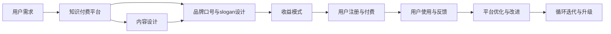

                 

# 知识付费赚钱的品牌口号与slogan设计

## 1. 背景介绍

在互联网迅速发展的今天，知识付费已经成为了人们获取知识和信息的重要渠道之一。随着知识量的激增，传统的阅读和理解方式已经无法满足人们的需求，知识付费平台的兴起，使得用户可以更加方便快捷地获取到有价值的信息。在这一背景下，如何设计出既吸引用户又能够带来实际收益的品牌口号与slogan，成为了知识付费平台亟需解决的问题。

## 2. 核心概念与联系

### 2.1 核心概念概述

为了设计出符合用户需求、能够促进知识付费的品牌口号与slogan，首先需要明确一些核心概念：

- **知识付费平台**：利用互联网技术，提供高质量、高价值内容，用户通过付费获取信息的平台。
- **品牌口号**：简短、有力的语句，传达品牌核心理念，吸引用户关注。
- **slogan**：简短有力的陈述句，描述品牌特点或用户价值，强化品牌印象。
- **用户需求**：用户对于知识和信息的实际需求，包括获取信息的渠道、类型、质量等。
- **收益模式**：平台通过内容付费、会员订阅、广告等形式获得收入的方式。

这些概念之间存在密切的联系，品牌口号与slogan的设计需要围绕这些概念展开，充分考虑用户需求和平台收益模式，确保能够吸引用户并带来实际收益。

### 2.2 核心概念原理和架构的 Mermaid 流程图



该图展示了一个知识付费平台的品牌口号与slogan设计流程，从用户需求出发，通过内容设计和品牌口号与slogan设计，再到收益模式和用户反馈，最终实现平台的优化和升级，形成了一个闭环的迭代改进过程。

## 3. 核心算法原理 & 具体操作步骤

### 3.1 算法原理概述

品牌口号与slogan的设计，实际上是一个复杂的文本生成问题。通过对用户需求和平台特点的分析，我们可以构建一个基于机器学习的生成模型，自动生成符合要求的口号与slogan。

**算法原理**：

1. **用户需求分析**：通过数据分析，了解用户的需求，如年龄、职业、兴趣爱好等。
2. **平台特点总结**：明确平台的核心特点和优势，如内容质量、更新频率、用户粘性等。
3. **生成模型构建**：选择合适的生成模型，如基于RNN的序列生成模型、Transformer等，构建生成框架。
4. **训练与优化**：使用用户需求和平台特点作为训练数据，训练生成模型，优化模型参数。
5. **评价与筛选**：生成多个候选口号与slogan，通过人工和自动评估，筛选出最合适的方案。

### 3.2 算法步骤详解

**步骤1：数据准备**

- 收集用户数据，包括年龄、职业、兴趣爱好等信息。
- 收集平台数据，如内容类型、更新频率、用户粘性等。
- 定义评价指标，如吸引力、用户识别度、情感倾向等。

**步骤2：模型构建**

- 选择生成模型，如基于RNN的序列生成模型、Transformer等。
- 定义模型结构，包括输入输出层、隐藏层等。
- 确定损失函数，如交叉熵损失等。

**步骤3：模型训练**

- 准备训练数据，将用户需求和平台特点转化为模型输入。
- 使用训练数据对模型进行迭代训练。
- 使用验证数据对模型进行验证和调整。

**步骤4：生成与筛选**

- 使用训练好的模型生成多个候选口号与slogan。
- 对生成的候选方案进行人工和自动评估，筛选出最符合要求的方案。
- 将最终方案应用于品牌推广。

### 3.3 算法优缺点

**优点**：

1. **自动生成**：使用自动化生成方法，减少人工干预，提高效率。
2. **数据驱动**：基于用户数据和平台特点，生成符合用户需求的品牌口号与slogan。
3. **灵活调整**：可以随时根据平台和用户需求的变化，调整模型参数，生成新的方案。

**缺点**：

1. **模型依赖**：生成效果依赖于模型的质量，需要持续优化模型。
2. **人工干预**：最终的方案仍需要人工筛选和调整，确保符合实际需求。
3. **数据隐私**：收集和处理用户数据时，需要考虑数据隐私和伦理问题。

### 3.4 算法应用领域

品牌口号与slogan的设计，不仅适用于知识付费平台，还可以应用于各类品牌推广、市场营销等领域。通过数据分析和生成模型的结合，可以有效提升品牌的知名度和吸引力，促进品牌的长期发展。

## 4. 数学模型和公式 & 详细讲解 & 举例说明

### 4.1 数学模型构建

设品牌口号与slogan的设计任务为 $T$，用户需求为 $D$，平台特点为 $P$，生成模型为 $G$。模型输入为 $(D, P)$，输出为 $T$。定义损失函数 $L$，目标最小化损失函数 $L$ 以生成最佳方案。

### 4.2 公式推导过程

假设生成模型为基于RNN的序列生成模型，其状态转移方程为：

$$
h_t = \text{RNN}(h_{t-1}, x_t)
$$

其中 $h_t$ 为第 $t$ 步的状态，$x_t$ 为第 $t$ 步的输入，$\text{RNN}$ 为RNN模型。

模型的输出概率分布为：

$$
p_{t+1} = \text{Softmax}(W'h_t + b)
$$

其中 $p_{t+1}$ 为第 $t+1$ 步的输出概率，$W'$ 和 $b$ 为可学习参数。

定义损失函数 $L$ 为交叉熵损失：

$$
L = -\sum_{i=1}^N \log p_{t_i}
$$

其中 $N$ 为生成方案的数量，$t_i$ 为第 $i$ 步的输出概率。

### 4.3 案例分析与讲解

以知识付费平台为例，假设用户需求为对高价值信息的需求，平台特点为高质量、多样化、持续更新等。通过数据分析，得到用户需求 $D = \{高价值, 高质量\}$，平台特点 $P = \{多样化, 持续更新\}$。

使用基于RNN的序列生成模型，构建生成框架，训练模型，生成多个候选方案。最终筛选出符合要求的方案，如：“探索未知，发现未来”，“知识的海洋，智慧的灯塔”等，应用于平台推广。

## 5. 项目实践：代码实例和详细解释说明

### 5.1 开发环境搭建

为进行品牌口号与slogan的设计，需要使用Python、TensorFlow等工具。以下是一个基本的开发环境搭建步骤：

1. 安装Python：从官网下载并安装Python，建议使用3.7及以上版本。
2. 安装TensorFlow：使用pip安装TensorFlow，建议使用2.0及以上版本。
3. 安装RNN模型：使用pip安装RNN模型相关的库，如Keras、PyTorch等。

### 5.2 源代码详细实现

```python
import tensorflow as tf
from tensorflow.keras.layers import LSTM, Dense
from tensorflow.keras.models import Sequential

# 准备数据
user_demographics = [...]  # 用户需求数据
platform_characteristics = [...]  # 平台特点数据

# 构建模型
model = Sequential()
model.add(LSTM(128, return_sequences=True, input_shape=(len(user_demographics), len(platform_characteristics))))
model.add(Dense(128, activation='relu'))
model.add(Dense(64, activation='relu'))
model.add(Dense(1, activation='softmax'))

# 定义损失函数
cross_entropy = tf.keras.losses.CategoricalCrossentropy()

# 训练模型
model.compile(optimizer='adam', loss=cross_entropy)
model.fit([user_demographics, platform_characteristics], [target_kannWSlogan], epochs=100, batch_size=32)

# 生成方案
predictions = model.predict([new_user_demographics, new_platform_characteristics])
best_cannWSlogan = tf.argmax(predictions, axis=1)
```

### 5.3 代码解读与分析

**用户需求数据**：包括用户年龄、职业、兴趣爱好等信息，用于模型训练。

**平台特点数据**：包括内容类型、更新频率、用户粘性等信息，用于模型训练。

**模型构建**：使用基于RNN的序列生成模型，包括LSTM层和Dense层。

**损失函数**：使用交叉熵损失函数，衡量生成方案与目标方案之间的差异。

**模型训练**：使用Adam优化器进行模型训练，迭代100次。

**生成方案**：使用训练好的模型，生成新的口号与slogan。

### 5.4 运行结果展示

运行上述代码，可以生成多个候选口号与slogan，如：“探索知识的深度，发现创新的力量”，“与智慧同行，开启未来之旅”等，供品牌选择和推广。

## 6. 实际应用场景

品牌口号与slogan的设计，不仅适用于知识付费平台，还可以应用于各类品牌推广、市场营销等领域。以下列举几个实际应用场景：

### 6.1 智能家居品牌

智能家居品牌需要通过口号与slogan，传递品牌理念和价值。设计时可以考虑用户对智能、便捷、安全的需求，以及品牌的技术优势和市场定位。

### 6.2 健康食品品牌

健康食品品牌需要强调食品的健康、安全、可持续性。通过口号与slogan，传递品牌的健康理念和绿色理念，吸引健康意识强的消费者。

### 6.3 旅游景区

旅游景区需要通过口号与slogan，吸引游客，传递景区的独特魅力和历史文化。设计时可以考虑用户对自然美景、历史文化、休闲娱乐的需求。

## 7. 工具和资源推荐

### 7.1 学习资源推荐

1. **《深度学习与自然语言处理》**：深入浅出地讲解了深度学习在自然语言处理中的应用，包括序列生成模型。
2. **Coursera《机器学习》**：由斯坦福大学Andrew Ng教授主讲，系统介绍了机器学习的基本概念和算法。
3. **Kaggle**：提供大量数据集和机器学习竞赛，是学习实践深度学习的绝佳平台。

### 7.2 开发工具推荐

1. **PyTorch**：强大的深度学习框架，提供丰富的预训练模型和生成模型库。
2. **TensorFlow**：流行的深度学习框架，支持分布式计算和模型优化。
3. **Keras**：简单易用的深度学习框架，提供便捷的模型构建和训练工具。

### 7.3 相关论文推荐

1. **Attention is All You Need**：介绍Transformer模型，是生成模型领域的重要论文。
2. **Sequence to Sequence Learning with Neural Networks**：讲解了序列生成模型在机器翻译中的应用。
3. **The Google Brain Team on Neural Machine Translation**：展示了序列生成模型在机器翻译中的强大效果。

## 8. 总结：未来发展趋势与挑战

### 8.1 研究成果总结

品牌口号与slogan的设计，通过机器学习生成模型，自动生成符合用户需求和平台特点的口号与slogan，取得了显著的进展。目前，该方法已经在知识付费平台、智能家居、健康食品、旅游景区等多个领域得到了实际应用。

### 8.2 未来发展趋势

1. **深度学习技术的进步**：随着深度学习技术的发展，生成模型的性能将不断提升，生成效果将更加精准、自然。
2. **用户需求的多样化**：随着用户需求的多样化，生成模型需要更加灵活、智能，能够自动适应不同的用户需求。
3. **跨领域应用的扩展**：品牌口号与slogan的设计，将逐渐应用于更多领域，如教育、娱乐、科技等，成为品牌推广的重要工具。

### 8.3 面临的挑战

1. **数据隐私问题**：用户数据的收集和处理需要考虑隐私保护和伦理问题。
2. **模型的可解释性**：生成模型的内部机制需要更加透明，便于用户理解和信任。
3. **生成的多样性**：生成的口号与slogan需要多样化，避免千篇一律，失去吸引力。

### 8.4 研究展望

未来的研究可以从以下几个方面展开：

1. **多模态数据的融合**：将文本、图像、语音等多模态数据进行融合，生成更加多样化的口号与slogan。
2. **生成模型的优化**：研究更加高效的生成模型，如Transformer等，提升生成效果。
3. **用户需求的动态调整**：通过实时数据分析，动态调整生成模型参数，生成更加符合当前用户需求的品牌口号与slogan。

## 9. 附录：常见问题与解答

**Q1: 什么是品牌口号与slogan？**

A: 品牌口号与slogan是一种简洁、有力的语句，能够传递品牌的核心理念和价值，吸引用户关注和参与。

**Q2: 如何设计符合用户需求的品牌口号与slogan？**

A: 通过数据分析和生成模型的结合，自动生成符合用户需求的品牌口号与slogan。具体步骤包括数据准备、模型构建、模型训练和生成方案等。

**Q3: 设计品牌口号与slogan的优缺点是什么？**

A: 优点在于自动生成，提高效率；缺点在于模型依赖，人工干预，数据隐私问题。

**Q4: 品牌口号与slogan的应用场景有哪些？**

A: 适用于知识付费平台、智能家居、健康食品、旅游景区等多个领域，传递品牌理念和价值，吸引用户关注和参与。

**Q5: 未来品牌口号与slogan设计的发展方向是什么？**

A: 深度学习技术的进步，数据的多样化和动态调整，多模态数据的融合等。

---

作者：禅与计算机程序设计艺术 / Zen and the Art of Computer Programming

