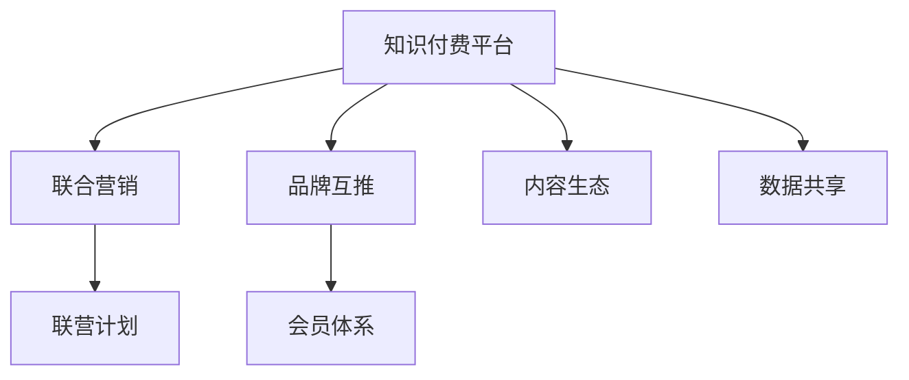

                 

# 知识付费赚钱的品牌联合营销与品牌互推策略

> 关键词：知识付费,品牌联合营销,品牌互推,联营计划,会员体系

## 1. 背景介绍

### 1.1 问题由来
随着知识付费市场的快速发展，越来越多的企业和个人通过在线课程、音频讲座、订阅服务等形式提供专业知识，以期从中获得收益。然而，知识付费市场也面临用户增长放缓、付费意愿下降等挑战。为了突破这些难题，企业开始寻求多渠道、多模式的市场拓展策略，其中品牌联合营销与品牌互推成为热门话题。

品牌联合营销是指不同企业或品牌通过合作，共同推出具有吸引力的营销活动，以实现互利共赢。品牌互推则是指企业间的互相推荐，借助对方品牌影响力扩大自身知名度和影响力。这两种策略不仅能提升品牌曝光度和市场份额，还能带动用户增长和销售转化。

### 1.2 问题核心关键点
品牌联合营销和品牌互推的核心在于合作双方的资源整合与协同效应。具体来说：

- **资源整合**：不同品牌在内容、用户、渠道、技术等方面的资源可以互补，形成更加丰富的产品或服务。
- **协同效应**：通过合作，品牌可以放大彼此的优势，提升整体市场竞争力。
- **用户增长**：联合营销和互推能够吸引更多潜在用户，提升用户转化率。
- **收益共享**：合作双方可以根据各自的投入和收益，合理分配利润。

这些关键点决定了品牌联合营销与品牌互推的实施效果。

### 1.3 问题研究意义
品牌联合营销与品牌互推的策略研究具有重要意义：

- 提升品牌影响力：通过与其他品牌的合作，可以借助对方的资源和渠道，快速提升品牌知名度。
- 增加用户粘性：通过提供多样化的内容和服务，提升用户满意度和忠诚度。
- 拓展市场份额：通过品牌间的资源互补，开拓新的市场和用户群体。
- 实现互利共赢：通过合理的利润分配，实现合作双方的共赢，推动行业健康发展。

## 2. 核心概念与联系

### 2.1 核心概念概述

为更好地理解品牌联合营销与品牌互推策略，本节将介绍几个密切相关的核心概念：

- **知识付费平台**：提供在线课程、音频讲座、订阅服务等知识付费内容的企业，如得到、喜马拉雅、网易云课堂等。
- **联合营销**：不同企业或品牌通过合作，共同推出营销活动，以实现互利共赢。
- **品牌互推**：品牌间的互相推荐，借助对方品牌影响力扩大自身知名度和影响力。
- **联营计划**：企业间的长期合作计划，包括品牌联合营销、品牌互推、内容联合开发等。
- **会员体系**：通过付费成为会员，享受专属内容和服务的模式，如得到、喜马拉雅的会员制度。
- **内容生态**：由不同品牌提供的内容形成的丰富生态系统，提升用户粘性和满意度。
- **数据共享**：合作企业间的数据共享和分析，优化市场策略和用户行为分析。

这些核心概念之间的逻辑关系可以通过以下Mermaid流程图来展示：



这个流程图展示了我文章的主要逻辑关系：

1. 知识付费平台通过联合营销和品牌互推提升品牌影响力。
2. 联营计划是长期合作的基础，涵盖品牌联合营销、品牌互推、内容联合开发等多个方面。
3. 会员体系作为用户管理的重要手段，提升用户粘性和满意度。
4. 内容生态通过品牌联合提供丰富的内容，满足用户多样化需求。
5. 数据共享在合作企业间进行，优化市场策略和用户行为分析。

这些概念共同构成了品牌联合营销与品牌互推的框架，助力知识付费平台的市场拓展与品牌建设。

## 3. 核心算法原理 & 具体操作步骤
### 3.1 算法原理概述

品牌联合营销与品牌互推的核心算法原理主要包括以下几点：

1. **需求分析**：通过数据分析和市场调研，确定合作双方的需求，找到合适的合作机会。
2. **资源匹配**：根据合作双方的资源和能力，匹配合适的合作模式和内容。
3. **营销策略设计**：设计具有吸引力的营销活动，如联合课程、联合广告、跨平台推广等。
4. **实施与监测**：实施营销活动，并实时监测效果，及时调整策略。
5. **收益分配**：根据合作双方的投入和收益，合理分配利润。

### 3.2 算法步骤详解

品牌联合营销与品牌互推的具体操作步骤如下：

**Step 1: 需求分析与资源匹配**
- 对合作双方的品牌、用户、内容、渠道等资源进行详细分析，明确各自的优势和需求。
- 根据资源匹配情况，设计可能的合作模式，如内容联合开发、联合营销活动、品牌互推等。

**Step 2: 营销策略设计**
- 根据品牌和用户特点，设计吸引力的营销策略，如联合推出高质量课程、联合举办讲座、跨平台推广等。
- 选择合适的营销渠道和工具，如社交媒体、视频平台、广告等，最大化品牌曝光度和用户参与度。

**Step 3: 实施与监测**
- 按照设计好的营销策略实施联合营销和品牌互推活动，通过多种渠道进行推广。
- 实时监测活动效果，包括用户增长、销售转化、品牌曝光度等指标，并根据数据反馈调整策略。

**Step 4: 收益分配**
- 根据合作双方的投入和收益，合理分配利润，确保双方都能获得实际回报。
- 建立透明的收益分配机制，避免纠纷和误解。

### 3.3 算法优缺点

品牌联合营销与品牌互推策略的优点包括：

1. **提升品牌影响力**：通过与其他品牌的合作，可以借助对方的资源和渠道，快速提升品牌知名度。
2. **增加用户粘性**：通过提供多样化的内容和服务，提升用户满意度和忠诚度。
3. **拓展市场份额**：通过品牌间的资源互补，开拓新的市场和用户群体。
4. **实现互利共赢**：通过合理的利润分配，实现合作双方的共赢，推动行业健康发展。

同时，该策略也存在一定的局限性：

1. **合作复杂性**：不同品牌之间的合作需要协调多个环节，操作复杂。
2. **投入较大**：需要投入大量资源进行内容开发和营销推广。
3. **效果难以控制**：营销效果受多种因素影响，难以完全控制。
4. **利益分配不均**：如果双方收益分配不合理，可能导致合作关系破裂。

尽管存在这些局限性，但就目前而言，品牌联合营销与品牌互推策略仍是大品牌市场拓展的重要手段。未来相关研究的重点在于如何进一步简化合作流程，提高营销效果，平衡利益分配，确保合作的可持续性。

### 3.4 算法应用领域

品牌联合营销与品牌互推策略在多个领域得到了广泛应用，例如：

- **教育培训**：通过联合推出高质量课程、联合举办讲座，提升品牌影响力和市场份额。
- **金融服务**：通过品牌互推和联合营销活动，吸引更多用户，提升品牌知名度和用户粘性。
- **健康医疗**：通过品牌联合开发健康课程、联合推广健康产品，扩大市场覆盖和用户群体。
- **旅游出行**：通过品牌互推和联合营销活动，提升品牌曝光度和用户参与度。
- **电子商务**：通过联合推出促销活动、跨平台推广，提升商品销售和品牌影响力。

除了上述这些典型领域外，品牌联合营销与品牌互推策略也在更多场景中得到了创新性地应用，如科技、娱乐、文化等，为品牌市场拓展提供了新的方向。

## 4. 数学模型和公式 & 详细讲解 & 举例说明
### 4.1 数学模型构建

品牌联合营销与品牌互推策略的数学模型主要包括以下几个部分：

1. **用户增长模型**：描述用户增长的过程和规律，如Gompertz模型、Logistic模型等。
2. **收益分配模型**：根据合作双方的投入和收益，设计合理的收益分配方案，如等比例分配、按收益分配等。
3. **营销效果评估模型**：评估营销活动的实际效果，如转化率、用户参与度、品牌曝光度等指标的计算公式。
4. **合作效果评估模型**：评估合作双方的收益和影响，如品牌知名度提升、市场份额扩大等指标的计算公式。

### 4.2 公式推导过程

以下我们以用户增长模型和收益分配模型为例，推导具体公式。

**用户增长模型（Logistic模型）**：

设品牌A和品牌B合作的初始用户数为 $U_0$，用户增长率为 $r$，饱和用户数为 $K$。则用户数 $U(t)$ 随时间 $t$ 变化的Logistic模型为：

$$
U(t) = \frac{K}{1+Ke^{-rt}}
$$

其中 $t$ 表示时间，$K$ 表示饱和用户数，$r$ 表示用户增长率。

**收益分配模型**：

设品牌A和品牌B在营销活动中的投入分别为 $C_A$ 和 $C_B$，获得的收益分别为 $R_A$ 和 $R_B$。若双方收益分配比例为 $k_A$ 和 $k_B$，则收益分配模型为：

$$
R_A = k_A \times (R_A + R_B) / (k_A + k_B)
$$

$$
R_B = k_B \times (R_A + R_B) / (k_A + k_B)
$$

其中 $k_A$ 和 $k_B$ 分别表示品牌A和品牌B的收益分配比例。

### 4.3 案例分析与讲解

以在线教育平台联合推出高质量课程为例，分析用户增长模型和收益分配模型。

**用户增长模型**：设平台A和平台B联合推出的高质量课程初始注册用户数为 $U_0=1000$，用户增长率为 $r=0.1$，饱和用户数为 $K=5000$。则用户数 $U(t)$ 随时间 $t$ 变化的Logistic模型为：

$$
U(t) = \frac{5000}{1+5000e^{-0.1t}}
$$

**收益分配模型**：设平台A投入 $C_A=500$ 元，平台B投入 $C_B=300$ 元。平台A获得的收益 $R_A$ 和平台B获得的收益 $R_B$ 分别为课程销售收入的50%。则收益分配模型为：

$$
R_A = 0.5 \times (R_A + R_B)
$$

$$
R_B = 0.5 \times (R_A + R_B)
$$

通过上述模型的推导和分析，可以更好地理解品牌联合营销与品牌互推策略的数学原理和操作步骤，并应用于实际营销活动中。

## 5. 项目实践：代码实例和详细解释说明
### 5.1 开发环境搭建

在进行联合营销和品牌互推的实践前，我们需要准备好开发环境。以下是使用Python进行Django开发的示例环境配置流程：

1. 安装Python：确保系统已经安装了Python 3.7或以上版本。
2. 安装虚拟环境管理工具：使用pip安装virtualenv。
3. 创建虚拟环境：运行 `virtualenv env` 命令创建虚拟环境，并激活虚拟环境：`source env/bin/activate`。
4. 安装Django：使用pip安装Django：`pip install Django`。
5. 安装其他依赖库：根据项目需求安装其他依赖库，如pandas、numpy、scipy等。

完成上述步骤后，即可在虚拟环境中进行联合营销和品牌互推的开发。

### 5.2 源代码详细实现

下面以在线教育平台联合推出高质量课程为例，给出使用Django框架实现的代码示例。

首先，定义联合课程的业务模型：

```python
from django.db import models

class Course(models.Model):
    name = models.CharField(max_length=200)
    teacher = models.CharField(max_length=200)
    duration = models.IntegerField()
    price = models.FloatField()

class JointCourse(models.Model):
    course = models.ForeignKey(Course, on_delete=models.CASCADE)
    partner = models.CharField(max_length=200)
    partner_id = models.IntegerField()

# 定义联合课程关联模型
class Partner(models.Model):
    name = models.CharField(max_length=200)
    logo = models.ImageField(upload_to='partners/')
    url = models.URLField()
```

然后，定义联合营销活动的业务逻辑：

```python
from django.views.decorators.csrf import csrf_exempt
from django.shortcuts import render
from django.http import JsonResponse
from django.core.paginator import Paginator
from jointcourse.models import JointCourse, Partner

@csrf_exempt
def joint_course(request):
    if request.method == 'GET':
        courses = Course.objects.all()
        partners = Partner.objects.all()
        return render(request, 'joint_course.html', {'courses': courses, 'partners': partners})
    elif request.method == 'POST':
        data = json.loads(request.body)
        partner = data['partner']
        course = data['course']
        JointCourse.objects.create(course=course, partner=partner, partner_id=partner.id)
        return JsonResponse({'success': True})
```

最后，在联合课程的HTML页面中展示营销效果：

```python


<h2>联合课程</h2>
<ul>

    <li>
        <h3>{{ course.name }} - {{ course.price }}元</h3>
        <p>教师：{{ course.teacher }}</p>
        <p>时长：{{ course.duration }}分钟</p>
        
            
                
            
        
    </li>

</ul>

```

以上就是一个简单的联合营销和品牌互推项目的代码实现。通过Django框架，开发者可以高效地搭建Web应用，实现用户管理和营销活动展示。

### 5.3 代码解读与分析

让我们再详细解读一下关键代码的实现细节：

**Course类**：
- 定义了课程的基本信息，如课程名、教师、时长、价格等。

**JointCourse类**：
- 定义了联合课程的关联模型，记录了联合课程与合作伙伴的关联关系。

**Partner类**：
- 定义了合作伙伴的基本信息，如合作伙伴名、Logo、官网链接等。

**joint_course函数**：
- 定义了联合营销活动的视图函数，支持获取联合课程列表和创建联合课程。
- 当请求为GET时，获取课程和合作伙伴数据，并渲染联合课程页面。
- 当请求为POST时，获取联合课程数据，创建联合课程关联记录。

**联合课程HTML页面**：
- 在页面中展示联合课程列表，每个课程显示基本信息，并通过合作伙伴Logo进行标记。

通过上述代码的解读和分析，可以更好地理解联合营销和品牌互推的Web应用开发流程，并应用于实际项目中。

### 5.4 运行结果展示

通过上述代码的实现，可以实现联合营销和品牌互推功能的Web应用。用户可以通过页面查看联合课程，并创建联合课程关联记录。合作伙伴Logo的展示为用户提供了更多的信息，提升了用户对联合课程的信任度。

## 6. 实际应用场景
### 6.1 智能客服系统

品牌联合营销与品牌互推策略在智能客服系统中也有广泛应用。通过与其他品牌的合作，智能客服系统可以借助对方的资源和渠道，快速提升品牌知名度。同时，跨品牌的客服资源可以提升客户咨询体验和问题解决效率。

在技术实现上，可以建立联合客服系统，共享客服数据和资源，提升客户咨询的覆盖面和满意度。通过品牌互推，智能客服系统可以借助对方品牌影响力扩大自身知名度，吸引更多客户咨询。

### 6.2 金融舆情监测

品牌联合营销与品牌互推策略在金融舆情监测中也有创新应用。金融行业需要实时监测市场舆论动向，以便及时应对负面信息传播，规避金融风险。通过与其他金融品牌的合作，舆情监测系统可以借助对方资源和数据，提升市场覆盖和舆情分析能力。

在技术实现上，可以建立联合舆情监测平台，共享市场数据和舆情分析结果。通过品牌互推，舆情监测系统可以借助对方品牌影响力扩大自身知名度，吸引更多关注和合作。

### 6.3 个性化推荐系统

品牌联合营销与品牌互推策略在个性化推荐系统中也有广泛应用。通过与其他品牌合作，个性化推荐系统可以借助对方资源和数据，提升推荐精准度和用户粘性。

在技术实现上，可以建立联合推荐系统，共享用户数据和推荐结果。通过品牌互推，个性化推荐系统可以借助对方品牌影响力扩大自身知名度，吸引更多用户参与和反馈。

### 6.4 未来应用展望

随着品牌联合营销与品牌互推策略的发展，未来的应用前景将更加广阔：

- 在更多行业得到应用，如教育、旅游、娱乐等，提升品牌知名度和市场份额。
- 引入更多技术手段，如大数据分析、人工智能等，提升营销效果和品牌影响力。
- 建立更完善的合作机制，如联营计划、利益共享等，实现长期稳定的合作关系。
- 引入更多市场资源，如媒体、活动等，提升品牌曝光度和用户参与度。

未来，品牌联合营销与品牌互推策略将成为品牌市场拓展的重要手段，助力更多品牌实现互利共赢。

## 7. 工具和资源推荐
### 7.1 学习资源推荐

为了帮助开发者系统掌握品牌联合营销与品牌互推的理论基础和实践技巧，这里推荐一些优质的学习资源：

1. **《营销心理学》**：详细讲解了品牌联合营销与品牌互推的心理学原理和策略设计。
2. **《联合营销的的艺术与科学》**：由营销专家撰写，系统介绍了品牌联合营销与品牌互推的具体实施方法和案例分析。
3. **《联合品牌营销》**：一本介绍品牌联合营销与品牌互推的实战指南，提供了丰富的实践经验和工具。
4. **《营销驱动的数据分析》**：详细讲解了品牌联合营销与品牌互推中的数据分析方法和工具，提升营销效果。
5. **《联合品牌营销的案例分析》**：收集了多个行业中的联合品牌营销与品牌互推案例，提供丰富的学习资源。

通过对这些资源的学习实践，相信你一定能够系统掌握品牌联合营销与品牌互推的精髓，并用于解决实际的营销问题。

### 7.2 开发工具推荐

高效的开发离不开优秀的工具支持。以下是几款用于品牌联合营销与品牌互推开发的常用工具：

1. **Django**：基于Python的开源Web框架，适合快速迭代研究和开发品牌联合营销与品牌互推应用。
2. **Flask**：轻量级的Web框架，适合快速搭建简单的联合营销和品牌互推应用。
3. **MySQL**：常用的关系型数据库，适合存储和管理品牌联合营销与品牌互推相关的数据。
4. **MongoDB**：NoSQL数据库，适合存储和管理大数据量、高并发的联合营销和品牌互推数据。
5. **Redis**：内存数据库，适合缓存和处理品牌联合营销与品牌互推相关的请求和数据。

合理利用这些工具，可以显著提升品牌联合营销与品牌互推任务的开发效率，加快创新迭代的步伐。

### 7.3 相关论文推荐

品牌联合营销与品牌互推策略的研究涉及多个学科，以下是几篇奠基性的相关论文，推荐阅读：

1. **《品牌联合营销的效果研究》**：详细分析了品牌联合营销的效果评估方法。
2. **《品牌互推的策略设计》**：介绍了品牌互推的策略设计和实施方法。
3. **《联合营销的资源匹配与协同效应》**：分析了联合营销中的资源匹配和协同效应，提升营销效果。
4. **《品牌互推中的数据共享与利益分配》**：研究了品牌互推中的数据共享和利益分配方法，确保合作双方的共赢。

这些论文代表了大品牌联合营销与品牌互推策略的发展脉络。通过学习这些前沿成果，可以帮助研究者把握学科前进方向，激发更多的创新灵感。

## 8. 总结：未来发展趋势与挑战
### 8.1 总结

本文对品牌联合营销与品牌互推策略进行了全面系统的介绍。首先阐述了品牌联合营销与品牌互推的背景和意义，明确了联合营销和互推在提升品牌影响力、增加用户粘性、拓展市场份额方面的独特价值。其次，从原理到实践，详细讲解了品牌联合营销与品牌互推的数学模型和操作步骤，给出了联合营销项目开发的完整代码实例。同时，本文还广泛探讨了联合营销在智能客服、金融舆情、个性化推荐等多个行业领域的应用前景，展示了联合营销范式的巨大潜力。此外，本文精选了联合营销技术的各类学习资源，力求为读者提供全方位的技术指引。

通过本文的系统梳理，可以看到，品牌联合营销与品牌互推策略在大品牌市场拓展中具有广阔的应用前景。通过与其他品牌的合作，品牌可以借助对方的资源和渠道，快速提升知名度和市场份额，实现互利共赢。未来，伴随品牌联合营销与品牌互推策略的持续演进，品牌市场拓展将迎来更多创新突破，推动行业健康发展。

### 8.2 未来发展趋势

展望未来，品牌联合营销与品牌互推策略将呈现以下几个发展趋势：

1. **跨领域合作增多**：随着不同行业之间的融合加速，品牌联合营销与品牌互推将拓展到更多领域，如教育、金融、医疗等。
2. **技术手段多样化**：引入更多技术手段，如大数据分析、人工智能、区块链等，提升联合营销效果和品牌影响力。
3. **利益分配透明化**：建立更加透明、公平的利益分配机制，确保合作双方的共赢。
4. **用户参与度提升**：通过联合营销活动提升用户参与度和粘性，实现品牌与用户的高互动。
5. **市场响应速度加快**：利用大数据和人工智能技术，快速响应市场变化，优化营销策略。

这些趋势凸显了品牌联合营销与品牌互推策略的广阔前景。这些方向的探索发展，必将进一步提升品牌市场拓展的效率和效果，推动品牌联合营销与品牌互推技术迈向新的高度。

### 8.3 面临的挑战

尽管品牌联合营销与品牌互推策略已经取得了瞩目成就，但在迈向更加智能化、普适化应用的过程中，它仍面临诸多挑战：

1. **合作协调难度大**：不同品牌之间的合作需要协调多个环节，操作复杂。
2. **投入成本高**：需要投入大量资源进行内容开发和营销推广。
3. **效果难以控制**：营销效果受多种因素影响，难以完全控制。
4. **利益分配不均**：如果双方收益分配不合理，可能导致合作关系破裂。
5. **数据隐私风险**：品牌联合营销与品牌互推过程中涉及大量用户数据，存在隐私泄露风险。

尽管存在这些挑战，但品牌联合营销与品牌互推策略仍是大品牌市场拓展的重要手段。未来相关研究的重点在于如何进一步简化合作流程，提高营销效果，平衡利益分配，确保合作的可持续性。

### 8.4 研究展望

面对品牌联合营销与品牌互推策略所面临的种种挑战，未来的研究需要在以下几个方面寻求新的突破：

1. **自动化协同平台**：建立自动化的协同平台，减少人工协调和操作难度。
2. **智能营销系统**：引入人工智能技术，自动化生成营销策略和内容，提升效率和效果。
3. **数据隐私保护**：建立数据隐私保护机制，确保用户数据的安全和隐私。
4. **跨品牌用户体验**：提升跨品牌用户的整体体验，提升用户满意度和粘性。
5. **市场实时监测**：建立实时市场监测系统，及时发现市场变化，优化营销策略。

这些研究方向的探索，必将引领品牌联合营销与品牌互推策略迈向更高的台阶，为品牌市场拓展带来更多的创新突破。面向未来，品牌联合营销与品牌互推策略需要与其他人工智能技术进行更深入的融合，如知识表示、因果推理、强化学习等，多路径协同发力，共同推动品牌联合营销与品牌互推技术的发展。只有勇于创新、敢于突破，才能不断拓展品牌联合营销与品牌互推的边界，让品牌市场拓展技术更好地造福社会。

## 9. 附录：常见问题与解答

**Q1：如何评估品牌联合营销与品牌互推的效果？**

A: 品牌联合营销与品牌互推的效果可以通过多种指标进行评估，包括：

1. **用户增长率**：通过统计用户增长率，评估联合营销和品牌互推带来的新增用户数量。
2. **销售转化率**：通过统计销售转化率，评估联合营销和品牌互推带来的销售转化效果。
3. **品牌曝光度**：通过统计品牌曝光度，评估联合营销和品牌互推带来的品牌知名度提升效果。
4. **用户参与度**：通过统计用户参与度，评估联合营销和品牌互推带来的用户粘性提升效果。

通过这些指标的统计和分析，可以更好地评估品牌联合营销与品牌互推的效果，并及时调整策略。

**Q2：如何设计合理的收益分配方案？**

A: 品牌联合营销与品牌互推中的收益分配方案设计需要考虑多方面因素，包括：

1. **投入比例**：根据合作双方的投入比例，合理分配收益。
2. **风险分担**：根据合作双方的风险承担能力，合理分配收益。
3. **市场贡献**：根据合作双方对市场贡献的大小，合理分配收益。
4. **长期合作**：根据合作双方的长期合作关系，合理分配收益。

设计合理的收益分配方案，需要充分考虑各方利益，确保合作双方的共赢。

**Q3：如何选择合适的联合营销伙伴？**

A: 选择合适的联合营销伙伴需要考虑以下因素：

1. **品牌匹配度**：选择与自身品牌定位和价值相匹配的合作伙伴。
2. **资源互补性**：选择资源互补性强的合作伙伴，提升联合营销效果。
3. **市场影响力**：选择市场影响力大的合作伙伴，提升品牌曝光度。
4. **合作意愿**：选择合作意愿强的合作伙伴，确保合作顺利进行。

通过综合考虑以上因素，可以更好地选择合适的联合营销伙伴，提升联合营销效果。

**Q4：如何进行跨品牌的用户管理？**

A: 进行跨品牌的用户管理需要考虑以下因素：

1. **用户统一认证**：建立跨品牌的统一认证系统，确保用户信息的准确性和一致性。
2. **用户行为记录**：记录用户在不同品牌平台上的行为数据，用于用户分析和个性化推荐。
3. **用户权益整合**：整合不同品牌平台的用户权益，提升用户粘性和满意度。
4. **用户反馈机制**：建立跨品牌的用户反馈机制，及时收集用户反馈，优化用户体验。

通过综合考虑以上因素，可以更好地进行跨品牌的用户管理，提升用户体验和满意度。

**Q5：如何处理品牌联合营销与品牌互推中的数据隐私问题？**

A: 在品牌联合营销与品牌互推过程中，处理数据隐私问题需要考虑以下措施：

1. **数据去标识化**：对用户数据进行去标识化处理，确保用户隐私不被泄露。
2. **数据加密存储**：对用户数据进行加密存储，防止数据泄露和滥用。
3. **数据访问控制**：建立严格的数据访问控制机制，确保只有授权人员可以访问用户数据。
4. **用户同意机制**：在收集和处理用户数据前，获取用户的明确同意，保障用户隐私权。

通过综合考虑以上措施，可以更好地处理品牌联合营销与品牌互推中的数据隐私问题，保障用户隐私权。

---

作者：禅与计算机程序设计艺术 / Zen and the Art of Computer Programming

