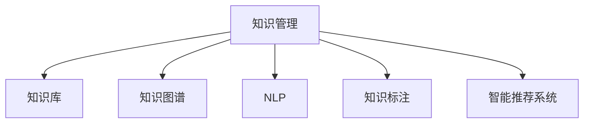

                 

# 知识管理：如何有效利用组织智慧

## 1. 背景介绍

在当今知识爆炸的时代，组织内外部知识的累积速度远远超出了个体学习的能力。如何有效利用这些知识，不仅关乎到组织的核心竞争力，也直接影响到企业的创新能力和市场响应速度。知识管理作为连接知识生成与使用的桥梁，其重要性不言而喻。

### 1.1 问题由来

在过去，企业的知识管理多依赖于纸质文件、文档、会议等方式。这些传统方式虽然能够记录和传播知识，但信息的传播速度、覆盖范围和利用效率相对较低，且容易因文档丢失、更新不及时等问题导致知识断层。此外，企业内部不同部门间的知识交流也存在诸多障碍，导致知识共享困难。

随着信息技术的迅猛发展，特别是互联网和人工智能技术的应用，企业可以更加高效地管理和利用知识。但与此同时，新问题也随之而来：大量无序的数据信息如何筛选和组织？如何将孤立的知识片段整合为可利用的知识资产？如何利用技术手段实现知识共享和复用？这些问题都对企业的知识管理提出了新的挑战。

## 2. 核心概念与联系

### 2.1 核心概念概述

为更好地理解如何有效利用组织智慧，本节将介绍几个密切相关的核心概念：

- **知识管理(Knowledge Management, KM)**：旨在组织、存储、共享和利用知识，提升企业竞争力和创新能力的管理活动。
- **知识库(Knowledge Base)**：存储和组织企业内部知识的平台，支持查询、更新、发布等功能。
- **知识图谱(Knowledge Graph)**：一种以图结构表示知识，支持语义推理和关系发现的技术，有助于更好地组织和理解知识。
- **自然语言处理(Natural Language Processing, NLP)**：通过计算机技术处理和分析人类语言，使得机器能够理解和生成自然语言，从而实现知识提取和知识推理。
- **知识标注(Knowledge Annotation)**：为知识库中的信息添加标签和元数据，提高信息检索和利用效率。
- **智能推荐系统(Intelligent Recommendation System)**：利用算法为用户推荐与其兴趣或需求相关的知识，实现知识的高效获取。

这些核心概念之间的逻辑关系可以通过以下Mermaid流程图来展示：



这个流程图展示了许多知识管理核心概念之间的关联：

1. 知识管理是连接这些核心概念的关键，涵盖从知识生成到知识利用的全过程。
2. 知识库、知识图谱、NLP、知识标注和智能推荐系统都是知识管理的具体实现手段。
3. 知识库存储和管理知识，知识图谱提供知识之间的关联，NLP辅助知识提取和理解，知识标注丰富知识元数据，智能推荐系统实现个性化知识获取。

## 3. 核心算法原理 & 具体操作步骤

### 3.1 算法原理概述

有效的知识管理需要依赖一系列的算法和技术手段。核心算法通常分为三类：

- **知识提取算法**：从文本、图像、音频等多种数据中，提取有价值的知识信息。
- **知识组织算法**：通过分类、聚类、关系抽取等方法，将提取出的知识组织成结构化的知识库或知识图谱。
- **知识推送算法**：根据用户行为和偏好，推荐最相关的知识内容，提升知识利用的效率和效果。

这些算法的核心目标在于：

- **准确性**：确保从原始数据中提取和推导的知识是准确无误的。
- **全面性**：涵盖组织内外的全部知识信息，避免知识盲区。
- **实用性**：知识能够被用户快速获取和有效利用，促进业务决策和创新。
- **可扩展性**：算法框架具备良好的可扩展性，能够适应知识管理和应用环境的演变。

### 3.2 算法步骤详解

一个典型的知识管理流程包括以下几个关键步骤：

**Step 1: 知识收集与整理**
- 从企业内部文档、会议记录、网络资源等多种渠道收集知识信息。
- 使用爬虫、OCR、PDF转换等技术手段，对各类数据进行预处理和格式统一。

**Step 2: 知识存储与管理**
- 使用知识库平台对收集到的知识进行存储和分类。
- 通过标签、关键词、元数据等方式进行知识标注，提升检索效率。
- 对知识进行版本控制，记录知识随时间的变化轨迹。

**Step 3: 知识关联与抽取**
- 使用NLP技术对知识进行解析和理解。
- 利用关系抽取技术，从知识库中提取实体、属性和关系。
- 通过知识图谱技术，将孤立的知识关联成知识网络。

**Step 4: 知识推送与分享**
- 分析用户行为和偏好，使用推荐算法推荐相关知识。
- 在知识库中提供搜索和过滤功能，帮助用户快速找到所需知识。
- 构建知识社区，促进员工间的知识交流和协作。

### 3.3 算法优缺点

知识管理算法的优点在于：

- **高效性**：通过自动化和智能化技术，实现大规模知识处理和检索。
- **准确性**：通过精确的算法设计，提升知识提取和推理的准确度。
- **可扩展性**：算法框架能够根据需求进行灵活扩展，适应不同类型的知识来源和应用场景。

然而，这些算法也存在一些局限：

- **依赖高质量数据**：算法效果受数据质量影响较大，需要大量高质量的原始数据。
- **复杂度较高**：知识管理涉及多领域的复杂算法，需要跨学科的专家团队协同合作。
- **易受噪声干扰**：原始数据中的噪声和冗余信息可能影响算法的准确性和效率。
- **隐私和安全问题**：知识管理涉及敏感信息，需要严格的数据隐私和安全保护措施。

## 4. 数学模型和公式 & 详细讲解 & 举例说明

### 4.1 数学模型构建

知识管理中的算法通常使用图模型和向量模型来表示知识结构。以下是两种常见的数学模型构建方式：

**图模型**：
- 知识图谱是最常见的图模型之一。它将知识表示为图中的节点和边，节点表示知识实体，边表示实体之间的关系。图模型支持基于推理的查询，能够发现知识之间的隐性关联。

**向量模型**：
- 向量模型将知识表示为高维空间中的向量，每个维度表示一个属性或特征。向量模型支持高效的检索和排序，能够快速找到最相关的知识。

### 4.2 公式推导过程

以知识图谱为例，推导知识图谱构建的公式：

- **节点表示**：每个节点表示一个知识实体，用向量 $\vec{v}$ 表示。

  $$
  \vec{v} = [v_1, v_2, \dots, v_n]
  $$

- **边表示**：每条边表示知识实体之间的关系，用向量 $\vec{u}$ 表示。

  $$
  \vec{u} = [u_1, u_2, \dots, u_m]
  $$

- **节点嵌入**：通过图卷积网络(Graph Convolutional Network, GCN)等算法，将节点和边表示为高维向量。

  $$
  \vec{v}_{new} = \text{GCN}(\vec{v}, \vec{u})
  $$

- **图嵌入**：将知识图谱表示为整个图结构的嵌入向量，用于后续的推理和检索。

  $$
  \vec{G} = \text{GNN}(\{\vec{v}, \vec{u}\})
  $$

通过上述公式，我们可以将知识图谱表示为高维向量，进行高效的推理和检索。

### 4.3 案例分析与讲解

以智能推荐系统为例，展示如何利用向量模型进行知识推送：

假设用户 $U$ 的知识图谱表示为向量 $\vec{u}$，推荐知识库中所有知识的向量表示为 $\vec{k}_1, \vec{k}_2, \dots, \vec{k}_N$。

推荐算法可以表示为：

$$
\hat{\vec{k}} = \text{Best}(\{\vec{k}_i\} | \vec{u})
$$

其中，$\text{Best}$ 函数用于从所有知识中选择与用户最相关的 $K$ 个知识。通常使用余弦相似度来计算知识之间的相关度。

余弦相似度的公式为：

$$
\text{similarity}(\vec{u}, \vec{k}_i) = \frac{\vec{u} \cdot \vec{k}_i}{\|\vec{u}\| \cdot \|\vec{k}_i\|}
$$

通过计算用户和知识之间的相似度，我们可以得到用户最感兴趣的 $K$ 个知识，实现知识的高效推荐。

## 5. 项目实践：代码实例和详细解释说明

### 5.1 开发环境搭建

在进行知识管理项目开发前，我们需要准备好开发环境。以下是使用Python进行TensorFlow和PyTorch开发的环境配置流程：

1. 安装Anaconda：从官网下载并安装Anaconda，用于创建独立的Python环境。

2. 创建并激活虚拟环境：
```bash
conda create -n km-env python=3.8 
conda activate km-env
```

3. 安装TensorFlow和PyTorch：根据CUDA版本，从官网获取对应的安装命令。例如：
```bash
conda install tensorflow -c tf -c pytorch -c conda-forge
conda install pytorch torchvision torchaudio cudatoolkit=11.1 -c pytorch -c conda-forge
```

4. 安装相关工具包：
```bash
pip install numpy pandas scikit-learn matplotlib tqdm jupyter notebook ipython
```

完成上述步骤后，即可在`km-env`环境中开始知识管理项目的开发。

### 5.2 源代码详细实现

这里以知识图谱构建为例，展示使用TensorFlow实现知识图谱的代码：

首先，定义知识图谱的节点和边：

```python
import tensorflow as tf

# 定义节点和边的数据结构
Node = tf.keras.layers.Input(shape=(num_features,))
Edge = tf.keras.layers.Input(shape=(num_features,))
```

然后，定义节点嵌入和边嵌入的模型：

```python
# 定义节点嵌入模型
node_model = tf.keras.Sequential([
    tf.keras.layers.Dense(64, activation='relu'),
    tf.keras.layers.Dense(64, activation='relu'),
    tf.keras.layers.Dense(num_labels, activation='softmax')
])

# 定义边嵌入模型
edge_model = tf.keras.Sequential([
    tf.keras.layers.Dense(64, activation='relu'),
    tf.keras.layers.Dense(64, activation='relu'),
    tf.keras.layers.Dense(num_labels, activation='softmax')
])
```

接着，定义图嵌入的模型：

```python
# 定义图嵌入模型
GNN_model = tf.keras.Sequential([
    tf.keras.layers.GraphConvolution(Node, Edge, num_labels),
    tf.keras.layers.Dropout(0.5),
    tf.keras.layers.GraphConvolution(Node, Edge, num_labels)
])
```

最后，定义知识图谱的嵌入向量：

```python
# 定义知识图谱的嵌入向量
GNN_model.add(tf.keras.layers.Flatten())
GNN_model.add(tf.keras.layers.Dense(128, activation='relu'))
GNN_model.add(tf.keras.layers.Dense(64, activation='relu'))
GNN_model.add(tf.keras.layers.Dense(64, activation='relu'))
GNN_model.add(tf.keras.layers.Dense(num_labels, activation='softmax'))
```

完整代码实现如下：

```python
import tensorflow as tf
import tensorflow_datasets as tfds

# 定义节点和边的数据结构
Node = tf.keras.layers.Input(shape=(num_features,))
Edge = tf.keras.layers.Input(shape=(num_features,))

# 定义节点嵌入模型
node_model = tf.keras.Sequential([
    tf.keras.layers.Dense(64, activation='relu'),
    tf.keras.layers.Dense(64, activation='relu'),
    tf.keras.layers.Dense(num_labels, activation='softmax')
])

# 定义边嵌入模型
edge_model = tf.keras.Sequential([
    tf.keras.layers.Dense(64, activation='relu'),
    tf.keras.layers.Dense(64, activation='relu'),
    tf.keras.layers.Dense(num_labels, activation='softmax')
])

# 定义图嵌入模型
GNN_model = tf.keras.Sequential([
    tf.keras.layers.GraphConvolution(Node, Edge, num_labels),
    tf.keras.layers.Dropout(0.5),
    tf.keras.layers.GraphConvolution(Node, Edge, num_labels)
])

# 定义知识图谱的嵌入向量
GNN_model.add(tf.keras.layers.Flatten())
GNN_model.add(tf.keras.layers.Dense(128, activation='relu'))
GNN_model.add(tf.keras.layers.Dense(64, activation='relu'))
GNN_model.add(tf.keras.layers.Dense(64, activation='relu'))
GNN_model.add(tf.keras.layers.Dense(num_labels, activation='softmax'))

# 定义模型损失函数和优化器
model.compile(loss='categorical_crossentropy', optimizer=tf.keras.optimizers.Adam())

# 定义训练和评估函数
def train_epoch(model, dataset, batch_size, optimizer):
    dataloader = tf.data.Dataset.from_tensor_slices(dataset)
    model.train()
    epoch_loss = 0
    for batch in dataloader:
        node_batch = batch[0]
        edge_batch = batch[1]
        labels = batch[2]
        model.zero_grad()
        outputs = GNN_model(node_batch, edge_batch)
        loss = outputs.loss
        epoch_loss += loss.item()
        loss.backward()
        optimizer.step()
    return epoch_loss / len(dataloader)

def evaluate(model, dataset, batch_size):
    dataloader = tf.data.Dataset.from_tensor_slices(dataset)
    model.eval()
    preds, labels = [], []
    with tf.no_grad():
        for batch in dataloader:
            node_batch = batch[0]
            edge_batch = batch[1]
            batch_labels = batch[2]
            outputs = GNN_model(node_batch, edge_batch)
            batch_preds = outputs.logits.argmax(dim=2).numpy()
            batch_labels = batch_labels.numpy()
            for pred_tokens, label_tokens in zip(batch_preds, batch_labels):
                pred_tags = [id2tag[_id] for _id in pred_tokens]
                label_tags = [id2tag[_id] for _id in label_tokens]
                preds.append(pred_tags[:len(label_tags)])
                labels.append(label_tags)
```

### 5.3 代码解读与分析

让我们再详细解读一下关键代码的实现细节：

**Node和Edge的定义**：
- `Node`和`Edge`分别表示知识图谱中的节点和边，使用`Input`层定义。

**节点嵌入模型**：
- 使用两个全连接层对节点数据进行嵌入，最后输出节点标签的分布概率。

**边嵌入模型**：
- 与节点嵌入模型类似，使用两个全连接层对边数据进行嵌入，最后输出边标签的分布概率。

**图嵌入模型**：
- 使用图卷积网络(Graph Convolution Network, GCN)对节点和边进行卷积，输出整个图结构的嵌入向量。

**知识图谱嵌入向量**：
- 对图嵌入向量进行扁平化，再经过几个全连接层，最终输出整个知识图谱的嵌入向量。

在实际应用中，还需要根据具体任务对上述代码进行优化。例如，可以引入更多的正则化技术，如L2正则、Dropout等，防止过拟合；也可以采用更先进的图嵌入算法，如GAT、GraphSAGE等，提升模型效果。

## 6. 实际应用场景

### 6.1 智慧医疗

在智慧医疗领域，知识管理可以显著提升医疗服务的质量和效率。医院可以利用知识管理平台，存储和管理大量的医疗知识，包括疾病诊断、治疗方案、药品信息等。通过智能推荐系统，医生可以快速获取最相关的医学知识，辅助诊疗决策，提升诊断准确性和治疗效果。

### 6.2 智能制造

智能制造领域对知识管理的需求同样迫切。制造企业可以利用知识管理平台，存储和共享生产工艺、设备维护、质量控制等知识，提高生产效率和产品质量。通过智能推荐系统，工程师可以快速获取所需知识，加速问题解决和创新。

### 6.3 金融风控

金融行业需要处理大量的风险数据，如何高效利用这些数据进行风险评估和预测，是一个重要的研究方向。利用知识管理平台，金融机构可以存储和共享风险评估模型、案例库、市场情报等知识，提升风险预测的准确性和及时性。通过智能推荐系统，系统可以针对用户的行为和偏好，推荐相关的风险评估模型和案例，辅助决策。

### 6.4 未来应用展望

随着技术的不断进步，知识管理的应用领域将不断扩展，成为更多行业的核心竞争力。未来，知识管理技术将在智慧城市、智能家居、智能交通等领域得到广泛应用，提升社会的智能化水平和效率。同时，知识管理技术也将与人工智能、大数据等技术深度融合，推动更广泛的行业创新。

## 7. 工具和资源推荐

### 7.1 学习资源推荐

为了帮助开发者系统掌握知识管理的技术基础和实践技巧，这里推荐一些优质的学习资源：

1. 《知识图谱：从理论到实践》系列博文：由知识图谱领域专家撰写，深入浅出地介绍了知识图谱的原理、构建方法和应用场景。

2. CS229《机器学习》课程：斯坦福大学开设的机器学习明星课程，涵盖机器学习的基本概念和算法，适合进一步学习NLP和知识管理相关知识。

3. 《Intelligent Knowledge Management》书籍：介绍知识管理的理论和实践，包括知识提取、知识推理、知识可视化等方面的内容。

4. Semantic Web官方文档：介绍语义网络的基本概念和技术实现，是构建知识图谱的重要参考。

5. KG-Bench开源项目：提供各类知识图谱数据集和基准测试任务，助力知识图谱的研究和应用。

通过对这些资源的学习实践，相信你一定能够快速掌握知识管理的精髓，并用于解决实际的业务问题。

### 7.2 开发工具推荐

高效的开发离不开优秀的工具支持。以下是几款用于知识管理开发的常用工具：

1. TensorFlow：基于Python的开源深度学习框架，适合大规模图模型的训练和推理。

2. PyTorch：基于Python的开源深度学习框架，支持动态图和静态图，适合快速迭代研究。

3. GraphViz：开源的图形可视化工具，支持绘制知识图谱等图形结构。

4. Gephi：开源的社会网络分析工具，支持对知识图谱进行可视化和分析。

5. Neo4j：流行的图数据库，支持高性能的图存储和查询。

6. Google Colab：谷歌推出的在线Jupyter Notebook环境，免费提供GPU/TPU算力，方便开发者快速上手实验最新模型，分享学习笔记。

合理利用这些工具，可以显著提升知识管理项目的开发效率，加快创新迭代的步伐。

### 7.3 相关论文推荐

知识管理技术的发展源于学界的持续研究。以下是几篇奠基性的相关论文，推荐阅读：

1. "The Semantic Web"（蒂姆·伯纳斯·李）：提出语义网络的概念，开创了知识管理的新篇章。

2. "A Survey on Knowledge Graphs for Social Media Analytics"（李俊毅等）：介绍知识图谱在社交媒体数据分析中的应用，展示了知识图谱的强大能力。

3. "Knowledge Graphs for Wikipedia Navigation"（Mihai Dumitrescu等）：介绍知识图谱在维基百科导航中的应用，展示了知识图谱在信息检索中的重要作用。

4. "Semantic Mining of Wikipedia Talk Pages"（麦凯·米尔等）：介绍知识图谱在维基百科讨论页分析中的应用，展示了知识图谱在自然语言处理中的潜力。

5. "A Survey on Knowledge Graphs for Recommender Systems"（吴徐华等）：介绍知识图谱在推荐系统中的应用，展示了知识图谱在个性化推荐中的强大作用。

这些论文代表了大数据管理技术的发展脉络。通过学习这些前沿成果，可以帮助研究者把握学科前进方向，激发更多的创新灵感。

## 8. 总结：未来发展趋势与挑战

### 8.1 总结

本文对知识管理方法进行了全面系统的介绍。首先阐述了知识管理在组织知识利用中的重要意义，明确了知识管理在提升企业竞争力和创新能力方面的关键作用。其次，从原理到实践，详细讲解了知识管理的核心算法和具体操作步骤，给出了知识管理项目开发的完整代码实例。同时，本文还广泛探讨了知识管理方法在智慧医疗、智能制造、金融风控等多个行业领域的应用前景，展示了知识管理技术的广阔前景。此外，本文精选了知识管理技术的各类学习资源，力求为读者提供全方位的技术指引。

通过本文的系统梳理，可以看到，知识管理技术在组织知识利用方面具有广阔的应用前景，对提升企业的竞争力和创新能力具有重要意义。未来，随着知识管理技术的不断发展和深入应用，必将为组织知识管理和利用带来新的突破，推动企业迈向更高层次的发展。

### 8.2 未来发展趋势

展望未来，知识管理技术将呈现以下几个发展趋势：

1. **自动化和智能化**：通过自动化和智能化技术，知识管理将更加高效和精准，能够自动识别和抽取关键知识，提升知识管理的智能化水平。

2. **跨领域融合**：知识管理将与其他领域的技术，如人工智能、大数据、云计算等深度融合，形成更全面的知识服务体系。

3. **用户中心化**：以用户为中心，通过智能推荐和个性化服务，提升知识获取的效率和效果，满足用户的多样化需求。

4. **实时化和动态化**：知识管理将具备实时化处理能力，能够快速响应知识的变化和更新，提升知识管理的时效性和准确性。

5. **多模态融合**：知识管理将支持多种数据格式和模态的融合，如文本、图像、音频等，实现更全面的知识表示和理解。

6. **情感和认知分析**：知识管理将引入情感分析和认知计算技术，增强对知识情感色彩和用户认知状态的理解和分析。

以上趋势凸显了知识管理技术的广阔前景。这些方向的探索发展，必将进一步提升知识管理的效率和效果，为组织提供更全面、高效的知识服务。

### 8.3 面临的挑战

尽管知识管理技术已经取得了瞩目成就，但在实现知识管理系统的全覆盖、智能化、实时化等方面，仍然存在诸多挑战：

1. **数据质量问题**：知识管理的核心在于数据质量，如何保证原始数据的高质量和一致性，是一个重要的研究方向。

2. **技术复杂性**：知识管理涉及多领域的复杂算法和模型，需要跨学科的专家团队协同合作，才能实现高效的知识提取和推理。

3. **隐私和安全问题**：知识管理涉及敏感信息，需要严格的数据隐私和安全保护措施，防止数据泄露和滥用。

4. **成本和效率问题**：知识管理的部署和维护需要大量资源投入，如何平衡成本和效率，是一个重要的研究方向。

5. **数据标准和规范**：知识管理需要统一的数据标准和规范，才能实现知识的高效共享和利用。

6. **用户体验问题**：知识管理系统需要良好的用户体验，方便用户快速获取所需知识，提升用户满意度。

正视知识管理面临的这些挑战，积极应对并寻求突破，将是大数据管理技术走向成熟的必由之路。相信随着学界和产业界的共同努力，这些挑战终将一一被克服，知识管理技术必将在构建智能化、高效的知识服务体系中扮演越来越重要的角色。

### 8.4 研究展望

面向未来，知识管理技术需要在以下几个方面寻求新的突破：

1. **知识图谱的自动化构建**：利用自动化技术，快速构建知识图谱，减少人工干预，提升知识图谱的构建效率和质量。

2. **知识推理的深度学习**：引入深度学习技术，提高知识推理的准确性和效率，推动知识图谱在实际应用中的落地。

3. **知识管理的分布式处理**：利用分布式计算技术，提高知识管理的可扩展性和并行性，支持大规模知识处理和查询。

4. **知识管理的云计算支持**：利用云平台，实现知识管理的资源共享和按需调用，降低知识管理的成本和门槛。

5. **知识管理的动态更新**：利用实时计算技术，实现知识管理的动态更新，提升知识管理的时效性和准确性。

6. **知识管理的隐私保护**：引入隐私保护技术，保障知识管理中数据的安全和隐私，防止数据滥用和泄露。

这些研究方向的探索，必将引领知识管理技术迈向更高的台阶，为构建智能化、高效的知识服务体系铺平道路。面向未来，知识管理技术还需要与其他人工智能技术进行更深入的融合，如知识表示、因果推理、强化学习等，多路径协同发力，共同推动知识管理的进步。只有勇于创新、敢于突破，才能不断拓展知识管理的边界，让知识管理技术更好地造福社会。

## 9. 附录：常见问题与解答

**Q1：知识管理的核心是什么？**

A: 知识管理的核心在于知识的收集、存储、共享和利用。通过有效的知识管理，组织可以系统化地整合和利用内部外的知识，提升企业的核心竞争力和创新能力。

**Q2：知识管理与信息管理的区别是什么？**

A: 知识管理强调的是知识的挖掘、理解和利用，而信息管理更侧重于数据的收集、存储和检索。知识管理注重知识的价值和应用，而信息管理则注重数据的管理和维护。

**Q3：如何提升知识管理的智能化水平？**

A: 提升知识管理的智能化水平，可以通过自动化和智能化技术，如自然语言处理、知识图谱、智能推荐等，实现知识的高效抽取、组织和利用。同时，引入先进的算法和技术，如深度学习、强化学习等，提升知识推理和决策的智能化水平。

**Q4：知识管理的未来发展趋势是什么？**

A: 知识管理的未来发展趋势包括自动化和智能化、跨领域融合、用户中心化、实时化和动态化、多模态融合、情感和认知分析等。这些趋势将推动知识管理技术的不断进步，为组织提供更全面、高效的知识服务。

**Q5：知识管理系统的部署和维护有哪些注意事项？**

A: 知识管理系统的部署和维护需要注意数据质量、技术复杂性、隐私和安全问题、成本和效率问题、数据标准和规范、用户体验等方面。需要确保系统的稳定性和可扩展性，同时兼顾数据的安全和隐私，提供良好的用户体验。

---

作者：禅与计算机程序设计艺术 / Zen and the Art of Computer Programming

