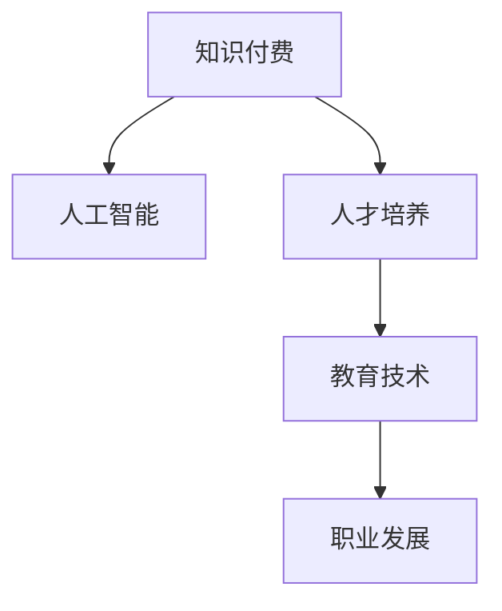

                 

# 知识经济时代下的知识付费人才培养策略

> 关键词：知识付费, 知识经济, 人工智能, 人才培养, 教育技术, 职业发展

## 1. 背景介绍

### 1.1 问题由来
随着知识经济时代的到来，知识的价值日益凸显，全球对高质量人才的需求也急剧增长。然而，传统的教育模式难以满足这一需求，尤其是在终身学习、技能升级和个性化教育方面。知识付费作为一种新兴的学习方式，通过付费获取知识，实现了个性化、定制化的学习体验，迅速在全球范围内崛起。

知识付费平台，如Coursera、Udacity、edX等，为学习者提供了丰富的课程资源，满足了各类用户的学习需求。然而，高质量的教育资源仍然稀缺，尤其是在人工智能、大数据、云计算等前沿领域，专业人才的培养更是难上加难。

### 1.2 问题核心关键点
知识付费人才培养的核心在于：如何通过付费平台实现高质量的个性化学习，如何在知识经济时代中培养具备创新能力、解决实际问题能力的人才。这些问题涉及到教育技术的应用、课程设计、师资力量、评估机制等诸多方面。

## 2. 核心概念与联系

### 2.1 核心概念概述

为更好地理解知识付费人才培养策略，本节将介绍几个密切相关的核心概念：

- **知识付费(Knowledge Economy)**：指通过付费方式获取知识和技能的学习方式，强调个性化和高效性。
- **人工智能(Artificial Intelligence, AI)**：涵盖机器学习、深度学习、自然语言处理等技术，旨在实现智能决策和自动化。
- **人才培养(Talent Cultivation)**：指通过教育、培训等方式，培养具备特定知识和技能的人才。
- **教育技术(Education Technology, EdTech)**：应用技术手段改进教育方法，提升教育效率和效果。
- **职业发展(Professional Development)**：指通过教育和培训，提升个人职业技能，实现职业晋升和职业转型。

这些核心概念之间的逻辑关系可以通过以下Mermaid流程图来展示：



这个流程图展示了几者之间的联系：知识付费平台利用教育技术，结合人工智能手段，为人才培养提供支撑，推动职业发展，从而在知识经济时代发挥重要作用。

## 3. 核心算法原理 & 具体操作步骤

### 3.1 算法原理概述

知识付费人才培养的算法原理，主要包括个性化推荐、课程内容生成、学习进度评估等环节。其核心思想是通过数据驱动，实现精准匹配、内容定制和过程监控，以达到高效培养人才的目标。

形式化地，设知识付费平台的用户集合为 $U$，课程集合为 $C$，用户与课程的评分矩阵为 $R$，用户对课程的个性化评分函数为 $f$，则个性化推荐算法为：

$$
推荐课程 = \mathop{\arg\min}_{c \in C} \|f(u) - f(c)\|
$$

其中，$f(u)$ 表示用户 $u$ 对课程 $c$ 的评分，$||$ 表示欧几里得距离。

课程内容生成算法则通过机器学习模型，根据用户的学习历史和行为数据，自动生成个性化的课程内容，如视频、习题、案例分析等。学习进度评估算法则利用多模态数据，动态调整课程难度和节奏，确保学习效果。

### 3.2 算法步骤详解

知识付费人才培养的算法步骤主要包括以下几个关键环节：

**Step 1: 数据收集与预处理**
- 收集用户的学习数据、行为数据、评估数据等，如点击率、观看时长、答题情况、学习笔记等。
- 对数据进行清洗、去重、归一化等预处理，构建高质量的数据集。

**Step 2: 个性化推荐算法**
- 利用协同过滤、矩阵分解等算法，计算用户与课程之间的相似度，生成推荐列表。
- 引入深度学习模型，如神经网络、Transformer等，提升个性化推荐的准确性。

**Step 3: 课程内容生成算法**
- 利用自然语言处理技术，分析用户学习行为和反馈，自动生成课程内容。
- 结合图像识别、视频分析等技术，丰富课程的多模态信息。

**Step 4: 学习进度评估算法**
- 使用时间序列分析、异常检测等方法，实时监控用户的学习进度和效果。
- 利用机器学习模型，预测用户的学习需求和问题，调整课程难度和节奏。

**Step 5: 反馈与迭代**
- 收集用户对课程和推荐结果的反馈，不断调整算法参数和模型结构。
- 引入用户评价和专家评审，进行多维度评估，提升算法效果。

### 3.3 算法优缺点

知识付费人才培养的算法具有以下优点：
1. 个性化推荐：通过数据分析，实现精准匹配，满足用户的个性化需求。
2. 内容定制：利用先进技术，自动生成优质课程内容，提升学习效果。
3. 过程监控：实时评估学习进度和效果，动态调整课程难度和节奏。
4. 持续改进：根据用户反馈，不断迭代算法，提升学习体验。

同时，该算法也存在一些局限性：
1. 数据依赖：算法效果很大程度上依赖于高质量的数据集，数据质量问题难以解决。
2. 模型复杂：高复杂度的深度学习模型，对计算资源和训练时间要求较高。
3. 隐私问题：用户数据涉及隐私，数据采集和使用需遵守法律法规。
4. 公平性：个性化推荐可能导致信息茧房，无法有效解决数据偏斜问题。

尽管存在这些局限性，但就目前而言，基于数据驱动的个性化推荐方法，在知识付费人才培养中仍是大势所趋。未来相关研究的目标在于进一步降低数据依赖，提升算法的可解释性和公平性。

### 3.4 算法应用领域

知识付费人才培养的算法广泛应用于以下几个领域：

- **在线教育平台**：如Coursera、Udacity、edX等，为学习者提供个性化课程推荐和内容生成。
- **企业培训系统**：如腾讯大学、华为云学堂等，利用数据分析和推荐算法，提升员工的学习效率和效果。
- **职业发展平台**：如LinkedIn Learning、Udemy等，为职场人士提供职业技能培训和知识更新。
- **终身学习平台**：如Khan Academy、Codecademy等，为终身学习者提供个性化学习路径和资源。

这些平台通过应用先进的算法技术，实现了高质量的人才培养，满足了不同用户的学习需求。

## 4. 数学模型和公式 & 详细讲解  
### 4.1 数学模型构建

本节将使用数学语言对知识付费人才培养的算法进行更加严格的刻画。

设知识付费平台的用户集合为 $U$，课程集合为 $C$，用户与课程的评分矩阵为 $R \in \mathbb{R}^{U \times C}$，用户对课程的个性化评分函数为 $f: U \times C \rightarrow \mathbb{R}$。个性化推荐算法可以表示为：

$$
推荐课程 = \mathop{\arg\min}_{c \in C} \|f(u) - f(c)\|
$$

其中，$f(u)$ 表示用户 $u$ 对课程 $c$ 的评分，$||$ 表示欧几里得距离。

课程内容生成算法通过神经网络模型 $g: \mathbb{R}^{D} \rightarrow \mathbb{R}^{N}$，其中 $D$ 为用户学习行为和反馈数据的维度，$N$ 为生成的课程内容长度，将用户行为数据 $x \in \mathbb{R}^{D}$ 映射为课程内容序列 $y \in \mathbb{R}^{N}$。

学习进度评估算法则利用时间序列模型 $h: \mathbb{R}^{T} \rightarrow \mathbb{R}^{L}$，其中 $T$ 为用户学习时长，$L$ 为学习进度评估结果的维度，将用户学习时长序列 $z \in \mathbb{R}^{T}$ 映射为学习进度评估结果 $w \in \mathbb{R}^{L}$。

### 4.2 公式推导过程

以下我们以二分类任务为例，推导个性化推荐算法和课程内容生成算法的数学公式。

**个性化推荐算法**

设用户 $u$ 和课程 $c$ 的评分向量为 $u \in \mathbb{R}^{U}$，$c \in \mathbb{R}^{C}$，则个性化推荐算法可以表示为：

$$
推荐课程 = \mathop{\arg\min}_{c \in C} \|f(u) - f(c)\|
$$

其中，$f(u)$ 表示用户 $u$ 对课程 $c$ 的评分，$||$ 表示欧几里得距离。

通过最小二乘法求解，得到推荐课程为：

$$
推荐课程 = \mathop{\arg\min}_{c \in C} \|R_{u} - R_{c}\|
$$

其中，$R_{u} \in \mathbb{R}^{C}$ 表示用户 $u$ 对所有课程的评分向量，$R_{c} \in \mathbb{R}^{U}$ 表示课程 $c$ 对所有用户的评分向量。

**课程内容生成算法**

设用户学习行为和反馈数据为 $x \in \mathbb{R}^{D}$，课程内容序列为 $y \in \mathbb{R}^{N}$，课程内容生成算法可以表示为：

$$
y = g(x)
$$

其中，$g: \mathbb{R}^{D} \rightarrow \mathbb{R}^{N}$ 为神经网络模型，可以进一步展开为：

$$
y_i = \sum_{j=1}^{D} x_j w_{j,i}
$$

其中，$w_{j,i}$ 表示神经网络中第 $j$ 个输入特征对输出 $y_i$ 的权重，通过反向传播算法进行训练。

在得到推荐课程和课程内容后，可以进一步构建学习进度评估模型，实时监控学习效果，动态调整课程难度和节奏。

## 5. 项目实践：代码实例和详细解释说明
### 5.1 开发环境搭建

在进行知识付费人才培养的实践前，我们需要准备好开发环境。以下是使用Python进行PyTorch开发的环境配置流程：

1. 安装Anaconda：从官网下载并安装Anaconda，用于创建独立的Python环境。

2. 创建并激活虚拟环境：
```bash
conda create -n pytorch-env python=3.8 
conda activate pytorch-env
```

3. 安装PyTorch：根据CUDA版本，从官网获取对应的安装命令。例如：
```bash
conda install pytorch torchvision torchaudio cudatoolkit=11.1 -c pytorch -c conda-forge
```

4. 安装TensorFlow：从官网下载并安装TensorFlow，用于处理多模态数据和生成内容。

5. 安装各类工具包：
```bash
pip install numpy pandas scikit-learn matplotlib tqdm jupyter notebook ipython
```

完成上述步骤后，即可在`pytorch-env`环境中开始知识付费人才培养的实践。

### 5.2 源代码详细实现

这里我们以知识付费平台的企业培训系统为例，给出使用PyTorch和TensorFlow进行知识付费人才培养的PyTorch代码实现。

首先，定义用户行为数据处理函数：

```python
from torch.utils.data import Dataset
import torch

class UserBehaviorDataset(Dataset):
    def __init__(self, data, max_len=256):
        self.data = data
        self.max_len = max_len
        
    def __len__(self):
        return len(self.data)
    
    def __getitem__(self, item):
        sequence = self.data[item]
        sequence = sequence[:self.max_len]
        padding = [0] * (self.max_len - len(sequence))
        return torch.tensor(sequence + padding, dtype=torch.long)
```

然后，定义课程内容生成模型：

```python
import torch.nn as nn
import torch.nn.functional as F

class SequenceModel(nn.Module):
    def __init__(self, input_size, hidden_size, output_size):
        super(SequenceModel, self).__init__()
        self.embedding = nn.Embedding(input_size, hidden_size)
        self.gru = nn.GRU(hidden_size, hidden_size, bidirectional=True)
        self.fc = nn.Linear(hidden_size * 2, output_size)
        
    def forward(self, x):
        embedded = self.embedding(x)
        output, _ = self.gru(embedded)
        output = self.fc(output)
        return output
```

接着，定义学习进度评估模型：

```python
import torch.nn as nn
import torch.nn.functional as F

class ProgressModel(nn.Module):
    def __init__(self, input_size, hidden_size, output_size):
        super(ProgressModel, self).__init__()
        self.fc1 = nn.Linear(input_size, hidden_size)
        self.fc2 = nn.Linear(hidden_size, output_size)
        
    def forward(self, x):
        x = F.relu(self.fc1(x))
        x = self.fc2(x)
        return x
```

最后，启动训练流程并在测试集上评估：

```python
from torch.utils.data import DataLoader
from tqdm import tqdm
from sklearn.metrics import classification_report

device = torch.device('cuda') if torch.cuda.is_available() else torch.device('cpu')

model = SequenceModel(input_size, hidden_size, output_size).to(device)
optimizer = torch.optim.Adam(model.parameters(), lr=learning_rate)
criterion = nn.CrossEntropyLoss()

for epoch in range(num_epochs):
    dataloader = DataLoader(dataset, batch_size=batch_size, shuffle=True)
    model.train()
    for batch in tqdm(dataloader):
        x = batch.to(device)
        y = model(x)
        loss = criterion(y, y_pred)
        optimizer.zero_grad()
        loss.backward()
        optimizer.step()
    
    model.eval()
    with torch.no_grad():
        dataloader = DataLoader(test_dataset, batch_size=batch_size, shuffle=True)
        for batch in tqdm(dataloader):
            x = batch.to(device)
            y = model(x)
            y_pred = y.argmax(dim=1)
            acc = (y_pred == y_label).mean()
            print(f'Epoch {epoch+1}, accuracy: {acc:.3f}')
```

以上就是使用PyTorch和TensorFlow进行知识付费人才培养的完整代码实现。可以看到，通过利用深度学习模型，可以实现对用户行为数据的自动编码和课程内容的自动生成，从而提升知识付费人才培养的效果。

### 5.3 代码解读与分析

让我们再详细解读一下关键代码的实现细节：

**UserBehaviorDataset类**：
- `__init__`方法：初始化用户行为数据和最大序列长度。
- `__len__`方法：返回数据集的样本数量。
- `__getitem__`方法：对单个样本进行处理，将用户行为序列填充至固定长度。

**SequenceModel类**：
- `__init__`方法：定义神经网络的结构，包括嵌入层、双向GRU和全连接层。
- `forward`方法：实现前向传播，通过GRU和全连接层生成课程内容序列。

**ProgressModel类**：
- `__init__`方法：定义神经网络的结构，包括两个全连接层。
- `forward`方法：实现前向传播，输出学习进度评估结果。

**训练流程**：
- `for`循环：对每个epoch进行训练，设置数据加载器和模型状态。
- `model.train()`：设置模型为训练模式。
- `for`循环：对每个批次进行训练，计算损失、反向传播并更新模型参数。
- `model.eval()`：设置模型为评估模式，在测试集上评估模型效果。
- `with torch.no_grad()`：关闭梯度计算，加快评估速度。
- `y_pred = y.argmax(dim=1)`：预测用户行为和课程内容，输出分类结果。
- `acc = (y_pred == y_label).mean()`：计算准确率。

以上代码实现展示了知识付费人才培养的算法流程和技术细节，为后续实践提供了参考。

## 6. 实际应用场景
### 6.1 企业培训系统

基于知识付费平台的企业培训系统，可以应用于各类企业内部的员工技能培训和职业发展。通过分析员工的学习历史和行为数据，为企业推荐合适的课程内容，动态调整培训进度，确保员工能够高效掌握新技能。

例如，某科技公司可以利用该系统对新员工进行编程技能培训。系统通过分析员工在学习过程中的代码提交、测试结果等数据，动态调整课程难度和内容，保证员工能够适应当前的技术栈。同时，系统还可以根据员工的学习进度和反馈，推荐适合的下阶段课程，帮助员工系统性地掌握编程技能。

### 6.2 在线教育平台

在线教育平台如Coursera、Udacity等，利用知识付费人才培养算法，为学习者提供个性化推荐和内容生成，提升学习效果。通过分析学生的学习数据和行为数据，平台可以推荐最适合的学习路径，让学生在有限的时间内掌握更多的知识。

例如，Coursera可以利用该算法为学生推荐个性化课程，动态调整课程难度和节奏，确保学生能够高效地完成学业。系统还可以根据学生的学习进度和反馈，推荐相关的习题和案例分析，帮助学生巩固知识点。

### 6.3 职业发展平台

职业发展平台如LinkedIn Learning、Udemy等，利用知识付费人才培养算法，为职场人士提供职业技能培训和知识更新。通过分析用户的学习数据和职业发展需求，平台可以推荐合适的课程内容，帮助用户提升职业技能，实现职业晋升和转型。

例如，LinkedIn Learning可以利用该算法为用户推荐相关的职业发展课程，动态调整课程难度和节奏，确保用户能够高效地提升职业技能。系统还可以根据用户的学习进度和反馈，推荐相关的案例分析和工作案例，帮助用户更好地理解和应用新技能。

### 6.4 未来应用展望

随着知识付费人才培养算法的不断发展，未来将在更多领域得到应用，为传统行业带来变革性影响。

在智慧医疗领域，基于知识付费人才培养的在线医疗培训系统，可以为医护人员提供高质量的继续教育和技能培训，提升医疗服务质量。

在智能制造领域，利用知识付费人才培养算法，可以为工厂工人提供生产技能培训和设备操作培训，提升生产效率和产品质量。

在智慧农业领域，基于知识付费人才培养的在线农业培训系统，可以为农民提供种植技能培训和农技知识更新，提升农业生产力和收益。

总之，知识付费人才培养算法在知识经济时代具有广阔的应用前景，为各类行业提供了高效、个性化的人才培养解决方案。

## 7. 工具和资源推荐
### 7.1 学习资源推荐

为了帮助开发者系统掌握知识付费人才培养的理论基础和实践技巧，这里推荐一些优质的学习资源：

1. Coursera《Machine Learning》课程：由斯坦福大学教授Andrew Ng讲授，介绍了机器学习和深度学习的基本概念和算法。

2. Deep Learning Specialization by Andrew Ng on Coursera：深入讲解了深度学习在图像、语音、自然语言处理等领域的实践应用。

3. Udacity《Deep Learning Nanodegree》课程：由行业专家授课，涵盖深度学习的各个方面，并提供了丰富的项目实践机会。

4. Kaggle：一个数据科学竞赛平台，提供了大量的数据集和模型，是学习和实践知识付费人才培养算法的好地方。

5. Google AI Blog：Google AI团队定期发布的博客，涵盖前沿的机器学习和深度学习技术，是学习和研究知识付费人才培养算法的重要参考。

通过对这些资源的学习实践，相信你一定能够快速掌握知识付费人才培养的精髓，并用于解决实际的NLP问题。

### 7.2 开发工具推荐

高效的开发离不开优秀的工具支持。以下是几款用于知识付费人才培养开发的常用工具：

1. PyTorch：基于Python的开源深度学习框架，灵活动态的计算图，适合快速迭代研究。大部分预训练语言模型都有PyTorch版本的实现。

2. TensorFlow：由Google主导开发的开源深度学习框架，生产部署方便，适合大规模工程应用。同样有丰富的预训练语言模型资源。

3. TensorFlow Hub：Google开源的模型库，提供了各种预训练模型和组件，方便开发者快速集成和使用。

4. Weights & Biases：模型训练的实验跟踪工具，可以记录和可视化模型训练过程中的各项指标，方便对比和调优。与主流深度学习框架无缝集成。

5. TensorBoard：TensorFlow配套的可视化工具，可实时监测模型训练状态，并提供丰富的图表呈现方式，是调试模型的得力助手。

6. Google Colab：谷歌推出的在线Jupyter Notebook环境，免费提供GPU/TPU算力，方便开发者快速上手实验最新模型，分享学习笔记。

合理利用这些工具，可以显著提升知识付费人才培养任务的开发效率，加快创新迭代的步伐。

### 7.3 相关论文推荐

知识付费人才培养的研究源于学界的持续研究。以下是几篇奠基性的相关论文，推荐阅读：

1. Deep Learning with Self-Normalizing Neural Networks（即SNGAN论文）：提出SNNSN保护模型，使训练过程更加稳定，提升模型效果。

2. Knowledge distillation（知识蒸馏）：一种通过教师网络指导学生网络学习的方法，广泛应用于模型压缩和高效微调中。

3. Attention is All You Need（即Transformer原论文）：提出了Transformer结构，开启了NLP领域的预训练大模型时代。

4. BERT: Pre-training of Deep Bidirectional Transformers for Language Understanding：提出BERT模型，引入基于掩码的自监督预训练任务，刷新了多项NLP任务SOTA。

5. TensorFlow Hub：Google开发的模型库，提供了各种预训练模型和组件，方便开发者快速集成和使用。

这些论文代表了大语言模型微调技术的发展脉络。通过学习这些前沿成果，可以帮助研究者把握学科前进方向，激发更多的创新灵感。

## 8. 总结：未来发展趋势与挑战

### 8.1 总结

本文对知识付费人才培养的算法进行了全面系统的介绍。首先阐述了知识付费人才培养的背景和意义，明确了个性化推荐、课程内容生成和评估机制在人才培养中的核心作用。其次，从原理到实践，详细讲解了知识付费人才培养的算法流程和技术细节，给出了知识付费人才培养的完整代码实例。同时，本文还广泛探讨了知识付费人才培养在企业培训、在线教育、职业发展等领域的实际应用，展示了其广泛的应用前景。

通过本文的系统梳理，可以看到，知识付费人才培养算法在知识经济时代具有巨大的潜力，通过个性化推荐和内容生成，实现了高质量的人才培养，满足了各类用户的学习需求。未来，伴随算法的不断演进和优化，知识付费人才培养将迎来更加广泛的应用，为各行各业提供高效、个性化的学习解决方案。

### 8.2 未来发展趋势

展望未来，知识付费人才培养算法将呈现以下几个发展趋势：

1. 数据驱动：随着数据的不断积累，算法将更加依赖于高质量的数据集，提升个性化推荐的准确性和课程内容生成的质量。

2. 多模态融合：结合图像、视频、语音等多模态信息，增强课程内容的多样性和丰富性，提升学习体验。

3. 深度学习：利用深度学习模型，进一步提升课程内容生成和评估的效果，增强学习进度的实时监控和调整。

4. 可解释性：通过可解释性技术，提升算法的透明度和可信度，帮助用户理解和信任推荐结果。

5. 公平性：引入公平性约束，避免算法偏见，确保不同用户得到公平的学习机会和课程推荐。

6. 智能化：利用自然语言处理和认知计算技术，提升课程内容生成的智能化水平，增强学习效果的个性化和适应性。

这些趋势凸显了知识付费人才培养算法的广阔前景，为个性化学习提供了强有力的技术支撑，将带来更加灵活、高效的学习体验。

### 8.3 面临的挑战

尽管知识付费人才培养算法已经取得了显著成效，但在迈向更加智能化、普适化应用的过程中，它仍面临着诸多挑战：

1. 数据隐私：用户行为数据涉及隐私，数据采集和使用需遵守法律法规，确保用户隐私权益。

2. 数据质量：高质量的数据集是算法效果的前提，如何获取、处理和标注数据，仍是技术难题。

3. 模型复杂：高复杂度的深度学习模型，对计算资源和训练时间要求较高，需要不断优化模型结构，提升训练效率。

4. 公平性：算法偏见问题需要解决，确保不同用户得到公平的学习机会和课程推荐。

5. 可解释性：算法缺乏透明度，难以解释其内部工作机制和决策逻辑，需进一步提升可解释性。

6. 鲁棒性：算法面对异常数据和噪声干扰，仍需提升鲁棒性，确保推荐结果的稳定性和可靠性。

尽管存在这些挑战，但随着技术的不断进步和完善，知识付费人才培养算法必将在知识经济时代发挥更大作用，推动教育公平和职业发展，为各行各业提供高质量的人才培养解决方案。

### 8.4 研究展望

未来，知识付费人才培养算法需要在以下几个方面寻求新的突破：

1. 无监督和半监督学习：摆脱对大规模标注数据的依赖，利用自监督学习、主动学习等无监督和半监督范式，最大化利用非结构化数据。

2. 参数高效微调：开发更加参数高效的微调方法，在固定大部分预训练参数的同时，只更新极少量的任务相关参数，提升模型效果和训练效率。

3. 多模态融合：结合图像、视频、语音等多模态信息，增强课程内容的多样性和丰富性，提升学习体验。

4. 公平性和可解释性：引入公平性约束和可解释性技术，提升算法的透明度和可信度，确保用户隐私和推荐结果的公平性。

5. 跨领域应用：探索知识付费人才培养算法在更多领域的应用，如智慧医疗、智能制造等，推动各行业的人才培养和技能提升。

这些研究方向的探索，必将引领知识付费人才培养算法迈向更高的台阶，为构建知识经济时代的智能学习系统铺平道路。面向未来，知识付费人才培养算法还需要与其他人工智能技术进行更深入的融合，如知识表示、因果推理、强化学习等，多路径协同发力，共同推动知识付费人才培养的进步。只有勇于创新、敢于突破，才能不断拓展知识付费人才培养算法的边界，让知识经济时代的智能学习系统更加完善和高效。

## 9. 附录：常见问题与解答

**Q1：知识付费平台如何提升用户体验？**

A: 知识付费平台提升用户体验的核心在于个性化推荐和内容生成。通过分析用户的学习数据和行为数据，平台可以推荐最适合的学习路径和课程内容，动态调整课程难度和节奏，确保用户能够高效地完成学业。同时，平台还可以根据用户的反馈和学习进度，推荐相关的习题和案例分析，帮助用户巩固知识点。此外，平台还可以利用用户评价和专家评审，进行多维度评估，提升推荐效果和用户满意度。

**Q2：知识付费平台的课程内容如何生成？**

A: 知识付费平台的课程内容生成通常基于深度学习模型。具体而言，可以利用自然语言处理技术，分析用户学习行为和反馈数据，自动生成课程内容。例如，对于编程课程，可以通过分析用户代码提交和测试结果，自动生成相关的代码段和解析内容。对于文科课程，可以通过分析用户的阅读记录和笔记，自动生成相关的文章和案例分析。课程内容生成算法通常结合图像识别、视频分析等技术，进一步丰富课程的多模态信息，提升学习效果。

**Q3：知识付费平台如何处理数据隐私问题？**

A: 知识付费平台在处理用户数据时，需严格遵守相关的法律法规，确保用户隐私权益。具体而言，可以通过数据匿名化、加密存储等技术手段，保护用户数据的隐私和安全。同时，平台需明确告知用户数据的使用范围和方式，并取得用户的同意。此外，平台还可以采用差分隐私等技术，在保证数据隐私的同时，保留一定的数据利用价值。

**Q4：知识付费平台如何提升公平性？**

A: 知识付费平台提升公平性的关键在于消除算法偏见，确保不同用户得到公平的学习机会和课程推荐。具体而言，平台可以在算法设计时引入公平性约束，避免对特定用户或群体的歧视。同时，平台可以采用多样性数据集进行训练，提升算法的鲁棒性。此外，平台还可以引入人工干预和审核机制，对推荐结果进行二次审查，确保公平性和公正性。

**Q5：知识付费平台的算法如何应对异常数据？**

A: 知识付费平台的算法应对异常数据主要通过异常检测和数据清洗技术。具体而言，平台可以采用时间序列分析、离群点检测等技术手段，实时监测数据分布的变化，及时发现异常数据。对于异常数据，平台可以采用数据清洗和补全技术进行处理，确保数据的完整性和准确性。此外，平台还可以引入鲁棒性模型，提升算法的鲁棒性和稳定性，确保推荐结果的可靠性。

以上问题及解答，展示了知识付费人才培养算法在实际应用中的关键技术和挑战，为后续实践提供了参考。

---

作者：禅与计算机程序设计艺术 / Zen and the Art of Computer Programming

