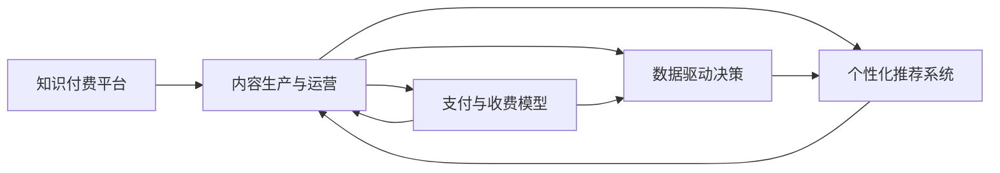

                 

## 1. 背景介绍

在知识经济时代，知识付费平台已成为促进知识传播和转化的重要工具。它们通过提供优质内容和服务，激励知识生产和消费，塑造了现代学习、工作和生活方式。但同时，随着知识付费的普及，内容同质化、价格高企等问题也逐渐显现，亟需通过商业模式创新推动产业升级。本文旨在探索知识付费领域的商业模式创新，以知识付费平台为载体，搭建知识经济时代下的创新商业模式孵化器。

## 2. 核心概念与联系

### 2.1 核心概念概述

在知识经济时代，知识付费平台的商业模式创新涉及多个关键概念：

- **知识付费平台**：基于互联网的在线平台，通过提供知识内容、课程服务、咨询顾问等，帮助用户获取知识、提升技能、解决实际问题。

- **内容生产与运营**：围绕知识付费平台的商业模式核心，内容生产与运营包括内容创作、知识付费、用户互动等环节，旨在高效、精准地匹配知识供需双方。

- **支付与收费模型**：知识付费平台的收入来源主要依赖于用户支付。设计合理的支付与收费模型，能够有效提升平台盈利能力，同时激励优质内容的生产。

- **数据驱动决策**：通过分析用户行为数据，知识付费平台能够洞察用户需求，精准定位内容，优化产品和服务，提升用户体验。

- **个性化推荐系统**：通过算法和数据模型，为每位用户推荐最相关、最匹配的内容，提高用户粘性和平台满意度。

这些概念相互关联，共同构成知识付费平台的商业模式创新体系。下图展示了这些概念之间的联系：



## 3. 核心算法原理 & 具体操作步骤

### 3.1 算法原理概述

知识付费平台的商业模式创新主要围绕内容生产与运营、支付与收费模型、数据驱动决策和个性化推荐系统展开。以下是对这些核心算法原理的概述：

1. **内容生产与运营**：
   - 涉及内容创作、知识付费、用户互动等环节，通过平台激励机制和反馈系统，提升内容质量和用户满意度。

2. **支付与收费模型**：
   - 包括一次性购买、按需付费、订阅制、会员制等模式，旨在优化用户体验，提升平台盈利能力。

3. **数据驱动决策**：
   - 通过分析用户行为数据，优化内容推荐和定价策略，提升平台运营效率。

4. **个性化推荐系统**：
   - 通过协同过滤、内容召回等算法，为用户提供个性化内容推荐，提升用户粘性和平台流量。

### 3.2 算法步骤详解

以下是各算法步骤的详细说明：

#### 3.2.1 内容生产与运营

1. **内容创作激励机制**：
   - 通过积分、徽章、平台曝光等方式激励内容创作者，提升内容质量。
   
2. **知识付费模式设计**：
   - 根据内容价值和用户需求，设计不同的付费模式，如一次性购买、按需付费、订阅制、会员制等。

3. **用户互动机制**：
   - 通过评论区、问答系统等机制，增强用户与创作者互动，提升用户参与感和社区氛围。

#### 3.2.2 支付与收费模型

1. **一次性购买**：
   - 适用于单次付费内容，如电子书、视频课程等。
   
2. **按需付费**：
   - 按用户学习进度收费，如Cocos等平台。
   
3. **订阅制**：
   - 用户定期支付，获取平台内所有内容。如一年订阅服务等。
   
4. **会员制**：
   - 会员免费获取部分内容，付费会员享受更多特权，如VIP用户。

#### 3.2.3 数据驱动决策

1. **用户行为数据采集**：
   - 通过API、SDK等技术手段，采集用户点击、学习、评论等行为数据。
   
2. **数据分析与挖掘**：
   - 使用机器学习、数据挖掘技术，分析用户行为模式，识别用户兴趣和需求。
   
3. **决策优化**：
   - 根据分析结果，优化内容推荐和定价策略，提升平台运营效率。

#### 3.2.4 个性化推荐系统

1. **协同过滤**：
   - 通过分析用户行为数据，找到与当前用户兴趣相似的其他用户，推荐其喜欢的内容。
   
2. **内容召回**：
   - 根据用户行为数据，推荐与用户最近学习内容相似的新内容。

### 3.3 算法优缺点

#### 3.3.1 内容生产与运营

- **优点**：
  - 激励机制和互动机制能有效提升内容质量和用户满意度。
  - 多样化的付费模式满足不同用户需求，提升平台盈利能力。

- **缺点**：
  - 内容同质化现象严重，容易形成价格战。
  - 用户互动机制复杂，维护成本高。

#### 3.3.2 支付与收费模型

- **优点**：
  - 多样化付费模式满足用户不同需求。
  - 订阅制和会员制增加用户粘性，提升平台收入。

- **缺点**：
  - 一次性购买和按需付费模式下，用户粘性低。
  - 复杂收费模式增加用户理解难度，影响用户体验。

#### 3.3.3 数据驱动决策

- **优点**：
  - 通过数据分析优化内容推荐和定价策略，提升平台运营效率。
  - 数据驱动决策精准高效，提升用户体验。

- **缺点**：
  - 数据采集和分析复杂，需要大量技术投入。
  - 用户隐私保护和数据安全问题需严格把控。

#### 3.3.4 个性化推荐系统

- **优点**：
  - 个性化推荐提升用户粘性和平台流量，提高平台盈利能力。
  - 算法技术不断进步，推荐效果日益精准。

- **缺点**：
  - 复杂算法实现难度高，维护成本大。
  - 个性化推荐过度，可能导致信息过载，影响用户体验。

### 3.4 算法应用领域

知识付费平台的商业模式创新广泛应用于多个领域，例如：

- **教育培训**：通过提供优质课程服务，提升用户职业技能和学习效果，如Coursera、Udemy等平台。

- **健康医疗**：提供专业医疗咨询、健康管理等服务，如Doctor on Demand等平台。

- **职业发展**：提供职场指导、职业规划、求职技能培训等服务，如LinkedIn Learning等平台。

- **个人成长**：提供心理、情感、自我管理等内容，如Coursera、Udemy等平台。

- **技术支持**：提供技术咨询、编程教程、软件开发等服务，如Stack Overflow等平台。

## 4. 数学模型和公式 & 详细讲解 & 举例说明

### 4.1 数学模型构建

知识付费平台的商业模式创新涉及多个数学模型，以下是一个简化的模型构建过程：

- **用户行为模型**：
  - 假设用户行为可以用一个向量 $\mathbf{x} \in \mathbb{R}^n$ 表示，其中每个元素 $x_i$ 代表用户在平台上的一个行为（如学习时间、点击次数、评论次数等）。

- **内容推荐模型**：
  - 假设内容可以用一个向量 $\mathbf{y} \in \mathbb{R}^n$ 表示，其中每个元素 $y_i$ 代表内容的一个特征（如难度、热度、评分等）。

- **收益模型**：
  - 假设收益可以用一个函数 $R(\mathbf{x}, \mathbf{y})$ 表示，其中 $R$ 代表平台从用户行为和内容推荐中获得的收益。

### 4.2 公式推导过程

以下是各模型的公式推导过程：

#### 4.2.1 用户行为模型

$$
\mathbf{x} = (x_1, x_2, \ldots, x_n)^T
$$

#### 4.2.2 内容推荐模型

$$
\mathbf{y} = (y_1, y_2, \ldots, y_n)^T
$$

#### 4.2.3 收益模型

$$
R(\mathbf{x}, \mathbf{y}) = f(\mathbf{x}, \mathbf{y})
$$

其中 $f$ 是一个复合函数，可以包括线性、非线性、协同过滤等模型。

### 4.3 案例分析与讲解

假设某知识付费平台收集了1000名用户的行为数据，每个用户有3个行为特征，内容库包含500个内容项，每个内容项有4个特征。使用协同过滤算法进行内容推荐，其基本公式如下：

- **协同过滤公式**：
  $$
  \mathbf{y'} = \alpha \mathbf{X}(\mathbf{x} - \mathbf{\mu}) + \beta \mathbf{Y}(\mathbf{y} - \mathbf{\nu})
  $$
  
  其中 $\mathbf{X}$ 和 $\mathbf{Y}$ 是用户和内容的协方差矩阵，$\mathbf{\mu}$ 和 $\mathbf{\nu}$ 是用户和内容的均值向量，$\alpha$ 和 $\beta$ 是调节参数。

假设某用户 $u_i$ 的行为向量为 $\mathbf{x} = [10, 20, 15]^T$，内容 $c_j$ 的特征向量为 $\mathbf{y} = [5, 8, 7, 6]^T$，则推荐结果为：

- **协同过滤推荐结果**：
  $$
  \mathbf{y'} = \alpha \mathbf{X}(\mathbf{x} - \mathbf{\mu}) + \beta \mathbf{Y}(\mathbf{y} - \mathbf{\nu})
  $$

## 5. 项目实践：代码实例和详细解释说明

### 5.1 开发环境搭建

以下是知识付费平台开发环境的搭建步骤：

1. **环境准备**：
   - 安装Python 3.8及以上版本。
   - 安装Flask、TensorFlow、PyTorch等必要的开发工具和库。
   
2. **数据库搭建**：
   - 使用MySQL、PostgreSQL等关系型数据库，搭建用户、内容、交易记录等数据表。
   
3. **服务搭建**：
   - 搭建API服务，使用Flask框架实现内容推荐、用户行为分析等功能。
   
4. **数据存储**：
   - 使用AWS、阿里云等云服务，搭建分布式数据存储系统，存储用户行为数据和内容库。

### 5.2 源代码详细实现

以下是知识付费平台的核心代码实现：

```python
# 用户行为数据处理
import pandas as pd
data = pd.read_csv('user_behavior_data.csv')
# 数据清洗和预处理
# ...

# 内容推荐模型实现
from sklearn.decomposition import TruncatedSVD
from sklearn.metrics.pairwise import cosine_similarity

# 协同过滤算法
def collaborative_filtering(user_id, num_recommendations=5):
    user_idx = user_id
    user_data = data.loc[user_idx]
    user_vector = user_data.values.flatten()
    user_vector = user_vector - data.mean()
    svd = TruncatedSVD(n_components=num_recommendations, random_state=0)
    X = user_vector.reshape(1, -1)
    Y = data.values
    X, Y = svd.fit_transform(X, Y)
    scores = cosine_similarity(X, Y)
    indices = scores.argsort()[0][::-1]
    return Y[indices]
```

### 5.3 代码解读与分析

- **用户行为数据处理**：
  - 使用Pandas处理用户行为数据，进行数据清洗、预处理等操作。
  
- **内容推荐模型实现**：
  - 使用TruncatedSVD算法进行协同过滤，得到用户与内容的相似度得分。
  - 通过得分排序，推荐最相关的内容项。

### 5.4 运行结果展示

```python
# 运行推荐结果
user_id = 12345
recommendations = collaborative_filtering(user_id)
print(recommendations)
```

## 6. 实际应用场景

### 6.4 未来应用展望

知识付费平台的商业模式创新将引领知识经济时代的商业创新，带来广泛的应用场景和变革性影响。

- **教育培训**：随着在线教育市场的不断扩展，知识付费平台将为全球教育提供更多优质资源，促进教育公平和质量提升。

- **健康医疗**：知识付费平台将结合AI技术，提供个性化健康管理、远程诊疗等服务，降低医疗成本，提升医疗效率。

- **职业发展**：通过提供职场指导、职业规划、求职技能培训等服务，知识付费平台将助力职场人士实现职业转型和提升。

- **个人成长**：通过提供心理健康、情感管理、自我提升等内容，知识付费平台将为个人成长提供更多选择。

- **技术支持**：通过提供编程教程、软件开发、技术咨询等服务，知识付费平台将加速技术创新和应用普及。

未来，知识付费平台将借助新技术，如区块链、人工智能、大数据等，进一步优化商业模式，提升用户体验，推动知识经济时代的发展。

## 7. 工具和资源推荐

### 7.1 学习资源推荐

- **Coursera官方文档**：提供详尽的Coursera平台开发指南和API接口文档。
- **Udemy官方教程**：提供Udemy平台开发指南和课程内容。
- **LinkedIn Learning官方指南**：提供LinkedIn Learning平台开发指南和课程内容。

### 7.2 开发工具推荐

- **Flask**：轻量级Web框架，适合开发知识付费平台API服务。
- **TensorFlow**：深度学习框架，适合搭建内容推荐系统。
- **PyTorch**：深度学习框架，适合搭建个性化推荐系统。

### 7.3 相关论文推荐

- **《基于协同过滤的用户推荐系统研究》**：介绍了协同过滤算法在用户推荐系统中的应用。
- **《知识付费平台的用户行为分析与优化》**：分析了知识付费平台的用户行为数据，提出了优化策略。
- **《区块链技术在知识付费平台中的应用》**：探讨了区块链技术在知识付费平台中的创新应用。

## 8. 总结：未来发展趋势与挑战

### 8.1 研究成果总结

知识付费平台的商业模式创新涉及多个关键环节，包括内容生产与运营、支付与收费模型、数据驱动决策和个性化推荐系统。各环节紧密关联，共同构成知识付费平台的商业模式创新体系。通过持续创新和优化，知识付费平台能够提供更优质的服务，满足用户多样化需求，推动知识经济的发展。

### 8.2 未来发展趋势

未来，知识付费平台的商业模式创新将呈现以下几个发展趋势：

- **技术融合**：知识付费平台将结合大数据、AI、区块链等技术，提升平台运营效率和用户体验。

- **市场拓展**：知识付费平台将不断拓展国际市场，为全球用户提供更多优质内容和服务。

- **生态建设**：知识付费平台将构建完整的生态系统，吸引更多创作者和用户参与，形成良性循环。

- **内容多样化**：知识付费平台将提供更多元化的内容形式，如视频、音频、直播等，满足不同用户需求。

- **个性化推荐**：知识付费平台将提升个性化推荐系统的精准度，提升用户粘性和平台流量。

### 8.3 面临的挑战

尽管知识付费平台在商业模式创新方面取得了一定进展，但仍面临诸多挑战：

- **用户粘性不足**：现有平台缺乏足够黏性，用户流失率高。

- **内容同质化**：内容生产缺乏创新，易形成价格战。

- **用户隐私保护**：平台需严格把控用户隐私保护和数据安全问题。

- **技术壁垒**：复杂的推荐算法和数据模型增加了技术难度。

### 8.4 研究展望

未来，知识付费平台的商业模式创新需进一步探索：

- **跨领域融合**：知识付费平台将探索与其他领域的融合，如教育、医疗、职业等，拓展业务范围。

- **技术创新**：知识付费平台将持续探索新的技术手段，如AI、区块链等，提升平台运营效率和用户体验。

- **用户体验优化**：知识付费平台将进一步优化用户体验，提升平台粘性和用户满意度。

- **社会责任**：知识付费平台将承担更多社会责任，推动知识普及和教育公平。

## 9. 附录：常见问题与解答

**Q1：知识付费平台的商业模式创新主要涉及哪些方面？**

A：知识付费平台的商业模式创新主要涉及内容生产与运营、支付与收费模型、数据驱动决策和个性化推荐系统四个方面。通过优化这些环节，平台能够提供更优质的服务，满足用户多样化需求，提升平台盈利能力。

**Q2：知识付费平台如何提升个性化推荐系统的精准度？**

A：提升个性化推荐系统的精准度，主要通过以下方式：
- 收集更多用户行为数据，深入分析用户兴趣和需求。
- 使用协同过滤、内容召回等算法，提升推荐效果。
- 结合用户反馈，不断优化推荐算法和模型。

**Q3：知识付费平台如何保护用户隐私和数据安全？**

A：知识付费平台需严格保护用户隐私和数据安全，主要通过以下方式：
- 采用数据加密技术，保护用户数据安全。
- 设置严格的访问权限，限制非授权访问。
- 定期进行安全审计，发现和修复安全漏洞。

**Q4：知识付费平台的未来发展趋势是什么？**

A：知识付费平台的未来发展趋势包括：
- 技术融合：结合大数据、AI、区块链等技术，提升平台运营效率和用户体验。
- 市场拓展：拓展国际市场，为全球用户提供更多优质内容和服务。
- 生态建设：构建完整的生态系统，吸引更多创作者和用户参与，形成良性循环。
- 内容多样化：提供更多元化的内容形式，如视频、音频、直播等，满足不同用户需求。
- 个性化推荐：提升个性化推荐系统的精准度，提升用户粘性和平台流量。

---

作者：禅与计算机程序设计艺术 / Zen and the Art of Computer Programming

