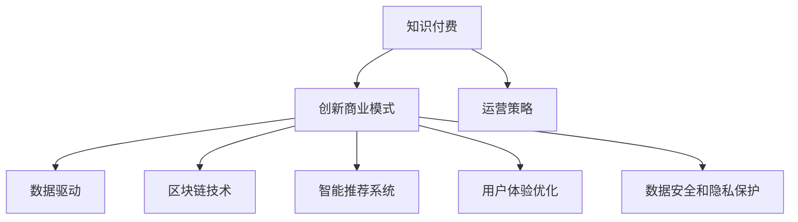

                 

# 知识经济时代下的知识付费创新商业模式运营

> 关键词：知识付费,创新商业模式,运营策略,数据驱动,区块链技术,智能推荐系统,用户体验优化,数据安全和隐私保护

## 1. 背景介绍

### 1.1 问题由来
随着互联网技术的飞速发展，知识付费市场迅速崛起，成为知识经济时代的新兴趋势。自2015年以来，从得到、喜马拉雅到樊登读书，众多知识付费平台开始涌现。然而，知识付费的商业模式面临着诸多挑战：

- 用户忠诚度不高，内容更新迅速，用户黏性不足。
- 市场竞争激烈，同质化严重，缺乏差异化服务。
- 用户信任度低，交易安全难以保障。
- 内容质量参差不齐，缺乏系统化的管理和服务。

这些问题限制了知识付费平台的可持续发展。因此，如何通过创新商业模式，提升运营效率，优化用户体验，成为行业亟待解决的问题。

### 1.2 问题核心关键点
当前知识付费市场的核心关键点包括：
- 如何建立多样化的知识付费内容生态，吸引用户订阅。
- 如何利用大数据和算法技术，精准推荐用户感兴趣的内容。
- 如何保证交易安全，提升用户信任度。
- 如何优化用户体验，提升平台粘性。
- 如何打造独特的商业模式，构建长期竞争优势。

这些核心点共同构成了知识付费平台商业模式运营的核心，需要通过创新的方式加以解决。

### 1.3 问题研究意义
研究知识付费平台的创新商业模式运营，对于推动知识付费市场的发展，提升用户满意度，促进知识共享和传播，具有重要意义：

- 推动知识付费市场从粗放式运营向精细化运营转变，提升整体市场竞争力和用户满意度。
- 通过数据驱动和算法技术，实现精准内容推荐，提升用户体验和平台黏性。
- 通过区块链等技术，保障交易安全和用户隐私，提升用户信任度。
- 探索和实施独特的商业模式，为知识付费平台带来新的收入增长点，构建长期竞争优势。
- 为知识付费平台的运营者提供理论和实践指南，促进知识经济的发展和社会的进步。

## 2. 核心概念与联系

### 2.1 核心概念概述

为更好地理解知识付费创新商业模式的运营，本节将介绍几个密切相关的核心概念：

- 知识付费(Subscription-based Knowledge Services)：指用户为获得特定知识内容或服务，向知识付费平台支付费用的商业模式。知识付费通过筛选优质内容，满足用户个性化知识需求，提升用户满意度。

- 创新商业模式(Innovative Business Models)：指平台在提供知识服务的过程中，通过技术、产品、市场、组织等创新手段，优化用户体验，提升运营效率，实现价值增值的商业模式。

- 运营策略(Operational Strategies)：指平台在知识付费服务的全生命周期内，通过优化流程、提升服务、提高效率等手段，实现用户、平台和内容三方共赢的策略。

- 数据驱动(Data-Driven)：指平台通过大数据和算法技术，对用户行为、内容质量和市场趋势进行分析，实现精准运营和决策，提升平台整体运营效率。

- 区块链技术(Blockchain Technology)：指利用区块链的分布式、不可篡改特性，保障知识付费交易的安全性和透明性，提升用户信任度。

- 智能推荐系统(Recommendation Systems)：指通过机器学习算法，对用户行为和内容进行分析和建模，实现精准推荐，提升用户体验和内容消费效率。

- 用户体验优化(User Experience Optimization)：指通过界面设计、功能优化、服务提升等手段，提升用户在使用知识付费平台时的满意度和黏性。

- 数据安全和隐私保护(Data Security and Privacy Protection)：指平台通过技术和管理手段，保障用户数据和内容的安全性，保护用户隐私，提升用户信任度。

这些核心概念之间的逻辑关系可以通过以下Mermaid流程图来展示：



这个流程图展示了我知识付费平台运营的核心概念及其之间的关系：

1. 知识付费通过提供优质内容满足用户需求。
2. 创新商业模式为平台提供可持续发展的方式。
3. 运营策略优化平台运营全流程，提升运营效率。
4. 数据驱动通过分析用户行为和内容质量，实现精准运营。
5. 区块链技术保障交易安全，提升用户信任。
6. 智能推荐系统实现内容个性化推荐，提升用户体验。
7. 用户体验优化通过界面和功能提升用户满意度。
8. 数据安全和隐私保护保障用户数据安全，提升信任度。

这些概念共同构成了知识付费平台运营的核心框架，有助于提升平台运营效率和用户体验。

## 3. 核心算法原理 & 具体操作步骤
### 3.1 算法原理概述

知识付费平台的创新商业模式运营，本质上是一个通过数据和技术优化运营流程，实现平台价值最大化的过程。其核心思想是：利用大数据和算法技术，对用户行为和内容质量进行分析，实现精准运营和决策，同时引入区块链和智能推荐等创新技术，提升平台的用户体验和信任度。

具体而言，知识付费平台的运营包括以下几个关键步骤：

1. 数据收集与分析：收集用户行为数据、内容质量数据、市场趋势数据等，使用数据分析技术，挖掘用户需求和内容特性。
2. 智能推荐系统：构建基于协同过滤、内容标签、用户画像等算法的推荐模型，实现精准推荐。
3. 运营策略优化：通过A/B测试、流量分析、用户行为监测等手段，不断优化平台的用户体验和服务流程。
4. 区块链技术应用：引入区块链技术，实现交易安全、内容版权保护等功能。
5. 用户体验优化：通过界面设计、功能优化、个性化服务等手段，提升用户黏性和满意度。
6. 数据安全和隐私保护：建立严格的数据保护和隐私管理机制，保障用户数据安全。

### 3.2 算法步骤详解

下面详细介绍每个步骤的详细算法和操作步骤：

#### 3.2.1 数据收集与分析

1. 用户行为数据：记录用户登录、浏览、订阅、支付、评论等行为，形成用户行为日志。

2. 内容质量数据：记录内容的播放次数、点赞数、收藏数、评论数等，评估内容的质量和受欢迎程度。

3. 市场趋势数据：记录行业动态、竞争对手行为、用户反馈等，分析市场趋势和竞争态势。

4. 数据分析：使用统计分析、回归分析、聚类分析等技术，挖掘用户行为和内容质量的特性和规律。

#### 3.2.2 智能推荐系统

1. 协同过滤：分析用户行为数据，找出与目标用户兴趣相似的用户，根据这些用户的行为推荐内容。

2. 内容标签：对内容进行标签化处理，建立内容标签库，使用标签进行内容推荐。

3. 用户画像：根据用户行为数据，构建用户画像，使用画像进行个性化推荐。

4. 推荐算法：构建基于矩阵分解、神经网络、深度学习等算法的推荐模型，实现精准推荐。

#### 3.2.3 运营策略优化

1. A/B测试：对平台功能进行优化，使用A/B测试比较不同版本的性能，选择最优版本。

2. 流量分析：使用网络流量分析工具，优化网站性能，提升用户体验。

3. 用户行为监测：使用行为监测工具，分析用户行为，优化运营策略。

4. 持续改进：根据用户反馈和行为数据，不断优化运营策略，提升平台效率。

#### 3.2.4 区块链技术应用

1. 交易记录：利用区块链技术，记录交易数据，防止数据篡改，提升交易透明度。

2. 版权保护：使用区块链技术，记录内容版权信息，防止内容侵权，保障创作者权益。

3. 智能合约：引入智能合约，自动化处理交易流程，提升效率和公平性。

4. 安全保障：利用区块链的安全特性，保障平台和用户的数据安全。

#### 3.2.5 用户体验优化

1. 界面设计：优化平台界面，提升用户体验，提高用户黏性。

2. 功能优化：完善平台功能，增加新功能，满足用户需求。

3. 个性化服务：根据用户画像和行为数据，提供个性化服务，提升用户满意度。

#### 3.2.6 数据安全和隐私保护

1. 数据加密：使用加密技术，保护用户数据的安全。

2. 访问控制：建立严格的访问控制机制，防止非法访问。

3. 隐私保护：遵守数据隐私保护法规，保护用户隐私。

### 3.3 算法优缺点

知识付费平台的创新商业模式运营，具有以下优点：

1. 精准推荐：通过智能推荐系统，实现内容个性化推荐，提升用户满意度。

2. 运营效率高：通过数据驱动和算法优化，提升平台运营效率，降低运营成本。

3. 用户信任度高：通过区块链技术保障交易安全，提升用户信任度。

4. 用户体验好：通过界面设计、功能优化、个性化服务等手段，提升用户体验。

5. 平台粘性强：通过精准运营和个性化服务，提升用户黏性，延长用户生命周期。

6. 创新性强：通过引入区块链、智能推荐等新技术，实现差异化运营，打造独特竞争优势。

同时，该方法也存在以下局限性：

1. 数据隐私问题：平台在收集和分析用户数据时，可能面临数据隐私和安全的风险。

2. 算法依赖度高：平台的推荐系统、运营策略等高度依赖于算法技术，一旦算法失效，可能导致用户体验下降。

3. 区块链成本高：区块链技术的引入可能增加平台的开发和维护成本，影响经济效益。

4. 用户数据质量差：平台收集的用户数据可能存在噪声和偏差，影响分析结果和推荐效果。

5. 市场变化快：知识付费市场变化快，平台需要不断调整策略，适应市场变化。

尽管存在这些局限性，但就目前而言，基于数据和技术驱动的创新商业模式运营，已成为知识付费平台提升竞争力的主要途径。未来相关研究的重点在于如何更好地平衡数据隐私和平台收益，优化算法和模型，降低区块链成本，提升用户体验和信任度。

### 3.4 算法应用领域

基于知识付费平台的创新商业模式运营，已广泛应用于众多领域，包括但不限于：

- 在线教育：通过知识付费，为用户提供个性化学习服务，提升学习效果。

- 健康医疗：通过知识付费，提供健康科普、疾病预防等知识服务，提升健康素养。

- 金融理财：通过知识付费，提供投资理财、财务规划等专业服务，提升财务管理水平。

- 法律咨询：通过知识付费，提供法律知识、案件分析等服务，提升法律意识。

- 科技研究：通过知识付费，提供科学普及、技术创新等服务，推动科技发展。

除了上述这些领域，知识付费平台还可应用于更多场景，如艺术鉴赏、旅游攻略、旅行美食等，为不同用户群体提供高质量的知识服务。

## 4. 数学模型和公式 & 详细讲解  
### 4.1 数学模型构建

本节将使用数学语言对知识付费平台运营的核心算法进行严格刻画。

假设知识付费平台有 $N$ 个用户，每个用户每天有 $M$ 次行为记录，平台有 $K$ 个知识内容，每个内容每天有 $L$ 次阅读记录。设 $U=\{u_1,u_2,\dots,u_N\}$ 为用户集合，$C=\{c_1,c_2,\dots,c_K\}$ 为内容集合。

定义用户 $u$ 对内容 $c$ 的评分 $r_{uc}$ 为：

$$
r_{uc} = \alpha_u + \beta_c + \gamma_{uc}
$$

其中，$\alpha_u$ 为用户 $u$ 的评分向量，$\beta_c$ 为内容 $c$ 的评分向量，$\gamma_{uc}$ 为用户 $u$ 和内容 $c$ 之间的互动评分，如阅读、点赞等。

定义内容 $c$ 的流行度 $p_c$ 为：

$$
p_c = \frac{1}{L} \sum_{u=1}^N \sum_{l=1}^L r_{uc}
$$

定义内容 $c$ 的特征向量 $\vec{x}_c$ 为：

$$
\vec{x}_c = [f_1(c), f_2(c), \dots, f_k(c)]
$$

其中 $f_i(c)$ 为内容 $c$ 的 $i$ 维特征，如标题、摘要、标签等。

定义用户 $u$ 的特征向量 $\vec{y}_u$ 为：

$$
\vec{y}_u = [g_1(u), g_2(u), \dots, g_k(u)]
$$

其中 $g_i(u)$ 为用户 $u$ 的 $i$ 维特征，如年龄、性别、地域等。

定义用户行为数据 $R$ 为：

$$
R = \{(u_i,l_i,c_i,r_{u_ic_i})\}_{i=1}^L
$$

其中 $u_i$ 为用户，$l_i$ 为行为时间戳，$c_i$ 为内容，$r_{u_ic_i}$ 为行为评分。

定义内容质量数据 $C$ 为：

$$
C = \{(c_j,v_j,p_j)\}_{j=1}^K
$$

其中 $c_j$ 为内容，$v_j$ 为内容质量评分，$p_j$ 为内容播放次数。

定义市场趋势数据 $T$ 为：

$$
T = \{(t_m,n_m,f_m)\}_{m=1}^M
$$

其中 $t_m$ 为时间戳，$n_m$ 为事件类型，$f_m$ 为事件特征。

### 4.2 公式推导过程

以下我们以协同过滤推荐算法为例，推导其推荐公式。

设 $U=\{u_1,u_2,\dots,u_N\}$ 为用户集合，$C=\{c_1,c_2,\dots,c_K\}$ 为内容集合，用户 $u$ 对内容 $c$ 的评分 $r_{uc}$ 为：

$$
r_{uc} = \alpha_u + \beta_c + \gamma_{uc}
$$

其中 $\alpha_u$ 为用户 $u$ 的评分向量，$\beta_c$ 为内容 $c$ 的评分向量，$\gamma_{uc}$ 为用户 $u$ 和内容 $c$ 之间的互动评分，如阅读、点赞等。

用户 $u$ 对内容 $c$ 的评分 $r_{uc}$ 可以看作三部分组成：

1. 用户评分向量 $\alpha_u$：

$$
\alpha_u = \sum_{k=1}^k \alpha_{uk}x_{uk}
$$

2. 内容评分向量 $\beta_c$：

$$
\beta_c = \sum_{k=1}^k \beta_{ck}x_{ck}
$$

3. 互动评分 $\gamma_{uc}$：

$$
\gamma_{uc} = \sum_{k=1}^k \gamma_{uck}x_{uck}
$$

其中 $\alpha_{uk}, \beta_{ck}, \gamma_{uck}$ 分别为用户和内容的 $k$ 维特征。

将上述三部分合并，得到：

$$
r_{uc} = \sum_{k=1}^k (\alpha_{uk} + \beta_{ck} + \gamma_{uck})x_{uk}
$$

设用户 $u$ 和内容 $c$ 的相似度为 $s_{uc}$：

$$
s_{uc} = \frac{r_{uc}}{\sqrt{\sum_{k=1}^k (\alpha_{uk}^2 + \beta_{ck}^2 + \gamma_{uck}^2)x_{uk}}
$$

使用用户 $u$ 的相似度向量 $S_u$，计算内容 $c$ 的推荐评分：

$$
\hat{r}_{uc} = \sum_{c'} s_{uc'} \hat{r}_{uc'}
$$

其中 $\hat{r}_{uc'}$ 为内容 $c'$ 的推荐评分，$s_{uc'}$ 为用户 $u'$ 和内容 $c'$ 的相似度。

最终，将 $\hat{r}_{uc}$ 作为内容 $c$ 推荐给用户 $u$ 的评分，排序推荐内容。

## 5. 项目实践：代码实例和详细解释说明
### 5.1 开发环境搭建

在进行知识付费平台运营的实践前，我们需要准备好开发环境。以下是使用Python进行PyTorch开发的环境配置流程：

1. 安装Anaconda：从官网下载并安装Anaconda，用于创建独立的Python环境。

2. 创建并激活虚拟环境：
```bash
conda create -n pytorch-env python=3.8 
conda activate pytorch-env
```

3. 安装PyTorch：根据CUDA版本，从官网获取对应的安装命令。例如：
```bash
conda install pytorch torchvision torchaudio cudatoolkit=11.1 -c pytorch -c conda-forge
```

4. 安装TensorFlow：
```bash
conda install tensorflow==2.8
```

5. 安装各类工具包：
```bash
pip install numpy pandas scikit-learn matplotlib tqdm jupyter notebook ipython
```

完成上述步骤后，即可在`pytorch-env`环境中开始实践。

### 5.2 源代码详细实现

这里我们以知识付费平台的用户行为分析和推荐系统为例，给出使用PyTorch进行数据驱动的运营策略优化的PyTorch代码实现。

首先，定义用户行为数据处理函数：

```python
import torch
from torch.utils.data import Dataset, DataLoader
from torch.nn import Linear, ReLU, Embedding
from torch.optim import Adam
from sklearn.metrics import mean_squared_error, precision_recall_curve

class UserBehaviorDataset(Dataset):
    def __init__(self, user_data, content_data, behavior_data, max_length=10):
        self.user_data = user_data
        self.content_data = content_data
        self.behavior_data = behavior_data
        self.max_length = max_length
        
    def __len__(self):
        return len(self.behavior_data)
    
    def __getitem__(self, index):
        user_id, content_id, behavior_score = self.behavior_data[index]
        
        user_embedding = self.user_data[user_id]
        content_embedding = self.content_data[content_id]
        
        user_vector = torch.tensor(user_embedding, dtype=torch.float)
        content_vector = torch.tensor(content_embedding, dtype=torch.float)
        
        return {'user_vector': user_vector,
                'content_vector': content_vector,
                'behavior_score': torch.tensor(behavior_score, dtype=torch.float)}
```

然后，定义模型和优化器：

```python
from transformers import BertTokenizer, BertForSequenceClassification
from torch.nn import BCEWithLogitsLoss

model = BertForSequenceClassification.from_pretrained('bert-base-cased', num_labels=2)
tokenizer = BertTokenizer.from_pretrained('bert-base-cased')

optimizer = Adam(model.parameters(), lr=2e-5)
criterion = BCEWithLogitsLoss()
```

接着，定义训练和评估函数：

```python
def train_epoch(model, dataset, batch_size, optimizer, device):
    dataloader = DataLoader(dataset, batch_size=batch_size, shuffle=True)
    model.to(device)
    model.train()
    epoch_loss = 0
    for batch in dataloader:
        user_vector = batch['user_vector'].to(device)
        content_vector = batch['content_vector'].to(device)
        behavior_score = batch['behavior_score'].to(device)
        optimizer.zero_grad()
        outputs = model(user_vector, content_vector)
        loss = criterion(outputs, behavior_score)
        epoch_loss += loss.item()
        loss.backward()
        optimizer.step()
    return epoch_loss / len(dataloader)

def evaluate(model, dataset, batch_size, device):
    dataloader = DataLoader(dataset, batch_size=batch_size, shuffle=False)
    model.eval()
    with torch.no_grad():
        predictions, labels = [], []
        for batch in dataloader:
            user_vector = batch['user_vector'].to(device)
            content_vector = batch['content_vector'].to(device)
            outputs = model(user_vector, content_vector)
            predictions.append(outputs.sigmoid().tolist())
            labels.append(batch['behavior_score'].tolist())
        
        precision, recall, _ = precision_recall_curve(labels, predictions)
        return precision, recall
```

最后，启动训练流程并在测试集上评估：

```python
epochs = 5
batch_size = 16
device = 'cuda' if torch.cuda.is_available() else 'cpu'

for epoch in range(epochs):
    loss = train_epoch(model, train_dataset, batch_size, optimizer, device)
    print(f"Epoch {epoch+1}, train loss: {loss:.3f}")
    
    precision, recall = evaluate(model, test_dataset, batch_size, device)
    print(f"Epoch {epoch+1}, test precision: {precision:.3f}, recall: {recall:.3f}")
    
print("Training complete.")
```

以上就是使用PyTorch对知识付费平台用户行为分析和推荐系统进行训练的完整代码实现。可以看到，通过构建用户行为数据集和内容数据集，定义模型和优化器，并使用训练和评估函数，可以系统地对知识付费平台的运营策略进行优化。

### 5.3 代码解读与分析

让我们再详细解读一下关键代码的实现细节：

**UserBehaviorDataset类**：
- `__init__`方法：初始化用户行为数据、内容数据和行为评分数据。
- `__len__`方法：返回数据集的样本数量。
- `__getitem__`方法：对单个样本进行处理，将用户和内容向量进行拼接，形成输入。

**模型和优化器**：
- 定义BertForSequenceClassification模型作为用户行为分析和推荐系统的主模型。
- 使用Adam优化器，设置学习率。

**训练和评估函数**：
- 使用DataLoader对数据集进行批次化加载。
- 在训练时，前向传播计算损失函数，反向传播更新模型参数。
- 在评估时，只进行前向传播，输出预测结果和真实标签。
- 使用precision_recall_curve函数计算精度和召回率。

**训练流程**：
- 定义总的epoch数和batch size，开始循环迭代。
- 每个epoch内，在训练集上训练，输出平均loss。
- 在测试集上评估，输出precision和recall指标。
- 所有epoch结束后，打印训练完成信息。

可以看到，通过PyTorch的强大封装和灵活性，我们能够轻松地构建知识付费平台的推荐系统。然而，实际的运营策略优化还需要结合具体平台的实际需求和数据特点进行综合设计和优化。

## 6. 实际应用场景
### 6.1 在线教育平台

在线教育平台通过知识付费服务，提供个性化学习内容，提升用户学习效果。平台可以采用数据驱动的运营策略，通过智能推荐系统实现内容精准推荐，同时利用区块链技术保障交易安全，提升用户信任度。

在技术实现上，平台可以收集用户学习行为数据，如登录时间、学习时长、课程评价等，对用户进行画像分析。使用智能推荐算法，根据用户画像和行为数据，推荐用户感兴趣的学习内容和课程，提升学习效果。平台还可以使用区块链技术，记录课程交易数据，保障交易安全，提升用户信任度。

### 6.2 健康医疗平台

健康医疗平台通过知识付费服务，提供健康科普、疾病预防等服务，提升用户健康素养。平台可以采用数据驱动的运营策略，通过智能推荐系统实现健康科普内容的精准推荐，同时利用区块链技术保障交易安全，提升用户信任度。

在技术实现上，平台可以收集用户健康行为数据，如饮食记录、运动数据、健康咨询等，对用户进行画像分析。使用智能推荐算法，根据用户画像和行为数据，推荐用户感兴趣的健康科普内容和疾病预防知识，提升用户健康素养。平台还可以使用区块链技术，记录健康咨询和付费记录，保障交易安全，提升用户信任度。

### 6.3 金融理财平台

金融理财平台通过知识付费服务，提供投资理财、财务规划等服务，提升用户财务管理水平。平台可以采用数据驱动的运营策略，通过智能推荐系统实现理财知识的精准推荐，同时利用区块链技术保障交易安全，提升用户信任度。

在技术实现上，平台可以收集用户理财行为数据，如投资记录、收益数据、财务咨询等，对用户进行画像分析。使用智能推荐算法，根据用户画像和行为数据，推荐用户感兴趣的理财知识和财务规划方案，提升用户财务管理水平。平台还可以使用区块链技术，记录投资交易和理财咨询记录，保障交易安全，提升用户信任度。

### 6.4 未来应用展望

随着知识付费市场的不断发展和成熟，基于数据和技术驱动的创新商业模式运营，将在更多领域得到应用，为各行各业带来变革性影响。

在智慧医疗领域，基于知识付费的在线健康咨询、疾病预防、健康管理等服务，将提升医疗服务的智能化水平，辅助医生诊疗，加速新药开发进程。

在智能教育领域，知识付费平台可应用于作业批改、学情分析、知识推荐等方面，因材施教，促进教育公平，提高教学质量。

在智慧城市治理中，知识付费平台可应用于城市事件监测、舆情分析、应急指挥等环节，提高城市管理的自动化和智能化水平，构建更安全、高效的未来城市。

此外，在企业生产、社会治理、文娱传媒等众多领域，知识付费平台的运营者可探索和实施独特的商业模式，为行业带来新的收入增长点，构建长期竞争优势。相信随着技术的日益成熟，知识付费平台的运营策略将不断优化，推动知识经济的发展和社会的进步。

## 7. 工具和资源推荐
### 7.1 学习资源推荐

为了帮助开发者系统掌握知识付费平台的创新商业模式运营的理论基础和实践技巧，这里推荐一些优质的学习资源：

1. 《Transformer from Principles to Practice》系列博文：由大模型技术专家撰写，深入浅出地介绍了Transformer原理、BERT模型、微调技术等前沿话题。

2. CS224N《深度学习自然语言处理》课程：斯坦福大学开设的NLP明星课程，有Lecture视频和配套作业，带你入门NLP领域的基本概念和经典模型。

3. 《Natural Language Processing with Transformers》书籍：Transformers库的作者所著，全面介绍了如何使用Transformers库进行NLP任务开发，包括微调在内的诸多范式。

4. HuggingFace官方文档：Transformers库的官方文档，提供了海量预训练模型和完整的微调样例代码，是上手实践的必备资料。

5. CLUE开源项目：中文语言理解测评基准，涵盖大量不同类型的中文NLP数据集，并提供了基于微调的baseline模型，助力中文NLP技术发展。

通过对这些资源的学习实践，相信你一定能够快速掌握知识付费平台的运营策略，并用于解决实际的NLP问题。
###  7.2 开发工具推荐

高效的开发离不开优秀的工具支持。以下是几款用于知识付费平台运营开发的常用工具：

1. PyTorch：基于Python的开源深度学习框架，灵活动态的计算图，适合快速迭代研究。大部分预训练语言模型都有PyTorch版本的实现。

2. TensorFlow：由Google主导开发的开源深度学习框架，生产部署方便，适合大规模工程应用。同样有丰富的预训练语言模型资源。

3. Transformers库：HuggingFace开发的NLP工具库，集成了众多SOTA语言模型，支持PyTorch和TensorFlow，是进行运营策略优化的利器。

4. Weights & Biases：模型训练的实验跟踪工具，可以记录和可视化模型训练过程中的各项指标，方便对比和调优。与主流深度学习框架无缝集成。

5. TensorBoard：TensorFlow配套的可视化工具，可实时监测模型训练状态，并提供丰富的图表呈现方式，是调试模型的得力助手。

6. Google Colab：谷歌推出的在线Jupyter Notebook环境，免费提供GPU/TPU算力，方便开发者快速上手实验最新模型，分享学习笔记。

合理利用这些工具，可以显著提升知识付费平台运营的开发效率，加快创新迭代的步伐。

### 7.3 相关论文推荐

知识付费平台的创新商业模式运营源于学界的持续研究。以下是几篇奠基性的相关论文，推荐阅读：

1. Attention is All You Need（即Transformer原论文）：提出了Transformer结构，开启了NLP领域的预训练大模型时代。

2. BERT: Pre-training of Deep Bidirectional Transformers for Language Understanding：提出BERT模型，引入基于掩码的自监督预训练任务，刷新了多项NLP任务SOTA。

3. Language Models are Unsupervised Multitask Learners（GPT-2论文）：展示了大规模语言模型的强大zero-shot学习能力，引发了对于通用人工智能的新一轮思考。

4. Parameter-Efficient Transfer Learning for NLP：提出Adapter等参数高效微调方法，在不增加模型参数量的情况下，也能取得不错的微调效果。

5. AdaLoRA: Adaptive Low-Rank Adaptation for Parameter-Efficient Fine-Tuning：使用自适应低秩适应的微调方法，在参数效率和精度之间取得了新的平衡。

这些论文代表了大模型微调技术的发展脉络。通过学习这些前沿成果，可以帮助研究者把握学科前进方向，激发更多的创新灵感。

## 8. 总结：未来发展趋势与挑战

### 8.1 总结

本文对知识付费平台的创新商业模式运营进行了全面系统的介绍。首先阐述了知识付费平台的背景和核心关键点，明确了平台运营的核心概念和逻辑关系。其次，从原理到实践，详细讲解了知识付费平台运营的核心算法和操作步骤，给出了运营策略优化的完整代码实例。同时，本文还广泛探讨了知识付费平台在在线教育、健康医疗、金融理财等众多领域的实际应用场景，展示了知识付费平台运营的巨大潜力。此外，本文精选了知识付费平台运营的相关学习资源，力求为开发者提供全方位的技术指引。

通过本文的系统梳理，可以看到，知识付费平台在数据驱动和算法优化下，实现了精准运营和决策，提升了用户体验和平台效率，同时也面临着数据隐私、算法依赖、区块链成本等诸多挑战。尽管如此，基于数据和技术驱动的创新商业模式运营，已经成为知识付费平台提升竞争力的主要途径。未来相关研究的重点在于如何更好地平衡数据隐私和平台收益，优化算法和模型，降低区块链成本，提升用户体验和信任度。

### 8.2 未来发展趋势

展望未来，知识付费平台的创新商业模式运营将呈现以下几个发展趋势：

1. 用户画像更精细：通过深度学习和大数据分析，构建更精细化的用户画像，实现更精准的内容推荐和运营策略优化。

2. 数据安全和隐私保护更严格：随着数据隐私法规的不断完善，知识付费平台将更加重视用户数据的隐私保护，提升用户信任度。

3. 运营策略更智能化：通过AI技术，实现运营策略的自动化和智能化，提升运营效率和用户满意度。

4. 区块链技术更普及：随着区块链技术的不断成熟和普及，知识付费平台将更广泛地应用区块链技术，保障交易安全和内容版权。

5. 内容生产更个性化：通过个性化推荐和个性化服务，提升内容生产效率和质量，满足用户多样化的需求。

6. 用户体验更优化：通过界面设计、功能优化、服务提升等手段，提升用户使用体验，提升用户黏性。

以上趋势凸显了知识付费平台运营的核心方向。这些方向的探索发展，必将进一步提升知识付费平台的运营效率和用户体验，为知识经济的发展注入新的动力。

### 8.3 面临的挑战

尽管知识付费平台的创新商业模式运营已经取得了不少成果，但在迈向更加智能化、普适化应用的过程中，它仍面临着诸多挑战：

1. 数据隐私问题：平台在收集和分析用户数据时，可能面临数据隐私和安全的风险。

2. 算法依赖度高：平台的推荐系统、运营策略等高度依赖于算法技术，一旦算法失效，可能导致用户体验下降。

3. 区块链成本高：区块链技术的引入可能增加平台的开发和维护成本，影响经济效益。

4. 用户数据质量差：平台收集的用户数据可能存在噪声和偏差，影响分析结果和推荐效果。

5. 市场变化快：知识付费市场变化快，平台需要不断调整策略，适应市场变化。

尽管存在这些挑战，但就目前而言，基于数据和技术驱动的创新商业模式运营，已成为知识付费平台提升竞争力的主要途径。未来相关研究的重点在于如何更好地平衡数据隐私和平台收益，优化算法和模型，降低区块链成本，提升用户体验和信任度。

### 8.4 研究展望

面向未来，知识付费平台的创新商业模式运营还需要在其他方面寻求新的突破：

1. 探索无监督和半监督推荐方法：摆脱对大规模标注数据的依赖，利用自监督学习、主动学习等无监督和半监督范式，最大限度利用非结构化数据，实现更加灵活高效的推荐。

2. 研究参数高效和计算高效的运营策略：开发更加参数高效的运营策略，在固定大部分运营参数的同时，只更新极少量的用户画像和推荐模型参数。同时优化运营策略的计算图，减少前向传播和反向传播的资源消耗，实现更加轻量级、实时性的运营。

3. 引入因果分析和博弈论工具：将因果分析方法引入运营策略优化，识别出运营决策的关键特征，增强运营策略的因果性和逻辑性。借助博弈论工具刻画人机交互过程，主动探索并规避运营策略的脆弱点，提高系统稳定性。

4. 纳入伦理道德约束：在运营策略设计中引入伦理导向的评估指标，过滤和惩罚有偏见、有害的运营内容，确保运营策略符合人类价值观和伦理道德。

这些研究方向的探索，必将引领知识付费平台运营向更高的台阶，为构建安全、可靠、可解释、可控的智能系统铺平道路。面向未来，知识付费平台的运营者需要勇于创新、敢于突破，才能不断拓展知识付费平台的边界，让知识经济的发展更上一层楼。

## 9. 附录：常见问题与解答

**Q1：知识付费平台如何构建用户画像？**

A: 知识付费平台可以通过收集用户行为数据，如登录时间、学习时长、课程评价等，建立用户画像。具体而言：

1. 数据收集：使用爬虫、API接口等方式，收集用户行为数据和内容质量数据。

2. 特征提取：对用户行为数据进行特征提取，如用户活跃度、课程偏好、学习进度等。

3. 画像建模：使用机器学习算法，如聚类分析、协同过滤、关联规则挖掘等，对用户进行画像建模。

4. 画像更新：根据新的行为数据，定期更新用户画像，保持画像的准确性和时效性。

**Q2：知识付费平台如何保障交易安全？**

A: 知识付费平台可以通过区块链技术保障交易安全。具体而言：

1. 交易记录：利用区块链技术，记录交易数据，防止数据篡改，提升交易透明度。

2. 版权保护：使用区块链技术，记录内容版权信息，防止内容侵权，保障创作者权益。

3. 智能合约：引入智能合约，自动化处理交易流程，提升效率和公平性。

4. 安全保障：利用区块链的安全特性，保障平台和用户的数据安全。

**Q3：知识付费平台如何优化用户体验？**

A: 知识付费平台可以通过界面设计、功能优化、个性化服务等手段，优化用户体验。具体而言：

1. 界面设计：优化平台界面，提升用户体验，提高用户黏性。

2. 功能优化：完善平台功能，增加新功能，满足用户需求。

3. 个性化服务：根据用户画像和行为数据，提供个性化服务，提升用户满意度。

**Q4：知识付费平台如何提升内容质量？**

A: 知识付费平台可以通过智能推荐系统提升内容质量。具体而言：

1. 内容推荐：使用智能推荐算法，根据用户画像和行为数据，推荐用户感兴趣的内容。

2. 内容质量控制：通过用户评价、专家审核等方式，对内容质量进行控制，确保内容优质。

3. 内容更新：根据用户反馈和市场趋势，定期更新和优化内容，保持内容的时效性和相关性。

4. 内容多样化：引入多样化内容，满足用户不同兴趣需求，提升内容吸引力。

**Q5：知识付费平台如何处理数据隐私问题？**

A: 知识付费平台可以通过严格的数据保护和隐私管理机制，保障用户数据隐私。具体而言：

1. 数据加密：使用加密技术，保护用户数据的安全。

2. 访问控制：建立严格的访问控制机制，防止非法访问。

3. 隐私保护：遵守数据隐私保护法规，保护用户隐私。

4. 数据匿名化：对用户数据进行匿名化处理，防止数据泄露。

通过以上措施，知识付费平台可以在保障用户数据隐私的同时，实现精准运营和用户画像的建立，提升运营效率和用户体验。

---

作者：禅与计算机程序设计艺术 / Zen and the Art of Computer Programming

