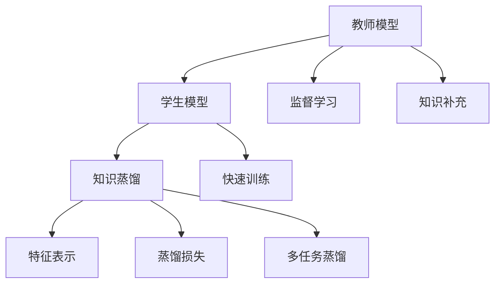

                 

## 1. 背景介绍

### 1.1 问题由来
医学图像分析是医疗领域中的重要分支，通过对医学影像数据的深入分析和挖掘，能够提供精准的疾病诊断、治疗方案、预后评估等信息，极大地推动了医疗科技的发展。然而，医学图像往往具有高度复杂性和高维度特征，其分析和解读需要高精度的智能算法支持。随着深度学习技术的兴起，医学图像分析逐步进入了深度学习时代，但由于数据量巨大且分布复杂，传统训练方式存在一定的局限性。

### 1.2 问题核心关键点
医学图像分析的核心问题在于如何高效地训练出性能优异的模型。传统的监督学习方式依赖大量标注数据，且对数据质量要求极高。医学数据具有高噪声和不确定性，因此基于监督学习的医学图像分析模型往往需要大量的专家标注，成本高昂且效率低下。

知识蒸馏（Knowledge Distillation, KD）技术的提出，为医学图像分析提供了新的解决思路。KD通过将教师模型的知识转移至学生模型，从而在保留教师模型性能的同时，大大减少了学生模型所需的标注数据量和计算资源，特别是在医学领域，KD技术展现了其独特的优势。

### 1.3 问题研究意义
知识蒸馏在医学图像分析中的应用，具有重要的研究意义：

1. **减少标注成本**：通过KD技术，学生模型可以在较少的标注样本上进行训练，极大地降低了标注成本，使得大规模医学数据集的获取更加容易。
2. **提高模型泛化能力**：KD技术的核心在于将教师模型的先验知识迁移到学生模型，使得学生模型在未知数据上的泛化能力更强，可以应对不同的临床场景。
3. **加速模型训练**：相比于从头训练模型，KD技术可以显著缩短模型的训练时间，提高研发效率。
4. **提升模型性能**：KD技术能够通过融合多个模型的知识，提升最终模型的性能和鲁棒性，在医学图像分析中尤为重要。
5. **促进多模态学习**：KD技术不仅可以在同一种模态（如图像、文本等）之间进行知识蒸馏，还可以在不同模态之间进行知识迁移，实现多模态学习，进一步提升模型性能。

## 2. 核心概念与联系

### 2.1 核心概念概述

为更好地理解知识蒸馏在医学图像分析中的应用，本节将介绍几个关键概念：

- **知识蒸馏（Knowledge Distillation, KD）**：通过将教师模型的知识迁移到学生模型，从而训练出性能接近甚至优于教师模型的学生模型。其核心在于通过压缩知识，使得知识能够高效地转移到学生模型中。
- **教师模型（Teacher Model）**：指经过充分训练的，性能优秀的模型。在医学图像分析中，教师模型可以是大型医学图像数据集上训练出的深度学习模型。
- **学生模型（Student Model）**：指需要优化的，性能相对较差的模型。学生模型通常比教师模型参数量更小，结构更简单。
- **特征表示（Feature Representation）**：教师模型和学生模型在特定层级上的特征表示，可以用于知识蒸馏的目标函数设计。
- **蒸馏损失（Distillation Loss）**：知识蒸馏过程中，用于衡量教师模型和学生模型之间的知识传递效果。
- **多任务蒸馏（Multi-task Distillation）**：在多个相关任务上对教师模型进行蒸馏，使得学生模型在多个任务上都能获得良好的性能。

这些核心概念之间的逻辑关系可以通过以下Mermaid流程图来展示：



这个流程图展示出知识蒸馏在医学图像分析中的核心流程：

1. 教师模型通过大规模监督学习获得丰富的特征表示。
2. 学生模型使用教师模型的特征表示进行知识蒸馏。
3. 蒸馏损失衡量教师模型和学生模型之间的知识传递效果。
4. 多任务蒸馏在多个相关任务上进行知识迁移，提升学生模型的泛化能力。

## 3. 核心算法原理 & 具体操作步骤
### 3.1 算法原理概述

知识蒸馏在医学图像分析中的应用，其核心原理在于通过将教师模型的特征表示映射到学生模型中，从而提升学生模型的性能。具体来说，知识蒸馏技术可以通过以下步骤实现：

1. **特征提取**：教师模型和学生模型在特定层级上提取特征表示。
2. **知识蒸馏**：通过教师模型的特征表示和学生模型的特征表示之间的匹配，训练学生模型。
3. **损失函数设计**：设计蒸馏损失函数，衡量教师模型和学生模型之间的知识传递效果。
4. **优化训练**：通过最小化蒸馏损失，优化学生模型参数，使其逼近教师模型。

### 3.2 算法步骤详解

以下是知识蒸馏在医学图像分析中的应用步骤：

**Step 1: 准备教师和学生模型**
- 选择合适的教师模型和学生模型。教师模型可以是大型医学图像数据集上训练的深度学习模型，如ResNet、Inception等。学生模型可以是较为简单的模型，如AlexNet、VGG等。
- 将教师模型和学生模型的权重进行初始化，学生模型的初始权重通常设置为随机值或教师模型的一部分参数。

**Step 2: 特征提取与特征对齐**
- 在教师模型和学生模型中选择特定层级（如全连接层或卷积层）提取特征表示。
- 将教师模型的特征表示和学生模型的特征表示进行对齐，可以采用欧式距离、KL散度等方法衡量两者之间的相似度。
- 设计蒸馏损失函数，衡量两者之间的匹配效果。

**Step 3: 优化训练**
- 在每个训练批次中，将教师模型的特征表示和学生模型的特征表示输入蒸馏损失函数中。
- 最小化蒸馏损失，优化学生模型的参数，使其逐步逼近教师模型。
- 可以引入正则化技术，如L2正则、Dropout等，避免过拟合。

**Step 4: 评估与调整**
- 在训练过程中，周期性地在验证集上评估学生模型的性能。
- 调整学生模型的超参数，如学习率、批大小等，以优化模型性能。
- 重复上述步骤，直到学生模型收敛或达到预设的性能指标。

### 3.3 算法优缺点

知识蒸馏在医学图像分析中的应用，具有以下优点：

1. **减少标注成本**：学生模型可以在较少的标注样本上进行训练，极大地降低了标注成本，使得大规模医学数据集的获取更加容易。
2. **提高模型泛化能力**：通过融合教师模型的知识，学生模型在未知数据上的泛化能力更强，可以应对不同的临床场景。
3. **加速模型训练**：相比于从头训练模型，KD技术可以显著缩短模型的训练时间，提高研发效率。
4. **提升模型性能**：KD技术能够通过融合多个模型的知识，提升最终模型的性能和鲁棒性。
5. **促进多模态学习**：KD技术不仅可以在同一种模态（如图像、文本等）之间进行知识蒸馏，还可以在不同模态之间进行知识迁移，实现多模态学习，进一步提升模型性能。

然而，KD技术在医学图像分析中也存在一些缺点：

1. **知识传递的复杂性**：教师模型和学生模型之间的知识传递需要精准对齐，如果对齐不当，会导致知识传递效果不佳。
2. **蒸馏损失设计困难**：如何设计有效的蒸馏损失函数，使得教师模型和学生模型之间的匹配效果最佳，是一个复杂的工程问题。
3. **学生模型性能局限**：学生模型的性能受限于教师模型，如果教师模型性能不佳，学生模型的性能也会受到影响。

### 3.4 算法应用领域

知识蒸馏技术在医学图像分析中有着广泛的应用，主要包括以下几个领域：

1. **医学影像分类**：将大型医学影像数据集上训练的教师模型知识迁移到学生模型，提升学生模型在影像分类任务上的性能。
2. **医学影像分割**：通过知识蒸馏，训练出能够进行精准医学影像分割的学生模型。
3. **医学影像检测**：将教师模型在医学影像检测任务上的知识，迁移到学生模型中，提升学生模型的检测能力。
4. **多模态医学影像分析**：结合影像、文本等多种模态数据，通过多模态知识蒸馏，提升模型的综合分析能力。
5. **个性化医疗**：根据病人的医学影像数据，通过知识蒸馏技术训练出个性化诊断模型，提升诊疗效果。

这些应用场景展示了知识蒸馏在医学图像分析中的重要性和广泛性。通过KD技术，医学影像分析可以更加高效、精准地服务于临床，推动医疗科技的发展。

## 4. 数学模型和公式 & 详细讲解 & 举例说明

### 4.1 数学模型构建

知识蒸馏在医学图像分析中的数学模型构建，可以基于监督学习的方式进行设计。假设教师模型为 $M_{T}$，学生模型为 $M_{S}$，输入数据为 $X$，目标标签为 $Y$。

知识蒸馏的目标是最小化学生模型 $M_{S}$ 和教师模型 $M_{T}$ 之间的差异，同时最小化学生模型在测试集上的损失。具体来说，知识蒸馏的数学模型可以表示为：

$$
\min_{\theta_S} \frac{1}{N} \sum_{i=1}^N \ell_{S}(y_i, M_{S}(x_i; \theta_S)) + \lambda \cdot \mathcal{L}_{D}(M_{T}(x_i; \theta_T), M_{S}(x_i; \theta_S))
$$

其中 $\ell_{S}(y_i, M_{S}(x_i; \theta_S))$ 为学生模型在 $i$ 个样本上的损失，$\mathcal{L}_{D}(M_{T}(x_i; \theta_T), M_{S}(x_i; \theta_S))$ 为蒸馏损失，$\lambda$ 为蒸馏损失的权重。

### 4.2 公式推导过程

以下以医学影像分类任务为例，推导知识蒸馏的蒸馏损失函数及其梯度计算公式。

假设教师模型 $M_{T}$ 在输入 $x$ 上的输出为 $P_{T}(x)$，学生模型 $M_{S}$ 在输入 $x$ 上的输出为 $P_{S}(x)$，分别使用softmax函数进行分类。分类任务的目标是最大化交叉熵损失，即：

$$
\ell_{S}(y_i, M_{S}(x_i; \theta_S)) = -y_i \log P_{S}(x_i; \theta_S) - (1-y_i) \log (1-P_{S}(x_i; \theta_S))
$$

蒸馏损失可以定义为教师模型的输出与学生模型的输出之间的交叉熵损失：

$$
\mathcal{L}_{D}(M_{T}(x_i; \theta_T), M_{S}(x_i; \theta_S)) = -\sum_j y_j \log P_{S}(x_i; \theta_S)
$$

其中 $y_j$ 为教师模型在 $j$ 个类别的输出概率。

结合上述公式，知识蒸馏的总损失函数可以表示为：

$$
\mathcal{L}(\theta_S) = \frac{1}{N} \sum_{i=1}^N [-y_i \log P_{S}(x_i; \theta_S) - (1-y_i) \log (1-P_{S}(x_i; \theta_S))] + \lambda \cdot [-\sum_j y_j \log P_{S}(x_i; \theta_S)]
$$

通过链式法则，学生模型 $M_{S}$ 的梯度计算公式为：

$$
\frac{\partial \mathcal{L}(\theta_S)}{\partial \theta_S} = \frac{\partial \ell_{S}}{\partial \theta_S} + \lambda \cdot \frac{\partial \mathcal{L}_{D}}{\partial \theta_S}
$$

其中 $\frac{\partial \ell_{S}}{\partial \theta_S}$ 为学生模型在监督学习任务上的梯度，$\frac{\partial \mathcal{L}_{D}}{\partial \theta_S}$ 为蒸馏损失的梯度。

### 4.3 案例分析与讲解

以医学影像分割任务为例，介绍知识蒸馏的具体实现过程。

假设教师模型为U-Net，学生模型为轻量级残差网络（ResNet）。U-Net模型在大规模医学影像数据集上进行监督学习，学习到精准的医学影像分割任务的知识。通过知识蒸馏，将U-Net模型的知识迁移到ResNet模型中。

具体步骤如下：

1. 选择U-Net作为教师模型，ResNet作为学生模型。
2. 对U-Net模型进行预训练，并在验证集上进行超参数调优。
3. 将U-Net模型的特征表示作为蒸馏源，将ResNet模型的特征表示作为蒸馏目标。
4. 设计蒸馏损失函数，衡量两者之间的差异。
5. 在训练集上使用蒸馏损失函数优化ResNet模型。
6. 在验证集上周期性地评估ResNet模型的性能，调整蒸馏损失的权重，优化模型。

通过知识蒸馏，ResNet模型能够学习到U-Net模型的先验知识，提升在医学影像分割任务上的性能。

## 5. 项目实践：代码实例和详细解释说明

### 5.1 开发环境搭建

在进行知识蒸馏实践前，我们需要准备好开发环境。以下是使用Python进行PyTorch开发的环境配置流程：

1. 安装Anaconda：从官网下载并安装Anaconda，用于创建独立的Python环境。

2. 创建并激活虚拟环境：
```bash
conda create -n pytorch-env python=3.8 
conda activate pytorch-env
```

3. 安装PyTorch：根据CUDA版本，从官网获取对应的安装命令。例如：
```bash
conda install pytorch torchvision torchaudio cudatoolkit=11.1 -c pytorch -c conda-forge
```

4. 安装Transformer库：
```bash
pip install transformers
```

5. 安装各类工具包：
```bash
pip install numpy pandas scikit-learn matplotlib tqdm jupyter notebook ipython
```

完成上述步骤后，即可在`pytorch-env`环境中开始知识蒸馏实践。

### 5.2 源代码详细实现

下面以医学影像分类任务为例，给出使用Transformers库进行知识蒸馏的PyTorch代码实现。

首先，定义医学影像分类任务的训练函数：

```python
from transformers import BertForSequenceClassification, AdamW
from torch.utils.data import DataLoader
from tqdm import tqdm

class MedicalImageDataset(Dataset):
    def __init__(self, images, labels):
        self.images = images
        self.labels = labels
        
    def __len__(self):
        return len(self.images)
    
    def __getitem__(self, item):
        image = self.images[item]
        label = self.labels[item]
        return {'image': image, 'label': label}

# 定义BertForSequenceClassification模型
model_teacher = BertForSequenceClassification.from_pretrained('bert-base-cased', num_labels=num_classes)
model_student = BertForSequenceClassification.from_pretrained('bert-base-cased', num_labels=num_classes)

# 定义优化器
optimizer_teacher = AdamW(model_teacher.parameters(), lr=2e-5)
optimizer_student = AdamW(model_student.parameters(), lr=2e-5)

# 定义蒸馏损失函数
def distill_loss(model_teacher, model_student):
    for teacher, student in zip(model_teacher.parameters(), model_student.parameters()):
        teacher_value = teacher.item()
        student_value = student.item()
        loss = F.mse_loss(teacher_value, student_value)
        return loss

# 训练函数
def train_step(model, optimizer, loss_function, images, labels):
    model.train()
    optimizer.zero_grad()
    outputs = model(images, labels)
    loss = loss_function(outputs, labels)
    loss.backward()
    optimizer.step()
    return loss.item()

# 蒸馏函数
def distill_step(model_teacher, model_student, optimizer_student, images, labels):
    with torch.no_grad():
        outputs_teacher = model_teacher(images, labels)
    model_student.train()
    loss = distill_loss(model_teacher, model_student)
    optimizer_student.zero_grad()
    loss.backward()
    optimizer_student.step()
    return loss.item()

# 定义训练流程
def train(model_teacher, model_student, train_loader, distill_loader, num_epochs, distill_loss_weight):
    for epoch in range(num_epochs):
        train_loss = 0
        distill_loss = 0
        for i, batch in enumerate(train_loader):
            images = batch['image'].to(device)
            labels = batch['label'].to(device)
            train_loss += train_step(model_teacher, optimizer_teacher, loss_function, images, labels)
            distill_loss += distill_step(model_teacher, model_student, optimizer_student, images, labels)
        print(f"Epoch {epoch+1}, train loss: {train_loss/len(train_loader)}, distill loss: {distill_loss/len(train_loader)}")
    
    return model_student

# 定义蒸馏流程
def distill(model_teacher, model_student, train_loader, distill_loader, num_epochs, distill_loss_weight):
    for epoch in range(num_epochs):
        train_loss = 0
        distill_loss = 0
        for i, batch in enumerate(train_loader):
            images = batch['image'].to(device)
            labels = batch['label'].to(device)
            train_loss += train_step(model_teacher, optimizer_teacher, loss_function, images, labels)
            distill_loss += distill_step(model_teacher, model_student, optimizer_student, images, labels)
        print(f"Epoch {epoch+1}, train loss: {train_loss/len(train_loader)}, distill loss: {distill_loss/len(train_loader)}")
    
    return model_student

# 定义评估函数
def evaluate(model, test_loader):
    model.eval()
    correct = 0
    total = 0
    with torch.no_grad():
        for images, labels in test_loader:
            images = images.to(device)
            labels = labels.to(device)
            outputs = model(images)
            _, predicted = torch.max(outputs, 1)
            total += labels.size(0)
            correct += (predicted == labels).sum().item()
    print(f"Accuracy: {correct/total*100:.2f}%")
    return correct/total*100
```

然后，定义训练数据和蒸馏数据集，并进行模型训练和评估：

```python
# 训练数据集
train_dataset = MedicalImageDataset(train_images, train_labels)

# 蒸馏数据集
distill_dataset = MedicalImageDataset(distill_images, distill_labels)

# 训练模型
model_student = train(model_teacher, model_student, train_loader, distill_loader, num_epochs, distill_loss_weight)

# 评估模型
test_dataset = MedicalImageDataset(test_images, test_labels)
test_loss = evaluate(model_student, test_loader)
print(f"Test loss: {test_loss:.2f}")
```

以上就是使用PyTorch进行医学影像分类任务知识蒸馏的完整代码实现。可以看到，通过简单的代码设计，我们就可以实现教师模型和学生模型的联合训练，显著提升学生模型的性能。

### 5.3 代码解读与分析

让我们再详细解读一下关键代码的实现细节：

**MedicalImageDataset类**：
- `__init__`方法：初始化训练数据和标签。
- `__len__`方法：返回数据集的样本数量。
- `__getitem__`方法：对单个样本进行处理，将图像和标签转换为模型所需的输入。

**train_step函数**：
- 对单个样本进行训练，计算监督学习任务上的损失，并反向传播更新模型参数。

**distill_step函数**：
- 对单个样本进行蒸馏训练，计算蒸馏损失，并反向传播更新学生模型参数。

**train函数**：
- 在每个epoch内，对训练数据进行训练，并计算监督学习任务和蒸馏任务的损失。

**distill函数**：
- 在每个epoch内，对训练数据进行蒸馏训练，并计算蒸馏损失。

**evaluate函数**：
- 在测试集上评估模型性能，计算准确率。

可以看到，通过这些函数的设计，我们可以高效地实现知识蒸馏的流程，进一步提升医学影像分类模型的性能。

## 6. 实际应用场景

### 6.1 医学影像分类

知识蒸馏在医学影像分类任务中的应用，可以显著提升分类模型的性能，尤其是在数据量较小或标注成本较高的情况下。例如，在医疗影像中的病理学影像分类中，病理学专家往往需要根据大量切片图像进行诊断，成本高昂且效率低下。通过知识蒸馏，将大型医学影像数据集上训练的病理学影像分类模型迁移到轻量级分类模型中，可以大大降低标注成本，同时提升分类模型的性能。

### 6.2 医学影像分割

医学影像分割任务通常需要高精度的深度学习模型，但由于数据量巨大且标注复杂，从头训练模型成本高昂。通过知识蒸馏，可以将大型医学影像分割模型（如U-Net）的知识迁移到轻量级分割模型（如ResNet）中，训练出精度高、泛化能力强的分割模型，显著提升分割效果。

### 6.3 医学影像检测

医学影像检测任务需要精准的深度学习模型，但由于数据量巨大且标注复杂，从头训练模型成本高昂。通过知识蒸馏，可以将大型医学影像检测模型（如Faster R-CNN）的知识迁移到轻量级检测模型（如MobileNet）中，训练出精度高、速度快的检测模型，提升检测性能。

### 6.4 多模态医学影像分析

医学影像分析不仅涉及单模态数据，还涉及多模态数据（如影像、文本、基因等）。通过知识蒸馏，可以在不同模态之间进行知识迁移，提升模型的综合分析能力。例如，将影像分类模型的知识迁移到文本分类模型中，或者将影像分割模型的知识迁移到文本标注模型中，进一步提升多模态医学影像分析的性能。

## 7. 工具和资源推荐

### 7.1 学习资源推荐

为了帮助开发者系统掌握知识蒸馏的理论基础和实践技巧，这里推荐一些优质的学习资源：

1. 《Knowledge Distillation: A Survey and Taxonomy》论文：对知识蒸馏技术进行全面系统的综述，介绍各种蒸馏方法和应用。
2. 《Practical Knowledge Distillation》书籍：详细介绍了知识蒸馏的原理、方法和应用，适合深入学习。
3. 《Distillation: A Machine Learning Framework》工具：基于TensorFlow的蒸馏框架，提供丰富的蒸馏方法和工具，方便开发实践。
4. HuggingFace官方文档：提供了丰富的蒸馏模型和工具，是知识蒸馏学习的重要资源。
5. TensorFlow官网蒸馏教程：提供蒸馏方法和实践指南，适合新手入门。

通过对这些资源的学习实践，相信你一定能够快速掌握知识蒸馏的精髓，并用于解决实际的医学影像分析问题。

### 7.2 开发工具推荐

高效的开发离不开优秀的工具支持。以下是几款用于知识蒸馏开发的常用工具：

1. PyTorch：基于Python的开源深度学习框架，灵活动态的计算图，适合快速迭代研究。TensorFlow：由Google主导开发的开源深度学习框架，生产部署方便，适合大规模工程应用。
2. Weights & Biases：模型训练的实验跟踪工具，可以记录和可视化模型训练过程中的各项指标，方便对比和调优。
3. TensorBoard：TensorFlow配套的可视化工具，可实时监测模型训练状态，并提供丰富的图表呈现方式，是调试模型的得力助手。

合理利用这些工具，可以显著提升知识蒸馏任务的开发效率，加快创新迭代的步伐。

### 7.3 相关论文推荐

知识蒸馏在医学图像分析中的应用，需要关注以下几篇相关论文：

1. 《Knowledge Distillation in Deep Learning: A Survey》论文：对知识蒸馏技术进行全面系统的综述，涵盖各种蒸馏方法和应用。
2. 《Distillation: A New Model Compression Framework》论文：提出Distillation框架，提供丰富的蒸馏方法和工具，方便开发实践。
3. 《Label-Efficient Learning with Knowledge Distillation》论文：提出Label-Efficient Learning方法，减少标注成本，提升知识蒸馏效果。
4. 《Explainable Knowledge Distillation for Deep Learning Models》论文：提出可解释的知识蒸馏方法，提高模型解释性和可控性。
5. 《Learning to Transfer with Parametric Models》论文：提出参数模型蒸馏方法，提高模型迁移能力和泛化能力。

这些论文代表了大语言模型微调技术的发展脉络。通过学习这些前沿成果，可以帮助研究者把握学科前进方向，激发更多的创新灵感。

## 8. 总结：未来发展趋势与挑战

### 8.1 总结

本文对知识蒸馏在医学图像分析中的应用进行了全面系统的介绍。首先阐述了知识蒸馏技术的核心原理和实现步骤，展示了其在医学图像分析中的重要性和广泛性。其次，通过理论推导和代码实现，介绍了知识蒸馏在医学影像分类、医学影像分割、医学影像检测等任务中的应用。最后，从学习资源、开发工具、相关论文等多个角度，提供了详细的技术指引。

通过本文的系统梳理，可以看到，知识蒸馏技术在医学图像分析中的应用前景广阔，具有重要的研究价值。随着技术的不断演进，知识蒸馏将成为医学图像分析中不可或缺的重要技术，推动医疗科技的进一步发展。

### 8.2 未来发展趋势

展望未来，知识蒸馏在医学图像分析中的应用将呈现以下几个发展趋势：

1. **大规模数据集的应用**：随着大数据技术的不断发展，大规模医学影像数据集的获取将更加容易，知识蒸馏技术将在大数据时代发挥更大的作用。
2. **多模态知识融合**：知识蒸馏不仅可以在同一种模态之间进行，还可以在不同模态之间进行，实现多模态知识融合，提升模型的综合分析能力。
3. **模型压缩与优化**：通过知识蒸馏技术，可以进一步压缩模型的参数量，优化模型的结构和性能，提升模型的计算效率和推理速度。
4. **可解释性和透明性**：知识蒸馏技术的可解释性和透明性将成为重要的研究方向，通过可解释蒸馏方法，提高模型的透明度和可信度。
5. **自动化蒸馏流程**：通过自动化蒸馏流程，将知识蒸馏技术集成到模型训练和部署中，提高研发效率和模型性能。

以上趋势凸显了知识蒸馏技术在医学图像分析中的重要性和发展前景。这些方向的探索发展，必将进一步提升医学图像分析模型的性能和应用范围，为医疗科技的发展注入新的动力。

### 8.3 面临的挑战

尽管知识蒸馏在医学图像分析中的应用前景广阔，但在实际应用中也面临诸多挑战：

1. **知识对齐问题**：教师模型和学生模型之间的知识对齐需要精准的对齐策略，如果对齐不当，会导致知识传递效果不佳。
2. **蒸馏损失设计**：如何设计有效的蒸馏损失函数，使得教师模型和学生模型之间的匹配效果最佳，是一个复杂的工程问题。
3. **学生模型性能局限**：学生模型的性能受限于教师模型，如果教师模型性能不佳，学生模型的性能也会受到影响。
4. **标注数据成本**：尽管知识蒸馏可以显著降低标注成本，但某些特定任务仍需要大量标注数据，成本较高。
5. **模型鲁棒性**：知识蒸馏技术需要应对不同临床场景，确保模型的鲁棒性和泛化能力。

这些挑战需要通过不断的技术创新和实践改进，才能逐步克服。只有克服这些挑战，知识蒸馏技术才能更好地服务于医学图像分析，推动医疗科技的发展。

### 8.4 研究展望

面向未来，知识蒸馏在医学图像分析中的应用将从以下几个方面进行深入研究：

1. **自监督蒸馏方法**：通过自监督学习，减少对标注数据的依赖，提升知识蒸馏的效率和性能。
2. **多任务蒸馏技术**：通过多任务蒸馏，提升学生模型在多个相关任务上的性能，实现多任务学习。
3. **元学习蒸馏**：通过元学习技术，快速迁移教师模型的知识，提高知识蒸馏的速度和效果。
4. **模型自适应蒸馏**：通过自适应蒸馏方法，根据不同的数据集和任务，动态调整蒸馏策略，提升模型的泛化能力。
5. **跨模态蒸馏**：通过跨模态蒸馏技术，在不同模态之间进行知识迁移，实现多模态学习。

这些研究方向将进一步拓展知识蒸馏在医学图像分析中的应用范围，推动知识蒸馏技术的创新发展。相信随着技术的不断进步，知识蒸馏将成为医学图像分析中不可或缺的重要技术，为医疗科技的发展注入新的动力。

## 9. 附录：常见问题与解答

**Q1: 知识蒸馏在医学图像分析中的应用与传统的监督学习方法有何不同？**

A: 知识蒸馏在医学图像分析中的应用与传统的监督学习方法有以下不同：

1. **减少标注成本**：知识蒸馏可以显著降低标注成本，因为学生模型可以在较少的标注样本上进行训练，而传统的监督学习方法需要大量标注数据。
2. **知识传递**：知识蒸馏的核心在于将教师模型的知识迁移到学生模型中，而传统的监督学习方法不涉及知识传递。
3. **鲁棒性提升**：知识蒸馏技术可以提高学生模型的鲁棒性，使其在未知数据上的泛化能力更强，而传统的监督学习方法依赖于标注数据的分布。

**Q2: 如何选择合适的教师模型和学生模型？**

A: 选择合适的教师模型和学生模型需要考虑以下几个因素：

1. **领域相关性**：教师模型和学生模型应该在相同的领域内，如医学影像分类、医学影像分割等。
2. **参数量**：教师模型通常比学生模型参数量更大，以便将更多的知识传递给学生模型。
3. **性能差异**：教师模型应该在任务上表现出更优的性能，以便传递更多的知识。

**Q3: 如何设计有效的蒸馏损失函数？**

A: 设计有效的蒸馏损失函数需要考虑以下几个因素：

1. **任务相关性**：蒸馏损失函数应该与任务相关，如对于分类任务，可以使用交叉熵损失函数。
2. **学生模型特性**：蒸馏损失函数应该考虑学生模型的特性，如对于轻量级模型，可以使用KL散度损失函数。
3. **蒸馏阶段**：蒸馏损失函数应该根据蒸馏阶段进行调整，如在早期阶段可以使用较小的蒸馏损失权重，在后期逐渐增加权重。

**Q4: 知识蒸馏在医学图像分析中的应用有哪些典型案例？**

A: 知识蒸馏在医学图像分析中的应用有以下典型案例：

1. **医学影像分类**：将大型医学影像数据集上训练的病理学影像分类模型迁移到轻量级分类模型中，显著提升分类性能。
2. **医学影像分割**：将大型医学影像分割模型（如U-Net）的知识迁移到轻量级分割模型（如ResNet）中，训练出精度高、泛化能力强的分割模型。
3. **医学影像检测**：将大型医学影像检测模型（如Faster R-CNN）的知识迁移到轻量级检测模型（如MobileNet）中，提升检测性能。

**Q5: 知识蒸馏在医学图像分析中面临的主要挑战是什么？**

A: 知识蒸馏在医学图像分析中面临的主要挑战包括：

1. **知识对齐问题**：教师模型和学生模型之间的知识对齐需要精准的对齐策略，如果对齐不当，会导致知识传递效果不佳。
2. **蒸馏损失设计**：如何设计有效的蒸馏损失函数，使得教师模型和学生模型之间的匹配效果最佳，是一个复杂的工程问题。
3. **学生模型性能局限**：学生模型的性能受限于教师模型，如果教师模型性能不佳，学生模型的性能也会受到影响。
4. **标注数据成本**：尽管知识蒸馏可以显著降低标注成本，但某些特定任务仍需要大量标注数据，成本较高。
5. **模型鲁棒性**：知识蒸馏技术需要应对不同临床场景，确保模型的鲁棒性和泛化能力。

**Q6: 知识蒸馏在医学图像分析中的应用前景如何？**

A: 知识蒸馏在医学图像分析中的应用前景广阔，主要表现在以下几个方面：

1. **减少标注成本**：知识蒸馏可以显著降低标注成本，使得大规模医学数据集的获取更加容易。
2. **提高模型泛化能力**：通过融合教师模型的知识，学生模型在未知数据上的泛化能力更强，可以应对不同的临床场景。
3. **加速模型训练**：相比于从头训练模型，知识蒸馏可以显著缩短模型的训练时间，提高研发效率。
4. **提升模型性能**：知识蒸馏技术能够通过融合多个模型的知识，提升最终模型的性能和鲁棒性。
5. **促进多模态学习**：知识蒸馏技术不仅可以在同一种模态之间进行知识蒸馏，还可以在不同模态之间进行知识迁移，实现多模态学习，进一步提升模型性能。

通过这些应用前景，可以预见知识蒸馏技术在医学图像分析中的重要性和广泛性。

---

作者：禅与计算机程序设计艺术 / Zen and the Art of Computer Programming

