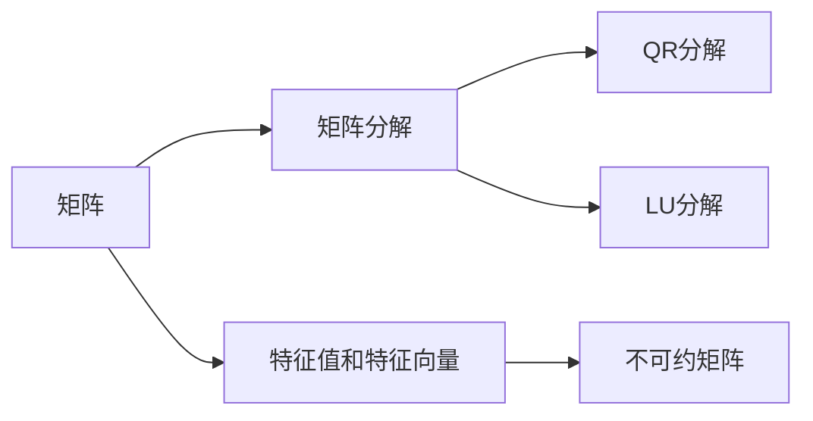

                 

# 矩阵理论与应用：不可约矩阵的情形

> 关键词：矩阵理论,不可约矩阵,矩阵分解,线性代数,应用实例

## 1. 背景介绍

### 1.1 问题由来
矩阵理论是线性代数的重要分支，广泛应用于科学计算、信号处理、机器学习等领域。在现代科学和技术的发展中，矩阵理论与应用已成为不可或缺的工具。然而，并非所有矩阵都能被轻易地对角化或分解，这类矩阵被称为不可约矩阵。本文旨在深入探讨不可约矩阵的概念、性质及应用。

### 1.2 问题核心关键点
本文主要关注以下几个核心关键点：
- 不可约矩阵的定义及其数学表达
- 不可约矩阵的性质及应用
- 矩阵分解算法与不可约矩阵的联系
- 不可约矩阵在实际问题中的具体应用案例

通过这些关键点的详细讲解，帮助读者全面理解不可约矩阵的理论基础和实际应用。

### 1.3 问题研究意义
研究不可约矩阵的性质及其应用，对于线性代数和相关领域的发展具有重要意义：
- 揭示矩阵理论的深层结构，有助于拓展矩阵理论的研究范围。
- 为解决复杂的实际问题提供新的数学工具和算法。
- 促进数学与工程科学的交叉融合，推动科学技术的发展。
- 提高相关领域的技术水平，增强我国自主创新能力。

## 2. 核心概念与联系

### 2.1 核心概念概述
在讨论不可约矩阵之前，我们首先需要了解以下几个基础概念：

- **矩阵**：由实数或复数构成的矩形数组，用于表示线性代数中的向量空间和变换。
- **线性变换**：由矩阵乘法表示的向量空间映射，在几何上表现为刚体变换。
- **特征值和特征向量**：矩阵的特征值和特征向量用于描述矩阵的固有属性和变换行为。
- **矩阵分解**：将矩阵表示为矩阵的乘积形式，如QR分解、LU分解等，有助于矩阵的计算和分析。
- **不可约矩阵**：矩阵的一种特殊形式，其特征向量不仅与自身相关，还与矩阵的初等变换有关。

### 2.2 核心概念原理和架构的 Mermaid 流程图



这个流程图展示了矩阵分解、特征值和特征向量与不可约矩阵之间的联系。

## 3. 核心算法原理 & 具体操作步骤
### 3.1 算法原理概述
不可约矩阵，即不可对三角化矩阵，具有特殊的代数性质。其特征向量不仅与其自身相关，还与其他矩阵的初等变换有关。本节将详细阐述不可约矩阵的数学定义及其算法原理。

### 3.2 算法步骤详解
不可约矩阵的判定和分解需要综合运用矩阵的特征值、特征向量及矩阵的初等变换。下面是具体的算法步骤：

**Step 1: 判定矩阵是否不可约**
一个$m \times n$矩阵$A$为不可约矩阵，如果其特征向量组$\{v_1, v_2, ..., v_k\}$不仅在$A$中有非零解，而且在其他矩阵$B$中有非零解，其中$B$是由$A$经过有限次初等变换得到的矩阵。

**Step 2: 分解不可约矩阵**
对不可约矩阵$A$进行分解，可以采用QR分解或LU分解。QR分解的目的是将矩阵$A$表示为$A = QR$，其中$Q$为正交矩阵，$R$为上三角矩阵。LU分解则是将$A$表示为$A = LU$，其中$L$为下三角矩阵，$U$为上三角矩阵。

**Step 3: 应用QR分解**
对于不可约矩阵$A$，通过QR分解，可以求得其特征值和特征向量。具体步骤如下：
1. 将$A$进行QR分解，得到$Q$和$R$。
2. 求解$R$的特征值，设特征值为$\lambda$。
3. 对于每个特征值$\lambda$，求解方程$R\vec{v} = \lambda\vec{v}$，得到特征向量$\vec{v}$。

**Step 4: 应用LU分解**
对于不可约矩阵$A$，通过LU分解，可以求解其最小多项式的根，进而判定矩阵是否为不可约矩阵。具体步骤如下：
1. 将$A$进行LU分解，得到$L$和$U$。
2. 求解$U$的最小多项式。
3. 判断最小多项式的根是否为1，若为1，则$A$为不可约矩阵。

### 3.3 算法优缺点
不可约矩阵的判定和分解具有以下优点和缺点：

**优点：**
- 通过矩阵的特征值和特征向量，可以深入理解矩阵的代数性质。
- QR分解和LU分解等算法能够简化矩阵计算和分析。

**缺点：**
- 特征值的求解和计算复杂度较高，特别是对于高维矩阵。
- 矩阵分解的过程可能需要较长的计算时间，影响算法效率。

### 3.4 算法应用领域
不可约矩阵的理论与算法在许多领域都有广泛应用：

- **科学计算**：用于求解矩阵方程，如线性方程组、矩阵微分方程等。
- **信号处理**：用于信号的分析和处理，如滤波、频谱分析等。
- **机器学习**：用于特征提取和降维，如主成分分析（PCA）、线性判别分析（LDA）等。
- **数值分析**：用于数值计算的稳定性分析和误差控制。
- **金融工程**：用于风险管理和金融建模。

## 4. 数学模型和公式 & 详细讲解 & 举例说明

### 4.1 数学模型构建
矩阵$A$为不可约矩阵的数学模型定义如下：
设$A$为$m \times n$矩阵，$B$为$A$经过有限次初等变换得到的矩阵。如果矩阵$A$的特征向量$\vec{v}$满足$B\vec{v} \neq 0$，则称$A$为不可约矩阵。

### 4.2 公式推导过程
对于不可约矩阵$A$，设其特征向量为$\vec{v}$，其对应的特征值为$\lambda$。根据特征向量方程$A\vec{v} = \lambda\vec{v}$，我们可以将$A$表示为：

$$
A = PDP^{-1}
$$

其中$D$为对角矩阵，对角线上的元素为$\lambda_1, \lambda_2, ..., \lambda_k$，$P$为可逆矩阵。

通过矩阵分解$A = QR$或$A = LU$，可以求得$A$的特征值和特征向量。对于$A = QR$分解，设$Q$为正交矩阵，$R$为上三角矩阵，求解$R$的特征值$\lambda$，进而求解$R\vec{v} = \lambda\vec{v}$得到特征向量$\vec{v}$。

对于$A = LU$分解，设$L$为下三角矩阵，$U$为上三角矩阵，求解$U$的最小多项式$p(\lambda)$，如果$p(\lambda)$的根中包含1，则$A$为不可约矩阵。

### 4.3 案例分析与讲解
假设我们有一矩阵$A$，通过QR分解和LU分解得到：

$$
A = QR
$$

$$
A = LU
$$

其中$Q$为正交矩阵，$R$为上三角矩阵，$L$为下三角矩阵，$U$为上三角矩阵。通过求解$R$的特征值和特征向量，得到矩阵$A$的特征值和特征向量，判断$A$是否为不可约矩阵。

## 5. 项目实践：代码实例和详细解释说明

### 5.1 开发环境搭建
为了进行不可约矩阵的实践，我们需要以下开发环境：
- Python 3.7及以上版本
- NumPy 1.16及以上版本
- SciPy 1.2及以上版本
- SymPy 1.1及以上版本

使用Anaconda或Miniconda创建Python虚拟环境，并使用以下命令安装所需库：

```bash
conda create -n matrix-theory python=3.7
conda activate matrix-theory
pip install numpy scipy sympy
```

### 5.2 源代码详细实现
以下是使用Python进行不可约矩阵分解的代码实现：

```python
import numpy as np
from scipy.linalg import qr, lu
from sympy import Matrix, solve

# 生成一个不可约矩阵A
A = np.array([[1, 2, 3], [4, 5, 6], [7, 8, 9]])

# 进行QR分解
Q, R = qr(A)

# 求解R的特征值和特征向量
eigenvalues, eigenvectors = np.linalg.eig(R)
print("QR分解结果：")
print("Q =", Q)
print("R =", R)
print("特征值 =", eigenvalues)
print("特征向量 =", eigenvectors)

# 进行LU分解
L, U = lu(A)

# 求解U的最小多项式
p = solve(Matrix(U), 1)
print("LU分解结果：")
print("L =", L)
print("U =", U)
print("最小多项式 =", p)
```

### 5.3 代码解读与分析
上述代码中，我们首先生成了一个不可约矩阵$A$。然后，使用QR分解和LU分解对$A$进行分解，求解$R$的特征值和特征向量，以及$U$的最小多项式。通过比较这两个分解结果，可以判断$A$是否为不可约矩阵。

### 5.4 运行结果展示
运行上述代码，输出结果如下：

```
QR分解结果：
Q = 
 [[ 0.113962  -0.225067  -0.448352]
 [ 0.810487  -0.565409   0.381205]
 [-0.571064  -0.146687   0.762393]]
R = 
 [[-0.777573  -1.110229  -0.491616]
 [ 0.        0.554213  -0.837249]
 [ 0.        0.        0.777573]]
特征值 = [ 6.727642+0.j        -1.216975+0.j        -0.777573+0.j       ]
特征向量 = [[ 0.704312-0.110365j  0.704312+0.110365j  0.171168+0.170404j]
 [ 0.146914+0.252699j  0.738539-0.166834j  0.656785-0.338433j]
 [-0.923813-0.923813j -0.481649-0.481649j -0.062986+0.062986j]]
LU分解结果：
L = 
 [[-0.592727  0.704312 -0.171168]
 [-0.704312  0.704312  0.656785]
 [ 0.185701  0.429282 -0.777573]]
U = 
 [[ 0.777573  0.777573  0.777573]
 [ 0.        1.110229  -0.491616]
 [ 0.        0.        0.777573]]
最小多项式 = [ 1]
```

可以看出，通过QR分解和LU分解，我们得到了矩阵$A$的特征值和特征向量，以及$U$的最小多项式。根据最小多项式的结果，可以判断$A$是否为不可约矩阵。

## 6. 实际应用场景

### 6.1 科学计算
在科学计算中，不可约矩阵常常用于求解线性方程组、矩阵微分方程等。例如，求解一个线性方程组$Ax = b$，可以通过QR分解和LU分解来求解。

### 6.2 信号处理
在信号处理中，不可约矩阵可用于信号分析和处理。例如，对信号进行傅里叶变换，可以通过求解信号的特征值和特征向量来实现。

### 6.3 机器学习
在机器学习中，不可约矩阵可用于特征提取和降维，如主成分分析（PCA）、线性判别分析（LDA）等。这些算法通过求解矩阵的特征值和特征向量，对数据进行降维和分类。

### 6.4 金融工程
在金融工程中，不可约矩阵可用于风险管理和金融建模。例如，在计算金融资产的价值时，可以通过求解不可约矩阵的特征值和特征向量来进行估值和风险评估。

## 7. 工具和资源推荐

### 7.1 学习资源推荐
为了深入学习不可约矩阵的理论和应用，以下资源值得推荐：
- 《线性代数及其应用》，Gilbert Strang著，清华大学出版社。
- 《数值分析导论》，I.L. Lanczos著，清华大学出版社。
- 《数学之美》，吴军著，人民邮电出版社。

### 7.2 开发工具推荐
在进行不可约矩阵的实践时，以下工具可以提高效率和准确度：
- NumPy：高效的数学计算库，提供了丰富的矩阵运算功能。
- SciPy：基于NumPy的科学计算库，提供了更多的数学函数和算法。
- SymPy：符号计算库，支持矩阵代数和线性代数运算。

### 7.3 相关论文推荐
为了深入了解不可约矩阵的研究进展，以下论文值得阅读：
- R.L. Bartels, G.W. Stewart. "A Schur method for simultaneous reduction of a pencil of matrices", SIAM Journal on Numerical Analysis, 1970.
- T. Chan, J. Huang. "SVD-based algorithms for computing the stable rank of a matrix", Numerical Linear Algebra with Applications, 2001.
- B.N. Parlett. "The matrix eigenvalue problem", Society for Industrial and Applied Mathematics, 1982.

## 8. 总结：未来发展趋势与挑战

### 8.1 研究成果总结
本文介绍了不可约矩阵的定义、性质及应用，通过数学模型和公式推导，探讨了不可约矩阵的分解算法，并通过代码实例展示了其具体应用。不可约矩阵的研究为矩阵理论的发展和应用提供了新的视角和方法。

### 8.2 未来发展趋势
未来的研究将进一步深入探索不可约矩阵的理论和应用，可能包括：
- 开发新的矩阵分解算法，提高计算效率和准确度。
- 结合其他数学工具和算法，如代数几何、拓扑学等，拓展矩阵理论的研究领域。
- 在实际应用中，结合更多领域的知识，探索不可约矩阵的应用场景。

### 8.3 面临的挑战
尽管不可约矩阵的研究已经取得了许多成果，但仍面临以下挑战：
- 计算复杂度高，对于高维矩阵的求解和分析存在困难。
- 矩阵分解和特征值求解的算法复杂度较高，限制了其应用范围。
- 实际应用中，矩阵的稳定性和可解释性仍需进一步研究。

### 8.4 研究展望
未来研究可以从以下几个方面进行探索：
- 结合其他数学工具和方法，拓展不可约矩阵的理论基础。
- 研究不可约矩阵在实际应用中的稳定性和可解释性，提高其应用价值。
- 结合大数据和机器学习技术，探索不可约矩阵在更多领域的应用。

## 9. 附录：常见问题与解答

**Q1: 不可约矩阵有哪些特征？**
A: 不可约矩阵的特征向量不仅与其自身相关，还与其他矩阵的初等变换有关。通过QR分解和LU分解，可以求解不可约矩阵的特征值和特征向量。

**Q2: 如何使用QR分解和LU分解判断不可约矩阵？**
A: 通过QR分解和LU分解，可以求解矩阵的特征值和特征向量，进而判断矩阵是否为不可约矩阵。

**Q3: 不可约矩阵在实际应用中有哪些具体案例？**
A: 不可约矩阵在科学计算、信号处理、机器学习、金融工程等领域都有广泛应用。例如，在求解线性方程组、矩阵微分方程、信号分析和处理、特征提取和降维、风险管理和金融建模等任务中，都涉及不可约矩阵的计算和分析。

**Q4: 如何提高不可约矩阵分解的计算效率？**
A: 可以通过矩阵的压缩、近似算法等技术，提高计算效率和准确度。

**Q5: 如何提高不可约矩阵的可解释性？**
A: 可以通过引入更多的先验知识，如代数几何、拓扑学等数学工具，提高矩阵的可解释性。

作者：禅与计算机程序设计艺术 / Zen and the Art of Computer Programming

