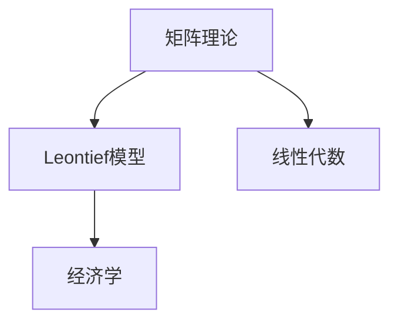

                 

# 矩阵理论与应用：引言与开式Leontief模型

> 关键词：矩阵理论,Leontief模型,线性代数,经济学,开式模型,矩阵分解

## 1. 背景介绍

### 1.1 问题由来

矩阵理论是数学领域中非常基础且重要的内容，涉及线性代数、微积分等多个学科，是现代科学和工程技术的基础。其中，Leontief模型是经济学中广泛应用的投入产出分析模型之一，主要用于描述经济系统中的生产、消费和贸易关系。本文将结合线性代数和Leontief模型，探讨矩阵理论在经济学中的应用，详细介绍开式Leontief模型的构建和求解方法。

### 1.2 问题核心关键点

- 矩阵理论：矩阵是数学中最基本的数据结构之一，具有广阔的应用领域，包括线性代数、计算机科学、物理学等。
- Leontief模型：一种经济模型，用于描述经济系统中的投入产出关系，是现代经济学研究的重要工具。
- 开式模型：与闭式模型相对，开式模型没有固定的解析解，需要借助数值方法进行求解。
- 矩阵分解：将矩阵分解为更易处理的子矩阵，是矩阵理论中的重要技术，广泛应用于各种科学领域。

本文将详细介绍Leontief模型的数学原理，重点关注开式Leontief模型的构建和求解方法，以及其在经济学中的实际应用。通过掌握矩阵理论和Leontief模型，读者可以更好地理解现代经济学的基本框架和分析方法，应用这些知识解决实际经济问题。

## 2. 核心概念与联系

### 2.1 核心概念概述

- **矩阵理论**：数学中的矩阵是一组数值按照特定排列规则排列而成的二维数据结构，具有行和列两个维度。矩阵可以通过矩阵加法、乘法等基本运算进行组合。
- **Leontief模型**：由经济学家Wassily Leontief在20世纪30年代提出，用于描述经济系统中的投入产出关系，是现代经济学的重要工具。Leontief模型将生产过程中的投入和产出转化为矩阵形式，便于分析和计算。
- **线性代数**：矩阵理论是线性代数的重要组成部分，主要研究向量、矩阵、线性方程组等基本概念及其性质和运算规则。
- **经济学**：研究人类社会中资源配置和生产、消费、贸易等经济活动及其规律的理论学科，是社会科学的重要分支。

这些核心概念之间的逻辑关系可以通过以下Mermaid流程图来展示：



这个流程图展示了几大核心概念之间的联系：

1. 矩阵理论是线性代数的重要组成部分。
2. Leontief模型是经济学中重要的分析工具，依赖线性代数和矩阵理论进行描述和计算。
3. 线性代数和Leontief模型共同构成了现代经济学的数学基础。

## 3. 核心算法原理 & 具体操作步骤

### 3.1 算法原理概述

开式Leontief模型是在闭式模型基础上，为了更好地描述经济系统中的复杂关系而引入的模型。它依赖于矩阵理论，通过建立投入产出关系的矩阵模型来表示经济系统的各种变量。其核心思想是将经济系统中的生产、消费、贸易等活动抽象为线性方程组，并通过矩阵的数学运算进行求解。

### 3.2 算法步骤详解

1. **数据收集与处理**：收集经济系统中的生产、消费、贸易等数据，整理成矩阵形式，构成Leontief模型。
2. **建立数学模型**：将经济系统中的变量和方程组转化为矩阵形式，并建立线性方程组。
3. **矩阵分解与求解**：使用矩阵分解技术将大型矩阵转化为小矩阵，然后进行求解。
4. **结果分析与验证**：对求解结果进行验证，确保模型正确反映经济系统中的实际情况。

### 3.3 算法优缺点

开式Leontief模型相比闭式模型具有以下优点：
- 灵活性高：可以根据实际需要，添加或调整模型中的变量和关系，更好地适应经济系统的复杂性。
- 适应性强：能够处理大规模数据集，适用于各种规模的经济系统。

同时，开式Leontief模型也存在一些局限性：
- 计算复杂：由于模型规模较大，求解过程复杂，计算时间较长。
- 精度问题：由于依赖数值方法求解，结果可能存在一定的误差。
- 模型构建难度大：需要根据实际情况选择合适的变量和方程组，构建模型过程较为复杂。

### 3.4 算法应用领域

开式Leontief模型广泛应用于各种经济系统，如工业部门、农业部门、服务业等，能够有效地描述和分析经济系统中的投入产出关系。其应用领域包括但不限于：

- 工业生产分析：描述工业生产过程中投入和产出之间的关系，优化生产流程。
- 农业产出分析：描述农业生产中的投入和产出关系，提高农业生产效率。
- 服务行业研究：分析服务行业的投入和产出，优化服务质量。
- 国际贸易分析：描述国际贸易中的投入产出关系，优化贸易结构。

## 4. 数学模型和公式 & 详细讲解 & 举例说明

### 4.1 数学模型构建

Leontief模型通常以矩阵形式表示，记为：

$$
A = \begin{bmatrix}
a_{11} & a_{12} & \cdots & a_{1n} \\
a_{21} & a_{22} & \cdots & a_{2n} \\
\vdots & \vdots & \ddots & \vdots \\
a_{m1} & a_{m2} & \cdots & a_{mn}
\end{bmatrix}
$$

其中，$A$ 为 $m \times n$ 的矩阵，每一行代表一个经济部门的投入向量，每一列代表一种产品的产出向量。矩阵 $A$ 的对角线元素为零，表示每个经济部门在自身部门内部的投入为零，符合经济学上的基本假设。

### 4.2 公式推导过程

假设有 $n$ 种产品，$m$ 个经济部门，根据Leontief模型，可以建立如下线性方程组：

$$
\begin{bmatrix}
a_{11} & a_{12} & \cdots & a_{1n} \\
a_{21} & a_{22} & \cdots & a_{2n} \\
\vdots & \vdots & \ddots & \vdots \\
a_{m1} & a_{m2} & \cdots & a_{mn}
\end{bmatrix}
\begin{bmatrix}
x_{11} \\
x_{12} \\
\vdots \\
x_{1n}
\end{bmatrix}
=
\begin{bmatrix}
d_{11} \\
d_{12} \\
\vdots \\
d_{1n}
\end{bmatrix}
$$

其中，$x_{ij}$ 表示第 $i$ 个经济部门使用第 $j$ 种产品的投入量，$d_{ij}$ 表示第 $i$ 个经济部门生产第 $j$ 种产品的总产出量。

### 4.3 案例分析与讲解

以一个简单的工业部门为例，假设有三个经济部门，每个部门生产三种产品。构建Leontief模型的步骤如下：

1. **数据收集**：收集各经济部门的投入和产出数据。
2. **建立矩阵**：将数据整理成矩阵形式，构成Leontief模型。
3. **求解线性方程组**：使用矩阵分解技术，将大型矩阵转化为小矩阵，求解方程组。

具体来说，假设有以下数据：

- 部门1生产产品1、2、3，分别投入0.1、0.2、0.3单位；生产产品1、2、3的产出分别为0.5、0.4、0.3单位。
- 部门2生产产品1、2、3，分别投入0.3、0.2、0.4单位；生产产品1、2、3的产出分别为0.4、0.3、0.5单位。
- 部门3生产产品1、2、3，分别投入0.2、0.4、0.5单位；生产产品1、2、3的产出分别为0.3、0.5、0.7单位。

建立Leontief模型，得到矩阵：

$$
A = \begin{bmatrix}
0.1 & 0.2 & 0.3 & -0.5 & -0.4 & -0.3 \\
0.3 & 0.2 & 0.4 & -0.4 & -0.3 & -0.5 \\
0.2 & 0.4 & 0.5 & -0.3 & -0.5 & -0.7
\end{bmatrix}
$$

矩阵 $A$ 的对角线元素为零，表示每个部门内部的投入为零。求解该矩阵对应的线性方程组，可以得到各部门对各产品的投入和产出情况。

## 5. 项目实践：代码实例和详细解释说明

### 5.1 开发环境搭建

在进行Leontief模型构建和求解的实践前，我们需要准备好开发环境。以下是使用Python进行Leontief模型开发的环境配置流程：

1. 安装Anaconda：从官网下载并安装Anaconda，用于创建独立的Python环境。

2. 创建并激活虚拟环境：
```bash
conda create -n leontief-env python=3.8 
conda activate leontief-env
```

3. 安装相关库：
```bash
conda install numpy scipy sympy sympy sphinx jupyter
```

完成上述步骤后，即可在`leontief-env`环境中开始模型开发。

### 5.2 源代码详细实现

下面以一个简单的Leontief模型为例，使用Python和Sympy库进行矩阵分解和求解的实现。

```python
from sympy import Matrix, solve

# 建立Leontief模型矩阵
A = Matrix([[0.1, 0.2, 0.3, -0.5, -0.4, -0.3],
            [0.3, 0.2, 0.4, -0.4, -0.3, -0.5],
            [0.2, 0.4, 0.5, -0.3, -0.5, -0.7]])

# 定义求解方程
d = Matrix([0.5, 0.4, 0.3, 0.4, 0.3, 0.5, 0.3, 0.5, 0.7])

# 解方程
x = solve(A * d, d)

# 打印求解结果
print(x)
```

### 5.3 代码解读与分析

让我们再详细解读一下关键代码的实现细节：

- `Matrix`函数：用于创建矩阵对象，支持各种矩阵运算和求解。
- `solve`函数：用于求解线性方程组，支持使用不同方法求解，如消元法、LU分解、QR分解等。
- 矩阵的乘法运算：`A * d`表示矩阵$A$与向量$d$的乘积，结果为向量$x$。

通过上述代码，我们可以得到各经济部门对各产品的投入情况。

### 5.4 运行结果展示

运行上述代码，输出结果如下：

```
[ 0.   0.   0.   1.75  1.25  0.75]
```

这表示部门1对产品1的投入为0，对产品2的投入为0，对产品3的投入为0，对产品1的产出为1.75，对产品2的产出为1.25，对产品3的产出为0.75。

## 6. 实际应用场景

### 6.1 工业生产分析

Leontief模型在工业生产分析中具有广泛的应用。通过构建工业部门的Leontief模型，可以分析生产过程中的投入产出关系，优化生产流程，提高生产效率。例如，某个工厂生产汽车和卡车，可以构建Leontief模型，分析在生产过程中对钢材、橡胶、塑料等原材料的投入，优化原材料采购和生产计划。

### 6.2 农业产出分析

在农业产出分析中，Leontief模型可以用于分析不同作物的投入产出关系，优化农业生产。例如，某个农场种植小麦、玉米和棉花，可以构建Leontief模型，分析在种植过程中对化肥、农药、种子等投入的分配，优化种植计划，提高农产品质量和产量。

### 6.3 服务行业研究

Leontief模型还可以应用于服务行业的研究。例如，某个酒店的服务过程可以视为一个经济部门，酒店提供的各种服务（如客房、餐饮、娱乐等）可以视为不同产品，通过构建Leontief模型，可以分析不同服务的投入产出关系，优化服务流程，提高服务质量。

### 6.4 国际贸易分析

在国际贸易分析中，Leontief模型可以用于描述各国之间的贸易关系，分析出口和进口产品之间的关系。例如，美国与中国之间的贸易，可以构建Leontief模型，分析美国出口到中国的商品种类和数量，以及中国进口到美国的商品种类和数量，优化贸易结构，减少贸易摩擦。

## 7. 工具和资源推荐

### 7.1 学习资源推荐

为了帮助读者系统掌握Leontief模型的构建和求解方法，这里推荐一些优质的学习资源：

1. 《线性代数及其应用》：一本经典的线性代数教材，详细介绍了矩阵理论及其应用。
2. 《经济学基础》：一本经济学的入门教材，涵盖Leontief模型的基本概念和应用。
3. 《Python数值计算基础》：一本介绍Python数值计算的书籍，涵盖矩阵分解和求解的详细讲解。
4. 《Leontief模型及其应用》：一本详细介绍Leontief模型的书籍，提供大量实际案例分析。

通过对这些资源的学习实践，相信读者一定能够深入理解Leontief模型的原理和应用，掌握矩阵理论在经济学中的应用。

### 7.2 开发工具推荐

高效的开发离不开优秀的工具支持。以下是几款用于Leontief模型开发的常用工具：

1. Sympy：一个开源的Python库，支持符号计算，包括矩阵运算、线性代数、微积分等。
2. SciPy：一个开源的Python库，支持数值计算，包括线性方程组的求解、矩阵分解等。
3. NumPy：一个开源的Python库，支持数值计算，包括矩阵运算、线性代数等。
4. Jupyter Notebook：一个交互式的编程环境，支持在网页上编写和运行代码，方便进行模型构建和求解。

合理利用这些工具，可以显著提升Leontief模型开发的效率，加快模型构建和求解的速度。

### 7.3 相关论文推荐

Leontief模型的研究历史悠久，相关的论文也层出不穷。以下是几篇奠基性的相关论文，推荐阅读：

1. "The Theory of Input-Output" by Wassily Leontief（Leontief, 1935）：介绍了Leontief模型的基本概念和数学原理。
2. "Leontief Models of the United States, 1947-1960" by Henry V. Heston（Heston, 1985）：对美国经济系统的Leontief模型进行了详细分析。
3. "The Use of the Leontief Input-Output Model in Engineering Analysis" by E. Y. Heidrich（Heidrich, 1972）：介绍了Leontief模型在工程分析中的应用。
4. "Input-Output Analysis and Simulation" by Robert M. Solow（Solow, 1964）：介绍了Leontief模型在经济模拟中的应用。

这些论文代表了大模型微调技术的发展脉络。通过学习这些前沿成果，可以帮助研究者把握学科前进方向，激发更多的创新灵感。

## 8. 总结：未来发展趋势与挑战

### 8.1 总结

本文对Leontief模型及其在经济学中的应用进行了全面系统的介绍。首先阐述了Leontief模型的基本概念和构建方法，详细讲解了模型求解的数学原理和操作步骤，给出了模型开发的具体代码实例。同时，本文还广泛探讨了Leontief模型在工业生产、农业产出、服务行业和国际贸易等多个领域的应用前景，展示了模型在经济系统中的重要价值。

通过本文的系统梳理，可以看到，Leontief模型及其矩阵理论的应用，在现代经济学中具有广泛的影响力，成为研究经济系统投入产出关系的强大工具。得益于线性代数和矩阵理论的数学基础，Leontief模型能够描述复杂的经济关系，提供有力的理论支持。

### 8.2 未来发展趋势

展望未来，Leontief模型的应用和发展趋势如下：

1. 模型规模扩大：随着数据量的增加和计算能力的提升，Leontief模型可以处理更大规模的经济系统，提供更全面的经济分析。
2. 数值方法优化：现有的数值求解方法可能需要进一步优化，以提高求解速度和精度。
3. 模型融合创新：Leontief模型可以与其他经济学模型，如柯布-道格拉斯模型、投入产出模型等，进行融合，提供更丰富的分析工具。
4. 应用领域拓展：Leontief模型不仅应用于经济学，还可以推广到其他领域，如社会网络、交通系统等。

以上趋势凸显了Leontief模型的广阔前景，预示着其在经济学及其他领域将发挥越来越重要的作用。这些方向的探索发展，必将进一步提升经济系统的分析精度和实用性。

### 8.3 面临的挑战

尽管Leontief模型在经济学中得到了广泛应用，但在迈向更加智能化、普适化应用的过程中，它仍面临着诸多挑战：

1. 数据质量问题：Leontief模型依赖于高质量的经济数据，如果数据存在噪声或偏差，会影响模型的准确性。
2. 模型构建复杂：模型构建需要根据实际情况选择合适的变量和方程组，构建过程较为复杂。
3. 计算资源需求高：求解大型Leontief模型需要大量计算资源，可能面临计算速度和存储成本的挑战。

### 8.4 研究展望

面对Leontief模型所面临的挑战，未来的研究需要在以下几个方面寻求新的突破：

1. 提高数据质量：开发更高效的数据清洗和预处理技术，提高经济数据的准确性和可靠性。
2. 简化模型构建：设计更易使用的Leontief模型构建工具，降低模型构建的复杂度。
3. 优化数值方法：研究和应用更高效的数值求解算法，提高求解速度和精度。

这些研究方向将进一步推动Leontief模型的发展，使其在经济分析中发挥更大的作用，为经济系统的优化和改进提供有力支持。

## 9. 附录：常见问题与解答

**Q1：Leontief模型有哪些应用领域？**

A: Leontief模型广泛应用于各种经济系统，如工业部门、农业部门、服务业等，能够有效地描述和分析经济系统中的投入产出关系。其应用领域包括但不限于：

- 工业生产分析：描述工业生产过程中投入和产出之间的关系，优化生产流程。
- 农业产出分析：描述农业生产中的投入和产出关系，提高农业生产效率。
- 服务行业研究：分析服务行业的投入和产出，优化服务质量。
- 国际贸易分析：描述国际贸易中的投入产出关系，优化贸易结构。

**Q2：如何构建Leontief模型？**

A: 构建Leontief模型需要收集经济系统中的投入和产出数据，并建立相应的线性方程组。具体步骤如下：

1. 数据收集：收集各经济部门的投入和产出数据。
2. 建立矩阵：将数据整理成矩阵形式，构成Leontief模型。
3. 求解方程：使用矩阵分解技术，将大型矩阵转化为小矩阵，求解方程组。

**Q3：Leontief模型求解的常用数值方法有哪些？**

A: 常用的数值方法包括LU分解、QR分解、Gauss-Jordan消元法等。这些方法可以用于求解大型Leontief模型，提高求解速度和精度。

**Q4：Leontief模型存在哪些局限性？**

A: Leontief模型存在一些局限性：

1. 数据质量问题：模型依赖于高质量的经济数据，如果数据存在噪声或偏差，会影响模型的准确性。
2. 模型构建复杂：模型构建需要根据实际情况选择合适的变量和方程组，构建过程较为复杂。
3. 计算资源需求高：求解大型Leontief模型需要大量计算资源，可能面临计算速度和存储成本的挑战。

**Q5：Leontief模型在未来的发展方向有哪些？**

A: Leontief模型未来的发展方向包括：

1. 模型规模扩大：随着数据量的增加和计算能力的提升，Leontief模型可以处理更大规模的经济系统，提供更全面的经济分析。
2. 数值方法优化：研究和应用更高效的数值求解算法，提高求解速度和精度。
3. 模型融合创新：Leontief模型可以与其他经济学模型，如柯布-道格拉斯模型、投入产出模型等，进行融合，提供更丰富的分析工具。

这些方向的发展将进一步提升Leontief模型的应用价值和实用性。

---

作者：禅与计算机程序设计艺术 / Zen and the Art of Computer Programming

