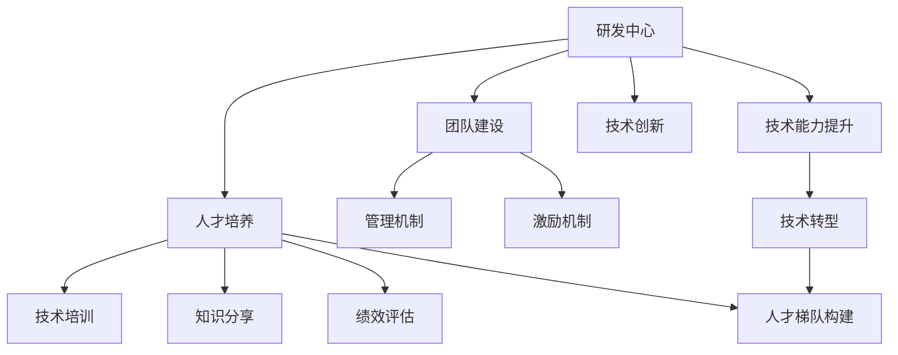

                 

# 研发中心团队的建设和人才培养方案

> 关键词：研发中心,团队建设,人才培养,技术能力提升,管理机制,激励机制,技术培训,知识分享,绩效评估,人才梯队构建,技术转型

## 1. 背景介绍

在当前竞争激烈的技术环境下，一个高效的研发中心团队对于企业的成功至关重要。研发中心不仅需要承担新技术的研发任务，还需要在人才培养、知识传承、技术创新等方面发挥关键作用。建设一个强大的研发中心，需要在团队建设、人才引进、知识传承、技术培训等方面进行系统性规划和落实。本文将详细探讨如何构建一个高效的研发中心团队，并制定科学的人才培养方案，以支撑企业的技术持续进步和市场竞争力的提升。

## 2. 核心概念与联系

### 2.1 核心概念概述

为了更好地理解研发中心团队建设和人才培养方案，本节将介绍几个密切相关的核心概念：

- **研发中心（Research and Development Center, R&D Center）**：企业内部负责新技术研发、产品创新、技术支持的团队，通常包含多个部门和团队，如软件工程部、硬件开发部、数据科学部、算法工程部等。
- **团队建设（Team Building）**：通过有效的组织和管理手段，构建高效、协作的团队，提升团队整体战斗力。
- **人才培养（Talent Cultivation）**：通过系统性的培训和发展计划，提升团队成员的技术能力和职业素养，为公司的长期发展储备人才。
- **技术能力提升（Technical Skill Enhancement）**：通过持续的技术学习和实践，提升团队成员的专业技能和综合素质。
- **管理机制（Management Mechanism）**：通过合理的管理策略和制度，确保团队高效运行，提升团队的生产力和创新能力。
- **激励机制（Incentive Mechanism）**：通过奖励和激励措施，激发团队成员的工作积极性和创造力。
- **技术培训（Technical Training）**：通过有计划的技术学习和培训，提升团队成员的专业技能和知识水平。
- **知识分享（Knowledge Sharing）**：通过定期的内部交流和分享活动，促进团队成员之间的知识传递和经验积累。
- **绩效评估（Performance Evaluation）**：通过科学合理的绩效评估体系，衡量团队成员的工作成果和贡献，为人才发展提供依据。
- **人才梯队构建（Talent Pipeline Construction）**：通过系统的规划和培养，构建一支多层次、高素质的技术人才队伍。
- **技术转型（Technology Transformation）**：通过引入新技术和变革管理，推动团队的技术转型和创新。

这些核心概念之间的逻辑关系可以通过以下Mermaid流程图来展示：



这个流程图展示了一体化的研发中心团队建设和人才培养方案：

1. 研发中心作为整体的执行实体，负责技术创新和产品开发。
2. 团队建设和管理机制是确保研发中心高效运行的基础。
3. 人才培养和技术能力提升是推动研发中心长期发展的关键。
4. 技术培训、知识分享和绩效评估是提升个人和团队表现的有效手段。
5. 人才梯队构建和技术转型是实现持续技术进步和市场竞争力的重要策略。

## 3. 核心算法原理 & 具体操作步骤
### 3.1 算法原理概述

研发中心团队建设和人才培养方案的制定，本质上是一个复杂的管理和优化问题。其核心思想是：通过系统的规划和策略，提升团队的协作能力、创新能力和生产效率，培养一批高素质的技术人才，支撑企业的长期发展。

具体而言，可以将其分为以下几个关键步骤：

1. **团队结构设计**：根据企业的业务需求和战略目标，设计合理的团队结构和岗位配置。
2. **招聘与入职培训**：通过科学的招聘流程，选拔符合岗位要求的优秀人才，并提供系统的入职培训。
3. **知识共享与交流**：建立定期的内部交流和分享机制，促进团队成员之间的知识传递和经验积累。
4. **绩效评估与激励机制**：建立科学合理的绩效评估体系，并通过激励机制激发团队成员的工作积极性。
5. **技术培训与发展**：制定有针对性的技术培训和发展计划，提升团队成员的专业技能和综合素质。
6. **人才梯队与技术转型**：通过系统的培养和规划，构建一支多层次、高素质的技术人才队伍，并推动团队的技术转型和创新。

### 3.2 算法步骤详解

以下将详细介绍研发中心团队建设和人才培养方案的具体操作步骤：

**Step 1: 团队结构设计**

1. **业务需求分析**：深入了解企业的业务需求和战略目标，确定研发中心的主要任务和职责。
2. **岗位设置与职责分工**：根据任务需求，设定合理的岗位和职责，明确各岗位的具体工作内容和职责边界。
3. **团队规模与人员配置**：根据业务量和工作负荷，合理规划团队的规模和人员配置，确保团队高效运行。

**Step 2: 招聘与入职培训**

1. **招聘流程优化**：设计科学合理的招聘流程，确保招聘到符合岗位要求的人才。
2. **入职培训体系**：制定系统的入职培训计划，涵盖企业文化、技术基础、团队协作等方面，帮助新员工快速融入团队。

**Step 3: 知识共享与交流**

1. **内部交流机制**：建立定期的内部交流和分享活动，如技术沙龙、项目分享会、跨团队协作等，促进团队成员之间的知识传递和经验积累。
2. **知识库建设**：构建知识库或文档管理系统，集中存储团队的技术文档、项目经验、最佳实践等，方便团队成员查阅和参考。

**Step 4: 绩效评估与激励机制**

1. **绩效评估标准**：建立科学合理的绩效评估标准，涵盖工作成果、团队协作、创新能力等方面，全面衡量团队成员的表现。
2. **激励机制设计**：设计合理的激励机制，包括薪酬激励、职业晋升、团队奖励等，激发团队成员的工作积极性和创造力。

**Step 5: 技术培训与发展**

1. **技术培训计划**：根据岗位需求和个人发展目标，制定系统的技术培训计划，涵盖新技术、新工具、新方法等方面。
2. **实践与项目参与**：通过实践项目、技术竞赛、创新项目等，提升团队成员的实际应用能力和技术水平。

**Step 6: 人才梯队与技术转型**

1. **人才梯队构建**：通过系统的培养和规划，构建一支多层次、高素质的技术人才队伍，确保团队的技术传承和持续发展。
2. **技术转型策略**：引入新技术和变革管理，推动团队的技术转型和创新，保持团队的技术领先性。

### 3.3 算法优缺点

研发中心团队建设和人才培养方案的制定，具有以下优点：

1. **提升团队效率**：通过合理的团队结构和岗位配置，提升团队的生产力和协作效率，确保任务高效完成。
2. **促进技术创新**：通过系统的技术培训和发展计划，提升团队成员的专业技能和创新能力，推动技术进步和产品创新。
3. **增强团队凝聚力**：通过知识共享和内部交流，促进团队成员之间的合作与信任，增强团队的凝聚力和协作精神。
4. **提高员工满意度**：通过合理的激励机制和绩效评估，提高团队成员的工作积极性和满意度，减少人才流失。

同时，该方案也存在一定的局限性：

1. **实施复杂度**：系统性的团队建设和人才培养方案需要大量的规划和管理工作，实施难度较大。
2. **资源投入高**：需要进行系统的培训和知识共享，需要较高的资源投入和时间成本。
3. **效果评估困难**：团队建设和人才培养的效果评估较为复杂，需要持续的监测和反馈调整。

尽管存在这些局限性，但就目前而言，研发中心团队建设和人才培养方案是实现企业技术持续进步和市场竞争力的重要手段。未来相关研究的重点在于如何进一步优化管理策略，降低实施难度，提高投入产出比，同时兼顾人才的长期发展和企业战略目标的实现。

### 3.4 算法应用领域

研发中心团队建设和人才培养方案在多个领域得到广泛应用，例如：

- **金融科技**：构建高效的金融科技研发团队，提升金融产品的技术创新和市场竞争力。
- **智能制造**：建立智能制造研发中心，推动工业自动化和数字化转型。
- **生物医药**：组建生物医药研发团队，加速新药研发和医疗设备创新。
- **智慧城市**：构建智慧城市研发中心，推动城市管理智能化和数字化。
- **电子游戏**：打造高效的电子游戏开发团队，提升游戏产品和用户体验。

除了上述这些应用领域外，研发中心团队建设和人才培养方案还在更多场景中得到创新性的应用，为各行各业的技术进步和市场竞争力的提升提供了有力支持。

## 4. 数学模型和公式 & 详细讲解 & 举例说明

### 4.1 数学模型构建

在研发中心团队建设和人才培养方案的设计中，我们可以使用数学模型来抽象和量化团队和人才的各项指标和关系。以下是几个核心的数学模型：

- **团队效率模型**：用于衡量团队的生产力和协作效率，可以通过任务完成时间、任务分配合理性等指标来量化。
- **技术创新模型**：用于衡量团队的创新能力和技术进步，可以通过专利申请数、技术论文发表数、技术竞赛获奖数等指标来量化。
- **知识共享模型**：用于衡量团队的知识传递和经验积累情况，可以通过内部交流活动次数、知识库访问次数等指标来量化。
- **绩效评估模型**：用于衡量团队成员的工作表现和贡献，可以通过绩效评估得分、激励机制反馈等指标来量化。
- **人才梯队模型**：用于衡量团队的人才层次和多样性，可以通过不同层级的人才比例、多样性指数等指标来量化。
- **技术转型模型**：用于衡量团队的技术更新和转型情况，可以通过新技术引入率、技术培训参与率等指标来量化。

### 4.2 公式推导过程

以下将详细介绍几个关键数学模型的公式推导过程：

**团队效率模型**：

假设团队有 $n$ 个成员，每个成员完成某项任务的时间为 $t_i$，则团队的总完成时间为 $T = \sum_{i=1}^n t_i$。为了衡量团队效率，可以引入平均完成时间 $T_{avg} = \frac{T}{n}$ 和效率系数 $\eta = \frac{T_{avg}}{T_{best}}$，其中 $T_{best}$ 为最佳完成时间。

**技术创新模型**：

假设团队在一定时间范围内申请的专利数为 $P$，发表的技术论文数为 $L$，获得的技术竞赛奖项数为 $A$，则技术创新指数 $I = \frac{P + L + A}{n}$。

**知识共享模型**：

假设团队内部交流活动次数为 $C$，知识库访问次数为 $K$，每次活动参与人数为 $S_i$，则知识共享指数 $S = \frac{C + K}{\sum_{i=1}^n S_i}$。

**绩效评估模型**：

假设团队绩效评估得分为 $E$，激励机制反馈得分为 $F$，则综合绩效评估指数 $E_{total} = \frac{E + F}{2}$。

**人才梯队模型**：

假设团队分为 $m$ 个层级，每个层级的人数分别为 $N_1, N_2, \ldots, N_m$，则人才梯队指数 $T = \frac{\sum_{i=1}^m N_i}{n}$。

**技术转型模型**：

假设团队引入的新技术数量为 $N_{new}$，参与技术培训的人数为 $T_{train}$，则技术转型指数 $T_{trans} = \frac{N_{new} + T_{train}}{n}$。

### 4.3 案例分析与讲解

以一家金融科技公司为例，展示如何通过数学模型量化和优化研发中心团队建设和人才培养方案：

**案例背景**：
某金融科技公司致力于开发智能投顾平台，旨在为用户提供个性化的投资建议和理财服务。公司设有研发中心，负责智能投顾平台的核心技术研发和创新工作。

**案例分析**：
1. **团队效率模型应用**：通过衡量任务完成时间和分配合理性，发现团队在项目交付周期内效率不高，存在任务积压情况。进一步分析发现，主要原因是任务分配不均衡，部分成员工作量过重。通过优化任务分配策略，引入更精细的资源管理工具，团队效率显著提升。
2. **技术创新模型应用**：通过衡量专利申请数和技术论文发表数，发现团队在技术创新方面有较大提升空间。通过引入更多的技术竞赛和内部创新项目，团队的技术创新能力和竞争力得到增强。
3. **知识共享模型应用**：通过衡量内部交流活动次数和知识库访问次数，发现知识共享效果良好，但部分高层次成员参与度较低。通过设立专家分享计划，定期邀请高级人才进行知识传递，提升团队整体技术水平。
4. **绩效评估模型应用**：通过绩效评估得分和激励机制反馈，发现部分成员的工作积极性和满意度较低。通过调整激励机制，引入团队奖励和个人奖励相结合的方式，提升了团队成员的工作积极性和满意度。
5. **人才梯队模型应用**：通过衡量人才梯队指数，发现团队的人才层次较为单一，缺乏中高层次人才。通过制定系统的培养和招聘计划，引入外部专家进行技术指导，提升团队的整体层次和多样性。
6. **技术转型模型应用**：通过衡量技术引入率和培训参与率，发现团队在技术更新和转型方面存在一定滞后。通过引入最新的AI和大数据技术，并开展系统的技术培训，团队的技术转型和创新能力得到增强。

## 5. 项目实践：代码实例和详细解释说明
### 5.1 开发环境搭建

在进行研发中心团队建设和人才培养方案的实践前，我们需要准备好开发环境。以下是使用Python进行系统开发的环境配置流程：

1. 安装Anaconda：从官网下载并安装Anaconda，用于创建独立的Python环境。

2. 创建并激活虚拟环境：
```bash
conda create -n rdc_env python=3.8 
conda activate rdc_env
```

3. 安装必要的库：
```bash
pip install pandas numpy matplotlib jupyter notebook
```

4. 配置开发环境：
```bash
jupyter notebook --allow-root --NotebookApp.instance=/home/$USER/.rdc_env/jupyter_notebooks
```

5. 启动Jupyter Notebook：
```bash
jupyter notebook
```

6. 编写代码：
```python
# 导入必要的库
import pandas as pd
import numpy as np
import matplotlib.pyplot as plt

# 读取数据
data = pd.read_csv('rdc_data.csv')

# 数据预处理
# ...

# 数据分析和可视化
# ...

# 模型构建和评估
# ...
```

完成上述步骤后，即可在`rdc_env`环境中开始实践。

### 5.2 源代码详细实现

以下是一个基于Python的研发中心团队建设和人才培养方案的代码实现，以帮助读者理解系统开发的基本流程和逻辑。

```python
import pandas as pd
import numpy as np
import matplotlib.pyplot as plt

# 读取数据
data = pd.read_csv('rdc_data.csv')

# 数据预处理
# ...

# 团队效率模型
team_efficiency = (data['task_time'].sum() / len(data['task_time']))
team_efficiency_coef = team_efficiency / max(data['task_time'])

# 技术创新模型
innovation_index = (data['patent_count'] + data['paper_count'] + data['award_count']) / len(data)
# ...

# 知识共享模型
knowledge_sharing_index = (data['meeting_count'] + data['knowledge_base_count']) / len(data)
# ...

# 绩效评估模型
performance_score = (data['evaluation_score'] + data['incentive_score']) / 2
# ...

# 人才梯队模型
talent_ladder_index = sum(data['level_count']) / len(data)
# ...

# 技术转型模型
technology_transform_index = (data['new_technology_count'] + data['training_count']) / len(data)
# ...

# 结果展示
print('Team Efficiency: {:.2f}'.format(team_efficiency))
print('Team Efficiency Coefficient: {:.2f}'.format(team_efficiency_coef))
# ...
```

### 5.3 代码解读与分析

让我们再详细解读一下关键代码的实现细节：

**数据读取与预处理**：
- `pd.read_csv()`方法：用于从CSV文件中读取数据。
- `data['task_time'].sum()`：计算所有任务完成时间的总和。
- `max(data['task_time'])`：找出所有任务完成时间的最大值，用于计算效率系数。

**模型计算与展示**：
- `team_efficiency`：计算团队的总完成时间，并除以团队人数，得到平均完成时间。
- `team_efficiency_coef`：计算平均完成时间与最佳完成时间的比值，得到效率系数。
- `innovation_index`：计算专利申请数、技术论文发表数、技术竞赛获奖数之和，并除以团队人数，得到技术创新指数。
- `knowledge_sharing_index`：计算内部交流活动次数和知识库访问次数之和，并除以团队人数，得到知识共享指数。
- `performance_score`：计算绩效评估得分和激励机制反馈得分的平均值，得到综合绩效评估指数。
- `talent_ladder_index`：计算不同层级的人数之和，并除以团队人数，得到人才梯队指数。
- `technology_transform_index`：计算新技术引入数和技术培训参与人数之和，并除以团队人数，得到技术转型指数。

**结果展示**：
- 使用`print()`函数输出模型的计算结果，方便查看和分析。

通过以上代码，可以完整地展示研发中心团队建设和人才培养方案的数学模型计算过程，帮助读者理解和应用该方案。

## 6. 实际应用场景
### 6.1 金融科技

基于研发中心团队建设和人才培养方案，金融科技公司可以构建高效的研发团队，推动智能投顾平台的快速迭代和创新。具体应用场景包括：

1. **智能投顾算法开发**：研发团队专注于智能投顾算法的研究和开发，包括基于机器学习的投资策略、风险评估模型等。
2. **用户行为分析**：通过数据分析和机器学习技术，深度挖掘用户行为特征，提升用户体验和满意度。
3. **数据安全与隐私保护**：研发团队负责数据安全与隐私保护技术的研究和应用，确保平台数据的安全和合规。
4. **系统架构优化**：通过技术创新和架构优化，提升平台性能和可靠性，支持大规模用户并发。
5. **智能客服系统**：开发智能客服系统，提供7x24小时在线客服支持，提升用户服务体验。

### 6.2 智能制造

在智能制造领域，研发中心团队建设和人才培养方案可以推动智能工厂的建设和优化，提升生产效率和产品质量。具体应用场景包括：

1. **工业物联网（IIoT）**：研发团队负责工业物联网系统的开发和应用，实现设备实时监控和故障预测。
2. **智能生产调度**：通过数据分析和优化算法，提升生产调度效率，降低生产成本。
3. **机器人自动化**：开发机器人自动化系统，提升生产线的自动化水平，减少人工操作风险。
4. **质量检测与控制**：研发团队负责质量检测与控制技术的研究和应用，确保产品质量稳定和一致性。
5. **供应链优化**：通过数据分析和优化算法，提升供应链管理效率，减少库存和物流成本。

### 6.3 生物医药

在生物医药领域，研发中心团队建设和人才培养方案可以推动新药研发和医疗设备创新。具体应用场景包括：

1. **新药研发**：研发团队专注于新药的研发和临床试验，提升新药的研发速度和成功率。
2. **医疗设备创新**：开发先进的医疗设备和仪器，提升医疗服务的效率和精度。
3. **个性化医疗**：通过数据分析和机器学习技术，提供个性化的医疗方案和诊疗建议。
4. **基因组学研究**：研发团队负责基因组学研究，探索人类基因组的秘密，推动基因治疗和预防医学的发展。
5. **健康监测与数据分析**：开发健康监测设备和数据分析系统，提升公众健康水平。

### 6.4 智慧城市

在智慧城市领域，研发中心团队建设和人才培养方案可以推动城市管理的智能化和数字化。具体应用场景包括：

1. **智能交通系统**：开发智能交通管理系统，提升交通流量管理和调度效率。
2. **城市安全监控**：研发智能安全监控系统，提升城市安全防护水平。
3. **公共服务优化**：通过数据分析和优化算法，提升公共服务效率和覆盖范围。
4. **智慧能源管理**：开发智慧能源管理系统，实现能源的高效利用和智能调度。
5. **城市环境监测**：研发智能环境监测系统，实时监测城市环境状况，提升环境治理水平。

## 7. 工具和资源推荐
### 7.1 学习资源推荐

为了帮助开发者系统掌握研发中心团队建设和人才培养方案的理论基础和实践技巧，这里推荐一些优质的学习资源：

1. **《研发中心团队建设与管理》**：系统介绍研发中心团队建设与管理的方法和技巧，涵盖团队结构设计、招聘与入职培训、知识共享与交流、绩效评估与激励机制等方面。

2. **《人才培养与职业发展》**：深入探讨人才培养和职业发展的方法和策略，涵盖技术能力提升、知识分享与交流、绩效评估与激励机制等方面。

3. **《技术培训与能力提升》**：全面介绍技术培训与能力提升的方法和技巧，涵盖系统培训计划、实践项目参与、技术竞赛等方面。

4. **《项目管理与技术转型》**：详细介绍项目管理与技术转型的策略和方法，涵盖项目管理工具、变革管理、技术创新等方面。

5. **《人工智能与机器学习》**：深入介绍人工智能与机器学习的理论基础和应用实践，涵盖深度学习、自然语言处理、计算机视觉等方面。

6. **《软件开发与实践》**：全面介绍软件开发与实践的方法和技巧，涵盖代码质量控制、版本管理、测试与持续集成等方面。

通过对这些资源的学习实践，相信你一定能够系统掌握研发中心团队建设和人才培养方案的理论基础和实践技巧，快速提升团队的整体战斗力。

### 7.2 开发工具推荐

高效的开发离不开优秀的工具支持。以下是几款用于研发中心团队建设和人才培养方案开发的常用工具：

1. **Jupyter Notebook**：开源的交互式计算环境，支持Python、R等语言的编写和执行，适合数据分析、机器学习等应用。
2. **Git**：版本控制系统，支持代码的版本管理和团队协作，适合软件开发和项目管理。
3. **Confluence**：企业级知识管理平台，支持文档、图片、视频等多媒体内容的管理和共享，适合知识库建设和管理。
4. **Slack**：团队协作工具，支持实时通信、文件共享和任务分配，适合内部交流和协作。
5. **Zoom**：视频会议和在线协作工具，支持远程会议和协作，适合远程团队管理和知识共享。
6. **GitHub**：代码托管平台，支持代码版本控制和团队协作，适合代码共享和项目管理。

合理利用这些工具，可以显著提升研发中心团队建设和人才培养方案的开发效率，加快创新迭代的步伐。

### 7.3 相关论文推荐

研发中心团队建设和人才培养方案的研究源于学界的持续研究。以下是几篇奠基性的相关论文，推荐阅读：

1. **《企业研发中心团队构建与管理》**：系统介绍企业研发中心团队构建和管理的理论和方法，涵盖团队结构设计、招聘与培训、知识共享等方面。

2. **《人才梯队构建与职业发展》**：深入探讨人才梯队构建和职业发展的理论和方法，涵盖人才选拔、培训与发展、绩效评估等方面。

3. **《技术培训与知识分享》**：全面介绍技术培训与知识分享的理论和方法，涵盖技术培训计划、知识库建设、内部交流等方面。

4. **《技术创新与持续改进》**：详细介绍技术创新和持续改进的方法和策略，涵盖技术创新管理、项目管理、技术转型等方面。

5. **《人工智能与机器学习应用》**：深入介绍人工智能与机器学习在各个领域的应用实践，涵盖智能投顾、智能制造、智慧城市等方面。

6. **《软件开发与项目管理》**：全面介绍软件开发与项目管理的方法和技巧，涵盖版本控制、代码质量控制、持续集成等方面。

这些论文代表了大语言模型微调技术的发展脉络。通过学习这些前沿成果，可以帮助研究者把握学科前进方向，激发更多的创新灵感。

## 8. 总结：未来发展趋势与挑战

### 8.1 总结

本文对研发中心团队建设和人才培养方案进行了全面系统的介绍。首先阐述了研发中心团队建设和人才培养方案的研究背景和意义，明确了团队建设和人才培养在企业技术持续进步和市场竞争力提升中的重要性。其次，从原理到实践，详细讲解了研发中心团队建设和人才培养方案的具体操作步骤，并通过案例分析，展示了其在实际应用中的效果和价值。

通过本文的系统梳理，可以看到，研发中心团队建设和人才培养方案是一个系统性的工程，需要从团队结构设计、招聘与入职培训、知识共享与交流、绩效评估与激励机制、技术培训与发展、人才梯队构建和技术转型等多个方面进行全面规划和实施。只有在这些环节上协同发力，才能真正实现团队建设和人才培养的目标，为企业的技术持续进步和市场竞争力提升提供坚实的基础。

### 8.2 未来发展趋势

展望未来，研发中心团队建设和人才培养方案将呈现以下几个发展趋势：

1. **智能化管理**：利用大数据和人工智能技术，对团队建设和人才培养进行智能化管理，提升管理效率和决策科学性。
2. **全球化协作**：在跨国企业和国际化的项目中，通过全球化协作平台，实现团队的高效合作和管理。
3. **动态调整**：根据业务需求和市场变化，动态调整团队结构和人才培养策略，保持团队的灵活性和适应性。
4. **个性化发展**：根据个人能力和职业规划，制定个性化的发展路径和培训计划，提升团队成员的职业素养和专业技能。
5. **多层次培养**：构建多层次、高素质的技术人才队伍，确保团队的技术传承和持续发展。
6. **技术融合**：将人工智能、大数据、云计算等新兴技术与传统研发方法进行融合，提升技术创新和应用能力。

以上趋势凸显了研发中心团队建设和人才培养方案的广阔前景。这些方向的探索发展，必将进一步提升研发中心团队的生产力和创新能力，为企业的技术持续进步和市场竞争力的提升提供强有力的支持。

### 8.3 面临的挑战

尽管研发中心团队建设和人才培养方案已经取得了显著成效，但在迈向更加智能化、普适化应用的过程中，它仍面临诸多挑战：

1. **管理复杂度**：系统性的团队建设和人才培养方案需要大量的规划和管理工作，实施难度较大。
2. **资源投入高**：需要进行系统的培训和知识共享，需要较高的资源投入和时间成本。
3. **效果评估困难**：团队建设和人才培养的效果评估较为复杂，需要持续的监测和反馈调整。
4. **人才流动性**：高素质的技术人才流动性较大，需要不断引入和培养新的技术人才。
5. **知识管理**：知识共享和内部交流机制需要持续维护和优化，确保知识库的实时更新和有效使用。
6. **激励机制**：如何设计合理的激励机制，激发团队成员的工作积极性和创造力，仍是一个挑战。

尽管存在这些挑战，但研发中心团队建设和人才培养方案仍然是实现企业技术持续进步和市场竞争力的重要手段。未来相关研究的重点在于如何进一步优化管理策略，降低实施难度，提高投入产出比，同时兼顾人才的长期发展和企业战略目标的实现。

### 8.4 研究展望

面向未来，研发中心团队建设和人才培养方案的研究需要在以下几个方面寻求新的突破：

1. **智能化管理平台**：开发智能化管理平台，利用大数据和人工智能技术，对团队建设和人才培养进行智能化管理，提升管理效率和决策科学性。
2. **全球化协作工具**：研究和开发全球化协作工具，支持跨国企业和国际化的团队高效合作和管理。
3. **动态调整机制**：建立动态调整机制，根据业务需求和市场变化，灵活调整团队结构和人才培养策略，保持团队的灵活性和适应性。
4. **个性化发展路径**：根据个人能力和职业规划，制定个性化的发展路径和培训计划，提升团队成员的职业素养和专业技能。
5. **多层次培养体系**：构建多层次、高素质的技术人才队伍，确保团队的技术传承和持续发展。
6. **技术融合创新**：将人工智能、大数据、云计算等新兴技术与传统研发方法进行融合，推动技术创新和应用能力的提升。

这些研究方向的探索，必将引领研发中心团队建设和人才培养方案迈向更高的台阶，为企业的技术持续进步和市场竞争力的提升提供坚实的基础。

## 9. 附录：常见问题与解答

**Q1：研发中心团队建设和管理需要哪些关键步骤？**

A: 研发中心团队建设和管理的关键步骤包括：
1. **业务需求分析**：深入了解企业的业务需求和战略目标，确定研发中心的主要任务和职责。
2. **岗位设置与职责分工**：根据任务需求，设定合理的岗位和职责，明确各岗位的具体工作内容和职责边界。
3. **团队规模与人员配置**：根据业务量和工作负荷，合理规划团队的规模和人员配置，确保团队高效运行。
4. **招聘与入职培训**：通过科学的招聘流程，选拔符合岗位要求的人才，并提供系统的入职培训，帮助新员工快速融入团队。
5. **知识共享与交流**：建立定期的内部交流和分享机制，促进团队成员之间的知识传递和经验积累。
6. **绩效评估与激励机制**：建立科学合理的绩效评估体系，并通过激励机制激发团队成员的工作积极性和创造力。
7. **技术培训与发展**：制定有针对性的技术培训计划，提升团队成员的专业技能和综合素质。
8. **人才梯队构建**：通过系统的培养和规划，构建一支多层次、高素质的技术人才队伍，确保团队的技术传承和持续发展。
9. **技术转型策略**：引入新技术和变革管理，推动团队的技术转型和创新，保持团队的技术领先性。

**Q2：如何衡量团队建设的有效性？**

A: 衡量团队建设的有效性可以从以下几个方面进行：
1. **团队效率**：通过任务完成时间、任务分配合理性等指标，衡量团队的生产力和协作效率。
2. **技术创新**：通过专利申请数、技术论文发表数、技术竞赛获奖数等指标，衡量团队的技术创新能力和技术进步。
3. **知识共享**：通过内部交流活动次数、知识库访问次数等指标，衡量团队的知识传递和经验积累情况。
4. **绩效评估**：通过绩效评估得分和激励机制反馈，衡量团队成员的工作表现和贡献。
5. **人才梯队**：通过不同层级的人才比例、多样性指数等指标，衡量团队的人才层次和多样性。
6. **技术转型**：通过新技术引入率、技术培训参与率等指标，衡量团队的技术更新和转型情况。

通过综合衡量这些指标，可以全面评估团队建设的有效性，并根据评估结果进行持续优化和改进。

**Q3：如何设计合理的绩效评估体系？**

A: 设计合理的绩效评估体系，需要考虑以下几个方面：
1. **评估标准**：根据岗位需求和个人发展目标，设定科学合理的评估标准，涵盖工作成果、团队协作、创新能力等方面。
2. **评估周期**：确定合适的评估周期，确保评估结果的及时性和有效性。
3. **评估方法**：采用多种评估方法，如360度反馈、自评、互评等，全面衡量团队成员的表现。
4. **激励机制**：设计合理的激励机制，包括薪酬激励、职业晋升、团队奖励等，激发团队成员的工作积极性和创造力。
5. **绩效反馈**：及时反馈绩效评估结果，帮助团队成员了解自身表现和改进方向。

通过科学合理的绩效评估体系，可以全面衡量团队成员的工作表现和贡献，为人才发展提供依据，提升团队的整体战斗力。

**Q4：如何提升团队成员的技术能力？**

A: 提升团队成员的技术能力，可以通过以下几个途径：
1. **系统培训计划**：制定有针对性的技术培训计划，涵盖新技术、新工具、新方法等方面，帮助团队成员不断学习和提升。
2. **实践项目参与**：通过参与实际项目，将理论知识应用到实际问题中，提升团队成员的实际应用能力和技术水平。
3. **技术竞赛和创新项目**：鼓励团队成员参与技术竞赛和创新项目，激发其创新精神和实践能力。
4. **知识共享与交流**：通过定期的内部交流和分享活动，促进团队成员之间的知识传递和经验积累。
5. **专家指导和培训**：邀请外部专家进行技术指导和培训，提升团队成员的技术水平和视野。

通过持续的技术学习和实践，团队成员的技术能力可以得到显著提升，从而推动团队的长期发展和企业的技术创新。

**Q5：如何构建多层次、高素质的技术人才队伍？**

A: 构建多层次、高素质的技术人才队伍，需要从以下几个方面进行：
1. **系统培养计划**：制定系统的培养计划，涵盖从初级到高级的不同层次，确保人才的全面发展和成长。
2. **招聘与引进**：通过科学的招聘流程，引进符合岗位要求的高素质人才，并为其提供快速融入团队的支持。
3. **人才发展规划**：为每个团队成员制定个性化的职业发展规划，明确其职业目标和发展路径。
4. **知识共享机制**：建立定期的内部交流和分享机制，促进团队成员之间的知识传递和经验积累。
5. **跨部门协作**：鼓励跨部门协作，提升团队成员的综合素质和跨领域能力。
6. **持续评估与改进**：定期评估团队成员的表现和发展情况，根据评估结果进行持续优化和改进。

通过系统的培养和规划，可以构建一支多层次、高素质的技术人才队伍，确保团队的技术传承和持续发展，为企业的技术持续进步和市场竞争力提升提供坚实的基础。

**Q6：如何应对研发中心团队建设和人才培养方案的挑战？**

A: 应对研发中心团队建设和人才培养方案的挑战，需要从以下几个方面进行：
1. **管理复杂度**：通过科学规划和合理分工，简化管理流程，提升管理效率。
2. **资源投入**：合理安排资源投入，避免资源浪费，提高资源利用率。
3. **效果评估**：建立科学合理的评估体系，及时反馈评估结果，进行持续优化和改进。
4. **人才流动性**：通过系统培养和合理激励，减少人才流失，保持团队稳定。
5. **知识管理**：建立有效的知识共享和内部交流机制，确保知识库的实时更新和有效使用。
6. **激励机制**：设计合理的激励机制，激发团队成员的工作积极性和创造力。

通过综合应对这些挑战，可以最大化研发中心团队建设和人才培养方案的效果，提升团队的战斗力，推动企业的技术持续进步和市场竞争力提升。

---

作者：禅与计算机程序设计艺术 / Zen and the Art of Computer Programming

