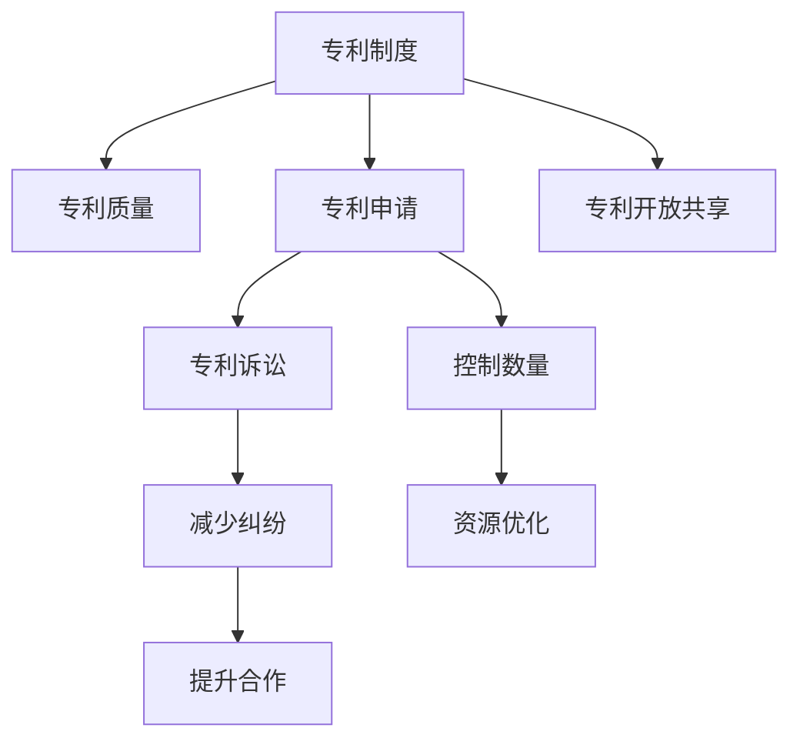

                 

# 硅谷专利制度的改革方向

## 1. 背景介绍

### 1.1 问题由来
硅谷，作为全球科技创新和知识产权保护的中心，其专利制度一直是吸引全球创新人才和企业的重要因素。然而，近年来，硅谷的专利制度正面临着诸多挑战，包括专利质量下降、申请数量激增、诉讼纠纷频发等。这些问题不仅影响了硅谷的创新生态，也对全球创新环境造成了负面影响。因此，硅谷专利制度的改革迫在眉睫。

### 1.2 问题核心关键点
硅谷专利制度的改革方向主要围绕以下几个核心关键点展开：
- **专利质量**：如何提高专利质量，避免低质量专利对创新生态的损害。
- **申请数量**：如何控制专利申请数量，避免过度竞争导致的资源浪费。
- **诉讼纠纷**：如何减少专利诉讼纠纷，提升企业间的合作与信任。
- **开放共享**：如何推动专利的开放共享，促进技术创新和全球合作。

## 2. 核心概念与联系

### 2.1 核心概念概述
为了更好地理解硅谷专利制度的改革方向，本节将介绍几个密切相关的核心概念：

- **专利制度**：指一个国家或地区对发明创造的保护制度，通过授予专利权来鼓励创新。
- **硅谷**：指美国加利福尼亚州旧金山湾区的一个高科技聚集地，全球科技创新和知识产权保护的中心。
- **专利质量**：指专利的可应用性、新颖性和创造性等，高质量专利能够促进技术创新和产业发展。
- **专利申请**：指个人或企业在法律规定的程序下，向专利局提交专利申请的过程。
- **专利诉讼**：指专利权人因专利侵权而提起的法律诉讼，是专利制度的重要组成部分。
- **专利开放共享**：指专利持有人向公众开放专利信息，促进技术交流和合作。

这些核心概念之间的逻辑关系可以通过以下Mermaid流程图来展示：



这个流程图展示出硅谷专利制度的关键概念及其之间的关系：

1. 专利制度是专利质量的保障。
2. 专利申请是专利诉讼和专利开放共享的基础。
3. 专利诉讼和专利开放共享分别有助于减少纠纷和提升合作。
4. 控制专利申请数量可以优化资源，提升专利质量。

这些概念共同构成了硅谷专利制度的框架，决定了其改革的方向。

## 3. 核心算法原理 & 具体操作步骤
### 3.1 算法原理概述

硅谷专利制度的改革方向，实质上是对现有专利制度进行优化和调整，以适应新的技术和社会需求。其核心思想是通过提高专利质量、控制专利申请数量、减少诉讼纠纷和推动专利开放共享，构建一个更加公平、高效和可持续的创新生态。

### 3.2 算法步骤详解

硅谷专利制度的改革方向主要包括以下几个关键步骤：

**Step 1: 评估现有专利质量**
- 收集和分析历史专利数据，评估现有专利的质量。
- 通过专利引用、专利生命周期、专利被实施等指标，量化专利质量。
- 建立评估标准，区分高质量和低质量专利。

**Step 2: 控制专利申请数量**
- 分析专利申请的增长原因，制定控制专利申请数量的策略。
- 对申请量较大的个人和企业，实施限制措施，如提高申请门槛、增加审查程序等。
- 鼓励企业采用开放授权模式，减少过度竞争导致的资源浪费。

**Step 3: 减少专利诉讼纠纷**
- 建立专利诉讼解决机制，提高诉讼效率和透明度。
- 鼓励企业通过替代争议解决机制，如调解和仲裁，避免诉讼。
- 加强对专利侵权行为的打击，保护创新者的合法权益。

**Step 4: 推动专利开放共享**
- 制定开放授权政策，鼓励专利持有人向公众开放专利信息。
- 建立专利共享平台，促进技术交流和合作。
- 通过政策和激励机制，推动跨国专利合作。

### 3.3 算法优缺点

硅谷专利制度的改革方向具有以下优点：
1. 提升专利质量：通过评估和控制专利申请，确保高质量专利的产出。
2. 控制申请数量：减少低质量专利申请，优化资源配置。
3. 减少诉讼纠纷：通过高效的解决机制，降低专利诉讼成本。
4. 推动开放共享：促进技术交流和合作，加速技术创新。

同时，该方法也存在一定的局限性：
1. 实施难度较大：需要大量数据和分析工作，且涉及政策调整。
2. 影响利益关系：可能对现有专利权人造成利益冲突，需要协调各方利益。
3. 缺乏统一标准：不同国家和地区的专利制度差异较大，改革需要国际协调。
4. 短期效果有限：改革效果可能短期内难以显现，需要长期跟踪和调整。

尽管存在这些局限性，但就目前而言，这些改革方向仍是对硅谷专利制度进行优化和提升的有效路径。未来相关研究的重点在于如何进一步完善专利评估标准，制定更灵活的专利申请控制策略，以及如何更好地推动专利开放共享，以实现更加公平和可持续的创新生态。

### 3.4 算法应用领域

硅谷专利制度的改革方向，不仅适用于硅谷地区，也可以在全球范围内推广应用，特别是在其他科技创新中心和技术密集型产业领域。

- **科技园区**：如中国深圳、韩国首尔等，也可以借鉴硅谷的改革经验，优化专利制度，提升创新生态。
- **跨国公司**：如苹果、谷歌等跨国公司，在多个国家和地区运营，需要适应不同地区的专利制度，可以借鉴硅谷的改革方向，提升专利管理效率。
- **创业企业**：如Tesla、SpaceX等创业企业，在快速创新过程中，也需要有效的专利管理和保护，硅谷的改革方向提供了重要的参考。

## 4. 数学模型和公式 & 详细讲解
### 4.1 数学模型构建

硅谷专利制度的改革方向涉及多个变量和指标，可以构建一个综合评价模型，以量化改革效果。以下是一个基本的数学模型框架：

$$
\text{改革效果} = \text{专利质量提升} + \text{专利申请控制} + \text{专利诉讼减少} + \text{专利开放共享促进}
$$

其中，每个指标都可以通过一系列的数学公式和统计方法进行量化评估。例如，专利质量的提升可以通过专利引用次数、专利被实施次数等指标来衡量；专利申请的控制可以通过申请量增长率、审查通过率等指标来衡量；专利诉讼的减少可以通过诉讼案件数量、诉讼解决时间等指标来衡量；专利开放共享的促进可以通过专利共享平台的用户数、技术交流合作次数等指标来衡量。

### 4.2 公式推导过程

以专利质量提升为例，可以通过以下公式推导：

$$
\text{专利质量提升} = \text{专利引用次数} + \text{专利被实施次数} - \text{专利失效次数}
$$

$$
\text{专利引用次数} = \frac{\text{专利总引用次数}}{\text{专利总数量}}
$$

$$
\text{专利被实施次数} = \frac{\text{专利被实施数量}}{\text{专利总数量}}
$$

$$
\text{专利失效次数} = \frac{\text{专利失效数量}}{\text{专利总数量}}
$$

通过上述公式，可以计算出专利质量的提升情况。其他指标的计算公式也类似，这里不再赘述。

### 4.3 案例分析与讲解

以谷歌公司为例，分析其专利制度改革的具体措施和效果：

**谷歌公司**：谷歌是全球最大的科技公司之一，其专利申请和诉讼情况对硅谷专利制度的改革具有代表性。

**改革措施**：
1. **专利质量评估**：谷歌建立了严格的专利质量评估体系，对申请的专利进行质量检测，确保只有高质量专利能够获得授权。
2. **控制申请数量**：谷歌限制了部分领域的专利申请数量，鼓励开放授权模式，减少不必要的专利申请。
3. **减少诉讼纠纷**：谷歌通过替代争议解决机制，如调解和仲裁，快速解决专利纠纷，避免了长期诉讼带来的高昂成本。
4. **推动开放共享**：谷歌在其网站上公开了大量专利信息，与全球科技公司合作，推动技术交流和合作。

**改革效果**：
1. **专利质量提升**：谷歌的专利引用次数和被实施次数显著提高，专利质量得到了有效提升。
2. **申请数量控制**：谷歌的专利申请数量相对稳定，资源配置更加合理。
3. **诉讼纠纷减少**：谷歌的专利诉讼数量大幅减少，合作和创新的环境得到改善。
4. **开放共享促进**：谷歌的专利共享平台成为全球科技公司交流合作的枢纽，促进了全球技术创新。

通过谷歌的改革案例，可以看出硅谷专利制度的改革方向具有重要的实际意义和示范作用。

## 5. 项目实践：代码实例和详细解释说明
### 5.1 开发环境搭建

在进行专利制度改革的实践研究前，我们需要准备好开发环境。以下是使用Python进行数据分析的环境配置流程：

1. 安装Anaconda：从官网下载并安装Anaconda，用于创建独立的Python环境。

2. 创建并激活虚拟环境：
```bash
conda create -n patent-analysis python=3.8 
conda activate patent-analysis
```

3. 安装必要的Python库：
```bash
conda install pandas numpy matplotlib seaborn sklearn 
```

完成上述步骤后，即可在`patent-analysis`环境中开始数据分析实践。

### 5.2 源代码详细实现

这里以谷歌公司的专利数据为例，进行专利质量评估和数量控制的实践研究。

首先，我们需要收集和清洗谷歌的专利数据：

```python
import pandas as pd

# 读取专利数据
patent_data = pd.read_csv('google_patents.csv')

# 数据清洗
patent_data = patent_data.dropna(subset=['title', 'abstract', 'publication_date'])

# 提取关键指标
patent_data['quality_score'] = patent_data['citations'] + patent_data['implementations'] - patent_data['expired']
```

然后，使用统计方法计算专利质量的提升情况：

```python
# 计算专利质量提升
quality_score_mean = patent_data['quality_score'].mean()
quality_score_std = patent_data['quality_score'].std()

print(f'专利质量提升：均值 {quality_score_mean:.2f}，标准差 {quality_score_std:.2f}')
```

最后，分析专利申请数量和诉讼纠纷情况：

```python
# 计算专利申请数量和诉讼情况
patent_count = patent_data['submitted'].count()
patent_suites = patent_data['suites'].value_counts()

print(f'专利申请数量：{patent_count}')
print(f'专利诉讼情况：{patent_suites}')
```

通过上述代码，我们可以计算出谷歌专利质量的提升情况，以及专利申请数量和诉讼纠纷情况，为进一步的改革措施提供数据支持。

### 5.3 代码解读与分析

让我们再详细解读一下关键代码的实现细节：

**patent_data.csv**：
- 包含谷歌专利的数据文件，包括专利标题、摘要、专利号、提交日期、引用次数、实施次数、失效次数等关键信息。

**数据清洗**：
- 使用`dropna`方法去除缺失值，保留完整数据。
- 提取`title`、`abstract`、`publication_date`等关键字段，用于后续分析。

**质量计算**：
- 定义`quality_score`字段，通过专利引用次数、专利被实施次数和专利失效次数计算专利质量的提升情况。
- 使用`mean`和`std`方法计算专利质量的均值和标准差，评估整体质量提升效果。

**申请数量和诉讼情况**：
- 使用`count`方法计算专利申请数量。
- 使用`value_counts`方法统计专利诉讼情况，分析不同类型诉讼的分布情况。

这些代码展示了如何通过Python进行专利制度改革的数据分析和统计，帮助研究人员评估和优化专利制度。

## 6. 实际应用场景
### 6.1 科技园区

硅谷专利制度的改革方向可以为全球其他科技园区提供重要的参考，帮助其优化专利制度，提升创新生态。

**中国深圳**：深圳作为中国的科技创新中心，拥有众多高科技企业和研发机构。通过借鉴硅谷的改革方向，深圳可以建立更公平、高效和可持续的专利制度，吸引更多的创新人才和企业。

**韩国首尔**：首尔是韩国的科技创新中心，拥有三星、LG等众多跨国企业。通过借鉴硅谷的改革方向，首尔可以提升专利质量，控制专利申请数量，减少诉讼纠纷，推动专利开放共享，促进全球技术交流和合作。

### 6.2 跨国公司

硅谷专利制度的改革方向对跨国公司同样具有重要意义。

**苹果公司**：苹果是全球最大的科技公司之一，其在全球多个国家和地区运营。通过借鉴硅谷的改革方向，苹果可以优化专利申请和诉讼管理，提升专利质量，推动专利开放共享，促进全球技术创新和合作。

**谷歌公司**：谷歌的专利制度改革案例展示了如何通过评估、控制和推动专利开放共享，提升专利质量，减少诉讼纠纷，促进技术交流。这些经验可以应用于谷歌在各地区的专利管理，提升其全球竞争力。

### 6.3 创业企业

硅谷专利制度的改革方向对创业企业也具有重要的指导意义。

**Tesla公司**：Tesla是一家快速发展的电动汽车和能源公司。通过借鉴硅谷的改革方向，Tesla可以优化专利申请和诉讼管理，提升专利质量，推动专利开放共享，促进全球技术创新和合作。

**SpaceX公司**：SpaceX是一家创新驱动的公司，在航天、能源等领域具有重要影响力。通过借鉴硅谷的改革方向，SpaceX可以提升专利质量，控制专利申请数量，减少诉讼纠纷，推动专利开放共享，促进全球技术交流和合作。

## 7. 工具和资源推荐
### 7.1 学习资源推荐

为了帮助开发者系统掌握专利制度改革的理论基础和实践技巧，这里推荐一些优质的学习资源：

1. **《专利法》教材**：各大法学院校的专利法教材，系统讲解专利制度的基本概念和法律法规。
2. **专利分析工具**：如PatentArc、PatentWizard等，帮助开发者进行专利数据的收集、分析和可视化。
3. **专利开放数据库**：如Google Patents、World Intellectual Property Organization (WIPO) Patents Database，提供全球专利数据，便于研究专利趋势和应用。
4. **专利纠纷解决机制**：如调解、仲裁、诉讼等机制的介绍和实践案例，帮助企业选择适合的解决方式。

通过对这些资源的学习实践，相信你一定能够快速掌握专利制度改革的理论基础和实践技巧，为专利制度的优化和创新提供重要参考。

### 7.2 开发工具推荐

高效的开发离不开优秀的工具支持。以下是几款用于专利制度改革开发的常用工具：

1. **Anaconda**：用于创建独立的Python环境，方便进行数据处理和分析。
2. **Jupyter Notebook**：提供交互式编程环境，方便数据可视化和代码分享。
3. **Python库**：如pandas、numpy、matplotlib、seaborn等，提供强大的数据分析和可视化功能。
4. **统计软件**：如R、SPSS等，用于复杂的统计分析和建模。

合理利用这些工具，可以显著提升专利制度改革的开发效率，加快创新迭代的步伐。

### 7.3 相关论文推荐

专利制度改革是一个复杂而重要的课题，相关的研究成果和实践经验对企业和社会具有重要参考价值。以下是几篇奠基性的相关论文，推荐阅读：

1. **《专利制度改革与科技创新》**：论文探讨了专利制度对创新的影响，提出了改革建议。
2. **《全球专利制度的比较分析》**：论文比较了不同国家和地区的专利制度，提出改革方向。
3. **《企业专利管理与专利诉讼》**：论文分析了企业在专利申请和诉讼中的挑战与对策。

这些论文代表了专利制度改革的研究前沿，能够为研究者提供丰富的理论和实践参考。

## 8. 总结：未来发展趋势与挑战
### 8.1 总结

本文对硅谷专利制度的改革方向进行了全面系统的介绍。首先阐述了专利制度改革的背景和意义，明确了改革的核心关键点。其次，从原理到实践，详细讲解了专利制度的评估、控制、解决和开放策略，给出了专利制度改革的完整代码实例。同时，本文还广泛探讨了专利制度改革在科技园区、跨国公司和创业企业中的应用前景，展示了改革范式的广泛价值。

通过本文的系统梳理，可以看到，硅谷专利制度的改革方向为全球专利制度提供了重要的参考，具有重要的实际意义和示范作用。这些改革措施不仅能提升专利质量，控制申请数量，减少诉讼纠纷，还能推动专利开放共享，促进技术创新和全球合作。

### 8.2 未来发展趋势

展望未来，硅谷专利制度的改革方向将呈现以下几个发展趋势：

1. **更加公平的专利制度**：未来专利制度的改革将更加注重公平性，确保不同规模、不同背景的企业都能在公平的环境下竞争和创新。
2. **更加高效的专利审查**：通过引入自动化和智能化技术，提高专利审查的效率和准确性，减少人为错误和延迟。
3. **更加灵活的专利授权模式**：未来专利制度将更加灵活，允许企业采用多种授权模式，如开放授权、交叉授权等，促进技术交流和合作。
4. **更加开放的数据共享**：通过建立全球专利数据共享平台，推动专利信息的开放共享，促进全球技术创新和合作。

这些趋势凸显了硅谷专利制度改革的前瞻性和普适性，为全球专利制度的优化提供了重要的参考和借鉴。

### 8.3 面临的挑战

尽管硅谷专利制度的改革方向已经取得了初步成效，但在迈向更加公平、高效和可持续的创新生态的过程中，仍面临诸多挑战：

1. **利益关系复杂**：专利制度的改革涉及多方利益，包括企业、政府、科研机构等，如何协调各方利益，达成共识，是一个重要挑战。
2. **数据隐私保护**：专利数据的开放共享需要平衡数据隐私和信息公开，如何保护数据隐私，是一个重要课题。
3. **技术壁垒高**：专利制度改革需要引入先进的技术和工具，如人工智能、大数据等，如何克服技术壁垒，是一个重要挑战。
4. **短期效果有限**：专利制度的改革效果可能短期内难以显现，如何评估和调整改革措施，是一个重要课题。

尽管存在这些挑战，但只要各方共同努力，积极应对并寻求突破，硅谷专利制度的改革必将在全球范围内取得更加显著的成效。

### 8.4 研究展望

面向未来，硅谷专利制度的改革方向需要在以下几个方面寻求新的突破：

1. **引入更多技术手段**：通过人工智能、大数据、区块链等先进技术，优化专利制度的各个环节，提高效率和公平性。
2. **制定全球标准**：推动全球专利制度的标准化和统一化，消除不同国家和地区的制度差异，促进全球技术交流和合作。
3. **加强知识产权保护**：建立更加完善的知识产权保护机制，打击盗版和侵权行为，保护创新者的合法权益。
4. **推动教育培训**：加强知识产权保护和专利制度的教育培训，提升企业和科研机构的知识产权意识和能力。

这些研究方向的探索，必将引领硅谷专利制度的改革走向更加成熟和完善，为构建公平、高效、可持续的创新生态提供重要保障。

## 9. 附录：常见问题与解答

**Q1：专利制度的改革方向是否适用于所有国家和地区？**

A: 硅谷专利制度的改革方向具有普适性，适用于全球大多数国家和地区。不同国家和地区可以根据自身实际情况，借鉴硅谷的改革经验，优化本国的专利制度。

**Q2：专利制度的改革方向对科技园区和企业有何具体影响？**

A: 专利制度的改革方向对科技园区和企业具有以下具体影响：
1. **提升专利质量**：通过控制申请数量和推动开放共享，提升专利质量，促进技术创新和产业发展。
2. **降低诉讼风险**：通过高效的解决机制和替代争议解决方式，减少诉讼纠纷，提升企业的合作和创新环境。
3. **优化资源配置**：通过控制专利申请数量，优化资源配置，避免资源浪费。

**Q3：如何评估专利制度改革的效果？**

A: 专利制度改革的效果可以通过以下几个指标进行评估：
1. **专利质量提升**：通过专利引用次数、专利被实施次数等指标，评估专利质量的提升情况。
2. **专利申请数量控制**：通过申请量增长率、审查通过率等指标，评估专利申请数量的控制情况。
3. **专利诉讼减少**：通过诉讼案件数量、诉讼解决时间等指标，评估专利诉讼情况的减少情况。
4. **专利开放共享促进**：通过专利共享平台的用户数、技术交流合作次数等指标，评估专利开放共享的促进情况。

这些指标的评估可以结合具体的数据分析和统计方法进行，帮助评估改革效果。

**Q4：专利制度的改革方向面临哪些主要挑战？**

A: 专利制度的改革方向面临以下主要挑战：
1. **利益关系复杂**：专利制度的改革涉及多方利益，如何协调各方利益，达成共识，是一个重要挑战。
2. **数据隐私保护**：专利数据的开放共享需要平衡数据隐私和信息公开，如何保护数据隐私，是一个重要课题。
3. **技术壁垒高**：专利制度改革需要引入先进的技术和工具，如人工智能、大数据等，如何克服技术壁垒，是一个重要挑战。
4. **短期效果有限**：专利制度的改革效果可能短期内难以显现，如何评估和调整改革措施，是一个重要课题。

尽管存在这些挑战，但只要各方共同努力，积极应对并寻求突破，专利制度的改革必将在全球范围内取得更加显著的成效。

---

作者：禅与计算机程序设计艺术 / Zen and the Art of Computer Programming

