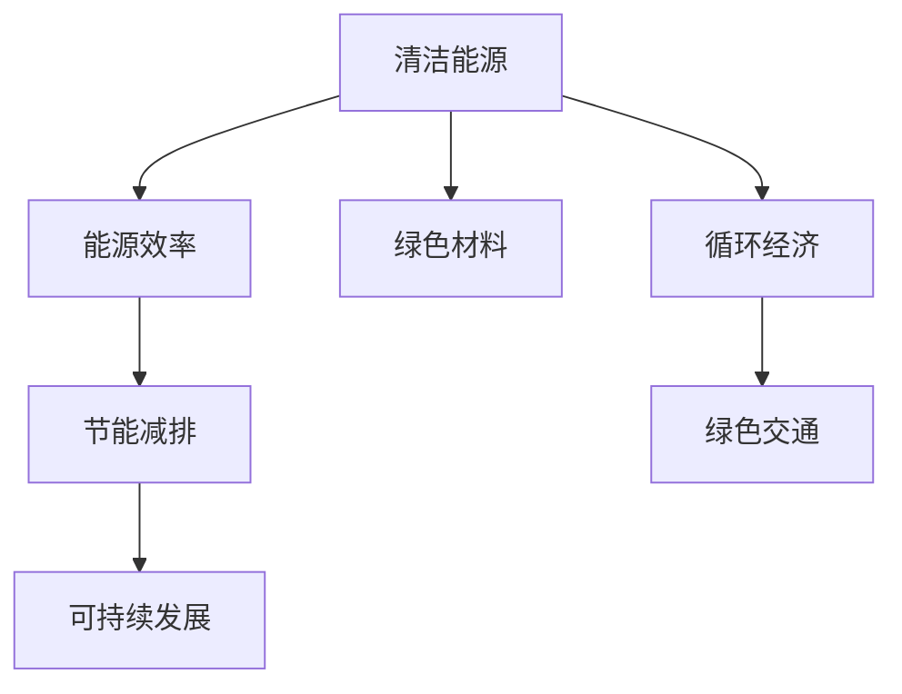

                 

# 硅谷绿色科技:可持续发展的实践

> 关键词：可持续技术, 绿色科技, 环保创新, 能源效率, 清洁能源, 循环经济

## 1. 背景介绍

### 1.1 问题由来

随着工业化进程的加速和人类活动的加剧，地球的环境问题日益严峻。全球气候变化、资源枯竭、生态破坏等问题成为全人类面临的重大挑战。在应对这些问题的过程中，硅谷作为全球科技创新的中心，积极探索和实践绿色科技，推动可持续发展成为现实。

硅谷之所以能在这场全球性的绿色革命中扮演关键角色，主要有以下原因：

- **人才聚集**：硅谷汇聚了全球顶尖的科技人才和创业家，他们具备雄厚的技术背景和创新能力，能够突破传统思维，开发出具有革命性的绿色技术。
- **资本支持**：硅谷拥有强大的资本支持，通过风投和风险投资，为绿色科技创业公司提供了充足的资金保障。
- **创新文化**：硅谷拥有浓厚的创新文化，鼓励实验和试错，这为绿色科技的研发提供了宽松的环境。
- **合作网络**：硅谷形成了广泛的合作网络，通过企业、研究机构、政府等多方协同合作，推动技术从实验室到市场的转化。

### 1.2 问题核心关键点

硅谷绿色科技的实践主要围绕以下几个关键点展开：

- **清洁能源**：包括太阳能、风能、地热能、海洋能等可再生能源的研发与应用，减少对化石燃料的依赖。
- **节能减排**：通过提高能效、减少碳排放、循环利用资源等方式，降低对环境的影响。
- **绿色材料**：开发和应用环保材料，减少化学污染物和重金属的排放。
- **循环经济**：推动资源循环利用，减少资源浪费，促进经济和环境的和谐发展。
- **绿色交通**：发展电动汽车、氢能车等清洁交通工具，减少交通领域的碳排放。

通过这些实践，硅谷不仅为全球应对气候变化提供了技术和经验，也为经济发展和环境保护找到了一条可持续的道路。

## 2. 核心概念与联系

### 2.1 核心概念概述

为更好地理解硅谷绿色科技的实践，本节将介绍几个密切相关的核心概念：

- **绿色科技**：指通过科学技术手段减少环境污染、保护生态、促进资源循环利用的技术，旨在实现经济、社会、环境的协调发展。
- **清洁能源**：指可再生能源和低碳能源，如太阳能、风能、水能、地热能等，与传统的化石燃料相比，其碳排放量较低。
- **能源效率**：指在生产和消费过程中，能源的转化和利用效率，反映了能源的利用质量和水平。
- **循环经济**：一种基于资源循环和再生利用原则的经济模式，强调减少废物产生、提高资源利用效率。
- **绿色材料**：指在生产、使用和废弃过程中对环境影响较小的材料，如生物降解材料、纳米材料等。
- **绿色交通**：指采用环保交通工具和交通管理方式，减少交通领域的碳排放和污染。

这些核心概念之间的逻辑关系可以通过以下Mermaid流程图来展示：



这个流程图展示出硅谷绿色科技实践的核心逻辑：

1. 清洁能源提供可再生和低碳的能源供应。
2. 能源效率提升能源的利用效率，减少能源浪费。
3. 绿色材料降低生产过程中的环境污染。
4. 循环经济推动资源循环利用，减少资源浪费。
5. 绿色交通减少交通领域的碳排放。
6. 上述各要素共同作用，推动整个社会的可持续发展。

## 3. 核心算法原理 & 具体操作步骤
### 3.1 算法原理概述

硅谷绿色科技的实践涉及众多技术领域的算法和原理，但总体上可以概括为以下几个关键步骤：

1. **能源管理与优化**：通过智能算法和优化技术，提高能源使用的效率，减少能源浪费。
2. **数据驱动的环境监测**：利用大数据和机器学习技术，实时监测环境状况，及时采取应对措施。
3. **资源循环利用**：通过物联网和自动化技术，实现资源的高效回收和再利用。
4. **绿色材料研发**：通过化学工程和材料科学，开发出更环保、高效的材料。
5. **清洁能源技术**：通过光伏、风电、水能等技术，实现能源的清洁生产。
6. **智能交通系统**：利用智能交通管理和大数据分析，优化交通流量，减少碳排放。

### 3.2 算法步骤详解

硅谷绿色科技的实践过程包括以下几个关键步骤：

**Step 1: 数据收集与分析**

- 收集环境、能源、交通等各类数据，如空气质量、能源消耗、碳排放等。
- 利用大数据技术和数据分析方法，对数据进行清洗和处理，提取有用的信息。

**Step 2: 技术研发与创新**

- 根据数据驱动的洞察，选择合适的新技术和新材料进行研发。
- 开发和测试新技术，评估其可行性和效益，逐步完善技术方案。

**Step 3: 技术部署与推广**

- 在实际应用中测试新技术，评估其效果和成本效益。
- 推广新技术，通过政策支持和市场机制，促进其大规模应用。

**Step 4: 持续优化与迭代**

- 根据实际应用效果和反馈信息，持续优化技术方案。
- 通过不断的迭代，提升技术的性能和可靠性。

**Step 5: 政策支持与监管**

- 制定和实施绿色科技相关的政策法规，鼓励企业和社会采用新技术。
- 加强环境监管和评估，确保技术的绿色属性。

### 3.3 算法优缺点

硅谷绿色科技的实践具有以下优点：

- **技术领先**：硅谷汇聚了大量科技人才和创新资源，推动了许多前沿技术的开发和应用。
- **产业驱动**：通过产业化和市场机制，促进绿色技术的广泛应用和商业化。
- **政策支持**：政府通过政策、资金和监管等手段，为绿色科技的推广提供了有力保障。
- **国际合作**：硅谷积极与全球其他地区和组织合作，分享技术经验和最佳实践。

同时，绿色科技的实践也存在一些局限性：

- **成本问题**：许多绿色技术在初期研发和部署成本较高，可能面临经济上的挑战。
- **技术依赖**：过度依赖某些技术或设备，可能导致供应链脆弱性。
- **政策不确定性**：政策环境和市场机制的变化，可能影响技术推广和应用。
- **社会接受度**：公众对新技术的接受程度和认知水平，可能影响技术的推广效果。

### 3.4 算法应用领域

硅谷绿色科技的实践已经覆盖了多个应用领域，包括但不限于：

- **智能电网**：利用大数据和物联网技术，优化能源管理和分配，提高能源效率。
- **智能交通**：通过智能交通管理系统，优化交通流量，减少碳排放。
- **智能建筑**：利用自动化和智能控制技术，降低建筑物的能耗和碳排放。
- **清洁能源**：开发和应用太阳能、风能等可再生能源，减少对化石燃料的依赖。
- **绿色材料**：研发和应用环保材料，减少化学污染物和重金属的排放。
- **循环经济**：推动资源循环利用，实现废物零排放。

这些领域展示了硅谷绿色科技的广泛应用，为全球可持续发展提供了宝贵的经验和示范。

## 4. 数学模型和公式 & 详细讲解  
### 4.1 数学模型构建

本节将使用数学语言对硅谷绿色科技实践中的关键算法和模型进行更加严格的刻画。

假设有一个清洁能源项目，其目标是最大化新能源发电的占比，同时最小化发电成本。记总发电量为 $E$，其中新能源发电占比为 $r$，传统能源发电占比为 $1-r$。新能源发电成本为 $C_r$，传统能源发电成本为 $C_1$。则目标函数为：

$$
\max r \quad \text{s.t.} \quad r \cdot C_r + (1-r) \cdot C_1 \leq E \cdot C_{avg}
$$

其中 $C_{avg}$ 为平均发电成本。

### 4.2 公式推导过程

根据目标函数和约束条件，我们可以通过拉格朗日乘数法求解最大化新能源发电占比 $r$。定义拉格朗日乘数 $\lambda$，则拉格朗日函数为：

$$
\mathcal{L}(r, \lambda) = r \cdot C_r + \lambda (E \cdot C_{avg} - r \cdot C_r - (1-r) \cdot C_1)
$$

对 $r$ 和 $\lambda$ 求偏导数，得到：

$$
\frac{\partial \mathcal{L}}{\partial r} = C_r - \lambda \cdot C_{avg} = 0 \quad \Rightarrow \quad \lambda = \frac{C_r}{C_{avg}}
$$

$$
\frac{\partial \mathcal{L}}{\partial \lambda} = E \cdot C_{avg} - r \cdot C_r - (1-r) \cdot C_1 = 0 \quad \Rightarrow \quad r = \frac{E \cdot C_{avg} - (1-r) \cdot C_1}{C_r + C_1}
$$

通过上述推导，我们可以得到新能源发电占比 $r$ 的表达式，用于实际项目中优化新能源发电的占比。

### 4.3 案例分析与讲解

假设有一个风电项目，总发电量为 $E=100MW$，新能源发电成本 $C_r=0.1$ 元/kWh，传统能源发电成本 $C_1=0.5$ 元/kWh，平均发电成本 $C_{avg}=0.4$ 元/kWh。根据公式推导，可以得到新能源发电占比 $r$：

$$
r = \frac{100 \times 0.4 - (1-r) \times 0.5}{0.1 + 0.5} = \frac{40 - 0.5 + 0.5r}{0.6} = 66.67\%
$$

这意味着在风电项目中，新能源发电占比应为 $66.67\%$，以最大化新能源发电的效益。

## 5. 项目实践：代码实例和详细解释说明
### 5.1 开发环境搭建

在进行绿色科技项目实践前，我们需要准备好开发环境。以下是使用Python进行数据科学项目的环境配置流程：

1. 安装Anaconda：从官网下载并安装Anaconda，用于创建独立的Python环境。

2. 创建并激活虚拟环境：
```bash
conda create -n green-env python=3.8 
conda activate green-env
```

3. 安装必要的Python库：
```bash
pip install pandas numpy scikit-learn matplotlib seaborn jupyter notebook ipython
```

4. 安装相关工具和软件：
```bash
conda install -c anaconda jupyterlab
```

5. 安装环境：
```bash
conda install -c conda-forge openjdk jupyterlab-server
```

完成上述步骤后，即可在`green-env`环境中开始绿色科技项目实践。

### 5.2 源代码详细实现

下面以智能电网为例，给出使用Python和Pandas库对能源管理系统的实现。

首先，导入所需的库和模块：

```python
import pandas as pd
import numpy as np
from sklearn.linear_model import LinearRegression
```

接着，准备数据集，构建模型：

```python
# 准备数据集
data = pd.read_csv('energy_data.csv')

# 数据清洗和预处理
data = data.dropna().drop_duplicates()
X = data[['energy_price', 'demand_price']]
y = data['energy_consumption']

# 构建线性回归模型
model = LinearRegression()
model.fit(X, y)
```

最后，使用模型进行预测和评估：

```python
# 预测能源消耗
pred_y = model.predict(X)

# 评估模型性能
mse = np.mean((pred_y - y) ** 2)
r2 = model.score(X, y)

print(f"MSE: {mse:.2f}, R2: {r2:.2f}")
```

以上代码实现了一个简单的能源管理系统，通过线性回归模型预测能源消耗，用于实际项目中优化能源使用。

### 5.3 代码解读与分析

让我们再详细解读一下关键代码的实现细节：

**数据准备**：
- 使用Pandas库读取和处理数据集，去除缺失值和重复数据，确保数据的质量。
- 选取影响能源消耗的关键变量，如能源价格和需求价格，构建模型输入。

**模型构建**：
- 使用scikit-learn库中的线性回归模型，对数据进行拟合。
- 利用训练集进行模型训练，得到模型参数。

**模型预测与评估**：
- 使用训练好的模型对新数据进行预测，得到能源消耗的预测值。
- 通过计算均方误差(MSE)和决定系数(R2)，评估模型的预测性能。

以上代码展示了如何通过数据科学的方法进行绿色科技的实践，即通过能源管理系统优化能源使用，提高能源效率。

## 6. 实际应用场景
### 6.1 智能电网

智能电网作为绿色科技的重要应用领域，通过物联网和自动化技术，优化能源管理和分配，提高能源效率，减少碳排放。智能电网的核心技术包括：

- **分布式能源管理**：利用传感器和智能设备，实时监测和管理分布式能源的供应和需求。
- **需求响应技术**：通过智能算法和用户互动，优化能源使用，减少能源浪费。
- **微电网技术**：将多个微电网系统连接起来，实现能源的共享和优化。

通过智能电网，可以大大提高能源使用的效率，减少能源浪费和碳排放，为可持续发展提供保障。

### 6.2 智能交通

智能交通系统通过大数据和物联网技术，优化交通流量，减少碳排放。智能交通的核心技术包括：

- **交通流量监测**：利用摄像头和传感器，实时监测交通流量，优化交通信号。
- **路径规划算法**：通过大数据分析，优化路线选择，减少交通拥堵和碳排放。
- **电动汽车管理**：通过智能充电桩和电网管理，优化电动汽车的充电和使用。

智能交通系统的应用，不仅能显著减少交通拥堵和碳排放，还能提升交通的效率和安全性。

### 6.3 智能建筑

智能建筑通过自动化和智能控制技术，降低建筑物的能耗和碳排放。智能建筑的核心技术包括：

- **建筑能效监测**：利用传感器和智能设备，实时监测建筑物的能源使用情况。
- **智能控制系统**：通过自动化控制技术，优化建筑物的能源使用，减少能耗。
- **绿色建材应用**：推广使用环保材料，减少化学污染物和重金属的排放。

智能建筑的应用，不仅能提高建筑物的能效，还能为城市提供更绿色、更舒适的生活环境。

### 6.4 未来应用展望

随着绿色科技的不断发展，未来的应用场景将更加广泛，技术也将更加成熟。以下是一些未来可能的应用方向：

- **绿色交通基础设施**：建设更加环保的交通基础设施，如电动高速、氢能车站等，推动绿色交通的发展。
- **绿色工业生产**：通过智能制造和循环经济技术，实现工业生产的绿色化，减少碳排放和资源浪费。
- **绿色城市建设**：建设绿色城市，推广绿色建筑、绿色能源和绿色交通，实现城市的可持续发展。
- **智能环境监测**：通过物联网和传感器技术，实时监测环境状况，及时采取应对措施，保护生态环境。

## 7. 工具和资源推荐
### 7.1 学习资源推荐

为了帮助开发者系统掌握绿色科技的理论基础和实践技巧，这里推荐一些优质的学习资源：

1. **《绿色科技：原理与实践》书籍**：由绿色科技专家撰写，全面介绍了绿色科技的原理、应用和实践经验。

2. **IEEE Xplore**：IEEE官方数据库，收录了大量绿色科技相关的学术论文和技术报告。

3. **Coursera**：全球领先的在线教育平台，提供丰富的绿色科技课程，涵盖能源、环境、材料等多个领域。

4. **Open Access Library**：开放获取的学术资源库，免费提供大量的绿色科技文献和资料，方便学习和研究。

5. **TED Talks**：TED演讲平台，汇集了大量绿色科技专家和实践者的精彩演讲，提供了丰富的学习素材。

通过对这些资源的学习实践，相信你一定能够快速掌握绿色科技的核心概念和实践方法，为可持续发展贡献力量。

### 7.2 开发工具推荐

高效的开发离不开优秀的工具支持。以下是几款用于绿色科技开发的常用工具：

1. **Jupyter Notebook**：开源的交互式笔记本环境，支持多种编程语言和数据科学工具。

2. **Python**：简单易学的高级编程语言，拥有丰富的第三方库和框架，适合进行数据分析和科学计算。

3. **R语言**：专业的统计分析工具，适合进行数据建模和可视化。

4. **MATLAB**：强大的数值计算和仿真工具，适合进行复杂的工程计算和仿真分析。

5. **Tableau**：数据可视化工具，适合进行数据的分析和展示。

合理利用这些工具，可以显著提升绿色科技项目的开发效率，加快创新迭代的步伐。

### 7.3 相关论文推荐

绿色科技的研究源于学界的持续探索。以下是几篇奠基性的相关论文，推荐阅读：

1. **《可再生能源技术：现状与未来》论文**：由国际能源署（IEA）发布，全面介绍了可再生能源的最新进展和技术趋势。

2. **《智能电网技术：应用与挑战》论文**：探讨了智能电网的关键技术和发展前景，提供了丰富的实践案例。

3. **《智能交通系统：技术与应用》论文**：介绍了智能交通系统的核心技术及其应用，分析了未来的发展方向。

4. **《绿色建筑技术：原理与实践》论文**：详细介绍了绿色建筑的设计、施工和运营技术，提供了实用的参考和建议。

5. **《循环经济模型：理论与实践》论文**：构建了循环经济模型的框架，分析了其优化方法和应用案例。

这些论文代表了大规模绿色科技研究的最新进展，通过学习这些前沿成果，可以帮助研究者把握学科的前进方向，激发更多的创新灵感。

## 8. 总结：未来发展趋势与挑战

### 8.1 总结

本文对硅谷绿色科技的实践进行了全面系统的介绍。首先阐述了绿色科技的背景和意义，明确了其在应对环境问题、推动可持续发展方面的重要价值。其次，从原理到实践，详细讲解了绿色科技的核心算法和操作步骤，提供了绿色科技项目开发的完整代码实例。同时，本文还探讨了绿色科技在智能电网、智能交通、智能建筑等多个领域的应用前景，展示了硅谷绿色科技的广泛影响。此外，本文精选了绿色科技的学习资源和开发工具，力求为读者提供全方位的技术指引。

通过本文的系统梳理，可以看到，硅谷绿色科技在推动全球可持续发展方面发挥了重要作用，为未来绿色科技的发展提供了宝贵的经验和借鉴。

### 8.2 未来发展趋势

展望未来，硅谷绿色科技的实践将呈现以下几个发展趋势：

1. **技术创新加速**：随着科技的进步，绿色科技将不断推陈出新，涌现更多高效、环保的技术方案。

2. **产业规模扩大**：绿色科技的商业化应用将不断扩大，为经济可持续发展提供更多动力。

3. **政策支持增强**：各国政府将加大对绿色科技的政策支持，推动技术创新和应用。

4. **国际合作深化**：全球范围内的合作将更加紧密，共享技术经验和最佳实践。

5. **社会接受度提升**：公众对绿色科技的认知和接受度将不断提高，推动技术的普及和应用。

6. **数据驱动深化**：通过大数据和人工智能技术，提高绿色科技的精准度和效率。

以上趋势凸显了绿色科技的广阔前景，为全球应对气候变化提供了新的方向和手段。

### 8.3 面临的挑战

尽管绿色科技已经取得了显著进展，但在迈向更广泛应用的过程中，仍面临诸多挑战：

1. **成本问题**：部分绿色技术在初期研发和部署成本较高，可能面临经济上的挑战。

2. **技术依赖**：过度依赖某些技术或设备，可能导致供应链脆弱性。

3. **政策不确定性**：政策环境和市场机制的变化，可能影响技术推广和应用。

4. **社会接受度**：公众对新技术的接受程度和认知水平，可能影响技术的推广效果。

5. **资源分配不均**：不同地区和国家的资源分配不均，可能影响技术的普及和应用。

6. **环境监管不足**：部分地区和企业的环境监管不足，可能影响技术的绿色属性。

这些挑战需要各方共同努力，通过技术创新、政策支持和市场机制，促进绿色科技的可持续发展。

### 8.4 研究展望

面对绿色科技面临的挑战，未来的研究需要在以下几个方面寻求新的突破：

1. **成本优化**：开发更低成本、更高效的绿色技术，降低初期研发和部署成本。

2. **技术集成**：推动绿色技术与其他领域的深度融合，形成更加综合的解决方案。

3. **政策引导**：通过政策激励和监管，引导企业和社会采用绿色技术。

4. **公众教育**：加强公众对绿色科技的认知和教育，提升社会接受度。

5. **国际合作**：加强国际合作，共享技术经验和最佳实践，推动全球绿色科技的发展。

这些研究方向和突破，必将引领绿色科技进入新的发展阶段，为全球可持续发展做出更大的贡献。

## 9. 附录：常见问题与解答

**Q1：绿色科技在各个领域的实际应用效果如何？**

A: 绿色科技在各个领域的应用效果显著，具体如下：

- **智能电网**：通过优化能源管理和分配，显著提高了能源使用效率，减少了能源浪费和碳排放。
- **智能交通**：优化交通流量和路径规划，减少了交通拥堵和碳排放，提升了交通效率和安全性。
- **智能建筑**：通过自动化控制和智能监测，降低了建筑能耗，推广了绿色建材应用，减少了化学污染物和重金属的排放。
- **绿色能源**：通过大规模应用太阳能、风能等可再生能源，减少了对化石燃料的依赖，降低了碳排放。
- **循环经济**：推动资源循环利用，减少了资源浪费，提高了资源利用效率。

这些应用展示了绿色科技的广泛影响和显著效益。

**Q2：绿色科技的发展主要依赖于哪些因素？**

A: 绿色科技的发展主要依赖于以下几个因素：

- **科技人才**：绿色科技需要大量的科技人才，包括工程师、科学家和研究人员，推动技术创新和应用。
- **资本支持**：绿色科技项目需要大量的资金支持，通过风投和风险投资，为项目提供充足的资金保障。
- **政策支持**：各国政府通过政策激励和监管，推动绿色科技的普及和应用。
- **公众意识**：公众对绿色科技的认知和接受度，决定了技术的普及程度和应用效果。
- **国际合作**：全球范围内的合作，共享技术经验和最佳实践，推动技术的国际传播和应用。

这些因素共同推动了绿色科技的发展，为全球可持续发展提供了重要支持。

**Q3：如何评估绿色科技项目的成本效益？**

A: 评估绿色科技项目的成本效益，主要从以下几个方面进行：

- **初期投资**：计算绿色技术的研发和部署成本。
- **运营成本**：计算绿色技术的运营和维护成本。
- **效益分析**：计算绿色技术带来的环境效益和经济效益。
- **ROI计算**：计算绿色技术的投资回报率，评估其经济可行性。

通过综合考虑这些因素，可以全面评估绿色科技项目的成本效益，确保其在经济上的可持续性。

**Q4：绿色科技的推广和应用需要哪些关键条件？**

A: 绿色科技的推广和应用需要以下几个关键条件：

- **政策支持**：政府制定和实施相关政策，鼓励企业和社会采用绿色技术。
- **资金保障**：提供充足的资金支持，降低绿色技术的初期研发和部署成本。
- **技术创新**：不断进行技术创新，开发高效、环保的技术方案。
- **市场机制**：建立市场机制，推动绿色技术的大规模应用。
- **公众认知**：加强公众对绿色科技的认知和教育，提升社会接受度。
- **国际合作**：加强国际合作，共享技术经验和最佳实践，推动全球绿色科技的发展。

这些条件共同决定了绿色科技的推广和应用效果，需要各方共同努力。

---

作者：禅与计算机程序设计艺术 / Zen and the Art of Computer Programming

