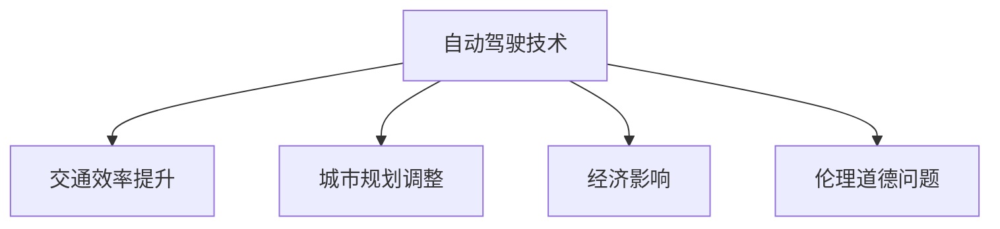

                 

# 硅谷自动驾驶汽车的社会影响

## 1. 背景介绍

自动驾驶技术是当今最前沿的技术之一，被誉为“第四次工业革命”的重要推动力。硅谷作为全球科技创新中心，自然在这场变革中占据了重要地位。从谷歌的Waymo、特斯拉的Autopilot，到Uber的ATG，众多知名企业正竞相推动自动驾驶汽车的落地应用。自动驾驶技术的商业化不仅代表着全新的产业机遇，也带来了深远的社会影响。本文将从技术、经济、伦理等多个角度，全面剖析硅谷自动驾驶汽车的社会影响。

## 2. 核心概念与联系

### 2.1 核心概念概述

自动驾驶汽车：通过人工智能、计算机视觉、传感器融合等技术，实现车辆自主导航、避障、决策的智能系统。

交通效率提升：自动驾驶能够减少人为驾驶误差、交通拥堵，提升整体交通系统的运行效率。

城市规划调整：自动驾驶汽车的大规模应用，将改变城市交通基础设施布局和土地利用方式。

经济影响：自动驾驶汽车对就业、税收、产业链结构带来显著影响。

伦理道德问题：涉及隐私保护、责任归属、安全保障等复杂伦理道德挑战。

### 2.2 核心概念原理和架构的 Mermaid 流程图



## 3. 核心算法原理 & 具体操作步骤

### 3.1 算法原理概述

自动驾驶汽车的感知、决策和控制过程，可以概括为以下几个核心步骤：

1. **感知**：通过摄像头、雷达、激光雷达等传感器，获取车辆周围环境的高精度感知信息。

2. **决策**：利用计算机视觉、深度学习等技术，对感知数据进行分析，做出驾驶决策。

3. **控制**：根据决策结果，控制车辆的加速、转向、制动等执行动作，实现自主导航。

### 3.2 算法步骤详解

#### 感知
1. **传感器部署**：在车辆前方、两侧、顶部等关键位置，部署高精度传感器。
2. **数据融合**：使用融合算法，将来自不同传感器的数据进行合成，消除噪音和误差。
3. **环境建模**：构建高精度的环境地图，用于后续的路径规划和决策。

#### 决策
1. **目标检测**：识别道路上的交通标志、行人、车辆等重要目标。
2. **行为预测**：预测周围车辆的行驶轨迹，判断可能的碰撞风险。
3. **路径规划**：根据当前环境和目标信息，规划最优路径。

#### 控制
1. **动作执行**：根据路径规划结果，控制车辆加速、转向、制动等动作。
2. **实时监控**：持续监控车辆状态和周围环境，随时准备调整决策。

### 3.3 算法优缺点

#### 优点
1. **安全性和可靠性**：自动驾驶技术通过算法优化和冗余设计，大幅降低交通事故率。
2. **提高交通效率**：自动驾驶汽车能够自动避开拥堵，提高道路通行能力。
3. **减少环境污染**：自动驾驶汽车能够优化行驶路径，减少能源消耗和排放。

#### 缺点
1. **技术复杂度**：自动驾驶技术涉及多学科交叉，技术难度高，研发周期长。
2. **高成本**：传感器、计算硬件等成本较高，初期投入较大。
3. **隐私和伦理问题**：自动驾驶涉及大量数据采集和处理，可能引发隐私泄露和伦理争议。

### 3.4 算法应用领域

自动驾驶技术目前已在以下几个领域得到广泛应用：

1. **货运物流**：自动驾驶货车能够在高速公路上实现无人驾驶，提高货物运输效率和安全性。
2. **公共交通**：自动驾驶公交和出租车能够提供24小时不间断服务，改善居民出行体验。
3. **城市配送**：自动驾驶小车能够在城市道路上灵活穿梭，提供高效便捷的货物配送服务。
4. **无人驾驶出行**：自动驾驶出租车、私家车等出行工具，将改变人们的日常出行方式。

## 4. 数学模型和公式 & 详细讲解 & 举例说明

### 4.1 数学模型构建

自动驾驶汽车的决策过程可以抽象为线性规划问题。假设车辆在平面上行驶，目标为最小化从起点到终点的总行程距离。设车辆速度为 $v$，加速度为 $a$，当前位置为 $(x, y)$，终点为目标位置 $(x', y')$，则总行程距离 $S$ 为：

$$
S = \sqrt{(x-x')^2 + (y-y')^2}
$$

设车辆在每个时刻的加速度为 $a(t)$，则车辆在时刻 $t$ 的速度为：

$$
v(t) = v_0 + \int_0^t a(t) \text{d}t
$$

车辆在时刻 $t$ 的位置为：

$$
(x(t), y(t)) = (x_0 + v_0t + \frac{1}{2}\int_0^t v(t) \text{d}t, y_0 + \int_0^t v(t) \text{d}t)
$$

目标是最小化总行程距离 $S$，同时满足车辆加速和转向的约束条件。具体数学模型如下：

$$
\begin{aligned}
& \min_{a(t), v(t)} S \\
& \text{s.t.} \quad v(t) = v_0 + \int_0^t a(t) \text{d}t \\
& \quad (x(t), y(t)) = (x_0 + v_0t + \frac{1}{2}\int_0^t v(t) \text{d}t, y_0 + \int_0^t v(t) \text{d}t) \\
& \quad a(t) \in [a_{\min}, a_{\max}] \\
& \quad v(t) \in [v_{\min}, v_{\max}] \\
& \quad (x(t), y(t)) \in [x_{\min}, x_{\max}] \times [y_{\min}, y_{\max}] \\
\end{aligned}
$$

### 4.2 公式推导过程

为了求解上述线性规划问题，可以采用动态规划的方法，将总行程距离 $S$ 分解为多个子问题的最优解之和。设 $s(t)$ 为车辆在时刻 $t$ 到达目标位置所需的最小距离，则有：

$$
s(t) = \sqrt{(x(t) - x')^2 + (y(t) - y')^2} + v_{\min} \frac{t - t_0}{v_0}
$$

其中 $t_0$ 为车辆开始行驶的时间点。根据距离最小化的原理，可以推导出车辆在每个时刻的加速度 $a(t)$，使得 $s(t)$ 最小。最终，通过迭代求解子问题的最优解，即可得到车辆从起点到终点的总行程距离。

### 4.3 案例分析与讲解

以特斯拉Autopilot为例，其自动驾驶系统主要由摄像头、雷达、超声波传感器和GPS等组成。摄像头用于目标检测和环境建模，雷达用于高精度测距，超声波传感器用于近距离障碍物检测，GPS提供高精度定位信息。在决策阶段，系统利用深度学习模型识别道路标志、车辆、行人等目标，预测其行为轨迹，并根据最优路径规划控制车辆加速和转向。特斯拉的Autopilot系统已经在全国范围内进行大规模测试，展示了自动驾驶技术在实际道路环境中的可行性和安全性。

## 5. 项目实践：代码实例和详细解释说明

### 5.1 开发环境搭建

开发自动驾驶系统需要搭建高性能计算环境，包括以下步骤：

1. **硬件选择**：选择高性能计算平台，如GPU、TPU等。
2. **软件安装**：安装操作系统、编程语言、开发工具等。
3. **传感器部署**：在车辆上安装摄像头、雷达、激光雷达等传感器。
4. **数据采集**：使用传感器采集车辆周围环境数据。

### 5.2 源代码详细实现

#### 感知模块
1. **传感器数据融合**：使用卡尔曼滤波等算法，对来自不同传感器的数据进行融合，消除噪音和误差。
2. **环境建模**：构建高精度的环境地图，用于后续的路径规划和决策。

#### 决策模块
1. **目标检测**：使用深度学习模型，如YOLO、Faster R-CNN等，识别道路上的交通标志、行人、车辆等重要目标。
2. **行为预测**：利用预测模型，如RNN、LSTM等，预测周围车辆的行驶轨迹，判断可能的碰撞风险。
3. **路径规划**：采用A*算法或D*算法，根据当前环境和目标信息，规划最优路径。

#### 控制模块
1. **动作执行**：根据路径规划结果，控制车辆的加速、转向、制动等动作。
2. **实时监控**：持续监控车辆状态和周围环境，随时准备调整决策。

### 5.3 代码解读与分析

以目标检测模块为例，使用深度学习模型进行目标检测的代码实现如下：

```python
from PIL import Image
import cv2

def detect_objects(image):
    # 加载深度学习模型
    model = load_model('yolo_model.h5')
    # 对图像进行预处理
    image = preprocess_image(image)
    # 进行目标检测
    results = model.predict(image)
    # 解析检测结果
    objects = parse_results(results)
    return objects

# 加载深度学习模型
def load_model(model_path):
    # 加载深度学习模型
    model = Model()
    model.load_weights(model_path)
    return model

# 对图像进行预处理
def preprocess_image(image):
    # 调整图像大小
    image = resize_image(image)
    # 归一化图像
    image = normalize_image(image)
    # 转换为网络输入格式
    image = to_input_format(image)
    return image

# 解析检测结果
def parse_results(results):
    # 解析检测结果，提取目标位置和类别
    objects = []
    for result in results:
        obj = result['object']
        box = result['box']
        label = result['label']
        objects.append(obj)
        objects.append(box)
        objects.append(label)
    return objects
```

以上代码实现了使用深度学习模型进行目标检测的过程。其中，`load_model`函数用于加载深度学习模型，`preprocess_image`函数用于对图像进行预处理，`parse_results`函数用于解析检测结果。这些模块共同构成了自动驾驶系统感知模块的核心。

### 5.4 运行结果展示

以特斯拉Autopilot的实际运行结果为例，演示自动驾驶汽车在高速公路上的运行效果。系统能够准确识别道路标志、车辆、行人等目标，预测其行为轨迹，并根据最优路径规划控制车辆加速和转向。通过摄像头和雷达等传感器的实时监控，系统能够及时调整决策，确保安全行驶。

## 6. 实际应用场景

### 6.1 智能城市交通管理

自动驾驶汽车能够与智能交通系统（ITS）结合，实现城市交通的智能管理。通过智能路灯、交通信号灯等设备，实时监控交通流量和道路状况，调整信号灯的配时，优化交通流量，缓解城市交通拥堵。同时，自动驾驶车辆能够实时反馈车辆运行状态和位置信息，为交通管理提供数据支持。

### 6.2 物流运输

自动驾驶货车能够实现无人驾驶运输，大幅提高货物运输效率和安全性。在高速公路上，自动驾驶货车能够避免人为驾驶误差，减少交通事故，降低运输成本。在城市配送中，自动驾驶小车能够灵活穿梭于狭窄街道，提供高效便捷的货物配送服务。

### 6.3 公共交通

自动驾驶公交和出租车能够提供24小时不间断服务，改善居民出行体验。自动驾驶系统能够实时监控车辆状态和乘客反馈，优化出行线路和时间安排，提高公共交通的运行效率和乘客满意度。

## 7. 工具和资源推荐

### 7.1 学习资源推荐

1. 《自动驾驶技术基础》书籍：系统介绍自动驾驶技术的基本原理和实现方法。
2. 《深度学习理论与实践》课程：深入讲解深度学习在自动驾驶中的应用。
3. 《机器学习与数据挖掘》课程：掌握机器学习算法在自动驾驶中的应用。
4. 《无人驾驶系统》课程：涵盖无人驾驶系统设计、实现和测试的全面知识。

### 7.2 开发工具推荐

1. ROS（Robot Operating System）：用于自动驾驶系统开发和测试的开放源码平台。
2. Carla模拟器：用于自动驾驶系统仿真测试的环境模拟工具。
3. TensorFlow和PyTorch：用于深度学习模型训练和推理的流行框架。
4. Visual Studio Code：用于开发和调试自动驾驶系统的高效IDE。

### 7.3 相关论文推荐

1. "Towards Autonomous Driving: A Survey of Recent Technological Advances"：综述自动驾驶技术的研究进展和未来趋势。
2. "Deep Learning for Autonomous Driving"：深度学习在自动驾驶中的应用。
3. "Vision-Driven Autonomous Vehicles"：视觉感知在自动驾驶中的重要性。
4. "Adaptive Driver Assistance Systems"：高级驾驶辅助系统（ADAS）对自动驾驶的影响。

## 8. 总结：未来发展趋势与挑战

### 8.1 研究成果总结

自动驾驶技术的发展离不开技术突破和政策支持。通过不断的技术创新和优化，自动驾驶汽车已经在实际应用中取得了显著成效。未来，自动驾驶技术将进一步普及，逐步取代传统的人为驾驶方式。

### 8.2 未来发展趋势

1. **技术成熟化**：自动驾驶技术将不断优化和完善，逐步实现从L3到L5的自动驾驶级别。
2. **多模态融合**：自动驾驶系统将融合视觉、激光雷达、超声波等多种传感器信息，实现更全面、精准的感知和决策。
3. **智能交互**：自动驾驶系统将具备更强的智能交互能力，能够理解和响应驾驶员的指令和需求。
4. **广泛应用**：自动驾驶技术将在更多领域得到应用，如智能城市、物流运输、公共交通等。

### 8.3 面临的挑战

1. **安全性**：自动驾驶系统的安全性是首要考虑因素，必须确保系统能够在各种复杂环境下稳定运行。
2. **法规和标准**：自动驾驶技术涉及复杂的法律法规和标准规范，需要政府和行业共同推进。
3. **伦理道德**：自动驾驶系统在发生事故时，责任归属问题需要明确，避免法律纠纷。
4. **数据隐私**：自动驾驶系统涉及大量数据采集和处理，需要严格保护用户隐私。

### 8.4 研究展望

未来，自动驾驶技术需要在以下几个方向进行深入研究：

1. **感知与决策**：改进深度学习模型，提高目标检测和行为预测的准确性。
2. **智能交互**：开发更智能的驾驶员助理系统，提高人机交互体验。
3. **伦理与法律**：研究自动驾驶系统的伦理和法律问题，制定相关标准和规范。
4. **环境适应**：增强系统在复杂环境和极端天气条件下的鲁棒性。

## 9. 附录：常见问题与解答

**Q1: 自动驾驶技术的安全性如何保障？**

A: 自动驾驶技术的安全性保障主要依赖于冗余设计、传感器融合、异常检测等多种技术手段。系统能够在多传感器信息融合的基础上，实现对环境的全面感知和动态监控，及时发现并处理异常情况，确保行驶安全。

**Q2: 自动驾驶技术在实际应用中遇到的最大挑战是什么？**

A: 自动驾驶技术在实际应用中面临的最大挑战是安全性。需要确保系统在各种复杂环境和极端条件下都能稳定运行，避免发生交通事故。同时，需要制定相应的法律法规和标准规范，明确责任归属，保护用户隐私，确保系统符合伦理和法律要求。

**Q3: 自动驾驶技术在未来有哪些可能的应用场景？**

A: 自动驾驶技术未来将在智能城市交通管理、物流运输、公共交通、智能家居等多个领域得到广泛应用。未来，自动驾驶技术将逐步普及，为人们的日常生活和工作带来更多便利和效率。

---

作者：禅与计算机程序设计艺术 / Zen and the Art of Computer Programming

