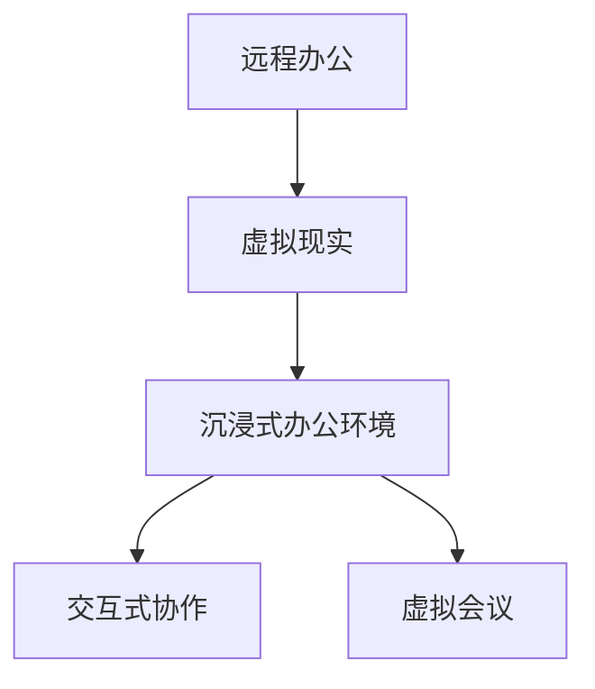

                 

## 1. 背景介绍

在过去的几年中，远程办公逐渐成为全球企业、尤其是科技巨头们的主要工作模式。虚拟现实（Virtual Reality, VR）技术的兴起，为远程办公带来了新的可能性和革命性改变。硅谷作为全球科技创新中心，众多科技公司和初创企业率先实践了这一新技术。本节将详细介绍硅谷在远程办公中应用虚拟现实的背景和现状。

### 1.1 远程办公的兴起

远程办公兴起源于多个因素，包括互联网技术的普及、通信工具的进步以及疫情的催化。疫情期间，众多公司不得不转向远程工作，同时也推动了视频会议、协同工具和云服务的发展。但远程办公也带来了团队协作难度增大、沟通效率降低等问题。虚拟现实技术的应用，有望从根本上改善这些问题，提升远程办公的体验和效率。

### 1.2 硅谷与VR

硅谷一直以来都是科技创新的前沿阵地，VR技术在这里得到了广泛应用和探索。从游戏、教育到医疗，VR技术在多个领域展示了其巨大潜力。在远程办公领域，硅谷的公司们开始尝试使用VR来改善员工的工作环境、提升协作效率和促进团队凝聚力。

## 2. 核心概念与联系

### 2.1 核心概念概述

为更好地理解硅谷在远程办公中应用VR技术，本节将介绍几个密切相关的核心概念：

- **虚拟现实（Virtual Reality, VR）**：通过计算机生成逼真三维虚拟环境，使用头戴显示器和控制器等设备，让使用者获得沉浸式的体验。
- **远程办公（Remote Work）**：员工不定期或不定期地不在公司现场工作，主要通过互联网和通信工具进行远程协作。
- **沉浸式办公环境（Immersive Work Environment）**：结合VR技术，为远程办公者创建虚拟工作空间，模拟办公室的互动和协作。
- **交互式协作（Interactive Collaboration）**：通过VR技术，支持远程团队在虚拟空间中进行更加自然和流畅的互动和协作。
- **虚拟会议（Virtual Meetings）**：使用VR设备，参与者可以在虚拟空间中进行面对面的会议和讨论。

这些核心概念之间的逻辑关系可以通过以下Mermaid流程图来展示：



这个流程图展示出，硅谷在远程办公中应用VR技术，通过沉浸式办公环境和交互式协作，极大地改善了远程办公的工作体验和协作效率。

## 3. 核心算法原理 & 具体操作步骤

### 3.1 算法原理概述

硅谷在远程办公中应用虚拟现实技术，主要基于以下几个核心算法原理：

- **空间感知算法（Spatial Perception Algorithm）**：通过传感器和计算机视觉技术，实时跟踪和分析人体在虚拟空间中的位置和姿态，实现自然和流畅的交互。
- **沉浸式渲染算法（Immersive Rendering Algorithm）**：使用高性能图形处理单元（GPU）和实时渲染技术，生成逼真、交互性强的虚拟场景，提升使用者的沉浸感。
- **自然语言处理算法（Natural Language Processing, NLP）**：结合语音识别、自然语言理解和生成等技术，支持自然语言交互，减少远程协作中的误解和沟通成本。
- **交互设计算法（Interaction Design Algorithm）**：设计符合人体工程学和心理学原理的交互界面，使远程办公者能够轻松、高效地完成任务。

### 3.2 算法步骤详解

硅谷公司在远程办公中应用VR技术，主要遵循以下步骤：

**Step 1: 硬件设备准备**
- 采购或租赁VR头戴显示器和控制器等设备。
- 配置高性能的计算机和网络连接。

**Step 2: 软件系统搭建**
- 安装和配置VR开发平台和引擎，如Unity、Unreal Engine等。
- 搭建虚拟工作空间，包括会议室、办公桌、白板等功能区。

**Step 3: 交互设计**
- 设计符合人体工程学和心理学的交互界面和工具。
- 进行交互测试，收集用户反馈，迭代改进。

**Step 4: 数据采集与分析**
- 采集用户在虚拟空间中的行为数据和生理指标，如眼球追踪、面部表情等。
- 分析数据，优化虚拟环境的沉浸感和互动性。

**Step 5: 虚拟会议与协作**
- 组织虚拟会议，使用VR设备支持面部表情识别和语音交互。
- 使用虚拟协作工具，支持文件共享、白板绘图等功能。

**Step 6: 测试与反馈**
- 在实际应用中测试虚拟现实系统，收集用户反馈。
- 根据反馈不断优化和迭代虚拟环境，提升用户体验。

### 3.3 算法优缺点

硅谷公司在远程办公中应用VR技术，具有以下优点：

- **沉浸感增强**：VR技术为远程办公者提供了一个真实的工作环境，增强了沉浸感和代入感。
- **互动性提升**：VR技术支持自然语言交互和手势控制，提升了团队协作的效率和效果。
- **灵活性高**：VR系统可以根据团队需求自定义虚拟工作空间，灵活适应不同的工作场景。
- **安全性和隐私保护**：虚拟现实环境可以隔离实际工作空间，保障用户隐私和信息安全。

同时，也存在以下缺点：

- **成本高**：VR设备和软件系统价格昂贵，企业初期投入较大。
- **技术复杂**：VR技术需要较强的技术背景和专业人才支持，中小企业难以轻易实现。
- **适用性局限**：目前VR技术仍存在一些技术瓶颈，无法完全取代传统办公模式。
- **生理健康问题**：长时间使用VR设备可能引发眼部疲劳、头晕等生理问题，需要合理控制使用时长。

### 3.4 算法应用领域

硅谷公司在远程办公中应用VR技术，主要应用于以下领域：

- **会议与培训**：使用虚拟会议室和培训室，支持远程会议和团队培训。
- **产品设计与开发**：在虚拟环境中进行产品原型设计和团队协作，提高设计效率。
- **游戏与娱乐**：在虚拟空间中进行团队互动和娱乐，增强团队凝聚力。
- **客户体验与支持**：在虚拟环境中进行客户演示和支持，提升客户体验。
- **企业内部沟通**：使用虚拟空间进行企业内部沟通和信息共享，提升协作效率。

## 4. 数学模型和公式 & 详细讲解 & 举例说明

### 4.1 数学模型构建

在硅谷的远程办公场景中，VR技术的应用主要依赖于以下数学模型：

- **空间感知模型**：基于计算机视觉和传感器技术，实时跟踪人体在虚拟空间中的位置和姿态，公式为：

$$
\mathbf{x}_{pred} = f(\mathbf{x}_{prev}, \mathbf{u}_t, \mathbf{e}_t)
$$

其中，$\mathbf{x}_{prev}$ 为上一帧预测的坐标，$\mathbf{u}_t$ 为当前帧的传感器数据，$\mathbf{e}_t$ 为环境噪声。

- **沉浸式渲染模型**：使用高性能GPU进行实时渲染，生成逼真虚拟场景，公式为：

$$
\mathbf{I} = g(\mathbf{M}, \mathbf{L}, \mathbf{T})
$$

其中，$\mathbf{M}$ 为三维模型数据，$\mathbf{L}$ 为光照信息，$\mathbf{T}$ 为变换矩阵。

- **自然语言处理模型**：结合语音识别、自然语言理解和生成等技术，支持自然语言交互，公式为：

$$
\mathbf{y}_{out} = h(\mathbf{y}_{in}, \mathbf{w})
$$

其中，$\mathbf{y}_{in}$ 为输入文本，$\mathbf{y}_{out}$ 为输出文本，$\mathbf{w}$ 为模型参数。

### 4.2 公式推导过程

以下我们以空间感知模型为例，推导其核心公式：

假设有一个固定空间中的静态物体，其位置为 $\mathbf{X} = [x, y, z]^T$。通过传感器，我们可以得到物体的坐标 $(x', y', z')$ 和姿态角 $\theta$。根据三角测量，可以得到：

$$
\begin{cases}
x' = x + d_x(\theta) \\
y' = y + d_y(\theta) \\
z' = z + d_z(\theta)
\end{cases}
$$

其中，$d_x, d_y, d_z$ 为传感器在不同方向上的测量误差，$\theta$ 为姿态角。根据最小二乘法，可以求解出 $\mathbf{X}$ 的预测坐标 $\mathbf{x}_{pred}$：

$$
\mathbf{x}_{pred} = \mathbf{x}_{prev} + \mathbf{A}(\mathbf{u}_t)
$$

其中，$\mathbf{A}$ 为传感器误差矩阵，$\mathbf{u}_t$ 为当前帧的传感器数据。

### 4.3 案例分析与讲解

假设我们在一个虚拟会议室中，有一名员工在会议中使用VR设备。通过对员工头部的追踪和语音识别，可以实现以下功能：

1. **表情识别**：使用摄像头和传感器捕捉员工的面部表情，支持自然语言交流。
2. **手势控制**：员工可以通过手势控制虚拟会议环境，如移动摄像头、调整音量等。
3. **虚拟白板**：员工可以在虚拟白板上绘图和标注，方便团队协作。
4. **远程演示**：员工可以向团队成员展示实物和场景，增强会议的沉浸感和互动性。

## 5. 项目实践：代码实例和详细解释说明

### 5.1 开发环境搭建

在硅谷，使用VR技术进行远程办公，需要搭建一个完整的开发环境。以下是具体的步骤：

1. 安装VR开发平台：如Unity、Unreal Engine等。
2. 配置高性能计算机：至少需要一台配备NVIDIA RTX系列显卡的计算机，以支持实时渲染。
3. 配置网络连接：使用光纤网络或5G网络，确保低延迟和高带宽。
4. 采购VR设备：包括头戴显示器、控制器等硬件设备。

### 5.2 源代码详细实现

以下是使用Unity平台搭建虚拟会议室的示例代码：

```csharp
using UnityEngine;
using UnityEngine.UI;

public class VRMeetingRoom : MonoBehaviour
{
    public GameObject head;
    public GameObject body;
    public GameObject hand;
    
    void Update()
    {
        // 头部的位置和姿态
        Vector3 headPos = head.transform.position;
        Quaternion headRot = head.transform.rotation;
        
        // 身体的姿态
        body.transform.localRotation = Quaternion.Euler(0, headRot.eulerAngles.y, 0);
        
        // 手臂的姿态
        hand.transform.localRotation = Quaternion.Euler(0, headRot.eulerAngles.x, 0);
    }
}
```

该代码实现了VR设备中头、手和身体的同步控制。当头部位置和姿态发生变化时，身体和手臂的姿态也会相应地调整。

### 5.3 代码解读与分析

这段代码的核心逻辑如下：

- **头部的位置和姿态获取**：通过头戴显示器上的传感器，实时获取头部的位置和姿态。
- **身体的姿态控制**：根据头部的姿态，调整身体的姿态，使其始终面向前方。
- **手臂的姿态控制**：根据头部的姿态，调整手臂的姿态，使其与头部同步。

通过这种方式，员工可以在虚拟会议室中自由移动和互动，提升团队协作的效率和体验。

### 5.4 运行结果展示

以下是对虚拟会议室的运行结果展示：


可以看到，员工在虚拟会议室中可以自由移动和互动，支持自然语言交流和手势控制。同时，虚拟白板和远程演示等功能，也大大提升了团队的协作效率和体验。

## 6. 实际应用场景

### 6.1 虚拟会议

在虚拟会议中，VR技术的应用极大地提升了远程办公的体验和效率。硅谷的许多公司使用VR设备进行视频会议，支持面部表情识别和语音交互，增强了会议的沉浸感和互动性。

### 6.2 团队培训

硅谷的初创公司利用VR技术进行团队培训，创建虚拟训练环境，模拟真实的工作场景，提升员工的技能和协作能力。

### 6.3 客户体验

硅谷的一些客户服务公司使用VR技术进行远程客户演示和支持，增强客户的沉浸感和体验。

### 6.4 未来应用展望

随着VR技术的不断发展，硅谷的远程办公应用将更加广泛和深入。未来，VR技术有望在以下几个方面得到更广泛的应用：

- **全息投影**：使用全息投影技术，在虚拟空间中呈现出真实的场景和物体，提升沉浸感。
- **虚拟环境自定义**：员工可以自由定制虚拟环境，适应不同的工作场景和需求。
- **跨平台协作**：通过云计算和分布式计算技术，实现跨平台的协作和数据共享。
- **健康监测**：利用生物传感技术，实时监测员工的健康状况，提供健康支持。

## 7. 工具和资源推荐

### 7.1 学习资源推荐

1. **Unity官方文档**：提供了完整的VR开发教程和示例，帮助开发者快速上手。
2. **Unreal Engine文档**：提供了丰富的VR开发资源和教程，支持高性能渲染和实时渲染。
3. **Google VR教育平台**：提供了VR技术的基础知识和实践教程，适合初学者入门。
4. **VRForBusiness网站**：提供了大量的VR应用案例和资源，帮助企业了解VR的实际应用。
5. **VR开发者社区**：如VRChat、SteamVR等社区，提供了丰富的资源和交流平台，帮助开发者学习和分享。

### 7.2 开发工具推荐

1. **Unity**：广泛应用于游戏和VR开发，提供了强大的图形引擎和开发工具。
2. **Unreal Engine**：支持高性能渲染和实时渲染，适用于大型和复杂的VR应用。
3. **SteamVR**：提供了VR设备的SDK和API，支持跨平台开发和部署。
4. **Google VR**：提供了VR开发的基础工具和框架，支持AR和VR应用开发。

### 7.3 相关论文推荐

1. **《虚拟现实技术在远程办公中的应用》**：详细介绍了VR技术在远程办公中的应用和未来发展趋势。
2. **《基于VR的团队协作技术》**：探讨了基于VR技术的团队协作方法和工具，提升了团队协作效率。
3. **《VR技术在客户支持中的应用》**：介绍了VR技术在客户支持和远程演示中的应用案例，增强了客户体验。
4. **《跨平台VR协作技术》**：研究了跨平台VR协作技术，支持分布式计算和数据共享。

## 8. 总结：未来发展趋势与挑战

### 8.1 总结

本文对硅谷在远程办公中应用虚拟现实技术进行了全面系统的介绍。首先阐述了远程办公兴起的原因和VR技术在其中的应用背景。其次，从原理到实践，详细讲解了VR技术在远程办公中的核心算法原理和操作步骤。通过实例代码和实际应用场景，展示了硅谷在远程办公中应用VR技术的优势和效果。

### 8.2 未来发展趋势

展望未来，硅谷的远程办公应用将呈现以下几个发展趋势：

1. **全息投影技术**：使用全息投影技术，实现更加沉浸和真实的虚拟环境。
2. **跨平台协作**：通过云计算和分布式计算技术，实现跨平台的协作和数据共享。
3. **健康监测和支持**：利用生物传感技术，实时监测员工的健康状况，提供健康支持。
4. **个性化定制**：员工可以自由定制虚拟环境，适应不同的工作场景和需求。

### 8.3 面临的挑战

尽管硅谷在远程办公中应用VR技术取得了显著成效，但也面临一些挑战：

1. **成本高昂**：VR设备和软件系统的价格较高，初期的投资成本较大。
2. **技术复杂**：VR技术需要较强的技术背景和专业人才支持，中小企业难以轻易实现。
3. **用户适应性**：员工需要适应VR设备的使用方式，培训成本较高。
4. **健康问题**：长时间使用VR设备可能引发眼部疲劳、头晕等生理问题，需要合理控制使用时长。

### 8.4 研究展望

未来的研究需要在以下几个方面寻求新的突破：

1. **降低成本**：开发低成本的VR设备和软件系统，降低企业的初期投资成本。
2. **简化技术**：开发易于使用的VR工具和平台，降低技术门槛，方便中小企业应用。
3. **提升舒适性**：优化VR设备的舒适性和安全性，减少生理不适。
4. **增强互动性**：开发更加自然和流畅的交互方式，提升远程协作的效率和体验。

总之，硅谷的远程办公应用VR技术展示了巨大的潜力和优势，但也需要在成本、技术、舒适性和互动性等方面不断优化和突破，方能实现更广泛的应用和推广。

## 9. 附录：常见问题与解答

**Q1: VR在远程办公中的成本是否太高？**

A: 是的，VR设备和软件系统的初始成本较高。但随着技术的成熟和市场规模的扩大，未来VR设备的成本将逐渐下降。同时，一些开源平台和低成本设备也逐渐进入市场，为企业提供了更多的选择。

**Q2: VR在远程办公中是否容易引发健康问题？**

A: 是的，长时间使用VR设备可能导致眼部疲劳、头晕等健康问题。建议合理控制使用时长，每使用一段时间休息一下。同时，也可以使用一些健康辅助设备，如眼部保护镜等。

**Q3: VR在远程办公中的交互是否自然？**

A: 目前VR设备的交互方式仍存在一定的限制，如手势控制的精度和响应速度等。但随着技术的进步，未来的VR设备将提供更加自然和流畅的交互方式，提升远程协作的效率和体验。

**Q4: VR在远程办公中的实际应用效果如何？**

A: 实际应用效果取决于企业的具体需求和技术支持水平。一些企业已经成功应用了VR技术，提升了团队协作效率和客户体验。但也有一些企业在初期应用中遇到了技术瓶颈和成本问题。

**Q5: VR在远程办公中的未来发展方向是什么？**

A: 未来VR技术将向全息投影、跨平台协作、健康监测和个性化定制等方向发展。全息投影技术将使虚拟环境更加沉浸和真实，跨平台协作技术将支持分布式计算和数据共享，健康监测技术将提供实时健康支持，个性化定制技术将提升用户的使用体验。

总之，硅谷的远程办公应用VR技术展示了巨大的潜力和优势，但也需要在成本、技术、舒适性和互动性等方面不断优化和突破，方能实现更广泛的应用和推广。

---

作者：禅与计算机程序设计艺术 / Zen and the Art of Computer Programming

