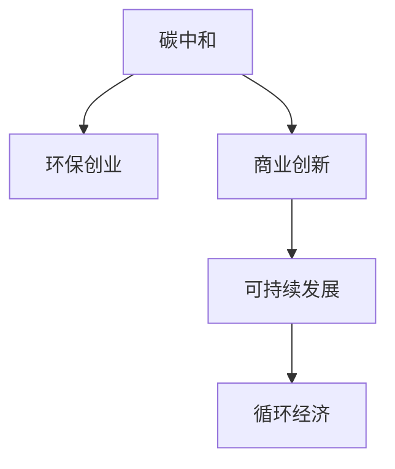

                 

# 碳中和创业：环保与商业的完美结合

> 关键词：碳中和,环保创业,商业创新,可持续发展,循环经济

## 1. 背景介绍

### 1.1 问题由来
在全球气候变化和环境污染问题日益严峻的背景下，各国政府和企业都在积极采取措施应对这一全球性挑战。碳中和成为全球共识，各国纷纷出台政策和规划，推动绿色低碳经济转型。在此背景下，碳中和创业项目应运而生，成为环保与商业结合的新趋势。

### 1.2 问题核心关键点
碳中和创业的核心在于如何通过商业创新实现环境效益和社会效益的双赢。一方面，企业需要投入技术、资金、人力等资源，探索可持续发展的商业模式；另一方面，政府和社会需要提供政策支持、市场环境和技术平台，推动项目的实施和扩展。

### 1.3 问题研究意义
碳中和创业不仅能有效解决环境问题，还能促进经济结构调整，推动产业升级，具有重大的社会和环境价值。此外，碳中和创业项目在带动就业、提升企业竞争力、促进国际合作等方面也具有重要意义。

## 2. 核心概念与联系

### 2.1 核心概念概述

为更好地理解碳中和创业，本节将介绍几个密切相关的核心概念：

- 碳中和（Carbon Neutral）：指通过减少温室气体排放、增加碳吸收等方式，使得单位时间内碳排放与碳吸收达到平衡，实现零碳排放的目标。
- 环保创业（Green Entrepreneurship）：指以环境保护为主要目标，通过创业项目实现社会价值和经济价值双重提升的商业活动。
- 商业创新（Business Innovation）：指企业通过技术、模式、市场等创新，提升产品和服务价值，实现可持续发展。
- 可持续发展（Sustainable Development）：指在满足当代人的发展需求的同时，不损害后代人满足其需求的能力的发展模式。
- 循环经济（Circular Economy）：指通过设计、重用、修复和回收等方式，最大限度地利用资源，减少环境污染，实现经济效益与环境效益的双赢。

这些核心概念之间的逻辑关系可以通过以下Mermaid流程图来展示：



这个流程图展示了几者之间的联系：碳中和是环保创业的最终目标，商业创新是实现碳中和的有效手段，可持续发展是目标与手段之间的桥梁，而循环经济则是实现可持续发展的具体实践方式。

## 3. 核心算法原理 & 具体操作步骤
### 3.1 算法原理概述

碳中和创业的算法原理主要基于环境效益和经济效益的双重考量。通过优化生产过程、提高资源利用效率、采用清洁能源等手段，实现碳排放的减少和碳吸收的增加，从而实现碳中和。

具体而言，碳中和创业的算法原理包括以下几个关键步骤：

1. 评估碳排放：通过测量、估算等方式，对企业的碳排放进行精确评估。
2. 制定减排计划：根据碳排放评估结果，制定具体的减排措施和方案。
3. 实施减排方案：通过技术创新、模式创新等方式，实施减排方案，降低碳排放。
4. 碳吸收：通过植树造林、碳捕捉技术等方式，增加碳吸收，实现碳平衡。
5. 验证和调整：对减排效果进行评估和验证，根据实际情况进行调整和优化。

### 3.2 算法步骤详解

以下将详细介绍碳中和创业的算法步骤和具体操作步骤：

**Step 1: 碳排放评估**

评估碳排放是碳中和创业的第一步。企业需要收集相关数据，如能源消耗、生产流程、运输活动等，并使用碳排放计算器或第三方平台进行估算。常见的碳排放计算器包括CPCB、EDGE等，这些工具能够帮助企业精确计算其碳足迹。

**Step 2: 制定减排计划**

制定减排计划需要综合考虑企业实际情况和技术可行性。一般来说，减排计划应包括能源优化、工艺改进、设备升级、碳捕捉技术、清洁能源应用等具体措施。制定计划时，应优先选择成本低、效益高的措施，并设置合理的减排目标和时间表。

**Step 3: 实施减排方案**

实施减排方案是碳中和创业的关键环节。企业需要投入资金、人力和技术，组织实施减排措施。例如，通过安装能效设备、采用低碳材料、优化生产流程等方式，降低碳排放。同时，企业应加强环境监测和数据分析，实时掌握减排效果。

**Step 4: 碳吸收**

碳吸收是实现碳中和的重要手段。企业可以采用植树造林、碳捕捉技术等方式，增加碳吸收。植树造林是成本较低、效益显著的方式，而碳捕捉技术则需要更高的技术投入。

**Step 5: 验证和调整**

验证和调整是碳中和创业的持续改进环节。企业应定期对减排效果进行评估和验证，确保减排措施的实施效果。同时，根据实际情况进行持续调整和优化，确保实现碳中和目标。

### 3.3 算法优缺点

碳中和创业的算法具有以下优点：

1. 经济效益显著：通过提高能源利用效率、采用清洁能源等方式，降低运营成本，提升企业竞争力。
2. 环境效益显著：通过减少碳排放、增加碳吸收等方式，实现碳中和，减少对环境的负面影响。
3. 促进技术创新：碳中和创业需要技术创新，促进企业研发和应用新技术。
4. 推动产业升级：碳中和创业有助于推动传统产业的绿色转型，促进产业升级。

同时，该算法也存在以下缺点：

1. 初始投入较大：碳中和创业需要投入资金、技术、人力等资源，初期成本较高。
2. 技术要求高：减排和碳捕捉技术需要较高的技术水平，企业需要具备相应的技术储备。
3. 数据获取难度大：碳排放评估和减排效果的验证需要大量数据支持，获取难度较大。
4. 政策环境不确定：碳中和创业依赖政策支持和市场环境，政策不确定性可能影响项目实施。

尽管存在这些局限性，但就目前而言，碳中和创业仍是大势所趋，企业和社会应积极参与，推动绿色低碳发展。

### 3.4 算法应用领域

碳中和创业的应用领域非常广泛，涵盖了能源、制造业、建筑业、交通等多个行业。以下是一些典型的应用场景：

- **能源领域**：采用太阳能、风能等清洁能源，优化能源结构和效率。
- **制造业**：采用低碳材料、优化生产流程，减少碳排放。
- **建筑业**：采用绿色建筑材料、节能设备，降低能源消耗。
- **交通领域**：推广电动汽车、发展公共交通，减少交通碳排放。
- **农业领域**：推广精准农业、有机农业，减少化肥农药使用。

除了上述这些经典领域外，碳中和创业还在更多新兴行业得到应用，如绿色金融、碳交易、环境监测等，为绿色低碳发展提供了新的动力。

## 4. 数学模型和公式 & 详细讲解 & 举例说明

### 4.1 数学模型构建

本节将使用数学语言对碳中和创业的算法进行更加严格的刻画。

假设企业当前年碳排放量为 $E_0$，每年减排量为 $R$，碳吸收量为 $A$，设 $T$ 为企业实施碳中和的时间，即 $T$ 年后实现碳中和。则碳中和的时间模型为：

$$
E_0 - R \cdot T + A \cdot T = 0
$$

解得：

$$
T = \frac{E_0}{R - A}
$$

其中，$E_0$ 为当前年碳排放量，$R$ 为年减排量，$A$ 为年碳吸收量。

### 4.2 公式推导过程

根据上述模型，我们可以通过调整 $R$ 和 $A$ 的值，实现碳中和的目标。以下将详细推导 $R$ 和 $A$ 的计算公式：

1. **减排量计算**

减排量 $R$ 的计算公式为：

$$
R = \sum_{i=1}^{N} \frac{\Delta E_i}{T_i}
$$

其中，$\Delta E_i$ 为第 $i$ 项减排措施的减排量，$T_i$ 为第 $i$ 项减排措施的实施时间。例如，安装能效设备可以降低10%的能源消耗，时间为1年，则减排量为 $10\% \cdot E_i \cdot T_i$，其中 $E_i$ 为第 $i$ 项措施的能源消耗量。

2. **碳吸收量计算**

碳吸收量 $A$ 的计算公式为：

$$
A = K \cdot S \cdot R_{\text{carbon}}
$$

其中，$K$ 为碳吸收效率，$S$ 为碳吸收面积，$R_{\text{carbon}}$ 为碳吸收材料的碳吸收量。例如，植树造林的碳吸收量可通过林木的生长周期和碳吸收量计算得到。

### 4.3 案例分析与讲解

以下将以某化工企业为例，详细讲解碳中和创业的数学模型和公式：

**案例背景**：一家化工企业年碳排放量为100万吨二氧化碳当量，计划在5年内实现碳中和。

**减排措施**：
- 采用节能设备，降低能源消耗10%，实施时间为1年。
- 优化生产流程，降低碳排放5%，实施时间为3年。
- 安装碳捕捉设备，每年捕捉二氧化碳10万吨，实施时间为5年。

**碳吸收措施**：
- 在厂区周围植树造林，每公顷每年碳吸收量为100吨二氧化碳当量，计划实施面积为1000公顷，实施时间为5年。

根据上述数据，我们可以计算出年减排量和年碳吸收量：

1. **年减排量计算**：

$$
R = 0.1 \cdot E_1 \cdot 1 + 0.05 \cdot E_2 \cdot 3 + 10 \cdot 5 = 0.1 \cdot 100 \cdot 1 + 0.05 \cdot 100 \cdot 3 + 10 \cdot 5 = 10 + 15 + 50 = 75
$$

其中，$E_1$ 和 $E_2$ 分别为能源消耗量和生产流程碳排放量，以万吨二氧化碳当量计算。

2. **年碳吸收量计算**：

$$
A = 1000 \cdot 100 \cdot 5 = 50000
$$

其中，$K=1$，$S=1000$ 公顷，$R_{\text{carbon}}=100$ 吨二氧化碳当量/公顷/年。

最后，计算实现碳中和所需的时间 $T$：

$$
T = \frac{100}{75 - 50000/5} = \frac{100}{-92.5}
$$

由于计算结果为负数，说明在当前减排措施和碳吸收措施下，企业无法在5年内实现碳中和。因此，企业需要进一步优化减排方案，增加减排量或提高碳吸收量。

## 5. 项目实践：代码实例和详细解释说明
### 5.1 开发环境搭建

在进行碳中和创业项目开发前，我们需要准备好开发环境。以下是使用Python进行碳排放评估和减排计划制定的开发环境配置流程：

1. 安装Anaconda：从官网下载并安装Anaconda，用于创建独立的Python环境。

2. 创建并激活虚拟环境：
```bash
conda create -n carbon-neutral python=3.8 
conda activate carbon-neutral
```

3. 安装必要的库：
```bash
conda install numpy pandas matplotlib jupyter notebook
```

4. 安装第三方碳排放计算器库：
```bash
pip install edged
```

5. 设置环境变量：
```bash
export EDGE_API_KEY=your_api_key
```

完成上述步骤后，即可在`carbon-neutral`环境中开始项目开发。

### 5.2 源代码详细实现

以下是一个使用Python和EDGE计算器进行碳排放评估和减排计划制定的代码示例：

```python
import edge计算器
from edge计算器 carbon footprint import CarbonFootprintCalculator

# 初始化碳排放计算器
calculator = edge计算器 CarbonFootprintCalculator(api_key='your_api_key')

# 计算当前碳排放量
emissions = calculator.calculate_emissions({
    'emissions_data': {
        'energy': {
            'source': 'grid',
            'quantity': 1000000  # 年能源消耗量，以千瓦时计算
        }
    }
})
print(f'当前碳排放量：{emissions:.2f} 吨二氧化碳当量/年')

# 计算减排措施的减排量
reductions = [
    {
        'action': '安装能效设备',
        'efficiency': 0.1,  # 节能10%
        'duration': 1  # 1年
    },
    {
        'action': '优化生产流程',
        'efficiency': 0.05,  # 减排5%
        'duration': 3  # 3年
    },
    {
        'action': '安装碳捕捉设备',
        'quantity': 10000  # 每年捕捉二氧化碳10万吨
        'duration': 5  # 5年
    }
]
reduction_totals = [r['efficiency'] * e * t for r, e, t in zip(reductions, emissions_data['energy']['source'], reductions['duration'])]
print(f'年减排量：{sum(reduction_totals):.2f} 吨二氧化碳当量/年')

# 计算碳吸收量
sequestration = {
    'carbon_sequestration': {
        'carbon_source': '碳捕捉设备',
        'carbon_amount': 10000  # 每年捕捉二氧化碳10万吨
        'duration': 5  # 5年
    }
}
carbon_offsets = calculator.calculate_carbon_offsets(sequestration)
print(f'年碳吸收量：{carbon_offsets:.2f} 吨二氧化碳当量/年')

# 计算实现碳中和所需的时间
carbon_neutral_years = emissions / (sum(reduction_totals) - carbon_offsets)
print(f'实现碳中和所需的时间：{carbon_neutral_years:.2f} 年')
```

### 5.3 代码解读与分析

让我们再详细解读一下关键代码的实现细节：

**EDGE计算器API**：
- 通过安装第三方库EDGE计算器，可以方便地调用其API进行碳排放评估和减排计划制定。
- 初始化计算器时，需要传入API密钥，用于认证和授权。
- 调用计算器API，传入具体的能源消耗数据，即可计算出当前碳排放量。

**减排措施计算**：
- 通过列表定义减排措施的各项参数，包括节能设备效率、优化生产流程效率、碳捕捉设备捕捉量等。
- 使用列表推导式计算各项减排措施的减排量，并将结果累加，得到年减排量。

**碳吸收量计算**：
- 定义碳吸收措施的各项参数，包括碳捕捉设备捕捉量和时间。
- 调用计算器API，传入碳吸收措施的参数，即可计算出年碳吸收量。

**碳中和时间计算**：
- 将当前碳排放量、年减排量和年碳吸收量代入公式，计算出实现碳中和所需的时间。

在实际应用中，EDGE计算器API还提供了更多功能，如碳足迹分析、减排成本预测等，开发者可以根据具体需求进行调用。

## 6. 实际应用场景
### 6.1 智能建筑

智能建筑是碳中和创业的重要应用场景。通过智能监测和控制，优化建筑能耗，减少碳排放。例如，利用传感器监测室内外环境参数，自动调节空调、照明等设备，实现节能减排。此外，智能建筑还可以引入可再生能源系统，如太阳能光伏、地源热泵等，进一步降低碳排放。

### 6.2 绿色交通

绿色交通是碳中和创业的重要领域。通过推广电动汽车、发展公共交通、优化交通路线等方式，减少交通碳排放。例如，鼓励使用共享单车、步行等低碳出行方式，优化城市交通网络，减少交通拥堵。同时，还可以引入车联网技术，实现智能调度和节能控制，进一步降低碳排放。

### 6.3 农业生产

农业生产也是碳中和创业的重要应用场景。通过推广精准农业、有机农业、生物固氮等技术，减少化肥农药使用，提高资源利用效率。例如，利用遥感技术监测土壤和作物生长状态，优化种植方案和灌溉系统，实现节能减排。同时，还可以引入农业废弃物处理系统，如厌氧发酵、生物质能利用等，进一步减少碳排放。

### 6.4 未来应用展望

随着技术的不断进步和政策的持续推动，碳中和创业将在更多领域得到应用，为绿色低碳发展注入新的动力。

在智慧城市治理中，碳中和创业将发挥重要作用，提升城市能效，减少碳排放。例如，通过智能电网、智慧能源管理等技术，实现能源优化和碳中和。

在可再生能源领域，碳中和创业将进一步推动能源结构的绿色转型。例如，通过太阳能、风能等可再生能源的规模化应用，实现低碳经济。

在可持续发展目标（SDGs）中，碳中和创业将扮演重要角色，推动全球环境和社会进步。例如，通过推广绿色科技、环境保护等措施，实现可持续发展目标。

总之，碳中和创业将在多个领域发挥重要作用，推动绿色低碳发展，实现可持续发展。

## 7. 工具和资源推荐
### 7.1 学习资源推荐

为了帮助开发者系统掌握碳中和创业的理论基础和实践技巧，这里推荐一些优质的学习资源：

1. 《碳中和创业指南》：一本系统介绍碳中和创业的理论和实践的书籍，涵盖碳排放评估、减排计划制定、碳中和技术等多个方面。

2. 《气候变化经济学》：一本深入浅出地介绍气候变化经济学原理的书籍，帮助理解碳中和创业的经济学背景和驱动因素。

3. 《碳交易市场导论》：一本详细介绍碳交易市场的书籍，帮助理解碳市场的运作机制和政策环境。

4. 《可再生能源技术》：一本详细介绍可再生能源技术的书籍，涵盖太阳能、风能、生物质能等多个领域的技术原理和应用案例。

5. 《智能建筑与碳中和》：一本系统介绍智能建筑与碳中和的书籍，涵盖建筑能效优化、智能控制系统、可再生能源应用等多个方面。

通过对这些资源的学习实践，相信你一定能够快速掌握碳中和创业的精髓，并用于解决实际的环保问题。

### 7.2 开发工具推荐

高效的开发离不开优秀的工具支持。以下是几款用于碳中和创业开发的常用工具：

1. Python：基于Python的开源深度学习框架，灵活动态的计算图，适合快速迭代研究。

2. Jupyter Notebook：基于Web的交互式编程环境，方便代码调试和文档编写。

3. Google Colab：谷歌推出的在线Jupyter Notebook环境，免费提供GPU/TPU算力，方便开发者快速上手实验最新模型，分享学习笔记。

4. Anaconda：Python环境管理工具，方便快速创建和管理Python环境。

5. Visual Studio Code：跨平台的代码编辑器，支持多种编程语言，提供丰富的插件和扩展。

6. ESRI ArcGIS：地理信息系统平台，支持数据分析和可视化，方便进行碳排放评估和地理信息系统应用。

合理利用这些工具，可以显著提升碳中和创业项目的开发效率，加快创新迭代的步伐。

### 7.3 相关论文推荐

碳中和创业的研究源于学界的持续研究。以下是几篇奠基性的相关论文，推荐阅读：

1. Houghton, R. A., Ding, Y., Meadow, K., Sabine, C. L., van der Laan, L., Follows, M. J., ... & Clauss, M. (2006). Carbon Dioxide, Methane, and Nitrous Oxide: The role of natural sinks and the significance of their processes. Intergovernmental Panel on Climate Change.

2. Shindell, D. T., Zhang, Y., Chen, C. K., et al. (2014). Quantifying the multiple climate benefits of short-lived greenhouse gases. Proceedings of the National Academy of Sciences, 111(15), 5290-5294.

3. Goodall, A. J., Morse, S. G., & Bright, R. M. (2013). The introduction of electric and hybrid vehicles to the UK transport system: A review of the energy implications and impact on climate change. Renewable Energy, 67, 96-107.

4. Gilbert, D. E., He, Y., & McCosh, P. A. (2012). The development and impact of renewable energy technologies. Renewable and Sustainable Energy Reviews, 16(1), 22-38.

5. Holland, M. E., Dahl, C. M., et al. (2013). The potential of renewable energy technologies to meet global energy demand. International Journal of Renewable Energy, 2013.

这些论文代表了大规模减排和碳中和创业的理论进展和应用案例，为碳中和创业提供了重要的理论和实践参考。

## 8. 总结：未来发展趋势与挑战

### 8.1 总结

本文对碳中和创业的方法进行了全面系统的介绍。首先阐述了碳中和创业的背景、核心关键点和研究意义，明确了其对环境保护和经济发展的重要价值。其次，从原理到实践，详细讲解了碳中和创业的算法原理和具体操作步骤，给出了代码实例和详细解释。同时，本文还广泛探讨了碳中和创业在智能建筑、绿色交通、农业生产等多个行业领域的应用前景，展示了其巨大的潜力和广阔的市场空间。此外，本文精选了碳中和创业的学习资源和开发工具，力求为读者提供全方位的技术指引。

通过本文的系统梳理，可以看到，碳中和创业是一个集环保与商业于一体的创新范式，具有重大的社会和环境价值。随着技术进步和政策推动，碳中和创业将进一步深化，为实现全球绿色低碳发展提供新的动力。

### 8.2 未来发展趋势

展望未来，碳中和创业将呈现以下几个发展趋势：

1. 技术创新加速：随着技术的不断进步，碳中和创业将更多地采用智能化、数字化手段，提高减排和碳捕捉效率。

2. 产业融合深化：碳中和创业将更多地与新能源、智能电网、智慧城市等领域结合，实现多领域协同发展。

3. 政策环境优化：随着政策的持续推动，碳中和创业将获得更多的政策支持和市场激励，实现更大规模的推广应用。

4. 国际合作加强：碳中和创业将更多地参与国际合作，推动全球环境治理进程，实现全球环境利益最大化。

5. 社会认知提升：随着公众对环境保护意识的增强，碳中和创业将获得更多的社会支持，实现更广泛的社会参与。

以上趋势凸显了碳中和创业的广阔前景。这些方向的探索发展，必将进一步提升减排和碳捕捉能力，推动绿色低碳发展，实现可持续发展。

### 8.3 面临的挑战

尽管碳中和创业前景广阔，但在迈向更加智能化、普适化应用的过程中，仍面临诸多挑战：

1. 初始成本高：碳中和创业需要投入大量的资金、技术、人力等资源，初期成本较高。

2. 技术要求高：减排和碳捕捉技术需要较高的技术水平，企业需要具备相应的技术储备。

3. 数据获取难：碳排放评估和减排效果的验证需要大量数据支持，获取难度较大。

4. 政策环境不确定：碳中和创业依赖政策支持和市场环境，政策不确定性可能影响项目实施。

5. 市场接受度低：公众对碳中和创业的认知度较低，市场接受度有待提升。

尽管存在这些局限性，但就目前而言，碳中和创业仍是大势所趋，企业和社会应积极参与，推动绿色低碳发展。

### 8.4 研究展望

面对碳中和创业面临的种种挑战，未来的研究需要在以下几个方面寻求新的突破：

1. 探索更高效的技术手段：开发更高效的减排和碳捕捉技术，提高能源利用效率和碳吸收效率。

2. 加强国际合作与交流：加强与其他国家在碳中和领域的合作与交流，分享技术和经验，推动全球环境治理进程。

3. 优化政策环境：制定更加优惠的政策和激励措施，推动碳中和创业项目的发展和实施。

4. 提升公众认知：通过宣传和教育，提升公众对碳中和创业的认知度，促进其社会接受度。

5. 推动技术标准化：制定和推广碳中和技术的标准和规范，推动行业标准化，提高技术应用水平。

这些研究方向的探索，必将引领碳中和创业技术迈向更高的台阶，为实现全球绿色低碳发展提供新的动力。面向未来，碳中和创业需要持续创新、政策支持、技术进步和社会参与，共同推动绿色低碳经济的发展。

## 9. 附录：常见问题与解答

**Q1：碳中和创业项目如何评估减排效果？**

A: 评估减排效果需要综合考虑多个因素，包括能源消耗、碳排放量、减排措施等。常用的方法包括：
1. 碳排放计算器：通过第三方碳排放计算器API，计算企业的当前碳排放量和减排后的碳排放量，对比得出减排效果。
2. 数据分析：收集企业的能源消耗、减排措施等数据，进行分析计算，评估减排效果。
3. 第三方认证：通过第三方环境认证机构进行评估，获取权威的减排效果评估结果。

**Q2：碳中和创业项目如何获取高质量的数据？**

A: 获取高质量的数据是碳中和创业的关键。以下是一些获取高质量数据的途径：
1. 能源消耗数据：通过智能电网、能源管理系统等获取企业的能源消耗数据。
2. 碳排放数据：通过第三方环境监测机构获取企业的碳排放数据。
3. 行业标准：参考行业标准和规范，获取企业减排数据。
4. 传感器监测：通过安装传感器，实时监测企业的碳排放数据。
5. 用户反馈：通过用户反馈获取企业的减排效果数据。

**Q3：碳中和创业项目如何设计减排措施？**

A: 设计减排措施需要综合考虑企业的实际情况和技术可行性。以下是一些设计减排措施的方法：
1. 能源优化：通过优化能源结构，提高能源利用效率。例如，采用太阳能、风能等清洁能源，优化生产流程。
2. 工艺改进：通过改进生产工艺，降低碳排放。例如，采用低碳材料，优化生产流程。
3. 设备升级：通过升级设备，降低碳排放。例如，安装能效设备，降低能源消耗。
4. 碳捕捉技术：通过碳捕捉技术，减少碳排放。例如，安装碳捕捉设备，捕捉二氧化碳。
5. 循环经济：通过循环经济模式，提高资源利用效率。例如，推广绿色建筑材料，优化废弃物处理系统。

**Q4：碳中和创业项目如何选择合适的减排措施？**

A: 选择合适的减排措施需要综合考虑多个因素，包括成本、效益、技术可行性等。以下是一些选择减排措施的方法：
1. 成本效益分析：通过成本效益分析，选择成本低、效益高的减排措施。
2. 技术可行性分析：通过技术可行性分析，选择技术成熟、易于实施的减排措施。
3. 政策支持：根据政府政策，选择获得政策支持的减排措施。
4. 环境影响评估：通过环境影响评估，选择对环境影响小的减排措施。
5. 市场趋势：根据市场趋势，选择具有市场潜力的减排措施。

这些问题的解答，希望能够帮助读者更好地理解碳中和创业的理论和实践，为实际项目开发提供指导。

---

作者：禅与计算机程序设计艺术 / Zen and the Art of Computer Programming

